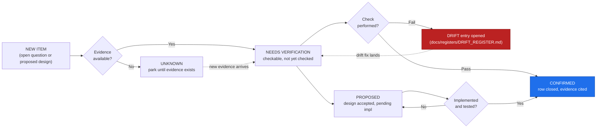

<!-- [KFM_META_BLOCK_V2]
doc_id: kfm://doc/domains-atmosphere-verification-backlog
title: Atmosphere — Verification Backlog
type: standard
version: v1
status: draft
owners: <atmosphere-domain-stewards>  # PLACEHOLDER — assign before review
created: 2026-05-16
updated: 2026-05-29
policy_label: public
related: [docs/domains/atmosphere/README.md, docs/domains/atmosphere/SOURCE_REGISTRY.md, docs/domains/atmosphere/UBIQUITOUS_LANGUAGE.md, docs/registers/VERIFICATION_BACKLOG.md, docs/registers/DRIFT_REGISTER.md, docs/doctrine/directory-rules.md, contracts/domains/atmosphere/, schemas/contracts/v1/domains/atmosphere/, policy/domains/atmosphere/, data/registry/sources/atmosphere/, release/candidates/atmosphere/, ai-build-operating-contract.md]
tags: [kfm, domain, atmosphere, air, climate, verification, backlog, governance]
notes: [CONTRACT_VERSION pinned 3.0.0 # domain-scoped companion to docs/registers/VERIFICATION_BACKLOG.md per Directory Rules §18 # all lane file paths PROPOSED until mounted-repo verification # source rights are the dominant blocker (§5) # air-vs-atmosphere slug drift is a confirmed open ADR item (ATM-OQ-09)]
[/KFM_META_BLOCK_V2] -->

# 🌬️ Atmosphere — Verification Backlog

> Tracking register of unresolved, checkable items for the **Atmosphere / Air / Climate** domain — what must be verified, what evidence would settle it, and which lane each item belongs to. This is a domain-scoped companion to the repo-wide [`docs/registers/VERIFICATION_BACKLOG.md`](../../registers/VERIFICATION_BACKLOG.md).

> [!NOTE]
> Badge targets are placeholder Shields.io endpoints. Replace with live endpoints once CI, registry, and release surfaces are wired.

**Status:** draft · **Owners:** TBD (atmosphere-domain-stewards) · **Updated:** 2026-05-29 · `CONTRACT_VERSION = "3.0.0"`

---

## Quick jump

- [1. Purpose](#1-purpose)
- [2. Scope and what this register is *not*](#2-scope-and-what-this-register-is-not)
- [3. Status legend](#3-status-legend)
- [4. Backlog flow](#4-backlog-flow)
- [5. Source rights and descriptor verification](#5-source-rights-and-descriptor-verification)
- [6. Knowledge-character registry verification](#6-knowledge-character-registry-verification)
- [7. Schema, contract, and validator verification](#7-schema-contract-and-validator-verification)
- [8. Pipeline and lifecycle verification](#8-pipeline-and-lifecycle-verification)
- [9. API and governed surface verification](#9-api-and-governed-surface-verification)
- [10. Evidence Drawer, Focus Mode, and MapLibre integration](#10-evidence-drawer-focus-mode-and-maplibre-integration)
- [11. Sensitivity and publication-posture verification](#11-sensitivity-and-publication-posture-verification)
- [12. Catalog, proof, and release closure](#12-catalog-proof-and-release-closure)
- [13. Rollback and correction verification](#13-rollback-and-correction-verification)
- [14. Cross-lane verification items](#14-cross-lane-verification-items)
- [15. Open questions register](#15-open-questions-register)
- [16. How to close a backlog item](#16-how-to-close-a-backlog-item)
- [17. Blocking-ADR index](#17-blocking-adr-index)
- [18. Definition of done](#18-definition-of-done)
- [19. Change log](#19-change-log)
- [Appendix A — Item ID convention](#appendix-a--item-id-convention)
- [Appendix B — Source family quick reference](#appendix-b--source-family-quick-reference)

---

## 1. Purpose

This register is the **domain-scoped checkable list** for Atmosphere / Air / Climate. It complements the repo-wide register at [`docs/registers/VERIFICATION_BACKLOG.md`](../../registers/VERIFICATION_BACKLOG.md) and surfaces unresolved items that belong specifically to this lane:

- Source rights, endpoint behavior, and freshness assumptions per source family.
- Knowledge-character discipline (`OBSERVED_SENSOR` vs `PUBLIC_AQI_REPORT` vs `REGULATORY_ARCHIVE` vs `LOW_COST_SENSOR` vs `ATMOSPHERIC_MODEL_FIELD` vs `REMOTE_SENSING_MASK` vs `CLIMATE_ANOMALY_CONTEXT` vs `DERIVED_FUSION` vs `METEOROLOGICAL_CONTEXT` vs `ALERT_AND_ADVISORY_CONTEXT` vs `NETWORK_AND_SITE_CONTEXT`).
- Pipeline, validator, governed-API, Evidence Drawer, Focus Mode, MapLibre, catalog, release, rollback, and correction surfaces — each at **PROPOSED** until mounted-repo evidence resolves it.
- Cross-lane interactions with **Hazards**, **Hydrology**, **Agriculture**, and **Biodiversity** lanes that depend on atmosphere knowledge-character labels.

Each row names **what must be true**, **what evidence would settle it**, and the **status** at last review.

> [!IMPORTANT]
> This register is **not** a roadmap and **not** a release manifest. It is a checkable list of unresolved items. A backlog row is closed by *evidence* (a file, schema, fixture, validator, receipt, manifest, ADR, or steward review record), not by promise or comment.

[Back to top ↑](#top)

---

## 2. Scope and what this register is *not*

| In scope | Out of scope |
|---|---|
| Items unique to Atmosphere/Air/Climate doctrine, sources, validators, surfaces, and policy posture. | Repo-wide doctrine items — track those in [`docs/registers/VERIFICATION_BACKLOG.md`](../../registers/VERIFICATION_BACKLOG.md). |
| Cross-lane items that *originate* in atmosphere knowledge-character labels (e.g., smoke context to Hazards). | Other domains' verification items (Hazards alerting, Hydrology gauges, etc.) — those belong in the sibling domain's `VERIFICATION_BACKLOG.md`. |
| Items checkable against repo evidence, source endpoints, schemas, fixtures, validators, manifests, receipts, or reviews. | Pure design speculation that no evidence could currently settle. Park those in [`docs/intake/NEW_IDEAS_INDEX.md`](../../intake/NEW_IDEAS_INDEX.md) (PROPOSED location). |
| Sensitivity items that gate public publication. | Operational emergency response — KFM Atmosphere is **not** an alerting system and never publishes life-safety instructions. |

> [!CAUTION]
> The boundary call in row four is doctrinal. The Atmosphere lane provides **context** (AQI reports, advisory references, smoke masks). It does not provide **warnings**, watches, or instructions. Hazards owns life-safety context and is *also* not an alert authority. Verification items that try to soften this boundary must be rejected, not tracked. [DOM-AIR] [DOM-HAZ] [ENCY]

[Back to top ↑](#top)

---

## 3. Status legend

| Label | Meaning | When applied |
|---|---|---|
| **CONFIRMED** | Verified this session from attached docs, repo evidence, tests, logs, or generated artifacts. | Doctrine and source-family lineage; cited from the Domains Culmination Atlas and Encyclopedia. |
| **PROPOSED** | Design, path, placement, or recommendation not yet verified in implementation. | Most lane-internal items: validator names, route names, exact paths, fixture sets. |
| **NEEDS VERIFICATION** | Checkable but not yet checked strongly enough to act as fact. | Anything resolvable by a single direct check (file presence, rights review, schema inspection). |
| **UNKNOWN** | Not resolvable without more evidence. | Implementation-maturity questions that need a mounted repo. |
| **DENY** | A default-deny rule; the item exists to *fail closed*, not to be implemented as a public path. | Sensitive locations, private joins, model-as-observed surfaces. |
| **EXTERNAL** | Sourced from authoritative external research. | External standards behavior; used as reference, never as KFM truth. Must be cited and contained. |

A row may carry composite status (e.g., *CONFIRMED doctrine / PROPOSED implementation*) when doctrine is settled but implementation is not — the most common case in this register.

[Back to top ↑](#top)

---

## 4. Backlog flow

A verification item moves through a small set of states. The diagram is illustrative of the intended discipline; it is not a workflow tool.

> [!NOTE]
> The **happy path** is `NEEDS VERIFICATION → CONFIRMED` with a cited evidence row. The **most common path in this domain right now** is `PROPOSED → PROPOSED` because the repository is not mounted and source rights have not been reviewed. Both paths are acceptable; the unacceptable path is `PROPOSED → silently treated as fact`.

[Back to top ↑](#top)

---

## 5. Source rights and descriptor verification

> [!WARNING]
> **Source rights are the dominant blocker for this lane.** Atmosphere/Air sources mix federal regulatory archives (EPA AQS), real-time agency feeds (AirNow), university-operated networks (Kansas Mesonet), and satellite products (GOES/ABI, VIIRS, MAIAC). Each carries distinct rights, attribution, cadence, and redistribution rules. **Public promotion is blocked until each source has a verified `SourceDescriptor` and recorded rights class.**

| ID | Item to verify | Source family | Evidence that would settle it | Status |
|---|---|---|---|---|
| ATM-SRC-001 | EPA AQS-like archive `SourceDescriptor` exists with rights, attribution, and cadence recorded. | EPA AQS / AirData | `data/registry/sources/atmosphere/aqs.source-descriptor.json` exists; rights validator passes. | NEEDS VERIFICATION |
| ATM-SRC-002 | AirNow `SourceDescriptor` records API-key requirement and `PRELIMINARY` posture for live AQI reports. | AirNow | `airnow.source-descriptor.json` records `requires_api_key: true`; `knowledge_character: PUBLIC_AQI_REPORT`; preliminary flag respected. | NEEDS VERIFICATION [C10-02] |
| ATM-SRC-003 | Kansas Mesonet ingest has **written consent** on file (contact: `kansas-wdl@k-state.edu`). | Kansas Mesonet | Consent letter or license file linked in source descriptor; fail-closed validator denies ingest without it. | NEEDS VERIFICATION |
| ATM-SRC-004 | OpenAQ-like aggregator rights review distinguishes aggregator-as-source from aggregator-as-pass-through. | OpenAQ-like | Source descriptor records `source_role` per upstream provider, not just aggregator. | NEEDS VERIFICATION [KFM-P13-PROG-0032] |
| ATM-SRC-005 | NOAA / NWS public-domain status and attribution requirements recorded per product. | NOAA / NWS | Per-product attribution clauses cited in descriptor; advisory products kept as `ALERT_AND_ADVISORY_CONTEXT`. | NEEDS VERIFICATION |
| ATM-SRC-006 | CAMS / ECMWF-family model fields license class recorded (open vs restricted). | CAMS / ECMWF | License file cited; redistribution class recorded; non-redistributable fields flagged with policy deny. | NEEDS VERIFICATION |
| ATM-SRC-007 | HRRR-Smoke / NOAA smoke-forecast model attribution and update cadence recorded. | HRRR-Smoke | Cadence and run-time metadata captured in descriptor; freshness rule defined. | NEEDS VERIFICATION [C10-02] |
| ATM-SRC-008 | NOAA HMS smoke product source role recorded (`REMOTE_SENSING_MASK`, **not** observation). | HMS smoke | Descriptor records `knowledge_character: REMOTE_SENSING_MASK`; never promoted to `OBSERVED_SENSOR`. | NEEDS VERIFICATION |
| ATM-SRC-009 | GOES/ABI AOD product source role recorded with sensor-platform metadata. | GOES/ABI AOD | Descriptor records platform, processing level, and `knowledge_character: REMOTE_SENSING_MASK`. | NEEDS VERIFICATION |
| ATM-SRC-010 | VIIRS / MODIS fire/hotspot products recorded as `REMOTE_SENSING_MASK`; FRP semantics documented. | VIIRS / FIRMS | Descriptor cites NRT latency; FRP threshold policy defined; never used as observed-fire truth without ground-truth corroboration. | NEEDS VERIFICATION |
| ATM-SRC-011 | MAIAC AOD validity statement linked from descriptor; threshold policy documented (degrade/quarantine). | MAIAC AOD | Descriptor cites validity context; threshold-driven actions are policy, not science absolutes. | NEEDS VERIFICATION |
| ATM-SRC-012 | Freshness probe (`ETag` / `Last-Modified`) defined for each live-fetch source. | All live sources | Probe scripts emit `RunReceipt` with `source_head{ETag, Last-Modified}`; stale-state policy defined. | NEEDS VERIFICATION |

> [!TIP]
> Closing rows in this section is the **highest-leverage work** in this lane. Without resolved source rights, every downstream row (validators, fixtures, surfaces, releases) is gated.

[Back to top ↑](#top)

---

## 6. Knowledge-character registry verification

The Atmosphere lane carries an **acute source-role anti-collapse requirement**: an `OBSERVED_SENSOR` reading, a `PUBLIC_AQI_REPORT`, a `REGULATORY_ARCHIVE` record, an `ATMOSPHERIC_MODEL_FIELD` cell, and a `LOW_COST_SENSOR` value **are not epistemically interchangeable**. Public output must label knowledge character and freshness. The Atlas §24.13 explicitly flags this lane: *"Source-role anti-collapse for observed/regulatory/modeled/aggregate is acute."* [DOM-AIR] [ENCY §24.13]

| ID | Item to verify | Evidence that would settle it | Status |
|---|---|---|---|
| ATM-KC-001 | Knowledge-character enum defined in atmosphere contract / schema. | `contracts/domains/atmosphere/knowledge_character.md` + `schemas/contracts/v1/domains/atmosphere/knowledge_character.schema.json` exist with the eleven CONFIRMED terms. | NEEDS VERIFICATION |
| ATM-KC-002 | Every source descriptor names exactly one `knowledge_character`. | Registry validator denies descriptors with missing or multi-valued knowledge character. | NEEDS VERIFICATION |
| ATM-KC-003 | `AQI` vs concentration distinction enforced by validator. | Negative fixture: descriptor that maps AQI value into a concentration field → DENY. | PROPOSED [DOM-AIR] [ENCY] |
| ATM-KC-004 | `AOD` vs PM2.5 distinction enforced by validator. | Negative fixture: AOD raster routed as PM2.5 surface → DENY. | PROPOSED [DOM-AIR] [ENCY] |
| ATM-KC-005 | Model field vs observation distinction enforced by validator. | Negative fixture: HRRR-Smoke surface promoted as observed smoke → DENY. | PROPOSED [DOM-AIR] [ENCY] |
| ATM-KC-006 | Low-cost sensor caveats required on public release. | Validator: published payload from `LOW_COST_SENSOR` lacking correction/caveats/confidence/limitations → DENY; FILTER-style QA label present. | PROPOSED [C10-02] [KFM-P27-PROG-0021] |
| ATM-KC-007 | Advisory-context products kept distinct from operational alerts. | Validator: `ALERT_AND_ADVISORY_CONTEXT` payloads never carry life-safety instructions; redirect to official source instead. | PROPOSED [DOM-HAZ] |
| ATM-KC-008 | Derived fusion products record their input knowledge characters and the policy for the fusion. | `DERIVED_FUSION` payload carries a `fusion_basis` array with per-input `knowledge_character`. | PROPOSED |
| ATM-KC-009 | Network/site context kept distinct from any observation derived from it. | `NETWORK_AND_SITE_CONTEXT` payloads do not carry observation values. | PROPOSED |
| ATM-KC-010 | Climate normals / anomalies record reference period and aggregation basis. | `CLIMATE_ANOMALY_CONTEXT` records baseline window and method; comparison surfaces show both. | PROPOSED |

[Back to top ↑](#top)

---

## 7. Schema, contract, and validator verification

> [!IMPORTANT]
> **Path slug is unsettled for this lane (see ATM-OQ-09).** Atlas §24.13 lists the Atmosphere responsibility root as `schemas/contracts/v1/air/` and `contracts/air/` (the `air` slug, **no** `domains/` segment), while Directory Rules §12 prescribes the lane pattern `schemas/contracts/v1/domains/<domain>/` → `schemas/contracts/v1/domains/atmosphere/`. This is confirmed **slug drift** (`air` vs `atmosphere`, and presence/absence of `domains/`). The paths below follow the Directory Rules §12 lane pattern because **Directory Rules outranks Atlas crosswalks** in the authority order, but the conflict is `CONFLICTED` until an ADR resolves it. [DIRRULES §12] [ENCY §24.13]

| ID | Item to verify | Evidence that would settle it | Status |
|---|---|---|---|
| ATM-SCH-001 | Atmosphere object families have machine schemas: `AirStation`, `AirObservation`, `PM2.5Observation`, `OzoneObservation`, `SmokeContext`, `AODRaster`, `WeatherStation`, `WeatherObservation`, `WindField`, `PrecipitationObservation`, `TemperatureObservation`, `ClimateNormal`, `ClimateAnomaly`, `ForecastContext`, `AdvisoryContext`. | Schemas present under the resolved schema root (see ATM-OQ-09); instance fixtures validate. | NEEDS VERIFICATION |
| ATM-SCH-002 | Each object family has a paired semantic contract (definition + invariants). | `contracts/domains/atmosphere/<object>.md` files exist; cross-link to schema by `$id`. | NEEDS VERIFICATION |
| ATM-SCH-003 | Identity rule fixed per object: `source_id + object_role + temporal_scope + normalized_digest` (PROPOSED deterministic basis). | Identity construction documented in contract; identity validator deterministic across runs. | PROPOSED [DOM-AIR] [ENCY] |
| ATM-SCH-004 | Temporal fields preserved as distinct columns: `source_time`, `observed_time`, `valid_time`, `retrieval_time`, `release_time`, `correction_time`. | Schema requires the temporal field set where material; validator denies collapsed times. | NEEDS VERIFICATION [DOM-AIR] [ENCY] |
| ATM-SCH-005 | Unit normalization rules defined per parameter (`µg/m³`, `ppb`, `mph`, `K`, `°C`, `mm`, `inches`). | Unit registry exists; converter-with-receipt is the only normalization path. | PROPOSED |
| ATM-SCH-006 | Unit normalization receipts emit per conversion. | `data/receipts/atmosphere/unit_conversion/*.json` with input/output unit, factor, source. | PROPOSED |
| ATM-SCH-007 | Validators emit finite outcomes (`ANSWER`, `ABSTAIN`, `DENY`, `ERROR`) per the governed-AI rule. | Validator return contract documented; tests cover all four. | PROPOSED [GAI] |
| ATM-SCH-008 | No-network fixtures cover happy and negative paths. | `tests/domains/atmosphere/no-network/` contains golden and invalid fixtures. | PROPOSED |
| ATM-SCH-009 | Validator parity between domain validator and any generic shared validator (no divergence). | CI parity test denies divergent error sets between domain validator and shared validator. | UNKNOWN |
| ATM-SCH-010 | `spec_hash` (JCS + SHA-256) computed deterministically for atmosphere artifacts. | Hash recompute test passes; tamper test fails closed. | NEEDS VERIFICATION |

[Back to top ↑](#top)

---

## 8. Pipeline and lifecycle verification

The atmosphere lane follows the CONFIRMED doctrine `RAW → WORK / QUARANTINE → PROCESSED → CATALOG / TRIPLET → PUBLISHED` with **promotion as a governed state transition, not a file move**. Stage gates below are stated in the Domains Culmination Atlas §11.H and remain PROPOSED in implementation. [DIRRULES] [DOM-AIR] [ENCY]

| Stage | Gate | Verification item | Status |
|---|---|---|---|
| **RAW** | `SourceDescriptor` exists. | ATM-PIPE-001: Connectors emit only to `data/raw/atmosphere/` or `data/quarantine/atmosphere/`; never to processed or published. | PROPOSED |
| **WORK / QUARANTINE** | Validation and policy gate pass, or quarantine reason recorded. | ATM-PIPE-002: Quarantine reasons enumerated (rights, sensitivity, unit, identity, geometry, time, schema, policy). | PROPOSED |
| **WORK / QUARANTINE** | Watcher-as-non-publisher invariant. | ATM-PIPE-003: Watchers emit `RunReceipt` and candidate decision rows; never write to `data/catalog/` or `data/published/`. | NEEDS VERIFICATION |
| **PROCESSED** | `EvidenceRef`, `ValidationReport`, and digest closure exist. | ATM-PIPE-004: Every processed object resolves an `EvidenceRef` to an `EvidenceBundle`. | PROPOSED |
| **CATALOG / TRIPLET** | Catalog/proof closure passes. | ATM-PIPE-005: Catalog record links source descriptor, evidence bundle, validation report, and policy decision. | PROPOSED |
| **PUBLISHED** | `ReleaseManifest`, correction path, rollback target, review/policy state exist. | ATM-PIPE-006: Public release blocked when any of the five gates is missing. | PROPOSED |
| **All stages** | Lifecycle skip prohibited. | ATM-PIPE-007: Negative test: pipeline writing directly from `data/raw/atmosphere/` to `data/published/layers/atmosphere/` → DENY. | PROPOSED |

[Back to top ↑](#top)

---

## 9. API and governed surface verification

> [!IMPORTANT]
> Public clients **must** read atmosphere data through the governed API (`apps/governed-api/`), not directly from canonical or internal stores. The trust membrane is the API; the MapLibre shell is a renderer, not a truth path. [MAP-MASTER] [GAI] [DIRRULES]

| ID | Surface | Item to verify | Status |
|---|---|---|---|
| ATM-API-001 | Atmosphere feature/detail resolver (route TBD). | Route lives under `apps/governed-api/`; returns `AtmosphereAirDecisionEnvelope` with finite outcomes (`ANSWER` / `ABSTAIN` / `DENY` / `ERROR`). | PROPOSED; exact route UNKNOWN |
| ATM-API-002 | Atmosphere layer manifest resolver. | Returns `LayerManifest` for public-safe layers only; private/restricted layers absent. | PROPOSED |
| ATM-API-003 | Evidence Drawer payload resolver. | Returns `EvidenceDrawerPayload` + `EvidenceBundle` projection filtered by policy and sensitivity. | PROPOSED |
| ATM-API-004 | Focus Mode answer surface. | Returns `RuntimeResponseEnvelope` + `AIReceipt`; AI is never root truth; cite-or-abstain holds. | PROPOSED [GAI] |
| ATM-API-005 | No-public-RAW invariant. | Static check: browser/client code does not import canonical raw store, model runtime, DB, object store, vector DB, or graph clients. | PROPOSED |
| ATM-API-006 | Governed API enforces rate, scope, and sensitivity. | Negative tests: attempts to fetch sensitive-redacted fields without authorization → DENY. | PROPOSED |
| ATM-API-007 | API never reads `RAW / WORK / QUARANTINE`. | CI route test: assertion that responses cite only PROCESSED+CATALOG-projected evidence. | PROPOSED |

[Back to top ↑](#top)

---

## 10. Evidence Drawer, Focus Mode, and MapLibre integration

| ID | Item to verify | Evidence that would settle it | Status |
|---|---|---|---|
| ATM-UI-001 | Evidence Drawer renders atmosphere `EvidenceBundle` projection (source, time, knowledge character, freshness, policy, review state). | Component-level test: drawer mounts for an atmosphere feature and displays all required fields. | PROPOSED |
| ATM-UI-002 | Focus Mode citation validation passes for atmosphere answers. | E2E test: generated answer carries `AIReceipt`; citation validator confirms every claim resolves to an `EvidenceBundle`. | PROPOSED [GAI] |
| ATM-UI-003 | MapLibre shell loads atmosphere layers via `LayerManifest`, not direct tile URLs. | Static check + route test: tile load path goes through governed manifest resolver. | PROPOSED [MAP-MASTER] |
| ATM-UI-004 | Time slider correctly distinguishes `observed_time` vs `valid_time` for time-series layers. | Component test: slider movement updates `observed_time` window, not `release_time`. | PROPOSED |
| ATM-UI-005 | Compare mode preserves source-role and knowledge-character badges per layer. | Visual test: badges visible for each layer; comparing `OBSERVED_SENSOR` to `ATMOSPHERIC_MODEL_FIELD` is labeled. | PROPOSED |
| ATM-UI-006 | Stale-state badge renders when freshness threshold is exceeded. | Component test: layer with `retrieval_time` beyond freshness window shows stale badge. | PROPOSED |
| ATM-UI-007 | Public AQI report layer redirects to official-source links for life-safety queries. | Component test: clicking an `ALERT_AND_ADVISORY_CONTEXT` feature shows official-source redirection. | PROPOSED [DOM-HAZ] |

[Back to top ↑](#top)

---

## 11. Sensitivity and publication-posture verification

> [!CAUTION]
> Atmosphere data is **public by default** (T0). Sensitivity exposure most often arises from **joins** — combining station locations with private property, demographic, or sensitive-species layers. Those joins fail closed by policy. [ENCY §24.5] [DOM-AIR] [DOM-SETTLE]

| ID | Posture | Item to verify | Status |
|---|---|---|---|
| ATM-POL-001 | AQI ≠ concentration. | Policy denies any public surface that exposes an AQI value typed as a concentration value. | PROPOSED [DOM-AIR] [ENCY] |
| ATM-POL-002 | AOD ≠ PM2.5. | Policy denies any public surface that maps AOD raster cells into PM2.5 concentration fields. | PROPOSED [DOM-AIR] [ENCY] |
| ATM-POL-003 | Model ≠ observed. | Policy denies any public layer that styles a model field with the same color ramp and label as an observation layer without an explicit "Model" badge. | PROPOSED [DOM-AIR] [ENCY] |
| ATM-POL-004 | Low-cost sensor public release requires correction, caveats, confidence, and limitations. | Public release validator denies low-cost sensor publication missing any of the four; Barkjohn correction version pinned. | PROPOSED [C10-02] |
| ATM-POL-005 | Private joins (sensor location × private address × demographic data) fail closed. | Policy test: join combining station coords with private demographic field → DENY. | PROPOSED [DOM-SETTLE] |
| ATM-POL-006 | Unreviewed exact sensitive locations or private data are denied. | DENY-by-default policy test passes; `RedactionReceipt` required for any sensitivity-transform. | DENY |
| ATM-POL-007 | Source-role mismatch fails closed. | Negative fixture: regulatory archive used as live observation → DENY. | PROPOSED [DOM-AIR] |
| ATM-POL-008 | Promotion blocked on unresolved rights, source role, sensitivity, or release state. | Promotion validator denies missing-evidence cases; CI exercises each. | PROPOSED [ENCY] [DIRRULES] |

[Back to top ↑](#top)

---

## 12. Catalog, proof, and release closure

> [!NOTE]
> Standards behavior below (STAC, DCAT, PROV, DSSE/cosign, Rekor, BLAKE3/bao, PMTiles) is **EXTERNAL** reference and must be verified against current upstream docs before being treated as fact. The KFM-side requirement (that these artifacts exist and are wired) remains PROPOSED until repo inspection.

| ID | Item to verify | Evidence that would settle it | Status |
|---|---|---|---|
| ATM-REL-001 | Atmosphere catalog records (STAC-aligned, PROPOSED) exist for one thin-slice layer. | One STAC item under `data/catalog/domain/atmosphere/` validates against catalog schema; links to `EvidenceBundle`. | PROPOSED |
| ATM-REL-002 | `ReleaseManifest` exists for one published atmosphere layer. | Manifest under `release/candidates/atmosphere/` links evidence, validation, policy decision, and rollback target. | PROPOSED |
| ATM-REL-003 | `spec_hash` reproducibility gate blocks drift. | Reproducibility CI: recomputed hash matches receipt. | PROPOSED |
| ATM-REL-004 | DSSE attestation present on release predicates. | `cosign verify-attestation` passes for atmosphere release artifact. | PROPOSED / EXTERNAL |
| ATM-REL-005 | Rekor inclusion proof recorded for signed receipts. | Transparency-log entry UUID recorded in release manifest. | PROPOSED / EXTERNAL |
| ATM-REL-006 | PMTiles integrity (BLAKE3 / bao byte-range proofs) verifiable. | `bao verify` succeeds against published PMTiles archive. | PROPOSED / EXTERNAL |
| ATM-REL-007 | Catalog-to-published linkage validated. | Catalog record's `release_id` resolves to a `ReleaseManifest`; round-trip CI passes. | PROPOSED |

[Back to top ↑](#top)

---

## 13. Rollback and correction verification

| ID | Item to verify | Evidence that would settle it | Status |
|---|---|---|---|
| ATM-RB-001 | Every atmosphere release carries a `RollbackCard`. | Per-release rollback target validates and points to prior `ReleaseManifest`. | PROPOSED |
| ATM-RB-002 | Rollback drill restores prior manifest. | Dry-run drill: forward release → rollback → restored prior layer surface; receipt emitted. | PROPOSED |
| ATM-RB-003 | Correction lineage enforces supersession chain. | `CorrectionNotice` requires `superseded_release_id`; CI denies missing chain. | PROPOSED |
| ATM-RB-004 | Stale-state rule defined per source. | Stale-state policy file lists freshness threshold per source; runtime emits stale badge accordingly. | PROPOSED |
| ATM-RB-005 | Correction path documented for public users. | Public docs link from atmosphere layer → "Report a correction" route. | PROPOSED |

[Back to top ↑](#top)

---

## 14. Cross-lane verification items

Atmosphere knowledge informs adjacent lanes. These rows track items where atmosphere must *expose* a labeled product that another lane consumes — the relation must preserve ownership, source role, sensitivity, and `EvidenceBundle` support. [DOM-AIR] [ENCY]

| ID | Adjacent lane | Relation | Item to verify | Status |
|---|---|---|---|---|
| ATM-X-001 | **Hazards** | Smoke, heat/cold, advisory, visibility, fire/emissions context. | Atmosphere `SmokeContext` exposes labeled `knowledge_character` and freshness; Hazards consumes only via governed surface, not direct read. | NEEDS VERIFICATION |
| ATM-X-002 | **Hazards** | KFM is not an alert authority. | Boundary test: atmosphere advisory payload never carries life-safety imperative text. | PROPOSED [DOM-HAZ] |
| ATM-X-003 | **Hydrology** | Precipitation, drought, flood-weather forcing. | Cross-lane join honors atmosphere knowledge character; precipitation observation vs model field distinction preserved downstream. | PROPOSED [DOM-HYD] |
| ATM-X-004 | **Agriculture** | Heat, smoke, precipitation, vegetation stress. | Atmosphere context used by agriculture lane carries source role and uncertainty; private-join denial defaults apply. | PROPOSED [DOM-AG] |
| ATM-X-005 | **Biodiversity (Habitat / Fauna / Flora)** | Phenology, smoke, fire, drought stress. | Atmosphere products consumed by biodiversity lanes never expose sensitive species locations through join inference. | DENY (default) / PROPOSED (validator) |
| ATM-X-006 | **Geology** | Drought / climate context for surficial geology. | Atmosphere climate anomaly products carry baseline-period metadata when joined to surficial geology. | PROPOSED |
| ATM-X-007 | **Settlements / Infrastructure** | Exposure summaries reference atmosphere context. | Exposure summaries do not collapse atmosphere model field into operational alert. | PROPOSED [DOM-SETTLE] |

[Back to top ↑](#top)

---

## 15. Open questions register

Unresolved doctrinal or design questions that cannot be settled by a single evidence row. Tracked here until resolved by **ADR**, **steward decision**, **mounted-repo inspection**, or **source-rights review**.

| ID | Question | Owner role | Resolution path | Status |
|---|---|---|---|---|
| ATM-OQ-01 | Knowledge-character enum location: atmosphere-local (`contracts/domains/atmosphere/`) or shared (`contracts/cross_domain/`)? | Schema owner | ADR (relates to ADR-S-04 source-role enum) | NEEDS VERIFICATION |
| ATM-OQ-02 | Canonical climate-normals baseline (1991–2020 NOAA, 1981–2010, or per-source)? Affects `ClimateAnomaly`. | Atmosphere steward | Steward decision + source review | NEEDS VERIFICATION |
| ATM-OQ-03 | Is any low-cost sensor source admitted for public layers, or quarantined-by-default pending reference-monitor calibration? | Atmosphere steward | ADR / policy decision | PROPOSED (lean: quarantine-unless-calibrated) |
| ATM-OQ-04 | Where does the public advisory-source redirect live — Evidence Drawer, layer callout, or both? | UI owner | Design decision | PROPOSED (lean: both) |
| ATM-OQ-05 | When does first live-fetch land, behind which flag? | Atmosphere steward | Gate on ATM-SRC-001…005 closing | PROPOSED |
| ATM-OQ-06 | MAIAC AOD threshold policy (e.g., degrade/quarantine thresholds from operational guidance). | Atmosphere steward | Policy decision; thresholds are policy not science | NEEDS VERIFICATION / EXTERNAL |
| ATM-OQ-07 | VIIRS / FIRMS FRP threshold policy (escalate/quarantine thresholds). | Atmosphere steward | Policy decision | NEEDS VERIFICATION / EXTERNAL |
| ATM-OQ-08 | Kansas Mesonet consent mechanics: one-time license file or per-deployment renewal? | Atmosphere steward | Direct contact `kansas-wdl@k-state.edu` | NEEDS VERIFICATION |
| ATM-OQ-09 | **Schema/contract slug drift.** Atlas §24.13 uses `schemas/contracts/v1/air/` + `contracts/air/`; Directory Rules §12 uses `schemas/contracts/v1/domains/atmosphere/`. Both the slug (`air` vs `atmosphere`) and the `domains/` segment differ. | Directory Rules owner + schema owner | **ADR.** Directory Rules §12 governs in the authority order; Atlas row is a shorthand crosswalk. CONFLICTED until ADR lands. | CONFLICTED [DIRRULES §12] [ENCY §24.13] |

> [!WARNING]
> **ATM-OQ-09 is load-bearing.** Every schema/contract path in §7 depends on its resolution. This document follows the Directory Rules §12 lane pattern (`domains/atmosphere/`) because Directory Rules outranks Atlas crosswalks, but the discrepancy is real and confirmed (the deep-research slug-drift register lists Roads, People, and Settlements with the same class of drift). Do not treat either path as canonical until the ADR is accepted; log the chosen path in `DRIFT_REGISTER.md` when it lands.

[Back to top ↑](#top)

---

## 16. How to close a backlog item

A row is closed by **evidence**, not by promise:

1. **Find the row** by ID (e.g., `ATM-SRC-003`).
2. **Produce the cited evidence**: file path, schema URI, fixture, validator name, test name, receipt path, manifest, ADR ID, or steward review record.
3. **Update the row status** to `CONFIRMED` and add the evidence pointer in a short inline note.
4. **If the check failed**, do not silently downgrade the row. Open a drift entry in [`docs/registers/DRIFT_REGISTER.md`](../../registers/DRIFT_REGISTER.md) with the failure mode and a remediation plan.
5. **Reference the closure in the PR** that lands the supporting change.

> [!NOTE]
> Closing a row in this domain register **does not** close the matching repo-wide row in [`docs/registers/VERIFICATION_BACKLOG.md`](../../registers/VERIFICATION_BACKLOG.md). Both rows close together only when the doctrine and the implementation match end-to-end.

[Back to top ↑](#top)

---

## 17. Blocking-ADR index

The open ADRs whose resolution unblocks rows in this register. ADR-S series from Atlas §24.12 master open-ADR backlog. [ENCY §24.12]

| ADR | Topic | Rows it unblocks |
|---|---|---|
| **ADR-S-03** | Receipt class home (`receipts/` vs per-domain `receipts/`). | ATM-SCH-006, ATM-REL-* receipts |
| **ADR-S-04** | Source-role enum — canonical vocabulary, evolution rule. | ATM-KC-001…002, ATM-OQ-01 |
| **ADR-S-05** | Sensitivity tier scheme (T0–T4) — adopt as canonical. | §11 ATM-POL-* tier references |
| **ADR-S-06** | AI surface boundary (Focus Mode vs open AI). | ATM-API-004, ATM-UI-002 |
| **(new) ADR-AIR-PATH** | Resolve `air` vs `atmosphere` slug + `domains/` segment. | ATM-OQ-09, all §7 schema/contract rows |

[Back to top ↑](#top)

---

## 18. Definition of done

This register is done enough to enter the repository when:

- it is placed according to Directory Rules (`docs/domains/atmosphere/`, §18 companion-register pattern);
- a docs steward and the Atmosphere / Air domain steward review it;
- it is linked from `docs/domains/atmosphere/README.md` and the repo-wide `VERIFICATION_BACKLOG.md`;
- the slug-drift question (ATM-OQ-09) is logged in `DRIFT_REGISTER.md` even if not yet resolved;
- it does not conflict with accepted ADRs;
- the `GENERATED_RECEIPT.json` planned in the PR is wired into CI;
- future changes follow the operating contract's §37 lifecycle.

[Back to top ↑](#top)

---

## 19. Change log

| Date | Change | By | Notes |
|---|---|---|---|
| 2026-05-16 | Initial draft of domain-scoped verification backlog. | TBD | Seeded from Domains Culmination Atlas §11.N, §24, Encyclopedia §7, Unified Manual, and air-quality stack (C10-02). |
| 2026-05-29 | Completed: meta block normalized to inline form; `CONTRACT_VERSION` pinned; ATM-OQ-09 sharpened to CONFLICTED with §24.13 vs §12 evidence; EXTERNAL/standards rows labeled; open-questions converted to a table; blocking-ADR index + definition-of-done added. | Claude (AI-authored; pending review) | Per `GENERATED_RECEIPT.json` plan; human review required. |
| YYYY-MM-DD | _next change_ | _author_ | _short note + linked PR_ |

[Back to top ↑](#top)

---

## Appendix A — Item ID convention

Domain-scoped IDs follow the pattern `ATM-<LANE>-<NNN>`:

| Lane code | Meaning |
|---|---|
| `SRC` | Source rights and descriptor verification (§5). |
| `KC` | Knowledge-character registry verification (§6). |
| `SCH` | Schema, contract, and validator verification (§7). |
| `PIPE` | Pipeline and lifecycle verification (§8). |
| `API` | Governed API and surface verification (§9). |
| `UI` | Evidence Drawer / Focus Mode / MapLibre integration (§10). |
| `POL` | Sensitivity and publication-posture verification (§11). |
| `REL` | Catalog, proof, and release closure (§12). |
| `RB` | Rollback and correction verification (§13). |
| `X` | Cross-lane verification items (§14). |
| `OQ` | Open questions (§15). |

IDs are stable across revisions; rows are not renumbered. A retired row is marked `RETIRED` with a forwarding pointer.

[Back to top ↑](#top)

---

## Appendix B — Source family quick reference

> [!NOTE]
> Quick-reference for the source families in §5. Authoritative rights and behavior live in each source's descriptor under `data/registry/sources/atmosphere/` (PROPOSED path).

| Source family | Typical role | Typical knowledge character | Live-fetch posture | Rights status (this run) |
|---|---|---|---|---|
| EPA AQS / AirData | Regulatory archive | `REGULATORY_ARCHIVE` | Periodic, archival cadence. | NEEDS VERIFICATION |
| AirNow | Public AQI reporting | `PUBLIC_AQI_REPORT` | Live with API key; `PRELIMINARY` posture. | NEEDS VERIFICATION |
| Kansas Mesonet | Mesoscale observations | `OBSERVED_SENSOR` | Live; **written consent required**. | NEEDS VERIFICATION |
| NOAA / NWS | Observations + advisory context | `OBSERVED_SENSOR` / `METEOROLOGICAL_CONTEXT` / `ALERT_AND_ADVISORY_CONTEXT` | Live. | NEEDS VERIFICATION |
| OpenAQ-like aggregators | Aggregator over upstream sources | varies by upstream | Live. | NEEDS VERIFICATION |
| CAMS / ECMWF | Model fields | `ATMOSPHERIC_MODEL_FIELD` | Periodic runs. | NEEDS VERIFICATION |
| HRRR-Smoke | Smoke-forecast model | `ATMOSPHERIC_MODEL_FIELD` | Periodic runs. | NEEDS VERIFICATION |
| NOAA HMS | Smoke mask product | `REMOTE_SENSING_MASK` | Periodic. | NEEDS VERIFICATION |
| GOES / ABI AOD | Satellite AOD | `REMOTE_SENSING_MASK` | Near-real-time. | NEEDS VERIFICATION |
| VIIRS / MODIS / FIRMS | Fire / hotspot detections | `REMOTE_SENSING_MASK` | NRT. | NEEDS VERIFICATION |
| MAIAC AOD (MCD19 / VNP19) | AOD product | `REMOTE_SENSING_MASK` | Periodic. | NEEDS VERIFICATION |

[Back to top ↑](#top)

---

**Related docs:** [`README.md`](README.md) · [`SOURCE_REGISTRY.md`](SOURCE_REGISTRY.md) · [`UBIQUITOUS_LANGUAGE.md`](UBIQUITOUS_LANGUAGE.md) · [`../../registers/VERIFICATION_BACKLOG.md`](../../registers/VERIFICATION_BACKLOG.md) · [`../../registers/DRIFT_REGISTER.md`](../../registers/DRIFT_REGISTER.md) · [`../../doctrine/directory-rules.md`](../../doctrine/directory-rules.md)
 
**Cross-lane registers (sibling, TODO):** [`../hazards/VERIFICATION_BACKLOG.md`](../hazards/VERIFICATION_BACKLOG.md) · [`../hydrology/VERIFICATION_BACKLOG.md`](../hydrology/VERIFICATION_BACKLOG.md) · [`../agriculture/VERIFICATION_BACKLOG.md`](../agriculture/VERIFICATION_BACKLOG.md)
 
**Last updated:** 2026-05-29 · **Status:** draft · **Path status:** PROPOSED · `CONTRACT_VERSION = "3.0.0"` · [Back to top ↑](#top)
