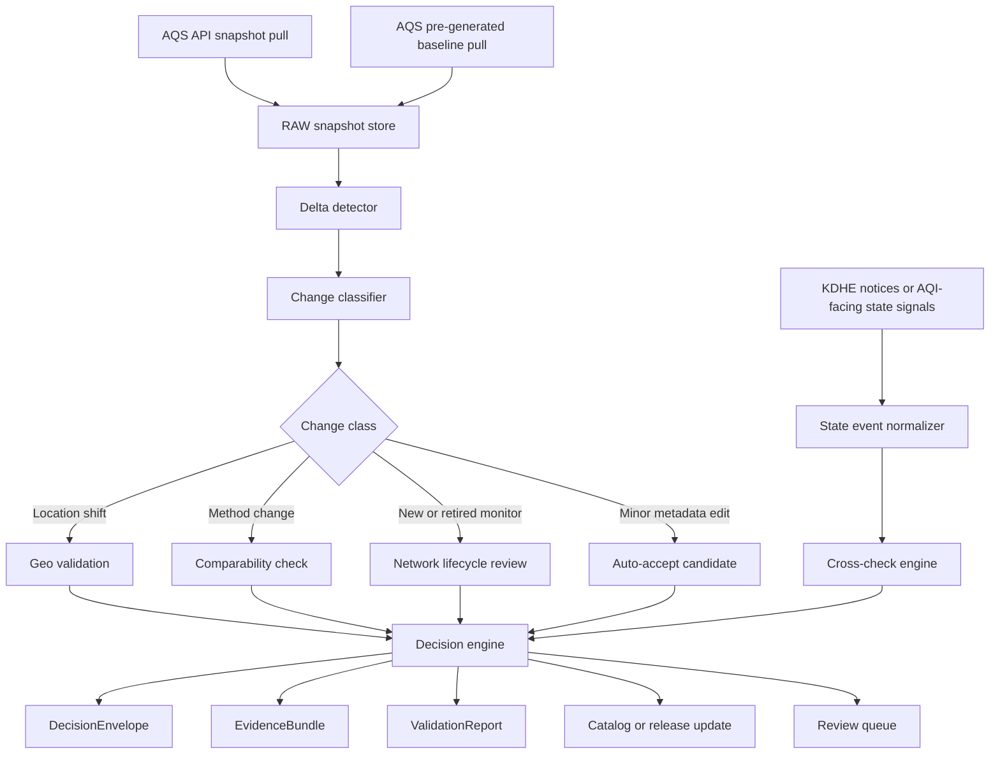
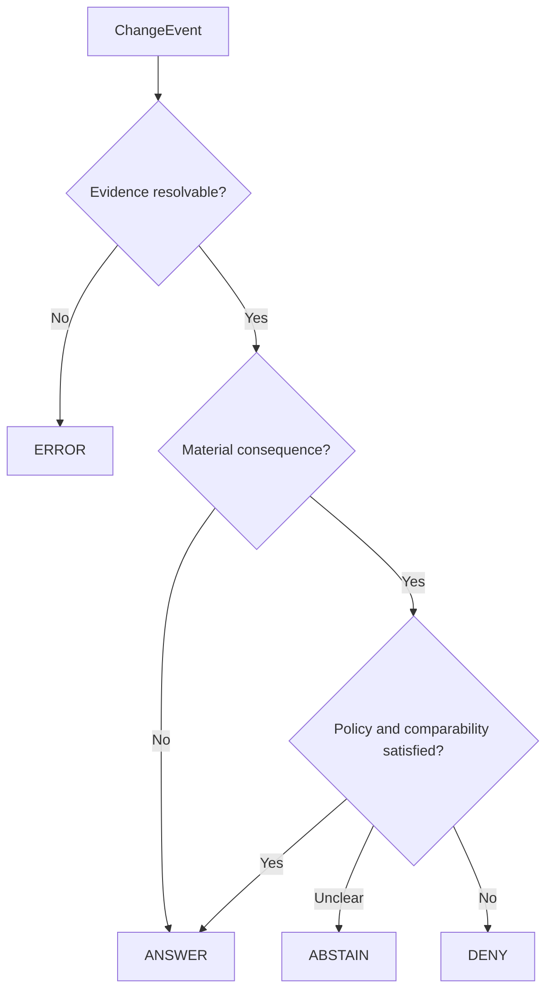

<!-- [KFM_META_BLOCK_V2]
doc_id: kfm://doc/NEEDS-VERIFICATION-AQS-DELTA-PIPELINE
title: EPA AQS Delta Ingestion and Trust-Gated Publication Spec
type: standard
version: v1
status: draft
owners: @bartytime4life, NEEDS VERIFICATION
created: NEEDS VERIFICATION
updated: 2026-04-09
policy_label: public
related: [./README.md, ./comparability-rules.md, ./kdhe-operational-signals.md, ./source-roster.md, ../README.md, ../aqs-airnow-hydrologic-baselines.md, ../../README.md, ../../../governance/ROOT_GOVERNANCE.md, ../../../governance/ETHICS.md, ../../../governance/SOVEREIGNTY.md]
tags: [kfm, air, atmosphere, aqs, kdhe, provenance, delta]
notes: [Merged from two uploaded drafts on 2026-04-09, broken oaicite placeholders removed, external-source basis refreshed against official EPA and KDHE pages, path owners dates and exact schema inventory remain NEEDS VERIFICATION.]
[/KFM_META_BLOCK_V2] -->

# EPA AQS Delta Ingestion and Trust-Gated Publication Spec

Detect, classify, and govern meaningful EPA AQS monitor and metadata changes without letting silent upstream drift become downstream truth.

> [!IMPORTANT]
> This document is a **governed specification**, not a claim of already-verified runtime implementation. Where the current session did not directly verify code, workflows, emitted receipts, or release behavior, the language stays **PROPOSED**, **INFERRED**, or **NEEDS VERIFICATION**.

| Status | Owners | Repo fit | Quick jump |
|---|---|---|---|
|    | `@bartytime4life`, `NEEDS VERIFICATION` | `docs/domains/air/atmosphere/aqs-delta-pipeline.md` **PROPOSED / NEEDS VERIFICATION** | [Scope](#scope) · [Evidence posture](#source-basis-and-evidence-posture) · [Inputs](#accepted-inputs) · [Architecture](#operating-architecture) · [Contracts](#contracts-and-artifacts) · [Decision model](#decision-model) · [Workflow](#delta-workflow) · [DoD](#task-list-and-definition-of-done) |

## Scope

This spec defines the **AQS delta lane** for the atmosphere domain:

- ingest **authoritative EPA AQS metadata and measurement-supporting descriptors**
- detect changes between snapshots
- classify those changes by operational significance
- require trust-gated decisions before catalog-facing publication or downstream reuse
- preserve enough evidence to explain *what changed, when, why it matters, and what was done about it*

This is the lane that turns “the upstream API changed” into a governed, inspectable outcome rather than an invisible mutation.

## Source basis and evidence posture

This merged edition keeps the strongest structure from both drafts and replaces broken placeholder citations with directly usable source references.

### Status labels used here

| Label | Meaning |
|---|---|
| **CONFIRMED** | Directly supported by the attached drafts and/or current official source pages listed in this file. |
| **INFERRED** | Strongly implied by the combined drafts and KFM doctrine, but not directly surfaced as mounted implementation evidence. |
| **PROPOSED** | Recommended design or packaging move that goes beyond what the visible evidence proves. |
| **NEEDS VERIFICATION** | Path, owner, schema, repo, workflow, or runtime details were not directly verified in the current session. |

### Current official confirmations

- **CONFIRMED:** EPA describes the AQS API as the primary place to obtain row-level AQS data, says AQS includes ambient sample data, station descriptions, geographic location, and quality information, and states that AQS is **not real-time** and may lag collection by six months or more. See [EPA AQS API].
- **CONFIRMED:** EPA documents `cbdate` and `cedate` as filters on each value’s **date of last change**. See [EPA AQS API].
- **CONFIRMED:** EPA publishes pre-generated data files and states that the same data is also available through the API. EPA also points users to AirNow for current data and AQS/AirData for historical data. See [EPA Pre-Generated Files], [EPA Access FAQ], and [EPA Obtaining AQS Data].
- **CONFIRMED:** KDHE says its Air Monitoring Data page provides the most current AQI and hourly averaged data available, but that the values have **not** been subjected to QA review, should not be considered final until certified by staff, and may include invalid data caused by outages or equipment malfunctions. See [KDHE Air Monitoring Data].
- **CONFIRMED:** KDHE exposes the air monitoring page alongside annual network plans and assessments in its Air section. See [KDHE Air Program].

## Repo fit

**Path:** `docs/domains/air/atmosphere/aqs-delta-pipeline.md` **PROPOSED / NEEDS VERIFICATION**

**Upstream**
- [`./README.md`](./README.md) — atmosphere lane overview
- [`../README.md`](../README.md) — air domain framing
- [`../aqs-airnow-hydrologic-baselines.md`](../aqs-airnow-hydrologic-baselines.md) — baseline separation between authoritative AQS and provisional overlays
- [`../../../governance/ROOT_GOVERNANCE.md`](../../../governance/ROOT_GOVERNANCE.md) — governing trust posture
- [`../../../governance/ETHICS.md`](../../../governance/ETHICS.md) — ethics constraints
- [`../../../governance/SOVEREIGNTY.md`](../../../governance/SOVEREIGNTY.md) — sovereignty and sensitivity constraints

**Downstream**
- `./comparability-rules.md` — method and monitor comparability rules
- `./kdhe-operational-signals.md` — state operational corroboration layer
- `./source-roster.md` — source inventory and descriptor register
- `schemas/` — **NEEDS VERIFICATION** exact file inventory

### Recommended companion layout

```text
docs/domains/air/
├── README.md                                  # NEEDS VERIFICATION
└── atmosphere/
    ├── aqs-delta-pipeline.md                  # this spec
    ├── comparability-rules.md                 # PROPOSED
    ├── source-roster.md                       # PROPOSED
    ├── kdhe-operational-signals.md            # PROPOSED
    └── schemas/                               # PROPOSED / NEEDS VERIFICATION
        ├── source-descriptor.schema.json
        ├── source-snapshot.schema.json
        ├── change-event.schema.json
        ├── validation-report.schema.json
        ├── decision-envelope.schema.json
        └── evidence-bundle.schema.json
```

## Accepted inputs

This spec is for **AQS delta detection**, not general air-data ingestion.

| Input family | Role here | Status |
|---|---|---|
| EPA AQS API `list/*` endpoints | Controlled vocabularies for parameters, methods, sites, monitors, and codes | **CONFIRMED** |
| EPA AQS `monitors` metadata | Station identity, dates, method context, monitor lineage, spatial reference fields | **CONFIRMED** |
| EPA AQS measurement-facing services | Change context for method, parameter, and monitor validity planning | **CONFIRMED** |
| AQS `cbdate` / `cedate` filters | Incremental “date of last change” retrieval windows | **CONFIRMED** |
| EPA pre-generated files | Bulk baseline / reconciliation source | **CONFIRMED** |
| KDHE notices / AQI-facing operational signals | Secondary corroboration lane for divergences or early operational changes | **INFERRED** for repo use, **CONFIRMED** as a valid external source family |
| Prior AQS snapshot artifacts | Previous-state comparison input | **INFERRED** as necessary system input |
| Run receipts / evidence objects / release manifests | Publication proof objects for the KFM trust path | **INFERRED** from KFM doctrine |

### Accepted temporal patterns

- **Scheduled delta pulls** using AQS change-window filters (`cbdate`, `cedate`)
- **Periodic full snapshots** for rollback, reconciliation, and lineage support
- **Event-side checks** against KDHE public operational signals where useful
- **Explicit bootstrap mode** when no trustworthy prior comparable snapshot exists

## Exclusions

This file does **not** define the whole air domain.

| Out of scope here | Goes instead |
|---|---|
| Real-time public AQI interpretation | `../aqs-airnow-hydrologic-baselines.md` and related public overlay docs |
| OpenAQ / PurpleAir / fused PM workflows | adjacent air-network or fusion documentation |
| Climate anomaly layers | broader air-and-climate lane docs |
| Smoke masking, EO-derived surfaces, satellite collocation | atmosphere or remote-sensing docs outside this delta lane |
| Full schema inventory or emitted runtime examples | `schemas/` and implementation artifacts, **NEEDS VERIFICATION** |
| Direct publication of provisional KDHE values as authoritative | explicitly excluded by this spec |

> [!CAUTION]
> AQS is **authoritative** and historically deep, but it is **not real-time**. This pipeline exists partly because authoritative systems can change quietly and late, and because operational-state signals can diverge from the eventual regulatory record.

## Operating posture

### Source precedence

1. **AQS authoritative record**  
   Canonical for regulatory-grade metadata and historically defensible air-quality records.

2. **KDHE operational corroboration**  
   Useful for early warning, divergence detection, and explaining temporary operational changes.

3. **Derived or public-facing overlays**  
   Never allowed to silently redefine the authoritative AQS baseline in this lane.

### Knowledge-character separation

| Knowledge character | Example | Allowed role in this spec |
|---|---|---|
| Authoritative observed / regulatory | EPA AQS | primary source of truth |
| Operational public reporting | KDHE public monitoring or AQI-facing notices | corroboration only |
| Modeled / assimilated | CAMS, anomaly surfaces | excluded from delta authority |
| Community / low-cost / aggregated | PurpleAir, OpenAQ aggregation | excluded from canonical delta decisions |

### Why this belongs in a domain lane

This spec sits at the intersection of:

- authoritative environmental metadata intake
- governed publication
- evidence-visible change detection
- authoritative-vs-operational source reconciliation
- comparability protection for downstream maps and series

It is therefore not just an ETL note; it is a domain standard with governance consequences.

## Operating architecture



## Design principles

### 1. Delta before publication

This lane is not “fetch and overwrite.”  
It is **fetch → compare → classify → decide → prove → publish or abstain**.

### 2. AQS identity is method-aware

A monitor series is not safely defined by site alone. At minimum, change reasoning should remain sensitive to:

- state code
- county code
- site number
- parameter code
- POC
- monitor and method context where available

### 3. Quiet upstream drift is a trust event

A moved monitor, swapped method, changed start/end date, or newly retired site is not cosmetic when downstream time series, maps, or derived summaries depend on comparability.

### 4. Evidence-first negative outcomes are valid outcomes

The correct outcome is sometimes:

- **ABSTAIN**
- **HELD FOR REVIEW**
- **DENY**
- **ERROR**
- **PUBLISH WITH OBLIGATIONS**

Not every delta deserves auto-publish.

### 5. Operational signals are advisory, not sovereign

KDHE operational pages may corroborate or warn, but they must not silently override authoritative EPA history.

## Contracts and artifacts

The KFM corpus already converges on a small contract family for intake, validation, decision, and release. This doc applies that family narrowly to AQS deltas.

### Minimum working contract set

| Artifact | Purpose in this lane | Minimum contents |
|---|---|---|
| `SourceDescriptor` | Declares the AQS source contract | identity, owner/steward, access mode, cadence, rights posture, validation plan, publication intent |
| `SourceSnapshot` | Freezes one fetch result for comparison | source ref, request window, fetch time, content hash, output pointer |
| `ChangeEvent` | Expresses one detected difference | subject key, old value, new value, change class, materiality level |
| `ValidationReport` | Records checks run on the change | check names, severities, outcomes, notes |
| `DecisionEnvelope` | Machine-readable publish / hold / abstain result | subject, action, result, reason codes, obligation codes, audit ref, effective window |
| `EvidenceBundle` | Human- and machine-review support pack | previous snapshot, current snapshot, diff, validation refs, corroboration refs |
| `ReleaseManifest` | Records what was allowed outward | changed subjects, decision refs, catalog refs, rollback posture |
| `CorrectionNotice` | Preserves visible lineage after bad release or supersession | affected releases, cause, replacement refs, public note |

### Recommended identity shape

Use a stable, monitor-aware identity for subjects under review.

```text
<state_code>-<county_code>-<site_number>-<parameter_code>-<POC>
```

Where monitor or method distinctions materially affect comparability, retain them as linked fields rather than flattening them away.

> [!NOTE]
> This identity shape is a **practical minimum**, not a claim that every downstream dataset already uses it unchanged.

## Change classes and default actions

| Change class | Typical example | Default action | Rationale |
|---|---|---|---|
| `MINOR_METADATA_EDIT` | spelling fix, non-semantic text tweak | auto-accept candidate | low comparability risk |
| `LOCATION_SHIFT_MINOR` | coordinate move within small threshold | review | spatial meaning can still matter |
| `LOCATION_SHIFT_MATERIAL` | lat/lon moved beyond tolerance | hold for geo review | spatial continuity risk |
| `METHOD_CHANGE` | method code or method name changed | hard flag | comparability risk |
| `MONITOR_NEW` | new monitor appears | review network update | new lineage branch |
| `MONITOR_RETIRED` | monitor ends or disappears | review lifecycle closure | preserve historical continuity |
| `DATE_WINDOW_CHANGE` | start/end dates revised | review if time-series-bearing | affects valid comparison window |
| `PARAMETER_SCOPE_CHANGE` | pollutant assignment or identity changes | hard flag | semantic identity changed |
| `NETWORK_AFFILIATION_CHANGE` | network participation changed | review if published downstream | interpretive burden can change |
| `UNEXPLAINED_DIVERGENCE` | KDHE or other corroboration conflicts with AQS trajectory | abstain or review required | avoids false certainty |
| `UNKNOWN_SCHEMA_DRIFT` | required upstream fields move or disappear | fail visible | normalization no longer trustworthy |

## Materiality thresholds

The exact numbers should live in machine-readable rules, but the publication stance should be explicit here.

### Recommended initial thresholds

| Rule | Threshold | Default consequence |
|---|---|---|
| Location shift | `distance(old, new) > 250 m` | flag for geo validation |
| Minor coordinate edit | `distance(old, new) <= 250 m` | review where siting matters |
| Method change | any method code or materially different method name change | hard flag |
| Parameter or POC continuity change | any reassignment affecting published series identity | hard flag |
| Missing prior comparable snapshot | no previous trustworthy state | hold unless explicitly bootstrapping |
| Multiple critical changes in one subject | 2+ hard flags in one delta window | abstain pending review |

> [!WARNING]
> The `250 m` relocation threshold is a **PROPOSED policy default**, not an EPA rule cited here. It requires domain-owner confirmation before enforcement.

### Why these are not “just metadata”

Without delta governance:

- map points can move without notice
- time series can stop being comparable
- monitor replacements can look like continuity
- downstream summaries can become wrong quietly

## Comparability rules

Comparability rules determine whether a changed series can still be treated as the same analytical subject.

### Minimum comparability checks

| Check | Purpose | Result classes |
|---|---|---|
| Method continuity | detects measurement regime change | comparable / needs caveat / non-comparable |
| Monitor continuity | distinguishes instrument lineage from site lineage | same series / successor series / new series |
| Spatial continuity | protects map and join assumptions | unchanged / shifted / relocated |
| Temporal continuity | prevents broken date windows from masquerading as coverage | intact / revised / discontinuous |
| Parameter continuity | ensures pollutant meaning stayed constant | same parameter / reassigned / invalid |
| POC continuity | prevents channel replacement from masquerading as seamless continuity | same / replaced / unknown |

### Publication consequence map

| Comparability result | Publication posture |
|---|---|
| Comparable | publishable with standard evidence |
| Comparable with caveat | publishable only with surfaced caveat |
| Non-comparable | no silent merge; fork lineage or abstain |
| Unknown | review required |

## Decision model

This spec adopts KFM’s finite outcome model for machine-readable decisions.



### Decision meanings

| Decision | Meaning |
|---|---|
| `ANSWER` | Publish or update is allowed; lineage and evidence remain attached |
| `ABSTAIN` | System cannot safely resolve comparability or truth; do not publish quietly |
| `DENY` | Change conflicts with policy or trusted interpretation |
| `ERROR` | Pipeline failure, schema break, or unresolved evidence path |

### Review rules

A human review step is **PROPOSED** for:

- method changes
- material coordinate changes
- lifecycle transitions affecting published products
- any divergence between authoritative EPA history and KDHE operational signals that cannot be reconciled automatically
- any first-run bootstrap where continuity claims would otherwise be implied

## KDHE operational cross-checks

### Why this lane matters

KDHE can surface operational context before federal metadata fully settles:

- temporary shutdowns
- maintenance outages
- equipment moves
- special smoke or wildfire deployments
- AQI-facing operational notices

### Cross-check posture

| KDHE signal vs AQS delta | Result |
|---|---|
| KDHE corroborates the AQS change | confidence boost |
| KDHE conflicts with the AQS change | flag divergence |
| KDHE shows operational disruption without AQS metadata change | open review candidate |
| No KDHE corroboration available | keep neutral; do not invent confirmation |

> [!IMPORTANT]
> KDHE public-facing values are useful for operational interpretation, but they are not automatically final, QA-reviewed, or authoritative for the historical regulatory record.

## Delta workflow

### End-to-end sequence

1. Fetch AQS snapshot for the configured window.
2. Persist immutable raw snapshot metadata and output pointers.
3. Compare against the most recent comparable prior snapshot.
4. Emit `ChangeEvent` records for every detected difference.
5. Run materiality and comparability checks.
6. Optionally cross-check with KDHE operational signals.
7. Produce `ValidationReport`.
8. Produce `DecisionEnvelope`.
9. Assemble `EvidenceBundle`.
10. Either:
   - update catalog / release objects, or
   - abstain / hold / queue for review.

### Recommended cadence

| Lane step | Suggested cadence | Status |
|---|---|---|
| AQS lookup and monitor metadata snapshot | scheduled, low-frequency but regular | **PROPOSED** |
| AQS change-window pull using `cbdate` / `cedate` | incremental | **PROPOSED** |
| Periodic full baseline snapshot | less frequent but immutable | **PROPOSED** |
| KDHE corroboration pull | more frequent than AQS delta run if operationally useful | **PROPOSED** |
| Release decision | only after delta classification | **REQUIRED BY SPEC** |

## Outputs and trust-visible consequences

### Minimum outward consequences

If this lane is used in a governed publication path, downstream surfaces should be able to show at least:

- whether the subject changed
- whether the change was reviewed
- whether comparability was preserved
- whether a caveat or abstention applies
- where the supporting evidence bundle lives
- whether an earlier interpretation was corrected or superseded

### Runtime-visible states

| State | Meaning |
|---|---|
| `UNCHANGED` | no material delta detected |
| `UPDATED` | change accepted and published |
| `UPDATED_WITH_CAVEAT` | change published but surfaced with comparability or confidence warning |
| `HELD_FOR_REVIEW` | decision not yet final |
| `ABSTAINED` | system refused silent continuity |
| `DENIED` | policy or interpretation blocked publication |
| `ERROR` | evidence or pipeline path failed |
| `CORRECTED` | earlier outward state was superseded |

## Provenance and lineage requirements

Every accepted, withheld, denied, or failed change should preserve enough provenance to answer:

- what changed
- when it changed
- which source exposed the change
- what evidence supported the interpretation
- whether publication was allowed, held, denied, or failed
- what prior state was superseded

### Mandatory provenance fields

| Field | Requirement |
|---|---|
| source identifier | required |
| source query window | required |
| snapshot timestamp | required |
| prior snapshot reference | required when diffed |
| normalized entity key | required |
| diff summary | required |
| decision outcome | required |
| evidence references | required |
| release association | required for publication |
| correction or supersession reference | required when applicable |

## Failure modes

| Failure mode | Why it matters | Required response |
|---|---|---|
| Silent schema drift upstream | fields move or semantics change | validation failure, no silent publish |
| Large query windows fail or truncate | incomplete snapshot creates false diff | chunk requests, mark incomplete fetch |
| Method churn hidden by loose joins | false continuity | method-aware identity and hard flag |
| Site move hidden by reused identifiers | spatial drift | geo validation |
| KDHE signal ingested as authoritative history | trust collapse | keep operational lane visibly secondary |
| Evidence object missing | unreviewable decision | fail closed |
| Prior snapshot unavailable | no trustworthy delta basis | bootstrapping hold or explicit first-run mode |
| API outage or partial fetch | stale or incomplete input | visible failure, no guessed truth |

### Non-goals during failure

Do **not**:

- backfill guessed values
- silently continue with stale metadata
- overwrite historical accepted snapshots with unresolved source output
- imply comparability where review did not occur

## Security, policy, and evidence posture

### Evidence posture

This lane follows **cite-or-abstain** logic:

- no evidence bundle → no confident outward claim
- no comparability decision → no silent continuity
- no review state → no bluffing in the shell

### Policy posture

The policy engine for this lane should be able to answer:

- Is this change publishable?
- Is human review required?
- Are there obligations?
- Does the prior series stay analytically continuous?
- Does this release need a correction or supersession link?

### Security posture

This lane is public-data oriented, but governance still matters.

| Concern | Requirement |
|---|---|
| source authenticity | use official EPA and KDHE sources only |
| derived layer sovereignty | keep derived indices subordinate to source truth |
| policy visibility | show holds, denials, and uncertainty rather than suppressing them |
| correction law | preserve supersession lineage rather than destructive replacement |
| public interpretation | distinguish observed, derived, and operational-but-unreviewed values |

## Quickstart

> [!NOTE]
> The command shapes below are **illustrative examples**, not verified current repo commands.

### 1. Capture a baseline snapshot

```bash
python -m air.atmosphere.aqs_delta snapshot \
  --source aqs \
  --mode baseline \
  --output data/raw/air/aqs/baseline/
```

### 2. Pull change-window deltas

```bash
python -m air.atmosphere.aqs_delta snapshot \
  --source aqs \
  --mode delta \
  --cbdate 20260401 \
  --cedate 20260409 \
  --output data/raw/air/aqs/delta/2026-04-09/
```

### 3. Compare against prior state and emit trust objects

```bash
python -m air.atmosphere.aqs_delta decide \
  --current out/aqs/snapshot-2026-04-09.json \
  --previous out/aqs/snapshot-2026-04-01.json \
  --emit-change-events \
  --emit-validation-report \
  --emit-decision-envelope \
  --emit-evidence-bundle
```

### 4. Publish only after gate success

```bash
python -m air.atmosphere.aqs_delta release \
  --decision out/aqs/decision-envelope-2026-04-09.json \
  --build-release-manifest
```

## Tables for reviewers

### Reviewer checklist

| Check | Pass condition |
|---|---|
| SourceDescriptor present | source contract is explicit |
| Snapshot integrity present | raw fetch is reproducible enough to re-check |
| ChangeEvent completeness | every material change has subject, old/new, class, severity |
| Method-aware review | method churn not flattened away |
| Geo review where needed | location shifts were evaluated |
| KDHE corroboration handled correctly | operational signal treated as secondary |
| EvidenceBundle complete | previous, current, diff, validation, corroboration refs available |
| DecisionEnvelope explicit | result, reasons, obligations, audit ref present |
| Release consequence visible | downstream state can explain what happened |

### Example decision table

| Example | Observed delta | Outcome | Why |
|---|---|---|---|
| typo fix in site name | text-only change | `ANSWER` | low consequence |
| lat/lon changed 12 m | minor coordinate edit | `ABSTAIN` or review | spatial meaning still matters |
| lat/lon changed 1.4 km | likely relocation | `ABSTAIN` | published spatial continuity is at risk |
| PM2.5 method code changed | method change | `ABSTAIN` | comparability review required |
| site retired | lifecycle change | `ANSWER` after review | valid if lineage preserved |
| source payload loses expected key | schema drift | `ERROR` | cannot trust normalization |
| KDHE page shows outage but AQS unchanged | divergence | `ABSTAIN` when consequential | operational mismatch needs visible handling |

## Task list and definition of done

### Implementation backlog

- [ ] Confirm final path under `docs/domains/air/` **NEEDS VERIFICATION**
- [ ] Confirm adjacent domain README and owners **NEEDS VERIFICATION**
- [ ] Create JSON schemas for `SourceDescriptor`, `SourceSnapshot`, `ChangeEvent`, `ValidationReport`, `DecisionEnvelope`, and `EvidenceBundle`
- [ ] Decide policy thresholds for location materiality
- [ ] Define allowed / required reviewers for method and relocation changes
- [ ] Document parameter / method comparability policy for PM2.5 and ozone
- [ ] Implement immutable raw snapshot storage
- [ ] Implement diff engine with field-level materiality rules
- [ ] Add visible failure surfaces for abstain / deny / error outcomes
- [ ] Add release-manifest / proof-pack emission
- [ ] Add KDHE operational signal watcher
- [ ] Add tests for lifecycle, relocation, method change, divergence, and schema drift cases

### Definition of “done” for this spec

- [ ] AQS source descriptor exists and is versioned.
- [ ] Snapshot capture is immutable enough to re-run comparisons.
- [ ] Delta detection distinguishes minor edits from comparability-bearing changes.
- [ ] Location shifts and method changes are not auto-merged silently.
- [ ] KDHE corroboration is possible without collapsing source precedence.
- [ ] Decision envelopes and evidence bundles are generated for material changes.
- [ ] Downstream release or catalog updates carry visible review and caveat state.
- [ ] Failure modes are fail-closed rather than persuasive.
- [ ] Example contract objects validate against machine-readable schemas.

## FAQ

### Why not just overwrite the AQS monitor table?

Because the point of KFM is not merely to stay current. It is to preserve **inspectable change**, **comparability**, and **correction lineage**.

### Why include KDHE if AQS is authoritative?

Because operational truth and authoritative historical truth are related but not identical. KDHE can explain divergences or early operational changes without replacing the regulatory record.

### Why hard-flag method changes?

Because different methods can produce values that are not safely comparable without explicit harmonization and caveating.

### Why treat this as an atmosphere-lane spec instead of a generic ETL note?

Because in KFM, domain lanes carry different publication burdens. Air-quality metadata changes have regulatory, interpretive, and comparability consequences that justify a domain-specific spec.

### Does this spec depend on real-time EPA data?

No. It explicitly must not assume that. EPA says AQS does not contain real-time air quality data and may lag collection substantially. See [EPA AQS API].

### Is the `250 m` relocation threshold final?

No. It is only a **PROPOSED** policy default pending owner confirmation.

## Appendix

<details>
<summary><strong>Official external source basis</strong></summary>

- **EPA AQS API** — primary row-level API, AQS scope, `cbdate` / `cedate`, non-real-time note: <https://aqs.epa.gov/aqsweb/documents/data_api.html>
- **EPA Obtaining AQS Data** — overview of AQS, AirData, and API access: <https://www.epa.gov/aqs/obtaining-aqs-data>
- **EPA Pre-Generated Data Files** — bulk AQS files and note that the same data is available via API: <https://aqs.epa.gov/aqsweb/airdata/download_files.html>
- **EPA Access FAQ** — current vs historical access guidance, including AirNow for current data and AQS/AirData for historical data: <https://www.epa.gov/outdoor-air-quality-data/what-best-way-access-outdoor-air-monitoring-data>
- **KDHE Air Monitoring Data** — current AQI / hourly page and QA warning: <https://www.kdhe.ks.gov/300/Air-Monitoring-Data>
- **KDHE Air Program** — monitoring page family including annual plans and assessments: <https://www.kdhe.ks.gov/166/Air>

</details>

<details>
<summary><strong>Illustrative object shapes</strong></summary>

### Example `SourceSnapshot`

```json
{
  "source_name": "epa_aqs",
  "snapshot_id": "snapshot:aqs:2026-04-09",
  "captured_at": "2026-04-09T12:00:00Z",
  "source_window": {
    "cbdate": "20260401",
    "cedate": "20260409"
  },
  "entity_type": "monitor",
  "entity_key_shape": "state-county-site-parameter-poc",
  "payload_hash": "sha256:NEEDS_VERIFICATION",
  "payload_ref": "data/raw/air/aqs/delta/2026-04-09/monitor-snapshot.json"
}
```

### Example `ValidationReport`

```json
{
  "report_id": "validation:aqs-delta:2026-04-09:0001",
  "subject_id": "20-173-0005-88101-1",
  "checks": [
    {"name": "schema", "severity": "high", "result": "pass"},
    {"name": "geo_shift", "severity": "high", "result": "pass"},
    {"name": "comparability", "severity": "high", "result": "review_required"}
  ],
  "notes": ["Method changed; comparability must be reviewed before publication."]
}
```

### Example `ChangeEvent`

```json
{
  "subject_id": "20-173-0005-88101-1",
  "change_class": "METHOD_CHANGE",
  "old_value": {"method_code": "170", "method_name": "Old Method"},
  "new_value": {"method_code": "145", "method_name": "New Method"},
  "materiality": "HIGH",
  "detected_at": "2026-04-09T00:00:00Z"
}
```

### Example `DecisionEnvelope`

```json
{
  "subject_id": "20-173-0005-88101-1",
  "action": "publish_candidate",
  "result": "ABSTAIN",
  "reason_codes": ["METHOD_CHANGE", "COMPARABILITY_REVIEW_REQUIRED"],
  "obligation_codes": ["REVIEW", "CAVEAT_IF_PUBLISHED"],
  "audit_ref": "audit:aqs-delta:2026-04-09:0001"
}
```

### Example `EvidenceBundle`

```json
{
  "bundle_id": "evidence:aqs-delta:2026-04-09:0001",
  "previous_snapshot_ref": "snapshot:aqs:2026-04-01",
  "current_snapshot_ref": "snapshot:aqs:2026-04-09",
  "delta_ref": "delta:aqs:2026-04-09",
  "validation_refs": ["validation:geo", "validation:comparability"],
  "external_refs": ["kdhe:notice:2026-04-08"]
}
```

</details>

<details>
<summary><strong>Future-facing but not yet verified in-repo</strong></summary>

These items are reasonable next neighbors for this spec, but their exact repo maturity still needs verification:

- machine-readable schemas under `schemas/`
- comparability registry by pollutant and method family
- KDHE event parser and divergence register
- release-manifest hook for atmosphere publications
- correction notice linkage for superseded monitor interpretations

</details>

<details>
<summary><strong>Suggested follow-on docs</strong></summary>

- `docs/domains/air/atmosphere/comparability-rules.md`
- `docs/domains/air/atmosphere/kdhe-operational-signals.md`
- `docs/domains/air/atmosphere/source-roster.md`
- `docs/domains/air/atmosphere/schemas/source-descriptor.schema.json`
- `docs/domains/air/atmosphere/schemas/source-snapshot.schema.json`
- `docs/domains/air/atmosphere/schemas/validation-report.schema.json`
- `docs/domains/air/atmosphere/schemas/decision-envelope.schema.json`
- `docs/domains/air/atmosphere/schemas/evidence-bundle.schema.json`

</details>

[EPA AQS API]: https://aqs.epa.gov/aqsweb/documents/data_api.html
[EPA Obtaining AQS Data]: https://www.epa.gov/aqs/obtaining-aqs-data
[EPA Pre-Generated Files]: https://aqs.epa.gov/aqsweb/airdata/download_files.html
[EPA Access FAQ]: https://www.epa.gov/outdoor-air-quality-data/what-best-way-access-outdoor-air-monitoring-data
[KDHE Air Monitoring Data]: https://www.kdhe.ks.gov/300/Air-Monitoring-Data
[KDHE Air Program]: https://www.kdhe.ks.gov/166/Air
