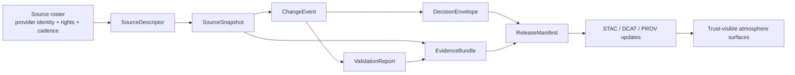

<!-- [KFM_META_BLOCK_V2]
doc_id: kfm://doc/NEEDS-VERIFICATION-UUID
title: KFM Atmosphere Schemas
type: standard
version: v1
status: draft
owners: @bartytime4life, NEEDS VERIFICATION
created: YYYY-MM-DD
updated: YYYY-MM-DD
policy_label: NEEDS_VERIFICATION_POLICY_LABEL
related: [../README.md, ../aqs-delta-pipeline.md, ../comparability-rules.md, ../kdhe-operational-signals.md, ../source-roster.md, ../../air/README.md, ../../air/aqs-airnow-hydrologic-baselines.md, ../../README.md]
tags: [kfm, atmosphere, schemas]
notes: [Directory README for atmosphere-lane machine-readable contract surfaces; exact checked-in schema inventory still needs branch-local verification.]
[/KFM_META_BLOCK_V2] -->

# KFM Atmosphere Schemas

Machine-readable schema index for atmosphere-lane snapshots, change events, comparability review, evidence closure, and trust-gated release objects.

> **Status:** `draft`  
> **Owners:** `@bartytime4life`, `NEEDS VERIFICATION`  
>       
> **Quick jumps:** [Scope](#scope) · [Repo fit](#repo-fit) · [Inputs](#inputs) · [Exclusions](#exclusions) · [Directory tree](#directory-tree) · [Quickstart](#quickstart) · [Usage](#usage) · [Diagram](#diagram) · [Tables](#tables) · [Task list](#task-list) · [FAQ](#faq) · [Appendix](#appendix)

> [!IMPORTANT]
> This directory is for **schema-facing contract surfaces** and for the human-readable indexing of those surfaces. It is **not** the source roster, the pipeline narrative, the policy bundle, or proof that every atmosphere connector already exists on the current branch.

> [!CAUTION]
> Current public repo evidence confirms the `docs/domains/atmosphere/` subtree and confirms that a `schemas/` folder exists under it. The exact checked-in file inventory inside this folder was **not** directly re-opened during this pass. Wherever filenames are listed below, their **role** may be strongly supported by sibling docs while their exact **branch presence** still remains `NEEDS VERIFICATION`.

## Scope

This README defines what belongs in `docs/domains/atmosphere/schemas/`, what does not, and how this folder should stay aligned with the atmosphere lane’s burden: visible method, visible time basis, visible calibration or admission logic, and clear separation between observed, provisional, modeled, and derived outputs.

The folder’s job is narrow and important:

- index machine-readable atmosphere-lane contracts
- keep schema roles legible to reviewers
- point each schema back to its governing sibling docs
- prevent schema sprawl from silently replacing doctrine

A useful reading rule for this directory:

| Claim type | Reading rule |
|---|---|
| `CONFIRMED` | Supported by visible repo structure or checked-in atmosphere/air docs |
| `INFERRED` | Repeatedly implied by checked-in atmosphere docs, but exact file presence still needs branch verification |
| `PROPOSED` | Recommended next-wave schema surface or layout improvement |
| `NEEDS VERIFICATION` | Current branch file presence, ownership, dates, `$id` values, or enforcement status not directly re-checked here |

[Back to top](#kfm-atmosphere-schemas)

## Repo fit

| Item | Value |
|---|---|
| **Path** | `docs/domains/atmosphere/schemas/README.md` |
| **Role** | Directory README for atmosphere-lane schema surfaces |
| **Parent lane** | `../README.md` |
| **Sibling doctrine docs** | `../aqs-delta-pipeline.md`, `../comparability-rules.md`, `../kdhe-operational-signals.md`, `../source-roster.md`, `../EPA AQS Delta Ingestion and Trust-Gated Publication Spec.md` |
| **Adjacent lane docs** | `../../air/README.md`, `../../air/aqs-airnow-hydrologic-baselines.md` |
| **Broader docs layer** | `../../README.md`, `../README.md` |
| **Upstream role** | Lane doctrine, source-role rules, comparability triggers, and operational interpretation |
| **Downstream role** | JSON Schemas, examples, fixtures, validators, release records, and trust-visible UI payloads |
| **Path note** | This README follows the checked-in public subtree under `docs/domains/atmosphere/`. Some sibling docs still describe a proposed `docs/domains/air/atmosphere/` placement. Keep that path drift explicit until reconciled. |

A good mental model is:

- `../source-roster.md` explains **who the lane listens to**
- `../comparability-rules.md` explains **what kinds of change are review-bearing**
- `../aqs-delta-pipeline.md` explains **how change is interpreted**
- `schemas/` explains **how those objects become machine-readable**

## Inputs

Accepted inputs for this folder include:

| Belongs here | Why |
|---|---|
| JSON Schema files for atmosphere-lane contract objects | This is the folder’s primary purpose |
| Small human-readable notes that explain schema role and versioning | Reviewers need a stable index, not just bare files |
| Valid / invalid examples linked from schemas | Useful for review, tests, and future automation |
| Enumerations or fragments reused across atmosphere schemas | Keeps reason codes, obligation codes, and comparability states consistent |
| Schema notes for review-bearing objects such as `ChangeEvent`, `DecisionEnvelope`, and `EvidenceBundle` | These objects already carry meaning in sibling atmosphere docs |
| Versioning notes, `$id` notes, and compatibility notes | Necessary if the lane evolves without silently breaking downstream consumers |

Typical contract families this directory should cover are:

- source snapshots
- detected changes
- validation outcomes
- decision envelopes
- evidence bundles
- source descriptors
- release-facing manifests

Not all of those are necessarily checked in yet. The table in [Usage](#usage) separates what is strongly supported from what is next-wave.

## Exclusions

This folder should **not** become a catch-all for the atmosphere lane.

| Does **not** belong here | Put it here instead |
|---|---|
| Source-family registry or onboarding prose | `../source-roster.md` |
| Pipeline narrative, sequencing, and trust-gated release walkthroughs | `../aqs-delta-pipeline.md` |
| Comparability doctrine, trigger rules, and lane-specific interpretation guidance | `../comparability-rules.md` |
| KDHE operational interpretation or signal-reading prose | `../kdhe-operational-signals.md` |
| Policy bundles, Rego, or enforcement code | repo-level `policy/` or other machine-enforced policy surface |
| Raw provider payloads or fetched snapshots | data/workflow storage, not docs |
| Runtime proof claims about deployed connectors, jobs, or dashboards | only where directly verified from repo/runtime evidence |
| Generic climate, hydrology, or air-science explanation that does not alter a contract shape | lane README or domain guides |
| Silent mixing of observed, provisional, community-sensor, and modeled outputs | nowhere; keep those distinctions explicit |

> [!WARNING]
> Do not let this directory turn into a substitute for the machine-enforced contract surface. A docs-side schema index is useful; it is not the same thing as enforcement, tests, or emitted proof.

[Back to top](#kfm-atmosphere-schemas)

## Directory tree

The current public tree confirms the broader lane subtree and confirms that a `schemas/` folder exists. The **exact branch-local contents** of `schemas/` still need verification, so the tree below separates confirmed folder structure from inferred schema filenames.

```text
docs/
└── domains/
    └── atmosphere/
        ├── README.md
        │   └── CONFIRMED placeholder on current public main
        ├── EPA AQS Delta Ingestion and Trust-Gated Publication Spec.md
        ├── aqs-delta-pipeline.md
        ├── comparability-rules.md
        ├── kdhe-operational-signals.md
        ├── source-roster.md
        └── schemas/
            ├── README.md
            │   └── this file
            ├── change-event.schema.json
            │   └── INFERRED from sibling atmosphere specs; file presence NEEDS VERIFICATION
            ├── decision-envelope.schema.json
            │   └── INFERRED from sibling atmosphere specs; file presence NEEDS VERIFICATION
            ├── evidence-bundle.schema.json
            │   └── INFERRED from sibling atmosphere specs; file presence NEEDS VERIFICATION
            ├── source-snapshot.schema.json
            │   └── INFERRED from sibling atmosphere specs; file presence NEEDS VERIFICATION
            ├── source-descriptor.schema.json
            │   └── PROPOSED next-wave lane-local schema
            ├── validation-report.schema.json
            │   └── PROPOSED next-wave lane-local schema
            └── release-manifest.schema.json
                └── PROPOSED next-wave lane-local schema
```

If the branch already contains a different set of schema filenames, prefer the checked-in reality and update this README rather than forcing the branch to match this sketch.

## Quickstart

### Add or revise one atmosphere schema

1. Start from the sibling doc that gives the object meaning.
   - `ChangeEvent` and `SourceSnapshot` usually start in `../aqs-delta-pipeline.md`
   - `DecisionEnvelope` and `EvidenceBundle` usually start in `../comparability-rules.md` or `../kdhe-operational-signals.md`
   - `SourceDescriptor` usually starts in `../source-roster.md`

2. Write the schema so it preserves atmosphere-lane distinctions.
   - observed vs provisional vs modeled vs derived
   - calibration or admission basis where required
   - explicit time basis and effective window
   - reason codes and obligation codes where a decision is review-bearing

3. Add or update small examples.
   - one valid example
   - one invalid example
   - one note explaining the trust consequence of getting the shape wrong

4. Link the schema back to the governing doc in this README.

5. Do **not** claim enforcement, fixtures, or runtime use unless those are directly present on the branch.

### Minimal authoring checklist

- choose a stable title and `$id`
- keep units and cadence explicit
- treat modeled-air and observed-air as different knowledge classes
- include audit or lineage hooks for review-bearing objects
- keep reason and obligation codes machine-readable
- note any branch-local uncertainty in comments or sibling docs before merge

## Usage

### 1. Core schema registry

The table below is the practical heart of this README.

| Schema surface | Role in the atmosphere lane | Minimum fields or hooks to preserve | Status |
|---|---|---|---|
| `source-snapshot.schema.json` | Freeze one fetch or one provider read so later diffs are explainable | `source_ref`, `request_window`, `fetch_time`, `content_hash`, `output_pointer` | `INFERRED` filename; object role strongly supported |
| `change-event.schema.json` | Represent one material or review-bearing difference | `subject_id`, `change_class`, `old_value`, `new_value`, `materiality`, `detected_at` | `INFERRED` filename; object role strongly supported |
| `decision-envelope.schema.json` | Capture the machine-readable result of publish / hold / abstain / deny logic | `subject_id`, `action`, `lane`, `result`, `reason_codes`, `obligation_codes`, `policy_basis`, `audit_ref`, `effective_window` | `INFERRED` filename; object role strongly supported |
| `evidence-bundle.schema.json` | Tie the review packet together so decisions remain inspectable later | `bundle_id`, `previous_snapshot_ref`, `current_snapshot_ref`, `delta_ref`, `validation_refs`, `external_refs`, rights / sensitivity state where applicable | `INFERRED` filename; object role strongly supported |
| `validation-report.schema.json` | Keep atmosphere checks legible and testable | checks run, severities, outcomes, notes, comparison basis | `PROPOSED` |
| `source-descriptor.schema.json` | Turn a named provider into a source contract rather than a loose URL | source identity, role, cadence, access mode, rights posture, validation plan, publication intent | `PROPOSED` |
| `release-manifest.schema.json` | Record what outward-facing atmosphere release actually changed | changed subjects, decision refs, catalog refs, rollback posture | `PROPOSED` |

### 2. Comparability-bearing shapes

Atmosphere work is unusually sensitive to false comparability. A schema in this lane often needs more than generic timestamped data fields.

When relevant, preserve fields or fragments for:

- knowledge character
- series class
- cadence
- unit
- aggregation level
- source network
- correction model
- upstream provider
- comparability state
- effective window

That is especially important when:

- method codes change
- site locations move
- averaging windows or cadence change
- modeled fields are introduced to fill observation gaps
- community-sensor corrections are admitted into a workflow

### 3. Trust-visible consequences

These schemas are not abstract paperwork. They feed trust-visible surfaces downstream.

A broken or underspecified atmosphere schema can lead to:

- silent mixing of observed and modeled values
- “same series” claims that no longer hold after method changes
- unreviewed publication after location or cadence shifts
- evidence drawers or review screens that cannot explain why something changed

### 4. Reading branch reality conservatively

Use this folder with two rules:

1. **Prefer checked-in branch reality over documentation sketches.**
2. **Prefer explicit `NEEDS VERIFICATION` over confident but weak inventory claims.**

If a schema exists elsewhere on the branch, this README should point to it. If it does not exist yet, this README should say so plainly.

[Back to top](#kfm-atmosphere-schemas)

## Diagram



The point of the flow is simple: **atmosphere publication should be reconstructable**. A published interpretation should be traceable to a source contract, a frozen snapshot, a detected change, a validation outcome, a decision, and an evidence bundle.

## Tables

### Schema surface ↔ sibling doc map

| Sibling doc | What it governs | What `schemas/` should mirror |
|---|---|---|
| `../source-roster.md` | source classes, admission logic, descriptor expectations | `SourceDescriptor` and related enums / fragments |
| `../aqs-delta-pipeline.md` | delta detection flow, review-bearing artifact family, release-facing objects | `SourceSnapshot`, `ChangeEvent`, `DecisionEnvelope`, `EvidenceBundle`, possibly `ReleaseManifest` |
| `../comparability-rules.md` | comparability triggers, validation expectations, required review outputs | `ValidationReport`, comparability enums, decision fields |
| `../kdhe-operational-signals.md` | operational signal interpretation and minimum decision/evidence expectations | richer `DecisionEnvelope` and `EvidenceBundle` shapes |
| `../../air/README.md` | lane boundary, burden profile, minimal descriptor shape | lane-local guardrails and naming stability |

### Recommended first-wave status board

| Object family | Why it should exist | Recommended status in this folder |
|---|---|---|
| `SourceSnapshot` | Reviewable delta work is impossible without frozen snapshots | `first-wave` |
| `ChangeEvent` | Material-change handling needs a stable object | `first-wave` |
| `DecisionEnvelope` | Publish / hold / deny must be machine-readable | `first-wave` |
| `EvidenceBundle` | Trust-visible review needs one inspectable packet | `first-wave` |
| `ValidationReport` | Comparability checks deserve their own machine shape | `second-wave` |
| `SourceDescriptor` | Source onboarding should eventually be a contract, not just prose | `second-wave` |
| `ReleaseManifest` | Outward release records become more valuable once first-wave objects exist | `second-wave` |

## Task list

### Merge gate

- [ ] Resolve meta-block placeholders: `doc_id`, owners, dates, policy label
- [ ] Verify the exact checked-in contents of `docs/domains/atmosphere/schemas/`
- [ ] Replace any inferred filename with the real branch filename if it differs
- [ ] Confirm whether lane-local schemas live here, in repo-level `schemas/`, or in both
- [ ] Link each checked-in schema file from this README
- [ ] Add or link at least one valid example per checked-in schema
- [ ] Add or link at least one invalid example per checked-in schema
- [ ] Confirm whether reason codes and obligation codes already have a shared enum surface
- [ ] Keep observed / provisional / modeled / derived distinctions explicit
- [ ] Re-check relative links after placement on the target branch

### Definition of done

A schema entry is ready when:

- its purpose is clear
- its minimum fields are visible
- its governing sibling doc is linked
- its trust consequence is understandable
- its branch status is honest
- its examples are reviewable
- its path is stable enough for downstream references

[Back to top](#kfm-atmosphere-schemas)

## FAQ

### Why keep a lane-local schema README if machine contracts may live elsewhere?

Because the atmosphere lane has domain-specific burden that generic contract folders do not explain well. This README keeps that burden close to the lane while still allowing enforcement or shared contracts to live in repo-level machine surfaces.

### Why are some filenames marked `INFERRED` or `NEEDS VERIFICATION`?

Because sibling atmosphere docs repeatedly name those object families, but this pass did not directly re-open the exact file inventory of the `schemas/` directory itself. The README should preserve that distinction instead of smoothing it away.

### Why are `DecisionEnvelope` and `EvidenceBundle` treated as first-wave objects?

Because multiple checked-in atmosphere docs already depend on them for material changes, comparability review, and trust-gated publication. Without them, the lane loses explainability at the moment it matters most.

### Why call out path drift with `docs/domains/air/atmosphere/`?

Because some checked-in docs still describe that older or proposed placement. This README follows the visible checked-in subtree under `docs/domains/atmosphere/`, but it should not hide that there is still path reconciliation work to do.

## Appendix

<details>
<summary><strong>Appendix A — Starter field scraps worth preserving</strong></summary>

### A.1 SourceDescriptor starter checklist

Useful fields to preserve when a lane-local `SourceDescriptor` becomes real:

- `source_id`
- `source_name`
- `source_class`
- `knowledge_character`
- `owner_or_operator`
- `provider_or_gateway`
- `access_mode`
- `rights_posture`
- `time_basis`
- `cadence_or_refresh`
- `spatial_support`
- `calibration_or_admission_basis`

### A.2 DecisionEnvelope minimum expectations

A good atmosphere-lane `DecisionEnvelope` usually needs:

- subject
- action
- lane
- result
- reason codes
- obligation codes
- policy basis
- audit reference
- effective window

### A.3 EvidenceBundle minimum expectations

A good atmosphere-lane `EvidenceBundle` usually needs:

- bundle identifier
- previous and current snapshot references
- diff reference
- validation references
- external corroboration references
- rights / sensitivity state
- preview policy where publication is constrained

</details>

<details>
<summary><strong>Appendix B — Review notes for future cleanup</strong></summary>

1. Reconcile the checked-in `docs/domains/atmosphere/` subtree with the older proposed `docs/domains/air/atmosphere/` references.
2. Decide whether atmosphere schemas are lane-local only, repo-level only, or dual-homed with one source of truth.
3. Add explicit links to any real schema files once branch-local verification is complete.
4. Consider whether shared enum fragments should be centralized after first-wave schemas stabilize.

</details>

---

**Related:** [Atmosphere lane](../README.md) · [AQS delta pipeline](../aqs-delta-pipeline.md) · [Comparability rules](../comparability-rules.md) · [KDHE operational signals](../kdhe-operational-signals.md) · [Source roster](../source-roster.md) · [Air lane README](../../air/README.md)
