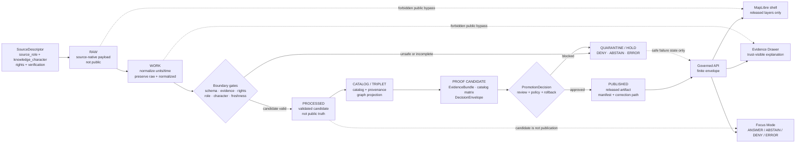

<!-- [KFM_META_BLOCK_V2]
doc_id: kfm://doc/TODO-VERIFY-docs-domains-atmosphere-air-readme
title: Atmosphere / Air Domain
type: standard
version: v1
status: draft
owners: TODO-VERIFY: @bartytime4life; atmosphere-air domain steward; data steward; policy steward; release steward; docs steward
created: TODO-VERIFY-YYYY-MM-DD
updated: 2026-05-07
policy_label: public-draft-NEEDS_VERIFICATION
related: [architecture/README.md, governance/README.md, operations/README.md, ../../adr/ADR-0312-atmosphere-air-source-role-boundaries.md, ../../adr/ADR-0418-atmosphere-air-schema-slug-compatibility.md, ../../adr/ADR-0431-atmosphere-air-knowledge-character-boundary.md, ../../../connectors/pipelines/air/README.md]
tags: [kfm, atmosphere-air, air-quality, source-role, knowledge-character, evidence, map-first, time-aware, governed-domain, fail-closed]
notes: [Target path confirmed on GitHub main through repository connector; local workspace was not a mounted checkout. Owners, created date, final policy label, CODEOWNERS routing, schema inventory, source-rights review, CI run status, public release, runtime API/UI binding, and Focus Mode behavior remain NEEDS VERIFICATION.]
[/KFM_META_BLOCK_V2] -->

<a id="top"></a>

# Atmosphere / Air Domain

Governed domain lane for atmospheric and air-quality evidence, preserving source role, knowledge character, evidence, policy, release, correction, and rollback state before any public map, API, export, or Focus claim.

<p align="center">
  
  
  
  
  
  
  
</p>

> [!NOTE]
> **Status:** `experimental`  
> **Document status:** `draft`  
> **Owners:** `TODO-VERIFY`  
> **Path:** `docs/domains/atmosphere_air/README.md`  
> **Repo posture:** `CONFIRMED` path exists on GitHub `main`; the local workspace was not a mounted checkout.  
> **Publication posture:** documentation/control surface only. This README does not authorize live source fetching, public release, production deployment, API route activation, MapLibre layer publication, Evidence Drawer claims, or Focus Mode answers.  
> **Quick jumps:** [Scope](#scope) · [Repo fit](#repo-fit) · [Accepted inputs](#accepted-inputs) · [Exclusions](#exclusions) · [Directory tree](#directory-tree) · [Knowledge-character guardrails](#knowledge-character-guardrails) · [Governed flow](#governed-flow) · [Current no-network slice](#current-no-network-slice) · [Validation gates](#validation-gates) · [Quickstart](#quickstart) · [Definition of done](#definition-of-done) · [Open verification](#open-verification)

> [!IMPORTANT]
> Atmosphere / Air must not collapse unlike evidence into one polished “air layer.” Observed sensor values, public AQI reports, regulatory archives, low-cost sensor candidates, model fields, smoke/AOD masks, climate anomaly context, fusion products, advisories, station metadata, and temporal support are different knowledge objects.

> [!WARNING]
> Missing `source_role`, missing `knowledge_character`, unknown rights, unresolved EvidenceRefs, stale current-state support, receipt-as-proof, fixture-as-public-truth, or direct public access to RAW / WORK / QUARANTINE / unpublished candidate material must fail closed.

---

## Scope

This README is the landing page for the Atmosphere / Air domain lane. It tells maintainers what belongs here, which adjacent files own deeper rules, and which claims remain blocked until evidence proves them.

### This lane covers

| Family | What belongs here | Required posture |
|---|---|---|
| Observed sensor records | PM2.5, PM10, ozone, NO₂, SO₂, CO, temperature, humidity, wind, pressure, visibility, and related measured values. | Preserve source, site/instrument context, raw value/unit, normalized value/unit, source payload hash, time basis, and EvidenceRefs. |
| Public AQI / report objects | AQI, NowCast-style reports, public agency indexes, and public report codes. | Treat as report/index objects, not raw concentration. |
| Regulatory archives | Quality-assured or archive-style evidence. | Use with archive/regulatory temporal caveats; do not imply live state by default. |
| Low-cost sensor candidates | Contributor, consumer, or community sensor networks. | Require correction method, caveats, confidence, rights, and limitations before public use. |
| Atmospheric model fields | Forecast, reanalysis, hindcast, transport, aerosol, smoke, and chemistry fields. | Label as modeled; expose model identity, valid time, uncertainty, and model-card support. |
| Remote-sensing masks | Smoke plumes, AOD, fire hotspots, aerosol/cloud/haze masks, and classification products. | Treat as classification/support context, not surface exposure or PM concentration by default. |
| Fusion products | Interpolation, bias correction, consensus, ensemble, and fused grids. | Keep `DERIVED_FUSION`; expose input EvidenceRefs, method, uncertainty, and transform identity. |
| Advisories and alerts | Health notices, public recommendations, agency messaging, watches, warnings, and related source-backed notices. | Preserve issuer and scope; KFM is not an emergency alerting authority. |
| Network and site context | Station IDs, siting caveats, instrument metadata, cadence, active/inactive state, and station health. | Interpretive context only; not a measurement value. |
| Baseline and temporal support | Normals, rolling baselines, freshness windows, persistence windows, and hysteresis rules. | Supports scoped claims; not standalone proof. |

### This README does not prove

- live source activation;
- public-source rights clearance;
- final schema-home authority;
- passing CI or branch protection;
- complete EvidenceBundle closure;
- release manifests, correction notices, or rollback cards;
- deployed API routes, MapLibre bindings, Evidence Drawer runtime behavior, or Focus Mode behavior.

<p align="right"><a href="#top">Back to top ↑</a></p>

---

## Repo fit

This file belongs under `docs/` because it is human-facing domain documentation. It should orient maintainers and reviewers, then point to the responsibility roots that enforce shape, policy, validation, release, and runtime behavior.

### Local path

| Item | Value |
|---|---|
| Current file | `docs/domains/atmosphere_air/README.md` |
| Owning root | `docs/` |
| Document role | Domain landing page and navigation surface |
| Current maturity | `draft`; validation is partial and publication remains blocked |
| Public-release authority | none; publication requires proof, policy, review, release, correction, and rollback evidence |

### Upstream and sibling docs

| Surface | Path | Status | Role |
|---|---|---:|---|
| Architecture index | [`architecture/README.md`](architecture/README.md) | `CONFIRMED` | Navigation for API, map, Drawer, Focus, parameter, unit, and knowledge-character architecture. |
| Main architecture | [`architecture/ARCHITECTURE.md`](architecture/ARCHITECTURE.md) | `CONFIRMED` | End-to-end trust path and public-boundary non-negotiables. |
| API contracts | [`architecture/API_CONTRACTS.md`](architecture/API_CONTRACTS.md) | `CONFIRMED / contract burden` | Finite envelopes, reason codes, Drawer/Focus pressure, and release-candidate handoff guidance. |
| Map layers | [`architecture/MAP_LAYERS.md`](architecture/MAP_LAYERS.md) | `CONFIRMED` | Layer descriptor and renderer-boundary rules. |
| Focus + Drawer payloads | [`architecture/FOCUS_DRAWER_PAYLOADS.md`](architecture/FOCUS_DRAWER_PAYLOADS.md) | `CONFIRMED` | Evidence Drawer and Focus Mode payload requirements. |
| Knowledge-character guide | [`architecture/KNOWLEDGE_CHARACTER.md`](architecture/KNOWLEDGE_CHARACTER.md) | `CONFIRMED` | Atmosphere-specific anti-collapse taxonomy. |
| Parameter registry guide | [`architecture/PARAMETER_REGISTRY.md`](architecture/PARAMETER_REGISTRY.md) | `CONFIRMED` | Parameter, unit, alias, and caveat guidance. |
| Unit conversions | [`architecture/UNIT_CONVERSIONS.md`](architecture/UNIT_CONVERSIONS.md) | `CONFIRMED` | Raw/normalized unit discipline. |
| Governance index | [`governance/README.md`](governance/README.md) | `CONFIRMED` | Source admission, rights, validation, preservation, open decisions, and backlog navigation. |
| Source registry | [`governance/SOURCE_REGISTRY.md`](governance/SOURCE_REGISTRY.md) | `CONFIRMED / source activation blocked` | Human-readable source-family posture, required descriptor fields, and public-release defaults. |
| Validation status | [`governance/VALIDATION_STATUS.md`](governance/VALIDATION_STATUS.md) | `CONFIRMED / validation partial` | Current validation inventory, blockers, reason codes, and publication-blocked status. |
| Operations index | [`operations/README.md`](operations/README.md) | `CONFIRMED` | Fixture-backed operations, re-entry, handoff, audit, and public-ops routing. |
| Data lifecycle | [`operations/DATA_LIFECYCLE.md`](operations/DATA_LIFECYCLE.md) | `CONFIRMED` | Lifecycle-stage rules and public-boundary expectations. |
| Promotion and rollback | [`operations/PROMOTION_AND_ROLLBACK.md`](operations/PROMOTION_AND_ROLLBACK.md) | `CONFIRMED` | Promotion, correction, rollback, and release-readiness guidance. |
| Runbook | [`operations/RUNBOOK.md`](operations/RUNBOOK.md) | `CONFIRMED` | Operations checklist and failure triage surface. |

### Governing ADRs and implementation pressure

| Surface | Path | Status | Relationship |
|---|---|---:|---|
| Source-role ADR | [`../../adr/ADR-0312-atmosphere-air-source-role-boundaries.md`](../../adr/ADR-0312-atmosphere-air-source-role-boundaries.md) | `CONFIRMED / draft` | Requires `source_role` and `knowledge_character` for consequential Atmosphere / Air objects. |
| Slug compatibility ADR | [`../../adr/ADR-0418-atmosphere-air-schema-slug-compatibility.md`](../../adr/ADR-0418-atmosphere-air-schema-slug-compatibility.md) | `CONFIRMED / proposed` | Keeps `atmosphere_air`, `air`, and `atmosphere` boundaries explicit. |
| Knowledge-character ADR | [`../../adr/ADR-0431-atmosphere-air-knowledge-character-boundary.md`](../../adr/ADR-0431-atmosphere-air-knowledge-character-boundary.md) | `CONFIRMED / draft` | Applies knowledge-character boundaries to release, UI, Drawer, Focus, and lifecycle behavior. |
| No-network connector lane | [`../../../connectors/pipelines/air/README.md`](../../../connectors/pipelines/air/README.md) | `CONFIRMED / candidate-only` | Writes reviewable QA-summary candidates and run receipts; does not publish. |
| Candidate writer | [`../../../connectors/pipelines/air/air_ingest.py`](../../../connectors/pipelines/air/air_ingest.py) | `CONFIRMED` | Deterministic no-network candidate/receipt writer. |
| Processed air lane | [`../../../data/processed/air/README.md`](../../../data/processed/air/README.md) | `CONFIRMED / candidate lane` | Processed examples and candidates; not public truth by themselves. |
| Air receipts lane | [`../../../data/receipts/air/README.md`](../../../data/receipts/air/README.md) | `CONFIRMED / process memory` | Run receipts; not proof packs, EvidenceBundles, or release manifests. |
| Machine schema family | `schemas/contracts/v1/air/` and/or `schemas/contracts/v1/atmosphere/` | `NEEDS VERIFICATION` | Do not claim canonical schema authority until ADR acceptance, inventory, fixtures, validators, tests, and rollback evidence prove it. |
| Runtime API / MapLibre / Drawer / Focus | repo-native runtime roots | `UNKNOWN / NEEDS VERIFICATION` | Architecture and contract burden exist; deployed behavior is not proven by this README. |

### Naming posture

| Name | Current role | Working rule |
|---|---|---|
| `atmosphere_air` | `CONFIRMED` human-facing documentation lane. | Use for current docs paths unless a successor ADR migrates it. |
| `air` | `CONFIRMED` no-network implementation/tooling and candidate-artifact slice. | Treat as candidate/receipt/testing/release-candidate pressure, not whole-domain proof. |
| `atmosphere` | `PROPOSED` whole-domain schema/normalization concept. | Do not treat as canonical machine schema family until schema-home inventory and ADR-backed tests prove it. |

> [!CAUTION]
> Do not silently rename, collapse, alias, or publish across `atmosphere_air`, `air`, and `atmosphere`. Compatibility requires ADR-backed migration, fixtures, validators, policy checks, migration notes, and rollback.

<p align="right"><a href="#top">Back to top ↑</a></p>

---

## Accepted inputs

The lane accepts only source-grounded, lifecycle-aware, reviewable inputs.

| Input | Minimum required support | First safe handling |
|---|---|---|
| `SourceDescriptor` | `source_id`, `source_role`, `knowledge_character`, publisher, rights, verification status, public-release flag, freshness/cadence, and review owner. | Registry candidate; public release blocked while rights or verification are unknown. |
| Parameter definition | Parameter ID, raw units, normalized unit, conversion rule, caveats, source-role fit, and knowledge-character fit. | Parameter registry and unit tests. |
| Observation candidate | Source/site/parameter/time, raw value/unit, normalized value/unit, source payload hash, quality flags, EvidenceRefs. | Offline schema/QC candidate; not public. |
| Site or network context | Provider site ID, geometry or generalization rule, instrument state, cadence, station health, siting caveats. | Context object; never measurement value. |
| AQI/report/advisory candidate | Issuer, method, index/report code, temporal scope, public message source, caveats. | Report/advisory object; never raw concentration. |
| Model field candidate | Model identity, variable, grid/geometry support, valid time, model card ref, uncertainty/caveats. | Modeled object; never observed measurement. |
| Remote mask candidate | Product/sensor, classification, time support, confidence/caveats, assumptions. | Classification/support object; never surface PM concentration by default. |
| Fusion candidate | Input EvidenceRefs, method, uncertainty, transform hash, output scope, derived status. | `DERIVED_FUSION`; proof and Drawer disclosure required. |
| Run receipt | Run ID, input refs, output refs, transform/spec hash, status, validator refs. | Process memory; not EvidenceBundle or release proof. |
| EvidenceBundle candidate | EvidenceRefs, source roles, hashes, provenance, scope, review state. | Proof candidate; promotion required before public use. |
| Layer descriptor candidate | Released or candidate source ID, delivery class, knowledge character, evidence route, policy/freshness/review state. | Map-shell candidate only after gate approval. |
| Operations handoff candidate | Handoff package, watch plan, runbook activation candidate, event log, audit result. | Governance evidence only; not production operations or public truth. |

<p align="right"><a href="#top">Back to top ↑</a></p>

---

## Exclusions

Do not put these in this domain lane or its public downstream surfaces:

- secrets, API keys, tokens, credentials, private endpoint details, `.env` content, or privileged logs;
- live-source fetch behavior before rights, terms, quotas, endpoint schemas, cadence, source role, and public-release posture are verified;
- RAW, WORK, QUARANTINE, connector-private, normalization-stage, or unpublished processed candidates on public paths;
- public tiles, summaries, exports, UI payloads, or Focus answers that bypass EvidenceBundle resolution;
- AQI treated as concentration;
- AOD treated as PM2.5;
- smoke, plume, fire, or remote-sensing masks treated as exposure measurement;
- model fields labeled as observations;
- regulatory archives labeled as live/current state by default;
- climate anomalies labeled as emergency alerts without governed support;
- fusion products that hide inputs, method, uncertainty, or transform identity;
- run receipts treated as EvidenceBundles, proof packs, ReleaseManifests, or PromotionDecisions;
- fixture-backed or no-network artifacts treated as real-world public truth;
- direct model-runtime or direct MapLibre access to internal lifecycle stores;
- broad schema-home or slug migrations without ADR, compatibility fixture, validation, migration note, and rollback target.

<p align="right"><a href="#top">Back to top ↑</a></p>

---

## Directory tree

### Current domain documentation surface

```text
docs/domains/atmosphere_air/
├── README.md
├── architecture/
│   ├── README.md
│   ├── ARCHITECTURE.md
│   ├── API_CONTRACTS.md
│   ├── FOCUS_DRAWER_PAYLOADS.md
│   ├── KNOWLEDGE_CHARACTER.md
│   ├── MAP_LAYERS.md
│   ├── PARAMETER_REGISTRY.md
│   └── UNIT_CONVERSIONS.md
├── governance/
│   ├── README.md
│   ├── EXPANSION_BACKLOG.md
│   ├── OPEN_QUESTIONS.md
│   ├── PRESERVATION_LEDGER.md
│   ├── SECURITY_AND_RIGHTS.md
│   ├── SOURCE_REGISTRY.md
│   └── VALIDATION_STATUS.md
└── operations/
    ├── README.md
    ├── DATA_LIFECYCLE.md
    ├── PROMOTION_AND_ROLLBACK.md
    └── RUNBOOK.md
```

### Repo-referenced implementation pressure

```text
connectors/
└── pipelines/
    └── air/
        ├── README.md
        └── air_ingest.py

data/
├── processed/
│   └── air/
│       ├── README.md
│       └── qa_summary.example.json
└── receipts/
    └── air/
        ├── README.md
        └── run_receipt.example.json
```

> [!NOTE]
> The tree above is a documentation and repo-evidence map. It does not prove passing tests, complete schemas, source-rights clearance, public release, runtime binding, or production readiness.

<p align="right"><a href="#top">Back to top ↑</a></p>

---

## Knowledge-character guardrails

Every consequential atmosphere object must declare or resolve **what kind of knowledge it is** before interpretation, mapping, summarization, export, or promotion.

| Knowledge character | Boundary | Must never masquerade as |
|---|---|---|
| `OBSERVED_SENSOR` | Ground/station/instrument measurement. | AQI report, model field, remote mask, interpolation, or fusion product. |
| `PUBLIC_AQI_REPORT` | AQI, NowCast, public index, or agency report. | Raw concentration. |
| `REGULATORY_ARCHIVE` | Quality-assured or regulatory archive evidence. | Live operational state by default. |
| `LOW_COST_SENSOR` | Contributor or consumer sensor candidate. | Regulatory truth without correction, caveats, confidence, and rights review. |
| `ATMOSPHERIC_MODEL_FIELD` | Forecast, reanalysis, hindcast, smoke, aerosol, transport, or chemistry field. | Observed measurement. |
| `REMOTE_SENSING_MASK` | Smoke, AOD, fire, aerosol, haze, cloud, plume, or classification product. | Surface exposure measurement or PM concentration. |
| `CLIMATE_ANOMALY_CONTEXT` | Normals, anomalies, downscaling, hindcasts, baselines. | Emergency alert or live hazard state. |
| `DERIVED_FUSION` | Interpolation, consensus, bias correction, ensemble, or fused product. | Canonical source observation. |
| `METEOROLOGICAL_CONTEXT` | Wind, temperature, humidity, pressure, boundary-layer, and transport support. | Air-quality concentration unless measured as such. |
| `VISIBILITY_AND_AEROSOL_CONTEXT` | Visibility, haze, AOD, opacity, or optical aerosol burden. | PM concentration without governed model assumptions. |
| `FIRE_AND_EMISSIONS_CONTEXT` | Fire hotspots, source indicators, inventories, smoke-source context. | Exposure measurement. |
| `ALERT_AND_ADVISORY_CONTEXT` | Agency notices, health messages, warnings, public recommendations. | KFM-issued emergency instruction. |
| `NETWORK_AND_SITE_CONTEXT` | Station metadata, provider IDs, cadence, active/inactive state, siting caveats, instrument health. | Measurement value. |
| `BASELINE_AND_TEMPORAL_SUPPORT` | Climatology, rolling baseline, persistence, hysteresis, freshness support. | Standalone proof. |

### Anti-collapse denials

| Reason code | Denial condition |
|---|---|
| `ATMOS_MISSING_SOURCE_ROLE` | Object lacks `source_role` or resolvable source descriptor. |
| `ATMOS_MISSING_KNOWLEDGE_CHARACTER` | Object lacks accepted `knowledge_character`. |
| `ATMOS_UNKNOWN_RIGHTS_PUBLIC` | Public output requested while rights are unknown or unreviewed. |
| `ATMOS_AQI_AS_CONCENTRATION` | AQI/report index treated as raw concentration. |
| `ATMOS_AOD_AS_PM25` | AOD treated as PM2.5 without governed model support. |
| `ATMOS_MASK_AS_EXPOSURE` | Smoke/plume/remote mask treated as exposure measurement. |
| `ATMOS_MODEL_AS_OBSERVED` | Model field labeled as observed measurement. |
| `ATMOS_FUSION_INPUTS_HIDDEN` | Fusion product omits input EvidenceRefs, method, uncertainty, or transform identity. |
| `ATMOS_RECEIPT_AS_PROOF` | Run receipt used as EvidenceBundle, proof pack, or release authority. |
| `ATMOS_FIXTURE_PUBLIC_TRUTH` | Fixture-backed or no-network artifact treated as real public truth. |
| `ATMOS_PUBLIC_INTERNAL_ACCESS` | Public surface attempts RAW, WORK, QUARANTINE, connector-private, normalization-stage, or unpublished candidate access. |

<p align="right"><a href="#top">Back to top ↑</a></p>

---

## Governed flow



### Flow rules

| Rule | Required behavior |
|---|---|
| Public clients use governed interfaces. | Map, API, Drawer, Focus, export, and search must not read internal lifecycle zones or unpublished candidates directly. |
| Promotion is a state transition. | Publication requires validation, evidence closure, policy, review, release manifest, correction path, and rollback target. |
| Evidence outranks language. | EvidenceBundle, policy, review, and release state outrank generated summaries or map presentation. |
| Receipts are process memory. | A run receipt can support audit, but it is not proof or publication authority. |
| Derived products stay derived. | Tiles, graph deltas, fusion products, summaries, and AI answers are carriers of evidence, not sovereign truth. |
| Negative outcomes are first-class. | `ABSTAIN`, `DENY`, `ERROR`, `HOLD`, and quarantine are correct when support is incomplete or unsafe. |

<p align="right"><a href="#top">Back to top ↑</a></p>

---

## Current no-network slice

The current repo-visible implementation pressure is a small, deterministic, no-network `air` slice.

| Surface | Current evidence | Boundary |
|---|---|---|
| `connectors/pipelines/air/air_ingest.py` | Writes a deterministic PM2.5 QA summary and run receipt. | Candidate writer; no live source activation. |
| `data/processed/air/qa_summary.example.json` | Current deterministic example uses `parameter: pm25`, `units: ug_m3`, `averaging_window: nowcast_hourly`, `decision: candidate`, `provider: kfm_air_pipeline`, and `dataset: no_network_stub`. | Candidate only; not public truth. |
| `data/receipts/air/run_receipt.example.json` | Receipt records pipeline path, output path, `network_access: disabled`, completed status, and a run ID. | Process memory only; not EvidenceBundle or release authority. |
| `policy/air/air_qa.rego` | Repo-referenced QA policy fragment. | Useful gate pressure; not complete whole-domain policy. |
| `tools/validators/air/validate_air_qa.py` | Repo-referenced validator that depends on schema inventory. | Validation status remains schema-blocked until referenced schemas are verified. |
| `tools/publishers/air/*` | Repo-referenced release-candidate and publication-boundary tooling. | Candidate/release-pressure only; public release remains blocked without proof. |

> [!CAUTION]
> A completed no-network run does not prove a public air-quality claim. It proves that a candidate and receipt can be emitted. Release still requires schema availability, evidence closure, source rights, policy, review, manifest, correction path, rollback target, and captured validation results.

<p align="right"><a href="#top">Back to top ↑</a></p>

---

## Validation gates

The lane is validation-partial and publication-blocked until the open gates are retired with repo evidence.

| Gate | Required proof | Current posture | Failure outcome |
|---|---|---:|---|
| Source identity | Stable `source_id`, publisher/steward, source role, knowledge character. | `NEEDS VERIFICATION` for live sources | `DENY` |
| Rights and terms | Rights, attribution, redistribution, automation, access/auth, and public-release posture reviewed. | `UNKNOWN / blocked` | `DENY` |
| Schema inventory | Active schema family and compatibility path are confirmed. | `NEEDS VERIFICATION` | `ERROR` or `DENY` |
| Candidate parse | QA summary and run receipt parse and remain candidate/process-memory only. | `CONFIRMED for current no-network shape` | `ERROR` |
| Validator runnable | Validator runs against active schema in a clean checkout. | `NOT RUN HERE / schema-blocked` | `ERROR` |
| Policy coverage | Source role, knowledge character, rights, stale state, QA thresholds, internal-stage denial, release state, correction, and rollback are covered. | `PARTIAL` | `DENY`, `ABSTAIN`, or `ERROR` |
| Evidence closure | Consequential claims resolve EvidenceRefs to EvidenceBundle. | `NEEDS VERIFICATION` | `ABSTAIN` or `DENY` |
| Catalog/proof closure | Catalog, triplet, proof, promotion, and manifest records align. | `NEEDS VERIFICATION` | `DENY` |
| Public boundary | Public surfaces cannot access RAW, WORK, QUARANTINE, connector-private, normalization-stage, or unpublished candidate material. | `PARTIAL / NEEDS VERIFICATION` | `DENY` |
| Release readiness | ReleaseManifest has evidence refs, policy decision, review state, correction path, and rollback target. | `BLOCKED` | `DENY` or `HOLD` |
| CI enforcement | Workflow run and required-check status are captured. | `UNKNOWN` | Do not claim enforcement. |
| Runtime binding | API, MapLibre, Drawer, Focus, and export consume governed released artifacts only. | `UNKNOWN` | Do not claim deployed behavior. |

### Gate A/B/C/D vocabulary

| Gate | Trigger | Meaning |
|---|---|---|
| Gate A | `nowcast_max > 35` | Operational QA threshold; not validated AQS truth. |
| Gate B | `nowcast_vs_baseline_sigma > 2` | Baseline-deviation review threshold. |
| Gate C | `station_coverage_pct < 75` | Coverage/confidence review threshold. |
| Gate D | Signed attestation or override | Requires verified chain; fixture signatures are not production signatures. |

> [!IMPORTANT]
> NowCast-style operational evidence must not be labeled as validated AQS truth. AQS/archive support, NowCast/report support, and observed sensor support are separate evidence classes.

<p align="right"><a href="#top">Back to top ↑</a></p>

---

## Quickstart

Use these commands for inspection and no-network candidate review only. Do not use this README to fetch live sources, publish public artifacts, bind runtime routes, or mark release state.

### 1. Confirm active checkout

```bash
git status --short
git branch --show-current || true
git rev-parse --show-toplevel || true
```

### 2. Inspect the domain docs

```bash
find docs/domains/atmosphere_air -maxdepth 3 -type f | sort

find docs/adr -maxdepth 1 -type f \
  | sort \
  | grep -E 'ADR-0312|ADR-0418|ADR-0431' || true
```

### 3. Inspect the no-network `air` slice

```bash
find connectors/pipelines/air data/processed/air data/receipts/air \
  -maxdepth 2 -type f 2>/dev/null | sort

sed -n '1,220p' connectors/pipelines/air/air_ingest.py
```

### 4. Run the no-network candidate writer

```bash
python connectors/pipelines/air/air_ingest.py

python -m json.tool data/processed/air/qa_summary.example.json > /dev/null
python -m json.tool data/receipts/air/run_receipt.example.json > /dev/null
```

> [!CAUTION]
> `air_ingest.py` writes the example QA summary and receipt paths. Use a clean branch or restore expected fixtures after local experiments if the repository treats them as golden examples.

### 5. Run validator only after schema inventory is confirmed

```bash
test -f schemas/contracts/v1/air/qa_summary.schema.json && \
python tools/validators/air/validate_air_qa.py \
  data/processed/air/qa_summary.example.json
```

<p align="right"><a href="#top">Back to top ↑</a></p>

---

## Definition of done

A change to this domain README is ready for review when:

- [ ] KFM Meta Block V2 is present and unresolved values are explicit.
- [ ] Owners, created date, final policy label, and CODEOWNERS routing are verified or marked `TODO` / `NEEDS VERIFICATION`.
- [ ] README-like minimums are present: title, one-line purpose, repo fit, accepted inputs, and exclusions.
- [ ] Relative links resolve from `docs/domains/atmosphere_air/README.md`.
- [ ] `atmosphere_air`, `air`, and `atmosphere` naming boundaries remain visible.
- [ ] `source_role` and `knowledge_character` remain load-bearing.
- [ ] Unknown rights block public release.
- [ ] AQI, concentration, AOD, smoke masks, model fields, advisories, fusion products, site metadata, and observations remain distinct.
- [ ] Receipts, candidates, proof objects, release manifests, correction notices, and rollback targets remain separate.
- [ ] Public API, MapLibre, Evidence Drawer, Focus Mode, export, search, and story surfaces remain downstream of governed API and released artifacts.
- [ ] No executable enforcement, schema, policy, CI, route, UI, dashboard, release, runtime, or source-rights claim is made without direct repo evidence.
- [ ] Any schema-slug or path migration includes ADR, compatibility fixture, validation, migration note, and rollback target.
- [ ] `governance/VALIDATION_STATUS.md`, `governance/SOURCE_REGISTRY.md`, `governance/SECURITY_AND_RIGHTS.md`, `operations/DATA_LIFECYCLE.md`, and `operations/PROMOTION_AND_ROLLBACK.md` impacts are considered before merging.

<p align="right"><a href="#top">Back to top ↑</a></p>

---

## FAQ

<details>
<summary><strong>Does this README approve public Atmosphere / Air release?</strong></summary>

No. It is a domain landing page and control surface. Public release requires source rights, evidence closure, policy approval, review state, ReleaseManifest or equivalent release object, correction path, and rollback target.
</details>

<details>
<summary><strong>Why does the lane distinguish AQI from concentration?</strong></summary>

AQI and NowCast-style reports are public reporting/index objects. They can support evidence, but they are not the same as raw concentration measurements. KFM must preserve issuer, method, temporal scope, report semantics, and caveats.
</details>

<details>
<summary><strong>Can smoke, AOD, or fire masks prove exposure?</strong></summary>

No. Smoke, fire, AOD, and aerosol masks can support context, classification, or source-attribution reasoning. They are not surface breathing concentration unless a governed model or fusion product explicitly supports that claim and exposes assumptions.
</details>

<details>
<summary><strong>Can the no-network air candidate be used as public truth?</strong></summary>

No. The current no-network slice emits a candidate QA summary and run receipt. It is useful for dry runs, validators, and release-candidate pressure, but it is not real-world public truth and must not be promoted without proof and release gates.
</details>

<details>
<summary><strong>Can Focus Mode answer questions from this lane?</strong></summary>

Only through governed evidence. Focus Mode must use admissible, policy-safe, EvidenceBundle-backed context and return `ANSWER`, `ABSTAIN`, `DENY`, or `ERROR`. It must not bypass EvidenceBundle resolution or turn generated language into evidence.
</details>

<details>
<summary><strong>What happens when sources disagree?</strong></summary>

Preserve disagreement. Do not force one truth. Show source role, knowledge character, freshness, rights, review state, conflict state, and caveats. A fusion product may summarize disagreement only as `DERIVED_FUSION` with visible inputs, method, uncertainty, and transform identity.
</details>

---

## Open verification

| Item | Status | Why it matters |
|---|---:|---|
| Stable `doc_id` | `TODO / NEEDS VERIFICATION` | Required for document registry and durable cross-reference. |
| Owners and CODEOWNERS routing | `TODO / NEEDS VERIFICATION` | Required for source activation, policy changes, release review, and rollback decisions. |
| Created date | `TODO / NEEDS VERIFICATION` | Should come from Git history or document registry. |
| Final policy label | `TODO / NEEDS VERIFICATION` | Determines public/restricted posture. |
| Schema inventory for `air` and `atmosphere` | `NEEDS VERIFICATION` | Avoids silent schema authority drift. |
| Source rights and terms | `UNKNOWN` | Public release must remain denied while rights are unresolved. |
| EvidenceBundle example closure | `NEEDS VERIFICATION` | Candidate artifacts reference evidence support that must resolve before consequential claims. |
| Validator execution | `NOT RUN HERE` | Tool presence is not passing validation evidence. |
| Policy enforcement | `PARTIAL / NEEDS VERIFICATION` | Policy fragments exist, but complete whole-domain enforcement is not proven here. |
| Test and CI status | `UNKNOWN` | Workflow/test presence does not prove a passing run or required branch protection. |
| Public API route names and behavior | `UNKNOWN` | Route names and runtime envelopes must not be invented. |
| MapLibre layer registry binding | `UNKNOWN` | Layer docs do not prove released map behavior. |
| Evidence Drawer implementation | `UNKNOWN` | Payload requirements need runtime/component proof. |
| Focus Mode implementation | `UNKNOWN` | Finite outcome and citation rules need runtime proof. |
| Release manifests, correction notices, rollback cards | `NEEDS VERIFICATION` | Publication maturity cannot be claimed from docs alone. |
| Live source activation | `BLOCKED` | Requires source descriptors, rights, terms, cadence, validation, policy, review, release, and rollback evidence. |

<p align="right"><a href="#top">Back to top ↑</a></p>
