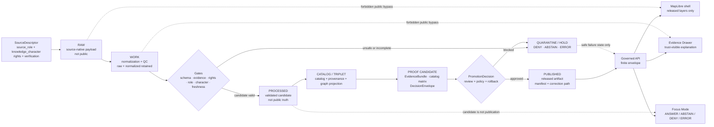

<!-- [KFM_META_BLOCK_V2]
doc_id: kfm://doc/TODO-VERIFY-docs-domains-atmosphere-air-readme
title: Atmosphere / Air Domain
type: standard
version: v1
status: draft
owners: TODO-VERIFY: @bartytime4life; atmosphere-air domain steward; source steward; policy steward; release steward; docs steward
created: TODO-VERIFY-YYYY-MM-DD
updated: 2026-05-07
policy_label: public-draft-NEEDS_VERIFICATION
related: [docs/domains/atmosphere_air/README.md, docs/domains/atmosphere_air/architecture/README.md, docs/domains/atmosphere_air/governance/README.md, docs/domains/atmosphere_air/operations/README.md, docs/adr/ADR-0312-atmosphere-air-source-role-boundaries.md, docs/adr/ADR-0418-atmosphere-air-schema-slug-compatibility.md, docs/adr/ADR-0431-atmosphere-air-knowledge-character-boundary.md, connectors/pipelines/air/README.md, data/processed/air/qa_summary.example.json, data/receipts/air/run_receipt.example.json]
tags: [kfm, atmosphere-air, air, evidence, source-role, knowledge-character, map-first, time-aware, governed-domain]
notes: [Revised as the domain landing README for the repo-visible Atmosphere / Air documentation lane. doc_id, created date, final owners, CODEOWNERS routing, policy label, CI enforcement, source-rights verification, release maturity, and runtime behavior remain NEEDS VERIFICATION. Current repo evidence distinguishes docs/domains/atmosphere_air as the human documentation lane, connectors/pipelines/air and data/*/air as a no-network implementation slice, and atmosphere as a proposed whole-domain schema concept unless verified through ADR-backed inventory.]
[/KFM_META_BLOCK_V2] -->

<a id="top"></a>

# Atmosphere / Air Domain

Governed domain lane for atmosphere and air evidence: observations, AQI reports, regulatory archives, model fields, smoke and aerosol context, advisories, site metadata, no-network QA candidates, and public-safe map/API delivery.

<p align="center">
  
  
  
  
  
  
  
  
</p>

> [!NOTE]
> **Status:** `experimental` / `draft`  
> **Owners:** `TODO-VERIFY`  
> **Path:** `docs/domains/atmosphere_air/README.md`  
> **Owning root:** `docs/` — human-facing control plane and domain documentation  
> **Repo evidence:** path and adjacent Atmosphere / Air documentation are repo-visible through the GitHub connector; local workspace checkout was not mounted.  
> **Publication posture:** blocked. This README does not authorize live source fetching, public release, route activation, MapLibre layer publication, Evidence Drawer claims, Focus Mode answers, or production operations.

<p align="center">
  <a href="#scope">Scope</a> ·
  <a href="#repo-fit">Repo fit</a> ·
  <a href="#accepted-inputs">Inputs</a> ·
  <a href="#exclusions">Exclusions</a> ·
  <a href="#directory-tree">Tree</a> ·
  <a href="#current-repo-snapshot">Snapshot</a> ·
  <a href="#knowledge-characters">Knowledge</a> ·
  <a href="#source-family-posture">Sources</a> ·
  <a href="#governed-flow">Flow</a> ·
  <a href="#validation-gates">Validation</a> ·
  <a href="#quickstart">Quickstart</a> ·
  <a href="#definition-of-done">Done</a> ·
  <a href="#open-verification">Open verification</a>
</p>

> [!IMPORTANT]
> Atmosphere / Air must not collapse into a single “air quality layer.” A sensor observation, AQI report, regulatory archive, low-cost sensor candidate, smoke mask, AOD product, model field, climate anomaly, advisory, station record, and fusion product carry different evidence burdens.

> [!WARNING]
> Documentation is not release approval. Connector output, a passing JSON parse, a run receipt, a map layer, or an AI answer must not become public truth without source role, knowledge character, rights, EvidenceBundle closure, policy, review, release state, correction path, and rollback target.

---

## Scope

This README is the landing page for the KFM **Atmosphere / Air** domain lane.

It explains what the lane may responsibly mean, where related repo surfaces belong, which inputs are allowed, which materials are excluded, and which gates must pass before any atmosphere/air claim reaches a public or semi-public surface.

### This lane covers

| Family | What belongs here | Required posture |
|---|---|---|
| Sensor observations | PM2.5, PM10, ozone, NO₂, SO₂, CO, temperature, humidity, wind, pressure, visibility, or equivalent measured values. | Preserve raw value/unit, normalized value/unit, source payload hash, site metadata, time basis, and EvidenceRefs. |
| Public AQI reports | AQI, NowCast-like indexes, public index reports, public health messages, and reporting categories. | Treat as report/index objects, not raw concentration. |
| Regulatory archives | Quality-assured or regulatory archive evidence such as AQS-like records. | Use as historical/regulatory support; not live state by default. |
| Low-cost sensor networks | Contributor, consumer, or community-sensor records. | Require correction method, caveats, confidence, rights, and limitations before public use. |
| Model fields | Forecast, reanalysis, hindcast, transport, smoke, aerosol, chemistry, or climate fields. | Label as modeled; expose run/valid time, model identity, grid/support, uncertainty, and model-card support. |
| Remote-sensing masks | Smoke plumes, AOD, active fire, aerosol, haze, cloud, or classification products. | Treat as classification/support context, not surface exposure or concentration. |
| Fusion products | Interpolation, bias correction, consensus, ensemble, or fused-grid products. | Keep `DERIVED_FUSION`; expose input EvidenceRefs, method, uncertainty, and transform identity. |
| Advisories and alerts | Agency notices, public recommendations, health advisories, warnings, watches, or related public messages. | Preserve issuer and scope; KFM is not an emergency alerting system. |
| Network and site context | Station identifiers, instrument metadata, cadence, active/inactive state, siting caveats, and station health. | Context only unless separately supported as a measurement. |
| Baseline and temporal support | Normals, rolling baselines, persistence windows, freshness windows, hysteresis rules, and anomaly support. | Required for scoped anomaly/current-state claims; not standalone proof. |

### Non-goals

This README does not prove live source activation, source-rights clearance, CI enforcement, release publication, public API behavior, MapLibre runtime behavior, Evidence Drawer implementation, Focus Mode implementation, dashboard availability, or branch-protection settings.

[Back to top](#top)

---

## Repo fit

This file belongs under `docs/domains/` because it is human-facing domain documentation. It must guide the rest of the lane without becoming schema authority, source registry authority, policy-as-code, runtime code, lifecycle storage, proof storage, or release approval.

### Local surfaces

| Relationship | Path | Status | Role |
|---|---|---:|---|
| Current file | `docs/domains/atmosphere_air/README.md` | CONFIRMED repo-visible | Domain landing page. |
| Domain index | [`../README.md`](../README.md) | CONFIRMED repo-visible | Cross-domain lane index and lane README contract. |
| Architecture index | [`./architecture/README.md`](./architecture/README.md) | CONFIRMED repo-visible | API, map, Drawer, Focus, knowledge-character, parameter, and unit architecture navigation. |
| Governance index | [`./governance/README.md`](./governance/README.md) | CONFIRMED repo-visible | Source admission, rights, validation, open decisions, preservation, and backlog control. |
| Operations index | [`./operations/README.md`](./operations/README.md) | CONFIRMED repo-visible | Public-ops, re-entry, handoff, watch-window, audit, and maintenance guidance. |
| Source-role ADR | [`../../adr/ADR-0312-atmosphere-air-source-role-boundaries.md`](../../adr/ADR-0312-atmosphere-air-source-role-boundaries.md) | CONFIRMED repo-visible / draft | Source-role and knowledge-character boundary decision. |
| Schema-slug ADR | [`../../adr/ADR-0418-atmosphere-air-schema-slug-compatibility.md`](../../adr/ADR-0418-atmosphere-air-schema-slug-compatibility.md) | CONFIRMED repo-visible / proposed | Compatibility boundary between `atmosphere_air`, `air`, and `atmosphere`. |
| Knowledge-character ADR | [`../../adr/ADR-0431-atmosphere-air-knowledge-character-boundary.md`](../../adr/ADR-0431-atmosphere-air-knowledge-character-boundary.md) | CONFIRMED repo-visible / draft | Release and public-surface implications of knowledge-character boundaries. |

### Implementation-pressure surfaces

| Surface | Path | Status | Correct reading |
|---|---|---:|---|
| No-network connector | [`../../../connectors/pipelines/air/README.md`](../../../connectors/pipelines/air/README.md) | CONFIRMED repo-visible | Candidate/receipt producer, not publication. |
| Connector script | [`../../../connectors/pipelines/air/air_ingest.py`](../../../connectors/pipelines/air/air_ingest.py) | CONFIRMED repo-visible | Writes deterministic or fixture-backed QA summary and run receipt. |
| QA candidate | [`../../../data/processed/air/qa_summary.example.json`](../../../data/processed/air/qa_summary.example.json) | CONFIRMED repo-visible / candidate | Processed candidate; not public truth. |
| Run receipt | [`../../../data/receipts/air/run_receipt.example.json`](../../../data/receipts/air/run_receipt.example.json) | CONFIRMED repo-visible / process memory | Records no-network run; not proof or release authority. |
| QA validator | [`../../../tools/validators/air/validate_air_qa.py`](../../../tools/validators/air/validate_air_qa.py) | CONFIRMED repo-visible / schema-blocked | References `schemas/contracts/v1/air/qa_summary.schema.json`; schema inventory remains NEEDS VERIFICATION. |
| QA policy | [`../../../policy/air/air_qa.rego`](../../../policy/air/air_qa.rego) | CONFIRMED repo-visible / fragment | Threshold, coverage, AQS hard-denial, and missing-ref deny rules; not complete whole-domain policy. |
| QA promotion runbook | [`../../runbooks/domains/atmosphere_air/slices/AIR_QA_PROMOTION_SLICE.md`](../../runbooks/domains/atmosphere_air/slices/AIR_QA_PROMOTION_SLICE.md) | CONFIRMED repo-visible | No-network QA + promotion slice guidance. |

### Naming posture

| Name | Current role | Working rule |
|---|---|---|
| `atmosphere_air` | CONFIRMED human-facing documentation lane. | Use for current docs paths unless a successor ADR migrates the lane. |
| `air` | CONFIRMED no-network implementation/tooling slice. | Treat as candidate/receipt/testing slice, not whole-domain proof. |
| `atmosphere` | PROPOSED whole-domain schema/normalization concept. | Do not treat as canonical machine schema family until ADR, inventory, fixtures, validators, and tests prove it. |

> [!CAUTION]
> Do not silently rename, collapse, or alias `atmosphere_air`, `air`, and `atmosphere`. Compatibility must be ADR-backed, fixture-tested, validator-covered, documented in migration notes, and reversible.

[Back to top](#top)

---

## Accepted inputs

Use this domain lane for source-grounded, lifecycle-aware, reviewable Atmosphere / Air documentation and governance.

| Input | Belongs here when it… | First safe handling |
|---|---|---|
| Domain architecture guidance | Defines or updates the lane’s trust path, source-role boundaries, lifecycle rules, or public-surface constraints. | Link to `architecture/`; update ADRs and downstream validation notes when behavior changes. |
| Source-admission guidance | Defines source family, role, knowledge character, rights, terms, cadence, or public-release posture. | Link to `governance/SOURCE_REGISTRY.md`; do not activate the source from prose. |
| Rights and security posture | Defines unknown-rights denial, source terms, attribution, access, secrets, public exposure, or live-source constraints. | Link to `governance/SECURITY_AND_RIGHTS.md`; keep enforcement in policy/tests. |
| Knowledge-character rule | Distinguishes observation, AQI report, regulatory archive, model, mask, advisory, fusion, baseline, or site context. | Link to `architecture/KNOWLEDGE_CHARACTER.md`; add invalid fixtures before claiming enforcement. |
| Parameter or unit rule | Defines parameter names, raw units, normalized units, conversion assumptions, or forbidden conversions. | Link to `architecture/PARAMETER_REGISTRY.md` and `architecture/UNIT_CONVERSIONS.md`. |
| No-network QA candidate note | Documents the current fixture-backed `air` slice without claiming publication. | Keep candidate status visible; link to processed candidate and run receipt. |
| Evidence and release note | Clarifies EvidenceRefs, EvidenceBundle closure, proof candidates, ReleaseManifest, correction, or rollback expectations. | Link to release/proof homes only after repo convention is verified. |
| Operations note | Clarifies handoff, watch-window, public-ops, re-entry, audit, retraction, or maintenance behavior. | Link to `operations/`; keep live operations blocked unless proof says otherwise. |

[Back to top](#top)

---

## Exclusions

| Does **not** belong here | Correct home | Why |
|---|---|---|
| API keys, tokens, cookies, secrets, credentials, private endpoint details, `.env` content | Secret manager or restricted runtime/config surfaces | Public docs must not leak sensitive operational access. |
| RAW source payloads | `data/raw/...` or repo-confirmed RAW home | RAW data is source-native lifecycle material, not documentation. |
| WORK transforms or QA internals | `data/work/...` or repo-confirmed WORK home | Work-stage material requires receipts and validation state. |
| Rights-unclear or failed material | `data/quarantine/...` or repo-confirmed quarantine home | Unsafe or unresolved material fails closed. |
| Processed candidates | `data/processed/...` | Candidate material is not public truth. |
| Run receipts | `data/receipts/...` | Receipts are process memory, not proof or release authority. |
| EvidenceBundles, proof packs, catalog matrices | `data/proofs/`, `data/catalog/`, or repo-confirmed proof/catalog homes | Generated trust artifacts must remain stage-separated and auditable. |
| Machine schemas | `schemas/` or ADR-approved schema home | Docs explain meaning; schemas validate shape. |
| Human semantic contracts | `contracts/` or repo-approved contract home | Contracts define object meaning and invariants. |
| Policy rule bodies | `policy/` | Policy must remain executable and testable. |
| Validators, publishers, migration tools | `tools/`, `scripts/`, `packages/` | Enforcement belongs in tooling, not prose. |
| Connector implementation | `connectors/` | Connectors acquire or prepare candidates; docs do not run them. |
| API route handlers, UI components, MapLibre code, Focus runtime | `apps/`, `web/`, `ui/`, or repo-confirmed runtime roots | Runtime surfaces consume governed envelopes and released artifacts only. |
| Public-release approvals | `release/`, proof/release manifests, review records, or repo-confirmed release roots | Publication is a governed state transition, not a README edit. |
| AQI treated as concentration | Nowhere | AQI/report semantics are not raw concentration. |
| AOD or smoke masks treated as PM2.5 exposure | Governed model/fusion products with explicit assumptions and evidence | Optical/classification context is not exposure measurement by default. |
| Model fields labeled as observations | Nowhere | Modeled evidence must remain modeled. |
| Uncited Focus answers | Governed AI / runtime envelopes only where evidence and policy allow | AI is interpretive; EvidenceBundle outranks generated language. |

[Back to top](#top)

---

## Directory tree

### Confirmed repo-visible documentation lane

```text
docs/domains/atmosphere_air/
├── README.md
├── architecture/
│   ├── README.md
│   ├── ARCHITECTURE.md
│   ├── API_CONTRACTS.md
│   ├── FOCUS_DRAWER_PAYLOADS.md
│   ├── KNOWLEDGE_CHARACTER.md
│   ├── MAP_LAYERS.md
│   ├── PARAMETER_REGISTRY.md
│   └── UNIT_CONVERSIONS.md
├── governance/
│   ├── README.md
│   ├── EXPANSION_BACKLOG.md
│   ├── OPEN_QUESTIONS.md
│   ├── PRESERVATION_LEDGER.md
│   ├── SECURITY_AND_RIGHTS.md
│   ├── SOURCE_REGISTRY.md
│   └── VALIDATION_STATUS.md
└── operations/
    ├── README.md
    ├── DATA_LIFECYCLE.md
    ├── PROMOTION_AND_ROLLBACK.md
    └── RUNBOOK.md
```

### Confirmed repo-visible no-network `air` slice

```text
connectors/
└── pipelines/
    └── air/
        ├── README.md
        └── air_ingest.py

data/
├── processed/
│   └── air/
│       └── qa_summary.example.json
└── receipts/
    └── air/
        └── run_receipt.example.json

policy/
└── air/
    └── air_qa.rego

tools/
└── validators/
    └── air/
        └── validate_air_qa.py
```

### Schema inventory caution

The validator references:

```text
schemas/contracts/v1/air/qa_summary.schema.json
```

NEEDS VERIFICATION: this schema path was referenced by repo-visible tooling, but schema presence and active schema authority must be verified before claiming runnable validation.

[Back to top](#top)

---

## Current repo snapshot

| Item | Current status | Meaning |
|---|---:|---|
| `docs/domains/atmosphere_air/README.md` | CONFIRMED repo-visible | Existing domain landing page is being revised, not created from scratch. |
| `docs/domains/atmosphere_air/architecture/README.md` | CONFIRMED repo-visible | Confirms current documentation lane, naming split, and architecture file map. |
| `docs/domains/atmosphere_air/governance/README.md` | CONFIRMED repo-visible | Confirms governance index, source-role/knowledge-character rules, and fail-closed public posture. |
| `docs/domains/atmosphere_air/operations/README.md` | CONFIRMED repo-visible | Confirms operations index, public-ops/re-entry/handoff posture, and live-ops block. |
| `connectors/pipelines/air/air_ingest.py` | CONFIRMED repo-visible | Writes deterministic or fixture-backed candidate and receipt with `network_access: disabled`. |
| `data/processed/air/qa_summary.example.json` | CONFIRMED repo-visible / candidate | Contains PM2.5 `nowcast_hourly`, `ug_m3`, metrics, `decision: candidate`, source `no_network_stub`, and receipt/evidence refs. |
| `data/receipts/air/run_receipt.example.json` | CONFIRMED repo-visible / process memory | Records no-network run, output path, pipeline path, run ID, schema version, and completed status. |
| `tools/validators/air/validate_air_qa.py` | CONFIRMED repo-visible / schema-blocked | Applies schema validation and local policy denials; default schema path needs verification. |
| `policy/air/air_qa.rego` | CONFIRMED repo-visible / fragment | Denies high NowCast, high baseline deviation, low station coverage, AQS hard-denial rows, and missing refs. |
| Public release | BLOCKED | No public Atmosphere / Air artifact should be released from current status alone. |
| Live source activation | BLOCKED | Live AirNow, AQS, Mesonet, OpenAQ, PurpleAir-like, smoke, AOD, model, advisory, and low-cost sensor sources require source-rights and policy review. |
| CI/test enforcement | UNKNOWN / NEEDS VERIFICATION | Test files and workflows are referenced elsewhere, but current run status was not verified in this revision. |

> [!TIP]
> Treat the no-network `air` slice as a useful fixture-backed proof pressure point. It is not a release and should not be widened into live data collection until source descriptors, rights, schemas, validators, tests, policy, proof objects, and rollback gates are ready.

[Back to top](#top)

---

## Knowledge characters

Every consequential Atmosphere / Air object must declare or resolve a `knowledge_character`.

| Knowledge character | Boundary | Must never masquerade as |
|---|---|---|
| `OBSERVED_SENSOR` | Ground, station, or instrument measurement with site/instrument context. | AQI report, model field, interpolation, fusion product, or remote mask. |
| `PUBLIC_AQI_REPORT` | AQI, NowCast-like index, public report, or agency index object. | Raw concentration measurement. |
| `REGULATORY_ARCHIVE` | Quality-assured, historical, or regulatory archive evidence. | Live/current state unless explicitly supported. |
| `LOW_COST_SENSOR` | Contributor or consumer sensor network record needing correction and caveat handling. | Regulatory truth or unrestricted public observation. |
| `ATMOSPHERIC_MODEL_FIELD` | Forecast, reanalysis, hindcast, transport, chemistry, aerosol, or smoke model field. | Observed measurement. |
| `REMOTE_SENSING_MASK` | Smoke, plume, AOD, fire, aerosol, haze, cloud, or classification product. | Surface exposure or PM concentration. |
| `CLIMATE_ANOMALY_CONTEXT` | Normals, anomaly surfaces, baselines, downscaling, hindcasts, or climate support context. | Emergency alert or live hazard state. |
| `DERIVED_FUSION` | Interpolation, consensus, bias correction, ensemble, or fused product. | Canonical source observation. |
| `METEOROLOGICAL_CONTEXT` | Wind, temperature, humidity, pressure, boundary-layer, stability, or transport context. | Air-quality concentration unless independently measured. |
| `VISIBILITY_AND_AEROSOL_CONTEXT` | Visibility, haze, AOD, opacity, or aerosol optical-burden context. | PM concentration without governed model support. |
| `FIRE_AND_EMISSIONS_CONTEXT` | Fire hotspot, smoke-source indicator, emissions inventory, or source-attribution context. | Exposure measurement. |
| `ALERT_AND_ADVISORY_CONTEXT` | Agency notice, public-health message, recommendation, or advisory. | Observation, model field, or KFM life-safety instruction. |
| `NETWORK_AND_SITE_CONTEXT` | Station metadata, provider IDs, cadence, active/inactive state, siting caveats, or instrument health. | Measurement value. |
| `BASELINE_AND_TEMPORAL_SUPPORT` | Climatology, rolling baseline, persistence window, hysteresis, or freshness support. | Standalone claim without scoped evidence. |

### Anti-collapse rules

| Rule | Failure outcome |
|---|---|
| AQI, NowCast, or public report index treated as raw concentration. | `DENY` with `ATMOS_AQI_AS_CONCENTRATION`. |
| AOD treated as PM2.5 without governed model assumptions and evidence. | `DENY` with `ATMOS_AOD_AS_PM25`. |
| Smoke, plume, fire, or aerosol mask treated as exposure measurement. | `DENY` or `ABSTAIN` unless model/fusion evidence supports the claim. |
| Forecast, reanalysis, transport, smoke, or chemistry model field labeled observed. | `DENY` with `ATMOS_MODEL_AS_OBSERVED`. |
| Regulatory archive implies live/current state by default. | `ABSTAIN` or stale-scoped response. |
| Low-cost sensor promoted without correction method, caveats, confidence, and rights. | `DENY` with `ATMOS_LOW_COST_NO_CORRECTION`. |
| Fusion product hides input EvidenceRefs, method, uncertainty, or transform identity. | `DENY` with `ATMOS_FUSION_INPUTS_HIDDEN`. |
| Advisory context becomes KFM emergency or life-safety instruction. | `DENY`; point to official systems outside KFM. |
| Public UI, API, export, or Focus Mode reads RAW, WORK, QUARANTINE, connector-private, normalization-stage, or unpublished candidate artifacts directly. | `DENY` with `ATMOS_PUBLIC_INTERNAL_ACCESS`. |
| Run receipt used as EvidenceBundle, proof pack, PromotionDecision, or ReleaseManifest. | `DENY` with `ATMOS_RECEIPT_AS_PROOF`. |

[Back to top](#top)

---

## Source family posture

The families below are useful planning and registry candidates. They are not active public-release approvals.

| Candidate source family | Likely role | Likely knowledge character | Default public posture |
|---|---|---|---|
| EPA AQS-like archive | regulatory archive | `REGULATORY_ARCHIVE` | Block public release until rights, terms, API behavior, timeliness, fields, and QA semantics are verified. |
| AirNow-like reporting | public index/report; advisory issuer | `PUBLIC_AQI_REPORT`, `ALERT_AND_ADVISORY_CONTEXT` | AQI/reporting context only; never concentration by default. |
| NWS alert/advisory source | advisory issuer | `ALERT_AND_ADVISORY_CONTEXT` | Advisory context only; KFM is not an emergency alerting system. |
| Kansas Mesonet-like context | meteorological/site context provider | `METEOROLOGICAL_CONTEXT`, `NETWORK_AND_SITE_CONTEXT` | Weather/site context; automated use and attribution require review. |
| OpenAQ-like aggregator | observation aggregator | `OBSERVED_SENSOR`, guarded `LOW_COST_SENSOR` | Provider provenance and redistribution posture must be reviewed per provider. |
| PurpleAir-like network | low-cost sensor network | `LOW_COST_SENSOR` | Requires correction, confidence, caveats, access, attribution, and rights review. |
| NOAA HRRR-Smoke-like model | model forecast | `ATMOSPHERIC_MODEL_FIELD`, `FIRE_AND_EMISSIONS_CONTEXT` | Forecast/model context; not observation. |
| NOAA HMS smoke-like product | remote-sensing classification | `REMOTE_SENSING_MASK` | Smoke plume classification; not surface PM concentration. |
| NASA FIRMS-like active fire source | remote-sensing fire | `FIRE_AND_EMISSIONS_CONTEXT` | Fire/hotspot context; not exposure measurement. |
| GOES aerosol/AOD-like source | remote-sensing optical | `VISIBILITY_AND_AEROSOL_CONTEXT`, `REMOTE_SENSING_MASK` | AOD/optical context; not PM2.5 without governed model support. |
| CAMS-like global model family | model field provider | `ATMOSPHERIC_MODEL_FIELD`, `CLIMATE_ANOMALY_CONTEXT` | Model/analysis/forecast context; license, attribution, variables, and uncertainty require review. |
| KFM no-network air fixture | internal fixture generator | test-scoped `OBSERVED_SENSOR`, `BASELINE_AND_TEMPORAL_SUPPORT` | Fixture only; never real-world public truth. |

[Back to top](#top)

---

## Governed flow



### Flow rules

| Rule | Required behavior |
|---|---|
| Public clients use governed interfaces. | Map, API, Drawer, Focus, exports, and search must not read RAW, WORK, QUARANTINE, internal stores, connector-private output, or unpublished candidates directly. |
| Promotion is a state transition. | Publication requires validation, evidence closure, policy, review, release manifest, correction path, and rollback target. |
| Evidence outranks language. | EvidenceBundle support is required before public or semi-public consequential claims. |
| Receipts are process memory. | A run receipt can support audit, but it is not a proof pack or release manifest. |
| Derived products stay derived. | Tiles, layer descriptors, graph deltas, fusion products, summaries, and AI answers are rebuildable carriers, not canonical truth. |
| Negative outcomes are first-class. | `ABSTAIN`, `DENY`, and `ERROR` are correct outputs when evidence, policy, rights, freshness, or runtime state cannot support `ANSWER`. |

[Back to top](#top)

---

## Validation gates

| Gate | Required proof | Current posture | Failure outcome |
|---|---|---:|---|
| Source identity | Stable `source_id`, publisher/steward, access surface, role, and character. | NEEDS VERIFICATION for live sources | `DENY` |
| Source role present | Source descriptor or payload resolves `source_role`. | REQUIRED | `ATMOS_MISSING_SOURCE_ROLE` |
| Knowledge character present | Object resolves an accepted `knowledge_character`. | REQUIRED | `ATMOS_MISSING_KNOWLEDGE_CHARACTER` |
| Rights reviewed | Rights, terms, attribution, redistribution, automation, and public-release flag are known. | BLOCKED for live/public use | `ATMOS_UNKNOWN_RIGHTS_PUBLIC` or `ATMOS_MISSING_RIGHTS` |
| No-network candidate parse | QA candidate and receipt parse and remain candidate/process-memory only. | CONFIRMED example artifacts | `ERROR` if malformed; `DENY` if marked public truth |
| Schema inventory | Referenced schema files exist, parse, and use active schema convention. | NEEDS VERIFICATION | `ERROR` or `HOLD` |
| Validator runnable | `validate_air_qa.py` runs against fixture and active schema in a clean checkout. | BLOCKED / NOT RUN HERE | `ERROR` |
| Policy coverage | Threshold, coverage, missing refs, source role, character, rights, stale state, release state, correction, and rollback checks exist. | PARTIAL | `DENY`, `ABSTAIN`, or `ERROR` |
| Evidence closure | Consequential claims resolve EvidenceRefs to EvidenceBundle. | BLOCKED until referenced bundle resolves | `ABSTAIN` or `DENY` |
| Release readiness | ReleaseManifest or equivalent includes evidence refs, policy decision, review state, correction path, and rollback target. | BLOCKED | `DENY` |
| Public boundary | Public API/UI/Focus/export cannot access RAW, WORK, QUARANTINE, connector-private, normalization-stage, or unpublished candidate artifacts. | PARTIAL / NEEDS VERIFICATION | `ATMOS_PUBLIC_INTERNAL_ACCESS` |
| CI enforcement | Workflow passes with relevant tests on the active branch and is required where appropriate. | UNKNOWN | Do not claim enforcement |

### Current QA policy fragment

The repo-visible `policy/air/air_qa.rego` and local validator logic currently deny or flag candidate promotion when:

| Code | Trigger |
|---|---|
| `gate_a_nowcast_max_exceeds_35` | `nowcast_max > 35` |
| `gate_b_nowcast_vs_baseline_sigma_exceeds_2` | `nowcast_vs_baseline_sigma > 2` |
| `gate_c_station_coverage_below_75` | `station_coverage_pct < 75` |
| `aqs_hard_denial_rows_present_in_baseline` | AQS hard-denial rows are present. |
| `missing_run_receipt_ref_for_public_promotion` | Candidate lacks a run receipt reference. |
| `missing_evidence_bundle_ref_for_public_promotion` | Candidate lacks an EvidenceBundle reference. |

> [!NOTE]
> These are useful slice-level checks. They are not the complete Atmosphere / Air policy library.

[Back to top](#top)

---

## Quickstart

Run these from a real repository checkout. They are inspection and no-network validation aids only.

### 1. Confirm active checkout

```bash
git status --short
git branch --show-current || true
git rev-parse --show-toplevel || true
```

### 2. Inspect the domain lane

```bash
find docs/domains/atmosphere_air -maxdepth 4 -type f | sort
find docs/adr -maxdepth 1 -type f | sort | grep -E '0312|0418|0431|0001' || true
```

### 3. Inspect the no-network `air` slice

```bash
find connectors/pipelines/air data/processed/air data/receipts/air tools/validators/air policy/air \
  -maxdepth 3 -type f 2>/dev/null | sort

python -m json.tool data/processed/air/qa_summary.example.json >/dev/null
python -m json.tool data/receipts/air/run_receipt.example.json >/dev/null
```

### 4. Run the no-network connector

```bash
python connectors/pipelines/air/air_ingest.py

python -m json.tool data/processed/air/qa_summary.example.json >/dev/null
python -m json.tool data/receipts/air/run_receipt.example.json >/dev/null
```

### 5. Verify schema inventory before running the validator

```bash
find schemas/contracts/v1 -maxdepth 4 -type f 2>/dev/null \
  | sort \
  | grep -E '/(air|atmosphere)/' || true
```

### 6. Run candidate validation only after the referenced schema exists

```bash
python tools/validators/air/validate_air_qa.py \
  data/processed/air/qa_summary.example.json
```

> [!CAUTION]
> Do not run live source fetchers, generate public tiles, bind public API/UI routes, or mark release objects as public from this README. The current lane is validation-partial and publication-blocked.

[Back to top](#top)

---

## Definition of done

A change to this domain README is review-ready when:

- [ ] KFM Meta Block V2 is present and unresolved values are explicit.
- [ ] Status, owners, path, owning root, and policy label are visible.
- [ ] README-like minimums are present: title, one-line purpose, repo fit, accepted inputs, and exclusions.
- [ ] Directory Rules placement remains under `docs/domains/atmosphere_air/`; no root-level domain folder is introduced.
- [ ] `atmosphere_air`, `air`, and `atmosphere` naming posture is preserved unless changed by ADR-backed migration.
- [ ] Architecture, governance, and operations subfolder links are checked from this file’s actual path.
- [ ] Source role and knowledge character remain load-bearing.
- [ ] AQI, concentration, AOD, smoke masks, model fields, advisories, fusion products, site metadata, and observations remain distinct.
- [ ] Unknown rights, unresolved source terms, missing EvidenceRefs, stale state, or missing rollback target fail closed.
- [ ] Candidate artifacts and run receipts are not described as public truth.
- [ ] Public API, MapLibre, Evidence Drawer, Focus Mode, export, search, and story surfaces remain downstream of governed API and released artifacts.
- [ ] Any schema, policy, validator, test, route, CI, release, dashboard, or runtime claim is labeled CONFIRMED only when repo evidence proves it.
- [ ] New or changed public-surface behavior is backed by fixtures, validator/policy checks, review state, correction path, and rollback target.
- [ ] `OPEN_QUESTIONS.md`, `VALIDATION_STATUS.md`, `SECURITY_AND_RIGHTS.md`, `SOURCE_REGISTRY.md`, `PRESERVATION_LEDGER.md`, `EXPANSION_BACKLOG.md`, and operations docs are updated when their governed surface changes.

[Back to top](#top)

---

## FAQ

<details>
<summary><strong>Does this README approve public Atmosphere / Air release?</strong></summary>

No. This README is a domain landing page. Public release requires verified source rights, EvidenceBundle closure, policy approval, review state, ReleaseManifest or equivalent release object, correction path, and rollback target.

</details>

<details>
<summary><strong>Why keep <code>atmosphere_air</code>, <code>air</code>, and <code>atmosphere</code> separate?</strong></summary>

The current repo-visible documentation lane is `docs/domains/atmosphere_air/`. The current implementation/tooling slice is `air`. The broader `atmosphere` schema concept remains proposed until ADR-backed schema inventory, fixtures, validators, tests, and release checks prove otherwise.

</details>

<details>
<summary><strong>Can the no-network QA summary be used as a public air-quality claim?</strong></summary>

No. The QA summary is a candidate with `source.dataset: no_network_stub`. The run receipt records `network_access: disabled`. They support fixture-backed validation and release rehearsal, not public truth.

</details>

<details>
<summary><strong>Can a smoke plume layer prove exposure?</strong></summary>

No. A smoke, fire, AOD, or aerosol mask can support context, classification, or source-attribution reasoning. Surface concentration or exposure claims require governed model/fusion support, assumptions, EvidenceRefs, policy checks, and caveats.

</details>

<details>
<summary><strong>What should Focus Mode do when evidence or policy support is missing?</strong></summary>

Return `ABSTAIN`, `DENY`, or `ERROR` with a reason code. It must not fill gaps with plausible generated language.

</details>

[Back to top](#top)

---

## Open verification

| Item | Status | Why it matters |
|---|---:|---|
| Stable `doc_id` | TODO / NEEDS VERIFICATION | Required for durable document registry and cross-reference. |
| Created date | TODO / NEEDS VERIFICATION | Should come from Git history or document registry. |
| Owners / CODEOWNERS routing | TODO / NEEDS VERIFICATION | Required for source activation, policy changes, release approvals, rollback, and stewardship. |
| Final policy label | TODO / NEEDS VERIFICATION | Determines public/restricted posture of this documentation and downstream surfaces. |
| Schema-home authority | NEEDS VERIFICATION | Prevents drift among `air`, `atmosphere`, `atmosphere_air`, `contracts/`, and `schemas/`. |
| `schemas/contracts/v1/air/qa_summary.schema.json` | NEEDS VERIFICATION | Repo-visible validator references it; fetch/search did not confirm this exact file during this revision. |
| EvidenceBundle referenced by QA summary | NEEDS VERIFICATION | `qa_summary.example.json` references `data/processed/air/evidence_bundle.example.json`; release claims require resolution. |
| Validator execution | NOT RUN HERE | Tool presence is weaker than run evidence. |
| Air tests and CI result | UNKNOWN | Test/workflow references do not prove passing enforcement. |
| Branch protection / required checks | UNKNOWN | Needed before claiming merge-blocking enforcement. |
| Source rights and terms | UNKNOWN | Public release remains denied while source-specific terms are unresolved. |
| Live source activation | BLOCKED | Requires descriptors, rights, validation, policy, review, release, and rollback. |
| Public API route names and behavior | UNKNOWN | Do not invent route names or runtime envelopes without code/runtime evidence. |
| MapLibre layer registry binding | UNKNOWN | Layer docs do not prove released map behavior. |
| Evidence Drawer implementation | UNKNOWN | Payload rules need component/runtime proof. |
| Focus Mode implementation | UNKNOWN | Finite outcome and citation rules need runtime proof. |
| Release manifests, correction notices, rollback cards | NEEDS VERIFICATION | Publication maturity cannot be claimed from docs alone. |

[Back to top](#top)
