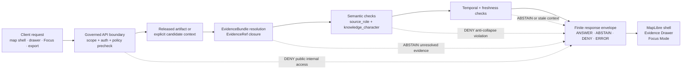

<!-- [KFM_META_BLOCK_V2]
doc_id: kfm://doc/TODO-ASSIGN-UUID
title: Atmosphere / Air API Contracts
type: standard
version: v1
status: draft
owners: TODO-VERIFY: atmosphere-air domain steward, API steward, policy steward, data steward
created: TODO-VERIFY-YYYY-MM-DD
updated: 2026-05-06
policy_label: TODO-VERIFY-public-or-restricted
related: [../README.md, ./ARCHITECTURE.md, ./KNOWLEDGE_CHARACTER.md, ./FOCUS_DRAWER_PAYLOADS.md, ./MAP_LAYERS.md, ../../../adr/ADR-0312-atmosphere-air-source-role-boundaries.md, ../../../adr/ADR-0431-atmosphere-air-knowledge-character-boundary.md, ../../../../connectors/pipelines/air/README.md]
tags: [kfm, atmosphere-air, api-contracts, governed-api, evidence, policy, map-first, focus-mode]
notes: [Revises the earlier thin API_CONTRACTS.md into an evidence-bound contract guide; exact public route names, owners, policy label, schema inventory, CI enforcement, and runtime behavior remain NEEDS VERIFICATION.]
[/KFM_META_BLOCK_V2] -->

<a id="top"></a>

# Atmosphere / Air API Contracts

Contract expectations for governed atmosphere and air-quality API payloads, finite outcomes, Evidence Drawer data, Focus Mode responses, release-candidate handoff, and public-surface denial behavior.

<p align="center">
  
  
  
  
  
</p>

<p align="center">
  <a href="#contract-posture">Contract posture</a> ·
  <a href="#repo-fit">Repo fit</a> ·
  <a href="#envelope">Envelope</a> ·
  <a href="#request-contracts">Requests</a> ·
  <a href="#response-contracts">Responses</a> ·
  <a href="#reason-codes">Reason codes</a> ·
  <a href="#validation-gates">Validation gates</a> ·
  <a href="#open-verification">Open verification</a>
</p>

> [!IMPORTANT]
> This file defines the **contract burden** for Atmosphere / Air API payloads. It does not assert that a specific public route, backend framework, OpenAPI file, deployment, dashboard, or CI gate is already live. Route names and implementation bindings remain **NEEDS VERIFICATION** unless confirmed by current repository evidence.

---

## Contract posture

The Atmosphere / Air API surface is downstream of KFM trust. It must expose only governed envelopes over released artifacts, release candidates, or explicitly non-public candidates with visible state.

The API must preserve four boundaries:

| Boundary | API rule | Failure posture |
|---|---|---|
| Lifecycle | Public and semi-public clients do not read RAW, WORK, QUARANTINE, connector-private output, normalization candidates, or internal canonical stores directly. | `DENY` |
| Evidence | Consequential claims resolve `EvidenceRef -> EvidenceBundle` before they become public answers, map popups, drawer payloads, exports, or Focus Mode responses. | `ABSTAIN` or `DENY` |
| Semantics | `source_role` and `knowledge_character` remain visible from source admission through UI/Focus payloads. | `DENY` |
| Release | Publication requires policy, review, release manifest, correction path, and rollback target. | `DENY` or `ERROR` |

### Non-negotiables

1. **Finite outcomes only:** `ANSWER`, `ABSTAIN`, `DENY`, `ERROR`.
2. **No uncited consequential claims:** claim fragments must carry `evidence_refs` or abstain.
3. **No semantic collapse:** AQI is not raw concentration; AOD and smoke masks are not PM2.5 exposure by default; model fields are not observations; fusion products are derived.
4. **No receipt-as-proof:** run receipts record process memory. They are not EvidenceBundles, ProofPacks, ReleaseManifests, or publication authority.
5. **No hidden freshness:** operational or current-state claims require temporal scope, retrieval time, valid time or model time, and visible freshness state.
6. **No public fixture truth:** no-network stubs and fixture-backed candidates may support tests and release-candidate drills; they must not become real-world public truth.

<p align="right"><a href="#top">Back to top ↑</a></p>

---

## Repo fit

This document belongs under the Atmosphere / Air domain documentation lane:

```text
docs/domains/atmosphere_air/architecture/API_CONTRACTS.md
```

Directory-rule basis: this is a human-facing domain architecture document, so it belongs under `docs/domains/atmosphere_air/architecture/` rather than a root-level domain folder. Machine schemas, executable policy, fixtures, tests, connector code, proof objects, and published artifacts remain under their responsibility roots.

| Surface | Path | Status | Contract relationship |
|---|---|---:|---|
| Domain landing page | [`../README.md`](../README.md) | CONFIRMED | Defines lane scope, accepted inputs, exclusions, knowledge characters, governed flow, and denial posture. |
| Architecture overview | [`./ARCHITECTURE.md`](./ARCHITECTURE.md) | CONFIRMED | Defines the lane trust path and non-negotiables. |
| Knowledge character guide | [`./KNOWLEDGE_CHARACTER.md`](./KNOWLEDGE_CHARACTER.md) | CONFIRMED | Lists canonical knowledge characters and anti-collapse rules. |
| Map layer contracts | [`./MAP_LAYERS.md`](./MAP_LAYERS.md) | CONFIRMED | Defines released layer descriptor minimums and UI safety posture. |
| Focus + Evidence Drawer | [`./FOCUS_DRAWER_PAYLOADS.md`](./FOCUS_DRAWER_PAYLOADS.md) | CONFIRMED | Defines required trust fields for drawer and Focus payloads. |
| Source-role ADR | [`../../../adr/ADR-0312-atmosphere-air-source-role-boundaries.md`](../../../adr/ADR-0312-atmosphere-air-source-role-boundaries.md) | CONFIRMED / draft | Requires source-role and knowledge-character separation before claims or public surfaces. |
| Knowledge-character ADR | [`../../../adr/ADR-0431-atmosphere-air-knowledge-character-boundary.md`](../../../adr/ADR-0431-atmosphere-air-knowledge-character-boundary.md) | CONFIRMED / draft | Applies source-role and knowledge-character separation to release, UI, Evidence Drawer, Focus, and lifecycle behavior. |
| No-network connector lane | [`../../../../connectors/pipelines/air/README.md`](../../../../connectors/pipelines/air/README.md) | CONFIRMED | Writes candidate QA summaries and run receipts; does not publish. |
| Candidate writer | [`../../../../connectors/pipelines/air/air_ingest.py`](../../../../connectors/pipelines/air/air_ingest.py) | CONFIRMED | Emits deterministic no-network candidate output and receipt. |
| Release-candidate builder | [`../../../../tools/publishers/air/build_air_release_candidate.py`](../../../../tools/publishers/air/build_air_release_candidate.py) | CONFIRMED | Builds catalog/proof/release-candidate artifacts and evaluates promotion gates. |
| Publication boundary tool | [`../../../../tools/publishers/air/publish_air_release.py`](../../../../tools/publishers/air/publish_air_release.py) | CONFIRMED | Blocks unsafe publication conditions and writes publication manifests or tombstones. |
| Machine schemas | `schemas/contracts/v1/air/*.schema.json` and/or `schemas/contracts/v1/atmosphere/*` | NEEDS VERIFICATION | Tools reference schema paths; active schema inventory and slug compatibility must be verified before enforcement claims. |

> [!WARNING]
> The repo uses more than one atmosphere-related slug pressure point: human docs use `atmosphere_air`, some code and artifacts use `air`, and some doctrine uses `atmosphere`. Do not silently rename API contracts, schema paths, fixtures, or release artifacts. Use ADR-backed compatibility and migration notes.

<p align="right"><a href="#top">Back to top ↑</a></p>

---

## Contract map



### Contract families

| Family | Purpose | Route status |
|---|---|---:|
| Query request | Bound the caller’s spatial, temporal, parameter, source-role, and knowledge-character scope. | PROPOSED shape; route names not asserted. |
| Feature / timeseries response | Return released or explicitly candidate-scoped atmosphere values with trust metadata. | PROPOSED shape. |
| Layer descriptor response | Feed map layers with released source identifier, freshness, evidence route, review state, and rights posture. | PROPOSED shape; see [`MAP_LAYERS.md`](./MAP_LAYERS.md). |
| Evidence Drawer payload | Explain source role, knowledge character, freshness, review/policy state, hashes, conflicts, and evidence references. | PROPOSED shape; see [`FOCUS_DRAWER_PAYLOADS.md`](./FOCUS_DRAWER_PAYLOADS.md). |
| Focus Mode response | Provide bounded synthesis over admissible EvidenceBundle-backed context only. | PROPOSED shape. |
| Release-candidate handoff | Expose candidate status, promotion decision, release manifest, proof refs, denial reasons, and rollback target. | Partially implementation-backed by tools; API route names not asserted. |
| Denial / abstention response | Make failure states inspectable rather than silent or polished. | REQUIRED contract posture. |

---

## Envelope

All governed Atmosphere / Air API responses must use one finite envelope shape.

```json
{
  "schema_version": "v1",
  "contract_version": "atmosphere-air-api-contracts.v1",
  "domain": "atmosphere.air",
  "request_id": "req-NEEDS_VERIFICATION",
  "generated_at": "2026-05-06T00:00:00Z",
  "outcome": "ANSWER",
  "reason_codes": [],
  "scope": {
    "spatial": {
      "kind": "bbox|place_id|feature_id|tile|station|UNKNOWN",
      "value": "NEEDS_VERIFICATION"
    },
    "temporal": {
      "observed_time": null,
      "valid_time": null,
      "model_time": null,
      "retrieved_at": null,
      "release_time": null,
      "freshness_status": "current|stale|expired|unknown"
    },
    "parameters": ["pm25"],
    "knowledge_characters": ["OBSERVED_SENSOR"],
    "source_roles": ["OBSERVATION_PROVIDER"]
  },
  "policy": {
    "decision": "allow|deny|restrict|abstain|error",
    "policy_label": "TODO-VERIFY",
    "public_release_allowed": false,
    "review_state": "draft|candidate|reviewed|released|withdrawn|superseded|unknown"
  },
  "evidence": {
    "evidence_refs": [],
    "evidence_bundle_refs": [],
    "release_manifest_ref": null,
    "run_receipt_ref": null,
    "promotion_decision_ref": null,
    "rollback_ref": null
  },
  "data": {},
  "messages": [],
  "debug": {
    "included": false,
    "note": "Debug payloads must not expose secrets, RAW, WORK, QUARANTINE, connector-private paths, or unpublished internals."
  }
}
```

### Outcome semantics

| Outcome | Meaning | Required payload behavior |
|---|---|---|
| `ANSWER` | The request can be answered within scope and policy using released or explicitly authorized evidence. | Include evidence refs, source role, knowledge character, temporal support, freshness, and release or candidate state. |
| `ABSTAIN` | The system cannot responsibly answer from available evidence. | Include what is missing: evidence, temporal support, source role, freshness, review state, or scope. |
| `DENY` | The request is blocked by policy, rights, public-surface boundary, semantic collapse, sensitivity, fixture/publication rule, or release state. | Include stable `reason_codes`; do not include restricted/internal data. |
| `ERROR` | A technical or contract failure occurred: malformed request, schema failure, missing required internal artifact, unavailable dependency. | Include safe diagnostic class; do not leak internal secrets or raw payloads. |

> [!IMPORTANT]
> `ABSTAIN` is not a failure to be hidden. In KFM, abstention is the correct answer when evidence, source role, knowledge character, temporal support, freshness, or review state is insufficient.

<p align="right"><a href="#top">Back to top ↑</a></p>

---

## Request contracts

Route names are intentionally not asserted here. The shapes below are contract families that future OpenAPI, JSON Schema, handlers, CLI commands, tests, and UI adapters should align to.

### `AtmosphereAirQueryRequest`

Use this for map queries, drawer drilldowns, export preparation, and Focus evidence retrieval.

```json
{
  "schema_version": "v1",
  "request_kind": "atmosphere_air_query",
  "client_surface": "map|drawer|focus|export|review_console|internal_dryrun",
  "scope": {
    "spatial": {
      "kind": "bbox|feature_id|station_id|place_id|tile",
      "value": "NEEDS_VERIFICATION"
    },
    "temporal": {
      "start": "2026-05-01T00:00:00Z",
      "end": "2026-05-01T01:00:00Z",
      "basis": "observed_time|valid_time|model_time|retrieved_at|release_time"
    }
  },
  "filters": {
    "parameters": ["pm25"],
    "knowledge_characters": ["OBSERVED_SENSOR"],
    "source_roles": ["OBSERVATION_PROVIDER"],
    "freshness_status": ["current", "stale"],
    "release_state": ["released", "catalog_candidate"]
  },
  "requirements": {
    "evidence_required": true,
    "public_safe_only": true,
    "include_drawer_payload": false,
    "include_focus_context": false
  }
}
```

Required behavior:

- deny requests that ask public clients to read RAW, WORK, QUARANTINE, connector-private, normalization-candidate, or unpublished processed paths;
- abstain when the temporal basis is missing for a consequential current-state claim;
- deny when `knowledge_character` or `source_role` is missing and cannot be resolved;
- deny when a fixture-backed or no-network artifact is requested as real public truth.

### `AtmosphereAirFeatureRequest`

Use this for a feature selected from the map shell.

```json
{
  "schema_version": "v1",
  "request_kind": "atmosphere_air_feature",
  "feature_ref": {
    "layer_id": "air-layer-NEEDS_VERIFICATION",
    "feature_id": "feature-NEEDS_VERIFICATION",
    "release_manifest_ref": "data/catalog/air/NEEDS_VERIFICATION/release_manifest.json"
  },
  "include": {
    "drawer_payload": true,
    "evidence_summary": true,
    "timeseries_window": false
  }
}
```

Required behavior:

- resolve the layer to a released descriptor or an explicitly non-public review candidate;
- return `DENY` if the feature points to internal lifecycle paths;
- return `ABSTAIN` if the selected feature lacks EvidenceBundle support for a requested claim;
- show caveats for report/model/mask/fusion/advisory objects.

### `AtmosphereAirFocusRequest`

Use this for bounded synthesis.

```json
{
  "schema_version": "v1",
  "request_kind": "atmosphere_air_focus",
  "question": "What does the evidence say about PM2.5 near this place during this hour?",
  "evidence_context": {
    "evidence_bundle_refs": [],
    "release_manifest_refs": [],
    "layer_feature_refs": []
  },
  "constraints": {
    "cite_or_abstain": true,
    "public_safe_only": true,
    "max_claims": 5,
    "allowed_outcomes": ["ANSWER", "ABSTAIN", "DENY", "ERROR"]
  }
}
```

Required behavior:

- use only admissible, policy-safe, EvidenceBundle-backed context;
- deny direct model-runtime prompts that bypass the governed API;
- abstain when citations cannot support the answer;
- never convert generated language into evidence, review state, policy approval, or release state.

<p align="right"><a href="#top">Back to top ↑</a></p>

---

## Response contracts

### `AtmosphereAirObservationResponse`

Use only when the value represents an observed or low-cost sensor measurement with sufficient source/site/time context.

```json
{
  "schema_version": "v1",
  "contract": "AtmosphereAirObservationResponse",
  "outcome": "ANSWER",
  "domain": "atmosphere.air",
  "observation": {
    "observation_id": "obs-NEEDS_VERIFICATION",
    "parameter": "pm25",
    "raw_value": 21.0,
    "raw_unit": "ug_m3",
    "normalized_value": 21.0,
    "normalized_unit": "ug_m3",
    "knowledge_character": "OBSERVED_SENSOR",
    "source_role": "OBSERVATION_PROVIDER",
    "site_ref": "site-NEEDS_VERIFICATION",
    "observed_time": "2026-05-01T00:00:00Z",
    "retrieved_at": "2026-05-01T01:00:00Z",
    "freshness_status": "current",
    "quality_flags": []
  },
  "evidence": {
    "evidence_refs": ["eref-NEEDS_VERIFICATION"],
    "evidence_bundle_refs": ["eb-NEEDS_VERIFICATION"],
    "run_receipt_ref": "data/receipts/air/run_receipt.example.json",
    "release_manifest_ref": null
  },
  "policy": {
    "public_release_allowed": false,
    "review_state": "candidate",
    "decision": "candidate"
  }
}
```

### `AtmosphereAirReportResponse`

Use for AQI, NowCast-style report/index objects, or public agency reports. Do not use it as raw concentration.

```json
{
  "schema_version": "v1",
  "contract": "AtmosphereAirReportResponse",
  "outcome": "ANSWER",
  "domain": "atmosphere.air",
  "report": {
    "report_id": "report-NEEDS_VERIFICATION",
    "report_kind": "AQI|NowCast|agency_index|advisory",
    "parameter_context": ["pm25"],
    "index_value": null,
    "knowledge_character": "PUBLIC_AQI_REPORT",
    "source_role": "PUBLIC_REPORTING_PROVIDER",
    "issuer": "NEEDS_VERIFICATION",
    "valid_time": {
      "start": "2026-05-01T00:00:00Z",
      "end": "2026-05-01T01:00:00Z"
    },
    "caveats": ["Report/index object; not raw concentration."]
  },
  "evidence": {
    "evidence_refs": [],
    "evidence_bundle_refs": []
  },
  "policy": {
    "decision": "allow|deny|candidate|abstain",
    "public_release_allowed": false
  }
}
```

### `AtmosphereAirModelOrMaskResponse`

Use for model fields, remote-sensing masks, AOD, smoke, fire, aerosol, climate-anomaly, and context layers.

```json
{
  "schema_version": "v1",
  "contract": "AtmosphereAirModelOrMaskResponse",
  "outcome": "ANSWER",
  "domain": "atmosphere.air",
  "context_object": {
    "object_id": "ctx-NEEDS_VERIFICATION",
    "knowledge_character": "ATMOSPHERIC_MODEL_FIELD|REMOTE_SENSING_MASK|VISIBILITY_AND_AEROSOL_CONTEXT|FIRE_AND_EMISSIONS_CONTEXT|CLIMATE_ANOMALY_CONTEXT",
    "source_role": "MODEL_PROVIDER|REMOTE_SENSING_PROVIDER|DERIVED_PRODUCT_GENERATOR",
    "variable": "smoke|aod|pm25_model|wind|temperature|NEEDS_VERIFICATION",
    "time_basis": "model_time|valid_time|retrieved_at",
    "model_or_product_ref": "NEEDS_VERIFICATION",
    "assumptions_ref": "NEEDS_VERIFICATION",
    "uncertainty": {
      "status": "provided|not_provided|not_applicable",
      "summary": "NEEDS_VERIFICATION"
    },
    "caveats": [
      "This object is not an observed surface measurement unless separately evidenced."
    ]
  },
  "evidence": {
    "input_evidence_refs": [],
    "evidence_bundle_refs": []
  },
  "policy": {
    "decision": "allow|deny|candidate|abstain",
    "public_release_allowed": false
  }
}
```

### `AtmosphereAirFusionResponse`

Use for interpolation, bias correction, ensemble, consensus, or fused products.

```json
{
  "schema_version": "v1",
  "contract": "AtmosphereAirFusionResponse",
  "outcome": "ANSWER",
  "domain": "atmosphere.air",
  "fusion_product": {
    "fusion_id": "fusion-NEEDS_VERIFICATION",
    "knowledge_character": "DERIVED_FUSION",
    "source_role": "DERIVED_PRODUCT_GENERATOR",
    "method_ref": "method-NEEDS_VERIFICATION",
    "transform_hash": "sha256-NEEDS_VERIFICATION",
    "input_evidence_refs": [],
    "uncertainty": {
      "status": "required",
      "summary": "NEEDS_VERIFICATION"
    },
    "caveats": [
      "Derived product; not canonical source observation."
    ]
  },
  "evidence": {
    "evidence_refs": [],
    "evidence_bundle_refs": []
  },
  "policy": {
    "decision": "allow|deny|candidate|abstain",
    "public_release_allowed": false
  }
}
```

<p align="right"><a href="#top">Back to top ↑</a></p>

---

## Evidence Drawer and Focus payloads

### Evidence Drawer minimum

A drawer payload must show the trust state at the point of use.

| Field | Required | Notes |
|---|---:|---|
| `drawer_id` | Yes | Stable payload identifier. |
| `selected_feature_ref` | Yes | Layer + feature + release/candidate ref. |
| `source_role` | Yes | Required by ADR-0312 and ADR-0431. |
| `knowledge_character` | Yes | Required by ADR-0312 and ADR-0431. |
| `temporal_scope` | Yes | Include observed/valid/model/retrieval/release basis where material. |
| `freshness_status` | Yes | `current`, `stale`, `expired`, `unknown`, or repo-approved equivalent. |
| `review_state` | Yes | Candidate vs released must be visible. |
| `policy_posture` | Yes | Public/restricted/denied/unknown. |
| `rights_status` | Yes | Unknown rights block public release. |
| `evidence_refs` | Yes for claims | Drawer must resolve or visibly abstain. |
| `hash_refs` | Required where applicable | Source payload hash, transform hash, artifact hash. |
| `conflict_markers` | Required when present | Do not hide source disagreement. |
| `rollback_ref` | Required for published artifacts | Publication must remain reversible. |

### Focus response minimum

```json
{
  "schema_version": "v1",
  "contract": "AtmosphereAirFocusResponse",
  "outcome": "ANSWER",
  "domain": "atmosphere.air",
  "answer": {
    "summary": "Evidence-bounded synthesis goes here.",
    "claim_fragments": [
      {
        "text": "The PM2.5 fixture candidate reports a maximum value of 21.0 ug/m3 for the scoped hour.",
        "knowledge_character": "OBSERVED_SENSOR",
        "source_role": "OBSERVATION_PROVIDER",
        "evidence_refs": ["eref-NEEDS_VERIFICATION"],
        "caveats": ["Candidate fixture context; not public truth."]
      }
    ]
  },
  "citation_validation": {
    "status": "passed|failed|not_applicable",
    "unsupported_claims": []
  },
  "policy": {
    "decision": "allow|deny|abstain|error",
    "reason_codes": []
  }
}
```

Focus Mode must return `ABSTAIN` when it cannot cite support, `DENY` when a policy or public-surface boundary blocks the request, and `ERROR` when the contract or runtime fails.

---

## Release-candidate handoff

The release-candidate API family is not a substitute for publication. It exposes the state of a governed candidate.

```json
{
  "schema_version": "v1",
  "contract": "AtmosphereAirReleaseCandidateStatus",
  "domain": "atmosphere.air",
  "outcome": "ANSWER",
  "release_candidate": {
    "candidate_id": "rc-NEEDS_VERIFICATION",
    "status": "candidate|catalog_candidate|publication_candidate|published|quarantine|withdrawn|superseded",
    "qa_summary_ref": "data/processed/air/qa_summary.example.json",
    "run_receipt_ref": "data/receipts/air/run_receipt.example.json",
    "evidence_bundle_ref": "NEEDS_VERIFICATION",
    "promotion_decision_ref": "NEEDS_VERIFICATION",
    "release_manifest_ref": "NEEDS_VERIFICATION",
    "publication_manifest_ref": null,
    "rollback_ref": null,
    "tombstone_ref": null
  },
  "gates": {
    "gate_a_nowcast_gt_35": {
      "triggered": false,
      "threshold_ug_m3": 35
    },
    "gate_b_nowcast_vs_baseline_sigma_gt_2": {
      "triggered": false,
      "threshold_sigma": 2
    },
    "gate_c_station_coverage_lt_75": {
      "triggered": false,
      "threshold_pct": 75
    },
    "gate_d_signed_attestation": {
      "present": false,
      "required_for_override_or_publication": true
    },
    "aqs_reconciliation": {
      "status": "missing|pending|reconciled|conflict_detected|unknown"
    }
  },
  "policy": {
    "decision": "candidate",
    "public_release_allowed": false,
    "reason_codes": []
  }
}
```

### Release-candidate rules

| Rule | Contract behavior |
|---|---|
| NowCast is operational evidence, not validated AQS truth. | Deny if labeled as validated truth. |
| `nowcast_max > 35 ug_m3` | Deny or quarantine unless governed override path exists. |
| `nowcast_vs_baseline_sigma > 2` | Deny or quarantine unless governed override path exists. |
| `station_coverage_pct < 75` | Deny or require steward review. |
| AQS hard-denial rows in baseline | Deny. |
| Missing run receipt or EvidenceBundle | Deny public publication. |
| Missing Gate D attestation for publication | Deny publication. |
| Fixture-backed artifacts requested as real publication | Deny. |
| Missing or stale AQS reconciliation for publication | Deny. |
| Raw, work, quarantine, or processed path leaks in public manifest | Deny. |

<p align="right"><a href="#top">Back to top ↑</a></p>

---

## Reason codes

Use stable, reason-coded denials and abstentions. Do not return vague failure strings.

| Code | Outcome | Condition |
|---|---:|---|
| `ATMOS_MISSING_SOURCE_ROLE` | `DENY` | Object lacks `source_role` or resolvable source descriptor. |
| `ATMOS_MISSING_KNOWLEDGE_CHARACTER` | `DENY` | Object lacks accepted `knowledge_character`. |
| `ATMOS_MISSING_RIGHTS` | `DENY` | Source rights or terms are absent. |
| `ATMOS_UNKNOWN_RIGHTS_PUBLIC` | `DENY` | Public output requested while rights are unknown or `NOASSERTION`. |
| `ATMOS_MISSING_EVIDENCE_REFS` | `ABSTAIN` / `DENY` | Consequential claim lacks EvidenceRefs. |
| `ATMOS_EVIDENCE_REF_UNRESOLVED` | `ABSTAIN` / `ERROR` | EvidenceRefs do not resolve to EvidenceBundle. |
| `ATMOS_MISSING_SOURCE_PAYLOAD_HASH` | `DENY` | Normalized record cannot be traced to source payload. |
| `ATMOS_MISSING_TRANSFORM_HASH` | `DENY` | Derived record lacks transform identity. |
| `ATMOS_PUBLIC_RELEASE_FALSE` | `DENY` | Source descriptor or release gate blocks public release. |
| `ATMOS_LOW_COST_NO_CORRECTION` | `DENY` | Low-cost sensor lacks correction/caveat support. |
| `ATMOS_MODEL_AS_OBSERVED` | `DENY` | Model output is labeled as observed measurement. |
| `ATMOS_AQI_AS_CONCENTRATION` | `DENY` | AQI/report index is treated as raw concentration. |
| `ATMOS_AOD_AS_PM25` | `DENY` | AOD is treated as PM2.5 without governed model support. |
| `ATMOS_MASK_AS_EXPOSURE` | `DENY` | Smoke/plume/remote mask is treated as exposure measurement. |
| `ATMOS_FUSION_INPUTS_HIDDEN` | `DENY` | Fusion product omits input EvidenceRefs, method, uncertainty, or transform identity. |
| `ATMOS_ANOMALY_AS_ALERT` | `DENY` | Climate anomaly is promoted as emergency alert. |
| `ATMOS_RECEIPT_AS_PROOF` | `DENY` | Run receipt is used as EvidenceBundle, ProofPack, or ReleaseManifest. |
| `ATMOS_STALE_CONTEXT_UNLABELED` | `ABSTAIN` | Stale or expired context lacks visible stale posture. |
| `ATMOS_PUBLIC_INTERNAL_ACCESS` | `DENY` | Public surface attempts RAW, WORK, QUARANTINE, connector-private, normalize-stage, processed-candidate, or unpublished candidate access. |
| `ATMOS_ROLLBACK_TARGET_MISSING` | `DENY` | Publication candidate lacks rollback target. |
| `ATMOS_CORRECTION_PATH_MISSING` | `DENY` | Publication candidate lacks correction or withdrawal path. |
| `ATMOS_FIXTURE_PUBLIC_TRUTH` | `DENY` | Fixture-backed or no-network stub artifact is requested as real-world public truth. |
| `ATMOS_NOWCAST_VALIDATED_TRUTH` | `DENY` | NowCast or operational evidence is mislabeled as validated AQS truth. |
| `ATMOS_AQS_RECONCILIATION_NOT_READY` | `DENY` | AQS reconciliation is missing, pending, conflicted, or older than the accepted window for publication. |
| `ATMOS_GATE_D_ATTESTATION_MISSING` | `DENY` | Signed attestation is missing when required for override or publication. |

---

## Validation gates

API contract acceptance requires evidence from docs, schemas, fixtures, validators, policy checks, tests, and release artifacts.

### Documentation gates

- [ ] This file’s KFM Meta Block has verified `doc_id`, owners, dates, and policy label.
- [ ] [`../README.md`](../README.md), [`./ARCHITECTURE.md`](./ARCHITECTURE.md), [`./KNOWLEDGE_CHARACTER.md`](./KNOWLEDGE_CHARACTER.md), [`./FOCUS_DRAWER_PAYLOADS.md`](./FOCUS_DRAWER_PAYLOADS.md), and this file do not contradict each other.
- [ ] ADR-0312 and ADR-0431 are cross-linked from this file and from the domain README.
- [ ] Any `air` / `atmosphere` / `atmosphere_air` schema or route slug decision is recorded in an ADR or migration note.
- [ ] This file is listed by any applicable domain documentation index.

### Schema and fixture gates

- [ ] Active schema home is verified before enforcement claims.
- [ ] Response envelope schema exists or is linked from the active schema registry.
- [ ] Valid fixtures cover `ANSWER`, `ABSTAIN`, `DENY`, and `ERROR`.
- [ ] Invalid fixtures cover missing source role, missing knowledge character, unknown rights, missing evidence, raw path leak, processed path exposure, fixture-as-public-truth, model-as-observed, AQI-as-concentration, AOD-as-PM2.5, mask-as-exposure, receipt-as-proof, and stale context.
- [ ] Release-candidate fixtures cover pass, denial, tombstone, rollback, and retraction behavior.

### Runtime and policy gates

- [ ] Public client requests cannot route to RAW, WORK, QUARANTINE, connector-private, normalize-stage, or processed-candidate artifacts.
- [ ] Evidence Drawer payloads resolve EvidenceRefs or visibly abstain.
- [ ] Focus Mode cannot return uncited consequential claims.
- [ ] Publication candidates require run receipt, EvidenceBundle, promotion decision, release manifest, attestation where required, correction path, and rollback target.
- [ ] Fixture-backed outputs cannot be promoted as real public truth.
- [ ] Policy returns stable reason codes, not generic errors.

### Suggested local verification

The following commands are examples only. Adapt them to the repo-native package manager, test runner, and CI workflow before treating them as authoritative.

```bash
# Confirm target file and adjacent docs.
find docs/domains/atmosphere_air -maxdepth 3 -type f | sort

# Verify the no-network air connector examples still parse.
python connectors/pipelines/air/air_ingest.py
python -m json.tool data/processed/air/qa_summary.example.json > /dev/null
python -m json.tool data/receipts/air/run_receipt.example.json > /dev/null

# Inspect release-candidate tooling without claiming publication.
python tools/publishers/air/build_air_release_candidate.py \
  --qa-summary data/processed/air/qa_summary.example.json \
  --run-receipt data/receipts/air/run_receipt.example.json \
  --out-dir build/air/release_candidate \
  --allow-quarantine-output

# Run air tests if the current checkout confirms their dependencies.
pytest -q tests/air
```

> [!CAUTION]
> Do not run publication tooling against real public paths until source rights, schema inventory, policy, EvidenceBundle closure, release manifest, rollback target, and steward review are verified.

<p align="right"><a href="#top">Back to top ↑</a></p>

---

## Compatibility and versioning

| Compatibility issue | Required treatment |
|---|---|
| Human docs slug `atmosphere_air` | Keep as the domain documentation lane unless an ADR supersedes it. |
| Code/data slug `air` | Preserve while release-candidate tooling and fixtures use it; do not rename silently. |
| Domain identifier `atmosphere.air` | Treat as the domain value used by candidate/release tooling until an ADR says otherwise. |
| Machine schema roots | Verify actual inventory before claiming enforcement. Tools reference `schemas/contracts/v1/air/*`; doctrine may reference `schemas/contracts/v1/atmosphere/*`. |
| Public route names | Do not assert until backend route evidence is inspected. |
| OpenAPI | PROPOSED future home; not claimed by this file. |
| Backward compatibility | Prefer alias records, fixtures, migration notes, and rollback cards over breaking changes. |

---

## Definition of done

This API contract file is ready for review when:

- [ ] it preserves the KFM trust path and does not imply public direct access to internal lifecycle data;
- [ ] it is synchronized with the domain README, architecture note, knowledge-character note, map-layer note, Focus/Drawer note, ADR-0312, and ADR-0431;
- [ ] it distinguishes route-shape guidance from confirmed implemented routes;
- [ ] it names finite outcomes and reason-coded failures;
- [ ] it covers observation, report, model/mask/context, fusion, drawer, Focus, and release-candidate payload families;
- [ ] it keeps run receipts, EvidenceBundles, promotion decisions, release manifests, publication manifests, tombstones, and rollback targets separate;
- [ ] it marks schema inventory, owners, policy label, and route bindings as NEEDS VERIFICATION where current evidence is not sufficient;
- [ ] it gives maintainers enough examples to implement OpenAPI/JSON Schema/tests without inventing KFM semantics.

---

## Open verification

| Item | Status | Why it matters |
|---|---:|---|
| Final owners | TODO / NEEDS VERIFICATION | Required for API contract review and release-boundary changes. |
| Final policy label | TODO / NEEDS VERIFICATION | Determines whether this doc is public, internal, or restricted. |
| `doc_id` UUID | TODO | Required by KFM Meta Block v2. |
| Active schema inventory | NEEDS VERIFICATION | Tools reference `schemas/contracts/v1/air/*`; schema presence and active schema home must be verified before enforcement claims. |
| Public route names | UNKNOWN | This file defines contract families, not confirmed deployed routes. |
| OpenAPI home | UNKNOWN | No OpenAPI path is asserted here. |
| CI enforcement | NEEDS VERIFICATION | Tests and fixtures may exist, but this file does not claim CI status without workflow evidence. |
| Runtime logs and dashboards | UNKNOWN | No runtime behavior or deployment telemetry is asserted. |
| Source rights and live-source terms | UNKNOWN | Public release must fail closed while source terms remain unresolved. |
| Focus Mode runtime binding | UNKNOWN | Payload rules are defined; live Focus route behavior is not asserted. |
| EvidenceBundle closure for example references | NEEDS VERIFICATION | Example refs must resolve before consequential public claims rely on them. |
| AQS reconciliation workflow | NEEDS VERIFICATION | Publication boundary depends on reconciliation state and freshness. |

<p align="right"><a href="#top">Back to top ↑</a></p>
