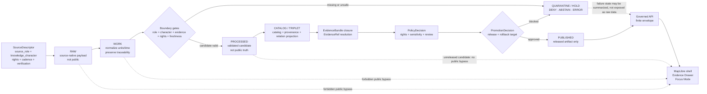
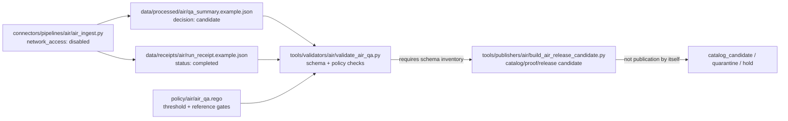
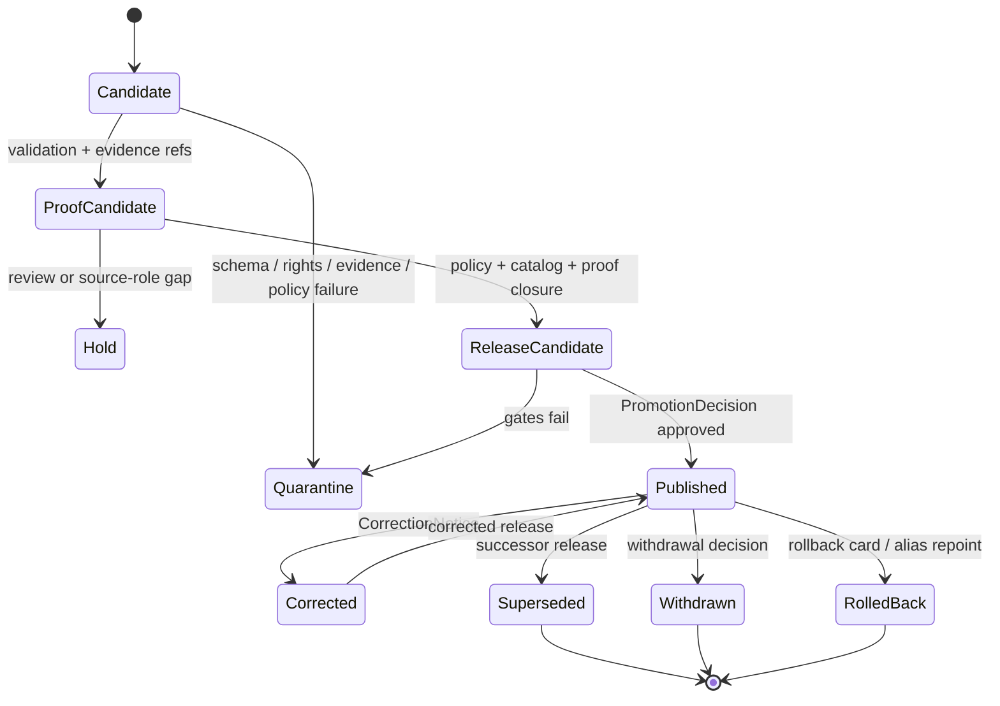

<!-- [KFM_META_BLOCK_V2]
doc_id: kfm://doc/TODO-ASSIGN-UUID
title: Atmosphere / Air Architecture
type: standard
version: v1
status: draft
owners: TODO-VERIFY: atmosphere-air domain steward, data steward, policy steward
created: TODO-VERIFY-YYYY-MM-DD
updated: 2026-05-06
policy_label: public-draft-NEEDS_VERIFICATION
related: [../README.md, ../../../adr/ADR-0312-atmosphere-air-source-role-boundaries.md, ../../../adr/ADR-0431-atmosphere-air-knowledge-character-boundary.md, ../../../adr/ADR-0418-atmosphere-air-schema-slug-compatibility.md, ../../../architecture/contract-schema-policy-split.md, ../../../../connectors/pipelines/air/README.md, ../../../../pipelines/normalize/domains/atmosphere/README.md, ../../../../policy/air/air_qa.rego, ../../../../tools/validators/air/validate_air_qa.py, ../../../../tools/publishers/air/build_air_release_candidate.py, ../../../../data/processed/air/qa_summary.example.json, ../../../../data/receipts/air/run_receipt.example.json]
tags: [kfm, atmosphere-air, architecture, evidence, source-role, knowledge-character, map-first, time-aware, governed-domain]
notes: [Revises repo-visible docs/domains/atmosphere_air/architecture/ARCHITECTURE.md. Local workspace was not a mounted Git checkout; public repo evidence was checked through the GitHub connector. doc_id, owners, created date, final policy label, schema inventory, CI status, source rights, and release maturity remain NEEDS VERIFICATION.]
[/KFM_META_BLOCK_V2] -->

<a id="top"></a>

# Atmosphere / Air Architecture

Trust-preserving architecture for atmosphere and air-quality evidence from source admission through governed map, API, Evidence Drawer, Focus Mode, publication, correction, and rollback surfaces.

<p align="center">
  
  
  
  
  
  
</p>

<p align="center">
  <a href="#architecture-posture">Posture</a> ·
  <a href="#repo-fit">Repo fit</a> ·
  <a href="#domain-boundary">Boundary</a> ·
  <a href="#trust-flow">Trust flow</a> ·
  <a href="#bounded-contexts">Contexts</a> ·
  <a href="#knowledge-character-taxonomy">Taxonomy</a> ·
  <a href="#current-no-network-slice">Current slice</a> ·
  <a href="#validation-and-policy">Validation</a> ·
  <a href="#public-surface-contract">Public surfaces</a> ·
  <a href="#open-verification-backlog">Open verification</a>
</p>

> [!IMPORTANT]
> This architecture does **not** authorize live source fetching, public release, public map layers, direct UI/API access to internal lifecycle data, or Focus Mode answers. It defines the lane boundary that future schemas, validators, policy checks, EvidenceBundles, release manifests, and rollback records must preserve.

---

## Architecture posture

The Atmosphere / Air lane is not a single “air layer.” It is a governed domain lane for atmospheric observations, air-quality reports, regulatory archives, low-cost sensor candidates, model fields, smoke and aerosol context, remote-sensing masks, climate anomaly support, fusion products, advisories, station metadata, temporal support, and public-safe map delivery.

The architecture exists to prevent **epistemic collapse**: a visually persuasive map, chart, tile, popup, export, or AI answer must not make fundamentally different evidence classes look equivalent.

| Rule | Status | Consequence |
|---|---:|---|
| Preserve `source_role` and `knowledge_character` end to end. | CONFIRMED doctrine / PROPOSED enforcement | Every consequential object must state what kind of source it came from and what kind of knowledge it represents. |
| Keep observed, modeled, reported, classified, advisory, and fused products distinct. | CONFIRMED doctrine | AQI, PM concentration, AOD, smoke masks, model fields, climate anomalies, advisories, and fusion products are not interchangeable. |
| Public delivery consumes released artifacts and governed envelopes only. | CONFIRMED doctrine | UI, API, exports, map layers, and Focus Mode must not read `RAW`, `WORK`, `QUARANTINE`, connector-private output, or unpublished candidates directly. |
| Promotion is a governed decision. | CONFIRMED doctrine | Promotion requires evidence, policy, review, proof, release, correction, and rollback state; it is not a file move or script success. |
| Current implementation depth remains bounded. | CONFIRMED repo path / NEEDS VERIFICATION maturity | A no-network air QA slice is repo-referenced, but complete schema inventory, CI enforcement, proof closure, and public release remain unverified. |

### Non-negotiables

1. No direct public UI/API/Focus access to `RAW`, `WORK`, `QUARANTINE`, connector-private output, normalization candidates, unpublished processed candidates, or direct model outputs.
2. No public object without source role, knowledge character, rights posture, evidence closure, review state, release state, correction path, and rollback target appropriate to its public burden.
3. No modeled, fused, interpolated, or remote-sensing object labeled as observed.
4. No AQI or public report index presented as raw concentration.
5. No AOD, smoke mask, plume mask, hotspot, or classification product presented as surface exposure measurement without governed model/fusion support.
6. No run receipt, QA summary, map tile, graph projection, vector index, summary, or Focus answer treated as sovereign truth.

<p align="right"><a href="#top">Back to top ↑</a></p>

---

## Repo fit

This file belongs under the `docs/` responsibility root because it is human-facing architecture doctrine for a domain lane. Domain-specific material belongs under `docs/domains/<lane>/`; machine validation belongs under the active schema home; policy belongs under `policy/`; lifecycle data belongs under `data/`; connector logic belongs under `connectors/`; and runtime/public clients remain downstream of governed APIs and released artifacts.

**Target file:** `docs/domains/atmosphere_air/architecture/ARCHITECTURE.md`

### Upstream and downstream surfaces

| Surface | Path | Status | Role |
|---|---|---:|---|
| Domain README | [`../README.md`](../README.md) | CONFIRMED via connector | Lane orientation, accepted inputs, exclusions, knowledge-character posture, denial codes, and first-PR discipline. |
| Source-role ADR | [`../../../adr/ADR-0312-atmosphere-air-source-role-boundaries.md`](../../../adr/ADR-0312-atmosphere-air-source-role-boundaries.md) | CONFIRMED via connector | Mandatory source-role and knowledge-character decision boundary. |
| Knowledge-character ADR | [`../../../adr/ADR-0431-atmosphere-air-knowledge-character-boundary.md`](../../../adr/ADR-0431-atmosphere-air-knowledge-character-boundary.md) | REPO-REFERENCED / NEEDS VERIFICATION | Release/UI/Focus boundary for knowledge characters and anti-collapse rules. |
| Slug compatibility ADR | [`../../../adr/ADR-0418-atmosphere-air-schema-slug-compatibility.md`](../../../adr/ADR-0418-atmosphere-air-schema-slug-compatibility.md) | REPO-REFERENCED / NEEDS VERIFICATION | Governs `atmosphere_air`, `air`, and `atmosphere` naming and migration compatibility. |
| Contract / schema / policy split | [`../../../architecture/contract-schema-policy-split.md`](../../../architecture/contract-schema-policy-split.md) | REPO-REFERENCED / NEEDS VERIFICATION | Keeps semantic contracts, machine schemas, and admissibility policy separate. |
| No-network connector lane | [`../../../../connectors/pipelines/air/README.md`](../../../../connectors/pipelines/air/README.md) | REPO-REFERENCED / NEEDS VERIFICATION | Connector-local no-network candidate and receipt flow. |
| Normalization lane | [`../../../../pipelines/normalize/domains/atmosphere/README.md`](../../../../pipelines/normalize/domains/atmosphere/README.md) | REPO-REFERENCED / NEEDS VERIFICATION | Execution-near normalization guidance; not public release. |
| Air QA policy | [`../../../../policy/air/air_qa.rego`](../../../../policy/air/air_qa.rego) | REPO-REFERENCED / NEEDS VERIFICATION | Current air QA denial pressure; not complete whole-domain policy. |
| Air QA validator | [`../../../../tools/validators/air/validate_air_qa.py`](../../../../tools/validators/air/validate_air_qa.py) | REPO-REFERENCED / NEEDS VERIFICATION | Validates QA summary shape and local policy gates when required schema exists. |
| Release-candidate builder | [`../../../../tools/publishers/air/build_air_release_candidate.py`](../../../../tools/publishers/air/build_air_release_candidate.py) | REPO-REFERENCED / NEEDS VERIFICATION | Builds catalog/proof/release candidates; public publication remains gated. |
| QA candidate | [`../../../../data/processed/air/qa_summary.example.json`](../../../../data/processed/air/qa_summary.example.json) | REPO-REFERENCED / candidate only | No-network processed candidate; not public truth. |
| Run receipt | [`../../../../data/receipts/air/run_receipt.example.json`](../../../../data/receipts/air/run_receipt.example.json) | REPO-REFERENCED / process memory only | No-network connector receipt; not proof or release authority. |
| Schema family | `schemas/contracts/v1/air/` and/or `schemas/contracts/v1/atmosphere/` | NEEDS VERIFICATION | Do not claim schema authority or migration until ADR acceptance, inventory, fixtures, validators, and rollback evidence exist. |

> [!WARNING]
> `atmosphere_air` is the current documentation lane, `air` is the current no-network implementation/tooling slice, and `atmosphere` is a proposed whole-domain schema/normalization concept. Do not silently rename, collapse, alias, or publish across those surfaces.

### Responsibility-root basis

| Root | Owns | Must not silently own |
|---|---|---|
| `docs/` | Doctrine, architecture, ADRs, domain guidance, runbooks, review notes. | Machine schema authority, raw data, release proof packs. |
| `schemas/` | Machine-checkable shape and versioned schema IDs. | Semantic meaning as the only source of truth. |
| `contracts/` | Human-readable object meaning, invariants, and compatibility notes. | Executable policy decisions. |
| `policy/` | Rights, sensitivity, source-role admissibility, release, deny/abstain behavior. | General object semantics or source-native data. |
| `connectors/` | Source-facing acquisition adapters and no-network fixtures. | Public release, truth authority, or UI rendering. |
| `pipelines/` | Transformation and normalization flows. | Public release by script success. |
| `data/` | Lifecycle data, receipts, proofs, catalog outputs, published artifacts. | Unreviewed public truth. |
| `release/` | Release decisions, manifests, rollback targets, correction state when repo convention confirms. | Raw source data or unpublished candidates. |

<p align="right"><a href="#top">Back to top ↑</a></p>

---

## Domain boundary

### Accepted inputs

The lane accepts only source-grounded, lifecycle-aware, reviewable inputs.

| Input family | Minimum required support | First safe handling |
|---|---|---|
| `SourceDescriptor` | `source_id`, `source_role`, `knowledge_character`, publisher, rights, cadence, verification status, public-release posture. | Registry record; public release blocked while rights or verification are UNKNOWN. |
| Parameter definition | Parameter ID, raw units, normalized unit, conversion rule, caveats, knowledge character. | Parameter registry and unit tests. |
| Observation candidate | Source/site/parameter/time, raw value/unit, normalized value/unit, payload hash, EvidenceRefs. | Offline schema/QC tests; not public. |
| Site or network metadata | Provider site ID, geometry/generalization rule, instrument state, cadence, station health, siting caveats. | Context object; never a measurement value. |
| Model field candidate | Model identity, variable, grid/geometry support, model card ref, valid time, uncertainty. | Modeled-object schema; never observed. |
| Remote mask candidate | Product/sensor, classification, time support, confidence/caveats. | Mask schema; never surface concentration. |
| AQI/advisory candidate | Index/report code, issuer, method, temporal scope, public message source. | Report/advisory schema; never raw concentration. |
| Fusion candidate | Input EvidenceRefs, method, uncertainty, transform hash, output scope. | `DERIVED_FUSION`; proof and drawer disclosure. |
| Run receipt | Run ID, input refs, output refs, transform spec hash, status, validator refs. | Process memory; not release proof. |
| EvidenceBundle candidate | EvidenceRefs, source roles, hashes, provenance, scope, review state. | Proof candidate; promotion required before public use. |
| Layer descriptor | Released source ID, delivery class, knowledge character, evidence route, policy/freshness/review state. | Map shell candidate only after release gate. |

### Included object families

| Family | Examples | Architectural burden |
|---|---|---|
| Observed sensor records | PM2.5, PM10, ozone, NO₂, SO₂, CO, temperature, humidity, wind, pressure, visibility. | Preserve source, instrument/site context, raw value/unit, normalized value/unit, source payload hash, time basis, and EvidenceRefs. |
| Public AQI reports | AQI, NowCast, public agency index/report objects. | Treat as report/index objects; never as raw concentration. |
| Regulatory archives | AQS-like or equivalent quality-assured archives. | Use as archive/regulatory evidence; do not imply live state by default. |
| Low-cost sensor candidates | PurpleAir-like or equivalent contributor networks. | Require correction method, caveats, confidence, rights, and limitations before public use. |
| Model fields | Forecast, reanalysis, hindcast, transport, smoke, aerosol, chemistry fields. | Label as modeled and expose model identity, uncertainty, valid time, and model-card support. |
| Remote-sensing masks | Smoke plumes, AOD, fire hotspots, aerosol/cloud/haze masks. | Treat as classification/support context, not exposure or PM concentration. |
| Climate/anomaly context | Normals, anomalies, baselines, downscaling, hindcasts. | Label as context; not live alerting or emergency instruction. |
| Fusion products | Interpolation, consensus, bias correction, ensembles, fused grids. | Preserve input EvidenceRefs, method, transform hash, uncertainty, and derived status. |
| Advisory context | Public messages, health notices, agency advisories. | Keep issuer, temporal scope, and source; KFM is not an emergency alerting system. |
| Network/site context | Station metadata, provider IDs, cadence, instrument state, siting caveats, station health. | Supports interpretation; not a measurement value. |
| Temporal support | Freshness windows, rolling baselines, persistence/hysteresis windows. | Prevents stale context from appearing current. |

### Exclusions

Do not put these in this architecture surface or its public downstream products:

- secrets, API keys, tokens, `.env` files, credentials, local-only config, or private endpoint details;
- live-source activation before rights, terms, quotas, endpoint schemas, cadence, source role, and public-release posture are verified;
- raw, work, quarantine, or connector-private payloads in public paths;
- public tiles, summaries, exports, UI payloads, or Focus Mode answers that bypass EvidenceBundle resolution;
- AQI treated as concentration;
- AOD treated as PM2.5;
- smoke masks treated as exposure measurement;
- model fields labeled as observations;
- climate anomalies labeled as emergency alerts without governed model-card support;
- fusion products that hide their inputs, method, uncertainty, or transform identity;
- direct model-runtime or MapLibre access to RAW, WORK, QUARANTINE, canonical stores, or unpublished candidate data;
- broad folder moves, schema-home changes, or slug changes without an ADR, migration note, compatibility fixture, and rollback path.

<p align="right"><a href="#top">Back to top ↑</a></p>

---

## Trust flow

```text
SOURCE EDGE -> RAW -> WORK / QUARANTINE -> PROCESSED -> CATALOG / TRIPLET -> PROOF -> PUBLISHED -> GOVERNED API -> UI / FOCUS
```



### Stage obligations

| Stage | Atmosphere / Air obligation |
|---|---|
| `SOURCE EDGE` | Admit source families through descriptor-first review, including `source_role`, `knowledge_character`, rights, cadence, limitations, and public-release posture. |
| `RAW` | Preserve source-native payloads, retrieval time, and payload hash. Do not expose to public clients. |
| `WORK` | Normalize units and timestamps while preserving raw values and source/site/model context. |
| `QUARANTINE / HOLD` | Hold missing rights, missing role, missing character, malformed unit/time support, source conflict, stale live-state claims, schema failure, or policy failure. |
| `PROCESSED` | Store validated candidates. Do not treat them as released truth. |
| `CATALOG / TRIPLET` | Build discovery, provenance, and relation projections without replacing source evidence. |
| `PROOF` | Resolve EvidenceRefs to EvidenceBundle and assemble validation, policy, catalog, and release-support material. |
| `PUBLISHED` | Release public-safe artifacts only with manifest, rollback target, and correction path. |
| `GOVERNED API` | Return finite envelopes and reason codes. |
| `UI / FOCUS` | Render or answer only from released artifacts or governed envelopes; show trust state, caveats, evidence, policy, freshness, and correction status. |

<p align="right"><a href="#top">Back to top ↑</a></p>

---

## Bounded contexts

### 1. Source admission

**Purpose:** decide whether a source may enter the lane and what claims it is competent to support.

| Required input | Required state |
|---|---|
| `source_id` | Stable, unique, deterministic where practical. |
| `source_role` | Observation provider, public reporting provider, regulatory archive, low-cost sensor provider, model provider, remote-sensing provider, advisory issuer, or derived-product generator. |
| `knowledge_character` | Accepted taxonomy value for the object family. |
| Rights and terms | Public release blocked while UNKNOWN or unresolved. |
| Cadence and freshness | Required for live/current-context claims. |
| Known limitations | Must reach Evidence Drawer or public caveat surfaces where material. |

### 2. Connector candidate production

**Current repo-referenced slice:** `connectors/pipelines/air/air_ingest.py` is described as a deterministic no-network PM2.5 QA candidate and run-receipt producer.

| Output | Meaning | Public posture |
|---|---|---|
| `data/processed/air/qa_summary.example.json` | Processed candidate with `decision: candidate`. | Not public truth. |
| `data/receipts/air/run_receipt.example.json` | Run receipt with `network_access: disabled`. | Process memory only. |

### 3. Normalization

**Purpose:** make candidate records more inspectable without declaring truth or release.

Normalization must preserve:

- raw value and raw unit;
- normalized value and normalized unit;
- source identity and source role;
- knowledge character;
- observation/report/model/retrieval time support;
- source payload hash;
- transform/spec hash where applicable;
- run receipt reference;
- EvidenceRefs;
- candidate / denial / abstention / error state.

### 4. Validation and policy

**Purpose:** fail closed when shape, source role, rights, evidence, policy, freshness, or public-surface rules are not satisfied.

Validation checks structure and traceability. Policy decides admissibility. A schema-valid object may still be denied by rights, sensitivity, source-role, evidence, review, release, stale-state, or rollback gates.

### 5. Catalog, proof, and release

**Purpose:** make publication auditable and reversible.

| Object family | Required distinction |
|---|---|
| Run receipt | Process memory; not proof. |
| EvidenceBundle | Claim-supporting evidence closure. |
| Catalog / STAC / DCAT / PROV | Discovery and provenance; not truth by itself. |
| PromotionDecision | Governed decision; may approve, deny, hold, quarantine, or require review. |
| ReleaseManifest | Released artifact scope, hashes, evidence/proof refs, rollback target, correction path. |
| CorrectionNotice / rollback reference | Required when public meaning changes. |

### 6. Runtime, map, and Focus Mode

**Purpose:** expose released evidence with visible trust state.

| Surface | Required behavior |
|---|---|
| Governed API | Return finite outcome envelopes: `ANSWER`, `ABSTAIN`, `DENY`, or `ERROR`. |
| MapLibre shell | Render released layer descriptors only. |
| Evidence Drawer | Show source role, knowledge character, evidence, rights, review, release, freshness, caveats, transform, conflicts, and correction state. |
| Focus Mode | Synthesize only over admissible EvidenceBundle-backed context and citation-validated output. |
| Exports | Include release, evidence, caveat, correction, and rollback references. |

<p align="right"><a href="#top">Back to top ↑</a></p>

---

## Knowledge-character taxonomy

Every consequential object must carry or resolve one accepted `knowledge_character`.

| Knowledge character | Boundary | Required handling |
|---|---|---|
| `OBSERVED_SENSOR` | Ground/station/instrument measurement. | Preserve site/instrument/time, raw/normalized units, and source payload hash. |
| `PUBLIC_AQI_REPORT` | AQI, NowCast, public index, or agency report. | Treat as report/index; never raw concentration. |
| `REGULATORY_ARCHIVE` | Quality-assured or regulatory archive evidence. | Use with archive/regulatory temporal caveats; not live by default. |
| `LOW_COST_SENSOR` | Contributor or consumer sensor candidate. | Require correction method, caveats, confidence, rights, and limitations. |
| `ATMOSPHERIC_MODEL_FIELD` | Forecast, reanalysis, hindcast, transport, aerosol, smoke, or chemistry model field. | Label as modeled; expose model identity, uncertainty, and valid time. |
| `REMOTE_SENSING_MASK` | Smoke, AOD, fire, aerosol, haze, cloud, plume, or classification support product. | Treat as context/classification; not surface exposure. |
| `CLIMATE_ANOMALY_CONTEXT` | Normals, anomalies, baselines, downscaling, hindcasts. | Keep contextual; not live emergency alerting. |
| `DERIVED_FUSION` | Interpolation, bias correction, consensus, ensemble, fused grid. | Preserve inputs, method, transform hash, uncertainty, and derived status. |
| `METEOROLOGICAL_CONTEXT` | Wind, temperature, humidity, pressure, boundary-layer and transport support. | Support interpretation; do not become air-quality concentration unless measured as such. |
| `VISIBILITY_AND_AEROSOL_CONTEXT` | Visibility, haze, AOD, opacity, optical aerosol burden. | Do not treat as PM concentration without model assumptions. |
| `FIRE_AND_EMISSIONS_CONTEXT` | Fire hotspots, source indicators, inventories, smoke-source context. | Not exposure measurement by default. |
| `ALERT_AND_ADVISORY_CONTEXT` | Agency notices, public health messages, recommendations. | Preserve issuer and scope; not KFM emergency instruction. |
| `NETWORK_AND_SITE_CONTEXT` | Station metadata, provider IDs, cadence, active/inactive state, siting caveats, instrument health. | Context only; not a measurement value. |
| `BASELINE_AND_TEMPORAL_SUPPORT` | Climatology, rolling baseline, persistence, hysteresis, freshness support. | Supports scoped claims; not standalone proof. |

### Anti-collapse reason codes

| Code | Denial condition |
|---|---|
| `ATMOS_AQI_AS_CONCENTRATION` | AQI/report index is treated as raw concentration. |
| `ATMOS_AOD_AS_PM25` | AOD is treated as PM2.5 without governed model support. |
| `ATMOS_MASK_AS_EXPOSURE` | Smoke/plume/remote mask is treated as exposure measurement. |
| `ATMOS_MODEL_AS_OBSERVED` | Model output is labeled as observed measurement. |
| `ATMOS_FUSION_INPUTS_HIDDEN` | Fusion product hides input EvidenceRefs, method, uncertainty, or transform identity. |
| `ATMOS_UNKNOWN_RIGHTS_PUBLIC` | Public output requested while rights remain unknown. |
| `ATMOS_PUBLIC_INTERNAL_ACCESS` | Public surface attempts internal lifecycle or candidate access. |
| `ATMOS_RECEIPT_AS_PROOF` | Run receipt is used as EvidenceBundle, proof pack, or release manifest. |
| `ATMOS_STALE_CONTEXT_UNLABELED` | Stale or expired operational context appears current. |

<p align="right"><a href="#top">Back to top ↑</a></p>

---

## Current no-network slice

The repo-referenced implementation pressure is a small, no-network `air` slice. It is useful because it proves candidate/receipt shape pressure without pretending to be a complete Atmosphere / Air release system.



| File | Repo-referenced role | Boundary |
|---|---|---|
| `connectors/pipelines/air/air_ingest.py` | Deterministic PM2.5 QA summary and run-receipt writer. | Candidate writer; no live source activation. |
| `data/processed/air/qa_summary.example.json` | PM2.5 `nowcast_hourly` candidate, metrics, source labels, and refs. | `decision: candidate`; not public truth. |
| `data/receipts/air/run_receipt.example.json` | Run ID, pipeline path, output path, status, and `network_access: disabled`. | Receipt; not evidence closure or release proof. |
| `policy/air/air_qa.rego` | Denial pressure for threshold, coverage, baseline, and missing-reference gates. | Policy fragment; not complete domain policy. |
| `tools/validators/air/validate_air_qa.py` | QA-summary schema and local policy checks. | Schema inventory and CI behavior remain NEEDS VERIFICATION. |
| `tools/publishers/air/build_air_release_candidate.py` | Candidate EvidenceBundle, promotion decision, catalog candidate, triplets, and release manifest. | Public publication remains gated and unverified. |

> [!CAUTION]
> A completed no-network run does not prove a public air-quality claim. It proves that a candidate and receipt can be emitted. Release still requires schema availability, evidence closure, policy, review, manifest, correction path, rollback target, and captured validation results.

<p align="right"><a href="#top">Back to top ↑</a></p>

---

## Validation and policy

### Validation ladder

| Gate | Required evidence | Failure outcome |
|---|---|---|
| Source-role gate | `source_role` or source descriptor reference exists. | `DENY` |
| Knowledge-character gate | Accepted `knowledge_character` exists. | `DENY` |
| Shape gate | Candidate validates against active schema family. | `ERROR` or `DENY` |
| Rights gate | Rights, terms, attribution, and public-release permission are known. | `DENY` |
| Traceability gate | Source payload hash and transform/spec hash exist where applicable. | `DENY` |
| Evidence gate | EvidenceRefs resolve to EvidenceBundle before consequential claims. | `ABSTAIN` or `DENY` |
| Temporal gate | Observation/report/model/retrieval/freshness time is present where material. | `ABSTAIN`, `DENY`, or stale-labeled response |
| Anti-collapse gate | AQI, concentration, AOD, smoke masks, model fields, advisories, and fusion products remain distinct. | `DENY` |
| Public boundary gate | Public surfaces do not read internal lifecycle or candidate artifacts. | `DENY` |
| Receipt/proof split gate | Run receipts are not accepted as proof or release manifests. | `DENY` |
| Release gate | ReleaseManifest has evidence refs, policy decision, review state, correction path, and rollback target. | `DENY` or `HOLD` |

### Current QA policy pressure

The current air QA policy is described as denying:

- `nowcast_max > 35`;
- `nowcast_vs_baseline_sigma > 2`;
- `station_coverage_pct < 75`;
- any hard-denial AQS rows in baseline;
- missing `run_receipt_ref` for candidate public promotion;
- missing `evidence_bundle_ref` for candidate public promotion.

That policy is a useful first gate, but the full lane must also enforce source-role, knowledge-character, rights, evidence closure, freshness, public-surface, release, correction, and rollback rules.

### Schema inventory warning

The validator and release-candidate builder references to `schemas/contracts/v1/air/*` are treated here as **implementation pressure**, not proof that the schema family is complete or canonical. ADR-0418 and the repo’s schema-home ADR must remain the governing compatibility bridge until maintainers verify the active schema inventory and any aliases.

<p align="right"><a href="#top">Back to top ↑</a></p>

---

## Public surface contract

| Surface | Must show or enforce | Must not do |
|---|---|---|
| Map layer | Layer type, source role, knowledge character, freshness, release state, caveat badge. | Render raw/work/quarantine/unreleased candidates directly. |
| Popup | What the value is, what it is not, time support, and evidence link. | Present model/mask/report/fusion as observed measurement. |
| Evidence Drawer | Source, role, character, rights, review, release, hashes, transform, freshness, caveats, conflicts, correction state. | Hide uncertainty, method, or disagreement behind polished prose. |
| Focus Mode | Scoped, EvidenceBundle-backed, policy-checked, citation-validated finite outcome. | Direct model chat, uncited claim, raw model output, or policy bypass. |
| Export | Release manifest ref, evidence/caveat refs, correction path, rollback awareness. | Export internal candidates as public truth. |
| API response | `ANSWER`, `ABSTAIN`, `DENY`, or `ERROR` with reason/obligation context. | Return ambiguous success or unbounded confidence. |
| Advisory display | Issuer, scope, time basis, official-source context. | KFM emergency instruction or life-safety authority. |

### Runtime finite outcomes

| Outcome | Use when |
|---|---|
| `ANSWER` | EvidenceBundle is resolved, policy allows the scope, source role/character are clear, freshness is adequate, citations validate, and release/public-surface state is satisfied. |
| `ABSTAIN` | Evidence is incomplete, source role is insufficient for the claim, freshness is unclear, or the question exceeds the released evidence scope. |
| `DENY` | Rights, sensitivity, public-surface boundary, exact-location/precision, unknown release permission, internal lifecycle access, or policy rule blocks the action. |
| `ERROR` | Schema, validator, resolver, integrity, manifest, runtime, or tool failure prevents reliable evaluation. |

<p align="right"><a href="#top">Back to top ↑</a></p>

---

## Source and parameter registry architecture

The registry architecture is descriptor-first and fail-closed by default.

### SourceDescriptor minimum fields

| Field | Purpose |
|---|---|
| `source_id` | Stable source identity. |
| `display_name` | Human-readable source name. |
| `source_role` | What the source is competent to support. |
| `knowledge_character` | What kind of knowledge objects it contributes. |
| `publisher` | Responsible publisher or steward. |
| `access_url` / `api_docs_url` | Retrieval and documentation references. |
| `rights_spdx` / `rights_status` | Rights and license posture. |
| `attribution` | Required public attribution. |
| `rate_limit_notes` / `auth_required` | Operational constraints. |
| `freshness_expectation` | Expected update cadence and stale-state handling. |
| `spatial_support` / `temporal_support` | Support scale and time basis. |
| `parameters_supported` | Parameter families. |
| `known_limitations` | Caveats for drawer/runtime display. |
| `public_release_allowed` | Default release posture; false until verified. |
| `default_policy_label` | Suggested policy label. |
| `raw_retention_policy` | Lifecycle retention expectation. |
| `last_verified_at` / `verification_status` | Source verification state. |

### Seed source-family posture

Source families such as OpenAQ, EPA AQS, AirNow, Kansas Mesonet context, CAMS, HRRR-Smoke, HMS smoke, GOES AOD, VIIRS fire, PurpleAir-like networks, advisory feeds, and climate anomaly products may be valuable, but they must enter as `verification_status: UNKNOWN` and `public_release_allowed: false` until rights, terms, schema, cadence, source role, rate limits, freshness, and public-release constraints are verified.

### Parameter rules

- Preserve raw units and normalized units.
- Keep AQI/index values distinct from concentration.
- Keep AOD and visibility/aerosol context distinct from PM concentration.
- Keep model variables distinct from observed sensor parameters.
- Require explicit transform rules for any derived or fused product.
- Show unit, method, and caveat information in Evidence Drawer and API payloads where material.

<p align="right"><a href="#top">Back to top ↑</a></p>

---

## Publication, correction, and rollback

Publication is a governed transition from proof-supported candidate to released public-safe artifact.



| Change type | Required artifact behavior |
|---|---|
| Source descriptor change | Revalidate affected candidates, layer descriptors, evidence bundles, and public caveats. |
| Parameter conversion change | Emit transform/version change, update fixtures, rerun unit tests, and invalidate dependent derivatives. |
| Rights or terms change | Hold or withdraw public artifacts until the release posture is reviewed. |
| Knowledge-character correction | Supersede affected records and preserve prior incorrect classification in correction lineage. |
| Fusion-method change | Produce new transform hash, update input EvidenceRefs, and supersede prior fusion outputs. |
| Stale-state correction | Update freshness status without deleting prior release history. |
| Public release rollback | Restore prior ReleaseManifest or alias target, emit rollback receipt, preserve correction notice. |

> [!IMPORTANT]
> Corrections, withdrawals, supersessions, and rollbacks must be visible and auditable. Silent overwrite is not an acceptable publication operation for this lane.

<p align="right"><a href="#top">Back to top ↑</a></p>

---

## Evolution model

The architecture should evolve by adding stable companion files rather than turning this document into the only operational manual.

| Growth trigger | Required companion updates |
|---|---|
| New source family | Source descriptor registry, source-role table, rights review, no-network fixture, validator, policy denial cases, source activation decision. |
| New parameter | Parameter registry, unit conversion rules, raw/normalized tests, Evidence Drawer copy, schema fixtures. |
| New knowledge character | ADR update, taxonomy table, invalid anti-collapse fixtures, policy reason codes, UI badge copy. |
| New schema family | Schema index, valid/invalid fixtures, drift tests, contract crosswalk, migration note. |
| New public layer | LayerManifest, Evidence Drawer payload, release manifest, stale/correction display, map shell negative-state tests. |
| New Focus Mode capability | RuntimeResponseEnvelope fixture, citation validation, policy negative tests, AIReceipt requirements, no-direct-model-client checks. |
| New release path | Proof pack, ReleaseManifest, CorrectionNotice, RollbackCard, rollback drill, review-card update. |
| Rename or relocation | ADR, migration note, compatibility alias or redirect, link check, path-policy test, rollback plan. |

### PR review card

Use this compact card for non-trivial changes touching this lane:

```text
Goal:
Owning root(s):
Directory Rules basis:
Object families affected:
Contracts changed:
Schemas changed:
Fixtures added/updated:
Policy gates affected:
Public exposure possible? yes/no
EvidenceRef/EvidenceBundle impact:
Release/correction/rollback impact:
Validation commands run:
Known UNKNOWN / NEEDS VERIFICATION:
Rollback plan:
```

<p align="right"><a href="#top">Back to top ↑</a></p>

---

## Validation commands

NEEDS VERIFICATION: commands must be adapted to the repo’s confirmed package manager, test runner, validator framework, and CI conventions.

```bash
# Confirm repository and branch context before changing files.
git status --short
git branch --show-current

# Inspect neighboring docs and responsibility roots.
find docs/domains/atmosphere_air -maxdepth 4 -type f | sort
find docs/adr docs/architecture connectors/pipelines/air pipelines/normalize/domains/atmosphere policy/air tools/validators/air data/processed/air data/receipts/air -maxdepth 3 -type f 2>/dev/null | sort

# Run repo-native atmosphere/air checks once schema and tooling are verified.
python tools/validators/air/validate_air_qa.py \
  --input data/processed/air/qa_summary.example.json \
  --receipt data/receipts/air/run_receipt.example.json

python tools/publishers/air/build_air_release_candidate.py \
  --input data/processed/air/qa_summary.example.json \
  --receipt data/receipts/air/run_receipt.example.json \
  --out build/air/release-candidate

# Optional only if the repo confirms OPA/Conftest conventions.
conftest test build/air/release-candidate --policy policy/air

# Run no-network tests after fixtures and test paths are confirmed.
pytest -q tests/air tests/atmosphere 2>/dev/null || pytest -q tests/domains/atmosphere 2>/dev/null
```

> [!CAUTION]
> Do not run live source fetchers, generate public tiles, bind public UI routes, or publish artifacts from this lane until source rights, schema authority, CI behavior, proof closure, and release review are confirmed.

---

## Acceptance checklist

Before this architecture can be marked `review` or `published`, the following must be resolved or explicitly deferred:

- [ ] Assign real `doc_id`, owners, creation date, and final policy label in the KFM Meta Block.
- [ ] Verify target path in a mounted checkout, not only through the GitHub connector.
- [ ] Verify all relative links from `docs/domains/atmosphere_air/architecture/ARCHITECTURE.md`.
- [ ] Confirm schema-home ADR status for `schemas/contracts/v1/air/` versus `schemas/contracts/v1/atmosphere/`.
- [ ] Inventory existing schemas, contracts, fixtures, policies, validators, tests, workflows, release objects, and proof artifacts.
- [ ] Confirm package manager, test runner, OPA/Conftest availability, and CI enforcement.
- [ ] Verify source rights, terms, quotas, attribution, and cadence before any live connector or public release.
- [ ] Add or link a SourceDescriptor registry with source-role and knowledge-character coverage.
- [ ] Add valid and invalid fixtures for all anti-collapse cases.
- [ ] Prove public-surface DENY behavior for RAW/WORK/QUARANTINE/internal lifecycle access.
- [ ] Prove AQI-not-concentration, AOD-not-PM2.5, model-not-observed, mask-not-exposure, and receipt-not-proof tests.
- [ ] Add Evidence Drawer and Focus Mode payload fixtures before UI/AI binding.
- [ ] Add ReleaseManifest, CorrectionNotice, and RollbackCard fixtures before publication.
- [ ] Record any rename, relocation, or supersession in an ADR and migration note.

<p align="right"><a href="#top">Back to top ↑</a></p>

---

## Open verification backlog

| Item | Status | Why it matters |
|---|---:|---|
| Mounted checkout inspection | NEEDS VERIFICATION | Local workspace in this session was not a Git repository; connector evidence is useful but not a substitute for branch-local test execution. |
| Owners | TODO | Required for source activation, policy review, and release approval. |
| Final policy label | TODO | Determines public/restricted posture of this doc and related artifacts. |
| Schema inventory | NEEDS VERIFICATION | Validator and publisher references must resolve to actual schema files. |
| CI/workflow enforcement | UNKNOWN | Current docs must not claim enforcement until workflow YAML and recent runs are inspected. |
| Runtime/API route names | UNKNOWN | This architecture defines envelope behavior, not route implementation. |
| MapLibre shell, Evidence Drawer, Focus Mode implementation | UNKNOWN | Public surface behavior remains contract pressure until UI/API code and tests are checked. |
| Source rights and terms | UNKNOWN | Public release remains blocked for all live source families until verified. |
| Proof pack and release behavior | UNKNOWN | Promotion is blocked until proof objects, review records, release manifests, and rollback targets exist and validate. |
| Slug compatibility | NEEDS VERIFICATION | `atmosphere_air`, `air`, and `atmosphere` must remain linked by ADR and migration tests if all three continue to exist. |

---

## Appendix: quick glossary

| Term | Meaning in this lane |
|---|---|
| Source role | What a source is competent to support: observation, public report, archive, model, mask, advisory, metadata, or derived product. |
| Knowledge character | The epistemic category of the object produced from or by the source. |
| EvidenceRef | Stable reference from a claim/object to supporting evidence. |
| EvidenceBundle | Resolved evidence package with source descriptors, support records, scope, limitations, policy/review/release state, and citations. |
| Run receipt | Process memory emitted by a connector, validator, normalization run, or publisher; not proof by itself. |
| ReleaseManifest | Bound release object listing public artifacts, hashes, evidence/proof/policy/review refs, stale rules, correction path, and rollback target. |
| Evidence Drawer | UI trust panel that explains source, evidence, policy, review, release, freshness, caveat, conflict, correction, and rollback state. |
| Focus Mode | Governed AI interaction over released or authorized EvidenceBundles with finite outcomes and citation validation. |
| Quarantine | Governed blocked state with reason, review requirements, evidence, and exit criteria. |
| Epistemic collapse | Failure mode where observations, reports, models, masks, advisories, fusion, receipts, or maps are flattened into one apparent truth surface. |

<p align="right"><a href="#top">Back to top ↑</a></p>
