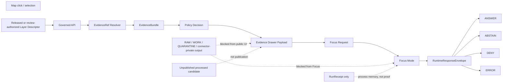

<!-- [KFM_META_BLOCK_V2]
doc_id: kfm://doc/TODO-ASSIGN-UUID
title: Atmosphere / Air Focus Mode + Evidence Drawer Payloads
type: standard
version: v1
status: draft
owners: TODO-VERIFY: atmosphere-air domain steward, map-shell steward, governed API steward, policy steward, evidence steward
created: TODO-VERIFY-YYYY-MM-DD
updated: 2026-05-06
policy_label: TODO-VERIFY-public-or-restricted
related: [../README.md, ./ARCHITECTURE.md, ./API_CONTRACTS.md, ./MAP_LAYERS.md, ./KNOWLEDGE_CHARACTER.md, ../../../adr/ADR-0001-schema-home.md, ../../../adr/ADR-0418-atmosphere-air-schema-slug-compatibility.md, ../../../runbooks/domains/atmosphere_air/slices/AIR_QA_PROMOTION_SLICE.md, ../../../../connectors/pipelines/air/README.md, ../../../../tools/validators/air/validate_air_qa.py, ../../../../tools/publishers/air/build_air_release_candidate.py, ../../../../tools/publishers/air/publish_air_release.py]
tags: [kfm, atmosphere-air, focus-mode, evidence-drawer, governed-ui, governed-api, map-first, evidence, policy, finite-outcomes]
notes: [doc_id, owners, created date, and policy_label need steward verification; target file and adjacent docs are repo-visible through GitHub connector evidence; local workspace is not a mounted checkout; runtime UI/API binding, CI enforcement, schema inventory, and public release remain NEEDS VERIFICATION.]
[/KFM_META_BLOCK_V2] -->

<a id="top"></a>

# Atmosphere / Air Focus Mode + Evidence Drawer Payloads

Payload contract for converting released Atmosphere / Air evidence into trust-visible Evidence Drawer panels and bounded Focus Mode responses.

<p align="center">
  
  
  
  
  
</p>

<p align="center">
  <a href="#status-snapshot">Status</a> ·
  <a href="#scope">Scope</a> ·
  <a href="#repo-fit">Repo fit</a> ·
  <a href="#payload-law">Payload law</a> ·
  <a href="#shared-primitives">Primitives</a> ·
  <a href="#evidence-drawer-payload">Drawer</a> ·
  <a href="#focus-mode-payload">Focus</a> ·
  <a href="#payload-flow">Flow</a> ·
  <a href="#anti-collapse-rules">Anti-collapse</a> ·
  <a href="#validation-and-denial-matrix">Validation</a> ·
  <a href="#repo-evidence-snapshot">Evidence snapshot</a> ·
  <a href="#open-verification">Open verification</a>
</p>

> [!IMPORTANT]
> Evidence Drawer and Focus Mode are **trust instruments**, not decorative UI. They must show what kind of knowledge a statement is, what evidence supports it, what policy allowed or blocked it, what remains uncertain, and why the system returns `ANSWER`, `ABSTAIN`, `DENY`, or `ERROR`.

---

## Status snapshot

| Field | Status |
|---|---|
| **Target file** | CONFIRMED repo-visible path: `docs/domains/atmosphere_air/architecture/FOCUS_DRAWER_PAYLOADS.md`. |
| **Document role** | Standard architecture doc for Drawer and Focus payload expectations. |
| **Runtime binding** | NEEDS VERIFICATION: this file does not prove UI components, API routes, deployed behavior, or successful CI enforcement. |
| **Implementation signals** | CONFIRMED repo-visible no-network `air` connector, candidate/receipt writer, validator, release-candidate builder, and publication-boundary tool. |
| **Schema inventory** | NEEDS VERIFICATION: tools reference `schemas/contracts/v1/air/*`, but the specific `qa_summary.schema.json` fetch was not confirmed in this session. |
| **Public posture** | Fail closed. Public clients consume governed API envelopes and released artifacts only. |

---

## Scope

This file defines the **minimum payload expectations** for two Atmosphere / Air trust surfaces:

| Surface | Purpose | Must consume | Must not consume |
|---|---|---|---|
| **Evidence Drawer** | Explain the selected layer, feature, claim, source, evidence, freshness, review state, release state, conflict state, and policy posture. | Released layer descriptors, governed API payloads, EvidenceRefs, EvidenceBundles, catalog/proof references, policy decisions, correction and rollback refs. | RAW, WORK, QUARANTINE, direct source payloads, connector-private output, unpublished candidates, direct model output, private lifecycle paths. |
| **Focus Mode** | Produce bounded synthesis or a negative outcome over admissible released evidence. | Governed runtime envelope, resolved EvidenceBundle pool, citation validation, policy decision, visible drawer context. | Uncited free-form model language, private chain-of-thought, source-data bypasses, direct MapLibre feature state as truth. |

### Accepted inputs

- Released or review-authorized layer descriptor references.
- Feature, extent, time-window, and selected-claim context from the map shell.
- EvidenceRefs that resolve to EvidenceBundles before consequential claims.
- Source descriptors with `source_role`, rights posture, verification status, and public-release posture.
- `knowledge_character` labels for observed, reported, modeled, classified, fused, advisory, and context objects.
- Freshness, temporal support, review state, policy posture, release state, conflict state, and correction state.
- Run receipts, catalog candidates, release manifests, rollback references, and correction notices where relevant.

### Exclusions

Do not place these in Drawer or Focus payloads:

- secrets, API keys, credentials, tokens, private endpoints, or raw source tokens;
- RAW, WORK, QUARANTINE, connector-private output, internal canonical-store paths, or unpublished lifecycle details;
- direct public links to lifecycle or canonical stores unless explicitly exposed through a governed API;
- uncited claims, unvalidated model summaries, or AI-generated text presented as proof;
- AQI values treated as raw concentration;
- AOD or smoke masks treated as PM2.5 exposure without governed model/fusion support;
- model fields labeled as observations;
- fusion products that hide input EvidenceRefs, method, uncertainty, or transform identity;
- live emergency instructions or life-safety direction.

<p align="right"><a href="#top">Back to top ↑</a></p>

---

## Repo fit

This file belongs under the `docs/` responsibility root because it is human-facing architecture documentation for a domain lane. It explains payload behavior and co-change expectations; it does not become the only source of truth for schemas, policy, validator logic, source descriptors, runtime code, release artifacts, or proof objects.

| Relationship | Path | Status | Role |
|---|---|---:|---|
| Domain landing page | [`../README.md`](../README.md) | CONFIRMED | Lane scope, accepted inputs, exclusions, and governed flow. |
| Architecture sibling | [`./ARCHITECTURE.md`](./ARCHITECTURE.md) | CONFIRMED | End-to-end trust path, bounded contexts, and non-negotiables. |
| API sibling | [`./API_CONTRACTS.md`](./API_CONTRACTS.md) | CONFIRMED | Finite envelope and governed API contract burden. |
| Map layer sibling | [`./MAP_LAYERS.md`](./MAP_LAYERS.md) | CONFIRMED | Released layer descriptor and map-shell safety requirements. |
| Knowledge-character sibling | [`./KNOWLEDGE_CHARACTER.md`](./KNOWLEDGE_CHARACTER.md) | CONFIRMED | Atmosphere anti-collapse taxonomy and denial rules. |
| Schema-home ADR | [`../../../adr/ADR-0001-schema-home.md`](../../../adr/ADR-0001-schema-home.md) | CONFIRMED / PROPOSED | `schemas/contracts/v1/` is proposed as machine-schema home; acceptance and enforcement remain verification-dependent. |
| Slug compatibility ADR | [`../../../adr/ADR-0418-atmosphere-air-schema-slug-compatibility.md`](../../../adr/ADR-0418-atmosphere-air-schema-slug-compatibility.md) | CONFIRMED / PROPOSED | Keeps `atmosphere_air`, `air`, and `atmosphere` naming boundaries visible. |
| No-network runbook | [`../../../runbooks/domains/atmosphere_air/slices/AIR_QA_PROMOTION_SLICE.md`](../../../runbooks/domains/atmosphere_air/slices/AIR_QA_PROMOTION_SLICE.md) | CONFIRMED | Fixture-backed Air QA gates and promotion slice boundaries. |
| No-network connector | [`../../../../connectors/pipelines/air/README.md`](../../../../connectors/pipelines/air/README.md) | CONFIRMED | Candidate and receipt production only; not public release. |
| Candidate writer | [`../../../../connectors/pipelines/air/air_ingest.py`](../../../../connectors/pipelines/air/air_ingest.py) | CONFIRMED | Writes deterministic PM2.5 QA summary candidate and run receipt with `network_access: disabled`. |
| Validator | [`../../../../tools/validators/air/validate_air_qa.py`](../../../../tools/validators/air/validate_air_qa.py) | CONFIRMED | Validates QA summary shape and local denial gates when dependencies and schema path resolve. |
| Release-candidate builder | [`../../../../tools/publishers/air/build_air_release_candidate.py`](../../../../tools/publishers/air/build_air_release_candidate.py) | CONFIRMED | Builds catalog/proof/release candidates; not publication by itself. |
| Publication boundary tool | [`../../../../tools/publishers/air/publish_air_release.py`](../../../../tools/publishers/air/publish_air_release.py) | CONFIRMED | Contains public-boundary denials for fixture publication and forbidden internal refs. |
| Active machine schemas | `../../../../schemas/contracts/v1/air/*` and/or `../../../../schemas/contracts/v1/atmosphere/*` | NEEDS VERIFICATION | Do not claim complete schema enforcement until inventory and tests prove it. |

> [!WARNING]
> `atmosphere_air` is the current documentation lane, `air` is the current no-network implementation/tooling slice, and `atmosphere` is a proposed whole-domain schema/normalization concept. Do not silently rename, collapse, alias, or publish across those surfaces.

<p align="right"><a href="#top">Back to top ↑</a></p>

---

## Payload law

### Drawer law

The Evidence Drawer must answer five questions before a user trusts a map claim:

1. **What is being shown?** Layer, feature, claim summary, knowledge character, parameter, method family.
2. **Where did it come from?** Source ID, source role, rights posture, verification status, EvidenceRefs.
3. **How current is it?** Observed time, retrieval time, valid time, model time, release time, freshness state, stale state.
4. **What did KFM do to it?** Unit normalization, interpolation, masking, fusion, generalization, redaction, hashing, provenance.
5. **What can the user do next?** Open evidence, compare sources, request Focus, report correction, inspect release or rollback state.

### Focus law

Focus Mode may synthesize only after evidence, policy, and scope are resolved. The response outcome is finite:

| Outcome | Meaning | Required payload behavior |
|---|---|---|
| `ANSWER` | The system can answer within evidence, policy, release, and scope. | Return claim cards with EvidenceRefs, EvidenceBundle refs, support type, caveats, and citation-validation status. |
| `ABSTAIN` | The system cannot support a claim strongly enough. | Explain the missing evidence, stale state, source-role gap, conflict, temporal gap, or scope mismatch without inventing an answer. |
| `DENY` | The request is disallowed by rights, sensitivity, source role, release state, lifecycle boundary, or policy. | Return safe reason codes and obligations; do not expose restricted internals. |
| `ERROR` | A schema, resolver, runtime, manifest, tool, or dependency fault prevented reliable evaluation. | Return safe diagnostic category, affected object refs where appropriate, and operator-facing references if safe. |

### Shared non-negotiables

- EvidenceRefs must resolve to EvidenceBundles for consequential claims.
- Public UI payloads must not bypass governed APIs.
- Released artifacts and governed envelopes are the UI boundary.
- Receipts, bundles, manifests, decisions, corrections, and rollback records stay distinct.
- Generated language remains visibly subordinate to evidence.
- Negative states are first-class and must be visible, not hidden behind polished prose.

<p align="right"><a href="#top">Back to top ↑</a></p>

---

## Shared primitives

The following field families should appear in both Drawer and Focus payloads, either directly or through linked objects.

| Primitive | Required? | Purpose | Notes |
|---|---:|---|---|
| `payload_type` | yes | Declares payload family and version. | Example: `atmosphere_evidence_drawer.v1`. |
| `payload_id` | yes | Stable payload identity. | Prefer deterministic identity where practical. |
| `layer_ref` | when map-derived | Links selected layer descriptor. | Must be released or explicitly marked non-public draft/review. |
| `feature_ref` | when feature-derived | Links selected map feature or candidate feature. | Feature state is context, not proof. |
| `claim_ref` | when claim-derived | Links selected claim or statement. | Required for consequential Focus answers. |
| `knowledge_character` | yes | Prevents epistemic collapse. | Must align with [`KNOWLEDGE_CHARACTER.md`](./KNOWLEDGE_CHARACTER.md). |
| `source_role` | yes | Explains source competence. | Unknown role blocks public trust claims. |
| `support_type` | yes | Describes evidentiary support. | Direct, partial, disputed, contextual, modeled, derived, unavailable, or source-dependent. |
| `evidence_refs` | yes for claims | Points to evidence support. | Must resolve before `ANSWER`. |
| `evidence_bundle_refs` | yes for claims | Links resolved EvidenceBundle(s). | Missing bundle causes `ABSTAIN`, `DENY`, or `ERROR`. |
| `policy_decision_ref` | yes | Links policy evaluation. | Required for release-sensitive payloads. |
| `review_state` | yes | Shows review status. | Draft, candidate, reviewed, released, stale, superseded, withdrawn, or repo-approved equivalent. |
| `release_state` | yes | Shows public-release posture. | Draft, candidate, catalog candidate, publication candidate, published, denied, withdrawn, superseded, or equivalent. |
| `freshness_state` | yes | Shows time validity. | Fresh, stale, archival, unknown, expired, fixture, or equivalent. |
| `source_payload_hash` | recommended | Links normalized object to source payload. | Required for high-burden provenance. |
| `transform_hash` | when transformed | Identifies transformation. | Required for generalized, fused, modeled, or converted outputs. |
| `spec_hash` | when released | Anchors released artifact identity. | Used for rollback and reproducibility. |
| `conflict_refs` | when present | Links disagreement records. | Disagreement must be visible, not flattened. |
| `correction_refs` | when present | Links correction or rollback notices. | Required when user-visible output changed. |
| `runtime_response_envelope_ref` | when Focus-assisted | Links finite response envelope. | Required for auditability. |
| `ai_receipt_ref` | when AI-assisted | Links model/provider/run metadata. | Must not store private chain-of-thought. |

---

## Evidence Drawer payload

The Evidence Drawer payload is the UI’s compact trust dossier for one selected layer, feature, claim, or release candidate.

### Minimum drawer object

| Field group | Must include | Failure behavior |
|---|---|---|
| Identity | `payload_type`, `payload_id`, `generated_at`, `layer_ref`, optional `feature_ref` / `claim_ref` | `ERROR` if malformed. |
| Claim summary | plain-language summary, truth label, confidence/support class, caveats | `ABSTAIN` if claim cannot be supported. |
| Source | `source_id`, `source_role`, publisher, rights posture, verification status | `DENY` if public release is blocked. |
| Knowledge character | observed/report/model/mask/fusion/advisory/context label | `DENY` if missing for public payload. |
| Temporal support | observed time, valid time, model time, retrieval time, release time, stale/fresh state | `ABSTAIN` for live-state claims with unknown/stale support. |
| Spatial support | public geometry ref, precision/generalization, bbox/place label, redaction state if any | `DENY` if public payload exposes restricted exact geometry or misleading precision. |
| Evidence | EvidenceRefs, EvidenceBundle refs, support type, citation state | `ABSTAIN` or `DENY` if evidence cannot resolve. |
| QC and conflict | QC flags, station health, excluded counts, conflict refs, disagreement summary | `ABSTAIN` if conflict prevents safe synthesis. |
| Provenance | source payload hash, transform hash, run receipt, catalog matrix, release manifest, rollback/correction refs | `DENY` for promoted payloads missing proof links. |
| Actions | open evidence, compare sources, request Focus, report correction, view release state | Hide or disable actions when policy forbids access. |

### Drawer display order

1. **State chips:** truth label, knowledge character, freshness, rights/release, review state.
2. **Plain-language claim:** one sentence, scoped to place and time.
3. **Evidence stack:** source role, EvidenceRefs, support type, evidence status.
4. **Temporal and spatial scope:** observed/valid/model/retrieval/release time; precision/generalization.
5. **Transformation and quality:** unit conversion, masks, model, fusion, QC flags, hashes.
6. **Conflict and correction:** disagreement, stale state, supersession, rollback, correction notice.
7. **Safe actions:** compare, request Focus, report correction, inspect release/proof.

<details>
<summary>Illustrative Evidence Drawer payload</summary>

```json
{
  "payload_type": "atmosphere_evidence_drawer.v1",
  "payload_id": "kfm:payload:atmosphere:drawer:TODO",
  "generated_at": "2026-05-06T00:00:00Z",
  "layer_ref": "kfm:layer:atmosphere-air:TODO",
  "feature_ref": "kfm:feature:atmosphere-air:TODO",
  "claim_ref": "kfm:claim:atmosphere-air:TODO",
  "claim_summary": {
    "text": "PM2.5 context for the selected place and hour is available as candidate evidence, but public live-state use requires verified freshness, rights, EvidenceBundle closure, release state, and rollback support.",
    "truth_label": "NEEDS VERIFICATION",
    "support_type": "source-dependent",
    "caveats": [
      "Do not treat AQI as raw concentration.",
      "Do not treat smoke masks or AOD as PM2.5 exposure without governed model/fusion support.",
      "Do not treat no-network fixtures as real-world public truth."
    ]
  },
  "knowledge": {
    "knowledge_character": "OBSERVED_SENSOR",
    "source_role": "OBSERVATION_PROVIDER",
    "parameter_id": "pm25",
    "method_family": "station_observation"
  },
  "status": {
    "freshness_state": "UNKNOWN",
    "review_state": "candidate",
    "release_state": "candidate",
    "policy_state": "not_public_until_verified",
    "rights_state": "UNKNOWN"
  },
  "temporal": {
    "observed_time": {
      "start": "2026-05-01T00:00:00Z",
      "end": "2026-05-01T01:00:00Z"
    },
    "retrieved_at": "TODO-VERIFY",
    "valid_time": null,
    "model_time": null,
    "released_at": null,
    "stale_after": "TODO-VERIFY"
  },
  "spatial": {
    "geometry_ref": "kfm:geometry:public-safe:TODO",
    "geometry_precision": "TODO-VERIFY",
    "public_generalization": "TODO-VERIFY",
    "bbox": null,
    "place_label": "TODO-VERIFY"
  },
  "evidence": {
    "evidence_refs": [
      "kfm:evidence-ref:TODO"
    ],
    "evidence_bundle_refs": [
      "kfm:evidence-bundle:TODO"
    ],
    "citation_validation": "pending"
  },
  "quality": {
    "qc_state": "pending",
    "station_health": "unknown",
    "flags": [],
    "excluded_count": 0
  },
  "conflicts": [],
  "provenance": {
    "source_payload_hash": "TODO-VERIFY",
    "transform_hash": "TODO-VERIFY",
    "spec_hash": "TODO-VERIFY",
    "run_receipt_ref": "data/receipts/air/run_receipt.example.json",
    "catalog_matrix_ref": "kfm:catalog-matrix:TODO",
    "release_manifest_ref": null,
    "rollback_ref": null,
    "correction_refs": []
  },
  "actions": {
    "open_evidence": true,
    "compare_sources": true,
    "request_focus": true,
    "report_correction": true,
    "open_internal_lifecycle_path": false
  }
}
```

</details>

<p align="right"><a href="#top">Back to top ↑</a></p>

---

## Focus Mode payload

Focus Mode converts a user question plus selected map context into a bounded runtime response. It must be scoped, cited, and policy-aware.

### Focus request minimums

| Field | Required? | Purpose |
|---|---:|---|
| `request_id` | yes | Trace request and response. |
| `question` | yes | User-facing question or prompt. |
| `interaction_context` | yes | Selected layer, feature, extent, time window, map state, and UI state. |
| `allowed_evidence_scope` | yes | EvidenceBundle refs or resolver query boundaries. |
| `policy_context` | yes | User role, release surface, sensitivity class, rights posture. |
| `citation_required` | yes | Must be `true` for consequential atmosphere claims. |
| `drawer_payload_ref` | recommended | Links the trust context shown to the user. |
| `max_claims` | recommended | Bounds answer breadth. |
| `allowed_outcomes` | yes | Must include only `ANSWER`, `ABSTAIN`, `DENY`, `ERROR`. |

### Focus response minimums

| Field | Required? | Purpose |
|---|---:|---|
| `outcome` | yes | One of `ANSWER`, `ABSTAIN`, `DENY`, `ERROR`. |
| `answer` | only for `ANSWER` | Bounded synthesis text. |
| `claim_cards` | for `ANSWER`; optional for `ABSTAIN` | Claim-level support cards. |
| `citations` | for `ANSWER` | EvidenceRefs and EvidenceBundle refs. |
| `policy_decision` | yes | Allow/deny/abstain/error result and obligations. |
| `reason_codes` | for `ABSTAIN`, `DENY`, `ERROR` | Machine-readable explanation. |
| `drawer_payload_ref` | recommended | Back-link to visible trust context. |
| `ai_receipt_ref` | when AI assisted | Links model/provider/run metadata; never stores private chain-of-thought. |
| `runtime_response_envelope_ref` | yes | Links runtime envelope for audit. |

### Focus answer rules

| Rule | Required behavior |
|---|---|
| Cite-or-abstain | Every consequential claim has EvidenceRefs and EvidenceBundle support or the response returns `ABSTAIN`. |
| No category collapse | The answer preserves knowledge character: observed, reported, modeled, classified, fused, advisory, or context. |
| No hidden policy bypass | If rights, source role, review state, or release state fail, return `DENY`. |
| No stale live-state claim | If freshness is stale/unknown for live-state language, return `ABSTAIN` or explicitly scope as archival/contextual. |
| No emergency instruction | The answer may point to official-source context where appropriate; it must not become an alerting or life-safety system. |
| No private reasoning exposure | Store receipts and validation summaries, not private chain-of-thought. |

<details>
<summary>Illustrative Focus response payload</summary>

```json
{
  "payload_type": "atmosphere_focus_response.v1",
  "request_id": "kfm:focus-request:TODO",
  "response_id": "kfm:focus-response:TODO",
  "outcome": "ABSTAIN",
  "summary": "KFM cannot answer this as a current public PM2.5 exposure claim because the selected evidence lacks verified public-release rights, complete freshness support, and confirmed release manifest state.",
  "reason_codes": [
    "ATMOS_UNKNOWN_RIGHTS_PUBLIC",
    "ATMOS_FRESHNESS_UNKNOWN",
    "ATMOS_MISSING_RELEASE_MANIFEST"
  ],
  "claim_cards": [
    {
      "claim_ref": "kfm:claim:TODO",
      "knowledge_character": "OBSERVED_SENSOR",
      "source_role": "OBSERVATION_PROVIDER",
      "support_type": "source-dependent",
      "evidence_refs": [
        "kfm:evidence-ref:TODO"
      ],
      "evidence_bundle_refs": [
        "kfm:evidence-bundle:TODO"
      ],
      "citation_validation": "pending",
      "caveats": [
        "Observation fixture is not a promoted public release.",
        "Freshness, rights, and release state must be verified before public live-state use."
      ]
    }
  ],
  "policy_decision": {
    "decision": "ABSTAIN",
    "policy_refs": [
      "policy/air/air_qa.rego"
    ],
    "obligations": [
      "Do not expose RAW, WORK, QUARANTINE, connector-private, or unpublished candidate paths.",
      "Show rights, freshness, and release-state gaps to the user."
    ]
  },
  "drawer_payload_ref": "kfm:payload:atmosphere:drawer:TODO",
  "runtime_response_envelope_ref": "kfm:runtime-response-envelope:TODO",
  "ai_receipt_ref": null
}
```

</details>

<p align="right"><a href="#top">Back to top ↑</a></p>

---

## Payload flow



The Drawer and Focus payloads are downstream of release and policy state. Map interaction can provide context, but it cannot upgrade a feature into truth.

<p align="right"><a href="#top">Back to top ↑</a></p>

---

## Anti-collapse rules

| If the selected object is… | Drawer must show… | Focus must not say… |
|---|---|---|
| `OBSERVED_SENSOR` | Station/site metadata, instrument context, value/unit, QC flags, station health, observed/retrieved time. | “This is a regional exposure surface” unless a governed transform supports it. |
| `PUBLIC_AQI_REPORT` | Issuer, index/report method, report time, public message source, caveats. | “This is the raw PM2.5 concentration.” |
| `REGULATORY_ARCHIVE` | Archive role, quality-assurance status, temporal scope, retrieval/release time. | “This is current live state” unless freshness supports it. |
| `LOW_COST_SENSOR` | Correction method, confidence, siting caveat, network role, rights posture. | “This is regulatory truth.” |
| `ATMOSPHERIC_MODEL_FIELD` | Model source, variable, grid/time basis, model card/ref, uncertainty. | “This was observed at the ground station.” |
| `REMOTE_SENSING_MASK` | Sensor/product, classification, confidence, spatial/temporal caveat. | “This is measured PM2.5 exposure.” |
| `DERIVED_FUSION` | All input EvidenceRefs, method, uncertainty, transform hash. | “This is the original source.” |
| `CLIMATE_ANOMALY_CONTEXT` | Baseline, normal period, anomaly method, scope. | “This is an emergency alert.” |
| `ALERT_AND_ADVISORY_CONTEXT` | Issuer, issue/expiry time, message source, public context. | “KFM is the alerting authority.” |
| `NETWORK_AND_SITE_CONTEXT` | Station status, cadence, instrument/siting metadata. | “This is an air concentration measurement.” |
| `BASELINE_AND_TEMPORAL_SUPPORT` | Baseline window, target parameter, freshness/persistence logic. | “This is standalone proof.” |
| `FIRE_AND_EMISSIONS_CONTEXT` | Fire/emissions source method, time basis, attribution caveat. | “This is exposure measurement.” |
| `VISIBILITY_AND_AEROSOL_CONTEXT` | Visibility/AOD/optical method, assumptions, caveats. | “This is PM concentration without a governed model.” |

---

## Validation and denial matrix

Payload validation should fail closed. The reason code must be machine-readable and drawer-visible where safe.

| Reason code | Applies to | Outcome | Condition |
|---|---|---:|---|
| `ATMOS_MISSING_KNOWLEDGE_CHARACTER` | Drawer + Focus | `DENY` | Payload lacks a knowledge-character label. |
| `ATMOS_MISSING_SOURCE_ROLE` | Drawer + Focus | `DENY` | Source role is missing or unknown for a consequential claim. |
| `ATMOS_MISSING_RIGHTS` | Drawer + Focus | `DENY` | Rights or source terms are absent. |
| `ATMOS_UNKNOWN_RIGHTS_PUBLIC` | Drawer + Focus | `DENY` | Public use requested while rights are unknown or blocked. |
| `ATMOS_MISSING_EVIDENCE_REFS` | Drawer + Focus | `ABSTAIN` | Claim lacks EvidenceRefs. |
| `ATMOS_EVIDENCE_BUNDLE_UNRESOLVED` | Drawer + Focus | `ABSTAIN` / `ERROR` | EvidenceRef cannot resolve to EvidenceBundle. |
| `ATMOS_MISSING_SOURCE_PAYLOAD_HASH` | Drawer + Focus | `DENY` | Normalized record cannot be traced to source payload. |
| `ATMOS_MISSING_TRANSFORM_HASH` | Drawer + Focus | `DENY` | Derived record lacks transform identity. |
| `ATMOS_PUBLIC_RELEASE_FALSE` | Drawer + Focus | `DENY` | Source descriptor blocks public release. |
| `ATMOS_PUBLIC_INTERNAL_ACCESS` | Drawer + Focus | `DENY` | Payload exposes RAW, WORK, QUARANTINE, connector-private, or internal lifecycle paths. |
| `ATMOS_FRESHNESS_UNKNOWN` | Focus | `ABSTAIN` | Live-state answer requested but freshness cannot be established. |
| `ATMOS_STALE_FOR_LIVE_STATE` | Focus | `ABSTAIN` | Evidence is stale for the requested current-state claim. |
| `ATMOS_MODEL_AS_OBSERVED` | Drawer + Focus | `DENY` | Model field is labeled or summarized as observation. |
| `ATMOS_AQI_AS_CONCENTRATION` | Drawer + Focus | `DENY` | AQI/report object is treated as raw concentration. |
| `ATMOS_AOD_AS_PM25` | Drawer + Focus | `DENY` | AOD/smoke mask is treated as PM2.5 without governed model support. |
| `ATMOS_MASK_AS_EXPOSURE` | Drawer + Focus | `DENY` | Smoke/plume/remote mask is treated as exposure measurement. |
| `ATMOS_FUSION_INPUTS_HIDDEN` | Drawer + Focus | `DENY` | Fusion product hides input EvidenceRefs, method, uncertainty, or transform identity. |
| `ATMOS_CONFLICT_UNDISCLOSED` | Drawer + Focus | `DENY` | Cross-source disagreement exists but is not displayed. |
| `ATMOS_MISSING_RELEASE_MANIFEST` | Drawer + Focus | `DENY` | Public payload lacks release/proof reference. |
| `ATMOS_AI_UNCITED_CLAIM` | Focus | `ABSTAIN` / `DENY` | AI-assisted answer includes a claim without citation support. |
| `ATMOS_RECEIPT_AS_PROOF` | Drawer + Focus | `DENY` | RunReceipt is used as EvidenceBundle, proof pack, or release authority. |
| `ATMOS_FIXTURE_PUBLIC_TRUTH` | Drawer + Focus | `DENY` | Fixture or no-network candidate is requested as real-world public truth. |
| `ATMOS_GATE_D_ATTESTATION_MISSING` | Focus / release-adjacent Drawer | `DENY` | Publication or override requires attestation that is missing. |
| `ATMOS_AQS_RECONCILIATION_NOT_READY` | Focus / release-adjacent Drawer | `DENY` | AQS reconciliation is missing, pending, conflicted, or stale for publication. |

### Minimal test expectations

- Valid Drawer fixture renders required chips and evidence stack.
- Invalid Drawer fixture without knowledge character fails closed.
- Invalid public payload with unknown rights returns `DENY`.
- Focus request over missing EvidenceBundle returns `ABSTAIN` or `ERROR`, not fluent speculation.
- Focus answer over modeled field preserves `ATMOSPHERIC_MODEL_FIELD`.
- AQI, AOD, smoke mask, model field, and fusion anti-collapse tests pass.
- Conflict payload exposes disagreement and does not force one truth.
- Rollback/correction fixture updates Drawer state and keeps prior proof references inspectable.
- Fixture-backed publication attempt returns denial rather than public truth.
- Public payload containing RAW, WORK, QUARANTINE, connector-private, or unpromoted processed refs is denied.

<p align="right"><a href="#top">Back to top ↑</a></p>

---

## Repo evidence snapshot

This table records current-session repository evidence used while revising this file. It should be updated when maintainers inspect a mounted checkout, run validators, or add runtime/UI bindings.

| Surface | Status | Payload-contract consequence |
|---|---:|---|
| `docs/domains/atmosphere_air/architecture/FOCUS_DRAWER_PAYLOADS.md` | CONFIRMED | Existing target file revised in place conceptually. |
| `docs/domains/atmosphere_air/README.md` | CONFIRMED | Domain scope, accepted inputs, exclusions, knowledge characters, and governed flow align with this payload doc. |
| `docs/domains/atmosphere_air/architecture/ARCHITECTURE.md` | CONFIRMED | Architecture requires source-role and knowledge-character boundaries, release-only public delivery, and no public lifecycle bypass. |
| `docs/domains/atmosphere_air/architecture/API_CONTRACTS.md` | CONFIRMED | API contract posture uses finite outcomes and reason-coded negative states. |
| `docs/domains/atmosphere_air/architecture/MAP_LAYERS.md` | CONFIRMED | Layer descriptors must preserve source role, knowledge character, freshness, release state, evidence route, and rollback. |
| `docs/domains/atmosphere_air/architecture/KNOWLEDGE_CHARACTER.md` | CONFIRMED | Taxonomy and anti-collapse rules are adopted here. |
| `docs/adr/ADR-0001-schema-home.md` | CONFIRMED / PROPOSED | `schemas/contracts/v1/` is proposed machine-schema home; enforcement remains verification-dependent. |
| `docs/adr/ADR-0418-atmosphere-air-schema-slug-compatibility.md` | CONFIRMED / PROPOSED | Keep `atmosphere_air`, `air`, and `atmosphere` split visible. |
| `connectors/pipelines/air/README.md` | CONFIRMED | The `air` slice is no-network, candidate/receipt-only, and not publication. |
| `connectors/pipelines/air/air_ingest.py` | CONFIRMED | Writes deterministic `qa_summary.example.json` and `run_receipt.example.json` with `network_access: disabled`. |
| `tools/validators/air/validate_air_qa.py` | CONFIRMED | Contains local gates for nowcast max, baseline sigma, station coverage, AQS hard-denial rows, and missing receipt/evidence refs. |
| `tools/publishers/air/build_air_release_candidate.py` | CONFIRMED | Builds candidate EvidenceBundle, PromotionDecision, catalog candidate, triplets, and ReleaseManifest when gates pass. |
| `tools/publishers/air/publish_air_release.py` | CONFIRMED | Denies fixture-backed truth publication, missing attestation, missing/stale AQS reconciliation, and forbidden internal/public refs. |
| `docs/runbooks/domains/atmosphere_air/slices/AIR_QA_PROMOTION_SLICE.md` | CONFIRMED | No-network QA promotion slice defines Gates A-C, Gate D attestation, AQS reconciliation, and fixture/live connector boundaries. |
| `schemas/contracts/v1/air/qa_summary.schema.json` | NEEDS VERIFICATION | Direct file fetch returned not found in this session; do not claim schema enforcement until inventory succeeds. |
| Runtime Evidence Drawer component | UNKNOWN | This doc defines payload pressure, not component implementation. |
| Runtime Focus Mode component | UNKNOWN | This doc defines finite response behavior, not component implementation. |
| Public API route names | UNKNOWN | Contract families are defined; route names need current code inspection. |
| CI/workflow enforcement | NEEDS VERIFICATION | Workflow presence or passing run status was not proven for this payload contract. |

<p align="right"><a href="#top">Back to top ↑</a></p>

---

## Change triggers

When behavior changes, update this file and its companions together.

| Trigger | Update this file? | Co-change surfaces |
|---|---:|---|
| New atmosphere knowledge character | yes | [`KNOWLEDGE_CHARACTER.md`](./KNOWLEDGE_CHARACTER.md), source registry, schemas, fixtures, policy, validator tests. |
| New source role or source family | yes if Drawer/Focus behavior changes | source registry, security/rights docs, fixtures, policy denial tests. |
| New map layer | yes if Drawer fields change | [`MAP_LAYERS.md`](./MAP_LAYERS.md), layer descriptor schema, catalog layer fixture, Drawer fixture. |
| New Focus outcome behavior | yes | [`API_CONTRACTS.md`](./API_CONTRACTS.md), runtime envelope schema, Focus fixtures, policy tests. |
| New evidence object family | yes | contracts/schemas, EvidenceBundle tests, catalog/proof validators. |
| New transformation or fusion method | yes | unit/conversion docs, transform hash rules, fusion schema, uncertainty display tests. |
| New policy denial | yes | policy docs, reason-code matrix, invalid fixtures, UI negative-state tests. |
| Promotion or rollback behavior changes | yes | release manifests, rollback receipt schema, correction notice, Drawer state tests. |
| External source rights drift | maybe | source registry, verification backlog, release block state, public Drawer copy. |
| Runtime implementation lands | yes | Replace NEEDS VERIFICATION notes with confirmed implementation links after tests/logs/CI evidence are available. |

---

## Review checklist

Before this document can move beyond `draft`, reviewers should verify:

- [ ] Meta block has real `doc_id`, owners, created date, and policy label.
- [ ] The payload fields align with repo-native schemas or a linked schema-home ADR.
- [ ] Drawer and Focus payload fixtures exist or are explicitly scheduled.
- [ ] Finite outcomes match governed API contracts.
- [ ] EvidenceRefs resolve to EvidenceBundles in valid fixtures.
- [ ] Negative-path tests cover uncited claims, missing source role, unknown rights, stale evidence, model-as-observation, AQI-as-concentration, AOD-as-PM2.5, hidden fusion inputs, receipt-as-proof, fixture-public-truth, and public internal access.
- [ ] Public Drawer actions do not expose RAW, WORK, QUARANTINE, connector-private, processed-candidate, or direct model-runtime routes.
- [ ] Conflict and correction states are user-visible.
- [ ] AI-assisted Focus answers emit AI receipt references when applicable and do not store private chain-of-thought.
- [ ] Rollback/correction references remain inspectable after newer releases land.
- [ ] Documentation links resolve from `docs/domains/atmosphere_air/architecture/`.

---

## Open verification

| Item | Status | Verification needed |
|---|---:|---|
| Payload schema names | NEEDS VERIFICATION | Confirm whether the repo uses `schemas/contracts/v1/air/*`, `schemas/contracts/v1/atmosphere/*`, both through an alias bridge, or another ADR-backed home. |
| Runtime route names | UNKNOWN | Inspect governed API route tree before naming endpoints. |
| Evidence Drawer component path | UNKNOWN | Inspect app/web/ui code before naming components. |
| Focus Mode component path | UNKNOWN | Inspect app/web/ui code before naming components. |
| Policy engine | NEEDS VERIFICATION | Confirm whether OPA/Rego, Conftest, local Python policy mirrors, or another policy runner is canonical. |
| CI coverage | NEEDS VERIFICATION | Confirm workflow files and run status before claiming enforcement. |
| Source rights | UNKNOWN | Source descriptors must verify rights before public release. |
| Release/proof implementation | NEEDS VERIFICATION | Confirm ReleaseManifest, EvidenceBundle, PromotionDecision, rollback, correction, and catalog homes. |
| Owners | TODO | Assign actual domain, UI, API, policy, evidence, and documentation stewards. |
| Policy label | TODO | Confirm whether this document is public, internal-governance, or restricted. |
| Acceptance state | draft | Keep as draft until schema inventory, fixture coverage, validator output, and reviewer approval are captured. |

<p align="right"><a href="#top">Back to top ↑</a></p>
