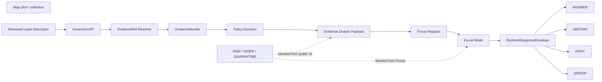

<!-- [KFM_META_BLOCK_V2]
doc_id: kfm://doc/TODO-ASSIGN-UUID
title: Atmosphere / Air Focus Mode + Evidence Drawer Payloads
type: standard
version: v1
status: draft
owners: TODO-VERIFY: atmosphere-air domain steward, UI steward, governed API steward, policy steward
created: TODO-VERIFY-YYYY-MM-DD
updated: 2026-05-06
policy_label: TODO-VERIFY-public-or-restricted
related: [docs/domains/atmosphere_air/README.md, docs/domains/atmosphere_air/architecture/ARCHITECTURE.md, docs/domains/atmosphere_air/architecture/API_CONTRACTS.md, docs/domains/atmosphere_air/architecture/MAP_LAYERS.md, docs/domains/atmosphere_air/architecture/KNOWLEDGE_CHARACTER.md]
tags: [kfm, atmosphere-air, focus-mode, evidence-drawer, governed-ui, evidence, policy, map-first]
notes: [doc_id, owners, created, and policy_label need repo steward verification; runtime implementation, schema home, and validator coverage remain NEEDS VERIFICATION.]
[/KFM_META_BLOCK_V2] -->

# Atmosphere / Air Focus Mode + Evidence Drawer Payloads

Payload contract for turning released Atmosphere / Air evidence into trust-visible drawer panels and bounded Focus Mode responses.

<a id="top"></a>

| Field | Status |
|---|---|
| **Document surface** | CONFIRMED: this file exists at `docs/domains/atmosphere_air/architecture/FOCUS_DRAWER_PAYLOADS.md`. |
| **Document role** | PROPOSED control document for Evidence Drawer and Focus Mode payload expectations. |
| **Runtime implementation** | NEEDS VERIFICATION: this document does not prove UI components, API routes, schemas, validators, CI gates, or deployed behavior. |
| **Primary consumers** | Map shell, Evidence Drawer, Focus Mode, governed API, reviewers, validators, policy maintainers. |
| **Required posture** | Evidence-first, map-first, time-aware, policy-aware, cite-or-abstain, deny-by-default where release risk is unclear. |

**Quick jumps:** [Scope](#scope) · [Repo fit](#repo-fit) · [Payload law](#payload-law) · [Shared primitives](#shared-payload-primitives) · [Evidence Drawer](#evidence-drawer-payload) · [Focus Mode](#focus-mode-payload) · [Flow](#payload-flow) · [Atmosphere anti-collapse](#atmosphere-specific-anti-collapse-rules) · [Validation](#validation-and-denial-matrix) · [Change triggers](#change-triggers) · [Review checklist](#review-checklist) · [Open verification](#open-verification)

> [!IMPORTANT]
> Evidence Drawer and Focus Mode are trust surfaces, not decoration. They must show what kind of knowledge a statement is, what evidence supports it, what policy allowed it, what remains uncertain, and why the system answers, abstains, denies, or errors.

---

## Scope

This document defines the **minimum payload expectations** for two UI-facing Atmosphere / Air trust surfaces:

| Surface | Purpose | Must consume | Must not consume |
|---|---|---|---|
| **Evidence Drawer** | Explain the selected layer, feature, claim, source, evidence, freshness, review state, release state, and policy posture. | Released layer descriptors, governed API payloads, EvidenceRefs, EvidenceBundles, catalog/proof references, policy decisions. | RAW, WORK, QUARANTINE, direct source payloads, unpublished candidates, direct model output, private lifecycle paths. |
| **Focus Mode** | Produce a bounded answer or negative outcome over admissible released evidence. | Governed runtime envelope, resolved evidence pool, citation validation, policy decision, drawer context. | Uncited free-form model language, private chain-of-thought, source data bypasses, direct MapLibre feature state as truth. |

### Accepted inputs

- Released layer descriptor references.
- Feature, extent, time-window, and selected-claim context from the map shell.
- EvidenceRefs that resolve to EvidenceBundles.
- Source descriptors with source role, rights posture, and verification status.
- Knowledge-character labels for observed, reported, modeled, classified, fused, advisory, and context objects.
- Freshness, temporal support, review state, policy posture, and conflict state.
- Run receipts, catalog matrices, release manifests, rollback receipts, and correction notices when relevant.

### Exclusions

Do not place these in drawer or Focus payloads:

- secrets, API keys, credentials, private endpoints, or raw source tokens;
- RAW, WORK, QUARANTINE, internal canonical-store paths, or unpublished lifecycle details;
- direct public links to canonical stores unless the governed API explicitly authorizes them;
- uncited claims, unvalidated model summaries, or AI-generated text presented as proof;
- AQI values treated as raw concentration;
- AOD or smoke masks treated as PM2.5 exposure without explicit model support;
- model fields labeled as observed measurements;
- fusion products that hide inputs or uncertainty;
- live emergency instructions or life-safety direction.

<p align="right"><a href="#top">Back to top ↑</a></p>

---

## Repo fit

This file sits inside the Atmosphere / Air architecture documentation lane. It should explain payload behavior and co-change expectations; it should not become the only source of truth for schemas, policy, validator logic, or runtime code.

| Relationship | Path | Status | Role |
|---|---|---:|---|
| Domain landing page | `../README.md` | CONFIRMED | Lane scope, accepted inputs, exclusions, and overall governance posture. |
| Architecture sibling | `ARCHITECTURE.md` | CONFIRMED | Trust path, bounded contexts, and non-negotiables. |
| API sibling | `API_CONTRACTS.md` | CONFIRMED | Runtime envelope and finite outcome expectations. |
| Map layer sibling | `MAP_LAYERS.md` | CONFIRMED | Released layer descriptor and UI safety requirements. |
| Knowledge-character sibling | `KNOWLEDGE_CHARACTER.md` | CONFIRMED | Anti-collapse taxonomy for atmosphere-air objects. |
| Machine schemas | `schemas/contracts/v1/atmosphere/*` or repo-equivalent | PROPOSED | Shape validation for payload objects and supporting records. |
| Policy | `policy/atmosphere/*` or repo-equivalent | PROPOSED | Allow, deny, restrict, abstain, and obligation logic. |
| Tests / fixtures | `tests/atmosphere/*`, `tests/fixtures/atmosphere/*`, or repo-equivalent | PROPOSED | Valid and invalid examples for drawer and Focus behavior. |
| Catalog / proof outputs | `data/catalog/*`, `data/proofs/*`, `release/*`, or repo-equivalent | PROPOSED | EvidenceBundle, catalog matrix, decision envelope, release, rollback, and correction references. |

> [!NOTE]
> The target path is repo-confirmed. Schema, policy, fixture, test, and release paths remain proposed until the live repository conventions and ADRs are verified.

---

## Payload law

### Drawer law

The Evidence Drawer must answer five questions before a user trusts a map claim:

1. **What is being shown?** Layer, feature, claim summary, knowledge character, parameter, method family.
2. **Where did it come from?** Source ID, source role, rights posture, verification status, EvidenceRefs.
3. **How current is it?** Observed time, retrieval time, valid time, release time, freshness state, stale state.
4. **What did KFM do to it?** Unit normalization, interpolation, masking, fusion, generalization, redaction, hashing, provenance.
5. **What can the user do next?** Open evidence, compare sources, request Focus, report correction, inspect release or rollback state.

### Focus law

Focus Mode may synthesize only after evidence and policy are resolved. Its response outcome is finite:

| Outcome | Meaning | Required payload behavior |
|---|---|---|
| `ANSWER` | The system can answer within evidence and policy scope. | Return claim cards with EvidenceRefs, support type, caveats, and citation validation status. |
| `ABSTAIN` | The system cannot support a claim strongly enough. | Explain the missing evidence, stale state, conflict, or scope gap without inventing an answer. |
| `DENY` | The request is disallowed by rights, sensitivity, source role, release state, or policy. | Return denial reason codes and safe next steps; do not expose restricted internals. |
| `ERROR` | A system, schema, resolver, or runtime fault prevented evaluation. | Return error category, affected object refs, and operator-facing diagnostic references if safe. |

### Shared non-negotiables

- EvidenceRefs must resolve to EvidenceBundles for consequential claims.
- Public UI payloads must not bypass governed APIs.
- Released artifacts and governed envelopes are the UI’s data boundary.
- Receipts, bundles, manifests, decisions, corrections, and rollback records stay distinct.
- Generated language remains visibly subordinate to evidence.

<p align="right"><a href="#top">Back to top ↑</a></p>

---

## Shared payload primitives

The following field families should appear in both drawer and Focus payloads, either directly or through linked objects.

| Primitive | Required? | Purpose | Notes |
|---|---:|---|---|
| `payload_type` | yes | Declares payload family and version. | Example: `atmosphere_evidence_drawer.v1`. |
| `payload_id` | yes | Stable payload identity. | Prefer deterministic identity where practical. |
| `layer_ref` | when map-derived | Links selected layer descriptor. | Must be released or explicitly marked non-public draft. |
| `feature_ref` | when feature-derived | Links selected map feature or candidate feature. | Feature state is context, not proof. |
| `claim_ref` | when claim-derived | Links selected claim or statement. | Required for consequential Focus answers. |
| `knowledge_character` | yes | Prevents epistemic collapse. | Values should align with `KNOWLEDGE_CHARACTER.md`. |
| `source_role` | yes | Explains source authority. | Unknown role blocks public trust claims. |
| `support_type` | yes | Describes evidentiary support. | Direct, partial, disputed, contextual, modeled, derived, unavailable, or source-dependent. |
| `evidence_refs` | yes for claims | Points to evidence support. | Must resolve before `ANSWER`. |
| `evidence_bundle_ref` | yes for claims | Links resolved EvidenceBundle. | Missing bundle causes `ABSTAIN`, `DENY`, or `ERROR`. |
| `policy_decision_ref` | yes | Links policy evaluation. | Required for release-sensitive payloads. |
| `review_state` | yes | Shows review status. | Draft, reviewed, promoted, stale, superseded, withdrawn, or equivalent repo state. |
| `release_state` | yes | Shows whether artifact is public-safe. | Released, candidate, restricted, withdrawn, superseded, or equivalent. |
| `freshness_state` | yes | Shows time validity. | Fresh, stale, archival, unknown, expired, or equivalent. |
| `source_payload_hash` | recommended | Links normalized object to source payload. | Required for high-burden claim provenance. |
| `transform_hash` | when transformed | Identifies transformation. | Required for generalized, fused, modeled, or converted outputs. |
| `spec_hash` | when released | Anchors released artifact identity. | Used for rollback and reproducibility. |
| `conflict_refs` | when present | Links disagreement records. | Disagreement must be visible, not flattened. |
| `correction_refs` | when present | Links correction or rollback notices. | Required when user-visible output changed. |

---

## Evidence Drawer payload

The Evidence Drawer payload is the UI’s compact trust dossier for one selected layer, feature, or claim.

### Minimum drawer object

| Field group | Must include | Failure behavior |
|---|---|---|
| Identity | `payload_type`, `payload_id`, `generated_at`, `layer_ref`, optional `feature_ref` / `claim_ref` | `ERROR` if malformed. |
| Claim summary | plain-language summary, truth label, confidence/support class, caveats | `ABSTAIN` if claim cannot be supported. |
| Source | `source_id`, `source_role`, publisher, rights posture, verification status | `DENY` if public release is blocked. |
| Knowledge character | observed/reported/modeled/classified/fused/advisory/context label | `DENY` if missing for public payload. |
| Temporal support | observed time, valid time, retrieval time, release time, stale/fresh state | `ABSTAIN` for live-state claims with unknown or stale support. |
| Spatial support | public geometry ref, precision/generalization, bbox/place label, redaction state if any | `DENY` if public payload exposes restricted exact geometry. |
| Evidence | EvidenceRefs, EvidenceBundle ref, support type, citation state | `ABSTAIN` or `DENY` if evidence cannot resolve. |
| QC and conflict | QC flags, station health, excluded counts, conflict refs, disagreement summary | `ABSTAIN` if conflict prevents safe synthesis. |
| Provenance | source payload hash, transform hash, run receipt, catalog matrix, release manifest, rollback/correction refs | `DENY` for promoted payloads missing proof links. |
| Actions | open evidence, compare sources, request Focus, report correction, view release state | Hide actions when policy forbids access. |

### Drawer display order

1. **State chips:** truth label, knowledge character, freshness, rights/release, review state.
2. **Plain-language claim:** one sentence, scoped to place and time.
3. **Evidence stack:** source role, EvidenceRefs, support type, evidence status.
4. **Temporal and spatial scope:** observed/valid/retrieval/release time; precision/generalization.
5. **Transformation and quality:** unit conversion, masks, model, fusion, QC flags, hashes.
6. **Conflict and correction:** disagreement, stale state, supersession, rollback, correction notice.
7. **Safe actions:** compare, request Focus, report correction, inspect release/proof.

<details>
<summary>Illustrative Evidence Drawer payload</summary>

```json
{
  "payload_type": "atmosphere_evidence_drawer.v1",
  "payload_id": "kfm:payload:atmosphere:drawer:TODO",
  "generated_at": "2026-05-06T00:00:00Z",
  "layer_ref": "kfm:layer:atmosphere:TODO",
  "feature_ref": "kfm:feature:atmosphere:TODO",
  "claim_summary": {
    "text": "PM2.5 context for the selected place and time is available, but source rights and freshness must be inspected before treating it as public live state.",
    "truth_label": "NEEDS VERIFICATION",
    "support_type": "source-dependent",
    "caveats": [
      "Do not treat AQI as raw concentration.",
      "Do not treat smoke masks or AOD as PM2.5 exposure without model support."
    ]
  },
  "knowledge": {
    "knowledge_character": "OBSERVED_SENSOR",
    "source_role": "scientific_observation",
    "parameter_id": "pm25",
    "method_family": "station_observation"
  },
  "status": {
    "freshness_state": "UNKNOWN",
    "review_state": "draft",
    "release_state": "candidate",
    "policy_state": "not_public_until_verified",
    "rights_state": "UNKNOWN"
  },
  "temporal": {
    "observed_at": "TODO-VERIFY",
    "retrieved_at": "TODO-VERIFY",
    "valid_time": {
      "start": "TODO-VERIFY",
      "end": "TODO-VERIFY"
    },
    "released_at": null,
    "stale_after": "TODO-VERIFY"
  },
  "spatial": {
    "geometry_ref": "kfm:geometry:public-safe:TODO",
    "geometry_precision": "TODO-VERIFY",
    "public_generalization": "TODO-VERIFY",
    "bbox": null,
    "place_label": "TODO-VERIFY"
  },
  "evidence": {
    "evidence_refs": [
      "kfm:evidence-ref:TODO"
    ],
    "evidence_bundle_ref": "kfm:evidence-bundle:TODO",
    "citation_validation": "pending"
  },
  "quality": {
    "qc_state": "pending",
    "station_health": "unknown",
    "flags": [],
    "excluded_count": 0
  },
  "conflicts": [],
  "provenance": {
    "source_payload_hash": "TODO-VERIFY",
    "transform_hash": "TODO-VERIFY",
    "spec_hash": "TODO-VERIFY",
    "run_receipt_ref": "kfm:run-receipt:TODO",
    "catalog_matrix_ref": "kfm:catalog-matrix:TODO",
    "release_manifest_ref": null,
    "rollback_ref": null,
    "correction_refs": []
  },
  "actions": {
    "open_evidence": true,
    "compare_sources": true,
    "request_focus": true,
    "report_correction": true,
    "open_internal_lifecycle_path": false
  }
}
```

</details>

<p align="right"><a href="#top">Back to top ↑</a></p>

---

## Focus Mode payload

Focus Mode converts a user question plus selected map context into a bounded runtime response. It must be scoped, cited, and policy-aware.

### Focus request minimums

| Field | Required? | Purpose |
|---|---:|---|
| `request_id` | yes | Trace request and response. |
| `question` | yes | User-facing question or prompt. |
| `interaction_context` | yes | Selected layer, feature, extent, time window, and UI state. |
| `allowed_evidence_scope` | yes | EvidenceBundle refs or resolver query boundaries. |
| `policy_context` | yes | User role, release surface, sensitivity class, rights posture. |
| `citation_required` | yes | Must be `true` for consequential atmosphere claims. |
| `drawer_payload_ref` | recommended | Links the trust context shown to the user. |

### Focus response minimums

| Field | Required? | Purpose |
|---|---:|---|
| `outcome` | yes | One of `ANSWER`, `ABSTAIN`, `DENY`, `ERROR`. |
| `answer` | only for `ANSWER` | Bounded synthesis text. |
| `claim_cards` | for `ANSWER`; optional for `ABSTAIN` | Claim-level support cards. |
| `citations` | for `ANSWER` | EvidenceRefs and EvidenceBundle refs. |
| `policy_decision` | yes | Allow/deny/abstain result and obligations. |
| `reason_codes` | for `ABSTAIN`, `DENY`, `ERROR` | Machine-readable explanation. |
| `drawer_payload_ref` | recommended | Back-link to visible trust context. |
| `ai_receipt_ref` | when AI assisted | Links model/provider/run metadata; never stores private chain-of-thought. |
| `runtime_response_envelope_ref` | yes | Links runtime envelope for audit. |

### Focus answer rules

| Rule | Required behavior |
|---|---|
| Cite-or-abstain | Every consequential claim has EvidenceRefs or the response returns `ABSTAIN`. |
| No category collapse | The answer must preserve knowledge character: observed, reported, modeled, classified, fused, advisory, or context. |
| No hidden policy bypass | If rights, source role, review state, or release state fail, return `DENY`. |
| No stale live-state claim | If freshness is stale/unknown for live-state language, return `ABSTAIN` or explicitly scope as archival/contextual. |
| No emergency instruction | The answer may point to official sources where appropriate; it must not become an alerting or life-safety system. |
| No private reasoning exposure | Store receipts and validation summaries, not private chain-of-thought. |

<details>
<summary>Illustrative Focus response payload</summary>

```json
{
  "payload_type": "atmosphere_focus_response.v1",
  "request_id": "kfm:focus-request:TODO",
  "response_id": "kfm:focus-response:TODO",
  "outcome": "ABSTAIN",
  "summary": "KFM cannot answer this as a current PM2.5 exposure claim because the selected evidence lacks verified freshness and public-release rights.",
  "reason_codes": [
    "ATMOS_UNKNOWN_RIGHTS_PUBLIC",
    "ATMOS_FRESHNESS_UNKNOWN",
    "ATMOS_MISSING_RELEASE_MANIFEST"
  ],
  "claim_cards": [
    {
      "claim_ref": "kfm:claim:TODO",
      "knowledge_character": "OBSERVED_SENSOR",
      "support_type": "source-dependent",
      "evidence_refs": [
        "kfm:evidence-ref:TODO"
      ],
      "evidence_bundle_ref": "kfm:evidence-bundle:TODO",
      "citation_validation": "pending",
      "caveats": [
        "Observation fixture is not a promoted public release.",
        "Freshness and rights must be verified before public live-state use."
      ]
    }
  ],
  "policy_decision": {
    "decision": "ABSTAIN",
    "policy_refs": [
      "policy/atmosphere/TODO"
    ],
    "obligations": [
      "Do not expose raw lifecycle paths.",
      "Show rights and freshness gap to user."
    ]
  },
  "drawer_payload_ref": "kfm:payload:atmosphere:drawer:TODO",
  "runtime_response_envelope_ref": "kfm:runtime-response-envelope:TODO",
  "ai_receipt_ref": null
}
```

</details>

---

## Payload flow



The drawer and Focus payloads are downstream of release and policy state. Map interaction can provide context, but it cannot upgrade a feature into truth.

<p align="right"><a href="#top">Back to top ↑</a></p>

---

## Atmosphere-specific anti-collapse rules

| If the selected object is… | Drawer must show… | Focus must not say… |
|---|---|---|
| `OBSERVED_SENSOR` | Station/site metadata, instrument context, value/unit, QC flags, station health, observed/retrieved time. | “This is a regional exposure surface” unless a governed transform supports it. |
| `PUBLIC_AQI_REPORT` | Issuer, index/report method, report time, public message source, caveats. | “This is the raw PM2.5 concentration.” |
| `REGULATORY_ARCHIVE` | Archive role, quality-assurance status, temporal scope, retrieval/release time. | “This is current live state” unless freshness supports it. |
| `LOW_COST_SENSOR` | Correction method, confidence, siting caveat, network role, rights posture. | “This is regulatory truth.” |
| `ATMOSPHERIC_MODEL_FIELD` | Model source, variable, grid/time basis, model card/ref, uncertainty. | “This was observed at the ground station.” |
| `REMOTE_SENSING_MASK` | Sensor/product, classification, confidence, spatial/temporal caveat. | “This is measured PM2.5 exposure.” |
| `DERIVED_FUSION` | All input EvidenceRefs, method, uncertainty, transform hash. | “This is the original source.” |
| `CLIMATE_ANOMALY_CONTEXT` | Baseline, normal period, anomaly method, scope. | “This is an emergency alert.” |
| `ALERT_AND_ADVISORY_CONTEXT` | Issuer, issue/expiry time, message source, public context. | “KFM is the alerting authority.” |
| `NETWORK_AND_SITE_CONTEXT` | Station status, cadence, instrument/siting metadata. | “This is an air concentration measurement.” |

---

## Validation and denial matrix

Payload validation should fail closed. The reason code must be machine-readable and drawer-visible where safe.

| Reason code | Applies to | Outcome | Condition |
|---|---|---:|---|
| `ATMOS_MISSING_KNOWLEDGE_CHARACTER` | Drawer + Focus | `DENY` | Payload lacks a knowledge-character label. |
| `ATMOS_MISSING_SOURCE_ROLE` | Drawer + Focus | `DENY` | Source role is missing or unknown for a consequential claim. |
| `ATMOS_MISSING_EVIDENCE_REFS` | Drawer + Focus | `ABSTAIN` | Claim lacks EvidenceRefs. |
| `ATMOS_EVIDENCE_BUNDLE_UNRESOLVED` | Drawer + Focus | `ABSTAIN` / `ERROR` | EvidenceRef cannot resolve to EvidenceBundle. |
| `ATMOS_UNKNOWN_RIGHTS_PUBLIC` | Drawer + Focus | `DENY` | Public use requested while rights are unknown or blocked. |
| `ATMOS_PUBLIC_INTERNAL_ACCESS` | Drawer + Focus | `DENY` | Payload exposes RAW, WORK, QUARANTINE, or internal lifecycle paths. |
| `ATMOS_FRESHNESS_UNKNOWN` | Focus | `ABSTAIN` | Live-state answer requested but freshness cannot be established. |
| `ATMOS_STALE_FOR_LIVE_STATE` | Focus | `ABSTAIN` | Evidence is stale for the requested current-state claim. |
| `ATMOS_MODEL_AS_OBSERVED` | Drawer + Focus | `DENY` | Model field is labeled or summarized as observation. |
| `ATMOS_AQI_AS_CONCENTRATION` | Drawer + Focus | `DENY` | AQI/report object is treated as raw concentration. |
| `ATMOS_AOD_AS_PM25` | Drawer + Focus | `DENY` | AOD/smoke mask is treated as PM2.5 without governed model support. |
| `ATMOS_FUSION_INPUTS_HIDDEN` | Drawer + Focus | `DENY` | Fusion product hides input EvidenceRefs or uncertainty. |
| `ATMOS_CONFLICT_UNDISCLOSED` | Drawer + Focus | `DENY` | Cross-source disagreement exists but is not displayed. |
| `ATMOS_MISSING_RELEASE_MANIFEST` | Drawer + Focus | `DENY` | Public payload lacks release/proof reference. |
| `ATMOS_AI_UNCITED_CLAIM` | Focus | `ABSTAIN` / `DENY` | AI-assisted answer includes a claim without citation support. |

### Minimal test expectations

- Valid drawer fixture renders required chips and evidence stack.
- Invalid drawer fixture without knowledge character fails closed.
- Invalid public payload with unknown rights returns `DENY`.
- Focus request over missing EvidenceBundle returns `ABSTAIN` or `ERROR`, not fluent speculation.
- Focus answer over modeled field preserves `ATMOSPHERIC_MODEL_FIELD`.
- AQI, AOD, smoke mask, model field, and fusion anti-collapse tests pass.
- Conflict payload exposes disagreement and does not force one truth.
- Rollback/correction fixture updates drawer state and keeps prior proof references inspectable.

<p align="right"><a href="#top">Back to top ↑</a></p>

---

## Change triggers

When behavior changes, update the payload contract and its companions together.

| Trigger | Update this file? | Co-change surfaces |
|---|---:|---|
| New atmosphere knowledge character | yes | `KNOWLEDGE_CHARACTER.md`, source registry, schemas, fixtures, policy, validator tests. |
| New source role or source family | yes if drawer/Focus behavior changes | source registry, `SECURITY_AND_RIGHTS.md`, fixtures, policy denial tests. |
| New map layer | yes if drawer fields change | `MAP_LAYERS.md`, layer descriptor schema, catalog layer fixture, drawer fixture. |
| New Focus outcome behavior | yes | `API_CONTRACTS.md`, runtime envelope schema, Focus fixtures, policy tests. |
| New evidence object family | yes | contracts/schemas, EvidenceBundle tests, catalog/proof validators. |
| New transformation or fusion method | yes | unit/conversion docs, transform hash rules, fusion schema, uncertainty display tests. |
| New policy denial | yes | policy docs, reason-code matrix, invalid fixtures, UI negative-state tests. |
| Promotion or rollback behavior changes | yes | release manifests, rollback receipt schema, correction notice, drawer state tests. |
| External source rights drift | maybe | source registry, verification backlog, release block state, public drawer copy. |
| Runtime implementation lands | yes | Replace NEEDS VERIFICATION notes with confirmed implementation links after tests/logs/CI evidence are available. |

---

## Review checklist

Before this document can move beyond `draft`, reviewers should verify:

- [ ] Meta block has real `doc_id`, owners, created date, and policy label.
- [ ] The payload fields align with repo-native schemas or a linked schema-home ADR.
- [ ] Drawer and Focus payload fixtures exist or are explicitly scheduled.
- [ ] Finite outcomes match governed API contracts.
- [ ] EvidenceRefs resolve to EvidenceBundles in valid fixtures.
- [ ] Negative-path tests cover uncited claims, missing source role, unknown rights, stale evidence, model-as-observation, AQI-as-concentration, AOD-as-PM2.5, hidden fusion inputs, and public internal access.
- [ ] Public drawer actions do not expose RAW, WORK, QUARANTINE, or direct model-runtime routes.
- [ ] Conflict and correction states are user-visible.
- [ ] AI-assisted Focus answers emit AI receipt references when applicable and do not store private chain-of-thought.
- [ ] Rollback/correction references remain inspectable after newer releases land.

---

## Open verification

| Item | Status | Verification needed |
|---|---:|---|
| Payload schema names | NEEDS VERIFICATION | Confirm whether the repo uses `schemas/contracts/v1/atmosphere/*`, another schema home, or an ADR-backed compatibility map. |
| Runtime route names | UNKNOWN | Inspect governed API route tree before naming endpoints. |
| Evidence Drawer component path | UNKNOWN | Inspect web/ui/app code before naming components. |
| Focus Mode component path | UNKNOWN | Inspect web/ui/app code before naming components. |
| Policy engine | UNKNOWN | Confirm whether OPA/Rego, Conftest, or another policy runner is canonical. |
| CI coverage | UNKNOWN | Confirm workflow files and test commands before claiming enforcement. |
| Source rights | UNKNOWN | Source descriptors must verify rights before public release. |
| Release/proof object implementation | UNKNOWN | Confirm release manifest, catalog matrix, EvidenceBundle, rollback, and correction homes. |
| Owners | TODO | Assign actual domain, UI, API, policy, and documentation stewards. |
| Policy label | TODO | Confirm whether this document is public or restricted. |

<p align="right"><a href="#top">Back to top ↑</a></p>
