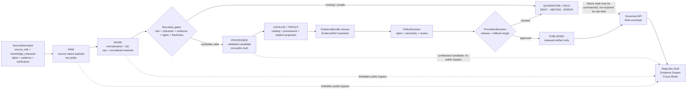

<!-- [KFM_META_BLOCK_V2]
doc_id: kfm://doc/TODO-ASSIGN-UUID
title: Atmosphere / Air Knowledge Character
type: standard
version: v1
status: draft
owners: TODO-VERIFY: @bartytime4life; atmosphere-air domain steward; schema/contract steward; policy steward
created: TODO-VERIFY-YYYY-MM-DD
updated: 2026-05-06
policy_label: TODO-VERIFY-public-or-restricted
related: [docs/domains/atmosphere_air/architecture/KNOWLEDGE_CHARACTER.md, docs/domains/atmosphere_air/README.md, docs/adr/ADR-0431-atmosphere-air-knowledge-character-boundary.md, docs/adr/ADR-0312-atmosphere-air-source-role-boundaries.md, docs/adr/ADR-0418-atmosphere-air-schema-slug-compatibility.md, schemas/contracts/v1/air/, schemas/contracts/v1/atmosphere/]
tags: [kfm, atmosphere-air, knowledge-character, source-role, evidence, air-quality, governed-domain]
notes: [Revises existing thin taxonomy file; doc_id, owners, created date, policy label, accepted ADR status, schema inventory, validator coverage, CI enforcement, and release behavior remain NEEDS VERIFICATION.]
[/KFM_META_BLOCK_V2] -->

<a id="top"></a>

# Atmosphere / Air Knowledge Character

Taxonomy and release-boundary rules that prevent atmosphere-air evidence from collapsing into a single “air layer.”

<p align="center">
  
  
  
  
  
</p>

<p align="center">
  <a href="#purpose">Purpose</a> ·
  <a href="#repo-fit">Repo fit</a> ·
  <a href="#taxonomy">Taxonomy</a> ·
  <a href="#source-role-vs-knowledge-character">Source role vs character</a> ·
  <a href="#anti-collapse-rules">Anti-collapse rules</a> ·
  <a href="#governed-flow">Flow</a> ·
  <a href="#validation-hooks">Validation</a> ·
  <a href="#open-verification">Open verification</a>
</p>

> [!IMPORTANT]
> A PM2.5 observation, AQI report, regulatory archive, low-cost sensor candidate, smoke mask, AOD product, model field, climate anomaly, advisory, site record, and fusion product are not interchangeable. KFM must preserve the difference before a claim, map popup, layer, export, Evidence Drawer payload, or Focus Mode answer can be released.

---

## Purpose

`knowledge_character` declares **what kind of knowledge an atmosphere/air object represents**.

It answers the question:

> “What is this object allowed to mean?”

That is separate from `source_role`, which answers:

> “What is this source competent to support?”

Together, these fields protect KFM from false certainty. They keep observations, reports, models, masks, advisories, baselines, and derived products inspectable after they become map layers or human-readable explanations.

### This file governs

| Surface | Requirement |
|---|---|
| Source descriptors | Must identify the source role and default knowledge character where applicable. |
| Normalized records | Must retain raw value/unit, normalized value/unit, time basis, hashes, source role, and knowledge character. |
| Derived products | Must preserve input EvidenceRefs, method, uncertainty, and transform identity. |
| Layer descriptors | Must expose what the layer represents and what it does **not** represent. |
| Evidence Drawer payloads | Must show source role, knowledge character, rights, freshness, caveats, review state, and release state. |
| Focus Mode | Must answer only over admissible evidence; otherwise return `ABSTAIN`, `DENY`, or `ERROR`. |
| Release candidates | Must fail closed when character, source role, evidence, rights, review, correction, or rollback is unresolved. |

### This file does not govern

This document does **not** define final JSON Schemas, executable policy, source activation, connector code, live API routes, UI components, public releases, or schema-slug migration. Those belong in the relevant schema, policy, source, release, ADR, and implementation surfaces.

<p align="right"><a href="#top">Back to top ↑</a></p>

---

## Repo fit

| Surface | Path | Status | Role |
|---|---|---:|---|
| This file | `docs/domains/atmosphere_air/architecture/KNOWLEDGE_CHARACTER.md` | CONFIRMED target path | Domain-local architecture taxonomy. |
| Domain landing page | [`../README.md`](../README.md) | CONFIRMED adjacent doc | Lane scope, inputs, exclusions, and governed flow. |
| Knowledge-character ADR | [`../../../adr/ADR-0431-atmosphere-air-knowledge-character-boundary.md`](../../../adr/ADR-0431-atmosphere-air-knowledge-character-boundary.md) | CONFIRMED repo-wide ADR | Release and public-surface boundary. |
| Source-role ADR | [`../../../adr/ADR-0312-atmosphere-air-source-role-boundaries.md`](../../../adr/ADR-0312-atmosphere-air-source-role-boundaries.md) | CONFIRMED repo-wide ADR | Source-role and knowledge-character separation. |
| Schema-slug ADR | [`../../../adr/ADR-0418-atmosphere-air-schema-slug-compatibility.md`](../../../adr/ADR-0418-atmosphere-air-schema-slug-compatibility.md) | CONFIRMED repo-wide ADR | `atmosphere_air`, `air`, and `atmosphere` compatibility. |
| Machine schema families | `schemas/contracts/v1/air/` and/or `schemas/contracts/v1/atmosphere/` | NEEDS VERIFICATION | Machine validation home; do not infer canonical status here. |
| Policy | `policy/air/` or atmosphere-specific policy path | NEEDS VERIFICATION | Admissibility and public-release decisions. |
| Tests | `tests/air/` and/or `tests/atmosphere/` | NEEDS VERIFICATION | Negative-path and compatibility proof. |

> [!NOTE]
> This file belongs under `docs/domains/` because it is human-facing domain architecture. It must not create a competing schema, policy, source registry, release, or proof home.

---

## Boundary law

All consequential atmosphere/air records must satisfy this minimum boundary before they can support claims or public-facing products.

| Field | Why it matters |
|---|---|
| `source_id` or `source_descriptor_ref` | Connects the object to source identity, rights, cadence, and authority. |
| `source_role` | States what the source is competent to support. |
| `knowledge_character` | States what kind of knowledge the object represents. |
| `raw_value` / `raw_unit` | Preserves source-native value where applicable. |
| `normalized_value` / `normalized_unit` | Enables comparison without losing source meaning. |
| `observed_time`, `valid_time`, `model_time`, `retrieved_at`, or equivalent | Keeps temporal support explicit. |
| `freshness_status` | Prevents stale context from appearing current. |
| `source_payload_hash` | Preserves source traceability. |
| `transform_hash` or `spec_hash` | Preserves transform identity. |
| `evidence_refs` | Enables `EvidenceRef -> EvidenceBundle` closure. |
| `rights_status` and `public_release_allowed` | Blocks public exposure when rights are unresolved. |
| `review_state` and `release_state` | Separates candidate, reviewed, released, corrected, withdrawn, and superseded states. |
| `rollback_ref` or release rollback target | Keeps publication reversible. |

---

## Taxonomy

The canonical taxonomy below should be treated as the accepted documentation vocabulary for atmosphere/air knowledge characters unless superseded by an accepted ADR and matching schema/policy/test changes.

| Knowledge character | Use when the object is… | Required display burden | Must never masquerade as… |
|---|---|---|---|
| `OBSERVED_SENSOR` | A measured station, ground, or instrument observation with site/instrument context. | Parameter, unit, method, site, time, QA/QC, source payload hash. | AQI report, model field, interpolation, fusion product, or remote mask. |
| `PUBLIC_AQI_REPORT` | AQI, NowCast-style index, public report, or agency index object. | Issuer, method/report semantics, temporal scope, public-message caveats. | Raw concentration measurement. |
| `REGULATORY_ARCHIVE` | Quality-assured, historical, or regulatory archive evidence. | Archive basis, valid time, retrieval time, QA status, not-live caveat. | Live/current state unless explicitly supported. |
| `LOW_COST_SENSOR` | Contributor or consumer sensor network record needing correction and caveat handling. | Correction method, caveats, confidence, rights, limitations, public-release posture. | Regulatory truth or unrestricted public observation. |
| `ATMOSPHERIC_MODEL_FIELD` | Forecast, reanalysis, hindcast, transport, chemistry, aerosol, or smoke model field. | Model name/version, variable, run/valid time, grid/support, uncertainty/model card. | Observed measurement. |
| `REMOTE_SENSING_MASK` | Smoke, plume, AOD, fire, aerosol, haze, cloud, or classification product. | Sensor/product, classification method, confidence, time basis, caveats. | Surface exposure or PM concentration. |
| `CLIMATE_ANOMALY_CONTEXT` | Normals, anomaly surfaces, baselines, downscaling, hindcasts, or climate support context. | Baseline period, anomaly method, model/support notes, scope. | Emergency alert or live hazard state. |
| `DERIVED_FUSION` | Interpolation, consensus, bias correction, ensemble, or fused product. | Input EvidenceRefs, method, uncertainty, transform hash, output scope. | Canonical source observation. |
| `METEOROLOGICAL_CONTEXT` | Wind, temperature, humidity, pressure, boundary-layer, stability, or transport context. | Parameter, time, source, support/cadence, relation to air-quality claim. | Air-quality concentration unless independently measured. |
| `VISIBILITY_AND_AEROSOL_CONTEXT` | Visibility, haze, AOD, opacity, or aerosol optical-burden context. | Optical/aerosol method, units, assumptions, time basis, caveats. | PM concentration without governed model support. |
| `FIRE_AND_EMISSIONS_CONTEXT` | Fire hotspot, smoke-source indicator, emissions inventory, or source-attribution context. | Source method, temporal scope, uncertainty, attribution caveat. | Exposure measurement. |
| `ALERT_AND_ADVISORY_CONTEXT` | Agency notice, public-health message, recommendation, or advisory. | Issuer, scope, effective/expiry time, official-source link, KFM non-alerting posture. | Observation, model field, or KFM life-safety instruction. |
| `NETWORK_AND_SITE_CONTEXT` | Station metadata, provider IDs, cadence, active/inactive state, siting caveats, or instrument health. | Site identity, geometry/generalization, cadence, instrument state, health events. | Measurement value. |
| `BASELINE_AND_TEMPORAL_SUPPORT` | Climatology, rolling baseline, persistence window, hysteresis, or freshness support. | Baseline definition, time window, target variable, scope. | Standalone claim without scoped evidence. |

> [!TIP]
> When a record could fit more than one character, preserve the most specific character and record relation edges to supporting context. Do not flatten the object just because a map layer or chart needs a simpler label.

<p align="right"><a href="#top">Back to top ↑</a></p>

---

## Source role vs knowledge character

`source_role` and `knowledge_character` are related but not interchangeable.

| Question | Field | Example |
|---|---|---|
| Who produced or published the source, and what is it competent to support? | `source_role` | `MODEL_PROVIDER`, `OBSERVATION_PROVIDER`, `ADVISORY_ISSUER` |
| What kind of object is this record after intake or normalization? | `knowledge_character` | `ATMOSPHERIC_MODEL_FIELD`, `OBSERVED_SENSOR`, `ALERT_AND_ADVISORY_CONTEXT` |
| Can this object support a public claim? | Policy + evidence + review + release state | Only after EvidenceBundle, policy, review, release, correction, and rollback gates pass. |

### Common pairings

| Source role family | Typical knowledge characters | Public-release caution |
|---|---|---|
| `OBSERVATION_PROVIDER` | `OBSERVED_SENSOR`, `NETWORK_AND_SITE_CONTEXT` | Needs QA/QC, site metadata, unit discipline, evidence closure. |
| `PUBLIC_REPORTING_PROVIDER` | `PUBLIC_AQI_REPORT`, `ALERT_AND_ADVISORY_CONTEXT` | Never convert to concentration without source-supported method. |
| `REGULATORY_ARCHIVE_PROVIDER` | `REGULATORY_ARCHIVE` | Not live state by default. |
| `LOW_COST_SENSOR_PROVIDER` | `LOW_COST_SENSOR` | Requires correction method, caveats, confidence, and rights. |
| `MODEL_PROVIDER` | `ATMOSPHERIC_MODEL_FIELD`, `FIRE_AND_EMISSIONS_CONTEXT`, `CLIMATE_ANOMALY_CONTEXT` | Must remain modeled and show model-card support. |
| `REMOTE_SENSING_PROVIDER` | `REMOTE_SENSING_MASK`, `VISIBILITY_AND_AEROSOL_CONTEXT`, `FIRE_AND_EMISSIONS_CONTEXT` | Not surface exposure without governed modeling. |
| `DERIVED_PRODUCT_GENERATOR` | `DERIVED_FUSION` | Must expose inputs, method, uncertainty, and transform identity. |
| `ADVISORY_ISSUER` | `ALERT_AND_ADVISORY_CONTEXT` | KFM is not an emergency alerting system. |

---

## Anti-collapse rules

These rules define what KFM should deny or abstain from when an atmosphere/air object is misused.

| Rule ID | Rule | Failure outcome |
|---|---|---|
| `ATMOS-R001` | AQI, NowCast, or public report index must not be treated as raw concentration. | `DENY` with `ATMOS_AQI_AS_CONCENTRATION`. |
| `ATMOS-R002` | AOD must not be treated as PM2.5 without governed model assumptions and evidence. | `DENY` with `ATMOS_AOD_AS_PM25`. |
| `ATMOS-R003` | Smoke, plume, fire, or aerosol mask must not be treated as exposure measurement. | `DENY` or `ABSTAIN` unless model/fusion evidence supports the claim. |
| `ATMOS-R004` | Forecast, reanalysis, transport, smoke, or chemistry model field must not be labeled observed. | `DENY` with `ATMOS_MODEL_AS_OBSERVED`. |
| `ATMOS-R005` | Regulatory archive must not imply live/current state by default. | `ABSTAIN` or stale-scoped response. |
| `ATMOS-R006` | Low-cost sensor data must not be promoted without correction method, caveats, confidence, and rights. | `DENY` with `ATMOS_LOW_COST_NO_CORRECTION`. |
| `ATMOS-R007` | Fusion product must not hide input EvidenceRefs, method, uncertainty, or transform identity. | `DENY` with `ATMOS_FUSION_INPUTS_HIDDEN` or missing-evidence reason. |
| `ATMOS-R008` | Advisory context must not become KFM emergency or life-safety instruction. | `DENY` life-safety framing and point to official systems outside KFM. |
| `ATMOS-R009` | Site metadata must not be presented as a measurement value. | `DENY` or `ERROR`, depending on request shape. |
| `ATMOS-R010` | No-network fixture or stub output must not become real-world public truth. | `DENY` public release until evidence/proof/release closure exists. |
| `ATMOS-R011` | Run receipt must not become EvidenceBundle, ProofPack, or ReleaseManifest. | `DENY` with `ATMOS_RECEIPT_AS_PROOF`. |
| `ATMOS-R012` | Public UI, API, tiles, exports, and Focus Mode must not read RAW, WORK, QUARANTINE, connector-private, normalize-stage, or unpublished candidate artifacts directly. | `DENY` with `ATMOS_PUBLIC_INTERNAL_ACCESS`. |
| `ATMOS-R013` | Stale operational context must not appear current. | `ABSTAIN` or stale-labeled response. |
| `ATMOS-R014` | Unknown rights, terms, source role, or public-release permission must not be smoothed over. | `DENY` with `ATMOS_UNKNOWN_RIGHTS_PUBLIC`. |

<p align="right"><a href="#top">Back to top ↑</a></p>

---

## Reason codes

Validators, policy checks, release tools, API envelopes, and UI trust states should use stable reason codes where practical.

| Code | Condition | Expected outcome |
|---|---|---|
| `ATMOS_MISSING_KNOWLEDGE_CHARACTER` | `knowledge_character` absent or outside accepted taxonomy. | `DENY` |
| `ATMOS_MISSING_SOURCE_ROLE` | `source_role` or source descriptor reference absent. | `DENY` |
| `ATMOS_MISSING_RIGHTS` | Rights or source terms absent. | `DENY` |
| `ATMOS_UNKNOWN_RIGHTS_PUBLIC` | Public output requested while rights remain `UNKNOWN` or `NOASSERTION`. | `DENY` |
| `ATMOS_MISSING_EVIDENCE_REFS` | Consequential record lacks EvidenceRefs. | `ABSTAIN` or `DENY` |
| `ATMOS_EVIDENCE_REF_UNRESOLVED` | EvidenceRefs do not resolve to EvidenceBundle. | `ABSTAIN` or `ERROR` |
| `ATMOS_MISSING_SOURCE_PAYLOAD_HASH` | Normalized record cannot be traced to source payload. | `DENY` |
| `ATMOS_MISSING_TRANSFORM_HASH` | Derived record lacks transform identity. | `DENY` |
| `ATMOS_PUBLIC_RELEASE_FALSE` | Source descriptor or policy blocks public release. | `DENY` |
| `ATMOS_LOW_COST_NO_CORRECTION` | Low-cost sensor lacks correction/caveat support. | `DENY` |
| `ATMOS_MODEL_AS_OBSERVED` | Model output is labeled as observed measurement. | `DENY` |
| `ATMOS_AQI_AS_CONCENTRATION` | AQI/report index is treated as raw concentration. | `DENY` |
| `ATMOS_AOD_AS_PM25` | AOD is treated as PM2.5 without governed model support. | `DENY` |
| `ATMOS_MASK_AS_EXPOSURE` | Remote-sensing or smoke mask is treated as exposure measurement. | `DENY` |
| `ATMOS_FUSION_INPUTS_HIDDEN` | Fusion product omits input EvidenceRefs, method, uncertainty, or transform identity. | `DENY` |
| `ATMOS_ANOMALY_AS_ALERT` | Climate anomaly is promoted as emergency alert. | `DENY` |
| `ATMOS_PUBLIC_INTERNAL_ACCESS` | Public surface attempts internal lifecycle or candidate access. | `DENY` |
| `ATMOS_RECEIPT_AS_PROOF` | Run receipt is used as EvidenceBundle or ReleaseManifest. | `DENY` |
| `ATMOS_STALE_CONTEXT_UNLABELED` | Stale/expired operational context lacks visible stale posture. | `ABSTAIN` or stale-labeled response |
| `ATMOS_ROLLBACK_TARGET_MISSING` | Publication candidate lacks rollback target. | `DENY` |
| `ATMOS_CORRECTION_PATH_MISSING` | Publication candidate lacks correction or withdrawal path. | `DENY` |

---

## Governed flow



### Flow obligations

| Stage | Atmosphere / Air obligation |
|---|---|
| Source edge | Source enters through descriptor-first review with source role, knowledge character, rights, cadence, and public-release posture. |
| RAW | Preserve source-native payload, retrieval time, and payload hash. Do not expose to public clients. |
| WORK | Normalize units, preserve raw values, run QC, and retain source/site/model context. |
| HOLD / QUARANTINE | Hold missing rights, missing role, missing character, unresolved sensitivity, stale live claims, schema failure, or policy failure. |
| PROCESSED | Store validated candidates. Do not treat them as released truth. |
| CATALOG / TRIPLET | Build discovery/provenance/relation projections without replacing source evidence. |
| EVIDENCE CLOSURE | Resolve EvidenceRefs to EvidenceBundle before consequential claims. |
| POLICY / REVIEW | Decide rights, sensitivity, review, release, correction, and public posture. |
| PUBLISHED | Release only public-safe artifacts with release manifest, rollback target, and correction path. |
| API / UI / FOCUS | Consume released artifacts or governed envelopes; show source role, knowledge character, freshness, caveats, and conflicts. |

<p align="right"><a href="#top">Back to top ↑</a></p>

---

## Public-surface behavior

| Surface | Required behavior | Forbidden behavior |
|---|---|---|
| Map layer | Show source role, knowledge character, freshness, caveat badge, and release state where material. | Render RAW, WORK, QUARANTINE, connector-private, or unpublished candidate data directly. |
| Popup | State what the value is and what it is not. | Present model/mask/report/fusion as observed measurement. |
| Evidence Drawer | Resolve EvidenceRefs and expose source, role, character, rights, review, release, hashes, transform, freshness, and conflicts. | Hide method, uncertainty, stale state, or disagreement behind polished prose. |
| Focus Mode | Return `ANSWER`, `ABSTAIN`, `DENY`, or `ERROR` over admissible evidence only. | Free-form uncited model answer, policy bypass, or direct connector access. |
| Export | Include release manifest reference, evidence route, caveats, and correction path. | Export internal candidates as public truth. |
| Advisory display | Label issuer and scope; point to official systems for life-safety action. | KFM issuing emergency instructions. |
| Release candidate | Include EvidenceBundle closure, policy decision, review state, rollback target, and correction path. | Treat schema validity, a run receipt, or a pretty layer as publication. |

---

## Examples

These examples are illustrative and should be adapted to the active schema once the repo’s schema-home decision is verified.

### Observed PM2.5 sensor record

```yaml
record_type: atmosphere_observation
source_id: kfm_air_pipeline_stub
source_role: OBSERVATION_PROVIDER
knowledge_character: OBSERVED_SENSOR
parameter: pm25
raw_value: 8.1
raw_unit: ug_m3
normalized_value: 8.1
normalized_unit: ug_m3
observed_time: "2026-05-01T00:00:00Z"
retrieved_at: "2026-05-01T01:00:00Z"
freshness_status: fixture
source_payload_hash: sha256:TODO-VERIFY
evidence_refs:
  - kfm://evidence/TODO-VERIFY
decision: candidate
public_release_allowed: false
```

### Public AQI report

```yaml
record_type: atmosphere_aqi_report
source_id: airnow_or_equivalent_TODO_VERIFY
source_role: PUBLIC_REPORTING_PROVIDER
knowledge_character: PUBLIC_AQI_REPORT
index_name: AQI
index_value: 42
report_method: TODO-VERIFY
valid_time: "2026-05-01T00:00:00Z/2026-05-01T01:00:00Z"
caveats:
  - "Index/report object; not raw concentration."
denied_interpretations:
  - ATMOS_AQI_AS_CONCENTRATION
public_release_allowed: false
```

### Smoke mask

```yaml
record_type: atmosphere_remote_mask
source_id: hms_smoke_or_equivalent_TODO_VERIFY
source_role: REMOTE_SENSING_PROVIDER
knowledge_character: REMOTE_SENSING_MASK
classification: smoke_plume
confidence: TODO-VERIFY
valid_time: "2026-05-01T00:00:00Z"
caveats:
  - "Smoke classification context; not surface exposure measurement."
denied_interpretations:
  - ATMOS_MASK_AS_EXPOSURE
  - ATMOS_AOD_AS_PM25
public_release_allowed: false
```

### Fusion product

```yaml
record_type: atmosphere_fusion_product
source_role: DERIVED_PRODUCT_GENERATOR
knowledge_character: DERIVED_FUSION
method: TODO-VERIFY
input_evidence_refs:
  - kfm://evidence/TODO-VERIFY-observation
  - kfm://evidence/TODO-VERIFY-model
transform_hash: sha256:TODO-VERIFY
uncertainty:
  method: TODO-VERIFY
  caveat: "Fusion summarizes support; it is not canonical source evidence."
decision: candidate
public_release_allowed: false
```

---

## Validation hooks

Implementation should make these checks executable before claiming enforcement.

| Hook | Check |
|---|---|
| Schema validation | `knowledge_character` is required and must match the accepted enum. |
| Source registry validation | Every source descriptor declares `source_role`, `knowledge_character`, rights, verification status, and public-release posture. |
| Unit validation | Raw and normalized units are preserved; AQI/index units are not treated as concentration. |
| Anti-collapse validation | AQI, AOD, smoke masks, model fields, fusion, anomalies, and advisories cannot be misused. |
| Evidence validation | EvidenceRefs resolve to EvidenceBundle before consequential claims. |
| Policy validation | Unknown rights, restricted sources, public internal access, and unresolved review fail closed. |
| Freshness validation | Live/current claims require valid time, retrieval time, and freshness posture. |
| Release validation | Release candidates include review state, release manifest, correction path, and rollback target. |
| UI payload validation | Evidence Drawer and Focus Mode payloads expose character, role, evidence, policy, freshness, and caveats. |

### Illustrative validator sketch

```python
# Illustrative only — adapt to the repo's actual validator framework.
# Purpose: enforce atmosphere/air knowledge-character boundaries.

ALLOWED_KNOWLEDGE_CHARACTERS = {
    "OBSERVED_SENSOR",
    "PUBLIC_AQI_REPORT",
    "REGULATORY_ARCHIVE",
    "LOW_COST_SENSOR",
    "ATMOSPHERIC_MODEL_FIELD",
    "REMOTE_SENSING_MASK",
    "CLIMATE_ANOMALY_CONTEXT",
    "DERIVED_FUSION",
    "METEOROLOGICAL_CONTEXT",
    "VISIBILITY_AND_AEROSOL_CONTEXT",
    "FIRE_AND_EMISSIONS_CONTEXT",
    "ALERT_AND_ADVISORY_CONTEXT",
    "NETWORK_AND_SITE_CONTEXT",
    "BASELINE_AND_TEMPORAL_SUPPORT",
}


def validate_knowledge_character(record: dict) -> list[str]:
    failures: list[str] = []

    character = record.get("knowledge_character")
    source_role = record.get("source_role") or record.get("source_descriptor_ref")

    if not source_role:
        failures.append("ATMOS_MISSING_SOURCE_ROLE")

    if character not in ALLOWED_KNOWLEDGE_CHARACTERS:
        failures.append("ATMOS_MISSING_KNOWLEDGE_CHARACTER")

    if character == "PUBLIC_AQI_REPORT" and record.get("claims_raw_concentration"):
        failures.append("ATMOS_AQI_AS_CONCENTRATION")

    if character == "VISIBILITY_AND_AEROSOL_CONTEXT" and record.get("claims_pm25") and not record.get("model_assumptions_ref"):
        failures.append("ATMOS_AOD_AS_PM25")

    if character == "REMOTE_SENSING_MASK" and record.get("claims_exposure_measurement"):
        failures.append("ATMOS_MASK_AS_EXPOSURE")

    if character == "ATMOSPHERIC_MODEL_FIELD" and record.get("observation_type") == "observed":
        failures.append("ATMOS_MODEL_AS_OBSERVED")

    if character == "DERIVED_FUSION" and not record.get("input_evidence_refs"):
        failures.append("ATMOS_FUSION_INPUTS_HIDDEN")

    if record.get("public_release_requested") and record.get("rights_status") in {None, "UNKNOWN", "NOASSERTION"}:
        failures.append("ATMOS_UNKNOWN_RIGHTS_PUBLIC")

    if record.get("public_surface") and record.get("lifecycle_state") in {
        "RAW",
        "WORK",
        "QUARANTINE",
        "CONNECTOR_CANDIDATE",
        "NORMALIZE_CANDIDATE",
    }:
        failures.append("ATMOS_PUBLIC_INTERNAL_ACCESS")

    return failures
```

<p align="right"><a href="#top">Back to top ↑</a></p>

---

## Acceptance checklist

This document can be treated as implementation-enforced only after these are verified in the active repo branch.

- [ ] `docs/adr/ADR-0431-atmosphere-air-knowledge-character-boundary.md` has accepted or explicitly current status.
- [ ] ADR-0312, ADR-0418, and this file are cross-linked without duplicate authority.
- [ ] `knowledge_character` enum is present in the active schema family.
- [ ] Source descriptors require `source_role` and `knowledge_character`.
- [ ] Valid fixtures cover every knowledge character.
- [ ] Invalid fixtures cover every anti-collapse rule.
- [ ] Validators emit stable reason codes.
- [ ] Policy blocks unknown-rights public release.
- [ ] EvidenceRefs resolve to EvidenceBundle before consequential public claims.
- [ ] Public UI/API/Focus/export paths cannot read RAW, WORK, QUARANTINE, or unpublished candidates.
- [ ] Release candidates require review state, correction path, and rollback target.
- [ ] CI or repo-native validation output is captured before claiming enforcement.
- [ ] Documentation links are checked from this file’s actual path.

---

## Open verification

| Item | Status | Why it matters |
|---|---:|---|
| Final `doc_id` | TODO | Required for KFM Meta Block V2 traceability. |
| Owners | TODO | Required for acceptance, source activation, and policy changes. |
| Created date | TODO | Existing thin file had no meta block. |
| Policy label | TODO | Determines public/restricted posture of this doc and downstream surfaces. |
| Accepted schema family | NEEDS VERIFICATION | `air` and `atmosphere` compatibility is governed by ADR-0418, not this file. |
| Validator coverage | NEEDS VERIFICATION | This file defines checks; it does not prove execution. |
| Test status | NEEDS VERIFICATION | Existing test paths must be run in the active repo before enforcement claims. |
| Release behavior | NEEDS VERIFICATION | No release or publication is authorized by this document. |
| Source rights | UNKNOWN | All public release remains blocked until source terms and rights are verified. |
| Evidence Drawer / Focus binding | NEEDS VERIFICATION | Payload expectations are specified here; implementation must be separately verified. |

---

## FAQ

<details>
<summary>Why not just call everything “air quality”?</summary>

Because “air quality” can describe measurements, reports, models, masks, advisories, and derived interpretation. KFM needs the specific knowledge character so users can inspect what the object actually supports.
</details>

<details>
<summary>Can an AQI report support a public claim?</summary>

Yes, if the claim is about the AQI/report itself and passes evidence, policy, review, release, correction, and rollback gates. It cannot silently become a raw concentration claim.
</details>

<details>
<summary>Can a smoke plume layer support a PM2.5 exposure claim?</summary>

Not by itself. A smoke mask can support context or classification. A surface concentration or exposure claim requires governed model or fusion support, assumptions, evidence, and caveats.
</details>

<details>
<summary>What should Focus Mode do when character support is missing?</summary>

Return `ABSTAIN`, `DENY`, or `ERROR` with a reason code. It must not fill the gap with plausible generated language.
</details>

<p align="right"><a href="#top">Back to top ↑</a></p>
