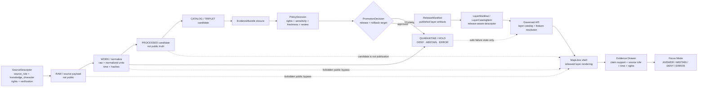

<!-- [KFM_META_BLOCK_V2]
doc_id: kfm://doc/TODO-ASSIGN-UUID
title: Atmosphere / Air Map Layers
type: standard
version: v1
status: draft
owners: TODO-VERIFY: atmosphere-air domain steward, map-shell steward, data steward, policy steward
created: TODO-VERIFY-YYYY-MM-DD
updated: 2026-05-06
policy_label: TODO-VERIFY-public-or-restricted
related: [../README.md, ../governance/SOURCE_REGISTRY.md, ../../../adr/ADR-0312-atmosphere-air-source-role-boundaries.md, ../../../adr/ADR-0418-atmosphere-air-schema-slug-compatibility.md, ../../../adr/ADR-0431-atmosphere-air-knowledge-character-boundary.md, ../../../adr/ADR-0001-schema-home.md, ../../../architecture/contract-schema-policy-split.md, ../../../../data/registry/layers/README.md, ../../../../connectors/pipelines/air/README.md, ../../../../pipelines/normalize/domains/atmosphere/README.md, ../../../../data/processed/air/qa_summary.example.json, ../../../../data/receipts/air/run_receipt.example.json]
tags: [kfm, atmosphere-air, map-layers, maplibre, layer-manifest, evidence-drawer, focus-mode, knowledge-character, public-safety]
notes: [Revises existing thin MAP_LAYERS.md into a governed layer-descriptor guide. doc_id, owners, created date, policy_label, active LayerManifest schema, public layer registry entries, CI enforcement, runtime MapLibre binding, and release evidence remain NEEDS VERIFICATION.]
[/KFM_META_BLOCK_V2] -->

<a id="top"></a>

# Atmosphere / Air Map Layers

Governance rules for atmosphere/air layer descriptors so map rendering remains downstream of evidence, source role, knowledge character, policy, review, release, correction, and rollback state.

<p align="left">
  
  
  
  
  
  
</p>

**Status:** `draft`  
**Target path:** `docs/domains/atmosphere_air/architecture/MAP_LAYERS.md`  
**Owning root:** `docs/` as the human-facing domain architecture and governance surface  
**Primary audience:** atmosphere/air maintainers, map-shell maintainers, data stewards, policy reviewers, release reviewers, and UI implementers  
**Repo evidence posture:** CONFIRMED target file exists; CONFIRMED adjacent atmosphere/air doctrine and no-network air slice exist; UNKNOWN public layer-manifest implementation and runtime MapLibre binding.

**Quick jumps:** [Scope](#scope) · [Repo fit](#repo-fit) · [Layer boundary rules](#layer-boundary-rules) · [Accepted inputs](#accepted-inputs) · [Exclusions](#exclusions) · [Descriptor minimums](#descriptor-minimums) · [Knowledge characters](#knowledge-character-layer-matrix) · [Evidence snapshot](#current-repo-evidence-snapshot) · [Flow](#governed-map-layer-flow) · [Interactions](#map-interaction-rules) · [Validation](#validation-and-denial-codes) · [Example manifest](#illustrative-layermanifest) · [Done](#definition-of-done) · [Open verification](#open-verification)

> [!IMPORTANT]
> A rendered atmosphere/air layer is not a public claim by itself. The layer may orient a user, expose a selectable feature candidate, or show released context, but consequential meaning must resolve through governed evidence, policy, review, and release state.

> [!CAUTION]
> Do not flatten AQI, PM2.5 concentration, AOD, smoke masks, model fields, advisory messages, low-cost sensor candidates, regulatory archives, station metadata, or fusion products into one “air layer.” Every public or semi-public map surface must preserve `source_role` and `knowledge_character`.

---

## Scope

This document governs the **map-layer surface** for the Atmosphere / Air lane.

It defines what a layer descriptor must carry before it can be listed, rendered, clicked, exported, explained in the Evidence Drawer, or used by Focus Mode. It is intentionally narrower than the full domain README and broader than a single MapLibre style expression.

### In scope

| Surface | What this document governs |
|---|---|
| Layer descriptors | Minimum fields for identity, release state, source support, evidence route, time, freshness, policy, and rollback. |
| Map layer registry entries | How atmosphere/air layer entries should relate to `data/registry/layers/` and domain-local docs. |
| MapLibre source/layer use | How released artifacts may be rendered without turning the renderer into truth authority. |
| Popups and click results | What may appear as lightweight affordance versus what requires Evidence Drawer resolution. |
| Evidence Drawer payload pressure | What a clicked atmosphere/air feature must expose before supporting a claim. |
| Focus Mode payload pressure | What bounded AI synthesis may receive and when it must `ANSWER`, `ABSTAIN`, `DENY`, or `ERROR`. |
| Public-safety gates | Denials for unknown rights, stale state, missing EvidenceRefs, internal-path exposure, and epistemic collapse. |
| Rollback and correction readiness | Layer release must include correction and rollback references before publication. |

### Out of scope

| Out of scope | Correct home or next step |
|---|---|
| Source admission and rights review | `../governance/SOURCE_REGISTRY.md` and repo-verified source registry files. |
| Connector logic | `../../../../connectors/pipelines/air/` or source-specific connector homes. |
| Normalization logic | `../../../../pipelines/normalize/domains/atmosphere/` and validators. |
| Machine schema bodies | `schemas/contracts/v1/...` or the ADR-approved schema home. |
| Policy-as-code | `policy/...` or the repo-approved policy home. |
| Heavy tile, raster, PMTiles, COG, GeoParquet, or MVT bytes | published/release artifact homes after promotion. |
| Public runtime route names | governed API docs or route source files after direct verification. |
| Direct emergency or life-safety alerting | official alerting systems outside KFM; KFM may show source context, not issue emergency instructions. |

<p align="right"><a href="#top">Back to top ↑</a></p>

---

## Repo fit

This file sits inside the Atmosphere / Air domain documentation lane and points to shared layer, schema, policy, pipeline, evidence, and release surfaces.

| Relationship | Path | Status | Role |
|---|---|---:|---|
| This document | `docs/domains/atmosphere_air/architecture/MAP_LAYERS.md` | CONFIRMED target file | Human-facing layer governance for the Atmosphere / Air lane. |
| Domain overview | [`../README.md`](../README.md) | CONFIRMED | Domain scope, accepted inputs, exclusions, knowledge characters, and lifecycle posture. |
| Source registry posture | [`../governance/SOURCE_REGISTRY.md`](../governance/SOURCE_REGISTRY.md) | CONFIRMED | Required source fields and inactive-public-release rule. |
| Source-role ADR | [`../../../adr/ADR-0312-atmosphere-air-source-role-boundaries.md`](../../../adr/ADR-0312-atmosphere-air-source-role-boundaries.md) | CONFIRMED / draft | Mandatory source-role and knowledge-character boundary. |
| Schema-slug ADR | [`../../../adr/ADR-0418-atmosphere-air-schema-slug-compatibility.md`](../../../adr/ADR-0418-atmosphere-air-schema-slug-compatibility.md) | CONFIRMED / proposed | Compatibility boundary among `atmosphere_air`, `air`, and `atmosphere`. |
| Knowledge-character ADR | [`../../../adr/ADR-0431-atmosphere-air-knowledge-character-boundary.md`](../../../adr/ADR-0431-atmosphere-air-knowledge-character-boundary.md) | CONFIRMED / draft | Release/UI/Drawer/Focus boundary for knowledge characters. |
| Schema-home ADR | [`../../../adr/ADR-0001-schema-home.md`](../../../adr/ADR-0001-schema-home.md) | CONFIRMED / proposed | Proposed machine schema home and acceptance burden. |
| Contract/schema/policy split | [`../../../architecture/contract-schema-policy-split.md`](../../../architecture/contract-schema-policy-split.md) | CONFIRMED / draft | Contracts mean; schemas shape; policy decides. |
| Shared layer registry | [`../../../../data/registry/layers/README.md`](../../../../data/registry/layers/README.md) | CONFIRMED | Release-aware registry surface for layer manifests. |
| Air connector | [`../../../../connectors/pipelines/air/README.md`](../../../../connectors/pipelines/air/README.md) | CONFIRMED | No-network candidate and receipt producer. |
| Atmosphere normalization | [`../../../../pipelines/normalize/domains/atmosphere/README.md`](../../../../pipelines/normalize/domains/atmosphere/README.md) | CONFIRMED | Candidate-preserving normalization guidance. |
| Current QA candidate | [`../../../../data/processed/air/qa_summary.example.json`](../../../../data/processed/air/qa_summary.example.json) | CONFIRMED candidate | No-network processed example; not public truth. |
| Current run receipt | [`../../../../data/receipts/air/run_receipt.example.json`](../../../../data/receipts/air/run_receipt.example.json) | CONFIRMED receipt | Process memory; not proof or release authority. |

### Directory-rule basis

The domain remains under `docs/domains/atmosphere_air/` because domain names should live under responsibility roots instead of becoming repo-root folders. This file is documentation control-plane material, not a schema, policy, data artifact, release manifest, validator, or runtime module.

### Naming posture

| Name | Current role | Rule |
|---|---|---|
| `atmosphere_air` | CONFIRMED human-facing documentation lane. | Use in docs paths until successor ADR says otherwise. |
| `air` | CONFIRMED no-network implementation slice in connectors/tools/data examples. | Treat as implementation/test slice, not full-domain schema proof. |
| `atmosphere` | PROPOSED whole-domain schema/normalization concept. | Do not claim canonical schema authority until schema inventory and ADR acceptance prove it. |

> [!WARNING]
> Do not create a parallel `docs/domains/ADR/` or duplicate layer decision home. Repo-wide decisions belong under `docs/adr/`; domain-local architecture belongs here and should link out.

<p align="right"><a href="#top">Back to top ↑</a></p>

---

## Layer boundary rules

Atmosphere / Air layer descriptors must preserve the trust membrane between evidence and rendering.

| Rule | Requirement | Failure posture |
|---|---|---|
| Renderer downstream | MapLibre may render released public-safe artifacts and expose candidate feature IDs. It must not decide truth, release, rights, policy, or review state. | `DENY` public or consequential use. |
| Descriptor before display | A layer must resolve to a descriptor or manifest with identity, domain, knowledge character, release state, evidence route, freshness, and policy posture. | `ERROR` for malformed descriptor; `DENY` for public use. |
| Evidence before claim | Consequential popup, Drawer, Focus, export, or story text must resolve EvidenceRefs to an EvidenceBundle. | `ABSTAIN` or `DENY`. |
| Source role visible | Layer metadata must identify source role or source descriptor reference. | `ATMOS_MISSING_SOURCE_ROLE`. |
| Knowledge character visible | Layer metadata must identify the kind of knowledge rendered. | `ATMOS_MISSING_KNOWLEDGE_CHARACTER`. |
| Time support explicit | Layer metadata must distinguish observation, valid, model, retrieval, release, stale, and correction time where material. | stale badge, `ABSTAIN`, or `DENY`. |
| Rights fail closed | Unknown or unresolved rights/terms/public-release permission block public exposure. | `ATMOS_UNKNOWN_RIGHTS_PUBLIC`. |
| Candidate not public | `data/processed/air/*` and no-network fixtures remain candidates until promoted. | `ATMOS_PUBLIC_INTERNAL_ACCESS` or fixture-publication denial. |
| Receipt not proof | Run receipts record process memory. They do not replace EvidenceBundle, ProofPack, PromotionDecision, or ReleaseManifest. | `ATMOS_RECEIPT_AS_PROOF`. |
| Rollback before release | Public layer release requires rollback target and correction path. | `ATMOS_LAYER_ROLLBACK_TARGET_MISSING`. |

### Layer state vocabulary

Use finite, reviewable state names. Do not infer publication from visibility.

| State | Meaning | Public posture |
|---|---|---|
| `draft` | Descriptor is being authored. | Not public. |
| `dry_run` | Descriptor participates in offline validation only. | Not public. |
| `candidate` | Candidate descriptor or layer artifact exists but is not promoted. | Not public by default. |
| `catalog_candidate` | Catalog/proof candidate exists after validation. | Internal/review only unless release permits. |
| `publication_candidate` | Candidate is assembled for release review. | Not public until promotion. |
| `published` | Release state, evidence, policy, review, correction, and rollback gates passed. | Public or semi-public per policy. |
| `stale` | Time/freshness support no longer supports current-state claims. | Visible stale state; Focus may abstain. |
| `denied` | Policy blocks release or exposure. | Reason-coded safe stub only. |
| `withdrawn` | Prior release has been withdrawn. | Safe withdrawal notice; no stale truth. |
| `superseded` | Newer release replaces the layer. | Pointer to successor and correction lineage. |

<p align="right"><a href="#top">Back to top ↑</a></p>

---

## Accepted inputs

A map-layer descriptor may reference only inputs whose role is clear enough for review.

| Input | Accepted? | Required handling |
|---|---:|---|
| Source descriptor reference | Yes | Must include or resolve `source_id`, `source_role`, `knowledge_character`, rights, verification status, public-release flag, and last verification date. |
| Processed no-network QA candidate | Yes, as candidate only | Keep `decision: candidate`; do not render as public truth. |
| Run receipt | Yes, as process memory | Link for audit; do not use as proof or release authority. |
| EvidenceBundle reference | Yes | Must resolve before consequential claims, Drawer explanation, Focus answer, or export. |
| Layer manifest | Yes | Must bind layer identity, release state, artifact refs, evidence policy, time model, geometry policy, trust cues, rollback target, and correction state. |
| Legend descriptor | Yes | Must explain symbology without creating new evidence claims. |
| Style manifest or style reference | Yes | Must be versioned and tied to layer meaning; visual meaning changes require review. |
| Tile or raster artifact reference | Yes | Must be released or release-candidate artifact with digest/integrity metadata and public-safety posture. |
| Advisory or public report layer | Yes | Must show issuer, method/scope, time support, and not-emergency-alert posture. |
| Model or remote-sensing layer | Yes | Must preserve modeled/mask/context character, assumptions, uncertainty, and source support. |
| Fusion layer | Yes | Must expose input EvidenceRefs, method, transform hash, uncertainty, and derived status. |
| Live source endpoint | No, not directly | Must enter through connector/source registry/lifecycle flow before layer use. |
| RAW, WORK, QUARANTINE, connector-private, or normalization-stage data | No | Public layers must not reference internal lifecycle stages directly. |

<p align="right"><a href="#top">Back to top ↑</a></p>

---

## Exclusions

These must not be placed in a public or semi-public layer descriptor.

| Exclusion | Why it is blocked | Correct handling |
|---|---|---|
| Direct RAW/WORK/QUARANTINE paths | Bypasses evidence, policy, review, and release. | Use released artifacts and governed API references only. |
| Direct `data/processed/air/*` candidate as public source | Processed candidate is not publication. | Promote through proof/release flow first. |
| Secrets, API keys, tokens, or private endpoints | Security and rights risk. | Never commit; use secure runtime config outside public docs. |
| AQI presented as raw concentration | Epistemic collapse. | Mark `PUBLIC_AQI_REPORT`; expose method and issuer. |
| AOD presented as PM2.5 | Unsupported conversion without governed model. | Mark aerosol/visibility context or derived fusion with assumptions. |
| Smoke mask presented as exposure measurement | Classification is not exposure. | Mark `REMOTE_SENSING_MASK`; require model/fusion support for exposure claims. |
| Model field presented as observation | Modeled output is not measured. | Mark `ATMOSPHERIC_MODEL_FIELD`. |
| Fusion product without input refs | Hides derivation and uncertainty. | Require input EvidenceRefs, method, uncertainty, transform hash. |
| Run receipt as release proof | Process memory is not proof. | Link receipt as audit support, not as EvidenceBundle or ReleaseManifest. |
| Style expression as policy law | UI styling is not admissibility. | Put allow/deny/restrict logic in policy and governed API. |
| Client-only filtering for policy-sensitive material | Hidden features can leak or mislead. | Use server/governed API slicing and withheld-feature accounting. |
| KFM emergency instructions | KFM is not an alerting authority. | Display advisory context and point to official systems where appropriate. |

<p align="right"><a href="#top">Back to top ↑</a></p>

---

## Descriptor minimums

The existing thin file named six minimums. This revision expands those minimums into reviewable fields.

### Required descriptor families

| Family | Required fields or refs | Notes |
|---|---|---|
| Identity | `layer_id`, `title`, `domain`, `version`, `status` | `domain` should preserve `atmosphere.air` or repo-verified equivalent until slug ADRs settle canonical form. |
| Ownership | owner/steward/reviewer refs or placeholders | Required before promotion; placeholders are acceptable only in draft docs. |
| Release binding | `release_state`, `release_id` or candidate ID, `previous_release_id`, `rollback_target`, correction state | `published` without rollback target is invalid. |
| Source support | `source_refs`, source roles, rights posture, public-release flag | Must resolve to source descriptor or registry entry. |
| Knowledge character | one accepted `knowledge_character` or a specific per-feature character field | Required for every consequential layer. |
| Evidence route | EvidenceBundle ref, resolver route, Drawer payload contract, Focus eligibility | Popups may be lightweight; claims require evidence route. |
| Time model | observation/valid/model/retrieval/release/stale/correction time fields where material | Prevents stale live-state claims. |
| Artifact refs | tile/raster/service/style/legend refs, digests, media type, delivery class | Artifact bytes live elsewhere. |
| Geometry policy | public geometry class, generalization/redaction state, exact geometry permission, withheld counts | Blocks sensitive or misleading precision. |
| Trust cues | status chips, freshness cues, evidence-state, rights/sensitivity, review-state, knowledge-character markers | Must travel with layer panels, Drawer, Focus, and exports. |
| Negative states | `MISSING_EVIDENCE`, `SOURCE_STALE`, `DENIED_BY_POLICY`, `GENERALIZED_GEOMETRY`, `RELEASE_WITHDRAWN`, `RUNTIME_ERROR` | Empty panels are not enough. |
| Validation refs | schema, validator report, policy decision, promotion decision, catalog/proof closure refs | Required before claiming release readiness. |

### Minimum public layer fields

A public or semi-public atmosphere/air layer descriptor should include at least:

| Field | Required for public layer? | Reason |
|---|---:|---|
| `layer_id` | Yes | Stable UI/API/release reference. |
| `domain` | Yes | Domain ownership and policy routing. |
| `knowledge_character` | Yes | Prevents epistemic collapse. |
| `source_refs` | Yes | Source role, rights, verification, and citation support. |
| `release_state` | Yes | Distinguishes draft/candidate/published/stale/withdrawn. |
| `evidence_policy.requires_evidence_bundle` | Yes | Keeps claims evidence-backed. |
| `drawer_payload_contract` | Yes for clickable layers | Ensures click-through trust continuity. |
| `focus_mode_allowed` | Yes | Prevents free-form AI over unsafe context. |
| `freshness_status` or `stale_policy` | Yes for current-state context | Avoids stale live claims. |
| `geometry_policy` | Yes | Prevents exact/sensitive geometry leakage. |
| `rights_status` | Yes | Unknown rights block public release. |
| `rollback_target` | Yes for release | Makes publication reversible. |
| `correction_state` | Yes for release | Makes corrections inspectable. |

<p align="right"><a href="#top">Back to top ↑</a></p>

---

## Knowledge-character layer matrix

Each layer must state what kind of knowledge it carries. This controls styling, popups, Evidence Drawer obligations, Focus eligibility, and release gates.

| Knowledge character | Typical layer form | Required visual/trust treatment | Must never masquerade as |
|---|---|---|---|
| `OBSERVED_SENSOR` | Station points, time-series symbols, measured-value overlays | Show site/instrument context, raw and normalized units, observation time, freshness, QA state. | AQI report, model field, interpolation, smoke mask, or fusion product. |
| `PUBLIC_AQI_REPORT` | AQI/report zones, issuer summaries, advisory panels | Show issuer, method, index scale, report period, caveats, and public-message source. | Raw PM2.5, ozone, or concentration measurement. |
| `REGULATORY_ARCHIVE` | Historical archive points or QA/QC record layers | Show archive status, valid period, source publication time, retrieval time. | Live/current state. |
| `LOW_COST_SENSOR` | Candidate sensor points or generalized aggregates | Show correction method, confidence, rights, caveats, and review state. | Regulatory truth or unrestricted public observation. |
| `ATMOSPHERIC_MODEL_FIELD` | Forecast/reanalysis/hindcast grid, plume/transport model field | Show model name/version, valid time, uncertainty/model-card ref, and modeled status. | Observed measurement. |
| `REMOTE_SENSING_MASK` | Smoke/AOD/fire/aerosol/haze/cloud masks | Show sensor/product, classification confidence, spatial support, caveats. | Surface PM2.5, exposure, or health concentration. |
| `CLIMATE_ANOMALY_CONTEXT` | Baseline/anomaly surfaces, normals, downscaled context | Show baseline period, anomaly method, uncertainty, and time basis. | Emergency alert or live hazard state. |
| `DERIVED_FUSION` | Interpolation, consensus, bias-corrected, ensemble/fused surfaces | Show input EvidenceRefs, method, transform hash, uncertainty, derived status. | Canonical source observation. |
| `METEOROLOGICAL_CONTEXT` | Wind, temperature, humidity, pressure, transport support | Show that it supports interpretation, not air-quality concentration by itself. | PM/AQI concentration unless independently measured. |
| `VISIBILITY_AND_AEROSOL_CONTEXT` | Visibility, haze, AOD, optical aerosol burden | Show optical/contextual meaning and assumptions. | PM concentration without governed model. |
| `FIRE_AND_EMISSIONS_CONTEXT` | Fire hotspots, emissions context, smoke-source indicators | Show source-attribution context and time basis. | Exposure measurement. |
| `ALERT_AND_ADVISORY_CONTEXT` | Agency notices and public health message layers | Show issuer, message source, valid time, expiry, and not-emergency-alert posture. | Sensor observation, model field, or KFM life-safety instruction. |
| `NETWORK_AND_SITE_CONTEXT` | Station metadata, active/inactive state, instrument/site health | Show station context, cadence, outages, siting caveats. | Measurement value. |
| `BASELINE_AND_TEMPORAL_SUPPORT` | Normal, persistence, hysteresis, freshness support | Show supporting role and target scope. | Standalone claim without scoped evidence. |

> [!TIP]
> If one visual layer blends multiple knowledge characters, split it into separate descriptors or require per-feature `knowledge_character` plus explicit legend and Drawer rules. Do not let a single style hide multiple truth burdens.

<p align="right"><a href="#top">Back to top ↑</a></p>

---

## Current repo evidence snapshot

The table below records current evidence checked while revising this file. It should be updated when maintainers inspect a mounted checkout, run validators, or add layer manifests.

| Surface | Status | Layer-document consequence |
|---|---:|---|
| `docs/domains/atmosphere_air/architecture/MAP_LAYERS.md` | CONFIRMED existing thin file | This revision expands it instead of creating a new path. |
| `docs/domains/atmosphere_air/README.md` | CONFIRMED | Use as domain scope and knowledge-character source. |
| `docs/domains/atmosphere_air/governance/SOURCE_REGISTRY.md` | CONFIRMED | Source fields and inactive-public-release rule are adopted here. |
| `docs/adr/ADR-0312-atmosphere-air-source-role-boundaries.md` | CONFIRMED / draft | Source-role and knowledge-character boundaries are binding design pressure, but enforcement remains NEEDS VERIFICATION. |
| `docs/adr/ADR-0418-atmosphere-air-schema-slug-compatibility.md` | CONFIRMED / proposed | Keep `atmosphere_air`, `air`, and `atmosphere` naming split visible. |
| `docs/adr/ADR-0431-atmosphere-air-knowledge-character-boundary.md` | CONFIRMED / draft | Public release remains denied until evidence, source role, knowledge character, rights, review, release, correction, and rollback pass. |
| `data/registry/layers/README.md` | CONFIRMED | Shared layer registry posture informs descriptor fields. |
| `connectors/pipelines/air/README.md` | CONFIRMED | No-network air connector exists and emits candidate/receipt artifacts only. |
| `data/processed/air/qa_summary.example.json` | CONFIRMED candidate | It is a PM2.5 no-network QA summary with `decision: candidate`; not public truth. |
| `data/receipts/air/run_receipt.example.json` | CONFIRMED receipt | It records `network_access: disabled` and a completed no-network run; not proof or release. |
| `pipelines/normalize/domains/atmosphere/README.md` | CONFIRMED | Normalization preserves candidate status, role, character, units, time, and evidence links. |
| `tools/validators/air/validate_air_qa.py` | CONFIRMED | Validator references `schemas/contracts/v1/air/qa_summary.schema.json`; schema file still needs verification. |
| `tools/publishers/air/build_air_release_candidate.py` | CONFIRMED | Release-candidate builder exists and refers to air schema families; public release still requires gates. |
| `tools/publishers/air/publish_air_release.py` | CONFIRMED | Publisher denies fixture-backed public truth and forbidden internal paths; successful production release not verified. |
| `schemas/contracts/v1/air/qa_summary.schema.json` | NEEDS VERIFICATION | Direct fetch on `main` was not confirmed; do not claim schema enforcement until inventory succeeds. |
| Dedicated atmosphere/air public `LayerManifest` | UNKNOWN / not confirmed | This file defines requirements before adding or promoting one. |
| Runtime MapLibre binding | UNKNOWN | No UI route/component/runtime evidence was inspected here. |
| CI or branch protection enforcing these rules | UNKNOWN | Workflow/run status was not executed or verified here. |

<p align="right"><a href="#top">Back to top ↑</a></p>

---

## Governed map-layer flow



### Flow obligations

| Step | Atmosphere / Air obligation |
|---|---|
| Source admission | Source must have source role, knowledge character, rights, verification status, public-release flag, and cadence before public use. |
| Processing | Preserve raw value/unit, normalized value/unit, source payload hash, transform hash, and time support. |
| Candidate state | Keep no-network examples and processed candidates non-public. |
| Evidence closure | Resolve EvidenceRefs to EvidenceBundle before consequential layer claims. |
| Policy | Deny unknown rights, missing source role, missing knowledge character, unsafe precision, stale current-state claims, and unsupported conversions. |
| Promotion | Publication requires review, release manifest, correction path, and rollback target. |
| Rendering | MapLibre renders released artifacts and candidate IDs; it does not own truth state. |
| Drawer | The Drawer must reveal support, source role, knowledge character, rights, freshness, review, release, transform, and audit linkage. |
| Focus | Focus receives only admissible evidence-scoped context and emits finite outcomes. |

<p align="right"><a href="#top">Back to top ↑</a></p>

---

## Map interaction rules

| Interaction | Allowed behavior | Required trust behavior |
|---|---|---|
| Layer list | Show released or review-eligible layers with status, knowledge character, freshness, rights/sensitivity, and release chips. | Hidden or denied layers should surface safe reason states where appropriate. |
| Layer toggle | Toggle visibility of released or authorized review layers. | Toggle is not publication approval. |
| Style switch | Switch visual treatment where style is compatible with layer meaning. | If visual meaning changes, update StyleManifest or LayerManifest. |
| Hover | Show low-risk affordance only. | No consequential claim text unless already Drawer-validated. |
| Click | MapLibre supplies `layer_id`, feature candidate, release/time context. Governed API resolves evidence. | Open Drawer or safe summary; record runtime receipt if implemented. |
| Box select / extent query | MapLibre supplies viewport geometry. Governed API performs safe aggregation. | Include withheld-feature accounting and policy effects. |
| Time brush | Update visual time scope. | Active time scope must travel to Drawer and Focus; visual and evidence time must not diverge silently. |
| Compare | Compare separate layer releases, time scopes, or support states. | Each side keeps separate evidence, release ID, freshness, and source support. |
| Export / share | Preview outward artifacts with trust metadata. | Release ID, citations, caveats, correction state, and generalization context travel with export. |
| Focus from layer | Ask evidence-bounded question over selected layer/feature/time scope. | Focus must cite, abstain, deny, or error; no direct model-runtime or internal-store access. |

### Required visible negative states

Atmosphere / Air map layers must make failure visible.

| Negative state | User-facing meaning |
|---|---|
| `MISSING_EVIDENCE` | The layer or feature cannot support the requested claim. |
| `SOURCE_STALE` | Freshness does not support current-state interpretation. |
| `DENIED_BY_POLICY` | Rights, role, sensitivity, review, or release policy blocks display or claim. |
| `GENERALIZED_GEOMETRY` | Geometry is intentionally generalized or redacted. |
| `RESTRICTED_ACCESS` | User role cannot access detail. |
| `CONFLICTED_SUPPORT` | Sources disagree or support differs by source role/time. |
| `CITATION_FAILED` | Evidence route or citation validation failed. |
| `RELEASE_WITHDRAWN` | Prior release has been withdrawn. |
| `RUNTIME_ERROR` | Runtime failed to resolve or render the governed surface. |

<p align="right"><a href="#top">Back to top ↑</a></p>

---

## Delivery classes and artifact mapping

Layer descriptors should separate delivery mechanism from evidence meaning.

| Delivery class | Suitable for | Required gates |
|---|---|---|
| `vector_tile_mvt` | Public-safe point/line/polygon vector layers, generalized stations, zones, or contextual boundaries. | Release manifest, source/evidence refs, digest, style binding, public geometry policy. |
| `pmtiles` | Immutable public-safe vector bundles. | Digest, release manifest, rollback target, Range-capable hosting, no sensitive hidden counts. |
| `raster_cog` | Large EO/raster/model/anomaly surfaces. | COG/source manifest, policy-reviewed access, uncertainty/model-card ref, stale policy. |
| `dynamic_service` | Steward-mediated or server-filtered slices where access control matters. | Governed API/service mediation, audit, access role, withheld accounting. |
| `tilejson_service` | Released tile service descriptor. | Public-safe URL/ref, release ID, evidence policy, style compatibility. |
| `timeseries_api` | Click-through station or feature time series. | Governed API resolver, EvidenceBundle support, time-axis separation. |
| `legend_only_context` | Non-clickable explanatory legend or class context. | Clear non-claiming posture and source/meaning disclosure. |
| `not_public` | Candidate, restricted, internal, stale, denied, or unreleased layers. | Safe stub or review-only surface; no public rendering. |

> [!NOTE]
> Delivery class does not decide truth. A PMTiles or COG artifact can still be denied if evidence, rights, review, release, stale, or rollback gates fail.

---

## Evidence Drawer and Focus obligations

### Evidence Drawer

A clicked atmosphere/air layer feature must be able to open a Drawer payload that includes or resolves:

| Drawer family | Required content |
|---|---|
| Header | Claim or layer title, evidence state, policy state, review state, freshness state, correction state. |
| What backs this | Support summary, source role, knowledge character, confidence/caveat class. |
| Identity | EvidenceBundle or EvidenceRef, supported object ID, dataset/release version. |
| Scope | Place/geometry, time basis, opened-from surface, active layer ID, release ID. |
| Rights and sensitivity | Rights class, public/restricted posture, generalization/redaction transform, withheld counts where relevant. |
| Freshness and review | Freshness class, source publication/retrieval/release/stale timestamps, review state. |
| Transform and provenance | Raw/normalized unit notes, transform hash/spec hash, lineage note, resolver/rule version. |
| Audit linkage | Receipt or trace ref, authorized correction/review route, rollback/release refs. |

### Focus Mode

A Focus request launched from an atmosphere/air layer must include bounded scope and evidence pool metadata.

| Focus requirement | Rule |
|---|---|
| Outcome finite | `ANSWER`, `ABSTAIN`, `DENY`, or `ERROR` only. |
| Scope explicit | Echo layer, feature, time window, release ID, audience/role, and question. |
| Evidence bounded | Use admissible EvidenceBundle-backed context only. |
| Policy visible | Include policy restrictions and denial/obligation codes where material. |
| Citation required | If answering a consequential claim, include citations or abstain. |
| Stale support visible | Freshness warnings should cause visible stale state or abstention. |
| No direct model path | No public client or UI path directly calls model runtime. |
| Audit trail | Record AI/runtime receipt if Focus is implemented. |

<p align="right"><a href="#top">Back to top ↑</a></p>

---

## Validation and denial codes

Atmosphere / Air layer validation should fail closed with stable reason codes.

| Code | Condition | Outcome |
|---|---|---|
| `ATMOS_MISSING_KNOWLEDGE_CHARACTER` | Layer or feature lacks accepted `knowledge_character`. | `DENY` |
| `ATMOS_MISSING_SOURCE_ROLE` | Layer lacks source role or source descriptor reference. | `DENY` |
| `ATMOS_MISSING_RIGHTS` | Source rights or terms are missing. | `DENY` |
| `ATMOS_UNKNOWN_RIGHTS_PUBLIC` | Public display requested while rights remain unknown or `NOASSERTION`. | `DENY` |
| `ATMOS_MISSING_EVIDENCE_REFS` | Consequential layer claim lacks EvidenceRefs. | `ABSTAIN` or `DENY` |
| `ATMOS_EVIDENCE_REF_UNRESOLVED` | EvidenceRefs do not resolve to EvidenceBundle. | `ABSTAIN` or `ERROR` |
| `ATMOS_MISSING_SOURCE_PAYLOAD_HASH` | Normalized layer support lacks source payload trace. | `DENY` |
| `ATMOS_MISSING_TRANSFORM_HASH` | Derived/fusion layer lacks transform identity. | `DENY` |
| `ATMOS_PUBLIC_RELEASE_FALSE` | Source descriptor or policy blocks public release. | `DENY` |
| `ATMOS_LOW_COST_NO_CORRECTION` | Low-cost sensor layer lacks correction method or caveats. | `DENY` |
| `ATMOS_MODEL_AS_OBSERVED` | Model layer is labeled observed. | `DENY` |
| `ATMOS_AQI_AS_CONCENTRATION` | AQI/report index is treated as raw concentration. | `DENY` |
| `ATMOS_AOD_AS_PM25` | AOD/visibility context treated as PM2.5 without governed model support. | `DENY` |
| `ATMOS_MASK_AS_EXPOSURE` | Smoke/plume/remote mask treated as exposure measurement. | `DENY` |
| `ATMOS_FUSION_INPUTS_HIDDEN` | Fusion layer omits input EvidenceRefs, method, uncertainty, or transform identity. | `DENY` |
| `ATMOS_RECEIPT_AS_PROOF` | Run receipt is used as proof or release authority. | `DENY` |
| `ATMOS_STALE_CONTEXT_UNLABELED` | Stale or expired context lacks visible stale posture. | `ABSTAIN` or stale response |
| `ATMOS_PUBLIC_INTERNAL_ACCESS` | Public layer references RAW, WORK, QUARANTINE, connector-private, normalize-stage, or unpromoted processed data. | `DENY` |
| `ATMOS_LAYER_RELEASE_MISSING` | Layer claims public posture without release state. | `DENY` |
| `ATMOS_LAYER_ROLLBACK_TARGET_MISSING` | Release candidate lacks rollback target. | `DENY` |
| `ATMOS_LAYER_CORRECTION_PATH_MISSING` | Release candidate lacks correction/withdrawal path. | `DENY` |
| `ATMOS_LAYER_STYLE_UNBOUND` | Visual treatment is not bound to a reviewed style/legend descriptor. | `ERROR` or `DENY` |
| `ATMOS_LAYER_EVIDENCE_ROUTE_MISSING` | Clickable or claiming layer lacks Drawer/evidence route. | `DENY` |
| `ATMOS_LAYER_DESCRIPTOR_SCHEMA_UNVERIFIED` | Layer descriptor references unverified or missing machine schema. | `ERROR` |

### Minimal validation checklist

- [ ] Descriptor parses as JSON/YAML.
- [ ] Descriptor validates against the repo-approved layer schema.
- [ ] `layer_id`, `domain`, `status`, and `version` are present.
- [ ] Source refs resolve to source registry entries with role, rights, verification state, and public-release posture.
- [ ] Knowledge character is present and accepted.
- [ ] Evidence route exists for consequential claims.
- [ ] Artifacts have digests and are release/candidate scoped.
- [ ] Public descriptor does not reference internal lifecycle paths.
- [ ] Time model includes material observation/valid/retrieval/release/stale axes.
- [ ] Geometry policy is explicit.
- [ ] Negative states are declared or inherited from layer policy.
- [ ] Release state has correction and rollback path before publication.
- [ ] Focus eligibility is explicit and bounded.

<p align="right"><a href="#top">Back to top ↑</a></p>

---

## Illustrative `LayerManifest`

This example is intentionally illustrative. Do not treat it as a machine schema or a confirmed released layer.

```yaml
schema: kfm.map.layer_manifest.v1
layer_id: atmosphere.air.pm25_nowcast.no_network_stub.v1
title: PM2.5 NowCast candidate — no-network fixture
domain: atmosphere.air
status: candidate
version: v1

naming:
  docs_slug: atmosphere_air
  implementation_slice: air
  whole_domain_slug: atmosphere
  governing_slug_adr: ../../../adr/ADR-0418-atmosphere-air-schema-slug-compatibility.md

release:
  release_state: candidate
  release_id: null
  previous_release_id: null
  rollback_target: null
  correction_state: not_published

source_refs:
  - source_id: kfm_air_pipeline.no_network_stub
    source_role: OBSERVATION_PROVIDER
    knowledge_character: OBSERVED_SENSOR
    rights_status: fixture_only
    public_release_allowed: false
    verification_status: no_network_fixture

evidence_policy:
  requires_evidence_bundle: true
  evidence_bundle_ref: ../../../../data/processed/air/evidence_bundle.example.json
  evidence_bundle_status: NEEDS_VERIFICATION
  supports_popup_claims: false
  drawer_payload_contract: EvidenceDrawerPayload.v1
  focus_mode_allowed: evidence_bounded_only

artifacts:
  - artifact_ref: ../../../../data/processed/air/qa_summary.example.json
    artifact_kind: processed_candidate
    media_type: application/json
    release_allowed: false
    digest: TODO-VERIFY-sha256

receipts:
  - receipt_ref: ../../../../data/receipts/air/run_receipt.example.json
    receipt_kind: run_receipt
    proof_role: process_memory_only

layer_semantics:
  knowledge_character: OBSERVED_SENSOR
  parameter: pm25
  raw_unit: ug_m3
  normalized_unit: ug_m3
  averaging_window: nowcast_hourly
  must_not_claim:
    - public_truth
    - validated_aqs_truth
    - emergency_alert
    - model_field
    - aqi_index

time_model:
  observation_window_start: 2026-05-01T00:00:00Z
  observation_window_end: 2026-05-01T01:00:00Z
  source_publication_time: NEEDS_VERIFICATION
  ingestion_time: NEEDS_VERIFICATION
  release_time: null
  stale_policy: abstain_when_unknown_or_expired

geometry_policy:
  public_geometry_class: no_public_geometry_from_fixture
  exact_sensitive_geometry_allowed: false
  generalization_required: false
  withheld_feature_accounting: not_applicable_for_fixture

trust:
  rights_status: fixture_only
  sensitivity_class: public_docs_safe_fixture
  review_state: unreviewed_candidate
  freshness_status: NEEDS_VERIFICATION
  support_level: candidate_only
  negative_states:
    - MISSING_RELEASE
    - MISSING_VERIFIED_EVIDENCE_BUNDLE
    - PUBLIC_RELEASE_FALSE
    - FIXTURE_BACKED_PUBLICATION_DENIED

ui:
  popup_allowed: low_risk_label_only
  evidence_drawer_required: true
  focus_mode_allowed: false_until_evidence_verified
  export_allowed: false
  compare_allowed: false
```

### Why this example stays non-public

The current no-network candidate is useful for tests and dry-runs, but public rendering would still be blocked because:

- `public_release_allowed` is false;
- the source is fixture/no-network;
- release state is candidate;
- rollback target is missing;
- correction state is not published;
- EvidenceBundle existence and validity need verification;
- schema references used by current air tools still need active-branch verification.

<p align="right"><a href="#top">Back to top ↑</a></p>

---

## Task list / definition of done

A public or semi-public Atmosphere / Air map layer is not done until the relevant gates below are satisfied.

### Documentation and registry gates

- [ ] `docs/domains/atmosphere_air/architecture/MAP_LAYERS.md` is linked from the domain README or architecture index.
- [ ] `data/registry/layers/` entry exists or a repo-approved layer registry path is documented.
- [ ] `docs/adr/ADR-0312`, `ADR-0418`, and `ADR-0431` relationships are current.
- [ ] `source_role` and `knowledge_character` are preserved in descriptor examples and tests.
- [ ] Naming split among `atmosphere_air`, `air`, and `atmosphere` is not hidden.

### Schema and validator gates

- [ ] Active layer descriptor schema path is verified.
- [ ] Air/atmosphere schema slug compatibility is resolved or explicitly aliased.
- [ ] Valid layer descriptor fixture passes.
- [ ] Invalid fixtures fail for missing source role, missing knowledge character, AQI-as-concentration, AOD-as-PM2.5, smoke-mask-as-exposure, model-as-observed, fixture-publication, internal-path public access, and missing rollback.
- [ ] Current air validator and publisher references to `schemas/contracts/v1/air/*` are reconciled with schema inventory.

### Evidence and policy gates

- [ ] Source descriptors have role, rights, verification state, public-release posture, and last verification date.
- [ ] EvidenceRefs resolve to EvidenceBundle before Drawer/Focus/export claims.
- [ ] Policy denies unknown rights, internal lifecycle public access, fixture-backed public truth, stale unlabeled context, and unsupported conversions.
- [ ] Catalog/proof/release artifacts remain separate from receipts and layer registry entries.
- [ ] PromotionDecision and ReleaseManifest include rollback target and correction path.

### Runtime and UI gates

- [ ] Layer catalog uses governed API or released manifest source, not raw or candidate files.
- [ ] MapLibre receives released layer/style/tile artifacts only.
- [ ] Click flow resolves through governed API before Drawer displays consequential support.
- [ ] Evidence Drawer shows source role, knowledge character, evidence state, rights/sensitivity, freshness, review/release state, transform, and audit links.
- [ ] Focus Mode uses finite outcomes and cites or abstains.
- [ ] Export carries release ID, evidence refs, rights/sensitivity, freshness, correction state, and rollback context.

### Release gates

- [ ] Public release does not reference RAW, WORK, QUARANTINE, connector-private, normalize-stage, or unpromoted processed files.
- [ ] Fixture/no-network artifacts cannot be published as real-world truth.
- [ ] Attestation, source reconciliation, proof closure, and reviewer signoff are present where required.
- [ ] Rollback drill or rollback target is verified before publication.
- [ ] Withdrawal/supersession behavior is documented.

<p align="right"><a href="#top">Back to top ↑</a></p>

---

## Open verification

| Item | Status | Why it matters |
|---|---:|---|
| Real `doc_id` | TODO | Required for durable document identity. |
| Owners | TODO | Required for source, map-shell, policy, release, and schema review routing. |
| Created date | TODO | Existing target file predated this revision; original creation date was not confirmed. |
| Policy label | TODO | Determines whether this doc and examples are public-safe or restricted. |
| Layer schema path | NEEDS VERIFICATION | Avoid claiming `LayerManifest` enforcement without confirmed schema. |
| Atmosphere/air layer registry entries | UNKNOWN | No public Atmosphere / Air layer manifest was confirmed in this revision. |
| `schemas/contracts/v1/air/qa_summary.schema.json` | NEEDS VERIFICATION | Current tooling references it, but direct fetch on `main` did not confirm it. |
| `schemas/contracts/v1/atmosphere/` canonical status | NEEDS VERIFICATION | ADR-0418 keeps `atmosphere` as proposed whole-domain schema concept. |
| Evidence bundle example referenced by QA summary | NEEDS VERIFICATION | Candidate references an EvidenceBundle path, but proof closure is not established here. |
| CI/workflow enforcement | UNKNOWN | File presence and tooling references do not prove passing or merge-blocking checks. |
| Runtime MapLibre binding | UNKNOWN | This document defines layer obligations, not implemented UI behavior. |
| Governed API route names | UNKNOWN | Do not hard-code route names until source files or contracts are verified. |
| Public release status for air artifacts | UNKNOWN / not claimed | Candidate and receipt examples are confirmed, but public release is not. |
| Live-source rights and terms | UNKNOWN | Public release remains denied until source terms, rights, quotas, and caveats are verified. |
| Branch protections | UNKNOWN | Governance claims need repository settings or workflow evidence. |

<p align="right"><a href="#top">Back to top ↑</a></p>
