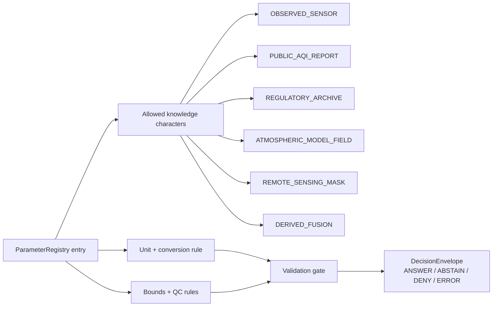

<!-- [KFM_META_BLOCK_V2]
doc_id: kfm://doc/TODO-ASSIGN-UUID
title: Atmosphere / Air Parameter Registry
type: standard
version: v1
status: draft
owners: TODO-VERIFY: atmosphere-air domain steward, data steward, policy steward
created: TODO-VERIFY-YYYY-MM-DD
updated: 2026-05-06
policy_label: TODO-VERIFY-public-or-restricted
related: [./ARCHITECTURE.md, ./KNOWLEDGE_CHARACTER.md, ./UNIT_CONVERSIONS.md, ../README.md, <TODO-VERIFY-schema-home>, <TODO-VERIFY-data-parameter-registry-home>]
tags: [kfm, atmosphere-air, parameters, units, evidence, validation, governed-domain]
notes: [Revises an existing current-main file at docs/domains/atmosphere_air/architecture/PARAMETER_REGISTRY.md; UUID, owners, created date, policy label, schema home, and data-registry home still need repo-backed review.]
[/KFM_META_BLOCK_V2] -->

<a id="top"></a>

# Atmosphere / Air Parameter Registry

Governed parameter identity, unit discipline, bounds, caveats, and knowledge-character rules for the Atmosphere / Air lane.


> [!IMPORTANT]
> Atmospheric parameters are not just display labels. In KFM, a parameter definition controls how values are normalized, bounded, interpreted, tested, cited, mapped, and either promoted or denied.

## Quick navigation

[Scope](#scope) · [Repo fit](#repo-fit) · [Registry contract](#registry-contract) · [Seed parameters](#seed-parameters) · [Unit discipline](#unit-discipline) · [Knowledge-character constraints](#knowledge-character-constraints) · [Bounds and QC](#bounds-and-qc) · [Validation gates](#validation-gates) · [Examples](#examples) · [Open verification](#open-verification)

---

## Scope

This file defines the **human-readable registry contract** for Atmosphere / Air parameters.

It governs how the lane names, normalizes, validates, and explains values such as particulate concentration, gas concentration, meteorological context, optical/aerosol context, advisory indexes, model variables, and derived fusion products.

### This registry is responsible for

| Responsibility | Registry rule |
|---|---|
| Parameter identity | Every parameter has a stable `parameter_id` and aliases are recorded instead of silently renamed. |
| Unit discipline | Raw value/unit and normalized value/unit are both preserved. |
| Conversion traceability | Every conversion points to a deterministic rule and version. |
| Bounds | Plausible, warning, and denial bounds are explicit and testable. |
| Interpretation | Caveats travel with the parameter, not only with the source. |
| Knowledge character | Allowed object types are declared before mapping, API response, Evidence Drawer display, or Focus Mode use. |
| Evidence closure | Consequential parameter values require source payload hashes and EvidenceRefs. |

### This registry is not responsible for

- source activation or rights approval;
- live connector behavior;
- station identity resolution;
- release manifests or promotion decisions;
- raw source payload storage;
- public tile generation;
- AI interpretation logic;
- emergency alerting.

Those responsibilities stay in the source registry, lifecycle records, policy gates, proof objects, governed API, MapLibre layer descriptors, and release controls.

<p align="right"><a href="#top">Back to top ↑</a></p>

---

## Repo fit

**CONFIRMED path:** `docs/domains/atmosphere_air/architecture/PARAMETER_REGISTRY.md`

| Neighbor | Relationship |
|---|---|
| [`./ARCHITECTURE.md`](./ARCHITECTURE.md) | Defines the lane trust path and public-delivery boundary. |
| [`./KNOWLEDGE_CHARACTER.md`](./KNOWLEDGE_CHARACTER.md) | Defines the epistemic category each parameter may support. |
| [`./UNIT_CONVERSIONS.md`](./UNIT_CONVERSIONS.md) | Defines raw/normalized unit preservation and deterministic conversion expectations. |
| [`../README.md`](../README.md) | Domain landing page and scope boundary for Atmosphere / Air. |
| `<TODO-VERIFY-schema-home>` | Machine-checkable parameter and observation schemas. |
| `<TODO-VERIFY-data-parameter-registry-home>` | Future machine-readable parameter registry, likely under a data registry responsibility root. |

> [!NOTE]
> This Markdown file is the architecture-facing registry contract. If a machine-readable `parameters.yaml` or JSON registry exists or is later added, it should conform to this document rather than redefining parameter semantics in a second authority home.

---

## Registry contract

Every registry entry must include the fields below before it can support normalized records, map layers, Evidence Drawer payloads, Focus Mode answers, or public release.

| Field | Required | Meaning |
|---|---:|---|
| `parameter_id` | Yes | Stable KFM identifier, lower snake case. |
| `display_name` | Yes | Human-readable label for UI and review surfaces. |
| `parameter_family` | Yes | Compact family such as `particulate`, `gas`, `meteorology`, `optical`, `index`, `model`, `fusion`, or `site_context`. |
| `aliases` | Yes | Source-native names, spellings, codes, or legacy identifiers. Empty list allowed. |
| `raw_unit_set` | Yes | Units accepted from source payloads. |
| `normalized_unit` | Yes | Canonical unit used after normalization. |
| `conversion_rule_ref` | Yes | Deterministic conversion rule, version, and assumptions. |
| `bounds` | Yes | Plausible, warning, and denial bounds for normalized values. |
| `precision_policy` | Yes | Rounding and significant-figure handling. |
| `allowed_knowledge_characters` | Yes | Knowledge characters allowed to carry or derive this parameter. |
| `forbidden_contexts` | Yes | Category-collapse cases that must be denied. |
| `evidence_requirements` | Yes | Required EvidenceRefs, source payload hash, transform hash, and caveats. |
| `public_release_default` | Yes | Default release posture before source rights and policy review. |
| `caveats` | Yes | Interpretation notes required in reviewer-facing or public-facing contexts. |
| `review_status` | Yes | `draft`, `candidate`, `approved`, `deprecated`, or `blocked`. |

### Parameter identity rule

`parameter_id` values should be stable, compact, and source-neutral.

```text
Good:    pm25_mass_concentration
Good:    ozone_mixing_ratio
Good:    air_quality_index
Avoid:   epa_pm25
Avoid:   purpleair_pm25
Avoid:   smoke_layer_value
```

Source-specific names belong in `aliases` or source descriptors, not in canonical parameter IDs.

---

## Seed parameters

The table below is a **PROPOSED seed registry**, not proof that all machine schemas, fixtures, validators, or source mappings already exist.

### Concentration and gas parameters

| `parameter_id` | Family | Normalized unit | Allowed knowledge characters | Release posture |
|---|---|---:|---|---|
| `pm25_mass_concentration` | particulate | `µg/m3` | `OBSERVED_SENSOR`, `REGULATORY_ARCHIVE`, `LOW_COST_SENSOR`, `DERIVED_FUSION` | restricted until rights, correction, and evidence closure pass |
| `pm10_mass_concentration` | particulate | `µg/m3` | `OBSERVED_SENSOR`, `REGULATORY_ARCHIVE`, `LOW_COST_SENSOR`, `DERIVED_FUSION` | restricted until rights and evidence closure pass |
| `ozone_mixing_ratio` | gas | `ppb` | `OBSERVED_SENSOR`, `REGULATORY_ARCHIVE`, `ATMOSPHERIC_MODEL_FIELD`, `DERIVED_FUSION` | restricted until source role is verified |
| `nitrogen_dioxide_mixing_ratio` | gas | `ppb` | `OBSERVED_SENSOR`, `REGULATORY_ARCHIVE`, `ATMOSPHERIC_MODEL_FIELD`, `DERIVED_FUSION` | restricted until source role is verified |
| `sulfur_dioxide_mixing_ratio` | gas | `ppb` | `OBSERVED_SENSOR`, `REGULATORY_ARCHIVE`, `ATMOSPHERIC_MODEL_FIELD`, `DERIVED_FUSION` | restricted until source role is verified |
| `carbon_monoxide_mixing_ratio` | gas | `ppm` | `OBSERVED_SENSOR`, `REGULATORY_ARCHIVE`, `ATMOSPHERIC_MODEL_FIELD`, `DERIVED_FUSION` | restricted until source role is verified |

### Meteorological and transport context

| `parameter_id` | Family | Normalized unit | Allowed knowledge characters | Release posture |
|---|---|---:|---|---|
| `air_temperature` | meteorology | `degC` | `OBSERVED_SENSOR`, `METEOROLOGICAL_CONTEXT`, `ATMOSPHERIC_MODEL_FIELD`, `DERIVED_FUSION` | candidate |
| `relative_humidity` | meteorology | `%` | `OBSERVED_SENSOR`, `METEOROLOGICAL_CONTEXT`, `ATMOSPHERIC_MODEL_FIELD`, `DERIVED_FUSION` | candidate |
| `wind_speed` | meteorology | `m/s` | `OBSERVED_SENSOR`, `METEOROLOGICAL_CONTEXT`, `ATMOSPHERIC_MODEL_FIELD`, `DERIVED_FUSION` | candidate |
| `wind_direction` | meteorology | `degrees_from_north` | `OBSERVED_SENSOR`, `METEOROLOGICAL_CONTEXT`, `ATMOSPHERIC_MODEL_FIELD`, `DERIVED_FUSION` | candidate |
| `barometric_pressure` | meteorology | `hPa` | `OBSERVED_SENSOR`, `METEOROLOGICAL_CONTEXT`, `ATMOSPHERIC_MODEL_FIELD`, `DERIVED_FUSION` | candidate |
| `visibility_distance` | optical | `km` | `OBSERVED_SENSOR`, `VISIBILITY_AND_AEROSOL_CONTEXT`, `ATMOSPHERIC_MODEL_FIELD`, `DERIVED_FUSION` | candidate with caveats |

### Index, mask, model, and derived-support parameters

| `parameter_id` | Family | Normalized unit | Allowed knowledge characters | Release posture |
|---|---|---:|---|---|
| `air_quality_index` | index | `index_value` | `PUBLIC_AQI_REPORT`, `ALERT_AND_ADVISORY_CONTEXT` | report-only; never concentration |
| `nowcast_air_quality_index` | index | `index_value` | `PUBLIC_AQI_REPORT`, `ALERT_AND_ADVISORY_CONTEXT` | report-only; never concentration |
| `aerosol_optical_depth` | optical | `unitless` | `REMOTE_SENSING_MASK`, `VISIBILITY_AND_AEROSOL_CONTEXT`, `ATMOSPHERIC_MODEL_FIELD`, `DERIVED_FUSION` | context only unless transformed with assumptions |
| `smoke_plume_class` | mask | `class_code` | `REMOTE_SENSING_MASK`, `FIRE_AND_EMISSIONS_CONTEXT` | classification only |
| `fire_hotspot_confidence` | fire_context | `confidence_code` | `FIRE_AND_EMISSIONS_CONTEXT`, `REMOTE_SENSING_MASK` | context only |
| `emissions_rate_estimate` | emissions_context | `kg/s` | `FIRE_AND_EMISSIONS_CONTEXT`, `ATMOSPHERIC_MODEL_FIELD`, `DERIVED_FUSION` | model/context only |
| `baseline_anomaly_value` | baseline | `parameter_specific` | `CLIMATE_ANOMALY_CONTEXT`, `BASELINE_AND_TEMPORAL_SUPPORT`, `DERIVED_FUSION` | context only; not an alert |
| `station_health_status` | site_context | `status_code` | `NETWORK_AND_SITE_CONTEXT` | metadata only |

> [!WARNING]
> `air_quality_index`, `nowcast_air_quality_index`, `aerosol_optical_depth`, `smoke_plume_class`, and `fire_hotspot_confidence` are not surface PM2.5 concentration parameters. Any claim that treats them as concentration must be denied unless a governed transformation explicitly records the model, assumptions, source EvidenceRefs, and uncertainty.

<p align="right"><a href="#top">Back to top ↑</a></p>

---

## Unit discipline

KFM preserves both source-native values and normalized values.

```yaml
parameter_id: pm25_mass_concentration
raw_value: 17.2
raw_unit: "µg/m3"
normalized_value: 17.2
normalized_unit: "µg/m3"
conversion_rule_ref: "kfm://conversion/atmosphere/pm-mass/v1"
source_payload_sha256: "<required>"
transform_spec_hash: "<required>"
evidence_refs:
  - "kfm://evidence-ref/<required>"
```

### Required unit rules

| Rule | Requirement |
|---|---|
| Raw retention | Never drop `raw_value` or `raw_unit` after normalization. |
| Canonical normalization | `normalized_value` and `normalized_unit` must be produced by a named conversion rule. |
| Conversion versioning | Conversion rules must be versioned and referenced by records and tests. |
| Precision | Rounding must be explicit and consistent by parameter. |
| Invalid units | Unknown or incompatible units fail closed. |
| Index units | AQI-like indexes use `index_value`, not concentration units. |
| Unitless support | AOD and classes remain unitless/class-coded unless transformed through a governed model. |

### Conversion classes

| Class | Examples | Special handling |
|---|---|---|
| Direct unit conversion | temperature, wind speed, pressure, visibility | Deterministic conversion and precision policy required. |
| Concentration normalization | particulate and gases | Preserve assumptions; do not mix mass concentration and mixing ratio without an explicit method. |
| Class or code mapping | smoke plume, station health, confidence | Preserve original code and mapped label. |
| Index mapping | AQI, NowCast | Keep index/report semantics; no concentration conversion. |
| Model-derived transformation | AOD-to-PM, smoke-to-exposure, anomaly-to-context | Requires model card, assumptions, uncertainty, and explicit evidence chain. |

---

## Knowledge-character constraints

Parameter records must not be interpreted without a compatible knowledge character.



| Constraint | Required behavior |
|---|---|
| Observed values | Must have site/instrument context, source time, retrieval time, raw payload hash, and EvidenceRefs. |
| Regulatory archive values | Must carry archive temporal caveats and must not be presented as live state by default. |
| Low-cost sensor values | Must carry correction method, caveats, limitations, confidence, and rights status. |
| Model fields | Must be labeled modeled and expose model card or model metadata. |
| Remote-sensing masks | Must be labeled classification/support and not exposure measurement. |
| Fusion outputs | Must expose input EvidenceRefs and method; never replace canonical inputs. |
| Advisory/index values | Must be labeled public report/advisory and not raw concentration. |

---

## Bounds and QC

Bounds are policy-sensitive. They should be conservative until verified against source-specific documentation and fixture behavior.

### Bound types

| Bound type | Meaning | Failure posture |
|---|---|---|
| `plausible_min` / `plausible_max` | Expected physical or operational range. | Warning or review depending on parameter. |
| `warn_min` / `warn_max` | Suspicious but not automatically invalid. | Keep in WORK or require review. |
| `deny_min` / `deny_max` | Cannot be accepted without correction or source clarification. | QUARANTINE. |
| `freshness_window` | Max age before public state becomes stale. | Mark `STALE` or deny live-state claim. |
| `cadence_expectation` | Expected reporting cadence. | Emit station/network health event if violated. |
| `source_specific_override` | Source-approved exception. | Requires EvidenceRef and review note. |

### QC checks

| Check | Applies to | Required output |
|---|---|---|
| Unit compatibility | all numeric parameters | pass / deny with reason code |
| Bounds | all normalized values | pass / warning / quarantine |
| Duplicate observation | station-time-parameter records | conflict or de-duplication receipt |
| Temporal ordering | observed, source, retrieval, processed, release time | validation report |
| Freshness | live or near-live claims | stale status or denial |
| Station health | site/network context | health event or caveat |
| Cross-source conflict | multi-source displays and fusion | conflict record |
| Knowledge-character compatibility | all records | finite DecisionEnvelope outcome |

---

## Validation gates

A parameter can support public or semi-public KFM claims only after the gates below pass.

| Gate | Required evidence | Fail-closed outcome |
|---|---|---|
| Registry completeness | Required fields present. | `ATMOS_PARAMETER_INCOMPLETE` |
| Unit validity | Raw unit is in `raw_unit_set`; normalized unit matches registry. | `ATMOS_INVALID_UNIT` |
| Conversion traceability | Conversion rule ref and transform hash present. | `ATMOS_MISSING_TRANSFORM_HASH` |
| Raw traceability | Source payload hash present. | `ATMOS_MISSING_SOURCE_PAYLOAD_HASH` |
| Evidence closure | EvidenceRefs resolve to EvidenceBundle. | `ATMOS_MISSING_EVIDENCE_REFS` |
| Knowledge-character compatibility | Record character is allowed for parameter. | `ATMOS_PARAMETER_CHARACTER_MISMATCH` |
| AQI discipline | Index is not treated as concentration. | `ATMOS_AQI_AS_CONCENTRATION` |
| AOD discipline | AOD is not treated as PM2.5 without model assumptions. | `ATMOS_AOD_AS_PM25` |
| Model discipline | Model field is not labeled observed. | `ATMOS_MODEL_AS_OBSERVED` |
| Rights and release | Source rights and public release state are approved. | `ATMOS_UNKNOWN_RIGHTS_PUBLIC` or `ATMOS_PUBLIC_RELEASE_FALSE` |

### Minimum denial reason codes

```text
ATMOS_PARAMETER_INCOMPLETE
ATMOS_PARAMETER_ID_COLLISION
ATMOS_INVALID_UNIT
ATMOS_UNSUPPORTED_CONVERSION
ATMOS_BOUNDS_DENY
ATMOS_MISSING_SOURCE_PAYLOAD_HASH
ATMOS_MISSING_TRANSFORM_HASH
ATMOS_MISSING_EVIDENCE_REFS
ATMOS_PARAMETER_CHARACTER_MISMATCH
ATMOS_AQI_AS_CONCENTRATION
ATMOS_AOD_AS_PM25
ATMOS_MODEL_AS_OBSERVED
ATMOS_LOW_COST_NO_CORRECTION
ATMOS_UNKNOWN_RIGHTS_PUBLIC
ATMOS_PUBLIC_RELEASE_FALSE
```

<p align="right"><a href="#top">Back to top ↑</a></p>

---

## Examples

### Example registry entry

```yaml
parameter_id: pm25_mass_concentration
display_name: "PM2.5 mass concentration"
parameter_family: particulate
aliases:
  - "PM2.5"
  - "pm25"
  - "fine particulate matter"
raw_unit_set:
  - "µg/m3"
  - "ug/m3"
normalized_unit: "µg/m3"
conversion_rule_ref: "kfm://conversion/atmosphere/pm-mass/v1"
bounds:
  plausible_min: 0
  plausible_max: TODO-VERIFY
  warn_min: 0
  warn_max: TODO-VERIFY
  deny_min: 0
  deny_max: TODO-VERIFY
precision_policy:
  normalized_decimals: 1
  rounding: "half_even"
allowed_knowledge_characters:
  - OBSERVED_SENSOR
  - REGULATORY_ARCHIVE
  - LOW_COST_SENSOR
  - DERIVED_FUSION
forbidden_contexts:
  - "PUBLIC_AQI_REPORT as concentration"
  - "REMOTE_SENSING_MASK as exposure measurement"
evidence_requirements:
  source_payload_sha256: required
  transform_spec_hash: required
  evidence_refs: required
  caveats: required_for_low_cost_sensor
public_release_default: restricted_until_policy_review
review_status: draft
caveats:
  - "Low-cost sensor records require correction method and limitations."
  - "Fusion outputs must expose input EvidenceRefs."
```

### Example denied category collapse

```yaml
claim:
  parameter_id: aerosol_optical_depth
  claimed_as: pm25_mass_concentration
  knowledge_character: REMOTE_SENSING_MASK

decision:
  outcome: DENY
  reason_code: ATMOS_AOD_AS_PM25
  message: "AOD cannot be presented as PM2.5 concentration without a governed model, assumptions, uncertainty, and EvidenceRefs."
```

### Example stale live-state claim

```yaml
claim:
  parameter_id: ozone_mixing_ratio
  knowledge_character: OBSERVED_SENSOR
  observed_time: "2026-05-06T10:00:00Z"
  retrieval_time: "2026-05-06T10:05:00Z"
  requested_claim: "current ozone conditions"

decision:
  outcome: ABSTAIN
  reason_code: ATMOS_FRESHNESS_WINDOW_EXCEEDED
  message: "The record may support historical context, but it is outside the verified freshness window for a current-state claim."
```

---

## Review checklist

- [ ] `parameter_id` is stable and source-neutral.
- [ ] Source-native aliases are recorded.
- [ ] Raw and normalized units are both preserved.
- [ ] Conversion rule is deterministic, versioned, and test-covered.
- [ ] Bounds are present and conservative where source-specific review is missing.
- [ ] AQI, AOD, smoke mask, advisory, model, and fusion semantics remain distinct.
- [ ] Low-cost sensor parameters require correction/caveat support.
- [ ] EvidenceRefs, source payload hash, and transform hash are required for consequential records.
- [ ] Public release defaults to blocked or restricted until rights and policy gates pass.
- [ ] Evidence Drawer payload can explain the parameter, source role, unit conversion, caveats, and review state.
- [ ] Focus Mode can cite or abstain; it cannot infer missing parameter semantics.

---

## Open verification

| Item | Status | Review question |
|---|---:|---|
| UUID | TODO | Assign stable `doc_id`. |
| Owners | TODO | Confirm steward ownership for atmosphere-air docs and parameter semantics. |
| Created date | TODO | Verify from git history or governance record. |
| Policy label | TODO | Decide public/restricted posture for this registry. |
| Machine-readable registry home | NEEDS VERIFICATION | Confirm whether `data/registry/atmosphere/parameters.yaml` or another path is canonical. |
| Schema home | NEEDS VERIFICATION | Confirm executable schema location and avoid duplicate authority. |
| Parameter bounds | NEEDS VERIFICATION | Replace `TODO-VERIFY` bounds through source-specific review and fixtures. |
| Conversion rule IDs | NEEDS VERIFICATION | Create or link deterministic conversion rules. |
| Test runner | NEEDS VERIFICATION | Bind checklist to repo-native tests and CI. |
| Existing source descriptors | NEEDS VERIFICATION | Align parameter aliases with source descriptors after source registry review. |

---

## Appendix: registry design rules

<details>
<summary>Design rules for future machine-readable parameter registries</summary>

1. A machine registry should be generated or validated from this contract, not independently maintained with incompatible semantics.
2. Every `parameter_id` should be unique across the atmosphere registry.
3. Every alias should point to exactly one canonical parameter unless the source descriptor provides a disambiguation rule.
4. Every conversion should be deterministic and stable across repeated runs.
5. Every denied category collapse should have a fixture.
6. Every public-facing parameter explanation should include caveats and EvidenceRefs.
7. Every deprecation should preserve an alias, successor, migration note, and rollback target.
8. Every fusion parameter should list inputs, method, uncertainty, and EvidenceRefs.
9. Every model parameter should identify model family, variable dictionary, time basis, and uncertainty.
10. Every advisory/index parameter should remain a report/index object, not a concentration or observation.

</details>

<p align="right"><a href="#top">Back to top ↑</a></p>
