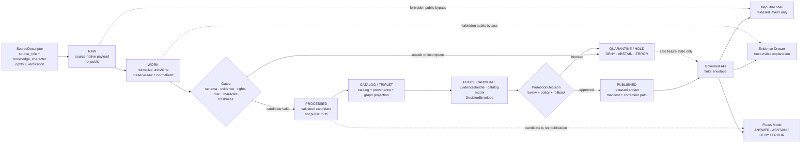

<!-- [KFM_META_BLOCK_V2]
doc_id: kfm://doc/TODO-ASSIGN-UUID
title: Atmosphere / Air Architecture Directory
type: standard
version: v1
status: draft
owners: TODO-VERIFY: atmosphere-air domain steward, architecture steward, data steward, policy steward, map-shell steward
created: TODO-VERIFY-YYYY-MM-DD
updated: 2026-05-06
policy_label: TODO-VERIFY-public-or-restricted
related: [../README.md, ./ARCHITECTURE.md, ./API_CONTRACTS.md, ./FOCUS_DRAWER_PAYLOADS.md, ./MAP_LAYERS.md, ./KNOWLEDGE_CHARACTER.md, ./PARAMETER_REGISTRY.md, ./UNIT_CONVERSIONS.md, ../../../adr/ADR-0312-atmosphere-air-source-role-boundaries.md, ../../../adr/ADR-0431-atmosphere-air-knowledge-character-boundary.md, ../../../adr/ADR-0418-atmosphere-air-schema-slug-compatibility.md, ../../../adr/ADR-0001-schema-home.md, ../../../../connectors/pipelines/air/README.md, ../../../../data/processed/air/README.md, ../../../../data/receipts/air/README.md]
tags: [kfm, atmosphere-air, architecture, readme, evidence, map-first, time-aware, governed-domain]
notes: [Target path exists in the GitHub repository but was effectively empty at revision time; local workspace was not a mounted checkout; runtime binding, owners, created date, policy label, CI status, schema inventory, source rights, and release maturity remain NEEDS VERIFICATION.]
[/KFM_META_BLOCK_V2] -->

<a id="top"></a>

# Atmosphere / Air Architecture Directory

Navigation and review map for Atmosphere / Air architecture docs, keeping air evidence, map rendering, API contracts, Drawer/Focus payloads, source roles, knowledge characters, and release gates in their proper homes.

<p align="center">
  
  
  
  
  
</p>

**Status:** draft  
**Owners:** TODO-VERIFY: atmosphere-air domain steward, architecture steward, data steward, policy steward, map-shell steward  
**Target path:** `docs/domains/atmosphere_air/architecture/README.md`  
**Repo posture:** CONFIRMED path exists; this revision turns the prior blank landing file into a governed directory README.  
**Publication posture:** documentation only; this file does not authorize live source fetching, public release, route activation, layer publication, or Focus Mode answers.

**Quick jumps:**  
[Scope](#scope) · [Repo fit](#repo-fit) · [Accepted inputs](#accepted-inputs) · [Exclusions](#exclusions) · [Architecture directory map](#architecture-directory-map) · [Responsibility boundaries](#responsibility-boundaries) · [Governed flow](#governed-flow) · [Knowledge-character guardrails](#knowledge-character-guardrails) · [Validation gates](#validation-gates) · [Definition of done](#definition-of-done) · [Open verification](#open-verification)

> [!IMPORTANT]
> This directory is a **control surface**, not a dumping ground. Atmosphere / Air architecture must preserve the distinction between observations, AQI reports, regulatory archives, low-cost sensor candidates, model fields, smoke/AOD masks, advisories, baseline context, and fusion products. If a map, API payload, Drawer panel, or Focus answer hides those distinctions, it weakens KFM’s trust membrane.

---

## Scope

This README orients maintainers to the architecture files under:

```text
docs/domains/atmosphere_air/architecture/
```

It explains which companion document owns each architectural seam and when maintainers must update adjacent schemas, contracts, policy, fixtures, validators, registries, runbooks, release manifests, or rollback records.

### This directory covers

| Area | What belongs here | Required posture |
|---|---|---|
| Domain architecture | Trust flow, source-role boundaries, lifecycle, bounded contexts, public-surface rules. | Evidence-first, map-first, time-aware, fail-closed. |
| API contracts | Finite response envelopes, request/response families, denial codes, Focus handoff, release-candidate handoff. | Route names remain NEEDS VERIFICATION unless repo code proves them. |
| Map layers | Layer descriptor rules, renderer boundary, knowledge-character display, freshness and release state. | MapLibre renders downstream artifacts; it is not truth or policy authority. |
| Evidence Drawer | Trust-visible payload requirements for selected claims, features, layers, and release candidates. | Must expose evidence, source role, knowledge character, rights, freshness, review, correction, and rollback state. |
| Focus Mode | Bounded synthesis over admissible EvidenceBundle-backed context. | `ANSWER`, `ABSTAIN`, `DENY`, or `ERROR`; cite-or-abstain. |
| Knowledge characters | Atmosphere-specific epistemic labels and anti-collapse rules. | Required before interpretation, promotion, rendering, or AI synthesis. |
| Parameters and units | Raw/normalized unit discipline, AQI/AOD/concentration separation, parameter caveats. | Preserve raw values and normalized values; do not silently convert meaning. |

### This directory does not prove

- that any live connector is enabled;
- that source rights or terms are verified;
- that `schemas/contracts/v1/air/` or `schemas/contracts/v1/atmosphere/` is final authority;
- that MapLibre, Evidence Drawer, Focus Mode, API routes, CI, branch protections, dashboards, or runtime logs are operating;
- that candidate `air` artifacts are public truth;
- that no-network fixtures are release proof.

<p align="right"><a href="#top">Back to top ↑</a></p>

---

## Repo fit

This file belongs in `docs/` because it is human-facing architecture documentation. It links to implementation, schema, policy, lifecycle, and proof surfaces without becoming those surfaces.

| Relationship | Path | Status | Why it matters |
|---|---|---:|---|
| Domain landing page | [`../README.md`](../README.md) | CONFIRMED | Defines whole-lane scope, accepted inputs, exclusions, knowledge characters, governed flow, and denial posture. |
| Main architecture | [`./ARCHITECTURE.md`](./ARCHITECTURE.md) | CONFIRMED | Owns the end-to-end trust path, bounded contexts, lifecycle, and non-negotiables. |
| API contracts | [`./API_CONTRACTS.md`](./API_CONTRACTS.md) | CONFIRMED | Owns finite envelopes, request/response families, reason codes, and release-candidate handoff. |
| Focus + Drawer payloads | [`./FOCUS_DRAWER_PAYLOADS.md`](./FOCUS_DRAWER_PAYLOADS.md) | CONFIRMED | Owns Evidence Drawer and Focus payload requirements. |
| Map layer rules | [`./MAP_LAYERS.md`](./MAP_LAYERS.md) | CONFIRMED | Owns layer descriptor, renderer, trust badge, and map-interaction rules. |
| Knowledge-character guide | [`./KNOWLEDGE_CHARACTER.md`](./KNOWLEDGE_CHARACTER.md) | CONFIRMED | Owns atmosphere-specific anti-collapse taxonomy. |
| Parameter registry guide | [`./PARAMETER_REGISTRY.md`](./PARAMETER_REGISTRY.md) | CONFIRMED | Owns parameter names, parameter families, units, and caveats. |
| Unit conversion guide | [`./UNIT_CONVERSIONS.md`](./UNIT_CONVERSIONS.md) | CONFIRMED | Owns raw/normalized unit discipline and conversion assumptions. |
| Source-role ADR | [`../../../adr/ADR-0312-atmosphere-air-source-role-boundaries.md`](../../../adr/ADR-0312-atmosphere-air-source-role-boundaries.md) | CONFIRMED / draft | Governs source-role and knowledge-character separation. |
| Knowledge-character ADR | [`../../../adr/ADR-0431-atmosphere-air-knowledge-character-boundary.md`](../../../adr/ADR-0431-atmosphere-air-knowledge-character-boundary.md) | CONFIRMED / draft | Carries release, UI, Drawer, Focus, and lifecycle implications for knowledge characters. |
| Slug compatibility ADR | [`../../../adr/ADR-0418-atmosphere-air-schema-slug-compatibility.md`](../../../adr/ADR-0418-atmosphere-air-schema-slug-compatibility.md) | CONFIRMED / proposed | Keeps `atmosphere_air`, `air`, and `atmosphere` naming boundaries explicit. |
| Schema-home ADR | [`../../../adr/ADR-0001-schema-home.md`](../../../adr/ADR-0001-schema-home.md) | CONFIRMED / proposed | Resolves or constrains machine-schema authority. |
| No-network air connector | [`../../../../connectors/pipelines/air/README.md`](../../../../connectors/pipelines/air/README.md) | CONFIRMED | Produces candidates and receipts only; it does not publish. |
| Processed air lane | [`../../../../data/processed/air/README.md`](../../../../data/processed/air/README.md) | CONFIRMED | Holds processed candidates; not public truth by itself. |
| Air receipts lane | [`../../../../data/receipts/air/README.md`](../../../../data/receipts/air/README.md) | CONFIRMED | Holds process memory; receipts are not proof packs or release manifests. |

### Naming posture

| Name | Current role | Working rule |
|---|---|---|
| `atmosphere_air` | CONFIRMED human-facing documentation lane. | Use for current docs paths unless a successor ADR migrates the lane. |
| `air` | CONFIRMED no-network implementation/tooling slice. | Treat as candidate/receipt/testing slice, not whole-domain proof. |
| `atmosphere` | PROPOSED whole-domain schema/normalization concept. | Do not treat as canonical machine schema family until ADR, inventory, fixtures, validators, and tests prove it. |

> [!WARNING]
> Do not silently rename, collapse, or alias `atmosphere_air`, `air`, and `atmosphere`. Compatibility must be ADR-backed, fixture-tested, validator-covered, documented in migration notes, and reversible.

<p align="right"><a href="#top">Back to top ↑</a></p>

---

## Accepted inputs

Material belongs in this architecture directory when it helps maintainers understand or review the Atmosphere / Air trust boundary.

| Input | Belongs here when | Required co-change |
|---|---|---|
| Architecture updates | They change lifecycle, source-role, evidence, policy, release, UI, or AI boundaries. | Update `ARCHITECTURE.md`, this README, and affected ADRs. |
| API contract updates | They change request shape, response envelope, denial codes, or runtime outcome semantics. | Update `API_CONTRACTS.md`, schemas, fixtures, validators, tests, and API docs once routes exist. |
| Map-layer updates | They change layer descriptor requirements, style meaning, MapLibre interaction, trust badges, or released artifact expectations. | Update `MAP_LAYERS.md`, layer registry, Drawer payloads, and release/correction docs. |
| Drawer / Focus updates | They change trust-visible fields, Focus evidence pool, finite outcomes, citation validation, or AI receipts. | Update `FOCUS_DRAWER_PAYLOADS.md`, runtime contracts, and AI/governed API tests. |
| Knowledge-character updates | They add or modify epistemic categories such as `OBSERVED_SENSOR`, `PUBLIC_AQI_REPORT`, or `REMOTE_SENSING_MASK`. | Update `KNOWLEDGE_CHARACTER.md`, ADR-0431, source registry, policy denials, fixtures, and Drawer/Focus docs. |
| Parameter or unit updates | They add variables, units, conversion assumptions, or parameter caveats. | Update `PARAMETER_REGISTRY.md`, `UNIT_CONVERSIONS.md`, schema fixtures, and unit tests. |
| No-network slice evidence | It documents current candidate/receipt behavior without claiming publication. | Link to connector, processed, receipt, validator, and publisher docs; keep release status visible. |
| Release or rollback notes | They change public-surface readiness, release state, correction state, or rollback target expectations. | Update release manifests, proof objects, correction docs, and rollback docs where repo convention confirms homes. |

<p align="right"><a href="#top">Back to top ↑</a></p>

---

## Exclusions

Keep these out of `docs/domains/atmosphere_air/architecture/` unless they are linked as references from the correct responsibility root.

| Keep out | Correct home | Reason |
|---|---|---|
| Machine schema bodies | `schemas/contracts/v1/...` or ADR-approved schema home | Architecture docs explain shape pressure; schemas enforce shape. |
| Human-readable object contracts | `contracts/...` or repo-approved contract home | Contracts define meaning and invariants. |
| Policy-as-code | `policy/...` | Policy decides admissibility, release, deny/restrict/abstain behavior. |
| Fixtures and golden cases | `fixtures/...`, `tests/...`, or repo-approved fixture home | Tests and fixtures prove claims; docs should link to them. |
| Connector implementation | `connectors/pipelines/air/` or source-specific connector homes | Connectors acquire or prepare candidates; architecture docs do not run them. |
| Normalization pipeline logic | `pipelines/normalize/domains/atmosphere/` or repo-approved pipeline home | Pipelines transform candidates; docs explain boundaries. |
| Raw, work, quarantine, processed, receipts, proofs, published artifacts | `data/...` responsibility roots | Lifecycle data and proof objects must stay auditable and stage-separated. |
| Secrets or private endpoint details | secure runtime config outside public docs | Public docs must not carry credentials or sensitive operational internals. |
| Public route assertions without repo evidence | governed API docs after source inspection | Do not invent route names or runtime behavior from doctrine. |
| Emergency instructions | official alerting systems outside KFM | KFM may display source-backed advisory context; it is not a life-safety authority. |

<p align="right"><a href="#top">Back to top ↑</a></p>

---

## Architecture directory map

Use this section as the directory’s table of contents and ownership map.

| File | Owns | Accepted changes | Must not own |
|---|---|---|---|
| [`ARCHITECTURE.md`](./ARCHITECTURE.md) | Whole-lane trust path, lifecycle, source-role boundaries, bounded contexts, public-surface rules. | Architecture decisions that affect the lane end to end. | Detailed API schemas, Rego bodies, fixture data, or runtime code. |
| [`API_CONTRACTS.md`](./API_CONTRACTS.md) | Governed API envelope expectations and finite outcomes. | Request/response families, reason codes, release-candidate handoff, Focus request/response pressure. | Unverified live route claims. |
| [`FOCUS_DRAWER_PAYLOADS.md`](./FOCUS_DRAWER_PAYLOADS.md) | Evidence Drawer and Focus Mode payload minimums. | UI trust fields, Focus citation requirements, AI receipt expectations, negative state display. | Free-form AI behavior or direct model runtime access. |
| [`MAP_LAYERS.md`](./MAP_LAYERS.md) | Layer descriptors, renderer boundary, trust badges, click/hover/export rules. | Layer state vocabulary, delivery-class guidance, map interaction safety. | Public truth authority or policy law. |
| [`KNOWLEDGE_CHARACTER.md`](./KNOWLEDGE_CHARACTER.md) | Epistemic taxonomy and anti-collapse rules. | New knowledge characters, denial codes, category examples. | Source rights decisions or schema-home authority. |
| [`PARAMETER_REGISTRY.md`](./PARAMETER_REGISTRY.md) | Parameter taxonomy and parameter metadata guidance. | New parameters, parameter aliases, expected units, caveats. | Source-specific raw data or live source activation. |
| [`UNIT_CONVERSIONS.md`](./UNIT_CONVERSIONS.md) | Raw and normalized unit discipline. | Conversion assumptions, invalid conversions, caveats, tests. | Policy authorization or unsupported scientific transformation. |

### Directory rhythm

1. Start with a bounded architecture decision.
2. Update the specific companion file that owns the seam.
3. Link the schema, policy, validator, fixture, registry, or release surface that proves the behavior.
4. Record open verification when proof is not yet available.
5. Keep negative states visible.

> [!TIP]
> Link first, duplicate last. If a rule already lives in a sibling file, point to it and only restate the minimum needed for navigation.

<p align="right"><a href="#top">Back to top ↑</a></p>

---

## Responsibility boundaries

The architecture directory is part of the `docs/` control plane. It must stay aligned with the other roots without replacing them.

| Root | Truth role | Atmosphere / Air example | Update trigger |
|---|---|---|---|
| `docs/` | Human-facing doctrine, architecture, ADRs, runbooks, review guidance. | This directory and its companion files. | Any material change to source role, evidence flow, UI trust state, or release posture. |
| `contracts/` | Human-readable object meaning and invariants. | SourceDescriptor, EvidenceBundle, DecisionEnvelope, ReleaseManifest semantics. | New object meaning or invariant. |
| `schemas/` | Machine-checkable shape. | `air` or `atmosphere` schema families after ADR verification. | New/changed fields, required properties, enums, or compatibility aliases. |
| `policy/` | Allow/deny/restrict/abstain/release decisions. | Atmosphere denials for missing evidence, unknown rights, AQI-as-concentration, AOD-as-PM2.5. | New public-surface risk, sensitivity, rights, or source-role rule. |
| `tests/` / `fixtures/` | Proof that docs, contracts, schemas, and policy behave as claimed. | No-network valid/invalid fixtures; denial tests; backward compatibility fixtures. | Any claim that should be enforceable. |
| `connectors/` | Source-facing acquisition and candidate production. | No-network `air` connector candidate and receipt flow. | New source family, source refresh, cadence, rights, or endpoint behavior. |
| `pipelines/` | Transformation and normalization flow. | Atmosphere normalization candidate preservation. | New transform, unit conversion, QC, fusion, or catalog writer. |
| `data/` | Lifecycle data, registries, receipts, proofs, catalogs, published artifacts. | Candidate summaries, run receipts, catalog/proof candidates, release manifests. | Any emitted or promoted artifact. |
| `tools/` | Validators, publishers, release helpers, diff tools. | Air QA validator, release-candidate builder, publication-boundary tool. | New command, validator, denial rule, or artifact builder. |
| `release/` | Release decisions and rollback/correction targets where repo convention confirms. | Publication manifests and rollback refs after promotion. | Public release, withdrawal, supersession, or correction. |

<p align="right"><a href="#top">Back to top ↑</a></p>

---

## Governed flow



### Flow rules

| Rule | Required behavior |
|---|---|
| Public clients use governed interfaces. | Map, API, Drawer, Focus, exports, and search must not read RAW, WORK, QUARANTINE, internal stores, connector-private output, or unpublished candidates directly. |
| Promotion is a state transition. | Publication requires validation, evidence closure, policy, review, release manifest, correction path, and rollback target. |
| Evidence outranks language. | EvidenceBundle support is required before public or semi-public consequential claims. |
| Receipts are process memory. | A run receipt can support audit, but it is not a proof pack or release manifest. |
| Derived products stay derived. | Tiles, layer descriptors, graph deltas, fusion products, summaries, and AI answers are rebuildable carriers, not canonical truth. |
| Negative outcomes are first-class. | `ABSTAIN`, `DENY`, and `ERROR` are correct outputs when evidence, policy, rights, or runtime state cannot support `ANSWER`. |

<p align="right"><a href="#top">Back to top ↑</a></p>

---

## Knowledge-character guardrails

Every consequential atmosphere object must carry or resolve a `knowledge_character`.

| Knowledge character | Boundary | Must never masquerade as |
|---|---|---|
| `OBSERVED_SENSOR` | Ground/station/instrument measurement. | AQI report, model field, remote mask, fusion product. |
| `PUBLIC_AQI_REPORT` | AQI, NowCast, public index, or agency report. | Raw concentration. |
| `REGULATORY_ARCHIVE` | Quality-assured or regulatory archive evidence. | Live/current state by default. |
| `LOW_COST_SENSOR` | Contributor or consumer sensor candidate. | Regulatory truth without correction, caveats, and rights review. |
| `ATMOSPHERIC_MODEL_FIELD` | Forecast, reanalysis, hindcast, transport, aerosol, smoke, or chemistry field. | Observed measurement. |
| `REMOTE_SENSING_MASK` | Smoke, AOD, fire, aerosol, haze, cloud, or plume classification. | Surface PM2.5 exposure. |
| `CLIMATE_ANOMALY_CONTEXT` | Normals, anomalies, baselines, downscaling, hindcasts. | Emergency alert or live hazard state. |
| `DERIVED_FUSION` | Interpolation, bias correction, consensus, ensemble, fused grid. | Canonical source observation. |
| `METEOROLOGICAL_CONTEXT` | Wind, temperature, humidity, pressure, boundary-layer and transport support. | Air-quality concentration unless measured as such. |
| `VISIBILITY_AND_AEROSOL_CONTEXT` | Visibility, haze, AOD, opacity, optical aerosol burden. | PM concentration without governed model assumptions. |
| `FIRE_AND_EMISSIONS_CONTEXT` | Fire hotspots, source indicators, inventories, smoke-source context. | Exposure measurement. |
| `ALERT_AND_ADVISORY_CONTEXT` | Agency notices, public health messages, recommendations. | KFM-issued emergency instruction. |
| `NETWORK_AND_SITE_CONTEXT` | Station metadata, cadence, active/inactive state, siting caveats, instrument health. | Measurement value. |
| `BASELINE_AND_TEMPORAL_SUPPORT` | Climatology, rolling baseline, persistence, hysteresis, freshness support. | Standalone proof. |

> [!CAUTION]
> If a layer, API response, Drawer panel, or Focus answer mixes multiple knowledge characters, split the descriptor or require per-feature `knowledge_character` values plus explicit legend, Drawer, and Focus rules.

<p align="right"><a href="#top">Back to top ↑</a></p>

---

## Validation gates

The architecture directory should be updated only with evidence-aware co-changes.

| Gate | Required proof | Failure outcome |
|---|---|---|
| Source role present | Source descriptor or payload resolves `source_role`. | `ATMOS_MISSING_SOURCE_ROLE` |
| Knowledge character present | Object resolves an accepted `knowledge_character`. | `ATMOS_MISSING_KNOWLEDGE_CHARACTER` |
| Rights reviewed | Rights, terms, verification status, and public-release flag are known. | `ATMOS_UNKNOWN_RIGHTS_PUBLIC` or `ATMOS_MISSING_RIGHTS` |
| Evidence closed | Consequential claims resolve EvidenceRefs to EvidenceBundle. | `ABSTAIN` or `DENY` |
| Unit discipline preserved | Raw and normalized values remain distinct; AQI/AOD/concentration semantics are not collapsed. | `ATMOS_AQI_AS_CONCENTRATION`, `ATMOS_AOD_AS_PM25`, or related denial |
| Lifecycle boundary preserved | Public surfaces do not reference RAW, WORK, QUARANTINE, connector-private output, or unpublished candidates. | `ATMOS_PUBLIC_INTERNAL_ACCESS` |
| Receipt/proof split preserved | Run receipt is not treated as EvidenceBundle, proof pack, PromotionDecision, or ReleaseManifest. | `ATMOS_RECEIPT_AS_PROOF` |
| Release reversible | Public layer/API/export output has release manifest, correction path, and rollback target. | `DENY` or `ERROR` |
| Runtime finite | API/Drawer/Focus output uses `ANSWER`, `ABSTAIN`, `DENY`, or `ERROR`. | `ERROR` |
| No-network slice bounded | Fixture-backed or no-network candidate is not promoted as real-world public truth. | `ATMOS_FIXTURE_PUBLIC_TRUTH` |

### Verification-only command sketch

NEEDS VERIFICATION: adapt these to repo-native tooling before use.

```bash
# Confirm this is the real checkout before editing or asserting implementation state.
git status --short
git branch --show-current

# Inspect sibling docs and slug-sensitive surfaces.
find docs/domains/atmosphere_air -maxdepth 3 -type f | sort
find docs/adr -maxdepth 1 -type f -name 'ADR-0*atmosphere*' | sort

# Inspect current no-network implementation pressure points.
find connectors/pipelines/air tools/validators/air tools/publishers/air data/processed/air data/receipts/air \
  -maxdepth 3 -type f 2>/dev/null | sort

# Inspect active schema families without assuming which slug is canonical.
find schemas/contracts/v1 -maxdepth 3 -type f 2>/dev/null \
  | sort \
  | grep -E '/(air|atmosphere)/' || true
```

> [!IMPORTANT]
> Command output becomes evidence only when captured in the active repository context, PR notes, validation reports, run receipts, CI logs, or proof objects. Do not turn a planned command into a claim.

<p align="right"><a href="#top">Back to top ↑</a></p>

---

## Co-change matrix

| Change | Also update | Tests / proof expected |
|---|---|---|
| Add source family | Source registry, source-role ADR if needed, `ARCHITECTURE.md`, policy, fixtures. | Source descriptor validator; rights-deny test; unknown-rights public release denial. |
| Add parameter | `PARAMETER_REGISTRY.md`, `UNIT_CONVERSIONS.md`, schemas, valid/invalid fixtures. | Unit preservation test; invalid conversion test. |
| Add knowledge character | `KNOWLEDGE_CHARACTER.md`, ADR-0431, map layer docs, API contracts, Drawer/Focus docs, policy denials. | Missing/invalid character denial; Drawer/Focus display fixture. |
| Change API envelope | `API_CONTRACTS.md`, runtime schemas, tests, client docs, Focus/Drawer payloads. | Finite outcome tests; reason-code fixtures. |
| Change map descriptor | `MAP_LAYERS.md`, layer registry, release docs, Drawer payload docs. | Layer descriptor schema test; public internal-path denial. |
| Change Focus behavior | `FOCUS_DRAWER_PAYLOADS.md`, governed AI docs, API contracts, citation validator. | Cite-or-abstain test; uncited AI claim denial/abstention. |
| Add release candidate | Release manifest, proof refs, rollback target, correction path, validation status. | Promotion dry run; rollback drill; fixture-publication denial. |
| Rename or migrate slug | ADR-0418, local compatibility ADR, alias registry, fixtures, validators, migration history. | Alias missing target fails closed; old fixture compatibility test. |
| Withdraw or supersede release | Correction notice, changelog, release manifest, rollback card, layer registry. | Old layer shows withdrawn/superseded state; successor pointer resolves. |

<p align="right"><a href="#top">Back to top ↑</a></p>

---

## Definition of done

A change to this directory is review-ready when:

- [ ] The owning companion file is updated rather than stuffing all detail into this README.
- [ ] `source_role` and `knowledge_character` consequences are explicit.
- [ ] RAW, WORK, QUARANTINE, connector-private output, and unpublished candidates remain out of public paths.
- [ ] EvidenceRef/EvidenceBundle requirements are stated for consequential claims.
- [ ] Rights, freshness, review, release, correction, and rollback implications are visible.
- [ ] AQI, AOD, smoke masks, model fields, advisories, fusion products, and observations remain distinct.
- [ ] API/Drawer/Focus references use finite outcomes and reason-coded negative states.
- [ ] Any path, schema, policy, test, route, CI, or runtime claim is labeled CONFIRMED only if repo evidence proves it.
- [ ] Any unresolved item is labeled TODO, NEEDS VERIFICATION, UNKNOWN, or PROPOSED.
- [ ] Relative links are checked from `docs/domains/atmosphere_air/architecture/README.md`.
- [ ] Migration or rename work includes ADR, compatibility fixture, validation, migration note, and rollback target.

<p align="right"><a href="#top">Back to top ↑</a></p>

---

## Open verification

| Item | Status | Why it matters |
|---|---:|---|
| `doc_id` | TODO | Required by KFM Meta Block v2. |
| Owners | TODO | Review routing and stewardship are not verified here. |
| Created date | TODO | Avoid fabricated metadata. |
| Policy label | TODO | Determines public/restricted posture. |
| CODEOWNERS routing | NEEDS VERIFICATION | The doc should inherit or define real reviewer responsibility. |
| Runtime API route bindings | UNKNOWN | `API_CONTRACTS.md` defines burden, not live route proof. |
| MapLibre layer registry binding | UNKNOWN | `MAP_LAYERS.md` defines descriptor requirements, not runtime rendering proof. |
| Evidence Drawer implementation | UNKNOWN | Payload contract exists; component/runtime binding needs verification. |
| Focus Mode implementation | UNKNOWN | Focus finite-outcome contract exists; runtime behavior needs proof. |
| `schemas/contracts/v1/air/` inventory | NEEDS VERIFICATION | Current tooling references `air`; file availability and enforcement need active-branch proof. |
| `schemas/contracts/v1/atmosphere/` inventory | NEEDS VERIFICATION | Whole-domain schema family remains proposed until accepted and tested. |
| CI enforcement | UNKNOWN | Workflow and run evidence were not verified here. |
| Source rights and terms | UNKNOWN | Public release must remain denied until rights and terms are recorded. |
| Live connectors | UNKNOWN / blocked by default | Live source activation requires source descriptor, rights, cadence, quotas, review, and fail-closed policy. |
| Release manifests and rollback cards | UNKNOWN | No public release should proceed without correction and rollback state. |
| Published Atmosphere / Air layer | UNKNOWN | Candidate artifacts and docs do not prove publication. |

<p align="right"><a href="#top">Back to top ↑</a></p>
