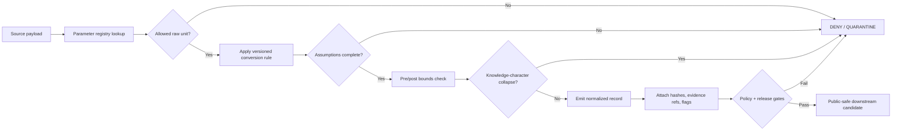

<!-- [KFM_META_BLOCK_V2]
doc_id: kfm://doc/TODO-VERIFY-unit-conversions
title: Atmosphere / Air Unit Conversions
type: standard
version: v1
status: draft
owners: @bartytime4life; atmosphere-air-domain-steward NEEDS_VERIFICATION; data-steward NEEDS_VERIFICATION; policy-steward NEEDS_VERIFICATION
created: TODO-VERIFY-YYYY-MM-DD
updated: 2026-05-06
policy_label: public-draft-NEEDS_VERIFICATION
related: [../README.md, ./ARCHITECTURE.md, ./PARAMETER_REGISTRY.md, ./KNOWLEDGE_CHARACTER.md, ./API_CONTRACTS.md, ./MAP_LAYERS.md, ./FOCUS_DRAWER_PAYLOADS.md, ../governance/SOURCE_REGISTRY.md, ../governance/SECURITY_AND_RIGHTS.md, ../governance/VALIDATION_STATUS.md, ../operations/DATA_LIFECYCLE.md, ../operations/PROMOTION_AND_ROLLBACK.md, ../../../adr/ADR-0312-atmosphere-air-source-role-boundaries.md, ../../../adr/ADR-0418-atmosphere-air-schema-slug-compatibility.md, ../../../../schemas/contracts/v1/air/, ../../../../schemas/contracts/v1/atmosphere/]
tags: [kfm, atmosphere-air, unit-conversions, parameters, evidence, validation, raw-units, normalized-units, fail-closed]
notes: [Expands the existing thin unit-conversions stub into a governed architecture note. doc_id, created date, final owners, policy label, accepted schema slug, and executable test coverage remain NEEDS VERIFICATION before publication.]
[/KFM_META_BLOCK_V2] -->

<a id="top"></a>

# Atmosphere / Air Unit Conversions

Governed unit-conversion rules for atmosphere and air-quality values so KFM can compare measurements without losing source identity, raw values, epistemic character, evidence lineage, or policy posture.

<p align="center">
  
  
  
  
  
  
</p>

<p align="center">
  <a href="#scope">Scope</a> ·
  <a href="#repo-fit">Repo fit</a> ·
  <a href="#conversion-contract">Contract</a> ·
  <a href="#normalized-units">Units</a> ·
  <a href="#formulas">Formulas</a> ·
  <a href="#forbidden-conversions">Forbidden</a> ·
  <a href="#validation-gates">Validation</a> ·
  <a href="#fixtures">Fixtures</a> ·
  <a href="#open-verification">Open verification</a>
</p>

> [!IMPORTANT]
> Unit conversion is a **normalization step**, not an authority upgrade. A converted value remains governed by its `source_role`, `knowledge_character`, evidence support, rights, review state, release state, and rollback path.

---

## Scope

This document governs unit conversion for Atmosphere / Air records that enter or leave the KFM trust path:

```text
RAW -> WORK / QUARANTINE -> PROCESSED -> CATALOG / TRIPLET -> PUBLISHED
```

It applies to:

| Family | Examples | Conversion posture |
|---|---|---|
| Observed sensor values | PM2.5, PM10, O3, NO2, SO2, CO, wind, temperature, pressure, humidity, visibility | Preserve raw value/unit and emit normalized value/unit only through a declared rule. |
| Public AQI reports | AQI, NowCast-like index, public advisory category | Treat as index/report objects, not concentration. |
| Regulatory archives | Quality-assured or archival observations | Preserve source-native unit and archival temporal scope. |
| Low-cost sensor records | Contributor or consumer sensors | Convert only after correction/caveat posture is explicit. |
| Model fields | Forecast, reanalysis, smoke/chemistry/transport fields | Keep model units and model-card assumptions visible. |
| Remote-sensing masks | AOD, smoke mask, aerosol/haze/cloud/fire classes | Treat as optical/classification/context units, not surface PM exposure. |
| Fusion products | Interpolation, consensus, bias correction, ensemble outputs | Require input EvidenceRefs, method, uncertainty, and transform identity. |

This document does not authorize live source fetching, public release, public map delivery, Evidence Drawer claims, or Focus Mode answers. Those remain downstream of source, schema, policy, evidence, review, and promotion gates.

<p align="right"><a href="#top">Back to top ↑</a></p>

---

## Repo fit

| Surface | Relationship | Status |
|---|---|---:|
| `docs/domains/atmosphere_air/architecture/UNIT_CONVERSIONS.md` | This file. Human-facing architecture note for unit discipline. | CONFIRMED existing thin stub; this revision expands it. |
| [`./PARAMETER_REGISTRY.md`](./PARAMETER_REGISTRY.md) | Defines parameter IDs, raw unit sets, normalized unit, conversion rule reference, value bounds, caveats, and allowed knowledge characters. | CONFIRMED adjacent doc. |
| [`./KNOWLEDGE_CHARACTER.md`](./KNOWLEDGE_CHARACTER.md) | Defines epistemic categories that conversion must not collapse. | CONFIRMED adjacent doc. |
| [`./ARCHITECTURE.md`](./ARCHITECTURE.md) | Defines lane trust path and non-negotiables. | CONFIRMED adjacent doc. |
| [`./API_CONTRACTS.md`](./API_CONTRACTS.md) | Requires finite outcomes and EvidenceRefs in governed API payloads. | CONFIRMED adjacent doc. |
| [`../governance/SOURCE_REGISTRY.md`](../governance/SOURCE_REGISTRY.md) | Source identity, source role, rights, and verification posture. | CONFIRMED path from repo search; content should be rechecked before merge. |
| [`../../../adr/ADR-0312-atmosphere-air-source-role-boundaries.md`](../../../adr/ADR-0312-atmosphere-air-source-role-boundaries.md) | Repo-wide source-role and knowledge-character boundary. | CONFIRMED ADR path. |
| [`../../../adr/ADR-0418-atmosphere-air-schema-slug-compatibility.md`](../../../adr/ADR-0418-atmosphere-air-schema-slug-compatibility.md) | Compatibility boundary between `atmosphere_air`, `air`, and `atmosphere`. | CONFIRMED ADR path. |
| `schemas/contracts/v1/air/` | Current implementation-slice schema pressure. | NEEDS VERIFICATION for exact files. |
| `schemas/contracts/v1/atmosphere/` | Proposed whole-domain schema family. | PROPOSED until schema-home and slug compatibility are settled. |

> [!WARNING]
> Do not duplicate unit definitions across `air` and `atmosphere` schema families. If both exist, use ADR-0418 and compatibility fixtures to decide how consumers resolve the schema slug.

<p align="right"><a href="#top">Back to top ↑</a></p>

---

## Conversion contract

Every converted atmosphere/air value must carry enough information to reconstruct what changed, what did not change, and what assumptions were used.

| Field | Required? | Purpose |
|---|---:|---|
| `parameter_id` | Yes | Stable registry key such as `pm25`, `o3`, `wind_speed`, or `visibility`. |
| `knowledge_character` | Yes | Prevents AQI, AOD, model fields, masks, and observations from collapsing into one unit family. |
| `source_id` or `source_descriptor_ref` | Yes | Connects the value to source role, rights, cadence, and verification state. |
| `raw_value` | Yes when source provides a numeric or categorical value | Preserves source-native value. |
| `raw_unit` | Yes when `raw_value` is present | Preserves source-native unit. |
| `raw_value_basis` | Conditional | Records dry/wet basis, standard conditions, averaging period, method code, or source-specific basis when material. |
| `normalized_value` | Yes for comparable numeric records | Machine-comparable value after conversion. |
| `normalized_unit` | Yes when `normalized_value` is present | KFM-normalized unit from the parameter registry. |
| `normalized_basis` | Conditional | Required when normalized value depends on temperature, pressure, molecular weight, averaging window, correction method, or standard-condition basis. |
| `conversion_rule_ref` | Yes | Stable reference to the conversion rule. |
| `conversion_rule_version` | Yes | Versioned rule identity. |
| `conversion_inputs` | Conditional | Molecular weight, temperature, pressure, dry/wet basis, correction method, or other required inputs. |
| `source_payload_sha256` | Yes for normalized records | Traces normalized record back to source payload. |
| `transform_spec_hash` | Yes for transformed records | Identifies the transform specification. |
| `rounding_mode` | Yes when rounded | Separates stored precision from display precision. |
| `validation_flags` | Yes | Records pre/post bound checks, source flags, caveats, and failure reasons. |
| `evidence_refs` | Yes for consequential claims | Supports EvidenceRef → EvidenceBundle closure. |

### Minimal JSON shape

```json
{
  "parameter_id": "pm25",
  "knowledge_character": "OBSERVED_SENSOR",
  "source_descriptor_ref": "kfm://source/TODO-VERIFY-air-source",
  "observed_at": "2026-05-01T01:00:00Z",
  "raw_value": 12.4,
  "raw_unit": "ug_m3",
  "raw_value_basis": {
    "averaging_period": "hourly",
    "source_method": "TODO-VERIFY"
  },
  "normalized_value": 12.4,
  "normalized_unit": "ug_m3",
  "normalized_basis": {
    "basis": "identity"
  },
  "conversion_rule_ref": "kfm://conversion/atmosphere-air/pm25/identity-ug-m3/v1",
  "conversion_rule_version": "v1",
  "source_payload_sha256": "sha256:TODO",
  "transform_spec_hash": "sha256:TODO",
  "rounding_mode": "none_for_storage",
  "validation_flags": [],
  "evidence_refs": ["kfm://evidence-ref/TODO"]
}
```

<p align="right"><a href="#top">Back to top ↑</a></p>

---

## Normalized units

The normalized unit is a comparison aid. It does not erase `raw_unit`.

| Parameter family | Example `parameter_id` | Accepted raw units | Default normalized unit | Knowledge character guard |
|---|---|---|---|---|
| Fine particulate concentration | `pm25` | `ug_m3`, `mg_m3`, `ng_m3` | `ug_m3` | `OBSERVED_SENSOR`, `REGULATORY_ARCHIVE`, guarded `LOW_COST_SENSOR`, or `DERIVED_FUSION` only. |
| Coarse particulate concentration | `pm10` | `ug_m3`, `mg_m3`, `ng_m3` | `ug_m3` | Same as particulate guard. |
| Ozone mixing ratio | `o3` | `ppb`, `ppm`, source-specific | `ppb` | Do not convert to mass concentration unless assumptions are explicit. |
| Nitrogen dioxide mixing ratio | `no2` | `ppb`, `ppm`, source-specific | `ppb` | Do not convert to mass concentration unless assumptions are explicit. |
| Sulfur dioxide mixing ratio | `so2` | `ppb`, `ppm`, source-specific | `ppb` | Do not convert to mass concentration unless assumptions are explicit. |
| Carbon monoxide mixing ratio | `co` | `ppm`, `ppb`, source-specific | `ppm` | Preserve report convention; conversion to `mg_m3` requires assumptions. |
| AQI or public index | `aqi`, `nowcast_aqi` | integer, category, source code | `aqi_index` or `categorical` | `PUBLIC_AQI_REPORT`; never concentration. |
| Aerosol optical depth | `aod` | dimensionless, source-specific | `dimensionless` | `VISIBILITY_AND_AEROSOL_CONTEXT`; never PM2.5 by default. |
| Smoke or plume mask | `smoke_plume_density`, `smoke_class` | categorical, class code | `categorical` | `REMOTE_SENSING_MASK`; never exposure concentration. |
| Fire/hotspot confidence | `fire_hotspot_confidence` | categorical, `%`, source code | source-preserved | `FIRE_AND_EMISSIONS_CONTEXT`; not exposure. |
| Wind speed | `wind_speed` | `m_s`, `mph`, `kt`, `km_h` | `m_s` | `METEOROLOGICAL_CONTEXT`. |
| Wind direction | `wind_direction` | degrees, cardinal | `degrees_met` | Record meteorological convention. |
| Temperature | `temperature` | `degC`, `degF`, `K` | `degC` | `METEOROLOGICAL_CONTEXT`; preserve raw. |
| Relative humidity | `relative_humidity` | `%` | `%` | Range 0–100 unless source explicitly flags. |
| Pressure | `pressure` | `hPa`, `Pa`, `kPa`, `inHg`, `mb` | `hPa` | Preserve raw and station/sea-level basis when known. |
| Visibility | `visibility` | `km`, `m`, `mi` | `km` | `VISIBILITY_AND_AEROSOL_CONTEXT`; distinct from PM and AOD. |
| Advisory or alert code | `advisory_index`, `alert_code` | categorical, source code | `categorical` | `ALERT_AND_ADVISORY_CONTEXT`; source-backed only. |

> [!NOTE]
> `mb` and `hPa` are numerically equivalent for pressure, but the raw unit still stays recorded because source language and legacy method context matter.

<p align="right"><a href="#top">Back to top ↑</a></p>

---

## Formulas

Use the simplest exact conversion that preserves source meaning. Store enough inputs to repeat the calculation.

### Linear conversions

| Conversion | Formula | Notes |
|---|---|---|
| `mg_m3` → `ug_m3` | `ug_m3 = mg_m3 * 1000` | Use for particulate mass concentration only. |
| `ng_m3` → `ug_m3` | `ug_m3 = ng_m3 / 1000` | Use for particulate mass concentration only. |
| `ppm` → `ppb` | `ppb = ppm * 1000` | Mixing ratio only. |
| `ppb` → `ppm` | `ppm = ppb / 1000` | Mixing ratio only. |
| `degF` → `degC` | `degC = (degF - 32) * 5 / 9` | Preserve raw value. |
| `K` → `degC` | `degC = K - 273.15` | Reject negative Kelvin. |
| `Pa` → `hPa` | `hPa = Pa / 100` | Record station/sea-level basis when known. |
| `kPa` → `hPa` | `hPa = kPa * 10` | Record basis when known. |
| `inHg` → `hPa` | `hPa = inHg * 33.8638866667` | Display may round; storage should retain precision. |
| `mph` → `m_s` | `m_s = mph * 0.44704` | Wind speed only. |
| `kt` → `m_s` | `m_s = kt * 0.514444` | Wind speed only. |
| `km_h` → `m_s` | `m_s = km_h / 3.6` | Wind speed only. |
| `m` → `km` | `km = m / 1000` | Visibility distance. |
| `mi` → `km` | `km = mi * 1.609344` | Visibility distance. |

### Gas mixing ratio to mass concentration

Gas mass-concentration conversions are conditional. They require molecular weight, temperature, pressure, and a declared basis.

```text
mg_m3 = ppmv * molecular_weight_g_mol * pressure_kPa / (R * temperature_K)

ug_m3 = ppbv * molecular_weight_g_mol * pressure_kPa / (R * temperature_K)

R = 8.314462618 kPa·L·mol⁻¹·K⁻¹
```

At a declared standard basis of 25 °C and 101.325 kPa, this is commonly approximated as:

```text
mg_m3 = ppmv * molecular_weight_g_mol / 24.45
ug_m3 = ppbv * molecular_weight_g_mol / 24.45
```

| Gas | Molecular weight input | Default KFM posture |
|---|---:|---|
| `CO` | `28.01 g/mol` | Normalize to `ppm` unless mass concentration is explicitly required and assumptions are recorded. |
| `NO2` | `46.0055 g/mol` | Normalize to `ppb` by default. |
| `O3` | `47.9982 g/mol` | Normalize to `ppb` by default. |
| `SO2` | `64.066 g/mol` | Normalize to `ppb` by default. |

> [!CAUTION]
> Do not use the 24.45 approximation silently. If source values are reported under different temperature, pressure, dry/wet, or regulatory standard assumptions, record those assumptions or deny the conversion.

<p align="right"><a href="#top">Back to top ↑</a></p>

---

## Forbidden conversions

These are not “needs cleanup” cases. They are trust-boundary failures.

| Forbidden conversion | Required outcome | Reason code |
|---|---|---|
| AQI, NowCast, or public index → concentration | `DENY` | `ATMOS_AQI_AS_CONCENTRATION` |
| AOD → PM2.5 without governed model assumptions | `DENY` | `ATMOS_AOD_AS_PM25` |
| Smoke/plume mask → exposure concentration | `DENY` | `ATMOS_MASK_AS_EXPOSURE` |
| Model field → observed measurement | `DENY` | `ATMOS_MODEL_AS_OBSERVED` |
| Advisory category → measured value | `DENY` | `ATMOS_ADVISORY_AS_OBSERVATION` |
| Site metadata → observation value | `ERROR` or `DENY` | `ATMOS_SITE_METADATA_AS_VALUE` |
| Low-cost sensor value → public regulatory truth without correction/caveat support | `DENY` | `ATMOS_LOW_COST_NO_CORRECTION` |
| Any numeric conversion without `conversion_rule_ref` | `ERROR` | `ATMOS_UNIT_RULE_MISSING` |
| Any gas mass conversion without temperature, pressure, and molecular weight basis | `DENY` | `ATMOS_UNIT_GAS_ASSUMPTIONS_MISSING` |
| Any public normalized value lacking source payload hash or evidence refs | `DENY` | `ATMOS_MISSING_SOURCE_PAYLOAD_HASH` or `ATMOS_MISSING_EVIDENCE_REFS` |
| Any public output with unknown rights | `DENY` | `ATMOS_UNKNOWN_RIGHTS_PUBLIC` |

<p align="right"><a href="#top">Back to top ↑</a></p>

---

## Precision and rounding

KFM should distinguish storage precision, comparison precision, and display precision.

| Stage | Rule |
|---|---|
| Source capture | Preserve source-native value, unit, flags, and text where available. |
| Normalization | Calculate with sufficient precision for repeatability; avoid display rounding before validation. |
| Validation | Run pre-conversion and post-conversion bounds checks. |
| Storage | Store numeric normalized values as numeric values, not display strings. |
| API | Return normalized value, normalized unit, raw value, raw unit, conversion rule, and caveats. |
| UI display | Round only for user display and show enough evidence context to inspect the exact source. |
| Evidence Drawer | Show raw value/unit, normalized value/unit, conversion rule, assumptions, and validation flags. |

### Rounding modes

| Mode | Use |
|---|---|
| `none_for_storage` | Preferred for persisted normalized values where possible. |
| `round_half_even` | Use only when a standard requires it. |
| `round_half_up` | Use only when a source method or public reporting convention requires it. |
| `truncate` | Avoid unless source method requires it; record caveat. |
| `display_only` | UI-only presentation; not a stored comparison value. |

> [!IMPORTANT]
> Rounding must not turn a failing value into a passing value. Validate against the unrounded normalized value, then display a rounded value with caveats.

<p align="right"><a href="#top">Back to top ↑</a></p>

---

## Validation gates

Every conversion candidate must pass these gates before it can support public-facing behavior.



| Gate | Check | Failure posture |
|---|---|---|
| Parameter registered | `parameter_id` exists and declares raw unit set, normalized unit, bounds, and allowed knowledge characters. | `ERROR` |
| Raw value preserved | `raw_value` and `raw_unit` remain present where source provided them. | `DENY` |
| Unit allowed | `raw_unit` belongs to allowed raw unit set for parameter and knowledge character. | `DENY` |
| Rule versioned | `conversion_rule_ref` and `conversion_rule_version` present. | `ERROR` |
| Assumptions complete | Gas, model, fusion, and source-specific conversions declare required assumptions. | `DENY` |
| Bounds checked | Pre/post conversion values checked against parameter-specific plausible bounds. | `DENY` or `QUARANTINE` |
| Nonfinite rejected | `NaN`, `Infinity`, and nonnumeric values rejected unless parameter is categorical. | `ERROR` |
| Categorical protected | AQI, advisory, mask, and alert codes do not enter arithmetic conversion. | `DENY` |
| Hashes present | Source payload and transform hash present for transformed records. | `DENY` |
| Evidence present | Consequential public claim has EvidenceRefs. | `ABSTAIN` or `DENY` |
| Rights/policy pass | Unknown rights, unpublished candidates, or internal lifecycle references do not reach public outputs. | `DENY` |

### Reason-code additions

| Code | Use |
|---|---|
| `ATMOS_UNIT_UNKNOWN` | Unit is not in parameter registry. |
| `ATMOS_UNIT_MISSING_RAW` | Raw value/unit missing for a source-provided value. |
| `ATMOS_UNIT_MISSING_NORMALIZED` | Comparable numeric record lacks normalized value/unit. |
| `ATMOS_UNIT_RULE_MISSING` | Conversion rule reference or version missing. |
| `ATMOS_UNIT_RULE_UNSUPPORTED` | Rule exists but is not allowed for this parameter/knowledge character. |
| `ATMOS_UNIT_GAS_ASSUMPTIONS_MISSING` | Gas mass/mixing-ratio conversion lacks required assumptions. |
| `ATMOS_UNIT_NONFINITE_VALUE` | Candidate value is NaN or infinite. |
| `ATMOS_UNIT_BOUNDS_FAIL_PRE` | Source-native value fails pre-conversion bounds. |
| `ATMOS_UNIT_BOUNDS_FAIL_POST` | Normalized value fails post-conversion bounds. |
| `ATMOS_UNIT_ROUNDING_UNDECLARED` | Stored rounded value lacks rounding mode. |
| `ATMOS_UNIT_CATEGORICAL_ARITHMETIC` | Categorical/index value was treated as numeric concentration. |

<p align="right"><a href="#top">Back to top ↑</a></p>

---

## Fixtures

Use fixtures to prove both positive and negative behavior before live source activation.

### Positive fixture expectations

```json
{
  "fixture_id": "air-unit-positive-pm25-ug-m3-v1",
  "parameter_id": "pm25",
  "knowledge_character": "OBSERVED_SENSOR",
  "raw_value": 10.5,
  "raw_unit": "ug_m3",
  "normalized_value": 10.5,
  "normalized_unit": "ug_m3",
  "conversion_rule_ref": "kfm://conversion/atmosphere-air/pm25/identity-ug-m3/v1",
  "conversion_rule_version": "v1",
  "expected_result": "PASS"
}
```

```json
{
  "fixture_id": "air-unit-positive-temperature-f-to-c-v1",
  "parameter_id": "temperature",
  "knowledge_character": "METEOROLOGICAL_CONTEXT",
  "raw_value": 68,
  "raw_unit": "degF",
  "normalized_value": 20,
  "normalized_unit": "degC",
  "conversion_rule_ref": "kfm://conversion/atmosphere-air/temperature/f-to-c/v1",
  "conversion_rule_version": "v1",
  "expected_result": "PASS"
}
```

### Negative fixture expectations

```json
{
  "fixture_id": "air-unit-negative-aqi-as-concentration-v1",
  "parameter_id": "aqi",
  "knowledge_character": "PUBLIC_AQI_REPORT",
  "raw_value": 87,
  "raw_unit": "aqi_index",
  "requested_normalized_unit": "ug_m3",
  "expected_result": "DENY",
  "expected_reason_code": "ATMOS_AQI_AS_CONCENTRATION"
}
```

```json
{
  "fixture_id": "air-unit-negative-aod-as-pm25-v1",
  "parameter_id": "aod",
  "knowledge_character": "VISIBILITY_AND_AEROSOL_CONTEXT",
  "raw_value": 0.42,
  "raw_unit": "dimensionless",
  "requested_normalized_unit": "ug_m3",
  "expected_result": "DENY",
  "expected_reason_code": "ATMOS_AOD_AS_PM25"
}
```

```json
{
  "fixture_id": "air-unit-negative-gas-assumptions-missing-v1",
  "parameter_id": "o3",
  "knowledge_character": "OBSERVED_SENSOR",
  "raw_value": 48,
  "raw_unit": "ppb",
  "requested_normalized_unit": "ug_m3",
  "conversion_inputs": {
    "molecular_weight_g_mol": 47.9982
  },
  "expected_result": "DENY",
  "expected_reason_code": "ATMOS_UNIT_GAS_ASSUMPTIONS_MISSING"
}
```

<p align="right"><a href="#top">Back to top ↑</a></p>

---

## Test matrix

NEEDS VERIFICATION: exact test home depends on ADR-0418 and current repo convention. Current implementation-slice tests may belong under `tests/air/`; whole-domain tests may later belong under `tests/atmosphere/`. Do not create both without an ADR-backed compatibility note.

| Test | Required behavior |
|---|---|
| `test_raw_and_normalized_preserved` | Every normalized numeric record preserves `raw_value` and `raw_unit`. |
| `test_parameter_registry_declares_units` | Every `parameter_id` declares allowed raw units, normalized unit, bounds, caveats, and allowed knowledge characters. |
| `test_pm25_mass_units` | `mg_m3`, `ug_m3`, and `ng_m3` convert deterministically to `ug_m3`. |
| `test_temperature_units` | `degF`, `degC`, and `K` normalize to `degC`; invalid Kelvin fails. |
| `test_pressure_units` | `Pa`, `kPa`, `hPa`, `mb`, and `inHg` normalize to `hPa`. |
| `test_wind_units` | `mph`, `kt`, `km_h`, and `m_s` normalize to `m_s`. |
| `test_visibility_units` | `m`, `km`, and `mi` normalize to `km`. |
| `test_gas_mixing_ratio_units` | `ppm` and `ppb` convert as mixing ratios without implying mass concentration. |
| `test_gas_mass_conversion_requires_assumptions` | Gas mass conversion denied without molecular weight, temperature, pressure, and basis. |
| `test_aqi_not_concentration` | AQI/index cannot normalize to `ug_m3`. |
| `test_aod_not_pm25` | AOD cannot normalize to PM2.5 without governed model assumptions. |
| `test_mask_not_concentration` | Smoke/plume classifications cannot normalize to concentration. |
| `test_model_not_observed` | Model field cannot inherit observed-sensor conversion posture. |
| `test_nonfinite_values_denied` | `NaN`, `Infinity`, and invalid numerics fail closed. |
| `test_pre_post_bounds` | Raw and normalized values run pre/post bound validation. |
| `test_rounding_is_display_only` | Stored normalized values are not silently display-rounded. |
| `test_transform_hash_required` | Any changed conversion rule changes `transform_spec_hash`. |
| `test_backward_compatibility_alias` | If `air` and `atmosphere` schemas coexist, alias behavior is explicit and tested. |

<p align="right"><a href="#top">Back to top ↑</a></p>

---

## Review checklist

- [ ] KFM Meta Block values are verified or intentionally left as reviewable placeholders.
- [ ] `PARAMETER_REGISTRY.md` and machine registry entries agree on allowed units and normalized units.
- [ ] Raw values and raw units are preserved in every fixture and example where the source supplied them.
- [ ] No AQI, AOD, mask, advisory, or model field is treated as a raw observation by conversion logic.
- [ ] Gas conversions record molecular weight, temperature, pressure, and basis.
- [ ] Every conversion rule is versioned and hashable.
- [ ] Pre/post bounds exist for every numeric parameter.
- [ ] Rounding mode is explicit and does not alter validation outcomes.
- [ ] Denial fixtures exist for forbidden conversions.
- [ ] Public outputs require EvidenceRefs, source role, knowledge character, rights posture, and release state.
- [ ] Compatibility between `air`, `atmosphere`, and `atmosphere_air` is handled by ADR-0418 or a successor.
- [ ] Tests run in the active branch before this document is marked beyond draft.

---

## Open verification

| Item | Status | Why it matters |
|---|---:|---|
| Final `doc_id` | NEEDS VERIFICATION | Required by KFM Meta Block V2. |
| Created date | NEEDS VERIFICATION | Must come from repo history or governance record. |
| Owners | NEEDS VERIFICATION | ADRs mention `@bartytime4life` and steward placeholders; final leaf ownership needs confirmation. |
| Policy label | NEEDS VERIFICATION | Determines public/restricted posture. |
| Canonical schema slug | NEEDS VERIFICATION | `air` implementation slice and `atmosphere` whole-domain concept must not drift. |
| Machine schema files | NEEDS VERIFICATION | This document names expected behavior but does not prove schema inventory. |
| Executable validator path | NEEDS VERIFICATION | Current repo may use `tools/validators/air/`, future domain docs may prefer `tools/validators/atmosphere/`. |
| Test path | NEEDS VERIFICATION | Avoid duplicate `tests/air` and `tests/atmosphere` coverage without ADR-backed aliasing. |
| Source-specific unit bases | NEEDS VERIFICATION | Live source values may include regulatory, standard-condition, dry/wet, method, or instrument-specific bases. |
| Live source rights | NEEDS VERIFICATION | Unknown rights block public release. |

<p align="right"><a href="#top">Back to top ↑</a></p>
