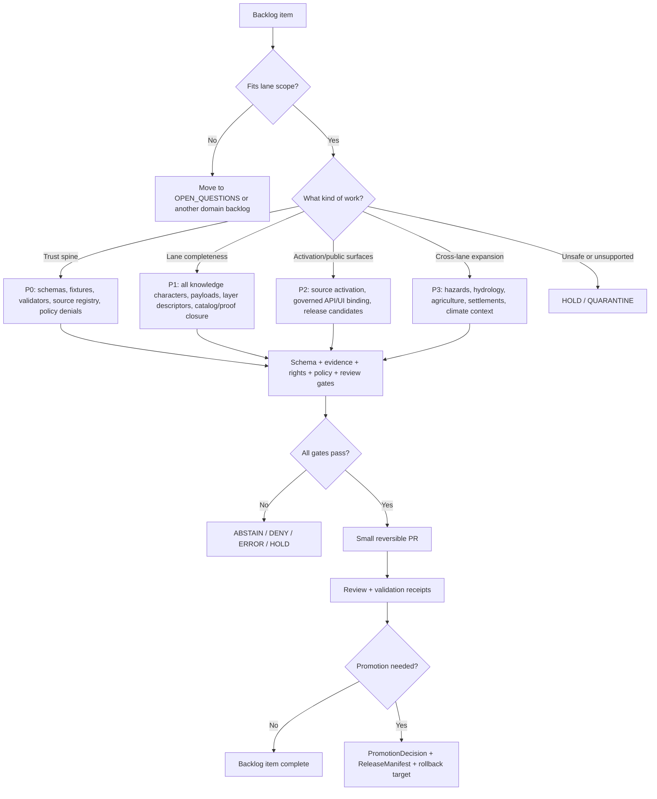

<!-- [KFM_META_BLOCK_V2]
doc_id: kfm://doc/TODO-ASSIGN-UUID
title: Atmosphere / Air Expansion Backlog
type: standard
version: v1
status: draft
owners: TODO-VERIFY: @bartytime4life; atmosphere-air domain steward; data steward; schema/contract steward; policy steward
created: TODO-VERIFY-YYYY-MM-DD
updated: 2026-05-06
policy_label: public-draft-NEEDS_VERIFICATION
related: [../README.md, ../architecture/ARCHITECTURE.md, ../architecture/KNOWLEDGE_CHARACTER.md, ../architecture/MAP_LAYERS.md, ../architecture/API_CONTRACTS.md, ../architecture/FOCUS_DRAWER_PAYLOADS.md, ./SOURCE_REGISTRY.md, ./VALIDATION_STATUS.md, ./PRESERVATION_LEDGER.md, ./SECURITY_AND_RIGHTS.md, ./OPEN_QUESTIONS.md, ../operations/PROMOTION_AND_ROLLBACK.md, ../operations/DATA_LIFECYCLE.md, ../operations/RUNBOOK.md, ../../../adr/ADR-0312-atmosphere-air-source-role-boundaries.md, ../../../adr/ADR-0418-atmosphere-air-schema-slug-compatibility.md, ../../../adr/ADR-0431-atmosphere-air-knowledge-character-boundary.md]
tags: [kfm, atmosphere-air, expansion-backlog, governance, source-role, knowledge-character, validation, release-gates]
notes: [Revises docs/domains/atmosphere_air/governance/EXPANSION_BACKLOG.md from a thin near/mid/long-term list into a governed backlog register. doc_id, owners, created date, policy label, schema inventory, source rights, validator execution, CI status, release maturity, and branch protections remain NEEDS VERIFICATION.]
[/KFM_META_BLOCK_V2] -->

<a id="top"></a>

# Atmosphere / Air Expansion Backlog

Prioritized, evidence-gated follow-on queue for expanding the Atmosphere / Air lane without collapsing observations, reports, models, masks, advisories, fusion products, receipts, or public map layers into unverified truth.

<p align="center">
  
  
  
  
  
  
</p>

<p align="center">
  <a href="#backlog-posture">Posture</a> ·
  <a href="#repo-fit">Repo fit</a> ·
  <a href="#operating-rules">Rules</a> ·
  <a href="#priority-map">Priority map</a> ·
  <a href="#p0-trust-spine">P0</a> ·
  <a href="#p1-lane-completeness">P1</a> ·
  <a href="#p2-source-activation-and-public-surfaces">P2</a> ·
  <a href="#p3-cross-lane-expansion">P3</a> ·
  <a href="#hold--quarantine">Hold</a> ·
  <a href="#definition-of-done">Done</a> ·
  <a href="#open-verification">Open verification</a>
</p>

> [!IMPORTANT]
> This backlog is a **governed queue**, not approval to fetch live sources, publish air-quality layers, expose public API routes, generate public tiles, or let Focus Mode answer atmosphere/air questions. Every item below remains blocked until the relevant evidence, rights, schema, policy, validation, review, release, correction, and rollback gates pass.

---

## Backlog posture

| Claim | Status | Meaning for this file |
|---|---:|---|
| The target backlog path exists as a repo-visible Markdown file. | CONFIRMED | This revision preserves the existing near/mid/long-term intent and expands it into a reviewable backlog register. |
| Atmosphere / Air is a governed domain lane, not a single “air layer.” | CONFIRMED doctrine | Observed sensor values, AQI reports, model fields, smoke masks, AOD, advisories, and fusion products must remain distinct. |
| Source role and knowledge character are trust-bearing fields. | CONFIRMED doctrine / PROPOSED enforcement | Backlog items must preserve `source_role` and `knowledge_character` through schemas, fixtures, validators, public payloads, and release candidates. |
| Schema, fixture, validator, and policy implementation remains incomplete or needs verification. | NEEDS VERIFICATION | Items here should not be described as enforced until repo-native test output, CI output, or validation receipts prove it. |
| Public release remains deny-by-default. | CONFIRMED doctrine / PROPOSED enforcement | Unknown rights, unresolved source terms, missing EvidenceRefs, or missing rollback targets block release. |

### Reading rule

Use the narrowest truthful status:

| Label | Use here |
|---|---|
| `CONFIRMED` | Verified from current repo-visible files, attached doctrine, or current-session inspection. |
| `PROPOSED` | Recommended backlog work not yet proven as implemented. |
| `NEEDS VERIFICATION` | A concrete check can retire the uncertainty. |
| `UNKNOWN` | Not verified strongly enough from available evidence. |
| `HOLD` | Do not implement until dependencies are resolved. |
| `QUARANTINE` | Keep out of public release until evidence, rights, policy, review, or safety issues are corrected. |

<p align="right"><a href="#top">Back to top ↑</a></p>

---

## Repo fit

**Target file:** `docs/domains/atmosphere_air/governance/EXPANSION_BACKLOG.md`

This file belongs under `docs/` because it is human-facing governance and planning documentation for the Atmosphere / Air lane. It does **not** own machine schema definitions, executable policy, source data, generated artifacts, release manifests, or runtime behavior.

| Neighbor | Relationship |
|---|---|
| [`../README.md`](../README.md) | Lane landing page: scope, accepted inputs, exclusions, governed flow, denial posture. |
| [`../architecture/ARCHITECTURE.md`](../architecture/ARCHITECTURE.md) | End-to-end trust architecture and public-surface boundary. |
| [`../architecture/KNOWLEDGE_CHARACTER.md`](../architecture/KNOWLEDGE_CHARACTER.md) | Taxonomy and anti-collapse rules for object meaning. |
| [`./SOURCE_REGISTRY.md`](./SOURCE_REGISTRY.md) | Human-readable source registry posture and activation rule. |
| [`./VALIDATION_STATUS.md`](./VALIDATION_STATUS.md) | Current validation inventory and planned validation families. |
| [`./SECURITY_AND_RIGHTS.md`](./SECURITY_AND_RIGHTS.md) | Rights, access, and public-release posture. |
| [`./PRESERVATION_LEDGER.md`](./PRESERVATION_LEDGER.md) | Retain / extend / migrate / quarantine decisions for lane docs. |
| [`./OPEN_QUESTIONS.md`](./OPEN_QUESTIONS.md) | Unresolved path, owner, schema-home, test-runner, and release workflow questions. |
| [`../operations/PROMOTION_AND_ROLLBACK.md`](../operations/PROMOTION_AND_ROLLBACK.md) | Promotion checklist and rollback expectations. |
| [`../../../adr/ADR-0312-atmosphere-air-source-role-boundaries.md`](../../../adr/ADR-0312-atmosphere-air-source-role-boundaries.md) | Repo-wide source-role and knowledge-character boundary. |
| [`../../../adr/ADR-0418-atmosphere-air-schema-slug-compatibility.md`](../../../adr/ADR-0418-atmosphere-air-schema-slug-compatibility.md) | Compatibility bridge between `atmosphere_air`, `air`, and `atmosphere`. |
| [`../../../adr/ADR-0431-atmosphere-air-knowledge-character-boundary.md`](../../../adr/ADR-0431-atmosphere-air-knowledge-character-boundary.md) | Knowledge-character release and public-surface boundary. |

### Accepted backlog inputs

A backlog item belongs here when it proposes one of the following:

- a domain governance decision, ADR follow-up, or compatibility bridge;
- a source registry, parameter registry, or source-activation gate;
- a schema, fixture, validator, or policy check;
- an evidence, catalog, proof, receipt, release, correction, or rollback object;
- a MapLibre layer, Evidence Drawer, Focus Mode, export, or governed API contract;
- a no-network dry-run slice, negative-path test, or release-readiness drill;
- a cross-lane relation that keeps Atmosphere / Air evidence subordinate to its source role and knowledge character.

### Exclusions

Do not use this backlog to smuggle in:

- live source activation without a SourceDescriptor, rights review, cadence review, source-role review, and public-release decision;
- public tiles, public API routes, public exports, or Focus Mode answers before release gates pass;
- schema-home changes without ADR-backed compatibility, fixture coverage, migration notes, and rollback;
- direct public access to RAW, WORK, QUARANTINE, connector-private output, normalization candidates, or unpublished processed candidates;
- AQI-as-concentration, AOD-as-PM2.5, smoke-mask-as-exposure, model-as-observed, advisory-as-emergency-instruction, or run-receipt-as-proof behavior;
- broad visual polish that does not improve evidence, policy, validation, release, correction, or rollback.

<p align="right"><a href="#top">Back to top ↑</a></p>

---

## Operating rules

1. **Proof before polish.** A backlog item that improves trust objects, fixtures, validators, source descriptors, or release gates outranks visual presentation work.
2. **No live fetch before source activation.** Live source work starts only after rights, terms, cadence, source role, knowledge character, public-release posture, and steward review are recorded.
3. **No publication by script success.** A run receipt, dry-run artifact, or generated layer descriptor is not a release.
4. **No silent slug collapse.** `atmosphere_air`, `air`, and `atmosphere` remain distinct until ADR-0418 or a successor proves a migration.
5. **No source-role drift.** Backlog items must preserve the difference between observation, public report, archive, low-cost sensor, model, remote-sensing mask, advisory, site metadata, temporal support, and fusion.
6. **No public internal path.** Public clients consume released artifacts and governed envelopes only.
7. **No AI authority.** Focus Mode may summarize admissible evidence; it cannot create evidence, policy approval, review state, or release state.
8. **Rollback is part of done.** Anything that changes public meaning needs a rollback target and correction path before release.

---

## Priority map



| Priority | Meaning | Merge posture |
|---|---|---|
| `P0` | Trust-spine work required before the lane can safely grow. | Small, offline, no-network PRs preferred. |
| `P1` | Lane-completeness work that widens coverage while staying fixture/dry-run first. | Requires P0 gates or explicit HOLD. |
| `P2` | Source activation and public-surface integration. | Requires rights, source, release, policy, and rollback proof. |
| `P3` | Cross-lane and advanced interpretation work. | Requires mature shared objects and domain-specific reviews. |
| `HOLD` | Useful idea blocked by unresolved path, rights, schema-home, validation, policy, or sensitivity issue. | Do not implement until blocker is retired. |
| `QUARANTINE` | Unsafe, misleading, rights-unclear, or policy-conflicting work. | Keep out of release and public UX. |

<p align="right"><a href="#top">Back to top ↑</a></p>

---

## P0 trust spine

These items should land before live source activation, public map layers, or Focus Mode answers.

| ID | Backlog item | Why now | Dependencies | Acceptance gates |
|---|---|---|---|---|
| `P0-AIR-001` | Reconcile ADR links and slug compatibility. | Prevents drift between `atmosphere_air`, `air`, and `atmosphere`. | ADR-0312, ADR-0418, ADR-0431, schema-home ADR. | ADR links checked; domain-local lineage documented; no silent rename; rollback/migration note exists. |
| `P0-AIR-002` | Convert source registry posture into a minimum source descriptor fixture pack. | Source activation must fail closed while rights or source role are unresolved. | [`SOURCE_REGISTRY.md`](./SOURCE_REGISTRY.md), source descriptor schema or placeholder. | Valid descriptor passes; missing rights, missing source role, missing knowledge character, and `public_release_allowed: false` deny public release. |
| `P0-AIR-003` | Build parameter and unit fixture pack. | Unit drift can falsely convert AQI, AOD, concentration, visibility, and modeled variables. | Parameter registry, unit conversion notes. | Raw and normalized values retained; AQI is not concentration; AOD is not PM2.5 without model support. |
| `P0-AIR-004` | Add core schema wave or link to active canonical schemas. | Current validation status says schema, fixture, validator, and policy implementation require verification. | Schema-home ADR, ADR-0418 compatibility decision. | Active schema inventory captured; valid/invalid examples exist; no duplicate schema authority created. |
| `P0-AIR-005` | Add anti-collapse validator and policy denial codes. | The lane’s central risk is false equivalence across evidence classes. | Knowledge-character taxonomy, source-role ADR. | Denials emitted for AQI-as-concentration, AOD-as-PM2.5, model-as-observed, mask-as-exposure, fusion-inputs-hidden, receipt-as-proof, and public-internal-access. |
| `P0-AIR-006` | Make dry-run candidate artifacts explicitly non-published. | No-network slices are useful only if they remain candidate/process-memory proof. | Run receipt examples, QA candidate examples, release-candidate builder if present. | RunReceipt ≠ EvidenceBundle; candidate ≠ release; release manifest absent or blocked; validation report records why. |
| `P0-AIR-007` | Update `VALIDATION_STATUS.md` after every validation-affecting PR. | Prevents stale claims about enforcement maturity. | Repo-native validator or test output. | Status table includes last run, command, result, gaps, and artifacts; unknowns are not upgraded by tone. |
| `P0-AIR-008` | Add first rollback drill for a no-network release candidate. | Rollback must be proven before public meaning changes. | Promotion and rollback doc, release candidate inventory. | Rollback target, reason, cache invalidation note, and post-rollback verification report are present. |

### P0 definition of done

- [ ] No live network fetch.
- [ ] No public release.
- [ ] No public UI binding.
- [ ] No Focus Mode answer path.
- [ ] Valid and invalid fixtures cover every new rule.
- [ ] Validation output is captured or explicitly marked `NEEDS VERIFICATION`.
- [ ] Public-release attempts with unknown rights are denied.
- [ ] Rollback and correction obligations are visible where public meaning could change.

<p align="right"><a href="#top">Back to top ↑</a></p>

---

## P1 lane completeness

These items widen the lane while keeping the work evidence-bounded and dry-run first.

| ID | Backlog item | Expansion value | Required gates |
|---|---|---|---|
| `P1-AIR-001` | Complete valid/invalid fixtures for every knowledge character. | Ensures all object families are testable before public use. | One valid and one invalid fixture each; knowledge-character enum checked; anti-collapse negative path present. |
| `P1-AIR-002` | Add station/network/site context fixtures. | Observations are not interpretable without site, cadence, instrument, and health metadata. | Site context cannot be treated as measurement value; stale or inactive station state is visible. |
| `P1-AIR-003` | Add freshness and stale-state rules. | Public claims must distinguish observed time, valid time, retrieved time, release time, and stale state. | Fresh/stale/unknown calculation tests; stale live-state claims abstain or show stale posture. |
| `P1-AIR-004` | Add Evidence Drawer payload contract examples. | Users need to inspect source role, knowledge character, rights, freshness, review, release, caveats, conflicts, and correction state. | Payload examples validate; missing evidence or rights produces finite denial/abstention state. |
| `P1-AIR-005` | Add Focus Mode request/response examples. | Focus Mode should answer only over admissible evidence. | `ANSWER`, `ABSTAIN`, `DENY`, and `ERROR` examples exist; uncited claim-bearing answer fails. |
| `P1-AIR-006` | Add layer descriptor examples for released and non-released states. | Map layer trust state must be visible before public rendering. | Released descriptor requires Evidence Drawer fields; candidate/internal descriptor cannot render publicly. |
| `P1-AIR-007` | Add catalog/provenance closure examples. | Catalog, triplet, and provenance records should support discovery without becoming truth. | Catalog candidate links to EvidenceRefs, validation report, policy decision, and release state. |
| `P1-AIR-008` | Add conflict-record examples. | Sources may disagree; KFM should expose disagreement rather than force false consensus. | Conflict record preserves source roles, times, evidence refs, and review state; fusion remains derived. |
| `P1-AIR-009` | Add correction and supersession examples. | Published claims require visible correction lineage. | CorrectionNotice or equivalent links target artifact, reason, effective time, replacement, and rollback reference. |

---

## P2 source activation and public surfaces

These items are valuable only after P0/P1 evidence, source, and policy gates exist.

| ID | Backlog item | First safe version | Release burden |
|---|---|---|---|
| `P2-AIR-001` | SourceActivationDecision workflow. | Descriptor-first source activation record with rights, source role, cadence, terms, limitations, public-release posture, and recheck date. | Public release denied until activation decision is approved and current. |
| `P2-AIR-002` | Observed sensor source family activation. | One no-network or fixture-backed observed sensor source; then a reviewed live source only after terms are verified. | Must include site/instrument context, unit discipline, payload hashes, freshness rules, and EvidenceRefs. |
| `P2-AIR-003` | Public AQI/report source family activation. | Public report fixture and descriptor with report/index semantics. | Must not support raw concentration claims. |
| `P2-AIR-004` | Regulatory archive source family activation. | Archive fixture with retrieval time, valid time, QA status, and not-live caveat. | Must not imply current state by default. |
| `P2-AIR-005` | Model field source family activation. | One model-field fixture with model identity, variable, valid time, uncertainty, and model-card reference. | Must never be labeled observed. |
| `P2-AIR-006` | Remote-sensing mask source family activation. | One smoke/AOD/aerosol-mask fixture with classification method, confidence, and caveats. | Must not be PM2.5 or exposure by itself. |
| `P2-AIR-007` | Advisory context activation. | Advisory fixture with issuer, effective/expiry time, official-source context, and KFM non-alerting disclaimer. | KFM must not become an emergency alerting system. |
| `P2-AIR-008` | Governed API envelope for atmosphere/air claims. | Finite envelope examples and route contract notes, not necessarily runtime binding. | Claim-bearing `ANSWER` requires evidence and citations; unknown rights or internal access returns `DENY`. |
| `P2-AIR-009` | Public map-layer release candidate. | Public-safe fixture-only layer descriptor with release manifest candidate and rollback card. | Released layer must carry source role, knowledge character, evidence route, stale/correction state, and caveats. |

> [!CAUTION]
> Source activation does not equal publication. A source may be admitted for processing and still be blocked from public release.

<p align="right"><a href="#top">Back to top ↑</a></p>

---

## P3 cross-lane expansion

Cross-lane work should preserve each lane’s authority and never let Atmosphere / Air become a generic hazard, health, agriculture, infrastructure, or climate truth source.

| ID | Cross-lane item | Relation rule | First safe output |
|---|---|---|---|
| `P3-AIR-HAZ-001` | Hazards and smoke/advisory context. | Atmosphere / Air can supply smoke, visibility, aerosol, advisory, and freshness context; Hazards keeps hazard-event and warning posture. | Context relation fixture with no life-safety instruction. |
| `P3-AIR-HYD-001` | Hydrology and meteorological support. | Atmosphere / Air can supply precipitation, wind, temperature, humidity, and pressure context where source role supports it; Hydrology keeps water observations and flood logic. | Weather-context relation fixture with EvidenceRefs and time scope. |
| `P3-AIR-AG-001` | Agriculture stress context. | Atmosphere / Air can support weather/air/smoke context; Agriculture keeps crop, field, yield, irrigation, and management claims. | Context-only relation with no yield claim unless Agriculture evidence supports it. |
| `P3-AIR-SETTLE-001` | Settlements and public-exposure context. | Atmosphere / Air can provide released, generalized context; do not imply individual exposure or health outcome. | Public-safe generalized overlay with caveats and no personal inference. |
| `P3-AIR-UI-001` | Story and review surfaces. | UI may explain evidence, freshness, and caveats; UI does not become release authority. | Reviewer story manifest showing Evidence Drawer and rollback path. |
| `P3-AIR-AI-001` | Governed AI summaries. | AI may summarize released EvidenceBundles; it may not infer missing source roles, rights, or measurements. | Focus Mode negative-path examples for abstain/deny/error. |

---

## HOLD / QUARANTINE

| Item | Status | Reason |
|---|---:|---|
| Live source fetchers without source activation records. | HOLD | Rights, terms, cadence, quotas, source role, knowledge character, and public-release posture must be verified first. |
| Direct public API access to `data/raw`, `data/work`, `data/quarantine`, connector-private outputs, or unpublished candidates. | QUARANTINE | Violates the trust membrane and public lifecycle boundary. |
| AQI-to-concentration conversion without source-supported method. | QUARANTINE | Misrepresents public report/index semantics. |
| AOD-to-PM2.5 or smoke-mask-to-exposure claims without governed model/fusion support. | QUARANTINE | Converts contextual support into unsupported concentration or exposure. |
| Model-field-as-observation labels. | QUARANTINE | Erases observed/model distinction. |
| Low-cost sensor publication without correction method, caveats, confidence, and rights. | HOLD | Public release burden is unresolved. |
| Fusion products that hide input EvidenceRefs, method, uncertainty, or transform identity. | QUARANTINE | Derived product would masquerade as root truth. |
| Emergency alerting or life-safety instruction. | HOLD | KFM may cite official advisory context; it must not become an emergency alert system. |
| Schema slug rename without ADR-0418-compatible migration, fixtures, validators, and rollback. | HOLD | Silent slug collapse creates contract and release drift. |
| Focus Mode free-form air answers without EvidenceBundle closure. | QUARANTINE | Generated language is interpretive, not evidence. |

<p align="right"><a href="#top">Back to top ↑</a></p>

---

## Backlog item template

Use this template for new backlog rows or issue bodies.

```yaml
backlog_item:
  id: P0-AIR-000
  title: TODO
  priority: P0 | P1 | P2 | P3 | HOLD | QUARANTINE
  status: proposed
  owner: TODO-VERIFY
  lane: atmosphere_air
  affected_roots:
    - docs
    - schemas
    - policy
    - tests
    - data
    - tools

  evidence_basis:
    repo_files:
      - docs/domains/atmosphere_air/governance/EXPANSION_BACKLOG.md
    doctrine_refs:
      - docs/adr/ADR-0312-atmosphere-air-source-role-boundaries.md
      - docs/adr/ADR-0418-atmosphere-air-schema-slug-compatibility.md
      - docs/adr/ADR-0431-atmosphere-air-knowledge-character-boundary.md

  required_fields:
    - source_role
    - knowledge_character
    - evidence_refs
    - rights_status
    - public_release_allowed
    - review_state
    - release_state
    - rollback_ref

  acceptance_gates:
    - schema_valid
    - source_registry_valid
    - evidence_refs_resolve
    - unknown_rights_deny_public
    - anti_collapse_negative_tests_pass
    - public_internal_access_denied
    - correction_path_present_if_public
    - rollback_target_present_if_public

  rollback:
    target: TODO
    command_or_manual_step: TODO
    verification: TODO

  open_verification:
    - TODO
```

---

## Definition of done

A backlog item is not done because a file exists. It is done only when its trust burden is satisfied.

- [ ] The owning responsibility root is correct.
- [ ] Adjacent docs and ADRs are linked.
- [ ] The item uses the narrowest truthful status label.
- [ ] `source_role` and `knowledge_character` are preserved where the item touches atmosphere/air evidence.
- [ ] Rights and public-release posture are explicit.
- [ ] Valid and invalid fixtures exist for new schemas or validators.
- [ ] Negative-path tests include at least one denial, abstention, or error where appropriate.
- [ ] EvidenceRefs resolve, or the item is blocked from consequential public claims.
- [ ] Run receipts, proof objects, catalog records, release manifests, and rollback records remain separate.
- [ ] Public surfaces do not read internal lifecycle stages or candidates directly.
- [ ] Validation status is updated.
- [ ] Preservation ledger is updated when the item changes lane documentation meaning.
- [ ] Rollback and correction behavior is documented before public release.
- [ ] Remaining unknowns are recorded in [`OPEN_QUESTIONS.md`](./OPEN_QUESTIONS.md).

---

## Review checklist

| Reviewer lens | Questions |
|---|---|
| Domain steward | Does the item preserve atmosphere/air knowledge boundaries? |
| Source/data steward | Are source roles, rights, cadence, and verification state explicit? |
| Schema/contract steward | Does the item create or change machine shape without duplicate authority? |
| Policy steward | Are deny/abstain/error outcomes explicit and fail-closed? |
| UI/API steward | Are public surfaces downstream of release and governed envelopes? |
| Release steward | Are ReleaseManifest, correction path, and rollback target present where needed? |
| Documentation steward | Are links, meta block, status labels, and preservation notes current? |

---

## Open verification

| Item | Status | Backlog effect |
|---|---:|---|
| Final `doc_id` for this file | TODO | Keep placeholder until assigned by repo process. |
| Owners | TODO / NEEDS VERIFICATION | Backlog items should not claim mature ownership until reviewer routing is confirmed. |
| Created date | TODO | Existing target file did not expose a KFM meta block with created date. |
| Policy label | TODO / NEEDS VERIFICATION | Public/restricted posture needs steward review. |
| Canonical schema home | NEEDS VERIFICATION | All schema additions must respect ADR-0001 and ADR-0418. |
| `air` vs `atmosphere` schema inventory | NEEDS VERIFICATION | Do not migrate or alias without inventory and tests. |
| Validator runtime and test runner | NEEDS VERIFICATION | Quickstart commands should be repo-native after verification. |
| CI enforcement | UNKNOWN | Do not claim enforcement without workflow/test output. |
| Source rights and terms | UNKNOWN | Public source activation remains blocked. |
| EvidenceBundle/proof/release implementation maturity | NEEDS VERIFICATION | Candidate artifacts are not proof or release authority. |
| MapLibre, Evidence Drawer, governed API, and Focus Mode binding | NEEDS VERIFICATION | Payload expectations are backlog items until runtime evidence exists. |
| Branch protections and release approvals | UNKNOWN | Release/publication maturity cannot be inferred from docs alone. |

<p align="right"><a href="#top">Back to top ↑</a></p>
