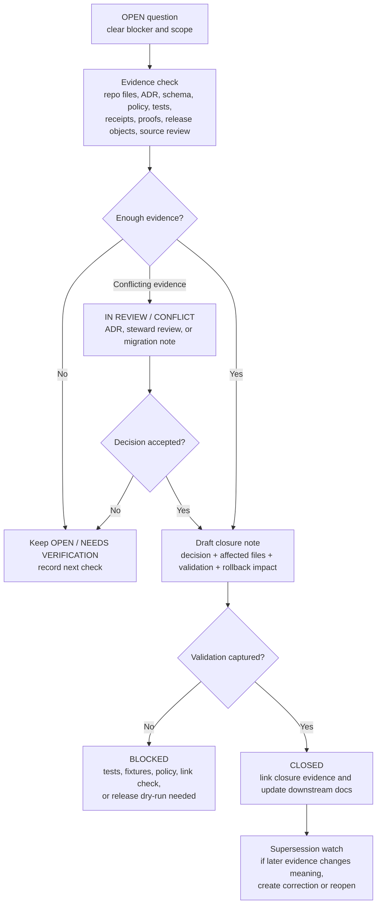

<!-- [KFM_META_BLOCK_V2]
doc_id: kfm://doc/TODO-ASSIGN-UUID
title: Atmosphere / Air Open Questions
type: standard
version: v1
status: draft
owners: TODO-VERIFY: @bartytime4life; atmosphere-air domain steward; schema/contract steward; policy steward; release steward
created: TODO-VERIFY-YYYY-MM-DD
updated: 2026-05-06
policy_label: public-draft-NEEDS_VERIFICATION
related: [../README.md, ./SOURCE_REGISTRY.md, ../architecture/ARCHITECTURE.md, ../architecture/KNOWLEDGE_CHARACTER.md, ../architecture/API_CONTRACTS.md, ../architecture/MAP_LAYERS.md, ../architecture/FOCUS_DRAWER_PAYLOADS.md, ../../../adr/ADR-0312-atmosphere-air-source-role-boundaries.md, ../../../adr/ADR-0418-atmosphere-air-schema-slug-compatibility.md, ../../../adr/ADR-0431-atmosphere-air-knowledge-character-boundary.md]
tags: [kfm, atmosphere-air, open-questions, governance, source-role, knowledge-character, evidence, policy, release]
notes: [Revises existing docs/domains/atmosphere_air/governance/OPEN_QUESTIONS.md. The previous five-question list is preserved and expanded into a governed closure ledger. doc_id, owners, created date, final policy label, ADR acceptance, schema inventory, CI status, source rights, release maturity, Evidence Drawer binding, Focus binding, and runtime behavior remain NEEDS VERIFICATION.]
[/KFM_META_BLOCK_V2] -->

# Atmosphere / Air Open Questions

Governance ledger for unresolved Atmosphere / Air questions that block confident source activation, schema migration, validation enforcement, public release, Evidence Drawer binding, Focus Mode answers, or publication.

  
  
  
  
  
  

  <a href="#ledger-posture">Posture</a> ·
  <a href="#closure-standard">Closure standard</a> ·
  <a href="#priority-questions">Priority questions</a> ·
  <a href="#blockers-by-surface">Blockers</a> ·
  <a href="#question-lifecycle">Lifecycle</a> ·
  <a href="#legacy-carry-forward">Legacy mapping</a> ·
  <a href="#update-triggers">Update triggers</a>

> [!IMPORTANT]
> Open questions are governance blockers, not loose brainstorming notes. Close an item only when the evidence, affected files, validation result, policy decision, release state, and rollback implication are inspectable.

---

## Ledger posture

This file tracks what the Atmosphere / Air lane still needs to prove before maintainers can treat source activation, schema compatibility, public API behavior, map layers, Evidence Drawer payloads, Focus Mode answers, or publication as governed and release-ready.

The current release posture is:

| Area | Current posture | Consequence |
|---|---:|---|
| Public release | `BLOCKED / NEEDS VERIFICATION` | Do not publish real-world Atmosphere / Air artifacts from this lane until release, evidence, policy, review, correction, and rollback gates are proven. |
| Live source activation | `BLOCKED / NEEDS VERIFICATION` | Do not activate live AirNow, AQS, OpenAQ, PurpleAir-like, Kansas Mesonet, model, smoke, satellite, advisory, or fusion sources without verified source descriptors. |
| Schema migration | `HOLD / NEEDS VERIFICATION` | Do not silently migrate between `air`, `atmosphere`, and `atmosphere_air` names without ADR-backed compatibility and tests. |
| UI/API binding | `PROPOSED / NEEDS VERIFICATION` | Public UI, API, Evidence Drawer, Focus Mode, exports, and map layers must consume governed envelopes and released artifacts only. |
| Test/CI enforcement | `UNKNOWN / NEEDS VERIFICATION` | Do not claim enforcement until repo-native tests and workflow outputs are inspected. |

### Status vocabulary

| Status | Meaning | Close condition |
|---|---|---|
| `OPEN` | The question remains unresolved. | Evidence must be added before closure. |
| `NEEDS VERIFICATION` | The question is checkable but not yet verified strongly enough. | Run or inspect the named check and record the result. |
| `IN REVIEW` | Evidence exists but steward, policy, ADR, or release review is not complete. | Reviewer decision and impact notes are recorded. |
| `BLOCKED` | A prerequisite is missing or denied. | Resolve prerequisite or record denial/supersession. |
| `CLOSED` | The question has evidence-backed closure. | Closure note links evidence, affected files, validation, policy, and rollback impact. |
| `SUPERSEDED` | A stronger ADR, doc, schema, or release object replaced this question. | Link successor and preserve lineage. |

<a href="#top">Back to top ↑</a>

---

## Closure standard

A question may be marked `CLOSED` only when the closure note includes all applicable evidence.

| Required closure field | Why it matters |
|---|---|
| Decision or answer | States exactly what changed or what was confirmed. |
| Evidence basis | Links repo files, ADRs, schemas, contracts, policies, tests, receipts, proof objects, release manifests, or authoritative source review. |
| Affected files | Shows which docs, schemas, policies, registries, fixtures, tests, tools, or release objects must be updated. |
| Validation result | Captures test, validator, CI, dry-run, link-check, fixture, policy, or release-candidate evidence. |
| Public-surface impact | Explains whether API, MapLibre, Evidence Drawer, Focus Mode, export, or publication behavior changes. |
| Rollback or correction impact | Records whether a rollback target, migration alias, correction notice, or supersession note is required. |
| Remaining caveats | Preserves unresolved uncertainty rather than hiding it in confident prose. |

> [!WARNING]
> Do not close a question with “documented elsewhere” unless the elsewhere link contains enough evidence to carry the claim. Doctrine, prose, and candidate artifacts do not prove runtime enforcement by themselves.

<a href="#top">Back to top ↑</a>

---

## Priority questions

### Naming, schema, and path authority

| ID | Question | Status | Why it matters | Closure condition |
|---|---|---:|---|---|
| `AIR-GOV-Q001` | What is the accepted compatibility relationship between `docs/domains/atmosphere_air/`, the `air` implementation slice, and the `atmosphere` whole-domain schema concept? | `OPEN / NEEDS VERIFICATION` | Prevents silent drift between docs, connectors, schemas, receipts, validators, release candidates, UI routes, and public artifacts. | ADR-0418 or successor is accepted; active consumers of `air`, `atmosphere`, and `atmosphere_air` are inventoried; alias or migration records exist; valid/invalid fixtures prove fail-closed behavior; rollback path is recorded. |
| `AIR-GOV-Q002` | Who owns this lane, this governance doc, and release decisions? | `OPEN / NEEDS VERIFICATION` | Owners are required for source activation, source-rights review, policy changes, schema migration, release approval, and rollback. | Meta block owners are verified against CODEOWNERS or steward decision; domain, schema, policy, release, and UI owners are listed. |
| `AIR-GOV-Q003` | Which machine schema family is active for Atmosphere / Air: `schemas/contracts/v1/air/`, `schemas/contracts/v1/atmosphere/`, or an ADR-backed alias bridge? | `OPEN / NEEDS VERIFICATION` | Validators and release tools must not validate against unowned or missing schema families. | Schema inventory is captured; ADR-0001 and ADR-0418 status is clear; every referenced schema path is present or explicitly denied; compatibility tests cover old and new names. |
| `AIR-GOV-Q004` | What policy label applies to this governance doc and downstream lane artifacts? | `OPEN / NEEDS VERIFICATION` | Public, restricted, or draft policy labels determine review and publication obligations. | Meta block `policy_label` is replaced with an approved value; downstream docs and release candidates use compatible labels. |

### Source admission and rights

| ID | Question | Status | Why it matters | Closure condition |
|---|---|---:|---|---|
| `AIR-GOV-Q005` | Which source families are approved for activation, and which remain fixture-only or candidate-only? | `OPEN / NEEDS VERIFICATION` | AirNow, AQS, OpenAQ, PurpleAir-like sources, Kansas Mesonet context, model fields, smoke masks, AOD, fire/emissions context, climate anomalies, and advisories carry different rights, cadence, and authority burdens. | Each source has a `SourceDescriptor` or source registry entry with `source_id`, `source_role`, `knowledge_character`, publisher, rights, verification status, public-release flag, and last verification date. |
| `AIR-GOV-Q006` | Are source rights, terms, attribution, rate limits, auth requirements, and automation permissions verified for every public candidate? | `OPEN / BLOCKED` | Unknown rights must deny public release. | Rights review is recorded per source; `public_release_allowed` is true only for verified sources; unknown or `NOASSERTION` rights produce a deny reason. |
| `AIR-GOV-Q007` | How will low-cost sensor sources be corrected, caveated, and prevented from masquerading as regulatory truth? | `OPEN / NEEDS VERIFICATION` | Low-cost sensor networks can be useful but must not silently carry regulatory or public-health certainty. | Correction method, caveats, confidence fields, validation fixtures, and policy denials exist for low-cost sensor candidates. |
| `AIR-GOV-Q008` | Which sources can support current-state claims, and what freshness windows apply? | `OPEN / NEEDS VERIFICATION` | Operational and current-state claims require observed time, retrieved time, valid time, expiry/freshness status, and stale-state handling. | Source descriptors and parameter registry define cadence, freshness expectation, stale behavior, and UI/API freshness display. |

### Source role and knowledge character

| ID | Question | Status | Why it matters | Closure condition |
|---|---|---:|---|---|
| `AIR-GOV-Q009` | Are `source_role` and `knowledge_character` required by schema, validator, policy, API, layer, Evidence Drawer, and Focus payloads? | `OPEN / NEEDS VERIFICATION` | The lane must keep observations, AQI reports, regulatory archives, model fields, remote-sensing masks, climate anomalies, fusion products, advisories, and site context distinct. | Required fields exist in active schemas; invalid fixtures fail when either field is missing; API/layer/drawer/Focus contracts expose both fields. |
| `AIR-GOV-Q010` | Are anti-collapse rules enforced for AQI-as-concentration, AOD-as-PM2.5, smoke-mask-as-exposure, model-as-observation, and fusion-as-source? | `OPEN / NEEDS VERIFICATION` | These are the core overclaim failures for Atmosphere / Air maps and summaries. | Policy and validators emit stable `ATMOS_*` reason codes; tests cover every denial path; UI/Focus surfaces preserve caveats. |
| `AIR-GOV-Q011` | How are conflicts between sources represented without forcing a false single truth? | `OPEN / NEEDS VERIFICATION` | AQS archives, NowCast-style reports, models, remote sensing, low-cost sensors, and station observations may disagree. | A conflict record or equivalent object is defined; Evidence Drawer displays conflict state; Focus Mode cites or abstains; release gates preserve disagreement. |

### Validation, proof, and release

| ID | Question | Status | Why it matters | Closure condition |
|---|---|---:|---|---|
| `AIR-GOV-Q012` | Does the no-network `air` slice prove candidate, receipt, validator, policy, proof, and release-candidate behavior end to end? | `OPEN / NEEDS VERIFICATION` | A no-network slice is useful only if it proves trust-path behavior without being mistaken for public truth. | Captured run output shows candidate artifact, run receipt, validation report, policy decision, EvidenceBundle candidate, promotion decision, release candidate, denial behavior, and rollback target. |
| `AIR-GOV-Q013` | What distinguishes `RunReceipt`, `EvidenceBundle`, `PromotionDecision`, `ReleaseManifest`, `PublicationManifest`, and rollback/correction objects in this lane? | `OPEN / NEEDS VERIFICATION` | KFM must not allow receipts, proof objects, catalog records, or release manifests to collapse into one generic artifact. | Object roles are documented; schemas or contracts exist; fixtures show valid and invalid substitution; validators deny receipt-as-proof. |
| `AIR-GOV-Q014` | Which policy gates must pass before any Atmosphere / Air artifact can be published? | `OPEN / NEEDS VERIFICATION` | Publication is a governed state transition, not a script success or file move. | Release checklist includes source rights, schema validity, EvidenceBundle closure, policy decision, review state, correction path, rollback target, and no internal public path. |
| `AIR-GOV-Q015` | Is there a documented correction, withdrawal, tombstone, and rollback path for published Atmosphere / Air artifacts? | `OPEN / NEEDS VERIFICATION` | Public artifacts must remain reversible and correctable. | `PROMOTION_AND_ROLLBACK` or release docs define rollback cards, correction notices, tombstones, supersession, and public stale/withdrawn display. |

### API, map, Evidence Drawer, and Focus Mode

| ID | Question | Status | Why it matters | Closure condition |
|---|---|---:|---|---|
| `AIR-GOV-Q016` | What are the actual governed API route names and runtime bindings for Atmosphere / Air, if any? | `OPEN / UNKNOWN` | API contract docs define burden, but route existence and behavior require implementation evidence. | API routes, OpenAPI or equivalent contract, tests, and finite-envelope responses are inspected and captured. |
| `AIR-GOV-Q017` | Which MapLibre layer descriptors are eligible for release, and how do they expose source role, knowledge character, freshness, evidence route, and caveats? | `OPEN / NEEDS VERIFICATION` | A persuasive map layer can hide uncertainty unless the layer descriptor carries trust state. | Layer descriptor schema or contract exists; released layer fixtures pass; raw/work/quarantine/candidate layer references are denied. |
| `AIR-GOV-Q018` | What is the minimum Evidence Drawer payload for Atmosphere / Air features? | `OPEN / NEEDS VERIFICATION` | Users need evidence, source role, knowledge character, freshness, rights, review, release, caveat, conflict, correction, and rollback state at the point of use. | Drawer payload contract and fixtures exist; UI contract checks or tests confirm required fields. |
| `AIR-GOV-Q019` | How does Focus Mode answer, abstain, deny, or error for Atmosphere / Air questions? | `OPEN / NEEDS VERIFICATION` | Focus Mode must not convert generated language into evidence, policy, review, or release state. | Focus request/response contract is implemented or fixture-tested; citation validation and finite outcomes are captured; uncited or unsupported answers abstain. |
| `AIR-GOV-Q020` | How are advisories and alerts displayed without KFM becoming an emergency alerting system? | `OPEN / NEEDS VERIFICATION` | Atmosphere / Air can carry advisory context but must not issue life-safety instructions. | Advisory contract includes issuer, scope, effective/expiry time, official-source context, non-alerting posture, and deny behavior for life-safety framing. |

### Tests, CI, and operational evidence

| ID | Question | Status | Why it matters | Closure condition |
|---|---|---:|---|---|
| `AIR-GOV-Q021` | Which test runner, validator commands, and CI workflows are authoritative for Atmosphere / Air? | `OPEN / NEEDS VERIFICATION` | Search-visible tests and tools are not proof of passing enforcement. | Repo-native commands are documented; CI/workflow output or local test logs are captured; failures are linked to questions. |
| `AIR-GOV-Q022` | Are valid and invalid fixtures complete for source roles, knowledge characters, slug compatibility, rights denial, public-boundary denial, and release gates? | `OPEN / NEEDS VERIFICATION` | Positive fixtures alone do not prove fail-closed governance. | Fixture inventory covers all accepted characters and denial codes; validators produce stable results. |
| `AIR-GOV-Q023` | Are internal lifecycle paths blocked from public API, UI, map, Focus, export, and release outputs? | `OPEN / NEEDS VERIFICATION` | Public clients must not read RAW, WORK, QUARANTINE, connector-private, normalization-stage, or unpublished candidate artifacts directly. | Public-boundary tests deny internal paths and emit `ATMOS_PUBLIC_INTERNAL_ACCESS` or equivalent. |
| `AIR-GOV-Q024` | What evidence proves branch protection, CODEOWNERS routing, required checks, and review gates for this lane? | `OPEN / UNKNOWN` | Governance cannot depend on undocumented stewardship. | Repository settings, CODEOWNERS, required checks, or review policy are inspected and recorded. |

<a href="#top">Back to top ↑</a>

---

## Blockers by surface

| Surface | Blocking questions | Blocked action |
|---|---|---|
| Source activation | `Q005`, `Q006`, `Q007`, `Q008` | Live source fetch, scheduling, source-derived public outputs. |
| Schema migration | `Q001`, `Q003`, `Q009`, `Q022` | `air` ↔ `atmosphere` schema aliasing, generated schema mirrors, validator migration. |
| Policy enforcement | `Q006`, `Q010`, `Q014`, `Q023` | Public release, Evidence Drawer display, API allow decisions, Focus answers. |
| No-network proof slice | `Q012`, `Q013`, `Q014`, `Q021`, `Q022` | Treating candidate artifacts as proof-bearing release rehearsal. |
| Map layer release | `Q017`, `Q018`, `Q023` | Public layer descriptors, popups, exports, and map-first public rendering. |
| Governed API | `Q016`, `Q019`, `Q023` | Public route claims, finite runtime response claims, Focus binding. |
| Publication | `Q014`, `Q015`, `Q024` | Any public or semi-public release of real-world Atmosphere / Air artifacts. |
| Governance document publication | `Q002`, `Q004` | Moving this doc from draft to review/published status. |

---

## Question lifecycle

---

## Update triggers

Update this ledger when any of the following happens:

| Trigger | Required update |
|---|---|
| ADR-0312, ADR-0418, or ADR-0431 changes status | Update `Q001`, `Q009`, `Q010`, and affected closure notes. |
| A source descriptor is added, changed, verified, restricted, or withdrawn | Update `Q005`, `Q006`, `Q007`, `Q008`, and `SOURCE_REGISTRY.md`. |
| A schema path is added, moved, mirrored, or deprecated | Update `Q001`, `Q003`, `Q009`, `Q022`, and migration/rollback notes. |
| A validator or policy file changes reason codes | Update `Q010`, `Q014`, `Q021`, `Q022`, and denial-code references. |
| No-network air slice output changes | Update `Q012`, `Q013`, affected runbook notes, fixtures, and validation expectations. |
| A public API, MapLibre layer, Evidence Drawer payload, Focus payload, or export surface is added | Update `Q016` through `Q020`, plus public-boundary tests. |
| A release candidate, publication manifest, rollback card, correction notice, or tombstone appears | Update `Q014`, `Q015`, and release blockers. |
| Owners, CODEOWNERS, branch protection, or required checks change | Update `Q002`, `Q021`, `Q024`, and meta block placeholders. |
| New evidence contradicts a closed question | Reopen the question or create a supersession entry with correction lineage. |

<a href="#top">Back to top ↑</a>

---

## Legacy carry-forward

The previous `OPEN_QUESTIONS.md` used a five-item numbered list. Those questions are preserved below and expanded into the current ledger.

| Previous item | Preserved as | Current handling |
|---|---|---|
| Confirm canonical path relationship between `atmosphere-air` docs and schema slug `atmosphere`. | `AIR-GOV-Q001`, `AIR-GOV-Q003` | Expanded to include `atmosphere_air` docs, `air` implementation slice, `atmosphere` schema/normalization concept, ADR-0418, aliases, fixtures, validation, and rollback. |
| Confirm owners and policy label values. | `AIR-GOV-Q002`, `AIR-GOV-Q004` | Kept open and tied to meta block, release ownership, CODEOWNERS, and public/restricted policy label. |
| Confirm schema home and versioning convention. | `AIR-GOV-Q003`, `AIR-GOV-Q022` | Expanded to active schema inventory, schema-home ADR, slug compatibility, valid/invalid fixtures, and validator migration. |
| Confirm validator runtime and test runner conventions. | `AIR-GOV-Q021`, `AIR-GOV-Q022`, `AIR-GOV-Q023` | Expanded to offline validation, CI, reason-code parity, fixture coverage, and public-boundary denial tests. |
| Confirm public UI/API release workflow and approval path. | `AIR-GOV-Q014` through `AIR-GOV-Q020`, `AIR-GOV-Q024` | Expanded to governed API, MapLibre, Evidence Drawer, Focus Mode, advisory display, release approval, rollback, and review gates. |

Closure-note checklist

Use this checklist whenever a question is closed or superseded.

- [ ] Question ID and title.
- [ ] Final status: `CLOSED` or `SUPERSEDED`.
- [ ] Decision summary.
- [ ] Evidence links.
- [ ] Affected files and directories.
- [ ] Schema, contract, policy, registry, fixture, test, tool, or release object impact.
- [ ] Validation command or proof artifact.
- [ ] Public API, UI, layer, Evidence Drawer, Focus, export, or publication impact.
- [ ] Rollback, correction, migration, or supersession note.
- [ ] Remaining caveats, if any.
- [ ] Reviewer or steward signoff, when required.

---

## Do not close if

Do **not** close a question when the only support is:

- a plan without repo evidence;
- an ADR that is still draft and lacks implementation or validation follow-through;
- a schema reference without confirmed file existence;
- a passing script without policy, evidence, release, and rollback context;
- a run receipt without EvidenceBundle or ReleaseManifest support;
- a pretty map layer without released layer descriptor and evidence route;
- a generated answer without citation validation;
- a source name without rights, terms, cadence, source role, and public-release posture;
- a public API route name without inspected handler, contract, test, and finite-envelope behavior;
- an assumption that `air`, `atmosphere`, and `atmosphere_air` are interchangeable.

> [!CAUTION]
> In KFM, uncertainty is not a cosmetic flaw. It is release-critical state.

<a href="#top">Back to top ↑</a>

