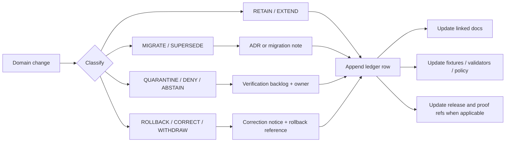

<!-- [KFM_META_BLOCK_V2]
doc_id: kfm://doc/TODO-VERIFY-atmosphere-air-preservation-ledger
title: Atmosphere / Air Preservation Ledger
type: standard
version: v1
status: draft
owners: TODO-VERIFY: atmosphere-air domain steward; documentation steward; policy steward
created: TODO-VERIFY-YYYY-MM-DD
updated: 2026-05-06
policy_label: public-draft-NEEDS_VERIFICATION
related: [../README.md, ../architecture/ARCHITECTURE.md, ./SOURCE_REGISTRY.md, ../../../adr/ADR-0312-atmosphere-air-source-role-boundaries.md, ../../../adr/ADR-0418-atmosphere-air-schema-slug-compatibility.md, ../../../adr/ADR-0431-atmosphere-air-knowledge-character-boundary.md, ../../../../connectors/pipelines/air/README.md, ../../../../data/processed/air/qa_summary.example.json, ../../../../data/receipts/air/run_receipt.example.json]
tags: [kfm, atmosphere-air, preservation-ledger, governance, lineage, evidence, release-boundary, rollback]
notes: [Revises repo-visible docs/domains/atmosphere_air/governance/PRESERVATION_LEDGER.md. Original 2026-04-27 retain/extend entries are preserved and expanded. doc_id, owners, created date, policy label, CODEOWNERS routing, final ADR acceptance state, CI status, source rights, release maturity, and full schema inventory remain NEEDS VERIFICATION.]
[/KFM_META_BLOCK_V2] -->

<a id="top"></a>

# Atmosphere / Air Preservation Ledger

Append-only record of what the Atmosphere / Air lane retains, extends, migrates, quarantines, supersedes, corrects, or rolls back as doctrine and implementation evidence evolve.

<p align="center">
  
  
  
  
  
  
</p>

<p align="center">
  <a href="#ledger-contract">Contract</a> ·
  <a href="#decision-vocabulary">Vocabulary</a> ·
  <a href="#preservation-ledger">Ledger</a> ·
  <a href="#preservation-matrix">Matrix</a> ·
  <a href="#update-triggers">Triggers</a> ·
  <a href="#rollback-and-correction">Rollback</a> ·
  <a href="#entry-template">Template</a> ·
  <a href="#open-verification-backlog">Open verification</a>
</p>

> [!IMPORTANT]
> This ledger preserves lineage. It does **not** authorize live source activation, public release, schema migration, UI/API binding, Focus Mode answers, or publication. Those actions require source-role, knowledge-character, rights, evidence, policy, review, release, correction, and rollback gates.

---

## Ledger contract

| Field | Value |
|---|---|
| Target path | `docs/domains/atmosphere_air/governance/PRESERVATION_LEDGER.md` |
| Responsibility root | `docs/` — human-facing governance and documentation control plane |
| Domain lane | `docs/domains/atmosphere_air/` |
| Ledger mode | Append-only by default; corrections must preserve original entry lineage |
| Maintainer action | Add one row per consequential lane-document, schema, source, policy, fixture, validator, release, rollback, or migration change |
| Upstream anchors | [`../README.md`](../README.md), [`../architecture/ARCHITECTURE.md`](../architecture/ARCHITECTURE.md), [`./SOURCE_REGISTRY.md`](./SOURCE_REGISTRY.md) |
| Decision anchors | [`ADR-0312`](../../../adr/ADR-0312-atmosphere-air-source-role-boundaries.md), [`ADR-0418`](../../../adr/ADR-0418-atmosphere-air-schema-slug-compatibility.md), [`ADR-0431`](../../../adr/ADR-0431-atmosphere-air-knowledge-character-boundary.md) |
| Implementation pressure | [`connectors/pipelines/air/README.md`](../../../../connectors/pipelines/air/README.md), `data/processed/air/`, `data/receipts/air/` |
| Public posture | Public release remains blocked unless release gates prove the artifact is public-safe |
| Proof posture | Run receipts, QA summaries, tiles, maps, summaries, and generated language are not sovereign truth |

### What belongs here

Add entries when any of these change:

- a prior atmosphere/air report, scaffold, ADR, or doc is retained, extended, superseded, or quarantined;
- the lane boundary changes between `atmosphere_air`, `air`, and `atmosphere`;
- a source family, parameter family, schema family, fixture family, validator, policy, layer, or release candidate is added or retired;
- a source-rights, source-role, evidence, freshness, public-release, or policy uncertainty blocks promotion;
- a rollback, correction, withdrawal, or supersession changes public meaning;
- a stale link, stale path, or authority conflict is discovered.

### What does not belong here

Do not use this ledger for:

- secrets, API keys, credentials, private endpoint details, or source tokens;
- raw source payloads or live operational data;
- full schema definitions;
- policy-as-code bodies;
- executable validator logic;
- unreviewed source claims presented as fact;
- deletion of historical ledger rows.

<p align="right"><a href="#top">Back to top ↑</a></p>

---

## Decision vocabulary

| Decision | Meaning | Required follow-through |
|---|---|---|
| `RETAIN` | Keep the artifact, rule, path, or concept as valid lineage or current guidance. | Link successor docs and preserve evidence basis. |
| `EXTEND` | Add detail while preserving the prior intent. | Record changed downstream docs, tests, registries, or policies. |
| `MIGRATE` | Move or translate a path, schema, slug, object, or convention. | Require ADR or migration note, compatibility fixture, and rollback target. |
| `SUPERSEDE` | Replace a prior governing surface with a stronger successor. | Mark the prior surface as lineage and link the successor. |
| `DEPRECATE` | Keep old material available but discourage new use. | State cutoff, replacement, and compatibility behavior. |
| `QUARANTINE` | Hold material because evidence, rights, schema, path, or policy support is insufficient. | Block public release and assign verification owner. |
| `ROLLBACK` | Revert a release, migration, alias, public artifact, or public claim to a prior known state. | Emit rollback reference and update correction/change surfaces. |
| `CORRECT` | Amend a prior public or internal statement without erasing the original. | Record reason, affected scope, evidence, and user-visible correction. |
| `WITHDRAW` | Remove a public artifact or claim from active use. | Preserve proof, receipt, release, and correction lineage. |

### Truth labels for entries

| Label | Use in this ledger |
|---|---|
| `CONFIRMED` | Verified from current repo-visible evidence, attached doctrine, or generated artifact evidence. |
| `LINEAGE` | Useful prior document, scaffold, packet, or report that informs continuity but is not current implementation proof by itself. |
| `PROPOSED` | Recommended change or future implementation not yet proven by repo evidence. |
| `NEEDS VERIFICATION` | Checkable before release or implementation claims can be made. |
| `UNKNOWN` | Not verified strongly enough. |
| `DENY` / `ABSTAIN` / `ERROR` | System outcomes or gate states, not prose emphasis. |

---

## Preservation ledger

| Date | Decision | Scope | Evidence status | Rationale | Follow-through |
|---|---|---|---:|---|---|
| 2026-04-21 | `RETAIN` + `EXTEND` | Prior Atmosphere / Air PDF-only architecture report and scaffold concepts | `LINEAGE` | The prior report defined useful lane families: source roles, knowledge characters, schemas, policies, dryrun artifacts, proof objects, and rollback expectations. It is planning lineage, not current repo proof. | Preserve as lineage; do not copy wholesale over repo conventions. |
| 2026-04-21 | `RETAIN` as lineage | Prior standalone atmosphere scaffold described in PDF lineage | `LINEAGE / NEEDS VERIFICATION` | The scaffold reportedly contained useful file families and tests, but the current target repo must govern file homes and compatibility. | Rebuild selectively only after repo inspection, ADR alignment, fixtures, and rollback plan. |
| 2026-04-27 | `RETAIN` | [`../README.md`](../README.md) | `CONFIRMED` | Existing domain doctrine retained as the landing contract for Atmosphere / Air. | Keep README as lane orientation; update when accepted inputs, exclusions, or trust posture change. |
| 2026-04-27 | `EXTEND` | New lane docs | `CONFIRMED / PROPOSED` | Companion docs were added to complete the Atmosphere / Air documentation set. | Keep companion docs synchronized with ADRs, registries, source roles, and release boundaries. |
| 2026-05-01 | `RETAIN` + `BOUND` | [`../../../../connectors/pipelines/air/README.md`](../../../../connectors/pipelines/air/README.md), `air_ingest.py`, `data/processed/air/qa_summary.example.json`, `data/receipts/air/run_receipt.example.json` | `CONFIRMED repo-visible / candidate only` | The no-network air slice is useful implementation pressure. Its QA summary remains a candidate and its run receipt remains process memory. | Do not treat connector success as publication, evidence closure, or release proof. |
| 2026-05-06 | `EXTEND` | [`../architecture/ARCHITECTURE.md`](../architecture/ARCHITECTURE.md) | `CONFIRMED repo-visible / draft` | Architecture now makes source role, knowledge character, public boundary, promotion, and no-network slice obligations more explicit. | Keep this ledger synchronized when architecture changes affect lineage, migration, release, or rollback. |
| 2026-05-06 | `RETAIN` + `EXTEND` | [`./SOURCE_REGISTRY.md`](./SOURCE_REGISTRY.md) | `CONFIRMED repo-visible / thin` | Source registry posture requires `source_id`, `source_role`, `knowledge_character`, publisher, rights, verification status, public-release flag, and verification date. | Extend registry details before activating live sources; unknown rights block public release. |
| 2026-05-06 | `MIGRATE` / `BRIDGE` | `atmosphere_air` docs lane, `air` no-network implementation slice, `atmosphere` whole-domain concept | `CONFIRMED / PROPOSED` | Repo-visible docs and tools use multiple slugs. The split is governed by ADR-0418 and must not be collapsed silently. | Use explicit alias records, compatibility fixtures, migration notes, and rollback targets before renaming. |
| 2026-05-06 | `RETAIN` + `EXTEND` | [`ADR-0312`](../../../adr/ADR-0312-atmosphere-air-source-role-boundaries.md) | `CONFIRMED repo-visible / draft` | Source-role and knowledge-character boundaries are trust-bearing for every consequential object. | Any source, schema, validator, layer, or Focus payload change must preserve these fields. |
| 2026-05-06 | `RETAIN` + `EXTEND` | [`ADR-0431`](../../../adr/ADR-0431-atmosphere-air-knowledge-character-boundary.md) | `CONFIRMED repo-visible / draft` | Knowledge-character boundaries prevent AQI, concentration, AOD, smoke masks, model fields, advisories, and fusion products from collapsing into one “air layer.” | Validator and policy fixtures must include anti-collapse denials. |
| 2026-05-06 | `QUARANTINE` | Public release of source families with unknown rights or unverified source roles | `NEEDS VERIFICATION` | Unknown rights, terms, cadence, source role, or public-release permission must block publication. | Keep public release denied until SourceDescriptors, rights checks, review, and promotion evidence exist. |
| 2026-05-06 | `QUARANTINE` | Stale or unverified domain-local ADR links referenced by repo-wide ADRs | `NEEDS VERIFICATION` | Some repo-visible ADRs reference domain-local ADR paths that need path verification before being treated as current files. | Verify paths; if missing, update references or create explicit lineage/supersession notes. |
| 2026-05-06 | `EXTEND` | This `PRESERVATION_LEDGER.md` revision | `CONFIRMED target exists / draft revision` | The previous ledger was intentionally thin. This revision preserves the original entries and adds vocabulary, append-only rules, trigger matrix, rollback rules, entry template, and verification backlog. | Treat future changes as append-only unless a correction entry explains the adjustment. |

<p align="right"><a href="#top">Back to top ↑</a></p>

---

## Preservation matrix

| Prior or current surface | Disposition | Why it is preserved | Risk if mishandled |
|---|---|---|---|
| Prior Atmosphere / Air architecture PDF | `RETAIN` + `EXTEND` as `LINEAGE` | Captures useful domain architecture, scaffold concepts, schema families, policy gates, and preservation expectations. | Overclaiming prior PDF/scaffold content as current repo implementation. |
| Prior 172-file standalone scaffold described in lineage | `RETAIN` as `LINEAGE`; rebuild selectively | Useful as a file-family and test-shape reference only. | Path collisions, duplicate schema authority, or resurrecting archive/scaffold behavior without repo review. |
| Domain README | `RETAIN` | Provides lane orientation, accepted inputs, exclusions, knowledge-character posture, and first-PR discipline. | Losing the public-facing domain contract. |
| Architecture doc | `EXTEND` | Holds end-to-end trust path and public-surface boundary. | Letting architecture become the only place operational knowledge lives. |
| Source registry posture | `EXTEND` | Defines required source metadata and public-release blocking state. | Invented rights, source activation without review, or missing source roles. |
| Unit and parameter rules | `RETAIN` + `EXTEND` | Preserves raw/normalized unit discipline and AQI/AOD/PM distinctions. | AQI-as-concentration or AOD-as-PM2.5 overclaim. |
| No-network air connector slice | `RETAIN` + `BOUND` | Provides deterministic candidate/receipt behavior without live-source risk. | Treating fixture output as real public truth. |
| QA summary example | `RETAIN` as candidate | Useful for validation and release-candidate rehearsal. | Treating `decision: candidate` as published evidence. |
| Run receipt example | `RETAIN` as process memory | Supports audit/replay context. | Treating a receipt as EvidenceBundle, ProofPack, or ReleaseManifest. |
| Schema family references | `MIGRATE` only through ADR | Existing references create compatibility pressure across `air`, `atmosphere`, and `atmosphere_air`. | Divergent machine schemas or silent slug drift. |
| Public source families with unknown rights | `QUARANTINE` | Rights, terms, cadence, and source role must be proven before public release. | Publishing unverifiable or unauthorized source-derived claims. |

---

## Update triggers

Every trigger below should produce either a new ledger row or a linked ADR/changelog entry.

| Trigger | Update this ledger when | Companion updates |
|---|---|---|
| New source family | A source is proposed, admitted, blocked, or retired. | `SOURCE_REGISTRY.md`, source descriptor registry, rights/security docs, verification backlog, fixtures. |
| New parameter or unit | A parameter, unit conversion, or averaging window changes. | Parameter registry, unit conversion docs, tests, policy reason codes. |
| Schema change | A schema is added, moved, renamed, aliased, or retired. | ADR-0418, schema registry, compatibility fixtures, migration history, validators. |
| Validator or policy change | A validator, denial code, Rego policy, or CI gate changes. | Validation status, policy docs, tests, open verification, rollback notes. |
| Promotion or release candidate | An artifact moves toward release. | Proof objects, release manifest, catalog matrix, rollback card, correction path. |
| Rollback or correction | A prior release, alias, public layer, or claim is corrected or rolled back. | Correction notice, rollback reference, changelog, Evidence Drawer state, this ledger. |
| New UI/API layer | A public map layer, Evidence Drawer payload, Focus Mode payload, export, or API response is proposed. | Map layer docs, API contracts, Focus/Drawer payload docs, public-boundary tests. |
| External source drift | Source endpoint, rights, method, cadence, version, or terms change. | Source registry, verification backlog, drift register, public-release gate. |
| Stale path discovered | A link, ADR path, schema path, or lifecycle path cannot be verified. | Link fix, supersession note, ADR update, or quarantine row. |

### Trigger flow



<p align="right"><a href="#top">Back to top ↑</a></p>

---

## Rollback and correction

Rollback and correction are first-class preservation events.

| Situation | Required ledger action | Minimum evidence |
|---|---|---|
| Bad public release | `ROLLBACK` row | Release manifest ref, rollback target, affected scope, reason, steward review. |
| Wrong source-role or knowledge-character classification | `CORRECT` row | Original classification, corrected classification, affected artifacts, EvidenceRefs, validator/policy update. |
| Schema alias failure | `ROLLBACK` or `QUARANTINE` row | Alias record, failing fixture, consumer list, prior working spec hash or schema ref. |
| Source rights revoked or unknown | `QUARANTINE` row | Source ID, rights state, public artifacts affected, denial reason, re-verification owner. |
| Stale map layer or API response | `CORRECT` or `WITHDRAW` row | Layer/API identifier, freshness failure, user-visible correction state. |
| EvidenceBundle resolution failure | `ABSTAIN` / `ERROR` entry if public claim was affected | EvidenceRef, resolver failure, impacted claim or artifact, remediation plan. |
| Removed or missing linked doc | `QUARANTINE` row | Missing path, referring docs, decision whether to restore, replace, or mark lineage. |

> [!CAUTION]
> Do not delete old ledger rows to “clean up” history. Add a correction row that states what changed, why, what evidence supports the correction, and which successor surface governs now.

---

## Entry template

Use this template for new entries when a table row is not enough.

```yaml
ledger_entry:
  date: YYYY-MM-DD
  decision: RETAIN | EXTEND | MIGRATE | SUPERSEDE | DEPRECATE | QUARANTINE | ROLLBACK | CORRECT | WITHDRAW
  scope:
    paths:
      - docs/domains/atmosphere_air/...
    object_families:
      - SourceDescriptor
      - EvidenceBundle
      - RunReceipt
      - ReleaseManifest
    source_families:
      - TODO-VERIFY
  evidence_status: CONFIRMED | LINEAGE | PROPOSED | NEEDS_VERIFICATION | UNKNOWN
  rationale: >
    Short explanation of why this decision preserves trust, evidence, policy,
    compatibility, or rollback discipline.
  required_companion_updates:
    docs:
      - TODO
    registries:
      - TODO
    schemas:
      - TODO
    policy:
      - TODO
    tests:
      - TODO
    release:
      - TODO
  public_release_effect: DENY | ABSTAIN | HOLD | NO_EFFECT | NEEDS_VERIFICATION
  rollback_or_correction:
    required: true
    target: TODO-VERIFY
    note: TODO-VERIFY
  owner: TODO-VERIFY
  review_by: TODO-VERIFY-YYYY-MM-DD
```

<p align="right"><a href="#top">Back to top ↑</a></p>

---

## Validation checklist

Before merging an update to this ledger:

- [ ] Existing ledger rows are preserved.
- [ ] New entry uses one of the defined decision terms.
- [ ] Entry distinguishes `CONFIRMED`, `LINEAGE`, `PROPOSED`, `NEEDS VERIFICATION`, and `UNKNOWN`.
- [ ] Relative links resolve from `docs/domains/atmosphere_air/governance/`.
- [ ] Any schema, slug, or path migration links to ADR-0418 or a successor ADR.
- [ ] Any source-role or knowledge-character change links to ADR-0312 and ADR-0431.
- [ ] Any public release, rollback, correction, or withdrawal has a release/proof/correction reference or is clearly marked `NEEDS VERIFICATION`.
- [ ] Any unknown source rights or public-release permission stays blocked.
- [ ] Any no-network, fixture, or candidate artifact remains labeled as candidate/process memory unless promoted by governed release gates.
- [ ] Any change affecting MapLibre, Evidence Drawer, Focus Mode, export, or public API maintains governed API and released-artifact boundaries.
- [ ] No row claims CI, tests, workflow enforcement, release maturity, dashboard behavior, or runtime behavior unless current evidence is linked.

---

## Open verification backlog

| Item | Status | Why it matters | Retire this uncertainty by |
|---|---:|---|---|
| Ledger `doc_id` | `TODO / NEEDS VERIFICATION` | Required for stable document identity. | Assign governed KFM document ID. |
| Owners | `TODO / NEEDS VERIFICATION` | Required for review, source activation, policy change, and rollback. | Confirm CODEOWNERS or steward assignment. |
| Created date | `TODO / NEEDS VERIFICATION` | Meta block should distinguish original creation from this revision. | Inspect Git history or prior PR. |
| Final policy label | `NEEDS VERIFICATION` | Determines whether this ledger is public, restricted, or governed-internal. | Confirm documentation policy label. |
| ADR acceptance state | `NEEDS VERIFICATION` | ADR-0312, ADR-0418, and ADR-0431 are repo-visible but draft/proposed. | Update ADR index and acceptance records. |
| Domain-local ADR references | `NEEDS VERIFICATION` | Some repo-wide ADRs refer to domain-local ADRs whose paths need verification. | Fetch path inventory and update stale links or lineage notes. |
| Schema inventory | `NEEDS VERIFICATION` | `air`, `atmosphere`, and `atmosphere_air` schema naming must not drift. | Run schema family inventory on active branch. |
| Source rights | `UNKNOWN` | Unknown rights block public release. | Verify source descriptors, terms, cadence, and public-release flags. |
| CI and validator enforcement | `UNKNOWN` | Documentation cannot claim executable enforcement without proof. | Capture repo-native test/CI output. |
| Release and rollback objects | `UNKNOWN` | Promotion must be a governed state transition with rollback target. | Verify release manifest, proof, rollback, and correction surfaces. |
| MapLibre / Evidence Drawer / Focus binding | `UNKNOWN` | Public surfaces must remain downstream of governed APIs and released artifacts. | Inspect UI/API implementation and payload tests. |

<p align="right"><a href="#top">Back to top ↑</a></p>
