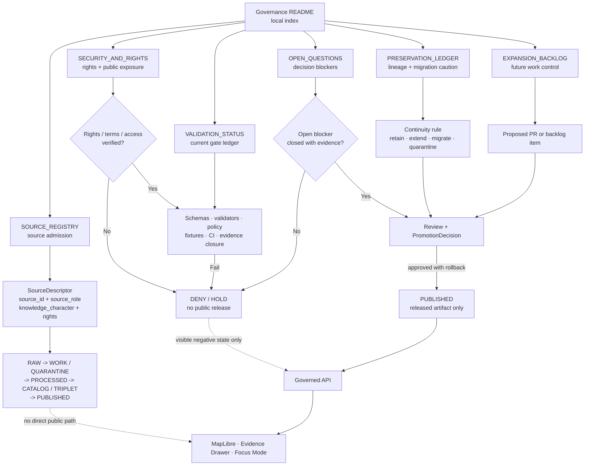

<!-- [KFM_META_BLOCK_V2]
doc_id: kfm://doc/TODO-VERIFY-docs-domains-atmosphere-air-governance-readme
title: Atmosphere / Air Governance
type: standard
version: v1
status: draft
owners: TODO-VERIFY: @bartytime4life; atmosphere-air domain steward; source steward; policy steward; release steward; docs steward
created: TODO-VERIFY-YYYY-MM-DD
updated: 2026-05-06
policy_label: public-draft-NEEDS_VERIFICATION
related: [../README.md, ../architecture/README.md, ../architecture/ARCHITECTURE.md, ../architecture/KNOWLEDGE_CHARACTER.md, ./SOURCE_REGISTRY.md, ./SECURITY_AND_RIGHTS.md, ./VALIDATION_STATUS.md, ./OPEN_QUESTIONS.md, ./EXPANSION_BACKLOG.md, ./PRESERVATION_LEDGER.md, ../../../adr/ADR-0312-atmosphere-air-source-role-boundaries.md, ../../../adr/ADR-0418-atmosphere-air-schema-slug-compatibility.md, ../../../../connectors/pipelines/air/README.md, ../../../../policy/air/air_qa.rego, ../../../../tools/validators/air/validate_air_qa.py]
tags: [kfm, atmosphere-air, governance, source-role, knowledge-character, rights, validation, policy, release, rollback, evidence]
notes: [Target path is repo-visible and previously contained only a blank README; this revision turns it into the local governance index. doc_id, owners, created date, final policy label, CODEOWNERS routing, CI enforcement, source-rights verification, schema inventory, release maturity, runtime API behavior, MapLibre binding, Evidence Drawer binding, and Focus Mode behavior remain NEEDS VERIFICATION.]
[/KFM_META_BLOCK_V2] -->

<a id="top"></a>

# Atmosphere / Air Governance

Governance index for Atmosphere / Air source admission, rights, validation, open decisions, preservation, release readiness, and rollback control.

<p align="center">
  
  
  
  
  
  
  
</p>

> [!NOTE]
> **Status:** `experimental`  
> **Document status:** `draft`  
> **Owners:** `TODO-VERIFY`  
> **Path:** `docs/domains/atmosphere_air/governance/README.md`  
> **Owning root:** `docs/` — human-facing control plane and domain documentation  
> **Current file role:** directory README for the Atmosphere / Air governance subfolder  
> **Publication posture:** documentation only; this file does not authorize live source activation, public release, API binding, MapLibre layer publication, Evidence Drawer claims, or Focus Mode answers.  
> **Quick jumps:** [Scope](#scope) · [Repo fit](#repo-fit) · [Accepted inputs](#accepted-inputs) · [Exclusions](#exclusions) · [Directory tree](#directory-tree) · [Governance surfaces](#governance-surfaces) · [Operating law](#operating-law) · [Gate map](#gate-map) · [Validation handoffs](#validation-handoffs) · [Quickstart](#quickstart) · [Definition of done](#definition-of-done) · [Open verification](#open-verification)

> [!IMPORTANT]
> Atmosphere / Air governance must preserve the distinction between **observations**, **AQI reports**, **regulatory archives**, **low-cost sensor candidates**, **model fields**, **remote-sensing masks**, **climate anomaly context**, **fusion products**, **advisories**, and **site/network context**. If KFM cannot prove the distinction, it should `ABSTAIN`, `DENY`, `ERROR`, `HOLD`, or quarantine rather than flatten uncertainty into a polished map.

> [!WARNING]
> Unknown rights, missing `source_role`, missing `knowledge_character`, unresolved EvidenceRefs, stale current-state support, or public access to RAW / WORK / QUARANTINE / unpublished candidate material must block public exposure.

---

## Scope

This README orients maintainers and reviewers inside:

```text
docs/domains/atmosphere_air/governance/
```

It explains which governance files own which part of the Atmosphere / Air trust surface, how those files connect to architecture, ADRs, source registries, validation, policy, release, and rollback work, and which claims are still `NEEDS VERIFICATION`.

This directory covers:

- human source-admission guidance;
- rights, terms, verification, attribution, and public-release posture;
- source-role and knowledge-character review;
- validation-status and publication-blocker tracking;
- open questions and decision closure requirements;
- preservation of prior Atmosphere / Air lineage;
- expansion backlog control;
- public-boundary and fail-closed governance for API, map, Evidence Drawer, Focus Mode, exports, and release candidates.

This directory does **not** store source-native data, machine source descriptors, executable schemas, policy code, validators, test fixtures, proof packs, release manifests, route handlers, UI components, runtime logs, dashboards, secrets, or publication approvals.

<p align="right"><a href="#top">Back to top ↑</a></p>

---

## Repo fit

This file belongs under `docs/` because it is human-facing governance documentation. It should guide executable surfaces, but it must not replace them.

| Relationship | Path | Status | Role |
|---|---|---:|---|
| Current README | `docs/domains/atmosphere_air/governance/README.md` | `CONFIRMED path / revised content` | Governance subfolder landing page. |
| Lane landing page | [`../README.md`](../README.md) | `CONFIRMED` | Whole-lane scope, accepted inputs, exclusions, knowledge characters, lifecycle, and public-boundary posture. |
| Architecture directory | [`../architecture/README.md`](../architecture/README.md) | `CONFIRMED` | Architecture navigation, renderer/API/Drawer/Focus boundaries, and co-change rules. |
| Main architecture | [`../architecture/ARCHITECTURE.md`](../architecture/ARCHITECTURE.md) | `CONFIRMED` | End-to-end trust path and bounded-context rules. |
| Knowledge-character guide | [`../architecture/KNOWLEDGE_CHARACTER.md`](../architecture/KNOWLEDGE_CHARACTER.md) | `CONFIRMED` | Atmosphere-specific epistemic taxonomy and anti-collapse rules. |
| Source-role ADR | [`../../../adr/ADR-0312-atmosphere-air-source-role-boundaries.md`](../../../adr/ADR-0312-atmosphere-air-source-role-boundaries.md) | `CONFIRMED / draft` | Repo-wide source-role and knowledge-character boundary decision. |
| Slug compatibility ADR | [`../../../adr/ADR-0418-atmosphere-air-schema-slug-compatibility.md`](../../../adr/ADR-0418-atmosphere-air-schema-slug-compatibility.md) | `CONFIRMED / proposed` | Compatibility boundary between `atmosphere_air`, `air`, and `atmosphere`. |
| No-network connector slice | [`../../../../connectors/pipelines/air/README.md`](../../../../connectors/pipelines/air/README.md) | `REPO-REFERENCED / candidate-only` | Candidate and receipt producer; not live source activation or publication. |
| Air QA policy fragment | [`../../../../policy/air/air_qa.rego`](../../../../policy/air/air_qa.rego) | `REPO-REFERENCED / NEEDS VERIFICATION` | Policy pressure; enforcement and CI status must be verified. |
| Air QA validator | [`../../../../tools/validators/air/validate_air_qa.py`](../../../../tools/validators/air/validate_air_qa.py) | `REPO-REFERENCED / NEEDS VERIFICATION` | Validator pressure; referenced schema inventory and execution status must be verified. |

### Directory Rules basis

Under KFM Directory Rules, domain-specific work belongs under responsibility roots, not root-level topic buckets. This README stays under `docs/domains/atmosphere_air/governance/` because it is human-facing domain governance.

| Concern | Proper responsibility root | Atmosphere / Air posture |
|---|---|---:|
| Human governance docs | `docs/` | `CONFIRMED` for this documentation surface. |
| Machine source descriptors | `data/registry/` | `NEEDS VERIFICATION`. |
| Semantic contracts | `contracts/` | `NEEDS VERIFICATION`. |
| Machine schemas | `schemas/` | `NEEDS VERIFICATION`. |
| Policy-as-code | `policy/` | `NEEDS VERIFICATION`. |
| Fixtures and tests | `fixtures/`, `tests/` | `NEEDS VERIFICATION`. |
| Validators and publishers | `tools/`, `scripts/`, `packages/` | `REPO-REFERENCED / NEEDS VERIFICATION`. |
| Connector code | `connectors/` | `REPO-REFERENCED / candidate-only`. |
| Lifecycle artifacts | `data/raw/`, `data/work/`, `data/quarantine/`, `data/processed/`, `data/receipts/`, `data/proofs/`, `data/catalog/`, `data/published/` | Stage-specific; public access must be governed. |
| Release state and rollback | `release/` or repo-confirmed release root | `NEEDS VERIFICATION`. |
| API and UI runtime | `apps/`, `web/`, `ui/`, or repo-confirmed runtime roots | `UNKNOWN / NEEDS VERIFICATION`. |

> [!CAUTION]
> `atmosphere_air` is the current documentation lane, `air` is the current no-network implementation/tooling slice, and `atmosphere` is a proposed whole-domain schema concept until ADR-backed schema inventory, fixtures, validators, tests, and release checks prove otherwise.

<p align="right"><a href="#top">Back to top ↑</a></p>

---

## Accepted inputs

Use this folder for governance guidance, review control, and navigation.

| Accepted input | Belongs here when it… | Primary file |
|---|---|---|
| Source-admission guidance | Defines the source fields, source roles, knowledge characters, rights posture, and activation gates required before source use. | [`SOURCE_REGISTRY.md`](./SOURCE_REGISTRY.md) |
| Rights and security posture | Explains unknown-rights denial, secret handling, public-release gates, and public-surface boundaries. | [`SECURITY_AND_RIGHTS.md`](./SECURITY_AND_RIGHTS.md) |
| Validation status | Tracks current validation inventory, blockers, reason codes, object-family validation status, and runnable-check readiness. | [`VALIDATION_STATUS.md`](./VALIDATION_STATUS.md) |
| Open decisions | Records unresolved path, schema, source, validation, policy, release, UI/API, Focus, owner, and CI questions. | [`OPEN_QUESTIONS.md`](./OPEN_QUESTIONS.md) |
| Preservation decisions | Keeps prior Atmosphere / Air lineage, useful concepts, migration risks, and no-loss expectations visible. | [`PRESERVATION_LEDGER.md`](./PRESERVATION_LEDGER.md) |
| Expansion backlog | Captures future source, schema, validator, policy, UI/API, release, and rollback work without promoting it to current fact. | [`EXPANSION_BACKLOG.md`](./EXPANSION_BACKLOG.md) |
| Governance index updates | Clarify file ownership, accepted inputs, exclusions, directory map, and cross-file handoffs. | [`README.md`](./README.md) |

<p align="right"><a href="#top">Back to top ↑</a></p>

---

## Exclusions

| Does not belong here | Correct home | Why |
|---|---|---|
| API keys, tokens, credentials, private endpoint details, `.env` content, privileged logs | Secure runtime/config systems outside public docs | Governance Markdown must not become a secret-disclosure surface. |
| RAW source payloads | `data/raw/air/`, `data/raw/atmosphere/`, or repo-confirmed RAW home | Source-native data must preserve lifecycle and access controls. |
| WORK transforms, normalization drafts, QA internals | `data/work/...` or repo-confirmed WORK home | Working material requires receipts and validation state. |
| Rights-unclear or policy-failed material | `data/quarantine/...` or repo-confirmed quarantine home | Unknown rights or unsafe material fails closed. |
| Processed candidates | `data/processed/air/` or repo-confirmed processed home | Candidate material is not public truth. |
| Run receipts | `data/receipts/air/` or repo-confirmed receipts home | Receipts are process memory, not proof or release authority. |
| EvidenceBundles, proof packs, catalog matrices | `data/proofs/`, `data/catalog/`, or repo-confirmed proof/catalog homes | Generated trust artifacts must stay inspectable and stage-separated. |
| Machine schemas | `schemas/` or ADR-approved schema home | Markdown explains shape pressure; schemas validate shape. |
| Human semantic contracts | `contracts/` or repo-approved contract home | Object meaning belongs in contracts. |
| Executable policy | `policy/` | Policy-as-code must be testable and reviewable. |
| Validators, publishers, migration tools | `tools/`, `scripts/`, `packages/` | Enforcement does not belong in prose. |
| Connector implementation | `connectors/` | Connectors produce candidates and receipts, not governance text. |
| API route handlers, UI components, MapLibre code, Focus runtime | `apps/`, `web/`, `ui/`, or repo-confirmed runtime roots | Runtime surfaces consume governed envelopes and released artifacts only. |
| Public-release approvals | `release/`, proof/release manifests, review records, or repo-confirmed release root | Publication is a governed state transition, not a README update. |

<p align="right"><a href="#top">Back to top ↑</a></p>

---

## Directory tree

Current repo-visible governance files for this lane:

```text
docs/domains/atmosphere_air/governance/
├── README.md              # this governance directory index
├── EXPANSION_BACKLOG.md   # future work queue and deferred capability control
├── OPEN_QUESTIONS.md      # unresolved governance and release blockers
├── PRESERVATION_LEDGER.md # lineage, retained concepts, migration/carry-forward posture
├── SECURITY_AND_RIGHTS.md # rights, terms, public-release, secrets, and exposure guardrails
├── SOURCE_REGISTRY.md     # human source-admission and source-role requirements
└── VALIDATION_STATUS.md   # validation inventory, blocked gates, reason codes, status ledger
```

> [!NOTE]
> This tree is confirmed for the documentation surface. It does not prove executable schemas, source registry instances, policy enforcement, validator execution, passing tests, CI enforcement, route behavior, public layer publication, Evidence Drawer binding, Focus Mode behavior, release manifests, or rollback artifacts.

<p align="right"><a href="#top">Back to top ↑</a></p>

---

## Governance surfaces

| File | Owns | Must not own | Update when… |
|---|---|---|---|
| [`README.md`](./README.md) | Directory orientation, repo fit, inputs/exclusions, governance map, handoffs, review checklist. | Machine source descriptors, policy code, proof packs, release approvals. | A governance file is added, moved, renamed, deprecated, or materially changes role. |
| [`SOURCE_REGISTRY.md`](./SOURCE_REGISTRY.md) | Human source-admission minimums: `source_id`, `source_role`, `knowledge_character`, publisher, rights, verification, public-release flag. | Source-native payloads, live source activation, machine descriptor registry. | Source family, descriptor field, source role, knowledge character, rights posture, or activation rule changes. |
| [`SECURITY_AND_RIGHTS.md`](./SECURITY_AND_RIGHTS.md) | Unknown-rights denial, public-release gates, no-secret rules, public-boundary constraints, source-family rights posture. | Secrets, private endpoint details, executable policy. | Rights, terms, access class, public-release posture, secret-handling, or exposure boundary changes. |
| [`VALIDATION_STATUS.md`](./VALIDATION_STATUS.md) | Current validation inventory, blocked gates, reason codes, object-family status, command readiness, validation definition of done. | Passing-status claims without run evidence. | Schema inventory, validator, policy, fixture, test, CI, EvidenceBundle, release, or rollback status changes. |
| [`OPEN_QUESTIONS.md`](./OPEN_QUESTIONS.md) | Unresolved questions and closure standards for source activation, schema compatibility, validation, API/UI, Focus, release, owners, and CI. | Hidden decision record or issue tracker replacement. | A blocker is answered, superseded, converted to ADR, reopened, or newly discovered. |
| [`PRESERVATION_LEDGER.md`](./PRESERVATION_LEDGER.md) | Retain/extend/migrate/quarantine decisions for prior Atmosphere / Air lineage and current surface continuity. | Current implementation proof unless repo evidence confirms it. | Prior artifacts, scaffold lineage, migrations, rollback implications, or continuity decisions change. |
| [`EXPANSION_BACKLOG.md`](./EXPANSION_BACKLOG.md) | Prioritized future work and deferred governance/implementation slices. | Current implementation status or public-release approval. | A backlog item changes priority, dependency, owner, blocker, or completion standard. |

<p align="right"><a href="#top">Back to top ↑</a></p>

---

## Operating law

The Atmosphere / Air governance directory exists to keep this chain visible:

```text
source identity + source role + knowledge character + rights
  -> lifecycle integrity
  -> evidence closure
  -> policy decision
  -> review state
  -> release state
  -> correction and rollback path
  -> governed public surface
```

| Rule | Governance consequence |
|---|---|
| `source_role` is required. | Public and semi-public claims must know whether support comes from an observation, report, archive, model, mask, advisory, fusion product, or context source. |
| `knowledge_character` is required. | Atmosphere objects must say what kind of knowledge they are before interpretation, mapping, summarization, or release. |
| Unknown rights block public release. | Unknown terms, attribution, redistribution, access, rate-limit, or automation posture must produce `DENY` for public release. |
| Evidence resolves before explanation. | Consequential claims require `EvidenceRef -> EvidenceBundle` or return `ABSTAIN`, `DENY`, or `ERROR`. |
| Receipts are not proof. | A run receipt can support audit and replay, but it cannot replace EvidenceBundle, proof pack, ReleaseManifest, or PromotionDecision. |
| Candidates are not publication. | No-network `air` artifacts, processed candidates, and fixtures remain candidate/process material until promoted. |
| Public clients use governed surfaces only. | Public API, MapLibre, Evidence Drawer, Focus Mode, export, search, screenshots, and stories must not read RAW, WORK, QUARANTINE, connector-private, normalization-stage, or unpublished candidate artifacts directly. |
| Derived products stay derived. | NowCast-like reports, AOD, smoke masks, model fields, fusion products, graph deltas, tiles, and AI summaries must expose source role, method, uncertainty, inputs, and release state. |
| Ambiguity fails closed. | Missing support, stale support, conflicted source roles, or unresolved policy does not become confident prose. |
| Publication is reversible. | Release requires correction path, rollback target, and user-visible state for withdrawal, supersession, or stale material. |

<p align="right"><a href="#top">Back to top ↑</a></p>

---

## Gate map



### Required gate outcomes

| Gate | Required proof | Failure outcome |
|---|---|---|
| Source identity | Stable `source_id`, publisher/steward, source role, and knowledge character. | `DENY` |
| Rights | License/terms, attribution, redistribution, access, automation, and public-release posture verified. | `DENY` |
| Schema | Active schema family and compatibility path are confirmed. | `ERROR` or `DENY` |
| Evidence | EvidenceRefs resolve to EvidenceBundle for consequential claims. | `ABSTAIN` or `DENY` |
| Policy | Rights, source-role, public-surface, freshness, release, and anti-collapse rules pass. | `DENY`, `ABSTAIN`, or `ERROR` |
| Review | Required steward/domain/policy/release review is recorded. | `HOLD` |
| Release | ReleaseManifest or equivalent includes hashes, proof refs, correction path, and rollback target. | `DENY` |
| Runtime | API/Map/Drawer/Focus consumes governed released artifacts or review-authorized envelopes. | `DENY` |

<p align="right"><a href="#top">Back to top ↑</a></p>

---

## Validation handoffs

| Governance rule | Downstream proof surface | Status |
|---|---|---:|
| Source descriptors require `source_id`, `source_role`, `knowledge_character`, rights, verification, and public-release flag. | Machine source registry, descriptor schema, descriptor validator, invalid fixtures. | `NEEDS VERIFICATION` |
| AQI is not concentration. | Unit/parameter tests, policy denial, API/Drawer/Focus fixtures. | `PARTIAL / NEEDS VERIFICATION` |
| AOD is not PM2.5. | Unit/parameter tests, model-assumption gate, policy denial. | `NEEDS VERIFICATION` |
| Smoke masks are not exposure measurements. | Knowledge-character enum, mask schema, policy denial, Drawer caveat fixture. | `NEEDS VERIFICATION` |
| Model fields are not observations. | Model-field schema, invalid model-as-observation fixture, policy denial. | `PARTIAL / NEEDS VERIFICATION` |
| Low-cost sensors need correction and caveats. | Source descriptor, correction method field, caveat/confidence fixture, policy denial. | `NEEDS VERIFICATION` |
| Fusion products expose inputs, method, uncertainty, and transform identity. | Fusion schema, EvidenceRefs, transform hash, catalog/proof validator. | `NEEDS VERIFICATION` |
| Unknown rights deny public release. | Policy test, release-candidate validator, source-rights review card. | `PARTIAL / NEEDS VERIFICATION` |
| Public surfaces cannot read internal lifecycle zones. | Publisher checks, API tests, layer descriptor tests, Focus context tests. | `PARTIAL / NEEDS VERIFICATION` |
| Run receipts remain process memory. | Receipt/proof split tests, release manifest validator, documentation warnings. | `PARTIAL / NEEDS VERIFICATION` |
| Release is reversible. | ReleaseManifest, CorrectionNotice, RollbackCard, rollback drill or receipt. | `NEEDS VERIFICATION` |
| Focus Mode cites or abstains. | Finite response envelope, citation validator, AI receipt, negative-path tests. | `UNKNOWN / NEEDS VERIFICATION` |

### Mandatory negative-path fixtures

At minimum, governance should be backed by invalid fixtures for:

- missing `source_role` → `DENY`;
- missing `knowledge_character` → `DENY`;
- unknown rights on public release → `DENY`;
- AQI treated as concentration → `DENY`;
- AOD treated as PM2.5 → `DENY`;
- model field labeled as observation → `DENY`;
- smoke mask treated as exposure → `DENY` or `ABSTAIN`;
- low-cost sensor without correction/caveat support → `DENY`;
- fusion product hiding inputs or method → `DENY`;
- public API/layer/Focus request pointing at RAW, WORK, QUARANTINE, connector-private, normalization-stage, or unpublished candidate artifact → `DENY`;
- run receipt used as proof → `DENY`;
- fixture-backed candidate promoted as real public truth → `DENY`;
- release candidate without rollback target → `HOLD` or `DENY`;
- current-state answer with stale or unknown freshness → `ABSTAIN`.

<p align="right"><a href="#top">Back to top ↑</a></p>

---

## Quickstart

Use this sequence after accessing the real repository or governed fork. The commands are inspection-oriented and should not publish, fetch live sources, or mutate release state.

```bash
# Confirm active repository state.
git status --short
git branch --show-current || true
git rev-parse --show-toplevel || true

# Inspect this governance surface.
find docs/domains/atmosphere_air/governance -maxdepth 2 -type f | sort

# Inspect adjacent docs and ADRs.
find docs/domains/atmosphere_air -maxdepth 3 -type f | sort
find docs/adr -maxdepth 1 -type f | sort | grep -E '0312|0418|0001|0002|0431' || true

# Inspect known air / atmosphere implementation-pressure surfaces without assuming final authority.
find connectors/pipelines/air \
     pipelines/normalize/domains/atmosphere \
     tools/validators/air \
     tools/publishers/air \
     policy/air \
     data/processed/air \
     data/receipts/air \
     -maxdepth 3 -type f 2>/dev/null | sort

# Inspect active schema families without assuming which slug is canonical.
find schemas/contracts/v1 -maxdepth 4 -type f 2>/dev/null \
  | sort \
  | grep -E '/(air|atmosphere)/' || true

# Parse known no-network examples when present.
python -m json.tool data/processed/air/qa_summary.example.json >/dev/null 2>&1 || true
python -m json.tool data/receipts/air/run_receipt.example.json >/dev/null 2>&1 || true

# Run candidate validators only after referenced schemas are confirmed.
python tools/validators/air/validate_air_qa.py \
  data/processed/air/qa_summary.example.json
```

> [!WARNING]
> Do not run live source fetchers, publish public artifacts, bind public UI/API routes, or mark release objects as public from this README. This file is a governance index, not a release decision.

<p align="right"><a href="#top">Back to top ↑</a></p>

---

## Definition of done

A revision to this governance README is ready for review when:

- [ ] KFM Meta Block V2 is present and unresolved values are explicit.
- [ ] Status, owners, path, owning root, and policy label are visible.
- [ ] README-like minimums are present: title, one-line purpose, repo fit, accepted inputs, and exclusions.
- [ ] Directory Rules placement is preserved under `docs/domains/atmosphere_air/governance/`.
- [ ] Governance sibling files are linked with relative links from this directory.
- [ ] Machine/runtime handoffs are routed to responsibility roots and labeled `NEEDS VERIFICATION` unless verified.
- [ ] `source_role` and `knowledge_character` remain load-bearing.
- [ ] Unknown rights block public release.
- [ ] EvidenceRef-to-EvidenceBundle closure is required for consequential claims.
- [ ] Receipts, candidates, proof objects, release manifests, and rollback objects are kept separate.
- [ ] AQI, concentration, AOD, smoke masks, model fields, advisories, fusion products, site metadata, and observations remain distinct.
- [ ] Public API, MapLibre, Evidence Drawer, Focus Mode, export, search, and story surfaces remain downstream of governed API and released artifacts.
- [ ] No executable enforcement, schema, policy, CI, route, UI, dashboard, release, or runtime claim is made without direct evidence.
- [ ] `OPEN_QUESTIONS.md`, `VALIDATION_STATUS.md`, `SECURITY_AND_RIGHTS.md`, `SOURCE_REGISTRY.md`, `PRESERVATION_LEDGER.md`, and `EXPANSION_BACKLOG.md` impacts are considered.
- [ ] Any schema-slug or path migration includes ADR, compatibility fixture, validation, migration note, and rollback target.

<p align="right"><a href="#top">Back to top ↑</a></p>

---

## FAQ

<details>
<summary><strong>Does this governance README approve public Atmosphere / Air release?</strong></summary>

No. It is a navigation and review-control document. Public release requires source rights, evidence closure, policy approval, review state, ReleaseManifest or equivalent release object, correction path, and rollback target.
</details>

<details>
<summary><strong>Why keep `atmosphere_air`, `air`, and `atmosphere` visible?</strong></summary>

Because the current repo-visible documentation lane, implementation slice, and whole-domain concept use different names. Collapsing them silently could break validators, release candidates, receipts, docs, schemas, policy, and UI/API expectations.
</details>

<details>
<summary><strong>Can the no-network air candidate be used as public truth?</strong></summary>

No. No-network candidates and run receipts are useful for dry runs, validation, and release rehearsal. They are not public truth and must not be promoted as real-world observations.
</details>

<details>
<summary><strong>What should happen when sources disagree?</strong></summary>

Preserve disagreement. Do not force one truth. The lane should expose source role, knowledge character, freshness, rights, review state, and conflict state. A fusion product may summarize disagreement only as `DERIVED_FUSION` with visible input EvidenceRefs, method, uncertainty, and transform identity.
</details>

---

## Open verification

| Item | Status | Why it matters |
|---|---:|---|
| Stable `doc_id` | `TODO / NEEDS VERIFICATION` | Required for document registry and durable cross-reference. |
| Owners / CODEOWNERS routing | `TODO / NEEDS VERIFICATION` | Required for source activation, policy changes, release approvals, and rollback decisions. |
| Created date | `TODO / NEEDS VERIFICATION` | Should come from Git history or document registry. |
| Final policy label | `TODO / NEEDS VERIFICATION` | Determines public/restricted posture. |
| Governance README review ownership | `NEEDS VERIFICATION` | Prevents unowned governance changes. |
| ADR-0312 status | `draft / NEEDS VERIFICATION` | Source-role and knowledge-character rules must be accepted and enforced before strong claims. |
| ADR-0418 status | `proposed / NEEDS VERIFICATION` | Schema/slug compatibility remains release-critical. |
| Active schema family | `NEEDS VERIFICATION` | Prevents `air` / `atmosphere` / `atmosphere_air` authority drift. |
| Source registry machine home | `NEEDS VERIFICATION` | This folder explains source admission; it is not the machine registry. |
| Source rights and terms | `UNKNOWN` | Public release remains denied while rights are unresolved. |
| Validator execution | `NOT RUN HERE` | Tool references are not passing validation evidence. |
| Policy enforcement | `NEEDS VERIFICATION` | Rego or repo-native policy must be executed before enforcement is claimed. |
| Air tests and CI result | `UNKNOWN` | Test files/workflow references do not prove a passing run. |
| Public API route names and behavior | `UNKNOWN` | Do not invent route names or runtime envelopes without repo evidence. |
| MapLibre layer registry binding | `UNKNOWN` | Layer docs do not prove released map behavior. |
| Evidence Drawer implementation | `UNKNOWN` | Payload rules need runtime/component proof. |
| Focus Mode implementation | `UNKNOWN` | Finite outcome and citation rules need runtime proof. |
| Release manifests, correction notices, rollback cards | `NEEDS VERIFICATION` | Publication maturity cannot be claimed from docs alone. |
| Live source activation | `BLOCKED` | Requires source descriptors, rights, terms, cadence, validation, policy, review, release, and rollback evidence. |

<p align="right"><a href="#top">Back to top ↑</a></p>

---

## Appendix: governance review card

<details>
<summary><strong>Reviewer checklist card</strong></summary>

```yaml
target_file: docs/domains/atmosphere_air/governance/README.md
owning_root: docs/
domain_lane: atmosphere_air

must_preserve:
  - source_role is required
  - knowledge_character is required
  - unknown rights deny public release
  - EvidenceRef resolves to EvidenceBundle before consequential claims
  - AQI is not concentration
  - AOD is not PM2.5
  - smoke masks are not exposure measurements
  - model fields are not observations
  - fusion products expose inputs, method, uncertainty, and transform identity
  - run receipts are process memory, not proof
  - candidates are not publication
  - public clients use governed API and released artifacts only
  - publication has correction path and rollback target

check_before_merge:
  - relative links resolve from governance/
  - meta block values are synchronized or marked NEEDS VERIFICATION
  - no executable enforcement is claimed without evidence
  - no schema-home or slug migration is hidden in prose
  - adjacent SOURCE_REGISTRY, SECURITY_AND_RIGHTS, VALIDATION_STATUS, OPEN_QUESTIONS, PRESERVATION_LEDGER, and EXPANSION_BACKLOG impact is considered

rollback:
  - revert README change
  - reopen any verification item incorrectly marked confirmed
  - restore prior navigation if a companion file was moved or renamed
  - preserve lineage and correction notes
```

</details>

<details>
<summary><strong>Anti-patterns this README should prevent</strong></summary>

| Anti-pattern | Why it fails | Correct response |
|---|---|---|
| Treating a README as release approval | Prose is not a PromotionDecision. | Require proof, policy, review, release manifest, correction path, and rollback. |
| Treating `air` and `atmosphere` as interchangeable | Slug drift can break schemas, validators, data, release candidates, and UI/API payloads. | Use ADR-0418 or successor migration with tests and rollback. |
| Treating AQI as raw concentration | AQI/report semantics differ from raw measurement. | Preserve `PUBLIC_AQI_REPORT` and caveats. |
| Treating AOD as PM2.5 | AOD is optical context unless transformed by a governed model. | Require model assumptions and evidence or deny. |
| Treating smoke masks as exposure | Remote-sensing masks are classification/support layers. | Preserve `REMOTE_SENSING_MASK` and abstain/deny exposure claims. |
| Treating a run receipt as proof | Receipts are process memory. | Use EvidenceBundle, proof pack, release manifest, and policy decision. |
| Letting Focus Mode answer from model memory | Generated language is not evidence. | Scope to admissible EvidenceBundles and cite or abstain. |
| Publishing no-network fixtures | Fixtures are test material. | Keep as candidate/dry-run only. |
| Allowing public UI to filter restricted fields client-side | UI filtering is not a safety boundary. | Emit only public-safe governed payloads. |

</details>

<p align="right"><a href="#top">Back to top ↑</a></p>
