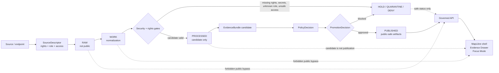

<!-- [KFM_META_BLOCK_V2]
doc_id: kfm://doc/TODO-VERIFY-UUID-atmosphere-air-security-and-rights
title: Atmosphere / Air Security and Rights
type: standard
version: v1
status: draft
owners: TODO-VERIFY: atmosphere-air domain steward, source steward, policy steward, release steward
created: TODO-VERIFY-YYYY-MM-DD
updated: 2026-05-06
policy_label: TODO-VERIFY-public-or-restricted
related: [../README.md, ./SOURCE_REGISTRY.md, ./VALIDATION_STATUS.md, ../architecture/ARCHITECTURE.md, ../architecture/UNIT_CONVERSIONS.md, ../architecture/FOCUS_DRAWER_PAYLOADS.md, ../../../adr/ADR-0418-atmosphere-air-schema-slug-compatibility.md, ../../../../connectors/pipelines/air/README.md, ../../../../policy/air/air_qa.rego, ../../../../tools/validators/air/validate_air_qa.py]
tags: [kfm, atmosphere-air, security, rights, source-role, knowledge-character, public-release, fail-closed, governed-domain]
notes: [doc_id, owners, created date, and policy_label remain TODO/NEEDS VERIFICATION; this revision expands the prior thin security-and-rights stub without claiming runtime enforcement, CI status, live source activation, or public release maturity.]
[/KFM_META_BLOCK_V2] -->

<a id="top"></a>

# Atmosphere / Air Security and Rights

Security, rights, access, and public-release guardrails for Atmosphere / Air sources, candidates, governed APIs, map layers, Evidence Drawer payloads, Focus Mode responses, and released artifacts.

<p align="center">
  
  
  
  
  
</p>

<p align="center">
  <a href="#status-snapshot">Status</a> ·
  <a href="#scope">Scope</a> ·
  <a href="#repo-fit">Repo fit</a> ·
  <a href="#operating-law">Operating law</a> ·
  <a href="#accepted-inputs">Inputs</a> ·
  <a href="#exclusions">Exclusions</a> ·
  <a href="#rights-and-release-gates">Rights gates</a> ·
  <a href="#security-boundaries">Security</a> ·
  <a href="#source-family-posture">Source posture</a> ·
  <a href="#validation-and-denial-matrix">Validation</a> ·
  <a href="#quickstart">Quickstart</a> ·
  <a href="#open-verification">Open verification</a>
</p>

> [!IMPORTANT]
> Atmosphere / Air publication is **deny-by-default**. Unknown rights, unknown source role, missing `knowledge_character`, unresolved EvidenceRefs, unverified public-release permission, stale live-state support, or public access to internal lifecycle zones must block public exposure.

---

## Status snapshot

| Field | Status |
|---|---|
| Target file | `docs/domains/atmosphere_air/governance/SECURITY_AND_RIGHTS.md` |
| Document role | Standard governance doc for Atmosphere / Air rights, access, public-release, and exposure boundaries. |
| Prior state | CONFIRMED repo-visible thin stub: rights rules and security rules existed but did not yet carry the full KFM metadata, lane context, denial matrix, or release review checklist. |
| Current posture | Draft governance expansion; source activation and public release remain blocked until rights, terms, source role, evidence, validation, policy, review, release, and rollback evidence are verified. |
| Enforcement maturity | NEEDS VERIFICATION: this document does not prove policy engine coverage, CI enforcement, deployed API behavior, live source connectors, or public MapLibre/Focus integration. |
| Safe merge mode | Documentation-only or governance-doc PR; no live fetch, no public publication, no credential handling, no release-state upgrade by documentation alone. |

---

## Scope

This file defines security and rights expectations for the **Atmosphere / Air** domain lane.

It governs how maintainers should treat:

- source descriptors and source-family candidates;
- rights, terms, redistribution, attribution, and automation constraints;
- access modes, credentials, secrets, and endpoint exposure;
- processed candidates, run receipts, EvidenceBundle candidates, catalog/proof candidates, layer descriptors, and release candidates;
- public-facing map, API, Evidence Drawer, Focus Mode, export, and story surfaces.

It does **not** define the full executable policy implementation, source schemas, connector code, runtime route handlers, public UI components, or release manifests. Those belong in their responsibility roots and must link back here when they carry Atmosphere / Air security or rights burden.

### Security-and-rights goal

KFM must preserve this chain before any Atmosphere / Air claim becomes public:

```text
source rights + source role + knowledge character
  -> evidence and lifecycle integrity
  -> validation and policy
  -> review and release
  -> public-safe governed surface
```

A technically valid air-quality artifact is not automatically public-safe. A public-looking dataset is not automatically redistributable. A generated map layer is not evidence closure. A model answer is not policy approval.

<p align="right"><a href="#top">Back to top ↑</a></p>

---

## Repo fit

This document belongs under `docs/` because it is human-facing governance documentation for a domain lane. It should guide, but not duplicate, the machine schemas, policy-as-code, validators, source registry, connector implementation, lifecycle data, or release artifacts.

| Relationship | Path | Status | Role |
|---|---|---:|---|
| Domain landing page | [`../README.md`](../README.md) | CONFIRMED repo-visible | Lane scope, accepted inputs, exclusions, knowledge characters, governed flow, and first-PR discipline. |
| Source registry posture | [`./SOURCE_REGISTRY.md`](./SOURCE_REGISTRY.md) | CONFIRMED repo-visible | Required source descriptor fields and source-role expectations. |
| Validation status | [`./VALIDATION_STATUS.md`](./VALIDATION_STATUS.md) | CONFIRMED repo-visible | Current validation inventory and pending schema/fixture/validator/policy verification. |
| Architecture | [`../architecture/ARCHITECTURE.md`](../architecture/ARCHITECTURE.md) | CONFIRMED repo-visible | Trust path, source-role boundary, knowledge-character anti-collapse rules, public-surface contract. |
| Unit conversions | [`../architecture/UNIT_CONVERSIONS.md`](../architecture/UNIT_CONVERSIONS.md) | CONFIRMED repo-visible | Raw-plus-normalized value handling and forbidden conversions. |
| Focus / Evidence Drawer payloads | [`../architecture/FOCUS_DRAWER_PAYLOADS.md`](../architecture/FOCUS_DRAWER_PAYLOADS.md) | CONFIRMED repo-visible | Public UI payload expectations, finite Focus outcomes, evidence and policy requirements. |
| Slug compatibility ADR | [`../../../adr/ADR-0418-atmosphere-air-schema-slug-compatibility.md`](../../../adr/ADR-0418-atmosphere-air-schema-slug-compatibility.md) | CONFIRMED repo-visible / proposed decision | Compatibility boundary between `atmosphere_air`, `air`, and `atmosphere`. |
| No-network connector | [`../../../../connectors/pipelines/air/README.md`](../../../../connectors/pipelines/air/README.md) | CONFIRMED repo-visible | Candidate and receipt producer; not public publication. |
| Air QA policy | `../../../../policy/air/air_qa.rego` | REPO-REFERENCED / NEEDS VERIFICATION | Policy fragment; full enforcement and CI status must be verified. |
| Air QA validator | `../../../../tools/validators/air/validate_air_qa.py` | REPO-REFERENCED / NEEDS VERIFICATION | Validator pressure; schema inventory and test status must be verified. |
| Release-candidate tooling | `../../../../tools/publishers/air/` | REPO-REFERENCED / NEEDS VERIFICATION | Candidate release/proof/publication-boundary tooling; not publication by itself. |

> [!WARNING]
> `atmosphere_air` is the current documentation lane, `air` is the current no-network implementation/tooling slice, and `atmosphere` is a proposed whole-domain schema concept. Security and rights decisions must not silently rename, alias, collapse, or publish across those surfaces without ADR-backed migration, fixtures, validators, policy checks, and rollback.

<p align="right"><a href="#top">Back to top ↑</a></p>

---

## Operating law

### Rights rules

| Rule | Required behavior |
|---|---|
| Unknown rights block public release. | `rights_spdx`, source terms, redistribution posture, attribution burden, automation permission, and public-release permission must be explicit before public output. |
| Source terms stay attached. | Terms, license notes, attribution, provider caveats, and source-use restrictions must be recorded in descriptor metadata or linked registry records. |
| Public release is explicit. | `public_release_allowed` must be true or equivalent, backed by verified terms and review state. |
| Reported, modeled, observed, classified, advisory, and fused products stay distinct. | Rights and source role are interpreted per `knowledge_character`; a report/index source does not automatically authorize concentration, exposure, or model claims. |
| No release by script success. | Connector completion, validation success, receipt creation, map rendering, or Focus answer generation does not equal promotion. |
| Public derivatives inherit restrictions. | Tiles, PMTiles, GeoJSON, API payloads, Evidence Drawer cards, Focus answers, exports, screenshots, stories, and summaries must preserve source rights and public-release posture. |
| Withdrawal and correction remain possible. | Released artifacts need correction and rollback references appropriate to their public burden. |

### Security rules

| Rule | Required behavior |
|---|---|
| No secrets in docs or public artifacts. | API keys, tokens, cookies, credentials, private endpoints, `.env` content, and privileged logs must not be committed or exposed through public docs, artifacts, map layers, or payloads. |
| Public APIs must not expose internal stores. | Public clients must not read RAW, WORK, QUARANTINE, connector-private output, unpublished processed candidates, internal canonical stores, source-system side effects, or direct model runtime output. |
| Restricted workflows require explicit policy gates. | Steward-only, restricted, embargoed, or internal-review flows must carry reason codes, obligations, review state, and access rules. |
| Logs must be safe to publish or restricted. | Operational logs, run receipts, validator output, and publication reports must not leak credentials, restricted URLs, private source payloads, or internal lifecycle paths. |
| Focus Mode is not a bypass. | AI-assisted responses may only consume released or review-authorized, policy-safe evidence and must return finite outcomes. |
| Map rendering is downstream. | MapLibre layers, popups, and Evidence Drawer payloads render governed artifacts; they do not decide rights or policy. |

<p align="right"><a href="#top">Back to top ↑</a></p>

---

## Accepted inputs

Inputs belong in this security-and-rights review only when they help decide whether an Atmosphere / Air source, candidate, or release is safe and authorized.

| Input | Required minimum | First safe handling |
|---|---|---|
| Source descriptor | `source_id`, `source_role`, `knowledge_character`, publisher, access method, rights posture, verification status, public-release flag, last verification date | Registry review; public release blocked while any required field is UNKNOWN. |
| Terms and license note | License or terms URL, redistribution posture, attribution text, automation allowance, access limits | Attach to source descriptor; mark `NEEDS VERIFICATION` until reviewed. |
| Rights review card | Reviewer, date, evidence used, decision, obligations, expiry/recheck date | Governance record; does not ingest data by itself. |
| Access classification | Public, key-based, account-based, steward-restricted, embargoed, or unknown | Unknown or restricted access blocks public output until policy decides. |
| Sensitivity note | Exact-location risk, network/site caveat, provider caveat, operational caveat, steward review requirement | Policy/steward review before public exposure. |
| Processed candidate | Source refs, hashes, candidate status, evidence refs, rights state, release state | Not public; requires validation and promotion. |
| Run receipt | Inputs, outputs, network posture, hashes, status, tool version, safe log fields | Process memory only; not proof or release authority. |
| EvidenceBundle candidate | EvidenceRefs, source roles, rights, provenance, validation, review state | Proof candidate; promotion required before public use. |
| Layer descriptor | Release ref, evidence route, rights posture, `knowledge_character`, source role, public-surface rules | Map shell candidate only after release gate. |
| Focus/Evidence Drawer payload | Governed API envelope, evidence refs, policy state, finite outcome, caveats | Public-safe only if released and policy-checked. |

---

## Exclusions

Do not put these in this file, this directory, or any public Atmosphere / Air surface:

- API keys, tokens, passwords, cookies, secret URLs, private credentials, `.env` content, or privileged endpoint details;
- raw source payloads, RAW/WORK/QUARANTINE artifacts, connector-private outputs, unpublished processed candidates, or internal canonical records;
- source data with unknown rights or unverified redistribution terms in public artifacts;
- public layers, exports, stories, screenshots, summaries, Focus answers, or Evidence Drawer cards that bypass EvidenceBundle resolution;
- run receipts presented as release proof;
- AQI or advisory categories presented as raw concentration;
- AOD, smoke masks, plume masks, or fire-hotspot products presented as PM2.5 exposure measurements without governed model/fusion support;
- model fields presented as observed sensor readings;
- fusion products that hide inputs, method, uncertainty, source roles, or transform identity;
- live-source activation before rights, terms, rate limits, cadence, source role, validation, and policy gates are verified;
- broad schema slug or path migrations without ADR-backed compatibility, fixtures, validators, review, and rollback.

<p align="right"><a href="#top">Back to top ↑</a></p>

---

## Rights and release gates

A source or artifact may move toward public release only when the gates below are satisfied.

| Gate | Required evidence | Failure outcome |
|---|---|---|
| Source identity | Stable `source_id`, publisher/steward, access method, version or collection identifier | `DENY` or `HOLD` |
| Source role | Declared source competence: observation, report/index, regulatory archive, model, mask, advisory, fusion, site/network context, or other accepted role | `DENY` |
| Knowledge character | Accepted Atmosphere / Air knowledge-character label | `DENY` |
| License and terms | `rights_spdx` or reviewed rights label, terms link, attribution text, redistribution permission, automation posture | `DENY` |
| Public-release flag | `public_release_allowed: true` or equivalent reviewed release posture | `DENY` |
| Temporal support | observed time, valid time, model time, issue/expiry time, retrieval time, release time, and freshness state where material | `ABSTAIN`, `DENY`, or stale-labeled response |
| Evidence closure | EvidenceRefs resolve to EvidenceBundle for consequential claims | `ABSTAIN` or `DENY` |
| Policy decision | Rights, sensitivity, source-role, review, public-surface, and release policy passes | `DENY`, `HOLD`, or `ERROR` |
| Review state | Required domain, policy, source, steward, or release review is recorded | `HOLD` |
| Release manifest | Released artifact scope, hashes, evidence refs, policy decision, correction path, rollback target | `DENY` |
| Correction path | Supersession, withdrawal, rollback, and public correction behavior are defined | `HOLD` or `DENY` |

### Public release checklist

- [ ] `source_id` is stable and traceable.
- [ ] `source_role` is present and compatible with the claim.
- [ ] `knowledge_character` is present and not collapsed into another evidence type.
- [ ] Rights, terms, attribution, redistribution, automation, and public release are verified.
- [ ] Sensitive or restricted details are absent from public payloads or transformed with a recorded reason.
- [ ] EvidenceRefs resolve to EvidenceBundle.
- [ ] Source payload hash and transform/spec hash exist where applicable.
- [ ] Candidate has validation output and policy decision.
- [ ] Release manifest includes rollback target and correction path.
- [ ] Public UI/API/Focus surfaces consume only governed released artifacts or authorized review envelopes.

<p align="right"><a href="#top">Back to top ↑</a></p>

---

## Security boundaries



### Boundary table

| Boundary | Allowed | Blocked |
|---|---|---|
| Source edge | Descriptor-first review, terms review, no-network fixtures | live fetch with unknown rights, unknown terms, unknown cadence, or hidden credentials |
| Lifecycle stores | Internal processing, validation, quarantine, proof assembly | direct public API, UI, map, export, or Focus access to RAW/WORK/QUARANTINE |
| Receipts | Process memory, audit support, safe operational summary | proof substitution, public claim support by receipt alone, secrets in logs |
| Candidate artifacts | Schema/validator/policy review, dry-run release candidate | public truth, direct layer publication, UI binding as released data |
| Governed API | released or review-authorized evidence envelopes | internal stores, direct model runtime, unpublished candidates |
| Evidence Drawer | public-safe evidence, caveats, rights, review, release, correction state | private paths, raw payloads, hidden restrictions, uncited claims |
| Focus Mode | finite outcomes over admissible evidence | free-form model answer, private chain-of-thought, uncited claims, policy bypass |

---

## Source family posture

The source families below are **candidate source families**, not active public-release approvals. Public use requires current source descriptors, rights verification, terms review, endpoint review, validation fixtures, policy gates, and promotion evidence.

| Candidate source family | Likely role | Likely knowledge character | Default public posture |
|---|---|---|---|
| OpenAQ-like aggregator | observation aggregator | `OBSERVED_SENSOR` / guarded `LOW_COST_SENSOR` | Block public release until provider provenance, terms, rights, parameter mappings, and caveats are verified. |
| EPA AQS-like archive | regulatory archive | `REGULATORY_ARCHIVE` | Archive/regulatory evidence only; not live state by default. |
| AirNow-like reporting | public index/report | `PUBLIC_AQI_REPORT` / `ALERT_AND_ADVISORY_CONTEXT` | Treat as AQI/reporting context; never concentration by default. |
| CAMS / chemistry model family | model field provider | `ATMOSPHERIC_MODEL_FIELD` | Modeled field; requires model card, variable dictionary, rights, and uncertainty notes. |
| HRRR smoke-like model | model forecast | `ATMOSPHERIC_MODEL_FIELD` / `FIRE_AND_EMISSIONS_CONTEXT` | Forecast/model context; not observation. |
| HMS smoke-like product | remote-sensing classification | `REMOTE_SENSING_MASK` | Smoke plume classification; not surface PM concentration. |
| GOES/ABI AOD-like product | remote-sensing optical | `VISIBILITY_AND_AEROSOL_CONTEXT` / `REMOTE_SENSING_MASK` | AOD/optical context; not PM2.5. |
| VIIRS fire-like product | remote-sensing fire | `FIRE_AND_EMISSIONS_CONTEXT` | Hotspot/fire context; not exposure. |
| PurpleAir-like network | low-cost sensor network | `LOW_COST_SENSOR` | Requires correction method, caveats, confidence, limitations, and rights. |
| Kansas Mesonet-like context | meteorological/site context | `METEOROLOGICAL_CONTEXT` / `NETWORK_AND_SITE_CONTEXT` | Supports interpretation; not air-quality concentration unless source-backed. |

> [!CAUTION]
> A source family listed here is not admitted. Treat it as a review queue until a source descriptor and rights decision say otherwise.

<p align="right"><a href="#top">Back to top ↑</a></p>

---

## Validation and denial matrix

Policy and validators should fail closed with stable reason codes.

| Code | Applies to | Outcome | Condition |
|---|---|---:|---|
| `ATMOS_MISSING_SOURCE_ROLE` | source, candidate, payload | `DENY` | Missing or unknown `source_role`. |
| `ATMOS_MISSING_KNOWLEDGE_CHARACTER` | source, candidate, payload | `DENY` | Missing `knowledge_character`. |
| `ATMOS_MISSING_RIGHTS` | source, candidate, release | `DENY` | Rights, terms, attribution, or redistribution posture absent. |
| `ATMOS_UNKNOWN_RIGHTS_PUBLIC` | public release, API, UI, export | `DENY` | Public output requested while rights remain UNKNOWN or unverified. |
| `ATMOS_PUBLIC_RELEASE_FALSE` | public release | `DENY` | Source descriptor or policy blocks public release. |
| `ATMOS_SECRETS_IN_ARTIFACT` | docs, data, logs, receipts | `ERROR` / `DENY` | Secret, token, credential, private endpoint, or `.env` value detected. |
| `ATMOS_PUBLIC_INTERNAL_ACCESS` | API, UI, export, Focus | `DENY` | Public surface targets RAW, WORK, QUARANTINE, connector-private, unpublished candidate, or internal store. |
| `ATMOS_MISSING_EVIDENCE_REFS` | claim, payload, release | `ABSTAIN` / `DENY` | Consequential claim lacks EvidenceRefs. |
| `ATMOS_EVIDENCE_BUNDLE_UNRESOLVED` | claim, Focus, Drawer | `ABSTAIN` / `ERROR` | EvidenceRef cannot resolve to EvidenceBundle. |
| `ATMOS_RECEIPT_AS_PROOF` | release, Drawer, Focus | `DENY` | RunReceipt used as EvidenceBundle, proof pack, release manifest, or promotion authority. |
| `ATMOS_FIXTURE_PUBLIC_TRUTH` | release, public API, UI | `DENY` | No-network fixture or example candidate treated as real public truth. |
| `ATMOS_MODEL_AS_OBSERVED` | candidate, layer, Focus | `DENY` | Model field labeled as observed sensor value. |
| `ATMOS_AQI_AS_CONCENTRATION` | candidate, layer, Focus | `DENY` | AQI/report object treated as raw concentration. |
| `ATMOS_AOD_AS_PM25` | candidate, layer, Focus | `DENY` | AOD/optical context treated as PM2.5 without governed model support. |
| `ATMOS_MASK_AS_EXPOSURE` | candidate, layer, Focus | `DENY` | Smoke/plume/remote mask treated as exposure measurement. |
| `ATMOS_FUSION_INPUTS_HIDDEN` | fusion product | `DENY` | Fusion product hides input EvidenceRefs, method, uncertainty, or transform identity. |
| `ATMOS_FRESHNESS_UNKNOWN` | live-state answer | `ABSTAIN` | Freshness cannot support current-state wording. |
| `ATMOS_STALE_FOR_LIVE_STATE` | live-state answer | `ABSTAIN` | Evidence is stale for the requested current-state claim. |
| `ATMOS_MISSING_RELEASE_MANIFEST` | public artifact | `DENY` | Public output lacks release manifest or equivalent released-artifact reference. |
| `ATMOS_MISSING_ROLLBACK_TARGET` | release | `HOLD` / `DENY` | Release candidate lacks rollback or correction path. |

---

## Quickstart

Use these checks from the repository root before strengthening security, rights, or release claims.

```bash
# 1. Confirm branch and target file state.
git status --short
git branch --show-current

sed -n '1,260p' docs/domains/atmosphere_air/governance/SECURITY_AND_RIGHTS.md
sed -n '1,220p' docs/domains/atmosphere_air/governance/SOURCE_REGISTRY.md
sed -n '1,180p' docs/domains/atmosphere_air/governance/VALIDATION_STATUS.md

# 2. Inspect nearby authority and implementation-pressure surfaces.
find docs/domains/atmosphere_air docs/adr connectors/pipelines/air policy/air tools/validators/air tools/publishers/air \
  -maxdepth 3 -type f 2>/dev/null | sort

# 3. Look for public-boundary and rights vocabulary.
grep -RInE \
  'source_role|knowledge_character|rights|public_release_allowed|EvidenceBundle|ReleaseManifest|PromotionDecision|rollback|RAW|WORK|QUARANTINE|secret|token|credential' \
  docs/domains/atmosphere_air docs/adr connectors/pipelines/air policy/air tools/validators/air tools/publishers/air data/processed/air data/receipts/air 2>/dev/null || true

# 4. Check for accidental secrets in the Atmosphere / Air lane and related tooling.
grep -RInE \
  'API_KEY|SECRET|TOKEN|PASSWORD|PRIVATE KEY|BEGIN RSA|BEGIN OPENSSH|\\.env|aws_access_key_id|client_secret' \
  docs/domains/atmosphere_air connectors/pipelines/air policy/air tools/validators/air tools/publishers/air data/processed/air data/receipts/air 2>/dev/null || true

# 5. Parse known no-network examples when present.
python -m json.tool data/processed/air/qa_summary.example.json >/dev/null 2>&1 || true
python -m json.tool data/receipts/air/run_receipt.example.json >/dev/null 2>&1 || true
```

> [!WARNING]
> A clean grep or successful JSON parse is not policy enforcement. Do not report public readiness until repo-native validators, policy checks, evidence closure, review, release, and rollback artifacts prove it.

<p align="right"><a href="#top">Back to top ↑</a></p>

---

## Review checklist

A security-and-rights change is ready for review when:

- [ ] KFM Meta Block placeholders are replaced or intentionally left as reviewable TODOs.
- [ ] All relative links resolve from `docs/domains/atmosphere_air/governance/`.
- [ ] Rights rules still fail closed on UNKNOWN terms, UNKNOWN license, UNKNOWN attribution, or UNKNOWN redistribution posture.
- [ ] Public release requires `source_role`, `knowledge_character`, EvidenceRefs, EvidenceBundle closure, review state, release state, correction path, and rollback target.
- [ ] No public surface is allowed to reference RAW, WORK, QUARANTINE, connector-private output, unpublished candidates, or direct model output.
- [ ] No secrets or private endpoints are introduced.
- [ ] Run receipts remain process memory and are not used as proof.
- [ ] Source-family examples are labeled candidate/review-only unless source descriptors prove activation.
- [ ] AQI, concentration, AOD, smoke masks, model fields, advisory messages, and fusion products remain separate.
- [ ] Any migration between `atmosphere_air`, `air`, and `atmosphere` is ADR-backed and test-covered.
- [ ] Docs, source registry, validation status, validators, policy, and runbooks are updated together when behavior changes.
- [ ] Rollback and correction handling are described before any publication-adjacent change.

---

## Open verification

| Item | Status | Why it matters |
|---|---:|---|
| Final `doc_id` | TODO / NEEDS VERIFICATION | Required by KFM Meta Block V2. |
| Created date | TODO / NEEDS VERIFICATION | Must come from repo history or governance record. |
| Owners | TODO / NEEDS VERIFICATION | Needed for source activation, rights review, policy changes, and release approvals. |
| Policy label | TODO / NEEDS VERIFICATION | Determines public/restricted posture for this governance document. |
| `policy/air/air_qa.rego` enforcement | NEEDS VERIFICATION | Repo references policy pressure, but this doc does not prove CI or policy engine execution. |
| `tools/validators/air/validate_air_qa.py` execution | NEEDS VERIFICATION | Validator presence/reference is weaker than current run evidence. |
| Active schema inventory | NEEDS VERIFICATION | Avoid false claims about `schemas/contracts/v1/air/` or `schemas/contracts/v1/atmosphere/`. |
| Source rights and terms | UNKNOWN until reviewed | Public release must remain blocked while source-specific terms are unknown. |
| Live source activation | NOT AUTHORIZED by this doc | Requires descriptors, rights, validation, policy, review, release, and rollback. |
| Public API / MapLibre / Focus binding | UNKNOWN | Public behavior must not be claimed without route/component/runtime evidence. |
| Branch protections and required checks | UNKNOWN | Merge/release enforcement requires repository settings or workflow evidence. |
| Release manifests and rollback cards | NEEDS VERIFICATION | Publication requires release and rollback proof, not prose. |

<p align="right"><a href="#top">Back to top ↑</a></p>

---

<details>
<summary><strong>Appendix: illustrative rights review card</strong></summary>

```json
{
  "kind": "AtmosphereAirRightsReviewCard",
  "version": "v1",
  "status": "illustrative_example",
  "source_id": "TODO-VERIFY",
  "source_role": "TODO-VERIFY",
  "knowledge_character": "TODO-VERIFY",
  "publisher": "TODO-VERIFY",
  "rights": {
    "rights_spdx": "TODO-VERIFY",
    "terms_url": "TODO-VERIFY",
    "attribution_required": "TODO-VERIFY",
    "redistribution_allowed": "TODO-VERIFY",
    "automation_allowed": "TODO-VERIFY",
    "public_release_allowed": false,
    "verification_status": "NEEDS_VERIFICATION",
    "last_verified_at": null
  },
  "access": {
    "access_class": "TODO-VERIFY-public-key-account-steward-restricted-unknown",
    "credential_required": "TODO-VERIFY",
    "secrets_in_repo_allowed": false
  },
  "release_gate": {
    "default_public_outcome": "DENY",
    "blocking_reason_codes": [
      "ATMOS_UNKNOWN_RIGHTS_PUBLIC"
    ],
    "required_before_release": [
      "source_descriptor_review",
      "rights_review",
      "evidence_bundle_resolution",
      "policy_decision",
      "release_manifest",
      "rollback_target"
    ]
  }
}
```

This card is not a schema. Keep schema authority in `schemas/`, semantic meaning in `contracts/`, and admissibility logic in `policy/`.

</details>
