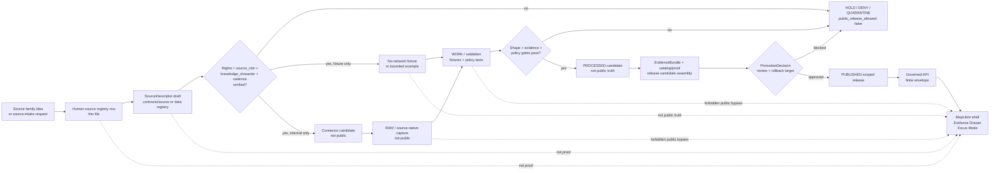

<!-- [KFM_META_BLOCK_V2]
doc_id: kfm://doc/TODO-VERIFY-atmosphere-air-source-registry
title: Atmosphere / Air Source Registry
type: standard
version: v1
status: draft
owners: TODO-VERIFY: atmosphere-air domain steward; source steward; data steward; policy steward
created: TODO-VERIFY-YYYY-MM-DD
updated: 2026-05-06
policy_label: TODO-VERIFY-public-or-restricted
related: [docs/domains/atmosphere_air/README.md, docs/domains/atmosphere_air/architecture/ARCHITECTURE.md, docs/domains/atmosphere_air/architecture/KNOWLEDGE_CHARACTER.md, docs/domains/atmosphere_air/architecture/PARAMETER_REGISTRY.md, docs/adr/ADR-0312-atmosphere-air-source-role-boundaries.md, docs/adr/ADR-0418-atmosphere-air-schema-slug-compatibility.md, connectors/pipelines/air/README.md, contracts/source/kansas_mesonet_source_descriptor.md, policy/crosswalk/domain-lane-policy-map.md]
tags: [kfm, atmosphere-air, source-registry, source-role, knowledge-character, evidence, rights, policy, governed-domain]
notes: [Revises existing repo-visible docs/domains/atmosphere_air/governance/SOURCE_REGISTRY.md. doc_id, owners, created date, final policy label, machine registry home, source-rights verification, CI enforcement, release behavior, and live-source activation remain NEEDS VERIFICATION.]
[/KFM_META_BLOCK_V2] -->

<a id="top"></a>

# Atmosphere / Air Source Registry

Human-readable governance registry for atmosphere and air-source admission: source identity, source role, knowledge character, rights posture, verification state, activation state, and public-release constraints.

<p align="center">
  
  
  
  
  
</p>

<p align="center">
  <a href="#purpose">Purpose</a> ·
  <a href="#repo-fit">Repo fit</a> ·
  <a href="#accepted-inputs">Inputs</a> ·
  <a href="#required-descriptor-fields">Descriptor fields</a> ·
  <a href="#source-roles">Source roles</a> ·
  <a href="#seed-source-family-register">Seed register</a> ·
  <a href="#activation-states">Activation states</a> ·
  <a href="#governed-source-flow">Flow</a> ·
  <a href="#validation-and-policy-gates">Validation</a> ·
  <a href="#definition-of-done">Done</a>
</p>

> [!IMPORTANT]
> This file is a **human-facing source-registry posture document**. It is not a live connector, source credential store, proof pack, release manifest, public layer, API route, scheduler, or source-rights approval.

> [!CAUTION]
> Sources with unresolved rights, terms, verification status, source role, knowledge character, freshness, or public-release permission remain **inactive for public release**. KFM should `DENY`, `ABSTAIN`, `ERROR`, `HOLD`, or quarantine rather than publish a polished but weakly supported air/atmosphere claim.

---

## Purpose

The Atmosphere / Air source registry answers five review questions before a source can support a candidate, map layer, Evidence Drawer payload, Focus Mode answer, release candidate, or public export:

| Question | Registry answer |
|---|---|
| What source is this? | Stable `source_id`, display name, publisher/steward, access surfaces, and source descriptor reference. |
| What can it support? | `source_role`, source authority boundaries, parameter support, spatial/temporal support, and known limitations. |
| What kind of knowledge does it produce? | `knowledge_character`, such as observed sensor, public AQI report, model field, remote-sensing mask, advisory context, or derived fusion. |
| May KFM use it publicly? | Rights, attribution, terms, verification state, public-release flag, policy label, and review obligations. |
| What downstream gates apply? | Required fixtures, validators, EvidenceRefs, receipts, proofs, release manifests, correction paths, and rollback targets. |

This registry exists to prevent source sprawl and false certainty. Atmosphere/Air data can look visually similar after mapping, but a PM2.5 observation, AQI report, AOD product, smoke plume mask, model field, regulatory archive, advisory, low-cost sensor candidate, and fusion product carry different truth burdens.

### This file governs

- human-readable source-registry posture for the Atmosphere / Air lane;
- source-family review status and activation posture;
- required source-descriptor fields;
- source role and knowledge-character expectations;
- source onboarding and update triggers;
- fail-closed public-release rules.

### This file does not govern

- final machine-readable source registry shape;
- live source connectors or schedules;
- executable Rego/OPA policy;
- final JSON Schemas;
- proof packs, EvidenceBundles, ReleaseManifests, or public artifacts;
- MapLibre layer publication;
- Focus Mode runtime behavior.

<p align="right"><a href="#top">Back to top ↑</a></p>

---

## Repo fit

**Target file:** `docs/domains/atmosphere_air/governance/SOURCE_REGISTRY.md`

This file belongs under `docs/domains/atmosphere_air/governance/` because it is a human-facing domain-governance document. It should point to machine registries, policies, schemas, fixtures, and release objects without becoming those authority surfaces itself.

| Surface | Path | Status | Role |
|---|---|---:|---|
| Domain landing page | [`../README.md`](../README.md) | CONFIRMED adjacent doc | Lane scope, accepted inputs, exclusions, denial posture, and public-safe boundaries. |
| Lane architecture | [`../architecture/ARCHITECTURE.md`](../architecture/ARCHITECTURE.md) | CONFIRMED adjacent doc | Trust path from source admission through public surfaces. |
| Knowledge characters | [`../architecture/KNOWLEDGE_CHARACTER.md`](../architecture/KNOWLEDGE_CHARACTER.md) | CONFIRMED adjacent doc | Taxonomy and anti-collapse rules for atmosphere/air knowledge. |
| Parameter registry | [`../architecture/PARAMETER_REGISTRY.md`](../architecture/PARAMETER_REGISTRY.md) | CONFIRMED adjacent doc | Parameter identity, units, bounds, caveats, and unit discipline. |
| Source-role ADR | [`../../../adr/ADR-0312-atmosphere-air-source-role-boundaries.md`](../../../adr/ADR-0312-atmosphere-air-source-role-boundaries.md) | CONFIRMED repo-wide ADR | Mandatory source-role and knowledge-character boundary. |
| Slug compatibility ADR | [`../../../adr/ADR-0418-atmosphere-air-schema-slug-compatibility.md`](../../../adr/ADR-0418-atmosphere-air-schema-slug-compatibility.md) | CONFIRMED repo-wide ADR | Keeps `atmosphere_air`, `air`, and `atmosphere` compatibility explicit. |
| No-network air connector | [`../../../../connectors/pipelines/air/README.md`](../../../../connectors/pipelines/air/README.md) | CONFIRMED repo-visible lane | Candidate/receipt producer; not public release. |
| Kansas Mesonet descriptor draft | [`../../../../contracts/source/kansas_mesonet_source_descriptor.md`](../../../../contracts/source/kansas_mesonet_source_descriptor.md) | CONFIRMED repo-visible draft | Source-admission draft; not activated connector or release artifact. |
| Policy crosswalk | [`../../../../policy/crosswalk/domain-lane-policy-map.md`](../../../../policy/crosswalk/domain-lane-policy-map.md) | CONFIRMED repo-visible crosswalk | Lane burden, not an executable policy engine. |
| Machine registry | `data/registry/atmosphere/sources.yaml` or repo-equivalent | PROPOSED / NEEDS VERIFICATION | Machine-readable source registry after repo convention review. |
| Machine schemas | `schemas/contracts/v1/air/` and/or `schemas/contracts/v1/atmosphere/` | NEEDS VERIFICATION | Schema family must follow ADR-0418 and schema-home decision. |
| Policy rules | `policy/air/` or `policy/atmosphere/` | NEEDS VERIFICATION | Executable admissibility and release gates. |

### Responsibility-root rule

| Root | Registry relationship |
|---|---|
| `docs/` | Explains source governance and review expectations. |
| `contracts/` | Defines semantic object meaning, such as `SourceDescriptor`. |
| `schemas/` | Defines machine-checkable shape. |
| `policy/` | Decides admissibility, denial, abstention, redaction, and release posture. |
| `connectors/` | Performs source-facing acquisition or no-network candidate generation. |
| `pipelines/` | Performs transformation and normalization. |
| `data/` | Stores lifecycle data, receipts, proofs, catalogs, and published artifacts. |
| `release/` | Stores or references release decisions, manifests, rollback cards, and correction state when repo convention confirms. |

> [!NOTE]
> `atmosphere_air` is the current documentation lane, `air` is the current no-network implementation/test slice, and `atmosphere` is a proposed whole-domain schema/normalization concept until schema inventory and ADR-backed migration prove otherwise.

<p align="right"><a href="#top">Back to top ↑</a></p>

---

## Current registry posture

| Registry surface | Status | Meaning |
|---|---:|---|
| Human source registry file | CONFIRMED | This repo-visible Markdown file is the human-facing source-registry posture for the lane. |
| Prior registry content | CONFIRMED | The prior file identified required fields and role expectations but did not provide source-family rows, activation states, or onboarding workflow. |
| Machine source registry | NEEDS VERIFICATION | A future `sources.yaml` or equivalent must be confirmed against active repo conventions before being treated as canonical. |
| Kansas Mesonet descriptor | CONFIRMED draft | Repo-visible source-admission draft exists, but it does not activate a connector or public release. |
| No-network `air` slice | CONFIRMED candidate lane | Repo-visible connector and example artifacts exist as candidate/process-memory surfaces, not proof or public truth. |
| Live source activation | UNKNOWN / NOT AUTHORIZED HERE | This registry does not activate AirNow, AQS, OpenAQ, PurpleAir, NOAA/NWS, NASA, Mesonet, model, smoke, or advisory sources. |
| Public release | DENY by default | Public release is blocked until rights, evidence, policy, review, catalog/proof, release manifest, correction path, and rollback target close. |
| CI enforcement | NEEDS VERIFICATION | Tests, workflows, branch rules, and policy engine execution must be checked in the active repo before enforcement claims. |

---

## Accepted inputs

| Input | Accepted here? | Required handling |
|---|---:|---|
| Source-family candidate | Yes | Add as a row with `verification_status: UNKNOWN` and `public_release_allowed: false` until verified. |
| SourceDescriptor draft | Yes | Link or summarize; descriptor remains source admission, not proof or release. |
| Official source documentation reference | Yes | Record access surface and verification date; do not infer undocumented endpoints. |
| Rights / terms / attribution review note | Yes | Required before public-release consideration. |
| Source-role decision | Yes | Must state what the source is competent to support. |
| Knowledge-character mapping | Yes | Must state what kind of object the source may produce. |
| Parameter-support note | Yes | Must align with the parameter registry and unit rules. |
| Offline fixture plan | Yes | Use fixture rows to support validators without live source activation. |
| Run receipt reference | Yes | Process memory only; do not treat as proof. |
| EvidenceBundle or proof references | Reference only | Proof objects live under proof/release surfaces, not in this registry. |
| Source conflict or limitation note | Yes | Record as caveat, review requirement, or blocker. |

---

## Exclusions

Do **not** put these in this registry:

- API keys, tokens, cookies, credentials, secrets, `.env` values, or private endpoint details;
- raw source payloads, bulk downloads, or source mirrors;
- scheduled live-ingest authorization;
- production connector credentials or runtime config;
- proof packs, EvidenceBundles, ReleaseManifests, or public layer descriptors;
- MapLibre style JSON or public tiles;
- Focus Mode prompts or model output;
- public claims that bypass EvidenceBundle resolution;
- source-family rows that silently collapse AQI, concentration, AOD, smoke masks, model fields, advisories, and fusion products;
- machine schemas or policy rules that should live under `schemas/` or `policy/`;
- broad renames from `air` to `atmosphere` or vice versa without ADR-backed migration and rollback.

<p align="right"><a href="#top">Back to top ↑</a></p>

---

## Required descriptor fields

Every source descriptor or source-registry row should carry the following fields before supporting candidate generation, validation, Evidence Drawer payloads, Focus Mode context, or release review.

| Field | Required | Purpose | Fail-closed rule |
|---|---:|---|---|
| `source_id` | Yes | Stable identifier for registry, fixtures, evidence, and receipts. | Missing ID blocks source admission. |
| `display_name` | Yes | Human-readable source title. | Missing title blocks review clarity. |
| `source_role` | Yes | What the source is competent to support. | Missing role returns `ATMOS_MISSING_SOURCE_ROLE`. |
| `knowledge_character` | Yes | What kind of knowledge the source contributes. | Missing character returns `ATMOS_MISSING_KNOWLEDGE_CHARACTER`. |
| `publisher` | Yes | Responsible publisher, steward, or provider. | Unknown publisher routes to review. |
| `access_url` | Yes, when public | Human landing page or source access point. | Undocumented access fails source review. |
| `api_docs_url` | When applicable | Documented API/service reference. | No private or inferred endpoint activation. |
| `rights_spdx` | Yes | SPDX-like rights/license value or `NOASSERTION`. | Unknown rights block public release. |
| `attribution` | Yes | Required public attribution or citation text. | Missing attribution blocks release. |
| `rate_limit_notes` | When applicable | Quotas, cadence, limits, and throttling. | Unknown rate limits block live automation. |
| `auth_required` | Yes | Whether credentials, keys, or approval are required. | Credential needs route to restricted config, not docs. |
| `freshness_expectation` | Yes | Expected update cadence or stale threshold. | Missing freshness blocks current-state claims. |
| `spatial_support` | Yes | Station, grid, polygon, region, mask, raster, or report area support. | Ambiguous support blocks map claims. |
| `temporal_support` | Yes | Observation, valid, report, run, retrieval, effective, or archive time support. | Missing time support returns `ABSTAIN` for time-sensitive claims. |
| `parameters_supported` | Yes | Parameter IDs or families supported by the source. | Unknown parameter support blocks normalization. |
| `known_limitations` | Yes | Caveats, QA/QC limits, representativeness, uncertainty. | Hidden caveats block public release. |
| `public_release_allowed` | Yes | Boolean default for public exposure. | `false` blocks public release. |
| `default_policy_label` | Yes | Default access/policy posture. | Missing label routes to review. |
| `raw_retention_policy` | Yes | Whether and how source-native payloads are retained. | Missing retention blocks evidence closure. |
| `last_verified_at` | Yes | Date source terms/shape were verified. | Missing date keeps `verification_status: UNKNOWN`. |
| `verification_status` | Yes | `UNKNOWN`, `NEEDS_VERIFICATION`, `VERIFIED`, `DEPRECATED`, `BLOCKED`, or equivalent. | Anything except a reviewed allow-state blocks public release. |

### Minimal source row template

```yaml
source_id: TODO-VERIFY
display_name: TODO-VERIFY
source_role: TODO-VERIFY
knowledge_character:
  - TODO-VERIFY
publisher: TODO-VERIFY
access_url: TODO-VERIFY
api_docs_url: TODO-VERIFY
rights_spdx: NOASSERTION
attribution: TODO-VERIFY
rate_limit_notes: TODO-VERIFY
auth_required: TODO-VERIFY
freshness_expectation: TODO-VERIFY
spatial_support: TODO-VERIFY
temporal_support: TODO-VERIFY
parameters_supported: []
known_limitations: []
public_release_allowed: false
default_policy_label: restricted-until-reviewed
raw_retention_policy: TODO-VERIFY
last_verified_at: TODO-VERIFY-YYYY-MM-DD
verification_status: UNKNOWN
activation_state: proposed
```

<p align="right"><a href="#top">Back to top ↑</a></p>

---

## Source roles

The source-role vocabulary below is the human-facing registry vocabulary for this lane. Machine enum names must be verified against the active schema family before enforcement claims.

| Source role | Use when the source is competent to support… | Must not be used as… |
|---|---|---|
| `OBSERVATION_PROVIDER` | Station, instrument, or ground observations with site/time context. | Model provider, AQI report, or regulatory archive unless explicitly source-backed. |
| `PUBLIC_REPORTING_PROVIDER` | Public AQI, NowCast-style reports, area reports, or agency index objects. | Raw concentration source. |
| `REGULATORY_ARCHIVE_PROVIDER` | Quality-assured or regulatory archive evidence. | Live/current source by default. |
| `LOW_COST_SENSOR_PROVIDER` | Contributor, consumer, or low-cost sensor readings needing correction/caveats. | Regulatory truth or unrestricted public observation. |
| `MODEL_PROVIDER` | Forecast, reanalysis, hindcast, transport, chemistry, aerosol, smoke, or climate model fields. | Observed measurement provider. |
| `REMOTE_SENSING_PROVIDER` | Satellite, aerial, fire, smoke, AOD, haze, plume, cloud, or classification/mask products. | Surface exposure or concentration provider by default. |
| `DERIVED_PRODUCT_GENERATOR` | Interpolation, bias correction, fusion, ensemble, consensus, anomaly, or derived surface products. | Canonical source observation provider. |
| `ADVISORY_ISSUER` | Official public messages, advisories, alerts, or health recommendations. | KFM emergency instruction authority. |
| `NETWORK_METADATA_PROVIDER` | Station/network roster, health, cadence, active state, instruments, and siting context. | Measurement value provider. |
| `CLIMATE_CONTEXT_PROVIDER` | Normals, baselines, anomaly context, downscaling, and temporal support. | Live hazard or emergency alert source. |
| `INTERNAL_FIXTURE_PROVIDER` | KFM no-network synthetic or example candidate material. | Real-world source or public truth. |

> [!TIP]
> A source can produce more than one object family, but each object should still carry a precise source role and knowledge character. Do not let one source row authorize every interpretation a map can visually imply.

---

## Knowledge characters

Each source row must identify the knowledge character(s) it may produce or support.

| Knowledge character | Source-registry meaning | Public-release caution |
|---|---|---|
| `OBSERVED_SENSOR` | Ground/station/instrument measurement. | Needs site, instrument, unit, time, QA/QC, source payload hash, and EvidenceRefs. |
| `PUBLIC_AQI_REPORT` | AQI, NowCast-style index, public report, or agency index object. | Never raw concentration by default. |
| `REGULATORY_ARCHIVE` | Quality-assured, historical, or regulatory archive evidence. | Not live/current by default. |
| `LOW_COST_SENSOR` | Contributor or consumer sensor record needing correction and caveats. | Requires correction method, limitations, confidence, and rights review. |
| `ATMOSPHERIC_MODEL_FIELD` | Forecast, reanalysis, hindcast, transport, chemistry, aerosol, or smoke model field. | Must remain modeled and expose uncertainty/model-card support. |
| `REMOTE_SENSING_MASK` | Smoke, AOD, fire, aerosol, haze, cloud, or plume classification/support product. | Not exposure or concentration by default. |
| `CLIMATE_ANOMALY_CONTEXT` | Normals, anomalies, baselines, downscaling, or climate context. | Not a live emergency alert. |
| `DERIVED_FUSION` | Interpolation, bias correction, ensemble, consensus, or fused surface. | Must expose inputs, method, transform hash, and uncertainty. |
| `METEOROLOGICAL_CONTEXT` | Wind, temperature, humidity, pressure, boundary layer, or transport support. | Not air-quality concentration unless source-backed. |
| `VISIBILITY_AND_AEROSOL_CONTEXT` | Visibility, haze, AOD, opacity, or optical aerosol context. | Not PM concentration without governed model assumptions. |
| `FIRE_AND_EMISSIONS_CONTEXT` | Fire hotspots, emissions inventories, smoke-source indicators, or source attribution context. | Not exposure measurement. |
| `ALERT_AND_ADVISORY_CONTEXT` | Public agency notice, recommendation, advisory, or message. | Not KFM life-safety instruction. |
| `NETWORK_AND_SITE_CONTEXT` | Station metadata, cadence, active state, instruments, siting caveats, health events. | Not measurement value. |
| `BASELINE_AND_TEMPORAL_SUPPORT` | Climatology, rolling baseline, persistence, hysteresis, or freshness support. | Not standalone claim without scoped evidence. |

<p align="right"><a href="#top">Back to top ↑</a></p>

---

## Seed source-family register

This table is a **source-family backlog and review register**, not an activation table. Unless a row explicitly says otherwise, `public_release_allowed` remains `false`.

| Source family | Candidate `source_id` | Role / character | Verification | Public release | Next review action |
|---|---|---|---:|---:|---|
| KFM no-network air fixture | `kfm_air_no_network_stub` | `INTERNAL_FIXTURE_PROVIDER` / `OBSERVED_SENSOR` candidate | CONFIRMED repo-visible candidate slice | `false` | Keep fixture-only; never treat as real-world public truth. |
| Kansas Mesonet | `kansas_mesonet` | `OBSERVATION_PROVIDER`, `NETWORK_METADATA_PROVIDER` / `OBSERVED_SENSOR`, `METEOROLOGICAL_CONTEXT`, `NETWORK_AND_SITE_CONTEXT` | DRAFT descriptor; rights/automation NEEDS VERIFICATION | `false` | Confirm permitted use, automation consent, cadence, station support, attribution, and fixture scope. |
| EPA AQS-like archive | `epa_aqs_candidate` | `REGULATORY_ARCHIVE_PROVIDER` / `REGULATORY_ARCHIVE` | NEEDS VERIFICATION | `false` | Verify endpoint, license/terms, parameter mapping, QA status, and archive temporal semantics. |
| AirNow-like public AQI | `airnow_candidate` | `PUBLIC_REPORTING_PROVIDER` / `PUBLIC_AQI_REPORT`, `ALERT_AND_ADVISORY_CONTEXT` | NEEDS VERIFICATION | `false` | Verify report semantics, freshness, attribution, rights, and “AQI is not concentration” tests. |
| OpenAQ-like aggregator | `openaq_candidate` | NEEDS VERIFICATION aggregator role / mixed knowledge support | NEEDS VERIFICATION | `false` | Determine whether aggregator can support source authority or only secondary discovery. |
| Low-cost sensor network | `low_cost_sensor_network_candidate` | `LOW_COST_SENSOR_PROVIDER` / `LOW_COST_SENSOR` | UNKNOWN | `false` | Require correction method, caveats, confidence, rights, and public-release review before fixtures. |
| NOAA/NWS advisory context | `noaa_nws_advisory_candidate` | `ADVISORY_ISSUER` / `ALERT_AND_ADVISORY_CONTEXT`, `METEOROLOGICAL_CONTEXT` | NEEDS VERIFICATION | `false` | Verify official-source routing, issue/expiry/retrieval times, and non-emergency KFM posture. |
| NOAA HMS smoke-like product | `noaa_hms_smoke_candidate` | `REMOTE_SENSING_PROVIDER` / `REMOTE_SENSING_MASK`, `FIRE_AND_EMISSIONS_CONTEXT` | NEEDS VERIFICATION | `false` | Verify product caveats, classification support, freshness, and “mask is not exposure” tests. |
| NASA FIRMS-like fire hotspot | `nasa_firms_candidate` | `REMOTE_SENSING_PROVIDER` / `FIRE_AND_EMISSIONS_CONTEXT`, `REMOTE_SENSING_MASK` | NEEDS VERIFICATION | `false` | Verify access, auth/quota, confidence fields, time support, and fire-context caveats. |
| Smoke / chemistry / transport model | `smoke_model_candidate` | `MODEL_PROVIDER` / `ATMOSPHERIC_MODEL_FIELD`, `FIRE_AND_EMISSIONS_CONTEXT` | NEEDS VERIFICATION | `false` | Verify model identity, run/valid time, variable dictionary, grid support, model card, uncertainty. |
| Climate normals / anomaly context | `climate_context_candidate` | `CLIMATE_CONTEXT_PROVIDER` / `CLIMATE_ANOMALY_CONTEXT`, `BASELINE_AND_TEMPORAL_SUPPORT` | NEEDS VERIFICATION | `false` | Verify baseline periods, anomaly method, downscaling/model support, and not-alert posture. |
| Emissions inventory context | `emissions_inventory_candidate` | `FIRE_AND_EMISSIONS_CONTEXT` source role NEEDS VERIFICATION / `FIRE_AND_EMISSIONS_CONTEXT` | NEEDS VERIFICATION | `false` | Verify source role, legal/rights posture, temporal support, pollutant mapping, and uncertainty. |

### Register reading rules

1. `CONFIRMED repo-visible candidate slice` means a KFM fixture/candidate lane exists, not that public release is allowed.
2. `NEEDS VERIFICATION` means a concrete review can retire uncertainty.
3. `UNKNOWN` means the current session did not verify source facts strongly enough to act on them.
4. `public_release_allowed: false` is the default safe posture.
5. A source-family row is not a `SourceDescriptor`, proof object, or release decision by itself.

---

## Activation states

| State | Meaning | Public release allowed? | Promotion behavior |
|---|---|---:|---|
| `proposed` | Candidate source family identified. | No | Create review row only. |
| `draft_descriptor` | SourceDescriptor draft exists but is not approved. | No | Fixtures may be planned; live source remains blocked. |
| `fixture_only` | No-network fixture or synthetic example exists. | No | Used for tests and validators only. |
| `internal_candidate` | Candidate artifacts can be produced internally. | No | May enter WORK/PROCESSED candidate states; no public surface. |
| `quarantined` | Rights, role, shape, evidence, sensitivity, or policy failed. | No | Hold for correction or denial. |
| `review_ready` | Required metadata, fixtures, and validator results are assembled. | No | Human/steward review may proceed. |
| `active_internal` | Connector/source use approved for internal candidate generation. | No by default | Still requires evidence, policy, proof, and release gates for public exposure. |
| `release_candidate` | Candidate has proof/release bundle for review. | Not yet | PromotionDecision decides. |
| `published_source_allowed` | Public use has been reviewed and released for a defined scope. | Yes, scoped | Only released artifacts and governed API envelopes may serve public clients. |
| `deprecated` | Source should not be used for new releases. | No new release | Preserve lineage, receipts, supersession, and rollback paths. |
| `blocked` | Source is barred by rights, sensitivity, quality, or policy. | No | Record reason codes and route to archive or quarantine. |

<p align="right"><a href="#top">Back to top ↑</a></p>

---

## Governed source flow



### Flow rules

- Source admission is not publication.
- A registry row is not an EvidenceBundle.
- A source descriptor constrains a source; it does not prove a claim by itself.
- A run receipt is process memory; it is not proof or a release manifest.
- Public clients consume released artifacts and governed API envelopes only.
- Unknown rights, missing evidence, or missing review block public release.

---

## Validation and policy gates

The registry should support validator and policy gates with stable reason codes.

| Gate | Required proof | Failure outcome |
|---|---|---|
| Source identity | `source_id`, display name, publisher, access surface. | `DENY` / source admission hold. |
| Source role | `source_role` present and competent for the requested claim. | `ATMOS_MISSING_SOURCE_ROLE`. |
| Knowledge character | Accepted `knowledge_character` present. | `ATMOS_MISSING_KNOWLEDGE_CHARACTER`. |
| Rights | `rights_spdx`, attribution, terms, and public-release posture known. | `ATMOS_MISSING_RIGHTS` or `ATMOS_UNKNOWN_RIGHTS_PUBLIC`. |
| EvidenceRefs | Consequential records carry EvidenceRefs. | `ATMOS_MISSING_EVIDENCE_REFS`. |
| Source payload hash | Normalized records can trace to source-native payloads. | `ATMOS_MISSING_SOURCE_PAYLOAD_HASH`. |
| Transform identity | Derived/fusion/model/normalization records carry transform/spec hash. | `ATMOS_MISSING_TRANSFORM_HASH`. |
| Public-release flag | `public_release_allowed` is true for the defined scope. | `ATMOS_PUBLIC_RELEASE_FALSE`. |
| Low-cost sensor caveats | Correction method, caveats, limitations, confidence, rights. | `ATMOS_LOW_COST_NO_CORRECTION`. |
| Model/observation split | Model field is not labeled observed. | `ATMOS_MODEL_AS_OBSERVED`. |
| AQI/concentration split | AQI/report index is not treated as raw concentration. | `ATMOS_AQI_AS_CONCENTRATION`. |
| AOD/PM2.5 split | AOD is not converted to PM2.5 without governed model support. | `ATMOS_AOD_AS_PM25`. |
| Anomaly/alert split | Climate anomaly is not treated as emergency alert. | `ATMOS_ANOMALY_AS_ALERT`. |
| Public lifecycle boundary | Public surface does not request RAW, WORK, QUARANTINE, internal, or unpublished candidate paths. | `ATMOS_PUBLIC_INTERNAL_ACCESS`. |

### Minimum offline tests

| Test family | Required cases |
|---|---|
| Descriptor completeness | Missing `source_id`, `source_role`, `knowledge_character`, rights, and freshness fail closed. |
| Source-role compatibility | AQI source cannot support raw concentration claim. |
| Knowledge-character compatibility | Model, mask, report, observation, advisory, and fusion records remain distinct. |
| Rights posture | `UNKNOWN`, `NOASSERTION`, or missing rights block public release. |
| Low-cost sensor gate | Missing correction/caveat/confidence blocks public release. |
| Freshness gate | Stale or missing current-state support returns `ABSTAIN` or visibly stale context. |
| Public boundary | Public API/UI/Focus payloads cannot reference internal lifecycle zones. |
| Fixture truth denial | No-network fixtures cannot become public truth. |
| Receipt/proof split | Run receipt cannot substitute for EvidenceBundle or ReleaseManifest. |

<p align="right"><a href="#top">Back to top ↑</a></p>

---

## Machine-readable source sketch

This sketch is illustrative. Adapt field names to the active schema and registry home after the schema-home and slug-compatibility decisions are verified.

```yaml
schema_version: kfm.source_descriptor.v1_PROPOSED
kind: SourceDescriptor

identity:
  source_id: kansas_mesonet
  display_name: Kansas Mesonet
  publisher: Kansas Mesonet / Kansas State University
  registry_status: draft_descriptor
  last_verified_at: TODO-VERIFY-YYYY-MM-DD
  verification_status: NEEDS_VERIFICATION

role_and_character:
  source_role:
    - OBSERVATION_PROVIDER
    - NETWORK_METADATA_PROVIDER
  knowledge_character:
    - OBSERVED_SENSOR
    - METEOROLOGICAL_CONTEXT
    - NETWORK_AND_SITE_CONTEXT
  not_authoritative_for:
    - regulatory_air_quality_archive
    - public_aqi_report
    - emergency_alerting
    - modeled_surface_truth
    - legal_or_regulatory_determination

access:
  access_url: TODO-VERIFY
  api_docs_url: TODO-VERIFY
  auth_required: TODO-VERIFY
  rate_limit_notes: TODO-VERIFY
  documented_surfaces_only: true

rights:
  rights_spdx: NOASSERTION
  attribution: TODO-VERIFY
  public_release_allowed: false
  default_policy_label: restricted-until-reviewed
  automation_status: not_activated

support:
  spatial_support:
    kind: station_points
    caveats:
      - Station context does not imply statewide surface truth.
  temporal_support:
    observed_time_required: true
    retrieved_at_required: true
    freshness_expectation: TODO-VERIFY
  parameters_supported:
    - air_temperature
    - relative_humidity
    - wind_speed
    - wind_direction
    - TODO-VERIFY

evidence_requirements:
  source_payload_hash: required_for_records
  transform_spec_hash: required_for_normalized_or_derived_records
  evidence_refs: required_for_consequential_claims
  run_receipt_ref: required_for_connector_candidates

release_constraints:
  activation_state: draft_descriptor
  public_release_allowed: false
  required_before_public_release:
    - rights_review
    - source_role_review
    - knowledge_character_review
    - parameter_registry_alignment
    - valid_fixture
    - invalid_fixture
    - policy_denial_tests
    - EvidenceBundle_resolution
    - PromotionDecision
    - ReleaseManifest
    - rollback_target
    - correction_path
```

---

## Maintainer workflow

Use this sequence when adding or materially changing a source family.

1. **Open an intake item.** Record source title, intended use, source family, and why the source belongs in Atmosphere / Air.
2. **Add or update the source row in this file.** Keep `verification_status: UNKNOWN` and `public_release_allowed: false`.
3. **Classify source role and knowledge character.** Link to the knowledge-character and source-role ADRs.
4. **Verify rights and terms.** Record attribution, license/rights, automation restrictions, redistribution constraints, cadence, and freshness.
5. **Create or update a SourceDescriptor.** Use `contracts/source/`, `data/registry/`, or the repo-verified canonical source registry.
6. **Add fixtures.** Include one valid fixture and at least one negative fixture for expected denial behavior.
7. **Wire validators and policy.** Ensure reason codes are stable and machine-readable.
8. **Generate candidate receipts only.** Keep run receipts separate from proof, catalog, and release objects.
9. **Assemble evidence and proof candidates.** Resolve EvidenceRefs to EvidenceBundle before consequential claims.
10. **Review promotion.** Require policy, review state, release manifest, correction path, and rollback target before public exposure.
11. **Update dependent docs.** Touch the domain README, architecture, parameter registry, source registry, policy docs, schema docs, runbooks, and ADRs when their responsibilities change.
12. **Preserve lineage.** Deprecated or renamed source IDs must remain findable with successor links and rollback notes.

---

## Update triggers

| Trigger | Required registry action | Also update |
|---|---|---|
| New source family proposed | Add row with `verification_status: UNKNOWN` and `public_release_allowed: false`. | Intake record, source descriptor draft, verification backlog. |
| Source terms or license changes | Update rights, attribution, verification date, and release posture. | Policy tests, source descriptor, affected release notes. |
| Source endpoint or schema changes | Update access surfaces, limitations, and fixture expectations. | Connector docs, schemas, validators, fixtures, receipts. |
| New parameter accepted | Update `parameters_supported` and caveats. | Parameter registry, unit conversions, fixtures, validation tests. |
| New knowledge character needed | Do not invent inline. Propose through ADR or taxonomy update. | Knowledge-character doc, schemas, policy, tests. |
| Live connector proposed | Keep source row inactive until activation review closes. | Connector README, source descriptor, policy, runbook, CI plan. |
| Public layer proposed | Confirm public source permission and EvidenceBundle support. | Map layer docs, Evidence Drawer payloads, release manifest, rollback. |
| Source conflict detected | Add limitation or conflict note; block smoothing. | Conflict register, Evidence Drawer payload, policy tests. |
| Source deprecated | Mark deprecated with successor, reason, and date. | Source descriptor, release notes, rollback/correction docs. |
| Source ID renamed | Preserve alias and migration note. | ADR, fixtures, validators, link checks, compatibility tests. |

<p align="right"><a href="#top">Back to top ↑</a></p>

---

## Public-surface rules

| Public surface | Source-registry obligation |
|---|---|
| Map layer | Must show source role, knowledge character, freshness, release state, caveats, and Evidence Drawer route. |
| Popup | Must state what the source supports and what it does not support. |
| Evidence Drawer | Must expose source identity, rights, source role, knowledge character, evidence, hashes, transforms, review state, release state, caveats, and conflicts. |
| Focus Mode | Must synthesize only over admissible, EvidenceBundle-backed context and return `ANSWER`, `ABSTAIN`, `DENY`, or `ERROR`. |
| Export | Must include source attribution, evidence route, release manifest reference, caveats, and correction path. |
| Advisory display | Must preserve issuer, effective/expiry time, official-source context, and KFM non-emergency posture. |

---

## Definition of done

This source registry is ready for review when:

- [ ] KFM Meta Block values are assigned or intentionally left as reviewable placeholders.
- [ ] Owners and policy label are verified.
- [ ] Relative links resolve from `docs/domains/atmosphere_air/governance/SOURCE_REGISTRY.md`.
- [ ] Every seed row has `source_id`, source role, knowledge character, verification status, and public-release posture.
- [ ] Unverified sources default to `public_release_allowed: false`.
- [ ] Machine registry home is verified or explicitly marked `NEEDS VERIFICATION`.
- [ ] Valid and invalid fixtures exist for at least one source family.
- [ ] Unknown-rights public release is denied in policy tests.
- [ ] AQI/concentration, AOD/PM2.5, smoke-mask/exposure, model/observation, and receipt/proof splits are covered by negative tests.
- [ ] Connector candidates cannot write directly to `data/published/`.
- [ ] EvidenceRefs resolve to EvidenceBundle before consequential public claims.
- [ ] Public UI/API/Focus surfaces cannot read RAW, WORK, QUARANTINE, connector-private, normalize-stage, or unpublished candidate artifacts.
- [ ] Source deprecation and rename behavior preserve lineage, aliases, rollback, and successor notes.
- [ ] Release notes, correction path, and rollback target are required before public exposure.

---

## Open verification

| Item | Status | Why it matters |
|---|---:|---|
| `doc_id` | TODO | Required for stable document identity. |
| Owners | TODO | Required for review, source activation, and policy changes. |
| Created date | TODO | Existing thin file did not confirm creation metadata. |
| Policy label | TODO | Determines whether this registry is public, restricted, or mixed. |
| Machine source registry home | NEEDS VERIFICATION | Avoid duplicate authority between docs, data registry, and contracts. |
| Machine schema family | NEEDS VERIFICATION | ADR-0418 keeps `air`, `atmosphere`, and `atmosphere_air` compatibility unresolved until inventory/tests prove it. |
| Current source descriptor inventory | NEEDS VERIFICATION | Kansas Mesonet draft is visible, but complete source-descriptor set is not confirmed here. |
| Live connector status | UNKNOWN / NOT AUTHORIZED HERE | This file must not imply live source activation. |
| CI and validator enforcement | NEEDS VERIFICATION | Reason codes and gates must be run in repo-native tests before enforcement claims. |
| Source rights and terms | UNKNOWN for most seed rows | Unknown rights block public release. |
| Public release artifacts | UNKNOWN | No ReleaseManifest, PromotionDecision, or rollback proof is claimed here. |
| Evidence Drawer / Focus binding | NEEDS VERIFICATION | This file defines obligations, not UI/runtime implementation. |

---

## Appendix: source-row review card

<details>
<summary>Copyable source-row review card</summary>

```markdown
### Source review card: <source_id>

| Field | Value |
|---|---|
| Display name | TODO |
| Source role | TODO |
| Knowledge character | TODO |
| Publisher / steward | TODO |
| Access surface | TODO |
| Rights / SPDX | TODO |
| Attribution | TODO |
| Auth required | TODO |
| Cadence / freshness | TODO |
| Spatial support | TODO |
| Temporal support | TODO |
| Parameters supported | TODO |
| Known limitations | TODO |
| Verification status | UNKNOWN |
| Public release allowed | false |
| Activation state | proposed |
| Last verified | TODO-VERIFY-YYYY-MM-DD |
| Reviewer | TODO |
| Next action | TODO |
```

</details>

---

## Appendix: reason-code glossary

<details>
<summary>Atmosphere / Air source-registry denial codes</summary>

| Code | Condition |
|---|---|
| `ATMOS_MISSING_KNOWLEDGE_CHARACTER` | Source or artifact lacks accepted knowledge character. |
| `ATMOS_MISSING_SOURCE_ROLE` | Source or artifact lacks source role or source descriptor reference. |
| `ATMOS_MISSING_RIGHTS` | Rights or source terms absent. |
| `ATMOS_UNKNOWN_RIGHTS_PUBLIC` | Public output requested while rights are unknown. |
| `ATMOS_MISSING_EVIDENCE_REFS` | Consequential source-backed record lacks EvidenceRefs. |
| `ATMOS_MISSING_SOURCE_PAYLOAD_HASH` | Normalized record cannot be traced to source-native payload. |
| `ATMOS_MISSING_TRANSFORM_HASH` | Derived or normalized record lacks transform/spec identity. |
| `ATMOS_PUBLIC_RELEASE_FALSE` | Source descriptor or policy blocks public release. |
| `ATMOS_LOW_COST_NO_CORRECTION` | Low-cost sensor lacks correction method, caveats, confidence, or rights. |
| `ATMOS_MODEL_AS_OBSERVED` | Model field is labeled or presented as observed measurement. |
| `ATMOS_AQI_AS_CONCENTRATION` | AQI/report index is treated as raw concentration. |
| `ATMOS_AOD_AS_PM25` | AOD/optical context is treated as PM2.5 without governed model support. |
| `ATMOS_MASK_AS_EXPOSURE` | Smoke/plume/remote-sensing mask is treated as exposure measurement. |
| `ATMOS_ANOMALY_AS_ALERT` | Climate anomaly is promoted as emergency alert or life-safety instruction. |
| `ATMOS_PUBLIC_INTERNAL_ACCESS` | Public surface attempts internal lifecycle or candidate access. |
| `ATMOS_RECEIPT_AS_PROOF` | Run receipt is used as EvidenceBundle, proof pack, or release manifest. |
| `ATMOS_STALE_CONTEXT_UNLABELED` | Stale/expired context lacks visible stale posture. |

</details>

<p align="right"><a href="#top">Back to top ↑</a></p>
