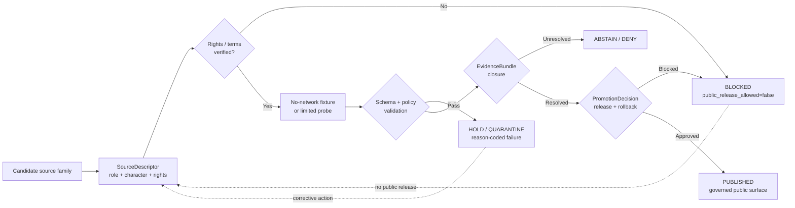
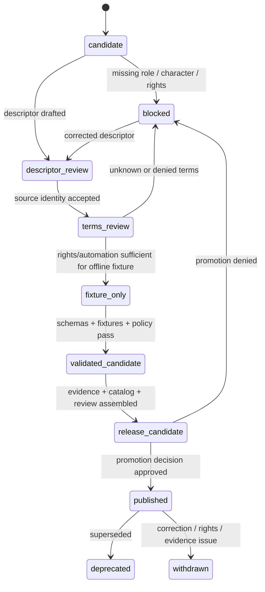

<!-- [KFM_META_BLOCK_V2]
doc_id: kfm://doc/TODO-VERIFY-UUID-atmosphere-air-source-registry
title: Atmosphere / Air Source Registry
type: standard
version: v1
status: draft
owners: TODO-VERIFY: @bartytime4life; atmosphere-air domain steward; source steward; policy steward; release steward
created: TODO-VERIFY-YYYY-MM-DD
updated: 2026-05-06
policy_label: public-draft-NEEDS_VERIFICATION
related: [../README.md, ./SECURITY_AND_RIGHTS.md, ./VALIDATION_STATUS.md, ../architecture/ARCHITECTURE.md, ../architecture/KNOWLEDGE_CHARACTER.md, ../architecture/UNIT_CONVERSIONS.md, ../../../adr/ADR-0312-atmosphere-air-source-role-boundaries.md, ../../../adr/ADR-0418-atmosphere-air-schema-slug-compatibility.md, ../../../../data/processed/air/qa_summary.example.json, ../../../../data/receipts/air/run_receipt.example.json, ../../../../policy/air/air_qa.rego, ../../../../tools/validators/air/validate_air_qa.py]
tags: [kfm, atmosphere-air, source-registry, source-role, knowledge-character, rights, verification, public-release, evidence]
notes: [doc_id, owners, created date, and final policy_label remain TODO/NEEDS VERIFICATION; this registry revises a thin repo-visible source registry without claiming live source activation, source rights clearance, CI enforcement, EvidenceBundle closure, release approval, or public publication.]
[/KFM_META_BLOCK_V2] -->

<a id="top"></a>

# Atmosphere / Air Source Registry

Human-readable governance registry for Atmosphere / Air source families, source roles, knowledge characters, rights posture, verification state, and public-release gates.

<p align="center">
  
  
  
  
  
</p>

<p align="center">
  <a href="#status-snapshot">Status</a> ·
  <a href="#scope">Scope</a> ·
  <a href="#repo-fit">Repo fit</a> ·
  <a href="#operating-law">Operating law</a> ·
  <a href="#required-fields">Fields</a> ·
  <a href="#source-roles">Source roles</a> ·
  <a href="#knowledge-characters">Knowledge characters</a> ·
  <a href="#candidate-source-family-register">Source families</a> ·
  <a href="#activation-gates">Activation gates</a> ·
  <a href="#machine-registry-shape">Machine shape</a> ·
  <a href="#open-verification">Open verification</a>
</p>

> [!IMPORTANT]
> This registry does **not** activate sources. Every source family listed here is blocked from public release until a source descriptor, rights review, source-role review, evidence closure, validation, policy decision, review state, release manifest, correction path, and rollback target prove otherwise.

---

## Status snapshot

| Field | Status |
|---|---|
| Target file | `docs/domains/atmosphere_air/governance/SOURCE_REGISTRY.md` |
| Document role | Human-facing source registry and activation posture for the Atmosphere / Air lane. |
| Current revision | Expands the prior thin source-registry stub into a reviewable governance registry. |
| Repo path | CONFIRMED repo-visible through GitHub connector; local checkout was **not** mounted in the workspace. |
| Public release | BLOCKED by default for all listed source families. |
| Live source activation | BLOCKED; no live fetch, credentialed access, automation, or publication is authorized by this file. |
| Machine registry | NEEDS VERIFICATION: mirror into `data/registry/atmosphere/sources.yaml`, `data/registry/air/sources.yaml`, or repo-native equivalent only after schema-home and slug compatibility are verified. |
| Enforcement maturity | PARTIAL / NEEDS VERIFICATION: adjacent docs, ADRs, policy fragments, validators, and no-network candidates exist, but this file does not prove current CI enforcement or runtime behavior. |

---

## Scope

This registry governs how maintainers describe, review, and activate Atmosphere / Air sources before they can support KFM claims.

It covers:

- source-family candidates;
- required source descriptor fields;
- source-role and knowledge-character discipline;
- source rights, terms, attribution, automation, access, and redistribution posture;
- public-release defaults;
- candidate source-family seed rows;
- fail-closed activation gates;
- update triggers and review checks.

It does **not** define executable schemas, policy-as-code, connector implementations, raw data storage, release manifests, or deployed API/UI behavior. Those belong under their responsibility roots and must link back here when source posture changes.

### One-sentence rule

A source may be visible in this registry before it is trusted, but it may not become public KFM evidence until source role, knowledge character, rights, evidence, policy, review, release, correction, and rollback are all inspectable.

<p align="right"><a href="#top">Back to top ↑</a></p>

---

## Repo fit

This document belongs in `docs/` because it is human-facing source governance. It should guide machine registries, validators, policy, connectors, and release records without becoming those systems.

| Neighbor / dependency | Relative link | Status | Relationship |
|---|---|---:|---|
| Domain landing page | [`../README.md`](../README.md) | CONFIRMED repo-visible | Lane scope, accepted inputs, exclusions, governed flow, first-PR discipline. |
| Security and rights | [`./SECURITY_AND_RIGHTS.md`](./SECURITY_AND_RIGHTS.md) | CONFIRMED repo-visible | Rights, access, public-release, and exposure guardrails. |
| Validation status | [`./VALIDATION_STATUS.md`](./VALIDATION_STATUS.md) | CONFIRMED repo-visible | Current validation inventory and publication-blocked status. |
| Governance index | [`./README.md`](./README.md) | CONFIRMED repo-visible / EMPTY | Should index this registry, validation, rights, promotion, drift, and rollback docs. |
| Architecture | [`../architecture/ARCHITECTURE.md`](../architecture/ARCHITECTURE.md) | CONFIRMED repo-visible | Trust path, source-role boundary, current no-network slice, public-surface contract. |
| Knowledge-character boundary | [`../architecture/KNOWLEDGE_CHARACTER.md`](../architecture/KNOWLEDGE_CHARACTER.md) | CONFIRMED repo-visible | Anti-collapse taxonomy that source descriptors must preserve. |
| Source-role ADR | [`../../../adr/ADR-0312-atmosphere-air-source-role-boundaries.md`](../../../adr/ADR-0312-atmosphere-air-source-role-boundaries.md) | CONFIRMED repo-visible / draft | Repo-wide source-role and knowledge-character decision boundary. |
| Slug compatibility ADR | [`../../../adr/ADR-0418-atmosphere-air-schema-slug-compatibility.md`](../../../adr/ADR-0418-atmosphere-air-schema-slug-compatibility.md) | CONFIRMED repo-visible / proposed | Compatibility boundary for `atmosphere_air`, `air`, and `atmosphere`. |
| No-network QA candidate | [`../../../../data/processed/air/qa_summary.example.json`](../../../../data/processed/air/qa_summary.example.json) | REPO-REFERENCED | Candidate-only processed output; not public truth. |
| No-network run receipt | [`../../../../data/receipts/air/run_receipt.example.json`](../../../../data/receipts/air/run_receipt.example.json) | REPO-REFERENCED | Process memory; not proof or release authority. |
| QA policy fragment | [`../../../../policy/air/air_qa.rego`](../../../../policy/air/air_qa.rego) | REPO-REFERENCED / NEEDS VERIFICATION | Current air QA denial pressure; not complete whole-domain source policy. |
| QA validator | [`../../../../tools/validators/air/validate_air_qa.py`](../../../../tools/validators/air/validate_air_qa.py) | REPO-REFERENCED / NEEDS VERIFICATION | Validator pressure; full schema inventory and run status must be verified. |

> [!WARNING]
> `atmosphere_air` is the current documentation lane, `air` is the current no-network implementation/tooling slice, and `atmosphere` is a proposed whole-domain schema concept. Do not silently rename, collapse, alias, or publish across those surfaces without ADR-backed migration, fixtures, validators, policy checks, and rollback.

<p align="right"><a href="#top">Back to top ↑</a></p>

---

## Operating law

### Registry law

| Rule | Required behavior |
|---|---|
| Descriptor first | Every source family begins as a `SourceDescriptor` candidate before ingest, normalization, analysis, map delivery, or Focus Mode use. |
| Role and character required | `source_role` and `knowledge_character` are mandatory trust-bearing fields. |
| Unknown rights block release | `rights_spdx: NOASSERTION`, unknown source terms, unknown attribution, unknown automation permission, or unknown redistribution posture blocks public release. |
| Public release is explicit | `public_release_allowed` defaults to `false`; only review-backed source descriptors may change it. |
| Registry is not evidence | A row in this registry does not support a public claim by itself. Claims still require EvidenceBundle closure and release state. |
| Candidate is not publication | A no-network fixture, processed candidate, run receipt, QA summary, layer draft, or release candidate is not public truth. |
| Derived products stay derived | Model, mask, advisory, fusion, interpolation, and index/report products must expose source role, method, uncertainty, and input evidence. |
| Live-state claims require freshness | Current or live wording requires source cadence, retrieval time, observation/model/report time, issue/expiry time where applicable, and freshness state. |
| Rollback must be possible | Any source activation that affects public artifacts must have a correction and rollback path. |

### Source lifecycle



<p align="right"><a href="#top">Back to top ↑</a></p>

---

## Required fields

Every source descriptor for this lane must carry or resolve the fields below.

| Field | Required | Purpose | Public-release effect |
|---|---:|---|---|
| `source_id` | yes | Stable source-family identity. | Missing value blocks all use. |
| `display_name` | yes | Human-readable source name. | Missing value blocks review. |
| `source_family_status` | yes | `candidate`, `blocked`, `review`, `fixture_only`, `release_candidate`, `published`, `deprecated`, `withdrawn`, or `quarantined`. | Anything below `published` is not public truth. |
| `source_role` | yes | What the source is competent to support. | Missing/unknown value denies publication. |
| `knowledge_character` | yes | What kind of knowledge the source contributes. | Missing/unknown value denies publication. |
| `publisher` | yes | Publisher, steward, or responsible organization. | Missing value blocks activation. |
| `jurisdiction_or_scope` | yes | Geographic, institutional, or thematic scope. | Required for scoped claims. |
| `access_url` | yes, when known | Source home or access surface. | Missing value keeps descriptor in review. |
| `api_docs_url` | yes, when applicable | API or service documentation. | Missing value blocks automation. |
| `rights_spdx` | yes | SPDX value or `NOASSERTION`. | `NOASSERTION` blocks public release. |
| `terms_url` | yes, when available | Source terms, API terms, or data-use policy. | Missing/unknown value blocks public release. |
| `attribution` | yes | Attribution/citation requirement. | Missing/unknown value blocks public release. |
| `redistribution_allowed` | yes | Whether KFM can redistribute derived/public artifacts. | `false` or `unknown` blocks public release. |
| `automation_allowed` | yes | Whether automated access is permitted. | `false` or `unknown` blocks live connector activation. |
| `auth_required` | yes | `none`, `api_key`, `account`, `restricted`, or `unknown`. | Credentialed sources require secret-handling review. |
| `rate_limit_notes` | yes, when known | Request cadence and operational limits. | Unknown value blocks automation until reviewed. |
| `freshness_expectation` | yes, when current-state claims are possible | Expected cadence and stale-state logic. | Missing value blocks live/current wording. |
| `spatial_support` | yes | Point, grid, polygon, raster, text region, county/state, or other spatial support. | Required for map delivery. |
| `temporal_support` | yes | Observation, model valid, issue/expiry, retrieval, release, or archive time basis. | Required for time-aware claims. |
| `parameters_supported` | yes | Parameters, variables, indicators, or classes. | Required for parameter registry and unit validation. |
| `known_limitations` | yes | Caveats, exclusions, quality flags, interpretation warnings. | Material caveats must surface in Evidence Drawer. |
| `evidence_requirements` | yes | EvidenceBundle and citation support needed before claims. | Missing value blocks promotion. |
| `public_release_allowed` | yes | Explicit public-release posture. | Defaults to `false`. |
| `verification_status` | yes | Current verification state. | `UNKNOWN` or `NEEDS_VERIFICATION` blocks public release. |
| `last_verified_at` | yes, nullable | Date/time of last source review. | Null means unverified. |
| `review_owner` | yes | Steward responsible for review. | TODO owner blocks activation. |
| `rollback_notes` | yes | How to disable, withdraw, or roll back source-derived public artifacts. | Missing rollback notes block publication. |

### Recommended verification status enum

| Status | Meaning | Public release |
|---|---|---:|
| `UNKNOWN` | Not reviewed or not enough evidence. | no |
| `NEEDS_VERIFICATION` | Review task exists but is incomplete. | no |
| `DESCRIPTOR_VERIFIED` | Identity, role, character, and access have been reviewed. | no |
| `RIGHTS_VERIFIED` | Rights, terms, attribution, automation, and redistribution have been reviewed. | no by itself |
| `FIXTURE_VALIDATED` | No-network fixture validates and produces safe candidate/receipt output. | no by itself |
| `POLICY_CHECKED` | Policy gates pass for the bounded scope. | no by itself |
| `RELEASE_CANDIDATE` | Candidate has proof/release material but is not public. | no |
| `PUBLISHED` | Released through governed promotion with rollback target. | yes, only for release scope |
| `DEPRECATED` | Source family retained for lineage but not new use. | no |
| `WITHDRAWN` | Source family or release was withdrawn. | no |
| `QUARANTINED` | Source family is unsafe, conflicted, or unsuitable for use. | no |

<p align="right"><a href="#top">Back to top ↑</a></p>

---

## Source roles

The source-role vocabulary below is the human-facing registry vocabulary. Machine enums must be verified against active schemas before enforcement is claimed.

| Source role | Use when | Must not support by itself |
|---|---|---|
| `observation_provider` | Publisher provides station, sensor, or monitor observations. | AQI/report semantics, model fields, or derived/fused products. |
| `observation_aggregator` | Platform aggregates observations from multiple providers. | Source-owner rights or provider-level authority unless separately resolved. |
| `regulatory_archive` | Source is a quality-assured or regulatory archive. | Live/current state by default. |
| `public_index_report` | Source provides AQI, NowCast, index, or public-report objects. | Raw concentration or regulatory archive truth. |
| `alert_advisory_issuer` | Source issues watches, warnings, advisories, health messages, or public notices. | KFM emergency instruction or observed concentration. |
| `low_cost_sensor_network` | Source includes consumer/community/low-cost sensor records. | Regulatory truth without correction, caveats, and rights review. |
| `model_field_provider` | Source publishes forecast, analysis, reanalysis, hindcast, chemistry, smoke, or aerosol model fields. | Observed measurements. |
| `model_forecast` | Source is specifically a forecast model family. | Observation or archive truth. |
| `remote_sensing_classification` | Source publishes smoke, plume, aerosol, fire, haze, cloud, or other classification masks. | Exposure or surface concentration without model support. |
| `remote_sensing_fire` | Source publishes active fire or hotspot context. | Exposure measurement. |
| `remote_sensing_optical` | Source publishes AOD, visibility, aerosol optical, or imagery-derived context. | PM2.5 concentration without governed model assumptions. |
| `meteorological_context_provider` | Source provides weather context: wind, temperature, humidity, pressure, precipitation, boundary-layer support. | Air-quality concentration unless measured as such. |
| `network_site_context_provider` | Source provides station, network, site, instrument, cadence, or health metadata. | Measurement values by itself. |
| `derived_fusion_provider` | Source or KFM process produces interpolation, consensus, bias correction, ensemble, or fused outputs. | Canonical source observation. |
| `baseline_context_provider` | Source provides normals, baselines, anomaly support, persistence windows, or temporal support. | Live event/alert by itself. |
| `internal_fixture_generator` | Source is an internal no-network fixture, stub, or test generator. | Real-world public truth. |

---

## Knowledge characters

Each source descriptor must declare the kind of knowledge it can contribute.

| Knowledge character | Registry boundary | Public handling |
|---|---|---|
| `OBSERVED_SENSOR` | Measured station/ground observation with site/instrument context. | Governed evidence only; raw and normalized units preserved. |
| `PUBLIC_AQI_REPORT` | AQI, NowCast, public index, or agency report. | Report/index semantics; never raw concentration. |
| `REGULATORY_ARCHIVE` | Quality-assured or regulatory archive evidence. | Historical/regulatory evidence with temporal caveats. |
| `LOW_COST_SENSOR` | Contributor/consumer sensor network requiring correction and caveats. | Deny public release until correction, confidence, rights, and limitations are explicit. |
| `ATMOSPHERIC_MODEL_FIELD` | Forecast, reanalysis, hindcast, smoke, aerosol, transport, or chemistry model field. | Label as modeled and expose model identity, valid time, uncertainty, and caveats. |
| `REMOTE_SENSING_MASK` | Smoke, AOD, fire, aerosol, haze, cloud, plume, or classification product. | Context/classification; not exposure or PM concentration by default. |
| `CLIMATE_ANOMALY_CONTEXT` | Normals, anomalies, downscaling, hindcasts, baselines. | Context; not live emergency alerting. |
| `DERIVED_FUSION` | Interpolation, consensus, bias correction, ensemble, fused grid/product. | Expose all input EvidenceRefs, method, uncertainty, and transform identity. |
| `METEOROLOGICAL_CONTEXT` | Wind, temperature, humidity, pressure, transport, boundary-layer support. | Interpretation support; not air-quality concentration unless source-backed. |
| `VISIBILITY_AND_AEROSOL_CONTEXT` | Visibility, haze, AOD, opacity, optical aerosol burden. | Do not treat as PM without model assumptions. |
| `FIRE_AND_EMISSIONS_CONTEXT` | Fire hotspots, source indicators, inventories, emissions context. | Not exposure measurement. |
| `ALERT_AND_ADVISORY_CONTEXT` | Agency notices, advisories, public health messages, warnings. | Preserve issuer and scope; KFM is not a life-safety alerting authority. |
| `NETWORK_AND_SITE_CONTEXT` | Station metadata, provider IDs, cadence, instrument state, health, siting caveats. | Context only. |
| `BASELINE_AND_TEMPORAL_SUPPORT` | Climatology, rolling baseline, persistence, hysteresis, freshness support. | Supports scoped claims; not standalone proof. |

<p align="right"><a href="#top">Back to top ↑</a></p>

---

## Candidate source-family register

All rows below are **candidate** rows. They are not public-release approvals.

| `source_id` | Source family | Source role | Knowledge character | Current registry posture | KFM handling |
|---|---|---|---|---:|---|
| `epa_aqs` | [EPA AQS / AirData API](https://aqs.epa.gov/aqsweb/documents/data_api.html) | `regulatory_archive` | `REGULATORY_ARCHIVE` | `NEEDS_VERIFICATION`; `public_release_allowed=false`; `rights_spdx=NOASSERTION` | Archive/regulatory evidence. Do not treat as real-time state. Source-specific terms, API key handling, timeliness, fields, and QA semantics must be reviewed. |
| `airnow_api` | [AirNow API](https://docs.airnowapi.org/about) | `public_index_report` / `alert_advisory_issuer` | `PUBLIC_AQI_REPORT` / `ALERT_AND_ADVISORY_CONTEXT` | `NEEDS_VERIFICATION`; `public_release_allowed=false`; `rights_spdx=NOASSERTION` | AQI/reporting context. Never treat AQI as raw concentration. Preliminary/forecast/report caveats must surface. |
| `nws_alerts_api` | [NWS Alerts Web Service](https://www.weather.gov/documentation/services-web-alerts) | `alert_advisory_issuer` | `ALERT_AND_ADVISORY_CONTEXT` | `NEEDS_VERIFICATION`; `public_release_allowed=false`; `rights_spdx=NOASSERTION` | Advisory context only. KFM must not become an emergency alerting system or EAS activation source. |
| `kansas_mesonet_context` | [Kansas Mesonet RESTful Services](https://mesonet.k-state.edu/rest/) + [Data Usage Policy](https://mesonet.k-state.edu/about/usage/) | `meteorological_context_provider` / `network_site_context_provider` | `METEOROLOGICAL_CONTEXT` / `NETWORK_AND_SITE_CONTEXT` | `NEEDS_VERIFICATION`; `public_release_allowed=false`; `rights_spdx=NOASSERTION` | Kansas weather/site context. Automated ingest requires written consent; citation and preliminary-data caveats required. |
| `openaq_v3` | [OpenAQ API](https://docs.openaq.org/) | `observation_aggregator` | `OBSERVED_SENSOR` / guarded `LOW_COST_SENSOR` | `NEEDS_VERIFICATION`; `public_release_allowed=false`; `rights_spdx=NOASSERTION` | Aggregated ground-level measurements. Provider provenance, owner/source terms, attribution, parameter mappings, and redistribution posture must be reviewed per provider. |
| `purpleair_like` | [PurpleAir API use guidance](https://community.purpleair.com/t/api-use-guidelines/1589) or equivalent low-cost sensor network | `low_cost_sensor_network` | `LOW_COST_SENSOR` | `NEEDS_VERIFICATION`; `public_release_allowed=false`; `rights_spdx=NOASSERTION` | Low-cost sensor candidate only. Requires correction method, caveats, attribution, API access review, and limitations before any public use. |
| `noaa_hrrr_smoke` | [NOAA/NCEP HRRR](https://www.emc.ncep.noaa.gov/emc/pages/numerical_forecast_systems/hrrr.php) / HRRR-Smoke family | `model_forecast` | `ATMOSPHERIC_MODEL_FIELD` / `FIRE_AND_EMISSIONS_CONTEXT` | `NEEDS_VERIFICATION`; `public_release_allowed=false`; `rights_spdx=NOASSERTION` | Forecast/model context. Do not label as observed. Expose model run, valid time, forecast horizon, variable dictionary, and uncertainty/caveats. |
| `noaa_hms_smoke` | [NOAA HMS Fire and Smoke Product](https://www.ospo.noaa.gov/products/land/hms.html) | `remote_sensing_classification` | `REMOTE_SENSING_MASK` | `NEEDS_VERIFICATION`; `public_release_allowed=false`; `rights_spdx=NOASSERTION` | Smoke plume classification/mask. Do not treat as surface PM concentration or exposure. Preserve analyst/product caveats and observation time. |
| `nasa_firms_active_fire` | [NASA FIRMS](https://firms.modaps.eosdis.nasa.gov/) | `remote_sensing_fire` | `FIRE_AND_EMISSIONS_CONTEXT` | `NEEDS_VERIFICATION`; `public_release_allowed=false`; `rights_spdx=NOASSERTION` | Active fire/hotspot context. Not exposure measurement. RT/NRT/science-quality differences and login/API terms must be reviewed. |
| `noaa_goes_aerosol_smoke` | [NOAA/NESDIS STAR Aerosol Products](https://www.star.nesdis.noaa.gov/smcd/emb/aerosols/products_geo.php) | `remote_sensing_optical` | `VISIBILITY_AND_AEROSOL_CONTEXT` / `REMOTE_SENSING_MASK` | `NEEDS_VERIFICATION`; `public_release_allowed=false`; `rights_spdx=NOASSERTION` | AOD/optical/aerosol context. Do not convert to PM2.5 without governed model assumptions and EvidenceBundle support. |
| `cams_global_atmosphere` | [Copernicus Atmosphere Monitoring Service](https://www.copernicus.eu/en/copernicus-services/atmosphere) | `model_field_provider` | `ATMOSPHERIC_MODEL_FIELD` / `CLIMATE_ANOMALY_CONTEXT` | `NEEDS_VERIFICATION`; `public_release_allowed=false`; `rights_spdx=NOASSERTION` | Global atmospheric composition model/analysis/forecast context. Requires access, license, attribution, variables, uncertainty, and domain-fit review. |
| `kfm_no_network_air_fixture` | KFM internal no-network fixture family | `internal_fixture_generator` | `OBSERVED_SENSOR` / test-scoped `BASELINE_AND_TEMPORAL_SUPPORT` | `FIXTURE_ONLY`; `public_release_allowed=false`; `rights_spdx=NOASSERTION` | Test and validator fixture only. Must never be treated as real-world public truth. |
| `kfm_climate_anomaly_context` | KFM proposed anomaly/baseline context family | `baseline_context_provider` / `derived_fusion_provider` | `CLIMATE_ANOMALY_CONTEXT` / `BASELINE_AND_TEMPORAL_SUPPORT` | `PROPOSED`; `public_release_allowed=false`; `rights_spdx=NOASSERTION` | Proposed internal derived context. Requires model card, source inputs, baseline definition, evidence closure, review, release, and rollback. |

> [!CAUTION]
> Do not change `public_release_allowed` to `true` in this human registry alone. Public release must be made through the repo’s governed source descriptor, policy, proof, promotion, and release mechanism.

<p align="right"><a href="#top">Back to top ↑</a></p>

---

## Activation gates

A source family becomes active only through gates, not by appearing in a table.

| Gate | Required proof | Failure outcome |
|---|---|---|
| G0 — Source identity | Stable `source_id`, display name, publisher/steward, access surface, source role, knowledge character. | `DENY` |
| G1 — Rights and terms | `rights_spdx` or reviewed rights label, terms URL, attribution, redistribution, automation, access/auth posture. | `DENY` |
| G2 — Source semantics | Parameters, units, spatial support, temporal support, quality flags, limitations, cadence, known caveats. | `HOLD` / `DENY` |
| G3 — No-network fixture | Representative valid/invalid fixtures; no live network required for tests. | `ERROR` / `HOLD` |
| G4 — Schema validation | Descriptor and fixture validate against the active schema home or approved alias. | `ERROR` |
| G5 — Policy validation | Rights, source-role, knowledge-character, internal-stage, and anti-collapse denials pass. | `DENY` |
| G6 — Evidence closure | Consequential claims resolve EvidenceRefs to EvidenceBundle. | `ABSTAIN` / `DENY` |
| G7 — Review state | Source steward, policy steward, and domain steward review is recorded. | `HOLD` |
| G8 — Release candidate | ReleaseManifest, PromotionDecision, correction path, rollback target, hashes, and catalog/proof closure exist. | `DENY` |
| G9 — Public publication | Public scope is explicitly approved and bounded to a release. | `PUBLISHED` only for the approved release scope |

### Activation state machine



<p align="right"><a href="#top">Back to top ↑</a></p>

---

## Machine registry shape

The machine-readable source registry should live in the repo-native data registry home after schema-home and slug compatibility are verified. Until then, this example is illustrative.

```yaml
# Illustrative only. Do not commit as active source truth without schema, policy,
# fixture, rights, review, and rollback evidence.

source_id: epa_aqs
display_name: EPA Air Quality System API
source_family_status: candidate
source_role: regulatory_archive
knowledge_character:
  - REGULATORY_ARCHIVE
publisher: US Environmental Protection Agency
jurisdiction_or_scope: United States ambient air monitoring archive
access_url: https://www.epa.gov/aqs
api_docs_url: https://aqs.epa.gov/aqsweb/documents/data_api.html
rights_spdx: NOASSERTION
terms_url: TODO-VERIFY
attribution: TODO-VERIFY
redistribution_allowed: unknown
automation_allowed: unknown
auth_required: api_key
rate_limit_notes: TODO-VERIFY
freshness_expectation: archive_not_live_by_default
spatial_support:
  - monitoring_site
  - point
temporal_support:
  - sample_time
  - summary_time
  - retrieval_time
parameters_supported:
  - TODO-VERIFY: ozone
  - TODO-VERIFY: pm25
  - TODO-VERIFY: pm10
known_limitations:
  - AQS is archive/regulatory support, not live state by default.
  - Data interpretation requires source-specific field and QA knowledge.
evidence_requirements:
  - source_payload_hash
  - evidence_refs
  - source_descriptor_review
public_release_allowed: false
verification_status: NEEDS_VERIFICATION
last_verified_at: null
review_owner: TODO-VERIFY
rollback_notes: Public artifacts derived from this source require ReleaseManifest rollback target and CorrectionNotice path.
```

### Descriptor validation expectations

A valid descriptor must fail when:

- `source_role` is missing;
- `knowledge_character` is missing;
- `rights_spdx` is missing or `NOASSERTION` for public release;
- source terms are unknown for public release;
- automation is unknown for a live connector;
- public release is requested without EvidenceBundle closure;
- an internal fixture source is marked public;
- a model/mask/report source is allowed to support an observed-concentration claim.

---

## Denial and hold codes

These reason codes should remain stable across source registry review, validators, policy, release records, API envelopes, Evidence Drawer payloads, and Focus Mode.

| Code | Condition | Outcome |
|---|---|---:|
| `ATMOS_SOURCE_NOT_REGISTERED` | Artifact references an unknown `source_id`. | `DENY` |
| `ATMOS_MISSING_SOURCE_ROLE` | Source descriptor or artifact lacks `source_role`. | `DENY` |
| `ATMOS_MISSING_KNOWLEDGE_CHARACTER` | Source descriptor or artifact lacks `knowledge_character`. | `DENY` |
| `ATMOS_MISSING_RIGHTS` | Rights or source terms are absent. | `DENY` |
| `ATMOS_UNKNOWN_RIGHTS_PUBLIC` | Public output requested while rights remain `NOASSERTION`, `UNKNOWN`, or unreviewed. | `DENY` |
| `ATMOS_PUBLIC_RELEASE_FALSE` | Descriptor blocks public release. | `DENY` |
| `ATMOS_AUTOMATION_NOT_ALLOWED` | Live fetch or automated ingest requested where automation is prohibited or unknown. | `DENY` |
| `ATMOS_ATTRIBUTION_MISSING` | Public release lacks required attribution or citation text. | `DENY` |
| `ATMOS_RATE_LIMIT_UNKNOWN` | Automation requested without reviewed rate/cadence obligations. | `HOLD` |
| `ATMOS_STALE_SOURCE_VERIFICATION` | `last_verified_at` is stale or null for publication. | `HOLD` |
| `ATMOS_FIXTURE_PUBLIC_TRUTH` | Internal fixture or no-network stub treated as real public evidence. | `DENY` |
| `ATMOS_RECEIPT_AS_PROOF` | Run receipt used as EvidenceBundle, proof pack, or ReleaseManifest. | `DENY` |
| `ATMOS_MODEL_AS_OBSERVED` | Model field labeled as observed. | `DENY` |
| `ATMOS_AQI_AS_CONCENTRATION` | AQI/report object treated as raw concentration. | `DENY` |
| `ATMOS_AOD_AS_PM25` | AOD/optical context treated as PM2.5 without governed model support. | `DENY` |
| `ATMOS_MASK_AS_EXPOSURE` | Smoke/plume/remote mask treated as exposure measurement. | `DENY` |
| `ATMOS_FUSION_INPUTS_HIDDEN` | Fusion product hides inputs, method, uncertainty, or transform identity. | `DENY` |
| `ATMOS_PUBLIC_INTERNAL_ACCESS` | Public surface targets RAW, WORK, QUARANTINE, connector-private, or unpublished candidate material. | `DENY` |
| `ATMOS_MISSING_ROLLBACK_TARGET` | Public release candidate lacks rollback target. | `HOLD` / `DENY` |

<p align="right"><a href="#top">Back to top ↑</a></p>

---

## Review workflow

### Add a new source family

1. Add a candidate row to this file with `public_release_allowed=false`.
2. Add a source descriptor candidate in the repo-native registry home.
3. Add a source-rights review card or equivalent governance record.
4. Add valid and invalid no-network fixtures.
5. Add or update parameter/unit definitions.
6. Add schema tests and policy-denial tests.
7. Add evidence-closure expectations.
8. Add update to `SECURITY_AND_RIGHTS.md` and `VALIDATION_STATUS.md`.
9. Keep live fetch and public publication disabled until promotion gates pass.

### Change a source role or knowledge character

1. Update this registry.
2. Update ADR references if the change affects source-role or knowledge-character meaning.
3. Update schemas/enums if machine values change.
4. Add backward compatibility fixtures.
5. Add migration notes and rollback behavior.
6. Run source registry, schema, policy, and domain tests.
7. Update Evidence Drawer and Focus payload documentation if public display changes.

### Deprecate or withdraw a source family

1. Mark `source_family_status` as `deprecated`, `withdrawn`, or `quarantined`.
2. Record reason, reviewer, date, affected artifacts, and replacement if any.
3. Emit or reference CorrectionNotice where public material was affected.
4. Add rollback or withdrawal target.
5. Ensure public UI and API surfaces expose the changed source state.

---

## Safe check commands

Run these from a real checkout before relying on this registry. Commands are read-only or validation-oriented; adapt to repo-native tooling.

```bash
# Confirm repo state.
git status --short
git branch --show-current

# Inspect the source registry and adjacent governance docs.
sed -n '1,260p' docs/domains/atmosphere_air/governance/SOURCE_REGISTRY.md
sed -n '1,220p' docs/domains/atmosphere_air/governance/SECURITY_AND_RIGHTS.md
sed -n '1,220p' docs/domains/atmosphere_air/governance/VALIDATION_STATUS.md

# Inspect source-role and slug-compatibility decisions.
sed -n '1,260p' docs/adr/ADR-0312-atmosphere-air-source-role-boundaries.md
sed -n '1,220p' docs/adr/ADR-0418-atmosphere-air-schema-slug-compatibility.md

# Locate any machine-readable source registries without assuming the canonical home.
find data control_plane schemas contracts policy tools tests -maxdepth 5 -type f 2>/dev/null \
  | sort \
  | grep -Ei 'air|atmosphere|source|registry|descriptor' || true

# Confirm current no-network candidate artifacts still parse.
python -m json.tool data/processed/air/qa_summary.example.json >/dev/null 2>&1 || true
python -m json.tool data/receipts/air/run_receipt.example.json >/dev/null 2>&1 || true

# Run only after required schema files and validator dependencies are verified.
python tools/validators/air/validate_air_qa.py \
  data/processed/air/qa_summary.example.json
```

> [!WARNING]
> Do not run live source fetchers, store credentials, publish public artifacts, or mark a source as active from this file alone.

<p align="right"><a href="#top">Back to top ↑</a></p>

---

## Update triggers

Update this registry whenever any of the following changes.

| Trigger | Required update |
|---|---|
| New source family proposed | Add candidate row, default `public_release_allowed=false`, owner, review task, rights task, and source-role/knowledge-character mapping. |
| Source terms change | Update `rights_spdx`, terms URL, attribution, redistribution, automation, public-release state, and `last_verified_at`. |
| Source endpoint or API changes | Update access/API docs, rate limit notes, auth posture, fixtures, validators, and source descriptor. |
| New parameter/unit added | Update parameter registry, unit conversion rules, fixtures, and tests. |
| Knowledge-character boundary changes | Update ADR, this registry, schemas/enums, validators, policy, and Evidence Drawer/Focus docs. |
| Source promoted to release candidate | Add evidence closure, policy decision, review state, release manifest ref, correction path, and rollback target. |
| Source public release approved | Update source descriptor and registry only after promotion evidence exists. |
| Source becomes stale or broken | Mark source `HOLD`, `QUARANTINED`, `DEPRECATED`, or `WITHDRAWN`; update validation status and public-facing correction state. |
| Public artifact withdrawn | Add CorrectionNotice and rollback/withdrawal reference. |

---

## Definition of done

This source registry is ready to support implementation work when:

- [ ] KFM Meta Block placeholders are resolved or intentionally left as tracked TODOs.
- [ ] `governance/README.md` indexes this file and adjacent governance docs.
- [ ] Each source family has an owner or `TODO-VERIFY` owner.
- [ ] Machine-readable source descriptor home is verified or intentionally deferred.
- [ ] Every source family defaults to `public_release_allowed=false` until a governed activation decision exists.
- [ ] `source_role` and `knowledge_character` values are compatible with ADR-0312 and active schemas.
- [ ] Rights, terms, automation, attribution, redistribution, and rate/cadence fields are explicit.
- [ ] Invalid fixtures cover unknown rights, missing role, missing character, fixture-as-public-truth, model-as-observed, AQI-as-concentration, AOD-as-PM2.5, smoke-mask-as-exposure, and public internal-stage access.
- [ ] `SECURITY_AND_RIGHTS.md` and `VALIDATION_STATUS.md` are updated with any changed source posture.
- [ ] Release candidates include EvidenceBundle closure, PromotionDecision, ReleaseManifest, correction path, and rollback target before any public use.

---

## Open verification

| Item | Status | Why it matters |
|---|---:|---|
| Final `doc_id` | TODO / NEEDS VERIFICATION | Required by KFM Meta Block V2. |
| Created date | TODO / NEEDS VERIFICATION | Must come from repo history or governance record. |
| Owners | TODO / NEEDS VERIFICATION | Required for source activation and review routing. |
| Policy label | TODO / NEEDS VERIFICATION | Determines public/restricted posture of this governance doc. |
| Governance README | CONFIRMED EMPTY / TODO | Local navigation is incomplete. |
| Machine registry home | NEEDS VERIFICATION | Avoid divergent `data/registry/atmosphere`, `data/registry/air`, or control-plane descriptors. |
| Active source descriptor schema | NEEDS VERIFICATION | Required before descriptor validation can be claimed. |
| Source rights and terms | UNKNOWN until reviewed source-by-source | Public release remains blocked. |
| Automation permission | UNKNOWN until reviewed source-by-source | Live connectors remain blocked. |
| Source-specific rate limits | UNKNOWN until reviewed source-by-source | Automation and CI probes must not overload or violate terms. |
| EvidenceBundle closure | NEEDS VERIFICATION | Registry rows are not evidence. |
| Release manifests and rollback cards | NEEDS VERIFICATION | Public publication requires release and rollback proof. |
| CI enforcement | UNKNOWN | Workflow existence does not prove required checks passed or are branch-protected. |
| Public API / MapLibre / Focus binding | UNKNOWN | This registry does not prove runtime or UI behavior. |

<p align="right"><a href="#top">Back to top ↑</a></p>

---

<details>
<summary><strong>Appendix: compact source-family template</strong></summary>

```yaml
source_id: TODO-VERIFY
display_name: TODO-VERIFY
source_family_status: candidate
source_role: TODO-VERIFY
knowledge_character:
  - TODO-VERIFY
publisher: TODO-VERIFY
jurisdiction_or_scope: TODO-VERIFY
access_url: TODO-VERIFY
api_docs_url: TODO-VERIFY
rights_spdx: NOASSERTION
terms_url: TODO-VERIFY
attribution: TODO-VERIFY
redistribution_allowed: unknown
automation_allowed: unknown
auth_required: unknown
rate_limit_notes: TODO-VERIFY
freshness_expectation: TODO-VERIFY
spatial_support:
  - TODO-VERIFY
temporal_support:
  - TODO-VERIFY
parameters_supported:
  - TODO-VERIFY
known_limitations:
  - TODO-VERIFY
evidence_requirements:
  - source_descriptor_review
  - source_payload_hash
  - evidence_refs
public_release_allowed: false
verification_status: NEEDS_VERIFICATION
last_verified_at: null
review_owner: TODO-VERIFY
rollback_notes: TODO-VERIFY
```

</details>
