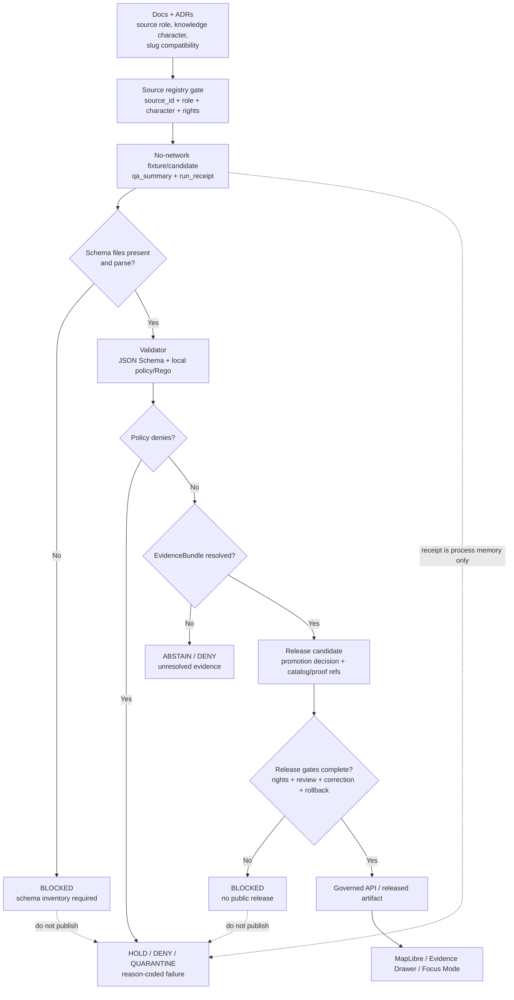

<!-- [KFM_META_BLOCK_V2]
doc_id: kfm://doc/TODO-ASSIGN-UUID
title: Atmosphere / Air Validation Status
type: standard
version: v1
status: draft
owners: TODO-VERIFY: @bartytime4life; atmosphere-air domain steward; schema/contract steward; policy steward
created: TODO-VERIFY-YYYY-MM-DD
updated: 2026-05-06
policy_label: public-draft-NEEDS_VERIFICATION
related: [../README.md, ./SOURCE_REGISTRY.md, ../architecture/ARCHITECTURE.md, ../architecture/KNOWLEDGE_CHARACTER.md, ../../../adr/ADR-0312-atmosphere-air-source-role-boundaries.md, ../../../adr/ADR-0418-atmosphere-air-schema-slug-compatibility.md, ../../../../tools/validators/air/validate_air_qa.py, ../../../../policy/air/air_qa.rego, ../../../../docs/runbooks/domains/atmosphere_air/slices/AIR_QA_PROMOTION_SLICE.md]
tags: [kfm, atmosphere-air, validation, source-role, knowledge-character, qa, release-gates, evidence]
notes: [Revises docs/domains/atmosphere_air/governance/VALIDATION_STATUS.md. Local workspace was not a mounted Git checkout; repository evidence was inspected through the GitHub connector. Current status is validation-partial and publication-blocked until schema inventory, EvidenceBundle closure, CI run evidence, source rights, release proof, and rollback targets are verified.]
[/KFM_META_BLOCK_V2] -->

<a id="top"></a>

# Atmosphere / Air Validation Status

Current validation posture for the Atmosphere / Air lane: what is checked, what is blocked, what is only repo-referenced, and what must be proven before public release.

<p align="center">
  
  
  
  
  
</p>

<p align="center">
  <a href="#status-summary">Status</a> ·
  <a href="#repo-fit">Repo fit</a> ·
  <a href="#current-validation-inventory">Inventory</a> ·
  <a href="#validation-flow">Flow</a> ·
  <a href="#gate-matrix">Gate matrix</a> ·
  <a href="#reason-codes">Reason codes</a> ·
  <a href="#safe-check-commands">Commands</a> ·
  <a href="#open-verification-backlog">Open verification</a>
</p>

> [!IMPORTANT]
> This document is a **validation status ledger**, not a publication approval. The current repo-visible Atmosphere / Air lane has useful no-network QA, policy, receipt, release-candidate, and documentation surfaces, but public release remains blocked until schema files, EvidenceBundle closure, source rights, CI results, release manifests, correction paths, and rollback targets are verified.

---

## Status summary

| Area | Current status | Meaning |
|---|---:|---|
| Domain documentation | CONFIRMED | The Atmosphere / Air documentation lane exists under `docs/domains/atmosphere_air/` and defines source-role, knowledge-character, evidence, and public-boundary posture. |
| Governance docs | CONFIRMED / PARTIAL | `SOURCE_REGISTRY.md` exists; `governance/README.md` is present but currently empty and should become the governance index. |
| No-network QA candidate | CONFIRMED / CANDIDATE ONLY | `data/processed/air/qa_summary.example.json` exists with `decision: candidate`; it is not public truth. |
| Run receipt | CONFIRMED / PROCESS MEMORY ONLY | `data/receipts/air/run_receipt.example.json` exists and records `network_access: disabled`; it is not proof or release authority. |
| QA validator | CONFIRMED / BLOCKED UNTIL SCHEMA VERIFIED | `tools/validators/air/validate_air_qa.py` exists and references `schemas/contracts/v1/air/qa_summary.schema.json`; schema inventory must be verified before claiming runnable validation. |
| Air QA policy | CONFIRMED / FRAGMENT | `policy/air/air_qa.rego` exists and covers threshold/coverage/reference gates; it is not the complete whole-domain policy. |
| Release-candidate tooling | CONFIRMED / CANDIDATE BUILDER | Publisher tooling exists for candidate proof/catalog/release shapes, but it depends on schema files and does not authorize publication. |
| Test files | REPO-REFERENCED / NOT RUN HERE | Air tests exist, including reentry slice tests; passing status is not claimed in this document. |
| CI workflow | CONFIRMED / RUN STATUS UNKNOWN | `.github/workflows/verify-tests-and-reproducibility.yml` exists; current run result and branch-protection enforcement remain NEEDS VERIFICATION. |
| Public release | BLOCKED | No public Atmosphere / Air artifact should be released from current status alone. |
| Live source activation | BLOCKED | Live AirNow, AQS, Mesonet, OpenAQ, smoke, AOD, model, advisory, and low-cost sensor connectors remain source-rights and policy gated. |

### Status labels used in this file

| Label | Use |
|---|---|
| `CONFIRMED` | Verified from current repo-visible evidence or controlling KFM doctrine. |
| `REPO-REFERENCED` | Referenced by repo files, tests, docs, or tools, but not fully proven as present/runnable/enforced. |
| `PROPOSED` | Recommended next validation or governance change. |
| `NEEDS VERIFICATION` | A concrete check is still required. |
| `BLOCKED` | Must not proceed until the stated gate is resolved. |
| `NOT RUN HERE` | Tests or commands are known but were not executed in this drafting session. |
| `UNKNOWN` | Not verified strongly enough to rely on. |

<p align="right"><a href="#top">Back to top ↑</a></p>

---

## Repo fit

**Target file:** `docs/domains/atmosphere_air/governance/VALIDATION_STATUS.md`

This file belongs under the `docs/` responsibility root because it is human-facing validation governance for a domain lane. It does not define machine schemas, executable policy, source-native data, proof packs, release manifests, or runtime behavior.

| Neighbor / dependency | Relative link | Status | Role |
|---|---|---:|---|
| Domain landing page | [`../README.md`](../README.md) | CONFIRMED | Lane scope, inputs, exclusions, lifecycle, source-role, and public-boundary posture. |
| Governance source registry | [`./SOURCE_REGISTRY.md`](./SOURCE_REGISTRY.md) | CONFIRMED | Human-readable source registry requirements and public-release activation rule. |
| Governance index | [`./README.md`](./README.md) | CONFIRMED / EMPTY | Should become the local governance index linking this file, source registry, validation, promotion, and rights posture. |
| Architecture | [`../architecture/ARCHITECTURE.md`](../architecture/ARCHITECTURE.md) | CONFIRMED | End-to-end trust path and bounded-context rules. |
| Knowledge character | [`../architecture/KNOWLEDGE_CHARACTER.md`](../architecture/KNOWLEDGE_CHARACTER.md) | CONFIRMED | Anti-collapse taxonomy and validation hooks. |
| Source-role ADR | [`../../../adr/ADR-0312-atmosphere-air-source-role-boundaries.md`](../../../adr/ADR-0312-atmosphere-air-source-role-boundaries.md) | CONFIRMED / DRAFT | Repo-wide source-role and knowledge-character boundary decision. |
| Slug compatibility ADR | [`../../../adr/ADR-0418-atmosphere-air-schema-slug-compatibility.md`](../../../adr/ADR-0418-atmosphere-air-schema-slug-compatibility.md) | CONFIRMED / PROPOSED | Governs `atmosphere_air`, `air`, and `atmosphere` naming compatibility. |
| QA validator | [`../../../../tools/validators/air/validate_air_qa.py`](../../../../tools/validators/air/validate_air_qa.py) | CONFIRMED / SCHEMA-BLOCKED | Validates QA-summary shape and local policy checks when the schema is available. |
| QA policy | [`../../../../policy/air/air_qa.rego`](../../../../policy/air/air_qa.rego) | CONFIRMED / FRAGMENT | Threshold, coverage, AQS hard-denial, receipt, and EvidenceBundle-reference gates. |
| No-network runbook | [`../../../../docs/runbooks/domains/atmosphere_air/slices/AIR_QA_PROMOTION_SLICE.md`](../../../../docs/runbooks/domains/atmosphere_air/slices/AIR_QA_PROMOTION_SLICE.md) | CONFIRMED | Describes no-network Air QA + promotion slice and live-connector prohibition. |
| QA candidate | [`../../../../data/processed/air/qa_summary.example.json`](../../../../data/processed/air/qa_summary.example.json) | CONFIRMED / CANDIDATE | Fixture-backed candidate; not public truth. |
| Run receipt | [`../../../../data/receipts/air/run_receipt.example.json`](../../../../data/receipts/air/run_receipt.example.json) | CONFIRMED / RECEIPT | Process memory; not EvidenceBundle, proof, or release manifest. |
| CI workflow | [`../../../../.github/workflows/verify-tests-and-reproducibility.yml`](../../../../.github/workflows/verify-tests-and-reproducibility.yml) | CONFIRMED / RUN UNKNOWN | Discovers tests and checks reproducibility; current run status not asserted here. |

> [!NOTE]
> Directory responsibility split remains active: docs explain, schemas validate shape, policy decides admissibility, tests/fixtures prove behavior, tools execute checks, data stores lifecycle artifacts, and release/proof surfaces authorize publication only after gates pass.

<p align="right"><a href="#top">Back to top ↑</a></p>

---

## Current validation inventory

### 1. Documentation and governance posture

| Validation surface | Current state | Validation implication |
|---|---:|---|
| `docs/domains/atmosphere_air/README.md` | CONFIRMED | Defines accepted inputs, exclusions, knowledge characters, denial codes, lifecycle, and no-public-internal-access posture. |
| `docs/domains/atmosphere_air/architecture/ARCHITECTURE.md` | CONFIRMED | Defines lane architecture, trust flow, bounded contexts, public-surface contract, and current no-network slice boundaries. |
| `docs/domains/atmosphere_air/architecture/KNOWLEDGE_CHARACTER.md` | CONFIRMED | Defines accepted taxonomy and anti-collapse rules that validators must eventually enforce. |
| `docs/domains/atmosphere_air/governance/SOURCE_REGISTRY.md` | CONFIRMED / THIN | Lists required source fields and activation rule; should be expanded into source-family verification status. |
| `docs/domains/atmosphere_air/governance/README.md` | CONFIRMED / EMPTY | Should link this file, source registry, rights/security, promotion, drift, and rollback docs when available. |
| ADR-0312 | CONFIRMED / DRAFT | Strong boundary decision, but not enforcement proof. |
| ADR-0418 | CONFIRMED / PROPOSED | Correctly keeps `atmosphere_air`, `air`, and `atmosphere` slugs distinct until migration proof exists. |

### 2. No-network QA candidate and receipt

| Artifact | Current state | Validation posture |
|---|---:|---|
| `data/processed/air/qa_summary.example.json` | CONFIRMED | Candidate has `decision: candidate`, PM2.5 `nowcast_hourly`, `ug_m3`, metrics, source labels, run receipt ref, and EvidenceBundle ref. |
| `data/receipts/air/run_receipt.example.json` | CONFIRMED | Receipt records `network_access: disabled`, pipeline path, output path, run ID, and completed status. |
| `data/processed/air/evidence_bundle.example.json` | NEEDS VERIFICATION | Referenced by QA candidate but not confirmed in this evidence snapshot. Public claims must not rely on unresolved EvidenceBundle refs. |

> [!WARNING]
> The QA summary is a candidate. The run receipt is process memory. Neither is publication proof, and neither should be treated as a released public air-quality claim.

### 3. Validator and policy checks

| Check | Current implementation signal | Current status |
|---|---|---:|
| JSON Schema validation for QA summary | `validate_air_qa.py` reads default schema `schemas/contracts/v1/air/qa_summary.schema.json`. | BLOCKED until schema file is confirmed. |
| Local policy fallback | `validate_air_qa.py` includes local denial logic for threshold, coverage, AQS hard-denial, and missing refs. | CONFIRMED / PARTIAL |
| Rego policy | `policy/air/air_qa.rego` contains matching deny rules. | CONFIRMED / FRAGMENT |
| Conftest/OPA execution | Validator probes for `conftest`; current runtime availability not verified here. | NEEDS VERIFICATION |
| Threshold gate A | `nowcast_max > 35` denies. | CONFIRMED policy fragment |
| Threshold gate B | `nowcast_vs_baseline_sigma > 2` denies. | CONFIRMED policy fragment |
| Coverage gate C | `station_coverage_pct < 75` denies. | CONFIRMED policy fragment |
| AQS hard-denial gate | hard-denial rows in baseline deny. | CONFIRMED policy fragment |
| Missing run receipt ref | candidate public promotion denied when missing. | CONFIRMED policy fragment |
| Missing EvidenceBundle ref | candidate public promotion denied when missing. | CONFIRMED policy fragment |
| Source-role and knowledge-character anti-collapse | Defined in docs/ADRs; not proven executable here. | NEEDS VERIFICATION |
| Unknown rights public release | Defined in docs/ADRs; not proven executable here. | NEEDS VERIFICATION |
| Raw/work/quarantine public path denial | Implemented in publisher boundary logic for release publication checks; broader runtime enforcement not verified. | PARTIAL / NEEDS VERIFICATION |

### 4. Release-candidate and publication boundary

| Tooling surface | Current state | Validation implication |
|---|---:|---|
| `tools/publishers/air/build_air_release_candidate.py` | CONFIRMED | Builds promotion decision, EvidenceBundle candidate, STAC/DCAT/PROV/triplet candidates, and release manifest when dependencies and schemas exist. |
| `tools/publishers/air/publish_air_release.py` | CONFIRMED | Checks release inputs, denies forbidden raw/work/quarantine/processed refs, blocks fixture-backed real publication, and requires attestation/AQS reconciliation for published status. |
| Schema dependencies | NEEDS VERIFICATION | Publisher tools validate against `schemas/contracts/v1/air/*` schema files that must be inventoried before release tooling can be trusted. |
| Publication output | BLOCKED | A fixture-backed no-network candidate may become a publication candidate only under explicitly bounded dry-run or candidate status; it must not become real public truth. |

### 5. Tests and workflow

| Surface | Repo evidence | Current status |
|---|---|---:|
| `.github/workflows/verify-tests-and-reproducibility.yml` | CONFIRMED | Workflow can discover Python tests, run pytest, validate JSON/YAML syntax, run baseline checks if present, and check clean-tree reproducibility. |
| `tests/air/test_air_reentry_release_candidate_slice.py` | CONFIRMED | Test expects specific `schemas/contracts/v1/air/*` schema files and validates unsafe candidate denial behavior. |
| Workflow run result | UNKNOWN | No current run output is recorded in this document. |
| Schema files expected by tests | NEEDS VERIFICATION | Some schema paths referenced by tests/tools must be confirmed in the active checkout before claiming green tests. |
| Branch protection | UNKNOWN | Do not claim merge-blocking enforcement without branch/ruleset evidence. |

<p align="right"><a href="#top">Back to top ↑</a></p>

---

## Validation flow



---

## Gate matrix

| Gate | What must be true | Current lane status | Required next proof |
|---|---|---:|---|
| G0 — Documentation coherence | README, architecture, ADRs, source registry, runbooks, and validation status agree. | PARTIAL | Fill governance README and verify cross-links. |
| G1 — Schema inventory | Referenced schema files exist, parse, and use the active schema-home convention. | NEEDS VERIFICATION | Inventory `schemas/contracts/v1/air/` and/or approved alias target. |
| G2 — Fixture parse | QA summary and run receipt parse and remain fixture/candidate/process-memory only. | CONFIRMED for example files | Add valid/invalid fixture matrix and capture validation output. |
| G3 — Validator runnable | `validate_air_qa.py` runs against fixture and active schema in a clean checkout. | BLOCKED / NOT RUN HERE | Run validator in active repo and store result in PR note or receipt. |
| G4 — Policy coverage | Rego or repo-native policy covers threshold, coverage, refs, source role, knowledge character, rights, stale state, and public-boundary denial. | PARTIAL | Expand beyond current QA fragment and add negative tests. |
| G5 — Evidence closure | Every consequential claim resolves EvidenceRef to EvidenceBundle. | BLOCKED | Confirm or create referenced evidence bundle and evidence-closure validator. |
| G6 — Catalog/proof closure | STAC/DCAT/PROV/triplet candidates, promotion decision, catalog matrix, and proof refs align. | NEEDS VERIFICATION | Run release-candidate builder after schema inventory is complete. |
| G7 — Release readiness | ReleaseManifest has evidence refs, policy decision, review state, correction path, rollback target, and public-safe artifact refs. | BLOCKED | Add release validation and rollback drill evidence. |
| G8 — Public boundary | Public API/UI/Focus/export cannot access RAW, WORK, QUARANTINE, connector-private, normalize-stage, or unpublished candidate artifacts. | PARTIAL | Add public-surface tests and runtime/API verification. |
| G9 — CI enforcement | Workflow passes with relevant tests on active branch and is required where appropriate. | UNKNOWN | Inspect workflow run and branch protection/ruleset evidence. |
| G10 — Live source activation | Rights, terms, quotas, schema, source role, cadence, and public-release posture are verified. | BLOCKED | SourceActivationDecision or equivalent source-rights record. |

<p align="right"><a href="#top">Back to top ↑</a></p>

---

## Reason codes

Reason codes should remain stable across validators, policy, release tools, API envelopes, Evidence Drawer states, Focus Mode responses, and review records.

| Code | Trigger | Expected outcome |
|---|---|---|
| `gate_a_nowcast_max_exceeds_35` | `nowcast_max > 35` in QA summary. | `DENY` or steward-review hold. |
| `gate_b_nowcast_vs_baseline_sigma_exceeds_2` | `nowcast_vs_baseline_sigma > 2`. | `DENY` or steward-review hold. |
| `gate_c_station_coverage_below_75` | `station_coverage_pct < 75`. | `DENY` unless reviewed and attested. |
| `aqs_hard_denial_rows_present_in_baseline` | AQS hard-denial rows included in baseline. | `DENY`. |
| `missing_run_receipt_ref_for_public_promotion` | Candidate lacks run receipt reference. | `DENY`. |
| `missing_evidence_bundle_ref_for_public_promotion` | Candidate lacks EvidenceBundle reference. | `DENY`. |
| `promotion_decision_not_approved_for_catalog` | Release publication requested without approved catalog decision. | `DENY`. |
| `release_manifest_not_catalog_candidate_or_better` | Release manifest readiness is below catalog-candidate. | `DENY`. |
| `forbidden_raw_work_quarantine_or_processed_reference` | Public release refs internal lifecycle or unpromoted processed material. | `DENY`. |
| `nowcast_mislabelled_as_validated_truth` | NowCast is treated as validated AQS truth. | `DENY`. |
| `fixture_backed_artifacts_cannot_be_published_truth` | Fixture evidence is promoted as real public truth. | `DENY`. |
| `missing_gate_d_attestation_for_published` | Published status requested without attestation. | `DENY`. |
| `missing_aqs_reconciliation_for_published` | Published status requested without AQS reconciliation. | `DENY`. |
| `aqs_reconciliation_not_ready` | AQS reconciliation is pending or conflicted. | `DENY`. |
| `aqs_reconciliation_older_than_72_hours` | AQS reconciliation is too stale for publication gate. | `DENY`. |
| `ATMOS_MISSING_SOURCE_ROLE` | Object lacks source role or descriptor ref. | `DENY`. |
| `ATMOS_MISSING_KNOWLEDGE_CHARACTER` | Object lacks accepted knowledge character. | `DENY`. |
| `ATMOS_UNKNOWN_RIGHTS_PUBLIC` | Public output requested while rights remain unknown. | `DENY`. |
| `ATMOS_AQI_AS_CONCENTRATION` | AQI/report index treated as raw concentration. | `DENY`. |
| `ATMOS_AOD_AS_PM25` | AOD treated as PM2.5 without governed model support. | `DENY`. |
| `ATMOS_MASK_AS_EXPOSURE` | Smoke/plume/remote mask treated as exposure measurement. | `DENY` or `ABSTAIN`. |
| `ATMOS_MODEL_AS_OBSERVED` | Model output labeled as observed measurement. | `DENY`. |
| `ATMOS_RECEIPT_AS_PROOF` | Run receipt used as EvidenceBundle or ReleaseManifest. | `DENY`. |

> [!TIP]
> Prefer existing lower-case gate codes where current air tooling already emits them. Use `ATMOS_*` codes for whole-domain source-role, knowledge-character, rights, lifecycle, and anti-collapse gates that are not yet covered by the current QA slice.

---

## Validation status by object family

| Object / surface | Required validation | Current status | Blocker |
|---|---|---:|---|
| `qa_summary` | JSON Schema + QA policy + candidate-only posture. | PARTIAL | Referenced schema needs verification. |
| `run_receipt` | Receipt shape + process-memory boundary. | PARTIAL | Receipt schema and receipt/proof split tests need verification. |
| `evidence_bundle` | EvidenceRef closure + source/provenance support. | BLOCKED | Referenced example bundle not confirmed in this snapshot. |
| `promotion_decision` | Gate output + decision state + reason codes. | REPO-REFERENCED | Schema and builder execution need verification. |
| `release_manifest` | Artifact refs + public readiness + rollback/correction support. | REPO-REFERENCED | Schema, proof closure, and release validation need verification. |
| `publication_manifest` | Public-boundary denial, artifact hashes, status. | REPO-REFERENCED | Publication command execution and source-rights proof not verified. |
| `source_descriptor` | `source_id`, role, character, publisher, rights, verification, public-release flag, timestamp. | DOC-CONFIRMED / EXECUTION UNKNOWN | Machine schema and source registry file need verification. |
| `knowledge_character` | Accepted taxonomy + anti-collapse tests. | DOC-CONFIRMED / EXECUTION UNKNOWN | Enum/schema/policy/test enforcement needed. |
| `layer descriptor` | Release state + drawer evidence route + caveat/freshness fields. | NEEDS VERIFICATION | Map layer schema and UI payload validation not confirmed. |
| `Focus Mode envelope` | Finite outcome + evidence/citation/policy state. | NEEDS VERIFICATION | Runtime binding and citation validation not confirmed. |
| `rollback target` | Release rollback or tombstone target. | NEEDS VERIFICATION | Rollback drill or receipt not confirmed. |

<p align="right"><a href="#top">Back to top ↑</a></p>

---

## Safe check commands

Run these only from a real checkout of `bartytime4life/Kansas-Frontier-Matrix` or its governed fork/branch. They are read-only or dry-run oriented unless explicitly writing output to a temporary directory.

```bash
# Confirm branch and local state before relying on repo paths.
git status --short
git branch --show-current

# Inspect nearby docs and governance surfaces.
find docs/domains/atmosphere_air -maxdepth 4 -type f | sort
find docs/adr -maxdepth 1 -type f -name 'ADR-0*.md' | sort | grep -E '0312|0418|0001|0002' || true

# Confirm current air schema inventory.
find schemas/contracts/v1 -maxdepth 4 -type f 2>/dev/null \
  | sort \
  | grep -E '/(air|atmosphere)/' || true

# Parse candidate artifacts.
python -m json.tool data/processed/air/qa_summary.example.json > /dev/null
python -m json.tool data/receipts/air/run_receipt.example.json > /dev/null

# Validate the no-network QA candidate only after the referenced schema exists.
python tools/validators/air/validate_air_qa.py \
  data/processed/air/qa_summary.example.json

# Run air tests only after schema inventory is resolved.
python -m pytest -q tests/air

# Run the broader repo workflow locally only if the repo supports it.
# Do not treat workflow file presence as a passing run.
```

> [!CAUTION]
> Do not run live source fetchers, publish real public artifacts, bind UI/API routes, or mark a release as public from this status file. This lane is still validation-partial and publication-blocked.

---

## Definition of done for moving status from blocked to validated

- [ ] Confirm schema-home state for `air`, `atmosphere`, and `atmosphere_air` through ADR-0001 and ADR-0418.
- [ ] Confirm `schemas/contracts/v1/air/qa_summary.schema.json` or approved alias exists and parses.
- [ ] Confirm schemas for EvidenceBundle, promotion decision, release manifest, attestation, AQS reconciliation, and publication manifest exist or are explicitly out of scope.
- [ ] Run `tools/validators/air/validate_air_qa.py` against `qa_summary.example.json` and capture output.
- [ ] Confirm the candidate’s `evidence_bundle_ref` resolves to a valid EvidenceBundle or update the candidate to an explicit blocked state.
- [ ] Run relevant `tests/air` tests and capture result.
- [ ] Confirm `.github/workflows/verify-tests-and-reproducibility.yml` passes for the active branch or document why CI is advisory only.
- [ ] Add invalid fixtures for missing run receipt, missing EvidenceBundle, over-threshold NowCast, low coverage, AQS hard-denial rows, AQI-as-concentration, AOD-as-PM2.5, model-as-observation, fixture-backed publication, and public internal-stage refs.
- [ ] Expand policy beyond the current QA fragment to cover source role, knowledge character, unknown rights, stale state, release state, correction path, and rollback target.
- [ ] Verify source rights and public-release posture before activating live connectors.
- [ ] Emit or verify ReleaseManifest, correction path, rollback target, and tombstone/withdrawal behavior before public release.
- [ ] Update this status file with date, evidence link, run/receipt ID, and reviewer.

---

## Update triggers

Update this file whenever one of the following changes.

| Trigger | Required update |
|---|---|
| New source family | Add source-validation row, rights status, verification owner, and public-release block/allow state. |
| Schema added or moved | Update schema inventory, slug compatibility, affected validators, tests, and rollback note. |
| Validator changed | Record new checks, reason codes, fixture coverage, and latest known run status. |
| Policy changed | Record deny/abstain behavior and required fixtures. |
| QA candidate changed | Record candidate status, evidence refs, receipt refs, and whether changes affect release gates. |
| EvidenceBundle added | Record closure status and whether public claims remain blocked. |
| Release candidate generated | Record manifest path, promotion decision, gate result, rollback target, and publication posture. |
| CI workflow changes | Record workflow path, affected commands, and latest verified status if available. |
| Public UI/API/Focus integration proposed | Add public-boundary validation rows before integration is treated as active. |
| Validation failure | Add reason code, owner, blocking state, follow-up issue/PR if available, and rollback/correction note. |

---

## Open verification backlog

| Item | Status | Owner | Why it matters |
|---|---:|---|---|
| Final `doc_id` for this file | TODO | docs steward | Required for KFM Meta Block V2 traceability. |
| Owners and CODEOWNERS routing | NEEDS VERIFICATION | domain + governance stewards | Required before validation status becomes reviewable authority. |
| Policy label | NEEDS VERIFICATION | policy steward | Determines public/restricted posture. |
| Governance README content | TODO | docs steward | Empty local governance index reduces navigability. |
| Schema inventory for `schemas/contracts/v1/air/` | NEEDS VERIFICATION | schema steward | Current validator and tests reference this family. |
| Schema inventory for `schemas/contracts/v1/atmosphere/` | NEEDS VERIFICATION | schema steward | ADR-0418 treats it as future/whole-domain concept until proven. |
| QA summary schema | NEEDS VERIFICATION | schema steward | Required for `validate_air_qa.py`. |
| EvidenceBundle example path | NEEDS VERIFICATION | evidence steward | QA candidate references it; claims must abstain/deny until it resolves. |
| Validator execution | NOT RUN HERE | validation steward | Needed before PASS/FAIL claims. |
| Air tests execution | NOT RUN HERE | validation steward | Needed before enforcement claims. |
| CI workflow run status | UNKNOWN | repo steward | Workflow exists; current passing status not asserted. |
| Branch protection / required checks | UNKNOWN | repo steward | Needed before claiming merge-blocking enforcement. |
| Live source rights | UNKNOWN | source steward | Public release must remain blocked until rights and terms are verified. |
| Release/correction/rollback proof | NEEDS VERIFICATION | release steward | Required before publishing public artifacts. |
| Evidence Drawer / Focus Mode binding | UNKNOWN | UI/runtime steward | This status file does not prove public UI/runtime behavior. |

<p align="right"><a href="#top">Back to top ↑</a></p>
