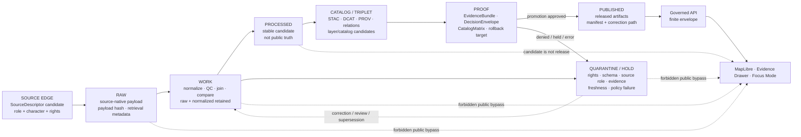

<!-- [KFM_META_BLOCK_V2]
doc_id: kfm://doc/TODO-VERIFY-UUID-atmosphere-air-data-lifecycle
title: Atmosphere / Air Data Lifecycle
type: standard
version: v1
status: draft
owners: TODO-VERIFY: atmosphere-air domain steward, data steward, source steward, policy steward, release steward
created: TODO-VERIFY-YYYY-MM-DD
updated: 2026-05-06
policy_label: public-draft-NEEDS_VERIFICATION
related: [../README.md, ../architecture/ARCHITECTURE.md, ../architecture/KNOWLEDGE_CHARACTER.md, ../architecture/UNIT_CONVERSIONS.md, ../governance/SOURCE_REGISTRY.md, ../governance/SECURITY_AND_RIGHTS.md, ../governance/VALIDATION_STATUS.md, ./README.md, ./PROMOTION_AND_ROLLBACK.md, ../../../adr/ADR-0312-atmosphere-air-source-role-boundaries.md, ../../../adr/ADR-0418-atmosphere-air-schema-slug-compatibility.md, ../../../runbooks/domains/atmosphere_air/slices/AIR_QA_PROMOTION_SLICE.md, ../../../../connectors/pipelines/air/README.md, ../../../../data/processed/air/README.md, ../../../../data/receipts/air/README.md, ../../../../policy/air/air_qa.rego, ../../../../tools/validators/air/validate_air_qa.py, ../../../../tools/publishers/air/build_air_release_candidate.py]
tags: [kfm, atmosphere-air, data-lifecycle, raw, work, quarantine, processed, catalog, proof, published, evidence, policy, release, rollback]
notes: [Revises repo-visible docs/domains/atmosphere_air/operations/DATA_LIFECYCLE.md. Local workspace was not a mounted Git checkout; repository evidence was inspected through the GitHub connector. doc_id, owners, created date, final policy label, active schema inventory, CI status, source rights, release maturity, and runtime behavior remain NEEDS VERIFICATION.]
[/KFM_META_BLOCK_V2] -->

<a id="top"></a>

# Atmosphere / Air Data Lifecycle

Lifecycle rules for Atmosphere / Air data, receipts, proof candidates, release candidates, governed API payloads, map layers, Evidence Drawer payloads, and Focus Mode context.

<p align="center">
  
  
  
  
  
</p>

<p align="center">
  <a href="#status-snapshot">Status</a> ·
  <a href="#scope">Scope</a> ·
  <a href="#repo-fit">Repo fit</a> ·
  <a href="#accepted-inputs">Inputs</a> ·
  <a href="#exclusions">Exclusions</a> ·
  <a href="#state-model">State model</a> ·
  <a href="#state-transition-flow">Flow</a> ·
  <a href="#promotion-requirements">Promotion</a> ·
  <a href="#air-qa-no-network-slice">QA slice</a> ·
  <a href="#validation-and-denial-matrix">Validation</a> ·
  <a href="#rollback-and-correction">Rollback</a> ·
  <a href="#open-verification">Open verification</a>
</p>

> [!IMPORTANT]
> This lifecycle document does **not** authorize live source fetching, public release, public map layers, direct UI/API access to internal lifecycle data, or Focus Mode answers. It defines the state boundaries those later systems must preserve.

---

## Status snapshot

| Field | Status |
|---|---:|
| Target file | `docs/domains/atmosphere_air/operations/DATA_LIFECYCLE.md` |
| Current document role | Human-facing lifecycle control surface for the Atmosphere / Air lane. |
| Repo-visible prior state | CONFIRMED: thin lifecycle stub with `RAW`, `WORK`, `QUARANTINE`, `PROCESSED`, `CATALOG`, `PROOF`, and `PUBLISHED` plus a short promotion checklist. |
| Operations directory state | CONFIRMED: `operations/README.md` is present but effectively empty; `PROMOTION_AND_ROLLBACK.md` is present as a thin companion. |
| Current posture | Draft lifecycle expansion; publication remains blocked unless evidence, policy, review, release, correction, and rollback gates pass. |
| Implementation maturity | PARTIAL / NEEDS VERIFICATION: no-network `air` candidate and receipt surfaces are repo-visible, but complete schema inventory, CI run evidence, live-source rights, EvidenceBundle closure, and runtime/public behavior remain unverified. |

> [!WARNING]
> A processed candidate, run receipt, QA summary, catalog candidate, tile, map layer, popup, Focus answer, or release-candidate file is not public truth by itself. Public exposure requires governed promotion and a rollback target.

<p align="right"><a href="#top">Back to top ↑</a></p>

---

## Scope

This file defines the lifecycle contract for Atmosphere / Air objects as they move from source admission to public-safe release.

It covers lifecycle handling for:

- source descriptors and source-family candidates;
- raw source payloads;
- work-stage normalization, unit handling, and quality checks;
- quarantine and hold states;
- processed candidates;
- catalog, provenance, and graph/triplet candidates;
- receipts, validation reports, EvidenceBundle candidates, and release-candidate objects;
- published artifacts, governed API envelopes, MapLibre layers, Evidence Drawer payloads, Focus Mode context, exports, corrections, and rollback references.

It does **not** define source credentials, live connector behavior, machine schemas, executable policy, deployed route handlers, UI components, CI enforcement, branch protection, or release approval by itself. Those belong in their responsibility roots and must link back here when lifecycle state changes.

### Lifecycle law

```text
SOURCE EDGE -> RAW -> WORK / QUARANTINE -> PROCESSED -> CATALOG / TRIPLET -> PROOF -> PUBLISHED
```

Public clients consume only governed APIs, released artifacts, public-safe tiles/layers, catalog records, and EvidenceBundle-backed payloads. They must not read `RAW`, `WORK`, `QUARANTINE`, connector-private output, normalization-stage candidates, unpublished processed artifacts, or direct model output.

<p align="right"><a href="#top">Back to top ↑</a></p>

---

## Repo fit

This document belongs under `docs/` because it is human-facing lifecycle doctrine for a domain lane. It points to lifecycle data, receipts, proof objects, policies, validators, and release tooling without becoming those systems.

| Relationship | Path | Status | Role |
|---|---|---:|---|
| Domain landing page | [`../README.md`](../README.md) | CONFIRMED repo-visible | Lane scope, accepted inputs, exclusions, knowledge characters, and high-level governed flow. |
| Main architecture | [`../architecture/ARCHITECTURE.md`](../architecture/ARCHITECTURE.md) | CONFIRMED repo-visible | End-to-end trust path, bounded contexts, public-surface contract, and no-network slice boundaries. |
| Knowledge-character guide | [`../architecture/KNOWLEDGE_CHARACTER.md`](../architecture/KNOWLEDGE_CHARACTER.md) | CONFIRMED repo-visible | Anti-collapse taxonomy that lifecycle gates must preserve. |
| Unit conversion guide | [`../architecture/UNIT_CONVERSIONS.md`](../architecture/UNIT_CONVERSIONS.md) | CONFIRMED repo-visible | Raw and normalized value discipline. |
| Source registry | [`../governance/SOURCE_REGISTRY.md`](../governance/SOURCE_REGISTRY.md) | CONFIRMED repo-visible | Source descriptor fields, source roles, rights posture, and activation gates. |
| Security and rights | [`../governance/SECURITY_AND_RIGHTS.md`](../governance/SECURITY_AND_RIGHTS.md) | CONFIRMED repo-visible | Rights, access, public-release, and exposure guardrails. |
| Validation status | [`../governance/VALIDATION_STATUS.md`](../governance/VALIDATION_STATUS.md) | CONFIRMED repo-visible | Current validation inventory and publication-blocked status. |
| Operations index | [`./README.md`](./README.md) | CONFIRMED repo-visible / EMPTY | Should become the local operations index. |
| Promotion and rollback | [`./PROMOTION_AND_ROLLBACK.md`](./PROMOTION_AND_ROLLBACK.md) | CONFIRMED repo-visible / THIN | Release promotion and rollback companion; should be expanded with this lifecycle doc. |
| Source-role ADR | [`../../../adr/ADR-0312-atmosphere-air-source-role-boundaries.md`](../../../adr/ADR-0312-atmosphere-air-source-role-boundaries.md) | CONFIRMED repo-visible / draft | Governs source-role and knowledge-character boundaries. |
| Slug compatibility ADR | [`../../../adr/ADR-0418-atmosphere-air-schema-slug-compatibility.md`](../../../adr/ADR-0418-atmosphere-air-schema-slug-compatibility.md) | CONFIRMED repo-visible / proposed | Keeps `atmosphere_air`, `air`, and `atmosphere` naming boundaries explicit. |
| No-network QA runbook | [`../../../runbooks/domains/atmosphere_air/slices/AIR_QA_PROMOTION_SLICE.md`](../../../runbooks/domains/atmosphere_air/slices/AIR_QA_PROMOTION_SLICE.md) | CONFIRMED repo-visible | Fixture-backed PM2.5 / NowCast / AQS / Mesonet governance slice. |
| Air connector | [`../../../../connectors/pipelines/air/README.md`](../../../../connectors/pipelines/air/README.md) | CONFIRMED repo-visible | Candidate and receipt producer; not publication authority. |
| Processed air data | [`../../../../data/processed/air/README.md`](../../../../data/processed/air/README.md) | CONFIRMED repo-visible | Stable processed candidate zone; not public endpoint. |
| Air receipts | [`../../../../data/receipts/air/README.md`](../../../../data/receipts/air/README.md) | CONFIRMED repo-visible | Process memory; receipts are not proof or release. |
| Air QA policy | `../../../../policy/air/air_qa.rego` | REPO-REFERENCED / NEEDS VERIFICATION | QA policy fragment; not complete whole-domain policy. |
| Air QA validator | `../../../../tools/validators/air/validate_air_qa.py` | REPO-REFERENCED / NEEDS VERIFICATION | Validator pressure; schema inventory and execution status require verification. |
| Release-candidate tooling | `../../../../tools/publishers/air/` | REPO-REFERENCED / NEEDS VERIFICATION | Candidate proof/catalog/release tooling; not public publication by itself. |

> [!CAUTION]
> Some adjacent repo-visible docs still reference a former flat `docs/domains/atmosphere_air/DATA_LIFECYCLE.md` path. Treat those as link debt until a PR updates links or adds an explicit redirect/compatibility note.

### Responsibility-root boundary

| Root | Owns | Does not own |
|---|---|---|
| `docs/` | Lifecycle doctrine, architecture, ADRs, runbooks, review guidance. | Machine validation, source-native data, release proof. |
| `data/raw/` | Source-native payload capture and payload hashes. | Public serving. |
| `data/work/` | Transform staging, normalization, QC, and intermediate review. | Publication. |
| `data/quarantine/` | Failed, conflicted, blocked, restricted, stale, or rights-unclear material. | Public truth. |
| `data/processed/` | Stable processed candidates and version packs. | Release approval. |
| `data/catalog/` / `data/triplets/` | Discovery, provenance, graph/relation projections, catalog closure candidates. | Canonical truth by themselves. |
| `data/receipts/` | Process memory, validation memory, run logs, migration and rollback receipts. | EvidenceBundle or ReleaseManifest authority. |
| `data/proofs/` | EvidenceBundle, DecisionEnvelope, CatalogMatrix, release proof candidates, rollback references. | Raw source storage. |
| `data/published/` | Released public-safe or steward-approved materialized artifacts. | Internal lifecycle stages. |
| `policy/` | Allow, deny, restrict, abstain, release, and sensitivity behavior. | Object semantics by itself. |
| `schemas/` | Machine-checkable shape. | Policy approval by itself. |
| `contracts/` | Human-readable object meaning and invariants. | Executable policy by itself. |

<p align="right"><a href="#top">Back to top ↑</a></p>

---

## Accepted inputs

Inputs belong in this lifecycle only when they can be assigned to a governed state and inspected without weakening the trust membrane.

| Input | First valid lifecycle state | Minimum required support |
|---|---:|---|
| SourceDescriptor candidate | `SOURCE EDGE` | `source_id`, `source_role`, `knowledge_character`, publisher, rights posture, verification status, public-release flag. |
| Raw source payload | `RAW` | Retrieval metadata, source descriptor ref, payload hash, access class, rights status. |
| Connector output | `WORK` or `PROCESSED` candidate | Candidate status, receipt ref, source refs, parameter/unit metadata, no-public-release posture. |
| Unit-normalized observation | `WORK` then `PROCESSED` | Raw value/unit, normalized value/unit, conversion rule, time support, source payload hash. |
| QA summary | `PROCESSED` candidate | Decision state, metrics, parameter/unit, time window, run receipt ref, EvidenceBundle ref or explicit block. |
| Run receipt | `RECEIPT` / process memory | Run ID, tool/script path, inputs/outputs, network posture, status, hashes where applicable. |
| EvidenceBundle candidate | `PROOF` candidate | EvidenceRefs, source roles, provenance, hashes, scope, review state, rights posture. |
| Catalog/provenance candidate | `CATALOG` | STAC/DCAT/PROV/catalog matrix refs where applicable, source refs, artifact hashes. |
| Layer descriptor candidate | `CATALOG` or `PUBLISHED` only after release | Release ref, evidence route, freshness, caveats, source role, knowledge character. |
| Focus/Evidence Drawer payload | Governed API response | Finite outcome, EvidenceBundle refs, policy state, release state, caveats, reason codes. |
| Correction or rollback record | `PROOF`, `RELEASE`, or `PUBLISHED` support | Prior artifact ref, target artifact ref, reason, reviewer, validation report, rollback receipt. |

<p align="right"><a href="#top">Back to top ↑</a></p>

---

## Exclusions

| Exclusion | Correct handling | Why |
|---|---|---|
| Secrets, tokens, passwords, cookies, API keys, `.env` content, private endpoints | Never commit; use secret management and restricted runbooks. | Public docs and artifacts must not leak access details. |
| Raw payloads in public docs, public APIs, map layers, or Focus payloads | Keep in `RAW`; expose only governed evidence summaries where authorized. | Raw evidence can carry rights, privacy, source, or quality constraints. |
| Work-stage scratch or failed intermediate output in public artifacts | Keep in `WORK` or `QUARANTINE`. | Process state is not publication. |
| Processed candidate served directly to public clients | Promote through catalog/proof/release first. | Processed does not equal published. |
| Run receipt used as EvidenceBundle or ReleaseManifest | Keep receipts as process memory; link proof objects separately. | Receipts are audit support, not proof closure. |
| AQI treated as concentration | Deny or quarantine until semantics are corrected. | AQI/report and concentration are different object types. |
| AOD or smoke masks treated as PM2.5/exposure without governed model support | Deny or require model/fusion evidence and assumptions. | Remote-sensing context is not surface exposure by default. |
| Model fields labeled as observations | Deny and keep modeled knowledge character. | Modeled fields are not observed measurements. |
| Fusion products that hide input evidence, method, uncertainty, or transform identity | Deny or hold. | Derived products must remain derived. |
| Public release with unknown rights, unknown source role, missing EvidenceRefs, or missing rollback target | Deny or hold. | Fail-closed publication posture. |
| KFM-issued emergency or life-safety instruction | Route users to official alerting/source agencies; KFM may provide context only. | KFM is not an emergency alerting system. |

<p align="right"><a href="#top">Back to top ↑</a></p>

---

## State model

The lifecycle states below preserve the existing heading anchor while expanding the prior state list.

| State | Meaning | Atmosphere / Air examples | Public posture | Required next gate |
|---|---|---|---:|---|
| `SOURCE EDGE` | Source-family intake and source descriptor review before payload capture. | EPA AQS-like archive, AirNow-like report, Kansas Mesonet context, OpenAQ-like aggregator, smoke/model source, internal fixture. | Not public evidence. | Source identity, source role, knowledge character, rights, cadence, and access review. |
| `RAW` | Source-native payloads and retrieval metadata. | API response snapshot, original CSV/JSON, source-native station list, model file pointer. | Not public. | Payload hash, retrieval receipt, source descriptor ref, rights and sensitivity screening. |
| `WORK` | Transform staging, unit normalization, QC, joins, enrichment, source-role checks, and candidate assembly. | Raw PM2.5 values normalized to `ug_m3`, station coverage calculation, NowCast comparison, AQS baseline reconciliation draft. | Not public. | Schema, source-role, unit, evidence, and policy checks. |
| `QUARANTINE` | Failed, blocked, conflicted, rights-unclear, stale, unsafe, or review-required material. | Missing rights, missing EvidenceRefs, AQI-as-concentration, AOD-as-PM2.5, stale live-state claim, model-as-observed, source disagreement. | Not public; safe status may be summarized. | Correct, deny, review, supersede, or withdraw. |
| `PROCESSED` | Stable processed candidate, still not public truth. | `qa_summary.example.json`, processed observation pack, site metadata pack, model-field pack, remote mask pack, fusion candidate. | Not public by default. | Catalog/provenance/triplet candidate, EvidenceBundle closure, policy decision. |
| `CATALOG / TRIPLET` | Discovery, provenance, relation projection, catalog matrix, STAC/DCAT/PROV candidates, and graph edges. | Catalog candidate, layer descriptor candidate, source-to-parameter relation, station-to-observation relation. | Not public unless tied to release. | Proof closure, review, promotion decision. |
| `PROOF` | Claim-supporting evidence and release-candidate proof objects. | EvidenceBundle candidate, DecisionEnvelope, PromotionDecision candidate, CatalogMatrix, validation report, rollback target. | Review-only until promoted. | Release decision and rollback/correction checks. |
| `PUBLISHED` | Released public-safe or steward-approved artifacts with manifest, evidence, policy, correction, and rollback support. | Published layer package, API read model, public-safe export, Evidence Drawer payload set, Focus-ready context pack. | Public or access-scoped per release. | Ongoing freshness, correction, withdrawal, and rollback monitoring. |

### State invariants

1. `RAW`, `WORK`, and `QUARANTINE` are never public client inputs.
2. `PROCESSED` is stable enough to inspect but not public truth.
3. `CATALOG / TRIPLET` improves discoverability and relation lookup; it does not replace evidence.
4. `PROOF` can support a release decision; it does not become public by existing.
5. `PUBLISHED` requires a governed decision, not a file copy or script success.
6. `ABSTAIN`, `DENY`, and `ERROR` are valid lifecycle outcomes when evidence, policy, rights, or runtime state cannot support release.

<p align="right"><a href="#top">Back to top ↑</a></p>

---

## State transition flow



### Transition rules

| Transition | Allowed when | Block when |
|---|---|---|
| `SOURCE EDGE -> RAW` | Source descriptor candidate has enough identity, access, and review posture for capture. | Source identity, access, rights, or purpose is unknown. |
| `RAW -> WORK` | Payload hash, retrieval metadata, and source descriptor ref are preserved. | Source-native payload cannot be traced. |
| `WORK -> QUARANTINE` | Any schema, source-role, unit, rights, evidence, freshness, or policy gate fails. | Never block quarantine for convenience. |
| `WORK -> PROCESSED` | Candidate passes basic shape, traceability, unit, and source-role checks. | Candidate is missing evidence, rights posture, or anti-collapse support. |
| `PROCESSED -> CATALOG / TRIPLET` | Candidate has stable identity, metadata, source refs, and artifact hashes. | Catalog would hide source role, method, uncertainty, or public restrictions. |
| `CATALOG / TRIPLET -> PROOF` | EvidenceRefs resolve and catalog/provenance candidates align. | EvidenceBundle cannot resolve or catalog closure conflicts. |
| `PROOF -> PUBLISHED` | Promotion decision is approved with policy, review, release manifest, correction path, and rollback target. | Any required gate is missing, denied, stale, conflicted, or unresolved. |
| `PUBLISHED -> correction / rollback` | Release becomes stale, superseded, incorrect, rights-blocked, or policy-invalid. | Never silently mutate public history. |

<p align="right"><a href="#top">Back to top ↑</a></p>

---

## Lifecycle artifacts

| Artifact | Lifecycle role | Required location posture | Not allowed to become |
|---|---|---|---|
| `SourceDescriptor` | Source admission and constraints. | Registry / source governance home after path verification. | EvidenceBundle by itself. |
| Raw payload | Source-native evidence capture. | `data/raw/...` or repo-approved raw zone. | Public payload. |
| Work artifact | Transform and review staging. | `data/work/...` or build scratch with receipt. | Published artifact. |
| Quarantine record | Failure, hold, conflict, or deny state. | `data/quarantine/...` or policy/review hold record. | Hidden failure. |
| Processed version pack | Stable candidate data. | `data/processed/air/...` or ADR-approved alias. | Public truth by folder location. |
| Run receipt | Process memory. | `data/receipts/air/...` or ADR-approved alias. | EvidenceBundle, proof pack, or ReleaseManifest. |
| Validation report | Check output and reason codes. | Receipts/proofs per repo convention. | Policy approval by itself. |
| Catalog record | Discovery and provenance. | `data/catalog/...` with hash/ref closure. | Canonical truth. |
| Triplet/graph delta | Relation projection. | `data/triplets/...` or graph import candidate. | Source evidence. |
| EvidenceBundle | Claim-supporting evidence closure. | `data/proofs/...` or approved proof surface. | Raw source replacement. |
| DecisionEnvelope | Finite runtime/release decision support. | Proof/runtime contract surface. | Free-form success flag. |
| ReleaseManifest | Release scope, artifact refs, hashes, rollback target. | `release/` or proof/published surface per repo convention. | Lifecycle shortcut. |
| Published artifact | Public-safe materialized output. | `data/published/...` or approved release target. | Canonical truth source. |
| CorrectionNotice / rollback receipt | Correction, withdrawal, supersession, rollback memory. | Release/proofs/receipts per repo convention. | Deletion of history. |

<p align="right"><a href="#top">Back to top ↑</a></p>

---

## Promotion requirements

Promotion is a governed state transition from proof-backed candidate to released artifact. It is not a move from one folder to another.

A release candidate must satisfy all required gates for its release class.

| Gate | Required proof | Failure outcome |
|---|---|---|
| Source identity | Source descriptor exists or source identity is otherwise resolved. | `DENY` |
| Source role | `source_role` is present and compatible with the claim. | `DENY` / `ATMOS_MISSING_SOURCE_ROLE` |
| Knowledge character | Accepted `knowledge_character` is present. | `DENY` / `ATMOS_MISSING_KNOWLEDGE_CHARACTER` |
| Rights | License, terms, attribution, redistribution, automation, and public-release posture are known. | `DENY` / `ATMOS_UNKNOWN_RIGHTS_PUBLIC` |
| Schema validity | Candidate, receipt, catalog, proof, and release objects validate against active schemas or approved aliases. | `ERROR` |
| Evidence closure | EvidenceRefs resolve to EvidenceBundle. | `ABSTAIN` or `DENY` |
| Unit and parameter discipline | Raw and normalized values are preserved; AQI/AOD/model/mask/fusion semantics are not collapsed. | `DENY` |
| Catalog closure | STAC/DCAT/PROV/catalog matrix and triplet/provenance refs align where required. | `DENY` |
| Policy compliance | Rights, sensitivity, public-boundary, source-role, freshness, and release policy pass. | `DENY`, `HOLD`, or `ERROR` |
| Review state | Required domain, source, policy, steward, or release review is recorded. | `HOLD` |
| Release manifest | Release scope, artifact refs, hashes, EvidenceBundle refs, policy decision, correction path, rollback target. | `DENY` |
| Public boundary | Release does not expose `RAW`, `WORK`, `QUARANTINE`, connector-private output, normalization candidates, or unpublished processed files directly. | `DENY` |
| Rollback target | Last-known-good target or rollback strategy is documented and testable. | `HOLD` or `DENY` |

### Promotion checklist

- [ ] Candidate is not fixture-backed public truth.
- [ ] `source_role` and `knowledge_character` are present and compatible.
- [ ] Rights and public-release posture are verified.
- [ ] EvidenceRefs resolve to EvidenceBundle.
- [ ] Run receipt exists but is not treated as proof.
- [ ] Validation report is present and current.
- [ ] Policy decision is present and allows the requested release class.
- [ ] Review state is recorded.
- [ ] Catalog/proof/release refs agree.
- [ ] ReleaseManifest includes artifact hashes, correction path, and rollback target.
- [ ] Public API, MapLibre, Evidence Drawer, Focus Mode, and exports consume only governed released artifacts or authorized review envelopes.

<p align="right"><a href="#top">Back to top ↑</a></p>

---

## Air QA no-network slice

The current repo-visible `air` slice is useful lifecycle pressure, but it remains candidate-only unless later gates prove more.

| Surface | Lifecycle state | Confirmed role | Boundary |
|---|---:|---|---|
| `connectors/pipelines/air/air_ingest.py` | `WORK -> PROCESSED` candidate writer | Deterministic no-network PM2.5 QA candidate and run-receipt writer. | Does not authorize live source activation or release. |
| `data/processed/air/qa_summary.example.json` | `PROCESSED` candidate | Example PM2.5 `nowcast_hourly` candidate with metrics, source labels, decision state, receipt and evidence refs. | `decision: candidate`; not public truth. |
| `data/receipts/air/run_receipt.example.json` | `RECEIPT` | Process memory with `network_access: disabled`. | Receipt is not proof or release. |
| `policy/air/air_qa.rego` | Policy fragment | Threshold, coverage, AQS hard-denial, run receipt, and EvidenceBundle reference gates. | Not complete whole-domain policy. |
| `tools/validators/air/validate_air_qa.py` | Validator pressure | Validates QA shape and policy when schema/tooling are available. | Runnable status and schema inventory need verification. |
| `tools/publishers/air/build_air_release_candidate.py` | `CATALOG / PROOF` candidate builder | Builds candidate proof/catalog/release shapes. | Does not publish by itself. |

### Gate A-D policy pressure

| Gate | Rule | Lifecycle effect |
|---|---|---|
| Gate A | Deny when `nowcast_max > 35 ug_m3`. | Candidate remains blocked or steward-reviewed. |
| Gate B | Deny when `nowcast_vs_baseline_sigma > 2`. | Candidate remains blocked or steward-reviewed. |
| Gate C | Deny when `station_coverage_pct < 75`; override requires steward review. | Candidate remains held unless review allows continuation. |
| Gate D | Requires signed attestation. | Promotion blocked until attestation exists. |
| AQS reconciliation | Must complete within 72 hours for the documented slice. | Release blocked or stale if reconciliation is missing or too old. |

> [!CAUTION]
> The no-network slice is deliberately small. It can prove lifecycle shape, receipt separation, and denial behavior. It does not prove live data rights, real-world publication, public API behavior, MapLibre rendering, Evidence Drawer behavior, Focus Mode behavior, or release readiness.

<p align="right"><a href="#top">Back to top ↑</a></p>

---

## Knowledge-character lifecycle guardrails

Every lifecycle transition must preserve the kind of knowledge represented by the artifact.

| Knowledge character | Accepted lifecycle path | Must fail closed when |
|---|---|---|
| `OBSERVED_SENSOR` | RAW observation -> normalized WORK -> PROCESSED observation candidate -> proof-backed release. | Missing site/instrument/time support, raw/normalized unit confusion, unknown rights, or missing EvidenceRefs. |
| `PUBLIC_AQI_REPORT` | Source report -> WORK report parsing -> PROCESSED report candidate -> report-specific release. | Treated as raw concentration. |
| `REGULATORY_ARCHIVE` | Archive payload -> WORK extraction -> PROCESSED archive candidate -> historical/regulatory evidence. | Presented as live/current state without temporal support. |
| `LOW_COST_SENSOR` | Candidate only until correction, caveats, confidence, rights, and limitations are explicit. | Correction method, caveats, confidence, or rights are missing. |
| `ATMOSPHERIC_MODEL_FIELD` | Model payload -> WORK gridding/metadata -> PROCESSED model field -> model-labeled release. | Labeled as observed measurement. |
| `REMOTE_SENSING_MASK` | Mask/classification -> PROCESSED context candidate -> released contextual layer when allowed. | Treated as surface exposure or PM2.5 concentration. |
| `DERIVED_FUSION` | Inputs + method + transform hash -> processed fusion candidate -> proof-backed release. | Input EvidenceRefs, method, uncertainty, or transform identity are hidden. |
| `ALERT_AND_ADVISORY_CONTEXT` | Official advisory context -> issue/expiry-aware candidate -> contextual public display. | KFM is framed as emergency alerting or life-safety authority. |
| `NETWORK_AND_SITE_CONTEXT` | Station/network metadata -> context object -> Drawer/Focus support. | Presented as measurement value. |
| `BASELINE_AND_TEMPORAL_SUPPORT` | Baseline/freshness support -> scoped comparison context. | Used as standalone proof without target claim. |

<p align="right"><a href="#top">Back to top ↑</a></p>

---

## Validation and denial matrix

Reason codes should remain stable across validators, policy, release tooling, governed API envelopes, Evidence Drawer states, Focus Mode outcomes, and review records.

| Code | Trigger | Expected lifecycle outcome |
|---|---|---|
| `ATMOS_SOURCE_NOT_REGISTERED` | Artifact references unknown source. | `DENY` or `HOLD`. |
| `ATMOS_MISSING_SOURCE_ROLE` | Missing source role or descriptor ref. | `DENY`; cannot leave candidate review. |
| `ATMOS_MISSING_KNOWLEDGE_CHARACTER` | Missing accepted knowledge character. | `DENY`; cannot be interpreted. |
| `ATMOS_MISSING_RIGHTS` | Rights or source terms absent. | `DENY`; keep out of public release. |
| `ATMOS_UNKNOWN_RIGHTS_PUBLIC` | Public output requested with unknown rights. | `DENY`. |
| `ATMOS_PUBLIC_RELEASE_FALSE` | Source descriptor blocks public release. | `DENY`. |
| `ATMOS_MISSING_EVIDENCE_REFS` | Consequential claim lacks EvidenceRefs. | `ABSTAIN` or `DENY`. |
| `ATMOS_EVIDENCE_BUNDLE_UNRESOLVED` | EvidenceRef cannot resolve to EvidenceBundle. | `ABSTAIN` or `ERROR`. |
| `ATMOS_MISSING_SOURCE_PAYLOAD_HASH` | Normalized record lacks source payload traceability. | `DENY`. |
| `ATMOS_MISSING_TRANSFORM_HASH` | Derived or normalized record lacks transform identity. | `DENY` or `HOLD`. |
| `ATMOS_LOW_COST_NO_CORRECTION` | Low-cost sensor lacks correction/caveat/confidence support. | `DENY`. |
| `ATMOS_MODEL_AS_OBSERVED` | Model output labeled observed. | `DENY`. |
| `ATMOS_AQI_AS_CONCENTRATION` | AQI/report object treated as raw concentration. | `DENY`. |
| `ATMOS_AOD_AS_PM25` | AOD treated as PM2.5 without governed model support. | `DENY`. |
| `ATMOS_MASK_AS_EXPOSURE` | Smoke/plume/remote mask treated as exposure measurement. | `DENY` or `ABSTAIN`. |
| `ATMOS_FUSION_INPUTS_HIDDEN` | Fusion hides inputs, method, uncertainty, or transform identity. | `DENY`. |
| `ATMOS_STALE_FOR_LIVE_STATE` | Stale evidence used for current-state wording. | `ABSTAIN` or stale-labeled response. |
| `ATMOS_PUBLIC_INTERNAL_ACCESS` | Public client targets internal lifecycle stage or unpublished candidate. | `DENY`. |
| `ATMOS_RECEIPT_AS_PROOF` | Run receipt used as proof or release authority. | `DENY`. |
| `ATMOS_FIXTURE_PUBLIC_TRUTH` | No-network fixture or example candidate treated as real public truth. | `DENY`. |
| `ATMOS_MISSING_RELEASE_MANIFEST` | Public artifact lacks release manifest or equivalent release ref. | `DENY`. |
| `ATMOS_MISSING_ROLLBACK_TARGET` | Release candidate lacks rollback/correction path. | `HOLD` or `DENY`. |

<p align="right"><a href="#top">Back to top ↑</a></p>

---

## Runtime and public-surface lifecycle

| Surface | May consume | Must show | Must not consume |
|---|---|---|---|
| Governed API | Released artifacts, authorized review envelopes, EvidenceBundle-backed context. | finite `ANSWER` / `ABSTAIN` / `DENY` / `ERROR`, reason codes, evidence refs, policy state. | RAW, WORK, QUARANTINE, unpublished processed candidates, direct model runtime output. |
| MapLibre layer | Released layer descriptor and public-safe artifact. | source role, knowledge character, release state, freshness, caveats, evidence route. | Direct processed candidate or internal lifecycle path. |
| Evidence Drawer | Governed payload over released or authorized evidence. | source, role, character, rights, review, release, hashes, transform, caveats, conflicts, correction state. | Raw payloads, private paths, uncited claims, hidden restrictions. |
| Focus Mode | EvidenceBundle-backed, policy-safe, scoped context. | finite outcome, citations, abstention/denial reasons, confidence boundary. | Free-form model answer, private chain-of-thought, direct connector output. |
| Export | Released artifact plus manifest and evidence/caveat refs. | release manifest, correction path, rollback awareness, attribution. | Internal candidates or source-restricted material. |
| Review console | Candidate/proof/release objects with access controls. | validation state, policy decision, diff, lineage, rollback target. | Public exposure by review visibility alone. |

<p align="right"><a href="#top">Back to top ↑</a></p>

---

## Rollback and correction

Rollback and correction are lifecycle states, not cleanup chores.

| Event | Required action | Public outcome |
|---|---|---|
| Source rights changed | Hold or withdraw affected release; emit correction/withdrawal note and source verification receipt. | Public artifact may be withdrawn or access-restricted. |
| EvidenceBundle invalidated | Quarantine affected release candidate or published artifact; emit CorrectionNotice. | Public claim becomes corrected, withdrawn, or superseded. |
| Unit conversion error | Publish corrected version only through promotion; preserve old version lineage. | Existing release gets correction notice and successor pointer. |
| AQI/concentration collapse found | Deny promotion or withdraw public artifact; add regression fixture. | Public display corrected or withdrawn. |
| Stale live-state claim | Replace current wording with stale/unknown posture or abstain. | UI/API/Focus stops current-state claim. |
| Release manifest hash mismatch | `ERROR`, block or withdraw release, run integrity investigation. | No public serving until integrity is restored. |
| Bad MapLibre layer descriptor | Disable layer or revert to last-known-good release. | Map shows unavailable/corrected state, not stale false certainty. |
| Focus answer cited unsupported evidence | Disable affected Focus response path, add citation validation regression. | Focus returns `ABSTAIN`, `DENY`, or corrected answer. |

### Rollback requirements

- prior release reference or last-known-good `spec_hash`;
- rollback reason;
- affected artifacts and surfaces;
- validation result before and after rollback;
- correction or withdrawal notice;
- reviewer or steward approval where required;
- cache invalidation or layer/API refresh plan;
- Evidence Drawer and Focus state update;
- post-rollback verification report or receipt.

<p align="right"><a href="#top">Back to top ↑</a></p>

---

## Safe check commands

Run these from a real checkout before relying on repo paths, schemas, tests, or artifacts.

```bash
# Confirm branch and working tree before making lifecycle claims.
git status --short
git branch --show-current

# Inspect current operations docs.
find docs/domains/atmosphere_air/operations -maxdepth 3 -type f | sort
sed -n '1,260p' docs/domains/atmosphere_air/operations/DATA_LIFECYCLE.md
sed -n '1,220p' docs/domains/atmosphere_air/operations/PROMOTION_AND_ROLLBACK.md

# Inspect adjacent lifecycle and validation surfaces.
find docs/domains/atmosphere_air docs/runbooks/domains/atmosphere_air connectors/pipelines/air data/processed/air data/receipts/air \
  -maxdepth 4 -type f 2>/dev/null | sort

# Inspect schema families without assuming which slug is canonical.
find schemas/contracts/v1 -maxdepth 4 -type f 2>/dev/null \
  | sort \
  | grep -E '/(air|atmosphere)/' || true

# Parse current no-network candidate and receipt when present.
python -m json.tool data/processed/air/qa_summary.example.json > /dev/null
python -m json.tool data/receipts/air/run_receipt.example.json > /dev/null

# Validate only after referenced schema files are confirmed.
python tools/validators/air/validate_air_qa.py \
  data/processed/air/qa_summary.example.json

# Run air tests only after schema inventory is resolved.
python -m pytest -q tests/air
```

> [!CAUTION]
> Successful parsing, local validation, or a completed no-network connector run is not public-release approval. Capture validation output in PR notes, receipts, CI logs, or proof objects before making stronger claims.

<p align="right"><a href="#top">Back to top ↑</a></p>

---

## Definition of done

A lifecycle change is review-ready when:

- [ ] KFM Meta Block placeholders are resolved or intentionally left as reviewable TODOs.
- [ ] Relative links resolve from `docs/domains/atmosphere_air/operations/DATA_LIFECYCLE.md`.
- [ ] `SOURCE EDGE`, `RAW`, `WORK`, `QUARANTINE`, `PROCESSED`, `CATALOG / TRIPLET`, `PROOF`, and `PUBLISHED` states remain distinct.
- [ ] Public clients are denied direct access to internal lifecycle states.
- [ ] Source role and knowledge character are preserved through every transition.
- [ ] Raw and normalized values remain distinct.
- [ ] AQI, concentration, AOD, smoke mask, model field, advisory, and fusion semantics do not collapse.
- [ ] Rights-unknown public release fails closed.
- [ ] EvidenceRefs resolve to EvidenceBundle before consequential public claims.
- [ ] Run receipts remain process memory and do not substitute for proof.
- [ ] Catalog/proof/release refs align before publication.
- [ ] ReleaseManifest includes correction path and rollback target.
- [ ] Focus Mode and Evidence Drawer consume governed envelopes only.
- [ ] Valid and invalid fixtures cover promotion, denial, stale state, unknown rights, missing EvidenceRefs, receipt-as-proof, fixture-public-truth, and internal-stage public access.
- [ ] Companion docs, validators, policies, runbooks, and release notes are updated when behavior changes.

---

## Open verification

| Item | Status | Why it matters |
|---|---:|---|
| Final `doc_id` | TODO | Required by KFM Meta Block V2. |
| Owners and CODEOWNERS routing | NEEDS VERIFICATION | Review and release duties must be visible. |
| Created date | TODO | Avoid fabricated metadata. |
| Policy label | NEEDS VERIFICATION | Determines whether this doc and related receipt/proof material are public-safe. |
| Operations README | TODO | `operations/README.md` is present but empty; lifecycle and promotion docs need an index. |
| Flat-path references | NEEDS VERIFICATION | Some adjacent docs reference `docs/domains/atmosphere_air/DATA_LIFECYCLE.md`; target file lives under `operations/`. |
| Schema inventory for `schemas/contracts/v1/air/` | NEEDS VERIFICATION | Current validator/tooling references `air` schema paths. |
| Schema inventory for `schemas/contracts/v1/atmosphere/` | NEEDS VERIFICATION | Whole-domain concept remains proposed until ADR/inventory/tests prove it. |
| EvidenceBundle example resolution | NEEDS VERIFICATION | QA candidate refs must resolve before public claims. |
| CI run status | UNKNOWN | Workflow presence is weaker than passing enforcement. |
| Branch protection / required checks | UNKNOWN | Cannot claim merge-blocking gates without ruleset evidence. |
| Live source rights | UNKNOWN | Public release remains blocked for live source families until terms are reviewed. |
| Release manifests and rollback cards | NEEDS VERIFICATION | Publication requires release and rollback proof. |
| Public API / MapLibre / Evidence Drawer / Focus binding | UNKNOWN | Docs define burden; runtime behavior needs evidence. |

<p align="right"><a href="#top">Back to top ↑</a></p>
