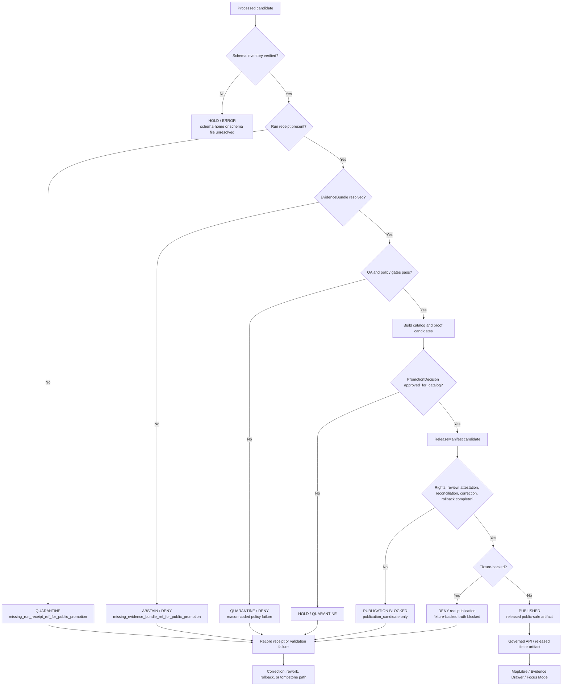

<!-- [KFM_META_BLOCK_V2]
doc_id: kfm://doc/TODO-VERIFY-UUID-atmosphere-air-promotion-and-rollback
title: Atmosphere / Air Promotion and Rollback
type: standard
version: v1
status: draft
owners: TODO-VERIFY: atmosphere-air domain steward, policy steward, release steward, data steward
created: TODO-VERIFY-YYYY-MM-DD
updated: 2026-05-06
policy_label: public-draft-NEEDS_VERIFICATION
related: [../README.md, ./DATA_LIFECYCLE.md, ./RUNBOOK.md, ../architecture/ARCHITECTURE.md, ../architecture/KNOWLEDGE_CHARACTER.md, ../governance/VALIDATION_STATUS.md, ../governance/SECURITY_AND_RIGHTS.md, ../../../adr/ADR-0001-schema-home.md, ../../../adr/ADR-0312-atmosphere-air-source-role-boundaries.md, ../../../adr/ADR-0418-atmosphere-air-schema-slug-compatibility.md, ../../../runbooks/domains/atmosphere_air/slices/AIR_QA_PROMOTION_SLICE.md, ../../../../policy/air/air_qa.rego, ../../../../tools/publishers/air/build_air_release_candidate.py, ../../../../tools/publishers/air/publish_air_release.py, ../../../../data/processed/air/qa_summary.example.json, ../../../../data/receipts/air/run_receipt.example.json]
tags: [kfm, atmosphere-air, promotion, rollback, release, evidence, policy, qa, fail-closed, governed-domain]
notes: [Revises a repo-visible thin operations stub. doc_id, owners, created date, final policy label, schema inventory, CI run status, release maturity, and branch protection remain NEEDS VERIFICATION. This document does not authorize live source activation or public publication.]
[/KFM_META_BLOCK_V2] -->

<a id="top"></a>

# Atmosphere / Air Promotion and Rollback

Promotion and rollback rules for moving Atmosphere / Air candidates toward release without weakening evidence, policy, review, correction, or public-safety boundaries.

<p align="center">
  
  
  
  
  
</p>

<p align="center">
  <a href="#status-snapshot">Status</a> ·
  <a href="#scope">Scope</a> ·
  <a href="#repo-fit">Repo fit</a> ·
  <a href="#promotion-law">Promotion law</a> ·
  <a href="#promotion-flow">Flow</a> ·
  <a href="#gate-ladder">Gates</a> ·
  <a href="#rollback-law">Rollback</a> ·
  <a href="#no-network-air-qa-slice">No-network slice</a> ·
  <a href="#safe-operator-commands">Commands</a> ·
  <a href="#review-checklist">Review</a> ·
  <a href="#open-verification-backlog">Open verification</a>
</p>

> [!IMPORTANT]
> Promotion is a governed state transition, not a file move. A schema-valid candidate, passing script, generated map layer, run receipt, or release-candidate directory is not public truth until evidence closure, policy, review, release manifest, correction path, and rollback target are all satisfied.

---

## Status snapshot

| Field | Status |
|---|---:|
| Target file | `docs/domains/atmosphere_air/operations/PROMOTION_AND_ROLLBACK.md` |
| Prior repo state | CONFIRMED thin stub with promotion checklist and rollback expectations. |
| Current revision role | Standard operations doc for promotion gates, release boundaries, rollback triggers, and public-safety failure handling. |
| Publication status | BLOCKED by default; no public Atmosphere / Air release is authorized by this document. |
| Current implementation signal | CONFIRMED repo-visible no-network Air QA candidate, run receipt, policy fragment, release-candidate builder, and publisher boundary tooling. |
| Enforcement maturity | NEEDS VERIFICATION: schema inventory, EvidenceBundle closure, CI run evidence, branch protection, source rights, real release manifests, and rollback drills are not proven here. |
| Safe merge mode | Documentation/operations update only. No live source fetch, no production publication, no UI/API binding, no release-state upgrade by prose. |

### Current posture in one sentence

Atmosphere / Air may produce **candidates**, **receipts**, **proof candidates**, and **release candidates**, but public publication remains denied until the release steward can prove source role, knowledge character, rights, evidence closure, validation, policy, review, correction, and rollback.

<p align="right"><a href="#top">Back to top ↑</a></p>

---

## Scope

This document governs the operational seam between validated Atmosphere / Air candidates and released public-safe artifacts.

It applies to:

- no-network QA candidates;
- processed candidate artifacts;
- run receipts;
- EvidenceBundle candidates;
- promotion decisions;
- catalog and triplet candidates;
- release manifests;
- publication manifests;
- tombstones, rollback cards, correction notices, and withdrawal records;
- public map, API, Evidence Drawer, Focus Mode, export, and story surfaces that depend on released Atmosphere / Air material.

It does **not** define final source connectors, final schemas, final executable policy, production API routes, MapLibre components, Focus Mode implementation, signing infrastructure, or live release workflow behavior. Those must stay in their responsibility roots and link back here when their behavior changes promotion or rollback posture.

### Accepted promotion inputs

| Input | Minimum required support | First safe handling |
|---|---|---|
| QA summary or processed candidate | schema ref, source refs, `decision`, metrics, time window, parameter/unit support, run receipt ref, EvidenceBundle ref | Candidate only; not public. |
| Run receipt | run ID, tool path, network posture, input/output refs, status, timestamp | Process memory; not proof. |
| EvidenceBundle candidate | source refs, source roles, knowledge characters, hashes, provenance, scope, review state | Proof candidate; must resolve before claims. |
| PromotionDecision | gate results, reason codes, decision state, decided timestamp, input refs | May approve catalog candidate or quarantine; does not publish by itself. |
| Catalog candidate | STAC/DCAT/PROV/triplet refs where applicable | Discovery/provenance candidate; not public truth alone. |
| ReleaseManifest | artifact refs, evidence refs, promotion decision, public readiness state, correction path, rollback target | Required before publication attempt. |
| Attestation / steward review | reviewer identity, date, scope, decision, obligations, expiry/recheck rules | Required for override or published state where gates demand it. |
| AQS reconciliation or equivalent authoritative check | reconciliation state, timestamp, source refs, conflict state | Required before real published status when applicable. |
| Rollback target | prior release ref, candidate tombstone ref, correction path, reason codes, verification steps | Required before release. |

### Exclusions

Do not promote, publish, or expose:

- RAW, WORK, QUARANTINE, connector-private output, normalization scratch state, or unpublished processed candidates;
- run receipts as EvidenceBundles, proof packs, release manifests, or publication decisions;
- fixture-backed or no-network candidate artifacts as real-world public truth;
- AQI/NowCast reports as raw concentration;
- AOD, smoke masks, fire hotspots, or remote-sensing classifications as surface exposure measurement without governed model/fusion support;
- model fields as observed sensor values;
- live source artifacts with UNKNOWN rights, terms, cadence, attribution, redistribution, or public-release posture;
- public UI/API/Focus surfaces that bypass governed release, EvidenceBundle resolution, policy state, correction path, or rollback awareness.

<p align="right"><a href="#top">Back to top ↑</a></p>

---

## Repo fit

This file belongs under `docs/` because it is human-facing operations doctrine for a domain lane. It guides release and rollback behavior but does not replace schemas, policy-as-code, validators, release manifests, receipts, proof packs, or workflow run evidence.

| Relationship | Relative link | Status | Role |
|---|---|---:|---|
| Domain landing page | [`../README.md`](../README.md) | CONFIRMED repo-visible | Lane scope, inputs, exclusions, lifecycle, source-role, knowledge-character, and public-boundary posture. |
| Data lifecycle | [`./DATA_LIFECYCLE.md`](./DATA_LIFECYCLE.md) | CONFIRMED thin operations doc | Lifecycle states and promotion requirements. |
| Operations runbook | [`./RUNBOOK.md`](./RUNBOOK.md) | CONFIRMED thin operations doc | Offline execution and failure triage checklist. |
| Architecture | [`../architecture/ARCHITECTURE.md`](../architecture/ARCHITECTURE.md) | CONFIRMED repo-visible | End-to-end trust path and public-surface contract. |
| Knowledge character | [`../architecture/KNOWLEDGE_CHARACTER.md`](../architecture/KNOWLEDGE_CHARACTER.md) | CONFIRMED repo-visible | Anti-collapse taxonomy and validation hooks. |
| Validation status | [`../governance/VALIDATION_STATUS.md`](../governance/VALIDATION_STATUS.md) | CONFIRMED repo-visible | Current validation inventory and publication-blocking gaps. |
| Security and rights | [`../governance/SECURITY_AND_RIGHTS.md`](../governance/SECURITY_AND_RIGHTS.md) | CONFIRMED repo-visible | Rights, access, public-release, and fail-closed posture. |
| Schema-home ADR | [`../../../adr/ADR-0001-schema-home.md`](../../../adr/ADR-0001-schema-home.md) | CONFIRMED / proposed decision | Machine-schema home and contract/schema/policy split. |
| Source-role ADR | [`../../../adr/ADR-0312-atmosphere-air-source-role-boundaries.md`](../../../adr/ADR-0312-atmosphere-air-source-role-boundaries.md) | CONFIRMED / draft | Source-role and knowledge-character boundary decision. |
| Slug compatibility ADR | [`../../../adr/ADR-0418-atmosphere-air-schema-slug-compatibility.md`](../../../adr/ADR-0418-atmosphere-air-schema-slug-compatibility.md) | CONFIRMED / proposed decision | Compatibility between `atmosphere_air`, `air`, and `atmosphere`. |
| No-network QA slice | [`../../../runbooks/domains/atmosphere_air/slices/AIR_QA_PROMOTION_SLICE.md`](../../../runbooks/domains/atmosphere_air/slices/AIR_QA_PROMOTION_SLICE.md) | CONFIRMED repo-visible | Fixture-backed promotion-slice gate posture. |
| QA policy fragment | [`../../../../policy/air/air_qa.rego`](../../../../policy/air/air_qa.rego) | CONFIRMED repo-visible | Gate A-C, AQS hard-denial, and reference checks. |
| Release-candidate builder | [`../../../../tools/publishers/air/build_air_release_candidate.py`](../../../../tools/publishers/air/build_air_release_candidate.py) | CONFIRMED repo-visible | Candidate catalog/proof/release-object builder. |
| Publication boundary tool | [`../../../../tools/publishers/air/publish_air_release.py`](../../../../tools/publishers/air/publish_air_release.py) | CONFIRMED repo-visible | Publication denial, fixture block, forbidden path, attestation, and reconciliation checks. |
| QA candidate | [`../../../../data/processed/air/qa_summary.example.json`](../../../../data/processed/air/qa_summary.example.json) | CONFIRMED / candidate only | Example processed candidate; not public truth. |
| Run receipt | [`../../../../data/receipts/air/run_receipt.example.json`](../../../../data/receipts/air/run_receipt.example.json) | CONFIRMED / process memory only | Example receipt; not proof or release. |

> [!WARNING]
> `atmosphere_air` is the docs lane, `air` is the current no-network implementation/tooling slice, and `atmosphere` is a whole-domain schema/normalization concept pending ADR-backed inventory. Promotion and rollback records must not silently rename or collapse those surfaces.

<p align="right"><a href="#top">Back to top ↑</a></p>

---

## Promotion law

Promotion moves an artifact through reviewable states. It does not mean copying a file into a public directory.

```text
RAW -> WORK / QUARANTINE -> PROCESSED -> CATALOG / TRIPLET -> PROOF -> RELEASE CANDIDATE -> PUBLISHED
```

### Promotion invariants

| Invariant | Required behavior |
|---|---|
| Candidate is not publication. | `data/processed/air/*` and no-network outputs stay candidate/internal until release gates pass. |
| Receipt is not proof. | A `RunReceipt` preserves process memory but cannot support public claims by itself. |
| Schema validity is not permission. | A schema-valid artifact may still be denied by source role, knowledge character, rights, freshness, evidence, policy, review, or rollback gaps. |
| EvidenceBundle closure is mandatory. | Consequential public claims must resolve EvidenceRefs to EvidenceBundle before release. |
| Catalog closure precedes release. | STAC/DCAT/PROV/triplet or repo-equivalent catalog/provenance refs must be complete where applicable. |
| Policy fails closed. | Unknown rights, unknown source role, missing knowledge character, stale live-state support, or internal-stage public access blocks publication. |
| Review is explicit. | Steward, policy, source, domain, or release review must be recorded when gates require it. |
| Release has rollback. | A release candidate without rollback target or correction path remains blocked. |
| Public clients are downstream. | API, MapLibre, Evidence Drawer, Focus Mode, exports, and stories consume released artifacts or governed review envelopes only. |
| Derived products stay derived. | Tiles, summaries, graph deltas, fusion products, model fields, and map layers do not become canonical proof. |

### Promotion outcomes

| Outcome | Use when |
|---|---|
| `approved_for_catalog` | Candidate passes pre-publication gates enough to assemble catalog/proof/release candidates. |
| `quarantine` | Gate failure, missing evidence, missing receipt, policy denial, or unsafe status requires hold/rework. |
| `publication_candidate` | Release shape exists for review, but public publication is not authorized. |
| `published` | All public-release gates pass and publication is approved with release manifest, correction path, rollback target, and validation evidence. |
| `published_fixture_blocked` | Publication was requested against fixture/no-network evidence and must not become real-world public truth. |
| `withdrawn` / `superseded` / `rolled_back` | Post-release state changed by correction, tombstone, or rollback decision. |

<p align="right"><a href="#top">Back to top ↑</a></p>

---

## Promotion flow



### Stage responsibilities

| Stage | Required artifacts | Public exposure |
|---|---|---|
| Processed candidate | candidate JSON, schema ref, source refs, time window, metrics, `decision` | No |
| Validation | schema validation report, policy decision or denial codes | No |
| Proof candidate | EvidenceBundle, catalog/provenance refs, promotion decision | No |
| Release candidate | ReleaseManifest, artifact refs, public readiness state, rollback target | Review-only |
| Publication candidate | PublicationManifest with public-boundary checks | Review-only unless all gates pass |
| Published | Released artifacts, release manifest, correction path, rollback target, verification evidence | Yes, through governed APIs/artifacts only |
| Rollback/correction | tombstone, rollback card, correction notice, invalidation receipt, verification report | Public-safe summary only |

<p align="right"><a href="#top">Back to top ↑</a></p>

---

## Gate ladder

### Gate 0 — Repo and path sanity

| Check | Required evidence | Failure outcome |
|---|---|---|
| Branch state known | `git status --short`, active branch recorded in PR notes | `HOLD` |
| Path convention stable | `atmosphere_air`, `air`, and `atmosphere` compatibility acknowledged | `ERROR` / `HOLD` |
| Schema-home state known | ADR-0001 and ADR-0418 checked against active schema inventory | `ERROR` |
| No public internal path | Candidate/release refs avoid RAW, WORK, QUARANTINE, connector-private, and unpromoted processed paths | `DENY` |

### Gate 1 — Shape and traceability

| Check | Required evidence | Failure outcome |
|---|---|---|
| Schema present and parses | active schema file or approved alias exists | `ERROR` |
| Candidate parses | JSON/YAML parse and validates where schema exists | `ERROR` |
| Run receipt present | valid receipt ref, run ID, output refs, network posture | `DENY` |
| Source payload / transform traceability | source payload hash and transform/spec hash where applicable | `DENY` |
| Evidence refs present | candidate has EvidenceRefs or EvidenceBundle ref for consequential claims | `ABSTAIN` / `DENY` |

### Gate 2 — Source-role and knowledge-character separation

| Check | Required evidence | Failure outcome |
|---|---|---|
| Source role present | source descriptor or artifact-level `source_role` | `DENY` |
| Knowledge character present | accepted value from Atmosphere / Air taxonomy | `DENY` |
| No AQI-as-concentration | AQI/NowCast/report object not treated as raw concentration | `DENY` |
| No AOD-as-PM2.5 | AOD/optical product not treated as PM2.5 without governed model support | `DENY` |
| No model-as-observation | model field not labeled as observed sensor value | `DENY` |
| No mask-as-exposure | smoke/plume/fire mask not treated as exposure measurement | `DENY` |
| No hidden fusion | fusion product exposes inputs, method, uncertainty, transform identity | `DENY` |

### Gate 3 — QA and policy

| Gate | Current no-network policy signal | Failure outcome |
|---|---|---|
| Gate A | deny when `nowcast_max > 35` | `gate_a_nowcast_max_exceeds_35` |
| Gate B | deny when `nowcast_vs_baseline_sigma > 2` | `gate_b_nowcast_vs_baseline_sigma_exceeds_2` |
| Gate C | deny when `station_coverage_pct < 75` | `gate_c_station_coverage_below_75` |
| AQS hard-denial | deny when hard-denial rows appear in baseline | `aqs_hard_denial_rows_present_in_baseline` |
| Missing receipt | deny candidate public promotion without run receipt ref | `missing_run_receipt_ref_for_public_promotion` |
| Missing evidence | deny candidate public promotion without EvidenceBundle ref | `missing_evidence_bundle_ref_for_public_promotion` |

### Gate 4 — Catalog, proof, and release candidate

| Check | Required evidence | Failure outcome |
|---|---|---|
| Promotion decision | `decision: approved_for_catalog` for catalog/release candidate | `promotion_decision_not_approved_for_catalog` |
| Catalog refs | STAC/DCAT/PROV/triplet refs where applicable | `HOLD` / `DENY` |
| EvidenceBundle valid | evidence bundle validates and resolves source refs | `ABSTAIN` / `ERROR` |
| ReleaseManifest valid | release manifest validates and carries artifact refs, public readiness, rollback target | `DENY` |
| Public readiness | `catalog_candidate` or stronger; not silently `published` | `release_manifest_not_catalog_candidate_or_better` |

### Gate 5 — Public publication

| Check | Required evidence | Failure outcome |
|---|---|---|
| Rights verified | rights, terms, attribution, redistribution, automation, public-release flag | `ATMOS_UNKNOWN_RIGHTS_PUBLIC` |
| Review complete | steward/policy/source/domain/release review state | `HOLD` |
| Gate D attestation | signed or reviewed attestation where required | `missing_gate_d_attestation_for_published` |
| AQS reconciliation | reconciled and current where required | `missing_aqs_reconciliation_for_published`, `aqs_reconciliation_not_ready`, or `aqs_reconciliation_older_than_72_hours` |
| Fixture denial | no fixture/no-network source published as real public truth | `fixture_backed_artifacts_cannot_be_published_truth` |
| Correction path | correction/withdrawal/supersession path exists | `HOLD` |
| Rollback target | rollback target exists and is verifiable | `HOLD` / `DENY` |

<p align="right"><a href="#top">Back to top ↑</a></p>

---

## Rollback law

Rollback repairs public trust. It is not a silent overwrite, deletion, or cache clear.

### Rollback invariants

| Invariant | Required behavior |
|---|---|
| Rollback is recorded. | Every rollback has reason, scope, actor/reviewer, timestamp, affected artifacts, prior release ref, and verification result. |
| Rollback preserves lineage. | Do not erase the failed or superseded artifact without a tombstone/correction trace. |
| Rollback targets a known state. | Target last-known-good release, publication candidate, quarantine hold, or explicit withdrawal. |
| Rollback invalidates derivatives. | Tiles, catalogs, triplets, search indexes, Evidence Drawer payloads, Focus caches, exports, and story references must be marked stale or rebuilt. |
| Rollback is policy-aware. | Rights, sensitivity, source-role, and public-boundary failures remain visible as reason-coded decisions. |
| Rollback has verification. | Post-rollback checks confirm public surfaces no longer expose the withdrawn or unsafe release. |
| Rollback does not publish raw data. | Rollback records may summarize failures but must not expose RAW/WORK/QUARANTINE payloads or secrets. |

### Rollback modes

| Mode | Trigger | Required output |
|---|---|---|
| Candidate abort | Schema, evidence, policy, or QA gate fails before release candidate. | Validation report, quarantine note, denial codes. |
| Catalog-candidate withdrawal | Catalog/proof/release candidate is built but later found incomplete or unsafe. | Tombstone or withdrawal record, candidate invalidation note. |
| Publication-candidate block | PublicationManifest exists but public gates fail. | Publication manifest with denial reasons, no public artifact. |
| Published rollback | Released artifact must be replaced by last-known-good or withdrawn. | Rollback card, correction notice, invalidation receipt, post-rollback verification report. |
| Supersession | Newer valid release replaces older release. | Supersession link, release manifest, evidence/proof refs, correction path. |
| Narrowed republication | Public scope must be reduced due to rights, source, sensitivity, or stale-state issue. | Corrected manifest, public note, old-scope tombstone, downstream invalidation. |

### Rollback trigger matrix

| Trigger | Rollback action | Public posture |
|---|---|---|
| Schema file missing after candidate build | Move candidate to HOLD / ERROR; do not publish. | No public exposure. |
| EvidenceBundle unresolved | ABSTAIN or DENY claim; quarantine candidate. | Evidence gap visible only as safe status. |
| Unknown source rights discovered | Withdraw or block public release; add rights review task. | Public release denied. |
| Fixture-backed artifact marked published | Reclassify to blocked candidate; emit tombstone if public ref existed. | No real-world truth claim. |
| AQS reconciliation stale or conflicted | Block published status; require reconciliation update. | Public live/current wording denied or stale-labeled. |
| Public ref points to RAW/WORK/QUARANTINE/PROCESSED candidate | Deny publication; invalidate candidate manifest. | No public path. |
| Wrong knowledge character | Withdraw or correct release; rebuild layer/drawer/focus payloads. | Public output corrected or withdrawn. |
| Advisory treated as emergency instruction | Deny Focus/UI output; replace with official-source referral wording where policy allows. | KFM not life-safety authority. |
| Post-release source correction | Supersede release with correction notice and evidence update. | Public correction visible. |
| Public derivative drift | Invalidate/rebuild tiles, catalogs, graphs, indexes, exports, caches. | Downstream stale states visible. |

<p align="right"><a href="#top">Back to top ↑</a></p>

---

## No-network Air QA slice

The current repo-visible no-network slice is a useful promotion exercise, not a live publication path.

| Surface | Confirmed role | Promotion boundary |
|---|---|---|
| `qa_summary.example.json` | PM2.5 `nowcast_hourly` candidate with `decision: candidate`. | Candidate only; cannot become public truth alone. |
| `run_receipt.example.json` | Process memory with `network_access: disabled`. | Receipt only; not evidence closure or release proof. |
| `air_qa.rego` | Gate A-C, AQS hard-denial, missing receipt, missing evidence checks. | Policy fragment; not whole-domain release policy. |
| `build_air_release_candidate.py` | Builds EvidenceBundle candidate, PromotionDecision, STAC/DCAT/PROV/triplet candidates, ReleaseManifest. | Release candidate only; public readiness remains gated. |
| `publish_air_release.py` | Denies unsafe publication, fixture-backed truth, missing attestation, stale or missing reconciliation, internal-stage refs. | Publication boundary tool; successful run still needs captured evidence and review. |
| `AIR_QA_PROMOTION_SLICE.md` | No-network governance runbook for NowCast / AQS / Mesonet-style handling. | Live connectors remain PROPOSED / NEEDS_VERIFICATION. |

> [!CAUTION]
> Do not use the no-network slice to make a real public air-quality claim. Its job is to prove promotion and rollback choreography under controlled fixture conditions.

<p align="right"><a href="#top">Back to top ↑</a></p>

---

## Reason codes

Reason codes should remain stable across validators, Rego policy, release tools, publication manifests, API envelopes, Evidence Drawer cards, Focus Mode responses, review records, and rollback cards.

| Code | Trigger | Expected outcome |
|---|---|---|
| `gate_a_nowcast_max_exceeds_35` | `nowcast_max > 35` | `DENY` / quarantine unless approved override path exists. |
| `gate_b_nowcast_vs_baseline_sigma_exceeds_2` | `nowcast_vs_baseline_sigma > 2` | `DENY` / quarantine unless reviewed. |
| `gate_c_station_coverage_below_75` | `station_coverage_pct < 75` | `DENY` unless steward review path allows hold. |
| `aqs_hard_denial_rows_present_in_baseline` | hard-denial rows included in baseline | `DENY`. |
| `missing_run_receipt_ref_for_public_promotion` | candidate lacks run receipt ref | `DENY`. |
| `missing_evidence_bundle_ref_for_public_promotion` | candidate lacks EvidenceBundle ref | `DENY`. |
| `promotion_decision_not_approved_for_catalog` | release publication requested without approved catalog decision | `DENY`. |
| `release_manifest_not_catalog_candidate_or_better` | release manifest readiness is below candidate threshold | `DENY`. |
| `forbidden_raw_work_quarantine_or_processed_reference` | release/public manifest references internal lifecycle or unpromoted candidate path | `DENY`. |
| `nowcast_mislabelled_as_validated_truth` | operational NowCast evidence treated as validated AQS truth | `DENY`. |
| `fixture_backed_artifacts_cannot_be_published_truth` | fixture/no-network evidence requested as real public truth | `DENY`. |
| `missing_gate_d_attestation_for_published` | published state requested without attestation | `DENY`. |
| `fixture_attestation_cannot_authorize_real_publication` | fixture signature used for real publication | `DENY`. |
| `missing_aqs_reconciliation_for_published` | published state requested without reconciliation where required | `DENY`. |
| `aqs_reconciliation_not_ready` | reconciliation pending or conflicted | `DENY`. |
| `aqs_reconciliation_older_than_72_hours` | reconciliation stale beyond allowed window | `DENY`. |
| `ATMOS_MISSING_SOURCE_ROLE` | source role absent | `DENY`. |
| `ATMOS_MISSING_KNOWLEDGE_CHARACTER` | knowledge character absent | `DENY`. |
| `ATMOS_UNKNOWN_RIGHTS_PUBLIC` | public release requested while rights remain unknown | `DENY`. |
| `ATMOS_PUBLIC_INTERNAL_ACCESS` | public surface attempts internal lifecycle or candidate access | `DENY`. |
| `ATMOS_RECEIPT_AS_PROOF` | run receipt used as proof or release authority | `DENY`. |
| `ATMOS_STALE_CONTEXT_UNLABELED` | stale or expired context appears current | `ABSTAIN` / `DENY`. |

<p align="right"><a href="#top">Back to top ↑</a></p>

---

## Safe operator commands

Run these from a real checkout only. Treat them as inspection and dry-run guidance, not publication proof.

```bash
# Confirm branch and working tree before release-adjacent work.
git status --short
git branch --show-current

# Inspect operations, governance, ADR, policy, and tooling surfaces.
find docs/domains/atmosphere_air -maxdepth 4 -type f | sort
find docs/adr -maxdepth 1 -type f | sort | grep -E 'ADR-0001|ADR-0312|ADR-0418' || true
find policy/air tools/validators/air tools/publishers/air data/processed/air data/receipts/air -maxdepth 3 -type f 2>/dev/null | sort

# Confirm schema inventory before relying on release tooling.
find schemas/contracts/v1 -maxdepth 4 -type f 2>/dev/null | sort | grep -E '/(air|atmosphere)/' || true

# Parse current no-network examples.
python -m json.tool data/processed/air/qa_summary.example.json >/dev/null
python -m json.tool data/receipts/air/run_receipt.example.json >/dev/null

# Validate the QA candidate only after the referenced schema inventory is confirmed.
python tools/validators/air/validate_air_qa.py \
  data/processed/air/qa_summary.example.json

# Build a release candidate only after schema files and EvidenceBundle behavior are verified.
python tools/publishers/air/build_air_release_candidate.py \
  --qa-summary data/processed/air/qa_summary.example.json \
  --run-receipt data/receipts/air/run_receipt.example.json \
  --out-dir /tmp/kfm-air-release-candidate \
  --allow-quarantine-output

# Exercise publication boundary as dry-run only.
python tools/publishers/air/publish_air_release.py \
  --release-candidate-dir /tmp/kfm-air-release-candidate \
  --out-dir /tmp/kfm-air-publication-boundary \
  --requested-status publication_candidate \
  --dry-run
```

> [!WARNING]
> Do not run real publication, live connector activation, or public UI/API binding from this document. Promotion proof must include captured validator output, policy output, review state, release manifest, correction path, and rollback target.

<p align="right"><a href="#top">Back to top ↑</a></p>

---

## Rollback record minimum

A rollback record may later become a schema-backed object. Until that schema is verified, use this as an illustrative operations checklist, not machine authority.

```yaml
# Illustrative only — final schema and path need verification.
rollback_card:
  schema_version: v1
  rollback_id: TODO-GENERATE-STABLE-ID
  domain: atmosphere.air
  status: proposed_or_executed
  created_at: TODO-ISO-8601
  created_by: TODO-VERIFY
  reviewed_by: TODO-VERIFY

  trigger:
    reason_codes:
      - TODO-REASON-CODE
    summary: TODO-EXPLAIN-WHY-ROLLBACK-IS-REQUIRED
    detected_by: validator | policy | steward_review | source_update | public_correction | runtime_monitor

  affected_release:
    publication_id: TODO-VERIFY
    release_manifest_ref: TODO-VERIFY
    promotion_decision_ref: TODO-VERIFY
    evidence_bundle_ref: TODO-VERIFY
    artifact_refs:
      - TODO-VERIFY

  rollback_target:
    mode: last_known_good | withdrawal | supersession | narrowed_republication | quarantine
    target_release_manifest_ref: TODO-VERIFY
    target_spec_hash: TODO-VERIFY
    correction_notice_ref: TODO-VERIFY

  downstream_invalidation:
    map_layers: TODO-VERIFY
    tiles_or_pmtiles: TODO-VERIFY
    catalog_records: TODO-VERIFY
    triplets_or_graph_projection: TODO-VERIFY
    evidence_drawer_payloads: TODO-VERIFY
    focus_mode_cache: TODO-VERIFY
    exports_or_stories: TODO-VERIFY

  verification:
    commands_or_checks:
      - TODO-VERIFY
    post_rollback_status: TODO-VERIFY
    public_surface_verified: false
    notes: TODO-VERIFY

  public_notice:
    required: TODO-VERIFY
    notice_ref: TODO-VERIFY
    safe_summary: TODO-PUBLIC-SAFE-SUMMARY
```

### Rollback artifact rules

| Artifact | Rule |
|---|---|
| Rollback card | Records decision, scope, and target. |
| Correction notice | Explains public meaning change where release was visible. |
| Tombstone | Preserves withdrawn or blocked public/candidate identity. |
| Invalidation receipt | Records downstream stale/cached/derived objects. |
| Post-rollback verification report | Confirms public surfaces no longer expose unsafe release. |
| Supersession link | Keeps old-to-new lineage inspectable. |

<p align="right"><a href="#top">Back to top ↑</a></p>

---

## Review checklist

A promotion-adjacent change is ready for review when:

- [ ] KFM Meta Block placeholders are resolved or intentionally left as reviewable TODOs.
- [ ] Relative links from this file resolve.
- [ ] Schema-home and slug compatibility are checked against ADR-0001 and ADR-0418.
- [ ] Candidate artifacts remain candidates until release gates pass.
- [ ] Run receipts remain process memory and are not used as EvidenceBundle or ReleaseManifest.
- [ ] Source role and knowledge character are present or denied.
- [ ] AQI, concentration, AOD, smoke mask, model field, fusion product, advisory, and site metadata boundaries remain distinct.
- [ ] Unknown source rights block public release.
- [ ] EvidenceRefs resolve to EvidenceBundle before consequential public claims.
- [ ] Policy denials are reason-coded.
- [ ] Gate D attestation and AQS reconciliation requirements are preserved where publication requires them.
- [ ] Fixture/no-network outputs cannot become real public truth.
- [ ] Release manifests include correction path and rollback target.
- [ ] Rollback plan covers downstream invalidation for map layers, tiles, catalogs, triplets, Evidence Drawer, Focus Mode, exports, and stories.
- [ ] No live source fetch, real publication, public route binding, or release-state upgrade is introduced by documentation alone.
- [ ] Validation/test/CI output is either captured or explicitly marked NOT RUN / NEEDS VERIFICATION.

---

## Definition of done for public release readiness

Atmosphere / Air public release readiness can be claimed only when all required items below have evidence.

| Item | Required evidence |
|---|---|
| Source descriptor | Source role, knowledge character, rights, terms, cadence, limitations, public-release posture, verification date. |
| Schema closure | Referenced schemas exist, parse, and validate all release-bound objects. |
| Fixture and negative-path coverage | Valid and invalid fixtures cover evidence gaps, policy denials, internal-path exposure, fixture publication, stale reconciliation, and anti-collapse rules. |
| Validator output | Current run output captured from repo-native validators. |
| Policy output | Rego or repo-native policy output captured with allow/deny/reason codes. |
| Evidence closure | EvidenceRefs resolve to EvidenceBundle. |
| Catalog closure | Catalog/provenance/triplet refs align with release candidate. |
| Review state | Domain, policy, source, steward, and release review recorded as required. |
| Release manifest | Release scope, artifact refs, hashes, public readiness, correction path, rollback target. |
| Publication manifest | Public-boundary checks pass and forbid internal lifecycle refs. |
| Rollback drill | At least one rollback or withdrawal dry-run verifies invalidation behavior. |
| CI/reproducibility | Workflow run evidence or documented manual validation receipt exists. |
| Public surface check | Governed API/MapLibre/Evidence Drawer/Focus surfaces consume only released artifacts. |
| Correction path | CorrectionNotice or equivalent public-safe repair path is in place. |

> [!CAUTION]
> Until these items are proven, the correct public posture is `BLOCKED`, `HOLD`, `ABSTAIN`, or `DENY` depending on the request.

<p align="right"><a href="#top">Back to top ↑</a></p>

---

## Update triggers

Update this file when any of the following change.

| Trigger | Required update |
|---|---|
| Promotion tooling changes | Update gate names, commands, expected outputs, rollback effects, and open verification. |
| Policy changes | Update reason codes, gate matrix, invalid fixtures, and review checklist. |
| Schema-home or slug decision changes | Update relative links, path names, compatibility notes, and rollback/migration behavior. |
| Source family activation | Add rights, source-role, knowledge-character, cadence, and public-release gate changes. |
| EvidenceBundle or release schema changes | Update required promotion inputs and definition of done. |
| Public API/UI/Focus binding is proposed | Add public-boundary checks and rollback invalidation obligations. |
| A candidate is promoted or blocked | Record decision state, reason codes, validation output, release/correction/rollback refs. |
| A release is withdrawn or superseded | Record rollback mode, correction notice, tombstone, downstream invalidation, and verification. |
| CI workflow or required checks change | Update safe commands and enforcement maturity. |
| Owners or policy label change | Update KFM Meta Block and review checklist. |

---

## Open verification backlog

| Item | Status | Owner | Why it matters |
|---|---:|---|---|
| Final `doc_id` | TODO | docs steward | Required by KFM Meta Block V2. |
| Created date | TODO | docs steward | Must come from repo history or governance record. |
| Owners | TODO / NEEDS VERIFICATION | domain + release stewards | Release and rollback require accountable review. |
| Policy label | TODO / NEEDS VERIFICATION | policy steward | Determines public/restricted posture. |
| Schema inventory for `schemas/contracts/v1/air/` | NEEDS VERIFICATION | schema steward | Current tools reference this family. |
| Schema inventory for `schemas/contracts/v1/atmosphere/` | NEEDS VERIFICATION | schema steward | Whole-domain schema concept remains proposed until proven. |
| EvidenceBundle example resolution | NEEDS VERIFICATION | evidence steward | QA candidate references EvidenceBundle; public claims must abstain/deny until it resolves. |
| Validator execution | NOT RUN HERE | validation steward | Required before claiming pass/fail status. |
| Air tests execution | NOT RUN HERE | validation steward | Required before claiming test coverage. |
| CI workflow result | UNKNOWN | repo steward | Workflow presence is not passing enforcement. |
| Branch protection / required checks | UNKNOWN | repo steward | Needed before claiming merge-blocking release gates. |
| Live source rights | UNKNOWN | source steward | Public release must remain blocked until rights and terms are verified. |
| Gate D attestation implementation | NEEDS VERIFICATION | release steward | Required for publication override/published status. |
| AQS reconciliation implementation | NEEDS VERIFICATION | data + source stewards | Required before published status where applicable. |
| ReleaseManifest and PublicationManifest schemas | NEEDS VERIFICATION | schema + release stewards | Required before release tooling can be treated as authoritative. |
| Rollback card / correction notice schema | NEEDS VERIFICATION | release steward | Required for auditable rollback. |
| Downstream invalidation mechanism | UNKNOWN | runtime + UI stewards | Rollback must invalidate maps, tiles, catalogs, exports, Evidence Drawer, and Focus caches. |
| Public API / MapLibre / Focus binding | UNKNOWN | runtime + UI stewards | This file does not prove public runtime behavior. |

<p align="right"><a href="#top">Back to top ↑</a></p>
