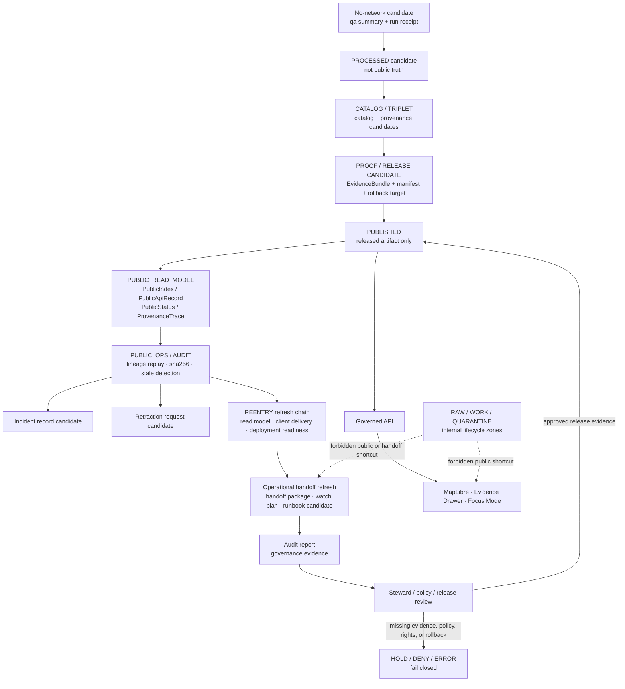

<!-- [KFM_META_BLOCK_V2]
doc_id: kfm://doc/TODO-VERIFY-docs-domains-atmosphere-air-operations-readme
title: Atmosphere / Air Operations
type: standard
version: v1
status: draft
owners: TODO-VERIFY: @bartytime4life; atmosphere-air domain steward; operations steward; policy steward; release steward; docs steward
created: TODO-VERIFY-YYYY-MM-DD
updated: 2026-05-06
policy_label: public-draft-NEEDS_VERIFICATION
related: [../README.md, ../architecture/README.md, ../governance/README.md, ../../../runbooks/domains/atmosphere_air/slices/AIR_PUBLIC_OPS_SLICE.md, ../../../runbooks/domains/atmosphere_air/slices/AIR_REENTRY_READ_MODEL_REFRESH_SLICE.md, ../../../runbooks/domains/atmosphere_air/slices/AIR_REENTRY_DEPLOYMENT_READINESS_REFRESH_SLICE.md, ../../../runbooks/domains/atmosphere_air/slices/AIR_REENTRY_MAINTENANCE_REMEDIATION_REFRESH_SLICE.md, ../../../adr/ADR-0418-atmosphere-air-schema-slug-compatibility.md, ../../../../connectors/pipelines/air/README.md, ../../../../tools/operations/air/build_air_reentry_operational_handoff_refresh.py, ../../../../tools/operations/air/evaluate_air_reentry_watch_window_refresh.py, ../../../../tools/validators/air/validate_air_reentry_operational_handoff_refresh.py, ../../../../tools/auditors/air/audit_air_reentry_operational_handoff_refresh.py, ../../../../policy/air/air_reentry_operational_handoff_refresh.rego, ../../../../tests/air/test_air_reentry_operational_handoff_refresh_slice.py]
tags: [kfm, atmosphere-air, operations, runbook, public-ops, reentry, handoff, audit, no-network, fail-closed, evidence]
notes: [Target file exists on GitHub main but was blank before this revision; this README is a documentation control surface, not proof of live operations. doc_id, owners, created date, final policy label, CODEOWNERS routing, CI enforcement, test status, live-source activation, publication state, runtime API behavior, MapLibre binding, Evidence Drawer binding, Focus Mode binding, and production operations remain NEEDS VERIFICATION.]
[/KFM_META_BLOCK_V2] -->

<a id="top"></a>

# Atmosphere / Air Operations

Operations index for fixture-backed Atmosphere / Air public-ops, re-entry, handoff, watch-window, audit, maintenance, incident, retraction, and rollback-readiness workflows.

<p align="center">
  
  
  
  
  
  
  
</p>

> [!NOTE]
> **Status:** `experimental`  
> **Document status:** `draft`  
> **Owners:** `TODO-VERIFY`  
> **Path:** `docs/domains/atmosphere_air/operations/README.md`  
> **Owning root:** `docs/` — human-facing control plane and domain documentation  
> **Current file role:** directory README and operations-routing index  
> **Repo posture:** `CONFIRMED` target path exists; prior content was effectively blank.  
> **Publication posture:** documentation only; this README does not authorize live source fetching, public release, production deployment, operational monitoring, external notifications, route activation, MapLibre layer publication, Evidence Drawer claims, or Focus Mode answers.  
> **Quick jumps:** [Scope](#scope) · [Repo fit](#repo-fit) · [Accepted inputs](#accepted-inputs) · [Exclusions](#exclusions) · [Directory tree](#directory-tree) · [Operations model](#operations-model) · [Governed flow](#governed-flow) · [Operational gates](#operational-gates) · [Quickstart](#quickstart) · [Validation handoffs](#validation-handoffs) · [Definition of done](#definition-of-done) · [Open verification](#open-verification)

> [!IMPORTANT]
> Operations evidence is not live public truth. Atmosphere / Air operations may replay lineage, verify hashes, prepare handoff packages, draft incident records, prepare retraction candidates, and produce fixture-backed audit material. Public claims still require source role, knowledge character, rights, evidence closure, policy, review, release state, correction path, and rollback target.

> [!WARNING]
> **NowCast is operational evidence only.** It must never be labeled as validated AQS truth. Validated AQS rows require `24h_validated` semantics or repo-approved equivalent support.

---

## Scope

This README governs the operations documentation surface under:

```text
docs/domains/atmosphere_air/operations/
```

It exists to help maintainers coordinate Atmosphere / Air operational slices without letting runbooks, fixture evidence, local handoff packages, audit reports, or maintenance plans become publication authority.

### This directory covers

| Operations concern | What belongs here | Required posture |
|---|---|---|
| Public-ops orientation | How public-read-model lineage, status records, SLO health reports, incidents, retractions, and audit evidence should be reviewed. | Governance evidence only; not live public truth. |
| Re-entry coordination | How re-entry read-model, client-delivery, deployment-readiness, deployment-authorization, cutover, handoff, assurance, and maintenance slices relate. | Fixture-backed and candidate-only unless release proof says otherwise. |
| Handoff readiness | Review guidance for operational handoff packages, watch-window plans, runbook-activation candidates, and event logs. | Non-production by default; no external side effects. |
| Path-safety review | Rules for forbidding direct RAW, WORK, QUARANTINE, PROCESSED, and direct published-path leakage in operational artifacts. | Fail closed with `DENY` or `ERROR`. |
| AQS / NowCast distinction | Guardrails for operational NowCast evidence versus validated AQS truth. | Never collapse. |
| Maintenance and remediation | Candidate-only remediation, deprecation, sunset, and maintenance planning guidance. | No route removal, no notices, no live rollback, no artifact deletion without governed release/correction flow. |
| Audit and evidence routing | How operation outputs should point to receipts, proof candidates, release manifests, rollback decisions, and governance records. | Link to owning roots; do not store proof here. |

### This directory does not prove

- live AirNow, AQS, Mesonet, NOAA, NASA, CDN, DNS, cloud, ticketing, calendar, alerting, monitoring, stakeholder-notice, or production deployment operations;
- that any referenced operational test currently passes;
- that production signatures, release manifests, rollback cards, or proof packs are complete;
- that MapLibre, Evidence Drawer, Focus Mode, public API, dashboards, or branch protections are operating;
- that fixture-backed operational artifacts are public-safe or release-ready;
- that operations docs may bypass source registry, policy, proof, review, release, correction, or rollback gates.

<p align="right"><a href="#top">Back to top ↑</a></p>

---

## Repo fit

This file belongs under `docs/domains/atmosphere_air/operations/` because it is a **human-facing domain operations index**. It points to runbooks, tools, validators, policy, tests, and emitted artifacts without becoming any of those surfaces.

### Local and adjacent surfaces

| Relationship | Path | Status | Role |
|---|---|---:|---|
| Current README | `docs/domains/atmosphere_air/operations/README.md` | `CONFIRMED path / revised content` | Operations subfolder landing page. |
| Domain landing page | [`../README.md`](../README.md) | `CONFIRMED` | Whole-lane scope, accepted inputs, exclusions, knowledge characters, lifecycle, and public-boundary posture. |
| Architecture directory | [`../architecture/README.md`](../architecture/README.md) | `CONFIRMED` | API, MapLibre, Drawer, Focus, knowledge-character, parameter, and unit boundaries. |
| Governance directory | [`../governance/README.md`](../governance/README.md) | `CONFIRMED` | Source admission, rights, validation status, preservation, open decisions, and expansion backlog. |
| Schema slug ADR | [`../../../adr/ADR-0418-atmosphere-air-schema-slug-compatibility.md`](../../../adr/ADR-0418-atmosphere-air-schema-slug-compatibility.md) | `CONFIRMED / proposed` | Compatibility boundary between `atmosphere_air`, `air`, and `atmosphere`. |
| Public ops slice | [`../../../runbooks/domains/atmosphere_air/slices/AIR_PUBLIC_OPS_SLICE.md`](../../../runbooks/domains/atmosphere_air/slices/AIR_PUBLIC_OPS_SLICE.md) | `CONFIRMED / governance evidence only` | Public-ops audit scope, gates, lineage replay, incident and retraction candidate workflow. |
| Read-model refresh slice | [`../../../runbooks/domains/atmosphere_air/slices/AIR_REENTRY_READ_MODEL_REFRESH_SLICE.md`](../../../runbooks/domains/atmosphere_air/slices/AIR_REENTRY_READ_MODEL_REFRESH_SLICE.md) | `CONFIRMED / fixture-only` | Candidate-only read-model refresh preview; no publication or deployment. |
| Deployment-readiness refresh slice | [`../../../runbooks/domains/atmosphere_air/slices/AIR_REENTRY_DEPLOYMENT_READINESS_REFRESH_SLICE.md`](../../../runbooks/domains/atmosphere_air/slices/AIR_REENTRY_DEPLOYMENT_READINESS_REFRESH_SLICE.md) | `CONFIRMED / fixture-only` | Candidate deployment-readiness artifacts; no public truth mutation. |
| Maintenance/remediation refresh slice | [`../../../runbooks/domains/atmosphere_air/slices/AIR_REENTRY_MAINTENANCE_REMEDIATION_REFRESH_SLICE.md`](../../../runbooks/domains/atmosphere_air/slices/AIR_REENTRY_MAINTENANCE_REMEDIATION_REFRESH_SLICE.md) | `CONFIRMED / proposed` | Candidate maintenance, remediation, deprecation, sunset, and re-entry planning evidence. |
| No-network air connector | [`../../../../connectors/pipelines/air/README.md`](../../../../connectors/pipelines/air/README.md) | `CONFIRMED` | Produces processed candidate and run receipt; not publication. |
| Handoff package builder | [`../../../../tools/operations/air/build_air_reentry_operational_handoff_refresh.py`](../../../../tools/operations/air/build_air_reentry_operational_handoff_refresh.py) | `CONFIRMED` | Builds fixture operational handoff package, watch-window plan, runbook activation candidate, and events when prerequisites exist. |
| Watch-window evaluator | [`../../../../tools/operations/air/evaluate_air_reentry_watch_window_refresh.py`](../../../../tools/operations/air/evaluate_air_reentry_watch_window_refresh.py) | `CONFIRMED` | Current repo-visible content mirrors the handoff builder behavior; implementation intent needs review. |
| Handoff validator | [`../../../../tools/validators/air/validate_air_reentry_operational_handoff_refresh.py`](../../../../tools/validators/air/validate_air_reentry_operational_handoff_refresh.py) | `CONFIRMED` | Denies forbidden lifecycle path references in candidate handoff JSON. |
| Handoff auditor | [`../../../../tools/auditors/air/audit_air_reentry_operational_handoff_refresh.py`](../../../../tools/auditors/air/audit_air_reentry_operational_handoff_refresh.py) | `CONFIRMED` | Emits a simple pass audit report when run with an output directory. |
| Handoff policy | [`../../../../policy/air/air_reentry_operational_handoff_refresh.rego`](../../../../policy/air/air_reentry_operational_handoff_refresh.rego) | `CONFIRMED` | Denies artifact references containing forbidden public-boundary paths. |
| Handoff test | [`../../../../tests/air/test_air_reentry_operational_handoff_refresh_slice.py`](../../../../tests/air/test_air_reentry_operational_handoff_refresh_slice.py) | `CONFIRMED / NEEDS VERIFICATION` | Asserts expected handoff files exist; test execution status and one expected doc path need verification. |

### Directory Rules basis

| Concern | Proper responsibility root | Atmosphere / Air operations posture |
|---|---|---:|
| Human operations guidance | `docs/` | This README belongs here. |
| Long-form operational procedures | `docs/runbooks/` | Slice runbooks stay there and are linked here. |
| Executable operation tools | `tools/operations/` | Handoff/watch scripts stay there. |
| Validators | `tools/validators/` | Path and artifact validators stay there. |
| Policy-as-code | `policy/` | Rego bundles stay there. |
| Tests and fixtures | `tests/`, `fixtures/` | Execution proof stays there. |
| Processed candidates | `data/processed/` | Candidates are not public truth. |
| Receipts | `data/receipts/` | Process memory, not proof. |
| Proofs, release manifests, rollback objects | `data/proofs/`, `release/`, or repo-confirmed release roots | Release-significant objects must not live in this README. |
| Public runtime | `apps/`, `web/`, `ui/`, or repo-confirmed runtime roots | Public clients consume governed envelopes and released artifacts only. |

> [!CAUTION]
> `atmosphere_air` is the current documentation lane, `air` is the current implementation/tooling slice, and `atmosphere` remains a proposed whole-domain schema concept until ADR-backed schema inventory, fixtures, validators, tests, and release checks prove otherwise.

<p align="right"><a href="#top">Back to top ↑</a></p>

---

## Accepted inputs

Use this directory for operations-routing documentation and review guidance only.

| Accepted input | Belongs here when it… | Primary handling |
|---|---|---|
| Directory contract | Defines what operations docs own and what they must not own. | `README.md` |
| Operations overview | Explains the relationship between public ops, re-entry, handoff, watch-window, assurance, and maintenance slices. | `README.md` or a future linked operations note. |
| Handoff review guidance | Clarifies expected handoff package, watch plan, runbook activation candidate, event, audit, and path-safety review. | Link to tools, validators, policy, tests, and runbook slices. |
| Public ops audit guidance | Clarifies lineage replay, hash/path safety, stale index detection, incident candidate, and retraction candidate expectations. | Link to public ops runbook and proof/release roots. |
| Re-entry slice map | Explains the sequence of re-entry preview, deployment readiness, authorization, cutover, operational handoff, assurance, and maintenance/remediation refresh surfaces. | Keep as a map; do not duplicate every slice. |
| Validation handoff notes | Records which validator, policy, and test surfaces should be checked before stronger claims are made. | Link to `tools/`, `policy/`, and `tests/`. |
| Drift notes | Records local doc/test/path drift that must be resolved before claiming a passing slice. | Use [Open verification](#open-verification) and governance backlog. |
| Maintenance checklist | Defines operation-document review standards and minimum safe update behavior. | Use [Definition of done](#definition-of-done). |

<p align="right"><a href="#top">Back to top ↑</a></p>

---

## Exclusions

| Does **not** belong here | Correct home | Why |
|---|---|---|
| Live source fetch logic | `connectors/` or repo-approved source connectors | Operations docs must not activate live source access. |
| Production monitoring, alerting, ticketing, or notification integrations | `apps/`, `infra/`, `runtime/`, `tools/`, or external managed systems after review | Live ops require verified credentials, rights, deployment, and safety controls. |
| CDN purge, DNS change, cloud deployment, GitHub Actions dispatch, or calendar automation | `infra/`, `.github/workflows/`, or repo-approved operations tooling | This README cannot authorize external side effects. |
| Route handlers, API services, UI components, dashboards | `apps/`, `web/`, `ui/`, or repo-confirmed runtime roots | Runtime behavior must be proven in code, tests, and logs. |
| Secrets, tokens, credentials, API keys, private endpoint details | Secret manager or environment configuration | Public docs must not carry sensitive operational data. |
| RAW, WORK, QUARANTINE, PROCESSED, or direct published path references in public-facing handoff artifacts | Lifecycle and release roots only through governed manifests | Public clients must not depend on internal lifecycle paths. |
| Machine schemas | `schemas/` or ADR-approved schema home | Prose must not become schema authority. |
| Policy rule bodies | `policy/` | Executable policy must remain testable. |
| Validators and audit code | `tools/validators/`, `tools/auditors/`, `tools/operations/` | Enforcement belongs in tools, not prose. |
| Proof packs, release manifests, rollback cards, correction notices | `data/proofs/`, `release/`, or repo-confirmed release roots | Publication and rollback are governed state transitions. |
| Emergency or life-safety instructions | Official alerting and emergency sources | KFM may carry source-backed advisory context; it is not an emergency alerting system. |
| NowCast as validated AQS truth | Nowhere | Operational evidence and validated regulatory truth are different support classes. |

<p align="right"><a href="#top">Back to top ↑</a></p>

---

## Directory tree

### Current operations directory

```text
docs/domains/atmosphere_air/operations/
└── README.md
```

### Repo-visible adjacent operations surfaces inspected for this README

```text
docs/
├── domains/
│   └── atmosphere_air/
│       ├── README.md
│       ├── architecture/
│       │   └── README.md
│       ├── governance/
│       │   └── README.md
│       └── operations/
│           └── README.md
├── adr/
│   └── ADR-0418-atmosphere-air-schema-slug-compatibility.md
└── runbooks/
    └── domains/
        └── atmosphere_air/
            └── slices/
                ├── AIR_PUBLIC_OPS_SLICE.md
                ├── AIR_REENTRY_READ_MODEL_REFRESH_SLICE.md
                ├── AIR_REENTRY_DEPLOYMENT_READINESS_REFRESH_SLICE.md
                └── AIR_REENTRY_MAINTENANCE_REMEDIATION_REFRESH_SLICE.md

connectors/
└── pipelines/
    └── air/
        ├── README.md
        └── air_ingest.py

tools/
├── operations/
│   └── air/
│       ├── build_air_reentry_operational_handoff_refresh.py
│       └── evaluate_air_reentry_watch_window_refresh.py
├── validators/
│   └── air/
│       └── validate_air_reentry_operational_handoff_refresh.py
└── auditors/
    └── air/
        └── audit_air_reentry_operational_handoff_refresh.py

policy/
└── air/
    └── air_reentry_operational_handoff_refresh.rego

tests/
└── air/
    ├── test_air_reentry_operational_handoff_refresh_slice.py
    └── test_air_reentry_deployment_authorization_refresh_slice.py
```

> [!NOTE]
> The tree above is an inspected adjacency map, not a claim that the operational slice is fully passing, published, deployed, or production-ready.

<p align="right"><a href="#top">Back to top ↑</a></p>

---

## Operations model

Atmosphere / Air operations currently divide into four reviewable levels.

| Level | Current posture | What it may do | What it must not do |
|---|---:|---|---|
| No-network connector candidate | `CONFIRMED` | Produce `qa_summary.example.json` and `run_receipt.example.json` from deterministic or fixture input. | Claim publication, live source activation, or public truth. |
| Public ops / audit | `CONFIRMED docs / governance evidence only` | Replay lineage, verify sha256/path safety, emit health/SLO reports, open incident candidates, prepare retraction candidates. | Become live public monitoring, alerting, or emergency authority. |
| Re-entry refresh slices | `CONFIRMED docs / fixture or candidate only` | Prepare preview read models, deployment readiness, maintenance, remediation, and handoff evidence. | Publish, deploy, notify, delete, remove routes, run live rollback, or mutate public truth. |
| Operational handoff refresh | `CONFIRMED tools / NEEDS VERIFICATION for full slice status` | Build fixture handoff package, watch-window plan, runbook activation candidate, event log, validation, and audit report. | Reference forbidden lifecycle paths, call production endpoints, or claim handoff completion without review. |

### Operational states

| State | Meaning | Public claim posture |
|---|---|---|
| `candidate` | Candidate artifact exists for review or dryrun. | Not public truth. |
| `fixture_*` | Fixture-backed local evidence or preview. | Not public truth. |
| `governance evidence only` | Useful for review, audit, or handoff reasoning. | Not public truth. |
| `PROPOSED / NEEDS_VERIFICATION` | Design pressure exists but proof is incomplete. | No public claim. |
| `PUBLISHED` | Released artifact after promotion, proof, policy, review, correction path, and rollback target. | Public only through governed interfaces. |
| `RETRACTED` / `TOMBSTONED` | Removed or withdrawn release state remains visible. | Must not be active without successor state. |

<p align="right"><a href="#top">Back to top ↑</a></p>

---

## Governed flow



### Flow rules

| Rule | Required behavior |
|---|---|
| Public clients read governed surfaces only. | MapLibre, Evidence Drawer, Focus Mode, public API, export, and search must not read RAW, WORK, QUARANTINE, connector-private output, or unpromoted candidates directly. |
| Public ops evidence is not public truth. | Health reports, incident candidates, retraction candidates, handoff packages, runbook activation candidates, and audit reports are governance artifacts until promoted or reviewed. |
| Receipts are process memory. | Run receipts may support audit and replay, but they are not proof packs, EvidenceBundles, ReleaseManifests, or PromotionDecisions. |
| Review is mandatory before stronger state. | Candidate operational outputs must pass source-role, knowledge-character, rights, evidence, policy, release, correction, and rollback checks. |
| Negative outcomes are valid. | `HOLD`, `DENY`, `ABSTAIN`, and `ERROR` are correct outcomes when support is incomplete. |
| Operational refresh remains local unless proven otherwise. | Fixture signatures, fixture recipients, fixture watch windows, and fixture runbooks are explicitly non-production. |
| NowCast stays operational. | NowCast may trigger operational review gates, but it is not validated AQS truth. |

<p align="right"><a href="#top">Back to top ↑</a></p>

---

## Operational gates

### Public ops fixture gates

| Gate | Trigger | Meaning | Required handling |
|---|---|---|---|
| Gate A | NowCast > 35 µg/m³ | Operational review threshold. | Treat as operational evidence, not validated AQS truth. |
| Gate B | NowCast > baseline + 2σ | Baseline deviation threshold. | Preserve baseline source and temporal support. |
| Gate C | Station coverage < 75% | Coverage / confidence threshold. | Flag stale, partial, or insufficient support. |
| Gate D | Signed attestation / override | Steward or authorized override signal. | Verify chain and never treat fixture signature as production signature. |

### Operational checks

| Check | Why it matters | Failure outcome |
|---|---|---|
| Lineage replay | Proves the read model can trace back through release lineage. | `HOLD` or `DENY` |
| sha256 verification | Detects drift or artifact mismatch. | `DENY` or `ERROR` |
| Path-safety verification | Blocks public-boundary leakage from internal lifecycle zones. | `DENY` |
| Stale index detection | Prevents unsupported current-state claims. | `ABSTAIN` or `HOLD` |
| Fixture-only status handling | Prevents fixtures from becoming public truth. | `DENY` |
| Retracted/tombstoned active detection | Blocks active use of withdrawn public material. | `DENY` |
| Incident candidate workflow | Preserves review and remediation lineage. | `HOLD` until reviewed |
| Retraction candidate workflow | Makes withdrawal visible and reversible. | `HOLD` until reviewed |
| Watch-window review | Confirms local-only monitoring assumptions. | `HOLD` if live operations are implied |
| Runbook activation review | Prevents fixture runbooks from becoming executable production procedures. | `DENY` if production action is implied |

### Handoff path-safety denials

The operational handoff validator and policy should fail closed when artifacts contain direct references to forbidden lifecycle or publication paths.

| Forbidden pattern | Why it is blocked in handoff artifacts |
|---|---|
| `data/raw/` | Public and handoff artifacts must not reference source-native internal captures directly. |
| `data/work/` | Work-stage material is transform/QC context, not public support. |
| `data/quarantine/` | Quarantined material is blocked by definition. |
| `data/processed/air/` | Processed candidates are not release proof or public truth. |
| `data/published/air/` | Operational handoff should use governed release/manifests, not direct published-path shortcuts. |

<p align="right"><a href="#top">Back to top ↑</a></p>

---

## Quickstart

Use these commands as inspection and local dryrun aids only. Do not use this README to publish, deploy, notify, or activate live operations.

### 1. Confirm the active checkout

```bash
git status --short
git branch --show-current || true
git rev-parse --show-toplevel || true
```

### 2. Inspect this operations surface and adjacent runbooks

```bash
find docs/domains/atmosphere_air/operations -maxdepth 2 -type f | sort
find docs/runbooks/domains/atmosphere_air/slices -maxdepth 1 -type f | sort
sed -n '1,220p' docs/runbooks/domains/atmosphere_air/slices/AIR_PUBLIC_OPS_SLICE.md
```

### 3. Inspect operation tooling, policy, and tests

```bash
find tools/operations/air tools/validators/air tools/auditors/air policy/air tests/air \
  -maxdepth 2 -type f 2>/dev/null | sort

sed -n '1,220p' tools/operations/air/build_air_reentry_operational_handoff_refresh.py
sed -n '1,220p' tools/validators/air/validate_air_reentry_operational_handoff_refresh.py
sed -n '1,220p' policy/air/air_reentry_operational_handoff_refresh.rego
```

### 4. Build a fixture handoff package only when required candidate inputs already exist

```bash
python tools/operations/air/build_air_reentry_operational_handoff_refresh.py \
  --cutover-refresh-dir build/air/reentry/cutover_refresh \
  --deployment-authorization-refresh-dir build/air/reentry/deployment_authorization_refresh \
  --deployment-readiness-refresh-dir build/air/reentry/deployment_readiness_refresh \
  --client-delivery-refresh-dir build/air/reentry/client_delivery_refresh \
  --out-dir build/air/reentry/operational_handoff_refresh \
  --allow-fixture-handoff \
  --dry-run
```

> [!TIP]
> Remove `--dry-run` only in a local fixture branch after verifying that the output directory is not a public release home and that no external side effects are possible.

### 5. Validate and audit generated fixture output

```bash
python tools/validators/air/validate_air_reentry_operational_handoff_refresh.py \
  build/air/reentry/operational_handoff_refresh

python tools/auditors/air/audit_air_reentry_operational_handoff_refresh.py \
  build/air/reentry/operational_handoff_refresh \
  --out-dir build/air/reentry/operational_handoff_refresh_audit
```

### 6. Check for lifecycle leakage in candidate operation artifacts

```bash
grep -RInE 'data/(raw|work|quarantine|processed/air|published/air)/' \
  build/air/reentry/operational_handoff_refresh \
  build/air/reentry/operational_handoff_refresh_audit 2>/dev/null || true
```

<p align="right"><a href="#top">Back to top ↑</a></p>

---

## Validation handoffs

| Governance claim | Repo-visible handoff | Expected evidence before stronger claim |
|---|---|---|
| Public ops consumes governed read-model lineage, not raw data. | `AIR_PUBLIC_OPS_SLICE.md` | Read-model/provenance fixtures, lineage replay report, no internal-path public exposure. |
| Re-entry read-model refresh is candidate-only. | `AIR_REENTRY_READ_MODEL_REFRESH_SLICE.md` | No writes to `data/published/air/` or `data/published/air/read_model/`; fixture-only status. |
| Deployment readiness refresh does not deploy. | `AIR_REENTRY_DEPLOYMENT_READINESS_REFRESH_SLICE.md` | No CDN/DNS/cloud/ticketing/alerting/calendar operations; no live source calls. |
| Maintenance/remediation refresh is planning evidence only. | `AIR_REENTRY_MAINTENANCE_REMEDIATION_REFRESH_SLICE.md` | No route removal, artifact deletion, stakeholder notices, rollback execution, or external services. |
| Handoff package builder is fixture/local. | `tools/operations/air/build_air_reentry_operational_handoff_refresh.py` | Required cutover and authorization input refs exist; outputs remain local candidate artifacts. |
| Handoff validator blocks internal path leakage. | `tools/validators/air/validate_air_reentry_operational_handoff_refresh.py` | `PASS` only when JSON candidate artifacts avoid forbidden path patterns. |
| Handoff policy denies forbidden paths. | `policy/air/air_reentry_operational_handoff_refresh.rego` | Policy execution result captured by repo-native test or CI evidence. |
| Handoff auditor emits audit report. | `tools/auditors/air/audit_air_reentry_operational_handoff_refresh.py` | Audit output captured and linked to review record. |
| Handoff test surface is wired. | `tests/air/test_air_reentry_operational_handoff_refresh_slice.py` | Test run captured; expected docs path drift resolved. |
| NowCast is not validated AQS truth. | Public ops and re-entry runbook text | Invalid fixture and policy denial for NowCast-as-validated-AQS. |

<p align="right"><a href="#top">Back to top ↑</a></p>

---

## Operating tables

### Operational artifact families

| Artifact family | Typical producer | Truth role | Public posture |
|---|---|---|---|
| `qa_summary.example.json` | `connectors/pipelines/air/air_ingest.py` | Processed candidate. | Not public truth. |
| `run_receipt.example.json` | `connectors/pipelines/air/air_ingest.py` | Process memory. | Not proof or release. |
| Public index / API record / status / provenance trace | Public read-model slice | Released read-model representation. | Public only after governed release. |
| Health / SLO report | Public ops audit | Governance evidence. | Not live monitoring proof unless verified. |
| Incident record candidate | Public ops audit | Review candidate. | Not incident closure. |
| Retraction request candidate | Public ops audit | Review candidate. | Not withdrawal until approved. |
| Operational handoff package | Handoff builder | Fixture handoff candidate. | Non-production. |
| Watch-window plan | Handoff builder / evaluator | Fixture watch plan. | Non-production. |
| Runbook activation candidate | Handoff builder | Non-executable fixture runbook candidate. | Non-production. |
| Events JSONL | Handoff builder | Process trace. | Not release proof. |
| Audit report | Handoff auditor | Review evidence. | Not proof pack. |
| Maintenance/remediation refresh record | Maintenance/remediation slice | Planning evidence. | Non-production unless promoted through release/correction flow. |

### Outcome vocabulary

| Surface | Preferred outcomes | Meaning |
|---|---|---|
| Public/runtime response | `ANSWER`, `ABSTAIN`, `DENY`, `ERROR` | What a user-facing surface receives. |
| Gate/review evaluation | `PASS`, `HOLD`, `DENY`, `ERROR` | What a checker or steward gate decides. |
| Operational candidate | `candidate`, `fixture_*`, `blocked`, `retracted`, `tombstoned` | What the operations artifact is allowed to represent. |
| Release-state receipt | `PROMOTED`, `BLOCKED`, `REVERTED` | What happened to a release candidate. |

<p align="right"><a href="#top">Back to top ↑</a></p>

---

## Definition of done

A revision to this operations README is review-ready when:

- [ ] KFM Meta Block V2 is present and unresolved values are explicitly marked.
- [ ] Owners, created date, final policy label, and CODEOWNERS routing are verified or remain visible TODOs.
- [ ] README-like minimums are present: title, one-line purpose, repo fit, accepted inputs, and exclusions.
- [ ] Directory Rules placement remains under `docs/domains/atmosphere_air/operations/`.
- [ ] The README stays an operations index and does not become executable policy, schema authority, release approval, or proof storage.
- [ ] All relative links resolve from `docs/domains/atmosphere_air/operations/README.md`.
- [ ] Any referenced operational slice is labeled with its actual support level: governance evidence, fixture-only, candidate-only, proposed, or needs verification.
- [ ] RAW, WORK, QUARANTINE, PROCESSED, and direct published-path shortcuts remain blocked for public or handoff artifacts.
- [ ] NowCast is never described as validated AQS truth.
- [ ] Public ops outputs are described as governance evidence unless a ReleaseManifest, proof pack, review record, and rollback target prove stronger status.
- [ ] Operational handoff tooling, validator, auditor, policy, and tests are linked without claiming execution success unless run evidence exists.
- [ ] Open path drift and expected-file drift are listed in [Open verification](#open-verification).
- [ ] Live source activation, live monitoring, alerting, CDN/DNS/cloud operations, ticketing, stakeholder messaging, and production deployment remain explicitly blocked unless verified.
- [ ] Any future rename, move, or slug migration includes ADR, compatibility fixture, validation, migration note, and rollback target.

<p align="right"><a href="#top">Back to top ↑</a></p>

---

## FAQ

<details>
<summary><strong>Does this README approve live Atmosphere / Air operations?</strong></summary>

No. It is a documentation and routing surface. Live operations require verified source rights, deployment posture, credentials handling, runtime code, policy enforcement, monitoring, run evidence, review state, release state, correction path, and rollback target.
</details>

<details>
<summary><strong>Can fixture-backed public ops evidence become public truth?</strong></summary>

No. Fixture-backed outputs can support tests, dryruns, review, and validation. They do not become real-world public truth unless promoted through the governed publication path with evidence, policy, review, release manifest, and rollback support.
</details>

<details>
<summary><strong>Why are direct `data/published/air/` references blocked in some handoff artifacts?</strong></summary>

Operational handoff packages should not depend on direct filesystem shortcuts. They should reference governed release lineage, manifests, evidence, and review records. Direct path references can bypass the trust membrane.
</details>

<details>
<summary><strong>What is the difference between a run receipt, audit report, and proof pack?</strong></summary>

A run receipt records that a process occurred. An audit report records review evidence. A proof pack or EvidenceBundle supports release-significant claims. They may link to each other, but they are not interchangeable.
</details>

<details>
<summary><strong>Can Focus Mode answer from operations artifacts?</strong></summary>

Only through governed API envelopes over admissible, EvidenceBundle-backed, policy-safe context. Focus Mode must return `ANSWER`, `ABSTAIN`, `DENY`, or `ERROR`; it must not read operation artifacts directly as truth.
</details>

<p align="right"><a href="#top">Back to top ↑</a></p>

---

## Open verification

| Item | Status | Why it matters |
|---|---:|---|
| Stable `doc_id` | `TODO / NEEDS VERIFICATION` | Required for document registry and durable cross-reference. |
| Owners / CODEOWNERS routing | `TODO / NEEDS VERIFICATION` | Operations changes need explicit domain, policy, release, and docs review. |
| Created date | `TODO / NEEDS VERIFICATION` | Should come from Git history or document registry, not guessing. |
| Final policy label | `TODO / NEEDS VERIFICATION` | Determines whether this README and linked operational evidence are public-safe. |
| `docs/domains/atmosphere_air/operations/README.md` review routing | `NEEDS VERIFICATION` | Target path existed but was blank before this revision. |
| Test execution status | `UNKNOWN` | Repo-visible tests do not prove passing CI or local execution. |
| Expected docs path in handoff test | `NEEDS VERIFICATION` | The operational handoff test expects `docs/domains/atmosphere_air/AIR_REENTRY_OPERATIONAL_HANDOFF_REFRESH_SLICE.md`; this path was not confirmed during this revision. |
| Handoff builder / watch evaluator duplication | `NEEDS VERIFICATION` | `build_air_reentry_operational_handoff_refresh.py` and `evaluate_air_reentry_watch_window_refresh.py` appear to share identical content; intent should be reviewed. |
| Rego enforcement in CI | `UNKNOWN` | Policy file presence does not prove workflow enforcement. |
| Handoff validator depth | `NEEDS VERIFICATION` | Current validator checks forbidden strings in JSON artifacts; deeper schema/evidence/policy checks may be needed. |
| Audit report sufficiency | `NEEDS VERIFICATION` | Current audit helper emits a simple pass report; release-grade audit burden remains unproven. |
| Public ops artifact inventory | `NEEDS VERIFICATION` | Read-model, public status, incident, and retraction candidate artifacts must be inventoried before stronger claims. |
| Live AirNow / AQS / Mesonet / NOAA / NASA operations | `BLOCKED / NEEDS VERIFICATION` | Live source and external operations require source descriptors, rights, cadence, credentials, policy, and review. |
| Production deployment / CDN / DNS / cloud / ticketing / alerting / calendar | `BLOCKED / NEEDS VERIFICATION` | External side effects must not be implied by fixture runbooks. |
| Release manifests, proof packs, correction notices, rollback cards | `NEEDS VERIFICATION` | Operations cannot become public-ready without release and rollback evidence. |
| Public API, MapLibre, Evidence Drawer, Focus Mode bindings | `UNKNOWN` | Operations docs define handoff pressure, not runtime proof. |

<p align="right"><a href="#top">Back to top ↑</a></p>

---

## Appendix: operations review card

<details>
<summary><strong>Reviewer checklist card</strong></summary>

```yaml
target_file: docs/domains/atmosphere_air/operations/README.md
owning_root: docs/
domain_lane: atmosphere_air
surface_class: operations_readme
status: draft

must_preserve:
  - operations evidence is not public truth
  - fixture-backed outputs remain candidate or governance evidence
  - source_role is required for source-backed operational claims
  - knowledge_character is required before interpretation
  - EvidenceRef must resolve to EvidenceBundle before consequential claims
  - receipts are process memory, not proof packs
  - public clients use governed API and released artifacts only
  - RAW / WORK / QUARANTINE / PROCESSED / direct published-path shortcuts are blocked in public or handoff artifacts
  - NowCast is operational evidence, never validated AQS truth
  - live source calls and external operations remain blocked unless explicitly verified

linked_surfaces:
  docs:
    - ../README.md
    - ../architecture/README.md
    - ../governance/README.md
    - ../../../runbooks/domains/atmosphere_air/slices/AIR_PUBLIC_OPS_SLICE.md
    - ../../../runbooks/domains/atmosphere_air/slices/AIR_REENTRY_READ_MODEL_REFRESH_SLICE.md
    - ../../../runbooks/domains/atmosphere_air/slices/AIR_REENTRY_DEPLOYMENT_READINESS_REFRESH_SLICE.md
    - ../../../runbooks/domains/atmosphere_air/slices/AIR_REENTRY_MAINTENANCE_REMEDIATION_REFRESH_SLICE.md
  tools:
    - ../../../../tools/operations/air/build_air_reentry_operational_handoff_refresh.py
    - ../../../../tools/operations/air/evaluate_air_reentry_watch_window_refresh.py
    - ../../../../tools/validators/air/validate_air_reentry_operational_handoff_refresh.py
    - ../../../../tools/auditors/air/audit_air_reentry_operational_handoff_refresh.py
  policy:
    - ../../../../policy/air/air_reentry_operational_handoff_refresh.rego
  tests:
    - ../../../../tests/air/test_air_reentry_operational_handoff_refresh_slice.py

review_questions:
  - Are all runtime or CI claims backed by current repo evidence?
  - Are live operations clearly blocked unless verified?
  - Are operational artifacts separated from release proof?
  - Are incident and retraction candidates treated as candidates?
  - Are validation, policy, and audit handoffs linked without overclaiming enforcement?
  - Is any path drift or expected-file drift captured in open verification?
```

</details>

<p align="right"><a href="#top">Back to top ↑</a></p>
