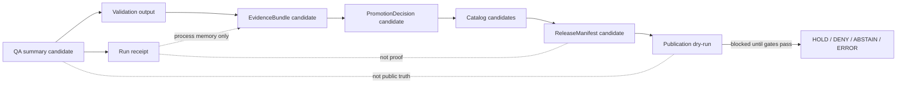

<!-- [KFM_META_BLOCK_V2]
doc_id: kfm://doc/TODO-VERIFY-UUID-atmosphere-air-operations-runbook
title: Atmosphere / Air Operations Runbook
type: standard
version: v1
status: draft
owners: TODO-VERIFY: atmosphere-air domain steward; data steward; policy steward; release steward
created: TODO-VERIFY-YYYY-MM-DD
updated: 2026-05-06
policy_label: TODO-VERIFY-public-or-restricted
related: [../README.md, ../architecture/ARCHITECTURE.md, ../architecture/KNOWLEDGE_CHARACTER.md, ../architecture/FOCUS_DRAWER_PAYLOADS.md, ../governance/SECURITY_AND_RIGHTS.md, ../governance/VALIDATION_STATUS.md, ../../../runbooks/domains/atmosphere_air/slices/AIR_QA_PROMOTION_SLICE.md, ../../../../connectors/pipelines/air/README.md, ../../../../pipelines/normalize/domains/atmosphere/README.md, ../../../../tools/validators/air/validate_air_qa.py, ../../../../policy/air/air_qa.rego, ../../../../tools/publishers/air/build_air_release_candidate.py, ../../../../tools/publishers/air/publish_air_release.py]
tags: [kfm, atmosphere-air, operations, runbook, no-network, qa, promotion, evidence, fail-closed]
notes: [Revises repo-visible docs/domains/atmosphere_air/operations/RUNBOOK.md. Local workspace was not a mounted Git checkout; public repo evidence was inspected through the GitHub connector. doc_id, owners, created date, policy label, CI status, branch protection, schema inventory, source rights, EvidenceBundle closure, and release maturity remain NEEDS VERIFICATION.]
[/KFM_META_BLOCK_V2] -->

<a id="top"></a>

# Atmosphere / Air Operations Runbook

Operational checklist for safe, no-network Atmosphere / Air QA, validation, release-candidate review, failure triage, and rollback/correction handoff.

<p align="center">
  
  
  
  
  
</p>

<p align="center">
  <a href="#status-snapshot">Status</a> ·
  <a href="#trigger">Trigger</a> ·
  <a href="#repo-fit">Repo fit</a> ·
  <a href="#operating-boundaries">Boundaries</a> ·
  <a href="#prerequisites">Prerequisites</a> ·
  <a href="#procedure">Procedure</a> ·
  <a href="#emitted-objects">Emitted objects</a> ·
  <a href="#failure-triage">Failure triage</a> ·
  <a href="#rollback-and-correction">Rollback</a> ·
  <a href="#verification-checklist">Verification</a>
</p>

> [!IMPORTANT]
> This runbook does **not** authorize live source fetching, public map publication, public API binding, Focus Mode answers, or release promotion. It is an operations guide for the current no-network Atmosphere / Air QA path and for safely inspecting candidate artifacts without weakening KFM’s trust membrane.

---

## Status snapshot

| Area | Status | Operational meaning |
|---|---:|---|
| Target file | CONFIRMED | `docs/domains/atmosphere_air/operations/RUNBOOK.md` exists in the repo and previously contained a thin minimal flow plus failure triage. |
| Current lane posture | CONFIRMED / BLOCKED FOR PUBLIC RELEASE | Atmosphere / Air has repo-visible doctrine, validation-status, security/rights, no-network connector, QA policy, validator, and release-candidate tooling; public release remains blocked. |
| No-network connector | CONFIRMED | `connectors/pipelines/air/air_ingest.py` writes a deterministic QA-summary candidate and run receipt. |
| QA validator | CONFIRMED / SCHEMA-BLOCKED UNTIL VERIFIED | `tools/validators/air/validate_air_qa.py` expects `schemas/contracts/v1/air/qa_summary.schema.json`; schema inventory must be checked before claiming a passing validator run. |
| Policy fragment | CONFIRMED / PARTIAL | `policy/air/air_qa.rego` covers Gates A-C, AQS hard-denial rows, missing run receipt ref, and missing EvidenceBundle ref. |
| Release-candidate tooling | CONFIRMED / CANDIDATE ONLY | Publisher tools can build and evaluate candidate proof/release material, but publication requires additional gates. |
| CI / branch protection | NEEDS VERIFICATION | Workflow presence or test-file presence is not the same as a passing required check. |
| Source rights | UNKNOWN | Live source activation and public release must fail closed until rights, terms, attribution, cadence, and public-release permission are verified. |

### Safe operating posture

```text
RAW -> WORK / QUARANTINE -> PROCESSED -> CATALOG / TRIPLET -> PROOF -> PUBLISHED
```

During this runbook’s no-network flow, normal work should stop at **candidate**, **receipt**, **validation report**, **catalog/proof candidate**, or **blocked publication dry-run** state. Do not skip directly to `PUBLISHED`.

<p align="right"><a href="#top">Back to top ↑</a></p>

---

## Trigger

Use this runbook when any of the following happens:

| Trigger | Runbook response |
|---|---|
| A maintainer touches Atmosphere / Air docs, source-role rules, knowledge-character rules, QA thresholds, release-candidate tooling, or no-network fixtures. | Run documentation, artifact-shape, validator, and policy checks before merge. |
| A no-network QA candidate is regenerated. | Verify candidate status, receipt status, parseability, policy gates, and EvidenceBundle references. |
| A schema, validator, or policy file changes. | Re-run valid/invalid fixtures and update validation status. |
| A release candidate is built for review. | Confirm it remains candidate-only unless release gates, rights, review, correction path, and rollback target are complete. |
| A public API, MapLibre layer, Evidence Drawer, Focus Mode, export, or story surface wants to consume Atmosphere / Air data. | Require released artifacts or governed envelopes only; deny direct candidate/internal lifecycle access. |
| A source family is proposed for live activation. | Stop and route to source descriptor, rights, terms, cadence, quota, source-role, knowledge-character, validation, and policy review. |

> [!WARNING]
> Operational feeds in this lane are contextual, not life-safety authority. KFM must not replace official emergency alerting or public-health instruction systems.

---

## Repo fit

This file is a **human-facing runbook** under the `docs/` responsibility root. It explains how to operate and verify the Atmosphere / Air lane; it does not own machine schemas, executable policy, source-native data, release decisions, or public UI truth.

| Relationship | Path | Status | Role |
|---|---|---:|---|
| This file | `docs/domains/atmosphere_air/operations/RUNBOOK.md` | CONFIRMED target | Lane-local operations runbook. |
| Domain README | [`../README.md`](../README.md) | CONFIRMED adjacent doc | Scope, inputs, exclusions, lifecycle, and first-PR discipline. |
| Architecture | [`../architecture/ARCHITECTURE.md`](../architecture/ARCHITECTURE.md) | CONFIRMED adjacent doc | Trust path, bounded contexts, no-public-bypass rule, and current no-network slice. |
| Knowledge character | [`../architecture/KNOWLEDGE_CHARACTER.md`](../architecture/KNOWLEDGE_CHARACTER.md) | CONFIRMED adjacent doc | Taxonomy and anti-collapse rules. |
| Security and rights | [`../governance/SECURITY_AND_RIGHTS.md`](../governance/SECURITY_AND_RIGHTS.md) | CONFIRMED adjacent doc | Rights, secrets, public-release, and exposure boundaries. |
| Validation status | [`../governance/VALIDATION_STATUS.md`](../governance/VALIDATION_STATUS.md) | CONFIRMED adjacent doc | Current validation inventory and open blockers. |
| No-network slice runbook | [`../../../runbooks/domains/atmosphere_air/slices/AIR_QA_PROMOTION_SLICE.md`](../../../runbooks/domains/atmosphere_air/slices/AIR_QA_PROMOTION_SLICE.md) | CONFIRMED runbook | Gates A-C, Gate D, AQS reconciliation, and fixture-backed boundary. |
| Connector lane | [`../../../../connectors/pipelines/air/README.md`](../../../../connectors/pipelines/air/README.md) | CONFIRMED connector doc | Candidate and run-receipt production. |
| Normalize lane | [`../../../../pipelines/normalize/domains/atmosphere/README.md`](../../../../pipelines/normalize/domains/atmosphere/README.md) | CONFIRMED normalize doc | Candidate normalization burden; no public truth. |
| Validator | [`../../../../tools/validators/air/validate_air_qa.py`](../../../../tools/validators/air/validate_air_qa.py) | CONFIRMED tool | QA-summary shape and local policy checks, schema-dependent. |
| Policy fragment | [`../../../../policy/air/air_qa.rego`](../../../../policy/air/air_qa.rego) | CONFIRMED policy | Gates A-C and missing reference denials. |
| Release candidate builder | [`../../../../tools/publishers/air/build_air_release_candidate.py`](../../../../tools/publishers/air/build_air_release_candidate.py) | CONFIRMED tool | Catalog/proof/release candidate builder; not publication authority. |
| Publication evaluator | [`../../../../tools/publishers/air/publish_air_release.py`](../../../../tools/publishers/air/publish_air_release.py) | CONFIRMED tool | Dry-run/publication-boundary evaluator; denies unsafe publication. |

### Responsibility split

| Root | Owns | Runbook rule |
|---|---|---|
| `docs/` | Human-facing doctrine, operations, ADRs, review and runbook guidance. | Explain and link; do not become schema or release authority. |
| `schemas/` | Machine-checkable shape. | Verify before claiming validator success. |
| `policy/` | Deny/allow/abstain/restrict logic. | Fail closed when unknown. |
| `tools/` | Validators, publishers, auditors, and operational helpers. | Run in dry-run or candidate mode unless release gates are proven. |
| `connectors/` | Source-facing candidate generation. | Never publish as a side effect. |
| `pipelines/` | Transformation and normalization. | Preserve candidate status and traceability. |
| `data/` | Lifecycle artifacts, receipts, proofs, catalog, and published outputs. | Keep receipts, proofs, and release decisions distinct. |
| `release/` | Release decisions and rollback/correction objects when repo convention confirms. | Do not bypass PromotionDecision / ReleaseManifest. |

<p align="right"><a href="#top">Back to top ↑</a></p>

---

## Operating boundaries

### Always preserve

| Boundary | Required behavior |
|---|---|
| Source role | Every consequential record must carry or resolve `source_role`. |
| Knowledge character | Every consequential record must carry or resolve `knowledge_character`. |
| Raw plus normalized value | Where values are transformed, preserve raw value/unit and normalized value/unit. |
| Evidence linkage | Claims require EvidenceRefs that resolve to EvidenceBundle before public use. |
| Receipt/proof split | Run receipts are process memory, not proof packs or release manifests. |
| Candidate/release split | Processed candidates are not public truth. |
| Public-surface split | UI/API/Focus/export surfaces consume governed envelopes or released artifacts only. |
| Correction and rollback | Publication-adjacent work must identify how rollback or correction would occur. |

### Never do

| Forbidden action | Required outcome |
|---|---|
| Run live AirNow/AQS/OpenAQ/PurpleAir/Mesonet/model/smoke source fetchers from this runbook. | `DENY` / stop; source activation review required. |
| Treat no-network fixtures as real public truth. | `DENY` with fixture-publication reason. |
| Treat AQI or NowCast as raw concentration. | `DENY` with `ATMOS_AQI_AS_CONCENTRATION` or current QA gate reason. |
| Treat AOD or smoke masks as PM2.5 exposure. | `DENY` or `ABSTAIN` unless governed model/fusion support exists. |
| Label model output as observed measurement. | `DENY` with `ATMOS_MODEL_AS_OBSERVED`. |
| Publish directly from `RAW`, `WORK`, `QUARANTINE`, connector-private output, normalize-stage output, or unpublished candidates. | `DENY` with public-internal-access reason. |
| Use run receipt as EvidenceBundle or release proof. | `DENY` with receipt-as-proof reason. |
| Hide stale, unknown, or conflicted temporal support. | `ABSTAIN`, `DENY`, or visibly stale state. |

---

## Prerequisites

Before running operational checks, confirm the local checkout and evidence boundary.

| Requirement | Why it matters | Status if missing |
|---|---|---|
| Real repository checkout | Avoid running commands in a PDF-only or artifact-only workspace. | `ERROR` / stop. |
| Clean or intentionally dirty branch | Prevent accidental overwrite of golden fixtures. | `HOLD` until reviewed. |
| Python available | Current no-network connector and validators are Python scripts. | `ERROR` / stop. |
| `jsonschema` dependency available | `validate_air_qa.py` imports `jsonschema` for schema validation. | Validator may emit schema-unavailable denial. |
| Air schema inventory verified | Current validator and publisher tools reference `schemas/contracts/v1/air/*`. | `BLOCKED` for schema-validation claims. |
| Candidate and receipt paths understood | Connector writes to `data/processed/air/` and `data/receipts/air/`. | `HOLD`. |
| Source rights and public-release posture verified | Required before any public release. | `DENY`. |
| EvidenceBundle reference resolved | Required before consequential public claim. | `ABSTAIN` / `DENY`. |
| Release and rollback targets verified | Required before publication. | `DENY` / `HOLD`. |

> [!CAUTION]
> The connector can overwrite `data/processed/air/qa_summary.example.json` and `data/receipts/air/run_receipt.example.json`. Run on a review branch and restore expected examples if local experiments should not be committed.

<p align="right"><a href="#top">Back to top ↑</a></p>

---

## Procedure

### 0. Verify checkout and branch state

```bash
git status --short
git branch --show-current
```

Stop if this is not the intended KFM checkout.

```bash
pwd
find . -maxdepth 2 -type d \( -name .git -o -name docs -o -name connectors -o -name pipelines -o -name policy -o -name tools -o -name data \) | sort
```

Expected posture: a real repo tree with responsibility roots. A PDF-only workspace is not sufficient for operational claims.

---

### 1. Inspect adjacent authority surfaces

```bash
sed -n '1,220p' docs/domains/atmosphere_air/README.md
sed -n '1,260p' docs/domains/atmosphere_air/architecture/ARCHITECTURE.md
sed -n '1,260p' docs/domains/atmosphere_air/governance/VALIDATION_STATUS.md
sed -n '1,220p' docs/runbooks/domains/atmosphere_air/slices/AIR_QA_PROMOTION_SLICE.md
```

Confirm that the current branch still says:

- no live source fetch in this slice;
- no public release from candidate artifacts;
- source role and knowledge character are required;
- unknown rights block public release;
- run receipts and proof/release objects stay separate.

---

### 2. Inspect the connector and expected candidate paths

```bash
find connectors/pipelines/air -maxdepth 3 -type f | sort
sed -n '1,220p' connectors/pipelines/air/air_ingest.py
sed -n '1,260p' connectors/pipelines/air/README.md
```

Expected repo-visible connector path:

```text
connectors/pipelines/air/air_ingest.py
```

Expected output paths:

```text
data/processed/air/qa_summary.example.json
data/receipts/air/run_receipt.example.json
```

---

### 3. Run the no-network connector

```bash
python connectors/pipelines/air/air_ingest.py
```

Expected output:

```text
WROTE data/processed/air/qa_summary.example.json
WROTE data/receipts/air/run_receipt.example.json
```

Verify the files parse.

```bash
python -m json.tool data/processed/air/qa_summary.example.json > /dev/null
python -m json.tool data/receipts/air/run_receipt.example.json > /dev/null
```

---

### 4. Confirm candidate and receipt posture

```bash
python - <<'PY'
import json
from pathlib import Path

summary = json.loads(Path("data/processed/air/qa_summary.example.json").read_text(encoding="utf-8"))
receipt = json.loads(Path("data/receipts/air/run_receipt.example.json").read_text(encoding="utf-8"))

checks = {
    "summary_decision_is_candidate": summary.get("decision") == "candidate",
    "receipt_network_disabled": receipt.get("network_access") == "disabled",
    "summary_has_run_receipt_ref": bool(summary.get("flags", {}).get("run_receipt_ref")),
    "summary_has_evidence_bundle_ref": bool(summary.get("flags", {}).get("evidence_bundle_ref")),
    "receipt_is_process_memory": receipt.get("status") == "completed",
}

failed = [name for name, ok in checks.items() if not ok]
if failed:
    raise SystemExit({"failed": failed})

print("PASS: air candidate and receipt keep no-network, non-public posture")
PY
```

A passing result means the candidate and receipt are structurally present. It does **not** mean public release is allowed.

---

### 5. Verify schema inventory before validator claims

```bash
find schemas/contracts/v1 -maxdepth 4 -type f 2>/dev/null \
  | sort \
  | grep -E '/(air|atmosphere)/' || true
```

If `schemas/contracts/v1/air/qa_summary.schema.json` is missing or the repo has moved schema authority elsewhere, stop and update [`../governance/VALIDATION_STATUS.md`](../governance/VALIDATION_STATUS.md). Do not claim validator enforcement.

When schema inventory is present, run:

```bash
python tools/validators/air/validate_air_qa.py \
  data/processed/air/qa_summary.example.json
```

Expected outcomes:

| Output | Meaning |
|---|---|
| `PASS ...` | The candidate passed the current shape and QA policy checks available to the validator. |
| `DENY ... schema=...` | Schema validation failed or dependency/schema availability blocked validation. |
| `DENY ... policy=...` | Gate A-C, AQS hard-denial, missing run receipt ref, or missing EvidenceBundle ref blocked candidate promotion. |

---

### 6. Evaluate policy reasons directly

```bash
sed -n '1,220p' policy/air/air_qa.rego
```

Current QA policy fragment should preserve these denial families:

| Gate | Reason code | Condition |
|---|---|---|
| Gate A | `gate_a_nowcast_max_exceeds_35` | `nowcast_max > 35` |
| Gate B | `gate_b_nowcast_vs_baseline_sigma_exceeds_2` | `nowcast_vs_baseline_sigma > 2` |
| Gate C | `gate_c_station_coverage_below_75` | `station_coverage_pct < 75` |
| AQS baseline | `aqs_hard_denial_rows_present_in_baseline` | hard-denial rows included |
| Receipt ref | `missing_run_receipt_ref_for_public_promotion` | candidate lacks run receipt ref |
| Evidence ref | `missing_evidence_bundle_ref_for_public_promotion` | candidate lacks EvidenceBundle ref |

> [!NOTE]
> Gate C can proceed only through steward review. Gate D requires signed attestation. AQS reconciliation must complete within 72 hours before publication-level approval is considered.

---

### 7. Build a release candidate only in a scratch area

Use an ephemeral local scratch directory. This is review-supporting material, not a public release.

```bash
mkdir -p build/air/release_candidate

cp data/processed/air/qa_summary.example.json \
  build/air/release_candidate/qa_summary.json

cp data/receipts/air/run_receipt.example.json \
  build/air/release_candidate/run_receipt.json
```

Run the candidate builder only after schema inventory is verified.

```bash
python tools/publishers/air/build_air_release_candidate.py \
  --qa-summary build/air/release_candidate/qa_summary.json \
  --run-receipt build/air/release_candidate/run_receipt.json \
  --out-dir build/air/release_candidate \
  --allow-quarantine-output
```

Expected candidate outputs may include:

```text
build/air/release_candidate/evidence_bundle.json
build/air/release_candidate/promotion_decision.json
build/air/release_candidate/release_manifest.json
build/air/release_candidate/catalog_candidate/stac_item.json
build/air/release_candidate/catalog_candidate/dcat_dataset.json
build/air/release_candidate/catalog_candidate/prov.jsonld
build/air/release_candidate/catalog_candidate/triplets.jsonl
```

> [!IMPORTANT]
> A generated `release_manifest.json` in a scratch candidate directory is not a public release. It is a review artifact until promotion, rights, evidence closure, review, correction path, rollback target, and publication gates pass.

---

### 8. Run publication-boundary dry run only when candidate package shape is complete

```bash
python tools/publishers/air/publish_air_release.py \
  --release-candidate-dir build/air/release_candidate \
  --out-dir build/air/publication_dry_run \
  --requested-status publication_candidate \
  --dry-run \
  --allow-fixture-publication-candidate
```

Expected safe outcome: candidate publication is evaluated without real public release. Unsafe fixture-backed publication should remain blocked or downgraded to a candidate/dry-run status.

---

### 9. Run lane tests only after schema inventory is resolved

```bash
python -m pytest -q tests/air
```

If tests reference files that are absent on the active branch, record the mismatch in validation status and do not claim test coverage.

---

### 10. Record results

Update the appropriate status surface after the run:

| Result | Update target |
|---|---|
| Validator pass/fail | [`../governance/VALIDATION_STATUS.md`](../governance/VALIDATION_STATUS.md) |
| Source-rights blocker | [`../governance/SECURITY_AND_RIGHTS.md`](../governance/SECURITY_AND_RIGHTS.md) and source registry surface |
| Knowledge-character or source-role mismatch | [`../architecture/KNOWLEDGE_CHARACTER.md`](../architecture/KNOWLEDGE_CHARACTER.md), ADR, policy, validator fixtures |
| Release-candidate blocker | this runbook, validation status, release-candidate review note |
| Public-boundary denial | policy, validator, API/UI contract docs |
| Correction/rollback issue | release/correction/rollback runbook or repo-equivalent release surface |

<p align="right"><a href="#top">Back to top ↑</a></p>

---

## Emitted objects

| Object | Path or example | Truth role | Public posture |
|---|---|---|---|
| QA summary candidate | `data/processed/air/qa_summary.example.json` | Processed candidate | Not public truth. |
| Run receipt | `data/receipts/air/run_receipt.example.json` | Process memory | Not proof or release authority. |
| Validator output | stdout / PR note / future `ValidationReport` | Review support | Not publication by itself. |
| EvidenceBundle candidate | `build/air/release_candidate/evidence_bundle.json` | Candidate evidence closure | Must resolve before public claim. |
| PromotionDecision candidate | `build/air/release_candidate/promotion_decision.json` | Candidate decision artifact | Must be reviewed and gate-checked. |
| Catalog candidates | `build/air/release_candidate/catalog_candidate/*` | Catalog/provenance/triplet candidates | Not public release. |
| ReleaseManifest candidate | `build/air/release_candidate/release_manifest.json` | Candidate release support | Not release authority until gates pass. |
| PublicationManifest dry-run | `build/air/publication_dry_run/**/publication_manifest.json` | Dry-run review artifact | Not public publication. |
| Tombstone / rollback ref | optional dry-run output | Correction/rollback support | Required if publication is corrected or withdrawn. |

### Object separation rule



<p align="right"><a href="#top">Back to top ↑</a></p>

---

## Failure triage

| Symptom | Likely cause | Required action | Outcome |
|---|---|---|---|
| `fatal: not a git repository` | Running outside the real repo checkout. | Stop; move to repo checkout; do not make repo-state claims. | `ERROR` |
| JSON parse fails | Candidate or receipt is malformed. | Quarantine or regenerate no-network artifacts; inspect fixture. | `ERROR` / `QUARANTINE` |
| `jsonschema missing` | Python dependency unavailable. | Install repo-approved dependencies or run in repo-native environment; record blocker. | `ERROR` / `DENY` |
| Schema file missing | `schemas/contracts/v1/air/*` inventory absent or moved. | Verify schema-home ADR; update validation status; do not claim validator enforcement. | `BLOCKED` |
| `gate_a_nowcast_max_exceeds_35` | NowCast maximum exceeds threshold. | Hold candidate; do not promote. | `DENY` |
| `gate_b_nowcast_vs_baseline_sigma_exceeds_2` | Baseline anomaly exceeds threshold. | Hold candidate; inspect baseline support. | `DENY` |
| `gate_c_station_coverage_below_75` | Station coverage below threshold. | Steward review required before any override path. | `DENY` / `HOLD` |
| `aqs_hard_denial_rows_present_in_baseline` | AQS hard-denial rows are included in baseline. | Remove from candidate path or route to reviewed correction. | `DENY` |
| Missing `run_receipt_ref` | Candidate lacks process-memory link. | Re-run connector or repair candidate fixture. | `DENY` |
| Missing `evidence_bundle_ref` | Candidate cannot support claim closure. | Resolve or create EvidenceBundle candidate; otherwise abstain/deny. | `ABSTAIN` / `DENY` |
| Unknown source rights | Source terms, license, attribution, redistribution, or public-release permission unknown. | Update source descriptor and rights review before public use. | `DENY` |
| AQI treated as concentration | Knowledge-character collapse. | Correct object type and policy fixtures. | `DENY` |
| Model output treated as observed | Knowledge-character collapse. | Relabel as modeled and expose uncertainty/model-card support. | `DENY` |
| Raw/work/quarantine ref in public candidate | Public internal-stage access. | Remove public path; preserve lifecycle boundary. | `DENY` |
| Fixture-backed public publication attempted | No-network example treated as real truth. | Block publication; write review note or tombstone if needed. | `DENY` |
| Tests reference missing files | Repo drift or incomplete slice. | Record in validation status; repair files or tests in same PR. | `NEEDS VERIFICATION` |

---

## Rollback and correction

### Local no-network artifact rollback

Use when `air_ingest.py` overwrote tracked example files during local review.

```bash
git restore data/processed/air/qa_summary.example.json \
  data/receipts/air/run_receipt.example.json
```

> [!CAUTION]
> `git restore` discards local changes to those files. Use only after confirming the generated examples are not intended for commit.

### Candidate scratch cleanup

Use when only scratch release-candidate material was produced.

```bash
rm -rf build/air/release_candidate build/air/publication_dry_run
```

This removes review scratch output only. Do not delete committed receipts, proofs, releases, correction notices, or rollback objects.

### Publication-boundary rollback note

If publication tooling produced a blocked manifest or tombstone in a review branch, preserve it long enough for review when it explains a safety denial.

```bash
python tools/publishers/air/publish_air_release.py \
  --release-candidate-dir build/air/release_candidate \
  --out-dir build/air/publication_dry_run \
  --requested-status published \
  --dry-run \
  --write-tombstone build/air/publication_dry_run/tombstone.json \
  --allow-fixture-publication-candidate
```

### Released artifact correction

If a real release ever exists, do not silently delete or overwrite it. Required handling:

1. locate the ReleaseManifest and rollback target;
2. write or update the CorrectionNotice / tombstone / withdrawal record in the repo-approved release surface;
3. preserve original run receipts, proof objects, catalog records, and release manifest for audit;
4. rebuild derived artifacts from canonical released inputs only;
5. update Evidence Drawer and API surfaces so users can see correction or withdrawal state;
6. update this runbook and validation status if the failure mode changes future operations.

<p align="right"><a href="#top">Back to top ↑</a></p>

---

## Verification checklist

A run is reviewable when the following are true.

### Minimum no-network run

- [ ] Branch and working tree were inspected.
- [ ] `air_ingest.py` ran in no-network mode.
- [ ] `qa_summary.example.json` parses.
- [ ] `run_receipt.example.json` parses.
- [ ] QA summary remains `decision: candidate`.
- [ ] Run receipt records `network_access: disabled`.
- [ ] Run receipt is not treated as proof.
- [ ] EvidenceBundle reference is either resolved or explicitly recorded as a blocker.
- [ ] No live source fetch occurred.
- [ ] No public artifact was generated.

### Validator run

- [ ] Active schema inventory for `air` / `atmosphere` was checked.
- [ ] `validate_air_qa.py` ran only after schema inventory was verified, or blocker was recorded.
- [ ] Policy denial reasons were captured.
- [ ] Any Gate A, B, C, AQS, receipt, or evidence failure was triaged.
- [ ] Validation outcome was recorded in validation status or PR notes.

### Release-candidate review

- [ ] Candidate package was built in scratch space or repo-approved candidate path.
- [ ] ReleaseManifest is treated as candidate-only until reviewed.
- [ ] Public-boundary dry run was used instead of real publication.
- [ ] Fixture-backed publication remained blocked.
- [ ] Rollback or tombstone route was identified.
- [ ] No public MapLibre/API/Focus/export surface consumed candidate artifacts.

### Public-readiness blockers

Public release remains **BLOCKED** until all are verified:

- [ ] source rights, terms, attribution, redistribution, automation, and public-release permission;
- [ ] source role and knowledge character;
- [ ] EvidenceBundle closure;
- [ ] policy decision;
- [ ] review state;
- [ ] ReleaseManifest;
- [ ] correction path;
- [ ] rollback target;
- [ ] CI/test status;
- [ ] branch protection or release-manager approval where required.

---

## Open verification backlog

| Item | Status | Why it matters |
|---|---:|---|
| Final `doc_id` | TODO / NEEDS VERIFICATION | Required for KFM Meta Block V2 traceability. |
| Owners | TODO / NEEDS VERIFICATION | Required for operational review, rights decisions, and release approvals. |
| Created date | TODO / NEEDS VERIFICATION | Must come from repo history or governance record. |
| Policy label | TODO / NEEDS VERIFICATION | Determines whether this runbook is public-safe or restricted. |
| CODEOWNERS routing | NEEDS VERIFICATION | Needed before review burden can be claimed. |
| Active schema inventory | NEEDS VERIFICATION | Validator and publisher commands reference `schemas/contracts/v1/air/*`. |
| EvidenceBundle example path | NEEDS VERIFICATION | QA summary references an EvidenceBundle candidate path; closure must be proven. |
| Validator execution in active branch | NOT RUN HERE | Required before claiming current pass/fail state. |
| Air tests execution | NOT RUN HERE | Required before claiming test coverage. |
| CI workflow result | UNKNOWN | Workflow presence is weaker than passing required checks. |
| Branch protection / rulesets | UNKNOWN | Needed before claiming merge-blocking enforcement. |
| Live source rights | UNKNOWN | Public release and live connectors must remain denied. |
| Public API / MapLibre / Focus binding | UNKNOWN | No direct public runtime behavior is authorized by this runbook. |
| Release / correction / rollback proof | NEEDS VERIFICATION | Publication requires proof objects, not prose. |

<p align="right"><a href="#top">Back to top ↑</a></p>

---

## Appendix: quick command card

<details>
<summary><strong>No-network candidate and receipt check</strong></summary>

```bash
git status --short
git branch --show-current

python connectors/pipelines/air/air_ingest.py

python -m json.tool data/processed/air/qa_summary.example.json > /dev/null
python -m json.tool data/receipts/air/run_receipt.example.json > /dev/null

python - <<'PY'
import json
from pathlib import Path
summary = json.loads(Path("data/processed/air/qa_summary.example.json").read_text())
receipt = json.loads(Path("data/receipts/air/run_receipt.example.json").read_text())
assert summary.get("decision") == "candidate"
assert receipt.get("network_access") == "disabled"
print("PASS: no-network candidate posture preserved")
PY
```

</details>

<details>
<summary><strong>Validator check after schema inventory is verified</strong></summary>

```bash
find schemas/contracts/v1 -maxdepth 4 -type f 2>/dev/null \
  | sort \
  | grep -E '/(air|atmosphere)/' || true

python tools/validators/air/validate_air_qa.py \
  data/processed/air/qa_summary.example.json
```

</details>

<details>
<summary><strong>Candidate release dry run</strong></summary>

```bash
mkdir -p build/air/release_candidate

cp data/processed/air/qa_summary.example.json \
  build/air/release_candidate/qa_summary.json

cp data/receipts/air/run_receipt.example.json \
  build/air/release_candidate/run_receipt.json

python tools/publishers/air/build_air_release_candidate.py \
  --qa-summary build/air/release_candidate/qa_summary.json \
  --run-receipt build/air/release_candidate/run_receipt.json \
  --out-dir build/air/release_candidate \
  --allow-quarantine-output

python tools/publishers/air/publish_air_release.py \
  --release-candidate-dir build/air/release_candidate \
  --out-dir build/air/publication_dry_run \
  --requested-status publication_candidate \
  --dry-run \
  --allow-fixture-publication-candidate
```

</details>

<details>
<summary><strong>Local cleanup</strong></summary>

```bash
rm -rf build/air/release_candidate build/air/publication_dry_run

git restore data/processed/air/qa_summary.example.json \
  data/receipts/air/run_receipt.example.json
```

</details>
