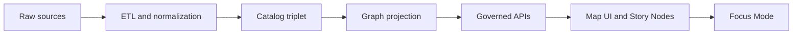

<!-- [KFM_META_BLOCK_V2]
doc_id: kfm://doc/2d04f0d2-4fe9-47b5-9a1d-7a8fbfbdc4c4
title: Contexts Domain
type: standard
version: v1
status: draft
owners: TBD
created: 2026-03-01
updated: 2026-03-01
policy_label: public
related:
  - ../../MASTER_GUIDE_v13.md
tags: [kfm, domains, contexts, policy, focus-mode]
notes:
  - Defines governed “context” concepts used across UI, policy, evidence, and Focus Mode.
  - This doc is intentionally contract-aligned; repo-specific implementations must be verified.
[/KFM_META_BLOCK_V2] -->

<a id="top"></a>

# Contexts Domain

**One-line purpose:** Define and govern the structured *contexts* that constrain policy, retrieval, and reproducibility across Map Explorer, Story Nodes, and Focus Mode.


> **NOTE:** “Context” in KFM is not “random app state.” It is **typed, versioned, auditable input** that must be safe to log (or safely redacted) and must never become a covert channel for restricted information.

---

## Quick navigation

- [Purpose](#purpose)
- [Where this fits](#where-this-fits)
- [What belongs here](#what-belongs-here)
- [Context taxonomy](#context-taxonomy)
- [Context lifecycle and audit](#context-lifecycle-and-audit)
- [How to add or change a context](#how-to-add-or-change-a-context)
- [Examples](#examples)
- [Definition of done](#definition-of-done)
- [Related docs](#related-docs)

---

## Purpose

This directory documents **KFM Contexts**: the minimal structured inputs that:

1. **Constrain what the system is allowed to do** (policy context, role, obligations).
2. **Constrain what the system should retrieve** (view state, bbox, time window, active layers).
3. **Make outputs reproducible** (capturable state + audit references).
4. **Support “cite-or-abstain”** by ensuring retrieval and synthesis always map back to evidence.

---

## Where this fits

KFM’s pipeline is intentionally ordered: upstream artifacts feed downstream surfaces; downstream must not bypass contracts.



Contexts sit at the **boundaries**:

- **UI → API boundary:** view state, filters, and user intent are passed as typed inputs.
- **API → Policy boundary:** principal and policy context drive allow/deny + obligations.
- **Focus Mode boundary:** query + optional view state + role context must be captured into a governed run receipt.

> **WARNING:** Context must never be “free-form hidden prompt text.” If it influences decisions, it must be typed, validated, and auditable.

---

## What belongs here

This folder is a **documentation domain** (not a data domain). Use it for:

### Acceptable inputs

- Definitions of each context type and its intended use
- Field-level semantics and sensitivity notes (what is safe to log vs must be redacted)
- Versioning rules for context schemas
- Examples (JSON) that are safe to copy into tests and fixtures
- Review triggers and “do not leak” guidance

### Exclusions

- Secrets, tokens, private keys, raw credentials
- Production IDs or user PII
- “Magic prompt” strings that are not validated or versioned
- Any content that would reveal restricted dataset existence (“ghost metadata”)

---

## Directory map

> **Proposed structure:** actual repo contents may differ; keep this additive and align as the directory fills in.

```
docs/domains/contexts/
├── README.md                       # you are here
├── glossary.md                     # shared terms: context, view_state, obligations, principal
├── context_taxonomy.md             # taxonomy + ownership + sensitivity rules
├── view_state.md                   # bbox/zoom, layers, filters, time window, style params
├── policy_context.md               # role, policy labels, obligations, reason codes
├── time_context.md                 # event time vs valid time vs transaction time
└── examples/
    ├── focus_request.example.json  # safe sample request payload
    ├── story_view_state.example.json
    └── audit_context.example.json
```

---

## Context taxonomy

### Working definition

A **Context** is a *typed* and *versioned* structure describing “who is asking, from what view, for what time window, under what rules.”

### Taxonomy table

| Context type | Used by | Typical fields | Sensitivity | Persistence |
|---|---|---|---|---|
| **Principal context** | API, Policy | subject, role, authn method | High | Stored as hash/refs; redact where needed |
| **Policy context** | Policy engine, Evidence resolver | policy_label, obligations, reason codes | Medium–High | Stored in receipts (policy-safe) |
| **View state context** | UI, Retrieval planner | bbox, zoom, active layers, filters, time window | Medium | Stored with Story Nodes; optionally passed to Focus Mode |
| **Time context** | Queries, Story playback | from, to, “event time” vs “valid time” | Medium | Stored with map state + receipts |
| **Intent context** | Retrieval planning | query intent tags, selected entities | Medium | Stored in Focus receipts; never used to bypass policy |
| **Environment context** | Ops + test harness | build id, model version, schema versions | Low–Medium | Stored in receipts for reproducibility |

> **TIP:** If a field can change the answer or what gets retrieved, treat it as context and put it under schema + validation.

---

## Context lifecycle and audit

### Focus Mode context capture

Focus Mode must treat each request as a **governed run** and record:

- user query
- optional view state (bbox, time window, active layers)
- user role and policy context
- evidence bundle digests and policy decisions
- output hash and audit reference

### Guardrails

- **Default-deny** if the context is missing required policy elements.
- **No raw retrieval output** may be used without mapping back to evidence references.
- **Hard gate:** if citations cannot be verified and resolved under policy, the system must abstain or reduce scope.

> **WARNING:** Context can be a covert channel. Never return hidden “debug context” to the UI unless policy explicitly allows.

---

## How to add or change a context

### Minimal patch plan

1. **Define the shape**
   - Add or update a JSON Schema (versioned).
   - Decide which fields are **policy-safe** vs require **redaction**.

2. **Document it**
   - Add a doc page in this directory describing semantics, examples, and non-goals.

3. **Wire it through policy**
   - Ensure policy evaluation consumes the typed context (not free-form strings).
   - Add fixture tests for allow/deny + obligations.

4. **Add contract tests**
   - Validate requests and receipts against schema versions.
   - Add regression tests in the evaluation harness where applicable.

5. **Logging and audit**
   - Ensure audit receipt includes context *safely* (hashes/refs/redacted values).

### Review triggers

- Adding or changing any context field that touches:
  - policy decisions
  - evidence resolution
  - citation verification
  - map state replay
  - user identity/roles

---

## Examples

### Example Focus Mode request

```json
{
  "query": "What events are recorded within the current map view?",
  "view_state": {
    "bbox": [-97.0, 38.8, -95.5, 39.4],
    "time_window": { "from": "1990-01-01", "to": "2000-12-31" },
    "active_layers": ["events:storm", "boundaries:counties"],
    "filters": { "severity": ["major"] }
  },
  "principal": {
    "subject": "user:example",
    "role": "public"
  },
  "policy_context": {
    "policy_label": "public"
  },
  "context_version": "v1"
}
```

### Example map view state captured for Story Nodes

```json
{
  "camera": { "bbox": [-97.0, 38.8, -95.5, 39.4], "zoom": 8 },
  "active_layers": ["events:storm"],
  "time_window": { "from": "1993-01-01", "to": "1993-12-31" },
  "filters": { "event_type": ["flood"] }
}
```

---

## Definition of done

### Context doc DoD

- [ ] Context has a **name**, **owner**, and **version**
- [ ] Schema exists and validates examples
- [ ] Sensitivity is stated (what can be logged, what must be redacted)
- [ ] “Do not leak” rules are explicit
- [ ] Includes at least one **copy-paste JSON example**
- [ ] Mentions how it appears in audit receipts

### System DoD when a context is used in a governed flow

- [ ] Policy pre-check uses typed context
- [ ] Evidence resolution enforces policy and obligations
- [ ] Citations resolve via evidence resolver
- [ ] Missing citations triggers abstention or narrowed scope
- [ ] Audit receipt captures context safely and reproducibly

---

## Related docs

- `../../MASTER_GUIDE_v13.md`
- `../../architecture/` for contracts, ADRs, and enforcement boundaries
- `../../governance/` for review gates and safety rules
- `../../reports/story_nodes/` for narrative + map-state artifacts

---

<a href="#top">Back to top</a>
