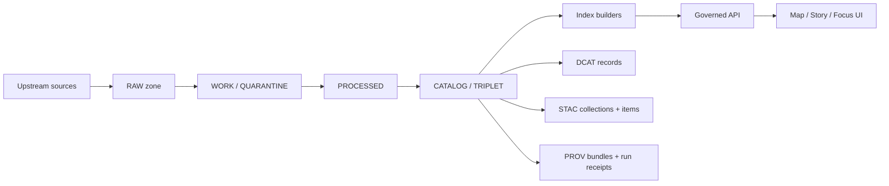

<!-- [KFM_META_BLOCK_V2]
doc_id: kfm://doc/0c1b6d0b-9d0f-4cdb-9a17-9e0db6e0c2b8
title: Catalog Context
type: standard
version: v1
status: draft
owners: TBD
created: 2026-03-01
updated: 2026-03-01
policy_label: TBD
related:
  - ../../../MASTER_GUIDE_v13.md
  - ../../../architecture/
  - ../../../standards/
tags: [kfm, domain, context, catalog, dcat, stac, prov]
notes:
  - Defines the Catalog Context (DCAT + STAC + PROV) as the contract surface between pipeline outputs and runtime.
  - This is documentation; generated catalog outputs live under data/ (not here).
[/KFM_META_BLOCK_V2] -->

# Catalog Context
_Contract-first metadata, assets, and lineage (DCAT + STAC + PROV) that makes promotion auditable and EvidenceRefs resolvable._

**Owners:** TBD  
**Last updated:** 2026-03-01 (America/Chicago)

---

## Quick navigation
- [Purpose](#purpose)
- [Scope](#scope)
- [Where this fits in KFM](#where-this-fits-in-kfm)
- [Responsibilities](#responsibilities)
- [Inputs and outputs](#inputs-and-outputs)
- [Profiles](#profiles)
- [Cross-linking rules](#cross-linking-rules)
- [Promotion gates](#promotion-gates)
- [Directory contract](#directory-contract)
- [Verification checklist](#verification-checklist)
- [Appendix: examples](#appendix-examples)

---

## Purpose
The **Catalog Context** defines how KFM represents **what a dataset is**, **what assets exist**, and **how those assets were produced** using a **catalog triplet**:

- **DCAT**: dataset-level identity, publisher, licensing/rights, and distributions
- **STAC**: spatiotemporal assets (collections/items/assets)
- **PROV**: lineage (inputs, tools, parameters, activities, agents), including run receipts

**KFM treats this triplet as a contract surface**, not optional “nice metadata.” The catalogs are the interface between pipeline outputs and runtime access (API/UI/evidence resolution).

> NOTE  
> This folder is *documentation for the context*.  
> The generated catalog artifacts live under `data/` (e.g., `data/stac/`, `data/catalog/dcat/`, `data/prov/`) and are governed as promotion outputs.

[Back to top](#catalog-context)

---

## Scope
This context covers:

- **Catalog generator responsibilities** (what it must emit; what it must validate)
- **Profiles and minimum required fields** (DCAT/STAC/PROV “must have”)
- **Cross-linking** requirements so navigation is deterministic and EvidenceRefs resolve without guessing
- **Promotion gate expectations** related to catalog validation
- **Interface boundaries** (Domain → Use cases → Interfaces → Infrastructure)

This context does **not** cover:

- Implementation details of any specific `packages/catalog` code (verify in repo)
- Raw/work/processed artifact generation (belongs to ingestion/pipelines contexts)
- Runtime policy decisions (belongs to policy/evidence contexts), except where policy labels affect catalog outputs
- Hosting/serving catalogs (API/UI concerns)

[Back to top](#catalog-context)

---

## Where this fits in KFM
The catalog triplet sits between **PROCESSED** outputs and **PUBLISHED** runtime surfaces:

Key posture:
- The triplet is **canonical** (source-of-truth metadata + lineage), and downstream projections (indexes/tiles/search/graph) are **rebuildable** from it.

[Back to top](#catalog-context)

---

## Responsibilities
| Surface | Answers | Primary consumers | Validation focus |
|---|---|---|---|
| **DCAT** | “What is this dataset? Who publishes it? What are rights? What are distributions?” | Discovery, portals, dataset listing APIs | Required fields present; license/rights captured; IDs stable; links to PROV |
| **STAC** | “What assets exist? Where are files? What are spatial/temporal extents?” | Map/tiles/index builders, asset discovery | Collections/items validate; asset href + checksum + media_type; extents correct & policy-safe |
| **PROV** | “How was it created? Which inputs, tools, parameters, approvals?” | Audit, evidence resolution, trust membrane | Activities/entities/agents; used/generatedBy edges; env capture; policy decisions referenced |
| **Run receipts** | “What exactly ran, on what, producing which digests?” | CI promotion, audits, reproducibility | Inputs/outputs enumerated; checksums/digests present; pointers to catalogs |

[Back to top](#catalog-context)

---

## Inputs and outputs

### Inputs (conceptual)
The catalog generator should be able to consume:

- Dataset identity & versioning (dataset_id, dataset_version_id, spec_hash)
- PROCESSED artifacts + checksums/digests
- Run receipt / audit record for the producing pipeline run
- Policy label + any redaction/generalization obligations that affect geometry/fields

### Outputs (conceptual)
The catalog generator produces:

- **DCAT dataset** record (and per-artifact distributions)
- **STAC collection(s)** + **STAC item(s)** (if assets are spatiotemporal)
- **PROV bundle** representing the run activity, artifacts, and agents
- **Cross-links** so navigation is deterministic
- **EvidenceRef mapping** (so `dcat://`, `stac://`, `prov://` references resolve consistently)

### Expected output locations (verify in repo)
These locations are *expected* by the v13 structure guidance:

- `data/stac/collections/` and `data/stac/items/`
- `data/catalog/dcat/`
- `data/prov/`

[Back to top](#catalog-context)

---

## Profiles
Profiles exist to make validation **strict and predictable**.

### DCAT minimums (profile intent)
At minimum, DCAT records should carry:
- title + description
- publisher
- license/rights
- theme (controlled vocab)
- spatial + temporal coverage
- distributions (one per artifact class)
- links to PROV activity/bundle
- policy label
- dataset identifiers (dataset_id, dataset_version_id)

### STAC minimums (profile intent)
**Collection minimums**
- id, title, description
- extent (spatial bbox + temporal interval)
- license
- link(s) back to DCAT dataset record
- dataset_version_id + policy label

**Item minimums**
- id
- geometry or bbox (must respect policy label; generalized if required)
- datetime (or start/end)
- assets with href + checksum + media_type
- links to PROV run receipt/activity and DCAT distribution

### PROV minimums (profile intent)
- prov:Activity per pipeline run
- prov:Entity per artifact (raw/work/processed)
- prov:Agent for pipeline + steward/approval events
- prov:used and prov:wasGeneratedBy edges
- policy decision references (decision_id + obligations)
- environment capture (container digest, git commit, parameters)

[Back to top](#catalog-context)

---

## Cross-linking rules
Cross-links must be explicit so that navigation and resolution are deterministic:

- DCAT dataset → distributions → artifact digests
- DCAT dataset → prov:wasGeneratedBy → PROV activity/bundle
- STAC collection → `describedby` → DCAT dataset
- STAC item → link(s) → PROV activity and/or run receipt
- EvidenceRef schemes should resolve into these objects **without guessing**

> WARNING  
> If cross-links are not consistently produced and validated, you will get “metadata drift”:  
> catalogs exist, but EvidenceRefs can’t reliably resolve, and UI claims stop being traceable.

[Back to top](#catalog-context)

---

## Promotion gates
Catalog validation is a **promotion blocker**.

### Gate D — Catalog triplet validation (minimum)
Promotion should fail closed unless:
- DCAT validates against the KFM DCAT profile
- STAC validates (collections/items where applicable)
- PROV validates against the KFM PROV profile
- Cross-links between DCAT, STAC, and PROV are present and resolvable

### Related gates that feed catalog correctness
- **Gate B (licensing/rights):** license must be explicit; unclear rights must block promotion
- **Gate C (sensitivity):** policy label + redaction plan must be reflected in catalog geometry/fields
- **Gate E/F (receipts + contract tests):** run receipts exist; evidence resolution works at least once in CI

#### CI checks (recommended)
- Schema validators for DCAT/STAC/PROV
- Link checker across DCAT/STAC/PROV for every promoted dataset_version
- EvidenceRef “smoke resolve” against the evidence resolver contract

[Back to top](#catalog-context)

---

## Directory contract

### Where this fits in the repo
This is a **governed documentation context** under `docs/domains/contexts/catalog/`.

It exists to document:
- the contract (profiles, rules, boundaries),
- the “why” (trust and reproducibility),
- and the testability requirements (what CI must prove).

### Acceptable inputs
This directory may contain:
- Context README (this file)
- ADRs for catalog schema/profile decisions
- Notes on cross-linking, EvidenceRef schemes, and validation strategy
- Checklists and runbooks for adding a dataset’s catalog triplet
- Examples/skeletons (non-authoritative) to illustrate intent

### Exclusions
This directory must **not** contain:
- Generated DCAT/STAC/PROV outputs (those belong under `data/`)
- Raw/work/processed dataset artifacts
- Secrets, tokens, credentials, or private endpoints
- “Floating” narratives not backed by evidence/citations

[Back to top](#catalog-context)

---

## Verification checklist
Because docs can drift from repo reality, treat the following as a **minimum verification pass** when wiring or modifying the Catalog Context:

- [ ] Confirm where STAC/DCAT/PROV outputs live in the current repo (`data/` layout)
- [ ] Confirm there are schema/profile validators for DCAT/STAC/PROV
- [ ] Confirm CI runs a link checker across the triplet for promoted dataset versions
- [ ] Confirm EvidenceRefs can resolve without guessing (at least one per dataset_version in CI)
- [ ] Confirm policy labels and any required generalization/redaction are reflected in catalog outputs
- [ ] Confirm run receipts include environment capture (container digest, commit, parameters)

[Back to top](#catalog-context)

---

## Appendix: examples
These are **illustrative skeletons** (not authoritative schemas). Use real repo schemas/profiles for implementation.

Example: EvidenceRef schemes (minimum)

- `dcat://...` → dataset/distribution metadata
- `stac://...` → collection/item/asset metadata
- `prov://...` → run lineage (activity/entity/agent)
- `doc://...` → governed docs + story citations
- `graph://...` → entity relations (if enabled)

Example: “fail closed” philosophy for catalog drift

If any of the following is true, **promotion should block**:

- DCAT is missing license/rights or publisher
- STAC item assets lack checksums/digests or have broken hrefs
- PROV cannot identify the producing activity or inputs
- Cross-links are broken (DCAT↔STAC↔PROV cannot be traversed)
- EvidenceRefs require heuristic guessing

