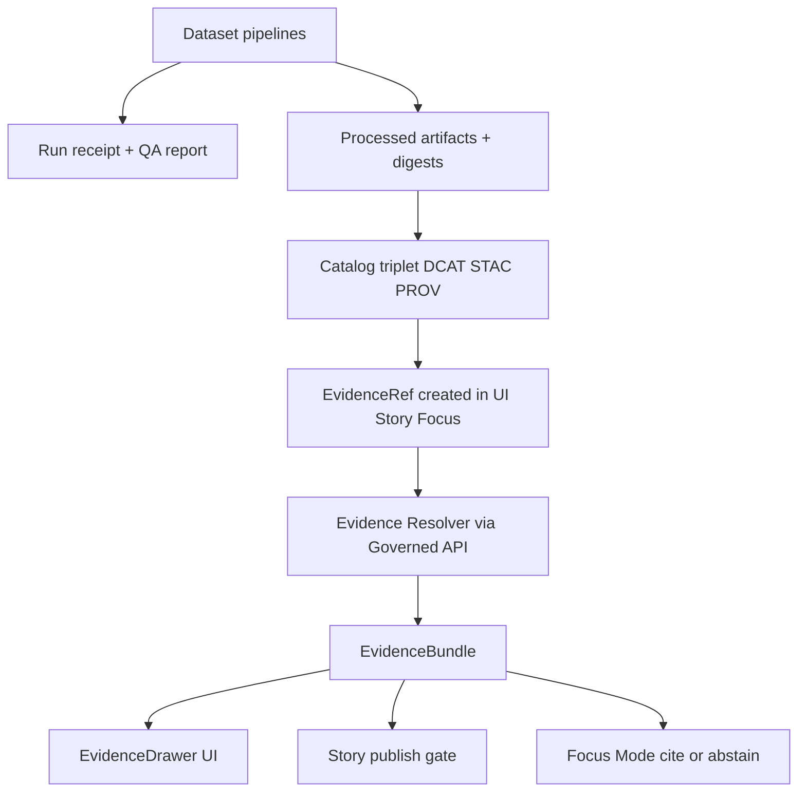

<!-- [KFM_META_BLOCK_V2]
doc_id: kfm://doc/7c0d6a6e-4f6e-4d3a-8d1a-3a7d4a8ed4a2
title: Evidence Context
type: standard
version: v1
status: draft
owners: KFM Maintainers
created: 2026-03-01
updated: 2026-03-01
policy_label: public
related:
  - docs/domains/contexts/
  - docs/domains/contexts/policy/
  - docs/domains/contexts/story/
tags: [kfm, evidence, governance, trust-membrane, cite-or-abstain]
notes:
  - This README documents the Evidence context as a governed contract surface (not just "citations").
  - Replace placeholder links/TODOs once the repo paths are confirmed.
[/KFM_META_BLOCK_V2] -->

# Evidence Context
Evidence-first, policy-governed citations that resolve into inspectable bundles (not “links in text”).


---

## Navigation
- [Purpose](#purpose)
- [Non-negotiable invariants](#non-negotiable-invariants)
- [Key objects](#key-objects)
- [How evidence flows through KFM](#how-evidence-flows-through-kfm)
- [Contracts](#contracts)
- [Directory contract](#directory-contract)
- [Change checklist](#change-checklist)
- [Failure modes](#failure-modes)
- [Appendix](#appendix)

---

## Purpose
This directory documents **Evidence** as a first-class KFM context: how the system represents, resolves, validates, and renders evidence so that:

- every **map layer interaction**, **story claim**, and **Focus Mode answer** is backed by **resolvable evidence**, and
- if evidence cannot be verified or is disallowed by policy, the system **fails closed** (narrows scope or abstains).

> **Mental model:** a “citation” in KFM is an **EvidenceRef**, not a URL. It must resolve (via the evidence resolver) into an **EvidenceBundle** with the metadata, digests, provenance, and rights needed to inspect the claim.

---

## Non-negotiable invariants
These are the “don’t break trust” rules for evidence work:

1. **Evidence must resolve or the system abstains.**  
   No “free-floating” claims in Story Nodes or Focus Mode without resolvable evidence.

2. **Trust membrane:** clients do not directly access storage/DB.  
   All evidence access flows through the governed API boundary + evidence resolver.

3. **Catalog triplet is a contract surface:** DCAT + STAC + PROV are cross-linked so EvidenceRefs resolve deterministically.

4. **CI blocks narrative merges when citations fail.**  
   Citation syntax, resolver checks, policy checks, and rights checks must pass.

---

## Key objects

### EvidenceRef
**What it is:** a reference token or structured reference that points to evidence for a claim.  
**What it is not:** a raw hyperlink pasted into markdown.

**Resolver requirement:** an EvidenceRef must be resolvable in a controlled environment (CI/test) and policy-allowed for the requesting context.

### EvidenceBundle
**What it is:** an immutable-by-digest bundle returned by the resolver, containing:

- machine-verifiable identifiers (bundle digest, dataset_version_id)
- policy decision + obligations applied (redactions, restrictions, etc.)
- provenance references (run receipt / run_id, audit_ref)
- rights & license metadata
- renderable “cards” (UI-ready evidence summaries)
- artifact references with digests and media types (only if policy allows)

---

## How evidence flows through KFM



**Design intent:** Evidence is not “decorative metadata.” It is the primary way KFM turns datasets and transformations into **inspectable, replayable claims**.

---

## Contracts

### Runtime API contract
Evidence resolution is centralized:

- **`POST /api/v1/evidence/resolve`**  
  Input: EvidenceRef (or structured reference)  
  Output: EvidenceBundle (or deny/error if not allowed)

**Guarantees (expected):**
- Policy is applied at resolution time.
- Redaction obligations are enforced before anything is returned.
- Responses include dataset_version_id, license/rights, provenance refs, and artifact digests (when allowed).

> **NOTE:** The evidence resolver is the “citation compiler.” It replaces “LLM citations” with a deterministic resolution step.

---

### CI / merge gate contract (Story Nodes)
CI must validate citations before a Story Node can merge/publish:

- syntax check for EvidenceRefs
- resolver check (can resolve in test env)
- policy check (allowed for intended policy label)
- rights check (media requires rights metadata)

If any of these fail, **Story Node merge is blocked**.

---

### UI contract: EvidenceDrawer “trust surface”
The EvidenceDrawer is a shared UI component used in:
- Map Explorer feature inspection
- Story Mode (per-claim evidence)
- Focus Mode (answer citations)

Minimum drawer contents:
- evidence bundle id + digest
- dataset + dataset_version_id
- license + rights holder attribution
- freshness (last run timestamp) + validation status
- provenance chain (run receipt link)
- artifact links (only if policy allows)
- redactions/obligations applied

Accessibility requirement (minimum): keyboard navigable interactions + non-color-only semantics.

---

## Directory contract

### Where it fits
`docs/domains/contexts/evidence/` defines the **conceptual + contract** layer for evidence, spanning:
- domain semantics (EvidenceRef / EvidenceBundle)
- contract expectations (resolver behavior, CI gates)
- UI trust surface requirements (EvidenceDrawer)
- governance alignment (policy labels, obligations, default-deny)

### What belongs here
✅ Acceptable inputs:
- context definitions and diagrams
- evidence bundle structure notes
- evidence resolver contract notes (request/response shape, error semantics)
- CI gate rules (what blocks merge, what’s a hard requirement)
- UX rules for evidence visibility, redaction, and review workflows
- small examples (sanitized) of EvidenceRefs / EvidenceBundles

### What must not go here
🚫 Exclusions:
- production code (belongs in packages/apps)
- secrets, tokens, credentials
- raw datasets or large artifacts
- policy decision logs containing sensitive data
- “one-off” narrative claims without evidence (those belong in Story Nodes, and must cite evidence)

### Directory tree
> **PROPOSED (update to match the repo):**
```
docs/domains/contexts/evidence/
├─ README.md                       # you are here
├─ concepts.md                     # EvidenceRef/EvidenceBundle semantics
├─ resolver-contract.md            # API behavior + failure modes + redaction posture
├─ ci-gates.md                     # citation linting + resolver smoke tests
├─ ux-evidence-drawer.md           # UI requirements + accessibility checklist
└─ examples/
   ├─ evidence_bundle.example.json  # sanitized example bundle
   └─ story_citations.example.md    # example citations embedded in a story
```

---

## Change checklist
Use this checklist for PRs touching evidence semantics/contracts.

### If you change EvidenceBundle shape
- [ ] Update the resolver implementation (API boundary)
- [ ] Update OpenAPI/JSON schema (contract surface)
- [ ] Update EvidenceDrawer renderer (cards + fields)
- [ ] Add/adjust contract tests
- [ ] Run citation linting and resolver checks in CI

### If you introduce a new “evidence card” type
- [ ] Define card rendering rules + required fields
- [ ] Define policy-obligation behavior (what gets redacted)
- [ ] Add at least one sanitized example bundle
- [ ] Ensure the UI can open the card from Map, Story, and Focus Mode

### If you change citation verification rules
- [ ] Update CI checks (syntax + resolver + policy + rights)
- [ ] Document the failure mode (what the user sees)
- [ ] Verify Story publish is blocked when citations do not resolve

---

## Failure modes
Common fail-closed outcomes (expected):

- **Non-resolvable citations**: broken links, missing catalogs, missing run receipt → story publish blocked.
- **Policy denial**: user lacks role/permission → evidence resolver returns deny and the UI must explain why.
- **Rights metadata missing**: media cited without rights/attribution → CI blocks merge.
- **Sensitive location leakage risk**: precise artifacts restricted → resolver returns generalized/withheld evidence with obligations noted.

---

## Appendix

### EvidenceBundle (illustrative shape)
This is an **illustrative** (not authoritative) shape aligned with KFM vNext guidance:

```json
{
  "bundle_id": "sha256:…",
  "dataset_version_id": "YYYY-MM.<spec_hash_prefix>",
  "title": "…",
  "policy": {
    "decision": "allow",
    "policy_label": "public",
    "obligations_applied": []
  },
  "license": {
    "spdx": "…",
    "attribution": "…"
  },
  "provenance": { "run_id": "kfm://run/…" },
  "artifacts": [
    { "href": "…", "digest": "sha256:…", "media_type": "…" }
  ],
  "checks": { "catalog_valid": true, "links_ok": true },
  "audit_ref": "kfm://audit/entry/…"
}
```

### “Unknown → Confirmed” minimal verification steps
If you’re onboarding or refactoring evidence, verify (and attach outputs to the PR):

- repo commit hash + directory tree
- which work packages exist (resolver route, validators, policies)
- CI gate list and which checks block merges
- end-to-end evidence resolution from UI → API → bundle (Map + Story publish checks)

---

<p align="right"><a href="#evidence-context">Back to top</a></p>
