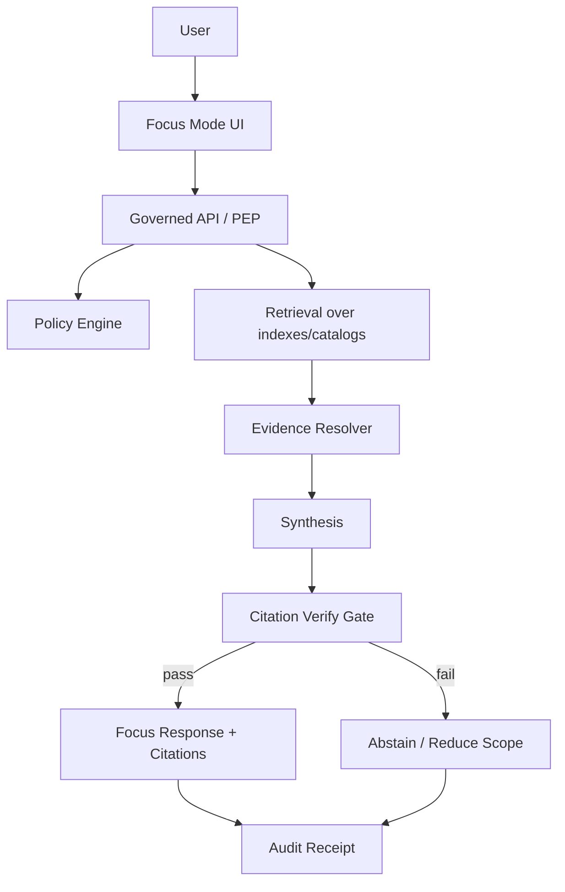
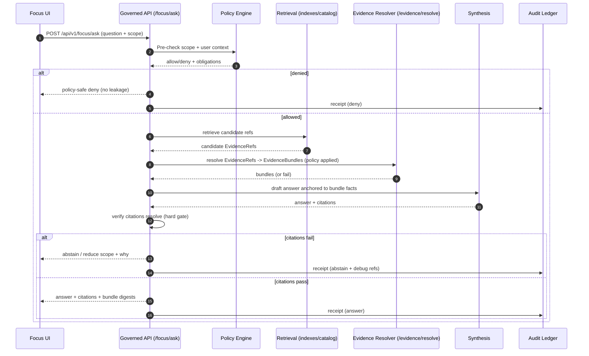

<!-- [KFM_META_BLOCK_V2]
doc_id: kfm://doc/2a7d0a65-3c5e-4431-ba8f-62e2cd1b0374
title: Focus Context
type: standard
version: v1
status: draft
owners: KFM Maintainers (TODO)
created: 2026-03-01
updated: 2026-03-01
policy_label: public
related:
  - docs/domains/contexts/map/README.md (TODO)
  - docs/domains/contexts/story/README.md (TODO)
  - docs/domains/contexts/evidence/README.md (TODO)
  - docs/domains/contexts/policy/README.md (TODO)
  - contracts/openapi/ (TODO)
tags: [kfm, focus, context, governance, cite-or-abstain]
notes:
  - This is a governed “context README” describing Focus Mode (evidence-led Q&A) requirements and boundaries.
  - Replace TODO links with real paths once confirmed in-repo.
[/KFM_META_BLOCK_V2] -->

# Focus Context
Evidence-led Q&A (Focus Mode) that **cites resolvable evidence or abstains**, enforced by policy and audit receipts.


<!-- TODO(badges): replace placeholders with repo CI/status badges when paths are confirmed -->

## Navigation
- [Purpose](#purpose)
- [Where this fits](#where-this-fits)
- [Responsibilities and non-goals](#responsibilities-and-non-goals)
- [Hard invariants](#hard-invariants)
- [Architecture](#architecture)
- [Core flow](#core-flow)
- [Contracts](#contracts)
- [Testing and gates](#testing-and-gates)
- [Security and misuse resistance](#security-and-misuse-resistance)
- [Directory contents](#directory-contents)
- [Change management](#change-management)
- [References](#references)

---

## Purpose
The **Focus Context** defines the requirements for KFM’s **Focus Mode**: a governed question/answer experience where every user-facing claim is traceable to **EvidenceBundles** and policy decisions.

This README exists to:
- define the **boundary** of Focus Mode (what it owns vs. what it depends on),
- encode the **fail-closed** stance (default-deny, cite-or-abstain),
- provide a consistent set of **contracts + gates** so Focus Mode changes remain reversible and auditable.

> **NOTE**  
> Focus Mode is treated as a **governed run**: it produces a **receipt**, is subject to policy, and must not bypass the trust membrane.

[Back to top](#focus-context)

---

## Where this fits
Focus Mode is a **trust surface** alongside Map Explorer and Story Mode, and it shares the same evidence drawer / evidence-resolver backbone.



Focus **depends on**:
- **Governed API boundary (PEP)** for policy enforcement + policy-safe errors
- **Evidence Resolver** to turn references into inspectable bundles
- **Catalog Triplet (DCAT + STAC + PROV)** and run receipts for provenance
- **Indexes** as *rebuildable projections* (search/graph/tiles), never as source-of-truth

Focus **must not** depend on:
- direct storage/DB reads from UI clients
- undocumented backdoors, “hidden tools”, or unverifiable external sources

[Back to top](#focus-context)

---

## Responsibilities and non-goals

### Responsibilities (Focus owns)
1. **Question orchestration**
   - accept an ask request
   - apply policy pre-checks to requested scope (time, bbox, dataset constraints)
2. **Evidence-led retrieval**
   - gather candidate EvidenceRefs/records from catalogs and projections
3. **Evidence bundling**
   - resolve citations into EvidenceBundles via the evidence resolver
4. **Synthesis with hard citation gate**
   - produce an answer *only* if citations can be verified
   - otherwise **abstain** or reduce scope
5. **Receipts + auditing**
   - record a run receipt for every query (including abstains)

### Non-goals (explicitly out of scope)
- Training foundation models or “making the model smarter”
- Creating/maintaining dataset pipelines (ingest/promotion lives elsewhere)
- Bypassing policy to “help the user”
- Acting as a generalized web search engine by default (Focus Mode is evidence-first and governed)

[Back to top](#focus-context)

---

## Hard invariants
These are non-negotiable rules. If any are uncertain, Focus must **fail closed**.

| Invariant | Meaning in practice | “Fail closed” behavior |
|---|---|---|
| **Trust membrane** | Clients never access storage/DB directly; all access goes through governed APIs with policy and logging. | Return policy-safe errors; do not leak existence of restricted data. |
| **Cite-or-abstain** | Answers cite resolvable EvidenceBundles tied to dataset versions, or abstain. | If citations can’t verify/resolve → abstain or narrow scope. |
| **Evidence-first UX** | Every claim in the answer has a path to evidence (bundle card + provenance + license). | If evidence is missing/unclear → abstain. |
| **Receipts for queries** | Every Focus request produces a run receipt/audit record. | No “silent” answers without receipts. |
| **Policy labels & obligations** | Policy can require redactions/generalization; Focus must not defeat obligations via wording. | Apply obligations; explain redactions to the user. |

[Back to top](#focus-context)

---

## Architecture

### Context boundary (DDD-style)
- **Domain**: FocusRequest, FocusResponse, Citation, RunReceiptRef
- **Use cases**: AskFocusQuestion, VerifyCitations, EmitFocusReceipt
- **Interfaces**: PolicyDecisionPort, EvidenceResolverPort, RetrievalPort, ReceiptWriterPort
- **Infrastructure**: HTTP route handlers, OPA adapter, DB/search adapters, telemetry/logging sinks

> **TIP**  
> Keep Focus “thin”: orchestration + verification. Heavy lifting (policy evaluation, evidence resolution, catalog parsing) stays in dedicated modules behind interfaces.

[Back to top](#focus-context)

---

## Core flow



[Back to top](#focus-context)

---

## Contracts

> **WARNING**  
> Contract examples below are **templates**. Confirm actual JSON Schemas/OpenAPI in-repo before treating field names as canonical.

### API surface (minimum)
- `POST /api/v1/focus/ask` — Focus Q&A; must cite or abstain; logs retrieval context
- `POST /api/v1/evidence/resolve` — resolve EvidenceRef → EvidenceBundle (policy applied; fail closed)

### EvidenceRef forms
Evidence Resolver should accept structured references such as:
- `dcat://...` (dataset-level metadata)
- `stac://...` (asset/item/collection)
- `prov://...` (lineage/run provenance)
- `doc://...` (governed documentation references)

### Focus ask request (template)
```json
{
  "question": "What changed in storm events in my county last month?",
  "scope": {
    "bbox": [-98.5, 38.0, -97.5, 39.0],
    "time": {"start": "2026-02-01", "end": "2026-03-01"},
    "datasets": ["kfm://dataset/noaa_storm_events"] 
  },
  "response_preferences": {
    "format": "markdown",
    "max_citations": 12
  }
}
```

### Focus response (template)
```json
{
  "status": "answer",
  "answer_markdown": "…",
  "citations": [
    {"evidence_ref": "stac://…", "bundle_id": "sha256:…"}
  ],
  "policy": {
    "decision": "allow",
    "policy_label": "public",
    "obligations_applied": []
  },
  "run_receipt_ref": "kfm://run/…",
  "retrieval_context": {
    "datasets_considered": ["…"],
    "time_window": {"start": "…", "end": "…"}
  }
}
```

### Abstain response (template)
```json
{
  "status": "abstain",
  "reason": {
    "code": "CITATIONS_UNVERIFIABLE",
    "message": "I can’t support an answer with resolvable evidence for the requested scope."
  },
  "suggested_next_steps": [
    "Narrow the time window",
    "Choose a specific dataset version",
    "Open the evidence drawer for the candidate dataset and inspect coverage"
  ],
  "run_receipt_ref": "kfm://run/…"
}
```

[Back to top](#focus-context)

---

## Testing and gates
Focus changes are only safe if the “trust loop” is enforced by tests.

### Required automated checks (minimum)
- [ ] **Contract tests**: `/focus/ask` responses validate against schema
- [ ] **Citation verification**: all citations resolve via evidence resolver
- [ ] **Policy regression tests**: default-deny remains default; obligations apply
- [ ] **Golden evaluation harness**: a set of “golden queries” must not regress (answer correctness + abstain correctness)
- [ ] **No-leak tests**: “public user” cannot infer restricted data via error messages/timing

### Definition of Done for Focus changes
- [ ] Every new answer surface includes **resolvable citations**
- [ ] Every abstain includes a **reason code** + safe next steps
- [ ] Every request emits a **receipt**
- [ ] Prompt-injection attempts are handled (tool allowlist + citation gate)
- [ ] Logs/receipts are policy-appropriate (no PII, no sensitive payload echo)

[Back to top](#focus-context)

---

## Security and misuse resistance
Focus Mode is explicitly in the blast radius for:
- prompt injection / tool abuse
- sensitive location leakage (archaeology/species)
- inference attacks (existence leaks via errors/timing)
- licensing violations via untracked sources

### Required mitigations (minimum posture)
- **Tool allowlist**: Focus may only call approved internal ports (policy, evidence, catalogs)
- **Hard citation gate**: no verified citations → no answer
- **Policy-safe errors**: deny without revealing whether restricted datasets exist
- **Redaction obligations**: generalize/redact outputs when required, and explain at UX level
- **Receipt discipline**: all asks logged as governed events with redaction/retention controls

[Back to top](#focus-context)

---

## Directory contents

### What belongs here
This directory is for **documentation about the Focus context**, such as:
- context boundary, flows, contracts (as docs)
- threat model notes specific to Focus
- evaluation harness guidance (golden query rules, rubric)
- “how to reason about abstains” patterns
- UX expectations for citations/evidence drawer integration

### What must NOT go here
- secrets, tokens, API keys
- large datasets or model weights
- unreviewed prompt dumps containing user data
- “temporary” debug logs with sensitive content
- production OpenAPI/JSON schema sources (those belong under `contracts/`)

### Suggested sub-structure (adjust to repo reality)
```text
docs/domains/contexts/focus/
  README.md                  # this file
  contracts.md               # human-readable contract notes (NOT the canonical schema)
  threat-model.md            # Focus-specific risks + mitigations
  eval/
    golden-queries.md        # rubric + how to add a query
    datasets.md              # which datasets are safe to use in eval (if any)
  patterns/
    abstain-playbook.md      # standard abstain reasons and suggested next steps
```

[Back to top](#focus-context)

---

## Change management
Because Focus Mode is a **trust surface**, changes must be treated as governed.

When adding/changing:
- retrieval sources
- citation format
- evidence resolution behavior
- logging/receipt contents
- any new “tool” or capability

…do the following:
1. Add/extend contract tests + golden queries.
2. Update threat-model notes (Focus-specific).
3. Ensure policy fixtures cover the new surface.
4. Confirm citations remain resolvable end-to-end.

[Back to top](#focus-context)

---

## References
- **KFM — Tooling the KFM pipeline / delivery plan** (truth path, trust membrane, Focus control loop, evaluation harness expectations)
- **KFM — Source snapshots bundle / blueprint tables** (API surface, evidence resolver contract, threat-model checklist, Focus Mode MVP deliverables)

<!-- TODO: replace with repo-local links once confirmed -->
