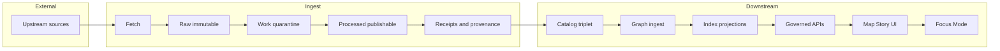

<!-- [KFM_META_BLOCK_V2]
doc_id: kfm://doc/ad6c67ed-be21-4fa1-9348-b1b37396241d
title: Ingest Context
type: standard
version: v1
status: draft
owners: TBD
created: 2026-03-01
updated: 2026-03-01
policy_label: public
related:
  - docs/MASTER_GUIDE_v13.md
  - docs/architecture/
  - docs/domains/contexts/catalog/README.md
  - docs/domains/contexts/policy/README.md
tags: [kfm, domain, context, ingest, governance]
notes:
  - This is the bounded-context/runbook entry for ingestion (ETL + receipts + promotion prerequisites).
  - Update related links once adjacent context docs exist.
[/KFM_META_BLOCK_V2] -->

# Ingest Context

> **One-line purpose:** Acquire upstream data safely, deterministically, and auditably into the KFM truth path, producing the artifacts required for promotion (receipts + lineage + minimum metadata).


**Status:** Draft • **Core invariant:** cite-or-abstain • **Default stance:** fail-closed when policy/metadata is missing.

---

## Navigation

- [Context boundaries](#context-boundaries)
- [Truth path and canonical pipeline](#truth-path-and-canonical-pipeline)
- [Inputs and outputs](#inputs-and-outputs)
- [Security model](#security-model)
- [Workflows](#workflows)
- [Definition of Done](#definition-of-done)
- [Directory contract](#directory-contract)
- [Open questions](#open-questions)
- [Appendix](#appendix)

---

## Context boundaries

### Responsibilities (what *must* live here)

| Area | Responsibility | Evidence stance |
|---|---|---|
| Upstream access | Fetch from external systems (HTTP/APIs, file drops, object stores, external catalogs) | **CONFIRMED concept:** ingestion is upstream→truth-path intake; must feed promotion gates (see Truth Path). |
| Acquisition artifacts | Store immutable upstream payloads (or references) and acquisition logs | **CONFIRMED:** RAW is immutable acquisition with checksums; ingestion must preserve it. |
| Normalization | Convert upstream payloads into KFM-ingestable representations (schemas, geometry/time normalization, partitioning/tiling) | **CONFIRMED:** WORK/Quarantine exists for intermediate transforms + QA. |
| Validation gates | Run schema + QA validations and fail closed when required metadata/policy checks do not pass | **CONFIRMED:** promotion is gated; catalogs/lineage are required at promotion. |
| Provenance & receipts | Emit run receipts with enough info to reproduce and justify promotion (Entities/Activities/Agents, inputs/outputs, hashes) | **CONFIRMED:** provenance/receipts are first-class promotion artifacts. |
| Freshness automation | Watchers/change detection to keep sources current and to trigger runs/PRs | **PROPOSED (recommended pattern):** watchers based on ETag/Last-Modified; PR-first. |
| Zero-trust ingest | Harden external acquisition (ephemeral auth, signed logs, content-addressed staging) | **PROPOSED (recommended default):** “Zero-trust ingest” pattern for all external access. |

### Non-responsibilities (what must *not* live here)

| Out of scope | Lives elsewhere |
|---|---|
| Serving user queries, UI state, or direct client access to storage | API boundary / UI contexts (trust membrane) |
| Policy authoring or adjudication | Policy context (Ingest **consumes** policy) |
| Long-term public catalog serving | Catalog context (validates/serves STAC/DCAT/PROV) |
| Search/tiles/graph projections | Indexers + Graph ingest contexts |

> **NOTE**  
> This README documents *intentional boundaries*. If code currently violates them, treat that as technical debt to pay down (prefer additive adapters + gates over sweeping rewrites).

---

## Truth path and canonical pipeline

### Truth path lifecycle (CONFIRMED invariant)

```text
UPSTREAM → RAW (immutable) → WORK / QUARANTINE → PROCESSED → CATALOG (DCAT + STAC + PROV) → PUBLISHED (governed runtime)
```

**Ingest owns:** `UPSTREAM → RAW → WORK → PROCESSED` plus the validation/provenance artifacts required to form the `CATALOG` triplet.

**Promotion contract note:** promotion gates apply at each transition, and the **Catalog Triplet** must cross-link identifiers so evidence references can resolve downstream.

### Canonical system ordering (CONFIRMED invariant)

```text
ETL → STAC/DCAT/PROV catalogs → Graph → Governed APIs → Map/Story UI → Story Nodes → Focus Mode
```

Ingest is the ETL boundary and must not “skip ahead” to later stages.

---

## Inputs and outputs

> **IMPORTANT**  
> Many paths below are **design-intended** locations described in KFM documentation. Verify actual repo paths before implementing automation (see [Open questions](#open-questions)).

### Inputs (expected)

| Input | What it is | Design-intended home (verify) |
|---|---|---|
| Dataset registry entry | Stable dataset_id + publisher + license/rights + upstream + policy_label + spec ref/hash | `data/registry/…` (or equivalent) |
| Pipeline definition | Typed pipeline contract (schedule/triggers, inputs/outputs, required validations) | `src/pipelines/<dataset>/pipeline.yaml` (or equivalent) |
| Policies | License allow/deny, sensitivity obligations, logging rules | `policy/…` |
| Credentials | Short-lived identity for upstream fetch | OIDC/ephemeral tokens (CI identity) |

### Outputs (required)

| Output | Minimum expectations | Typical zone/home (verify) |
|---|---|---|
| RAW acquisition artifact | Immutable copy or snapshot reference + checksum | `data/raw/<domain>/…` |
| WORK artifacts | Intermediate transforms, QA reports, redaction candidates | `data/work/<domain>/…` |
| PROCESSED artifacts | Publishable standardized outputs + stable IDs + checksums | `data/processed/<domain>/…` |
| Catalog triplet artifacts | STAC items/collections + DCAT dataset views + PROV lineage bundles | `data/stac/…`, `data/catalog/dcat/…`, `data/prov/…` |
| Run receipt | Machine-verifiable “what happened” record (inputs, outputs, hashes, agent, run_id, commit) | `data/prov/…` (or a receipts folder) |

---

## Security model

### Trust membrane (CONFIRMED invariant)

- Frontend and external clients never access storage directly.
- Runtime access flows through governed APIs that apply policy decisions, redactions, and logging consistently.

Ingest must preserve this boundary by producing promoted artifacts that runtime systems *read*, rather than coupling runtime services to upstream sources.

### Zero-trust ingest (PROPOSED default pattern)

The ingest boundary assumes upstream sources are **untrusted** and that ingestion is a security-sensitive operation.

**Recommended invariants:**
- **Ephemeral auth only:** per-job OIDC tokens; no static secrets.
- **Sidecar isolation:** fetch in a minimal container with egress controls.
- **Signed everything:** fetch logs and key artifacts carry signatures/attestations.
- **Content-addressed staging:** raw blobs keyed by digest (immutability before transform).
- **License-first gate:** block promotion when license is unknown/forbidden.
- **Determinism + provenance:** canonicalize/hash/diff; emit attestations + PROV.

> **WARNING**  
> If you cannot determine license or rights, do not “best-effort” ingest into published zones. Quarantine and open a governance ticket.

---

## Workflows

### 1) Onboard a new upstream source (golden path)

1. **Register the source** (dataset_id, license/rights, publisher, spatial/temporal extent, cadence, policy label).
2. **Define pipeline contract** (`pipeline.yaml` or equivalent) with:
   - inputs (URLs/API endpoints)
   - schedule or triggers
   - outputs (raw/work/processed locations)
   - required validations (schema + QA thresholds)
3. **Implement connector** (fetch + normalize):
   - (recommended) sidecar fetch pattern
   - write immutable RAW artifact + checksum
   - emit signed fetch-log (sanitized)
4. **Validate**:
   - schema validation (format + geometry/time)
   - QA thresholds (completeness, ranges, uniqueness, drift)
   - license check (fail closed)
5. **Emit provenance**:
   - PROV run receipt (Entities/Activities/Agents)
   - include run_id + commit + deterministic seed values
6. **Hand off** to downstream:
   - catalog generation/validation (STAC/DCAT/PROV cross-links)
   - graph ingestion
   - indexing / tiles as projections

### 2) Watchers (freshness + change detection)

Watchers should:
- prefer `ETag/If-None-Match` and `Last-Modified/If-Modified-Since`
- run on a cadence aligned to dataset volatility
- raise alerts when expected updates lag
- optionally open PRs with new receipts/catalogs for review

### 3) Failure and recovery (operator basics)

Common failures and the *fail-closed* response:

| Failure | Response |
|---|---|
| Upstream unavailable / rate-limited | Retry with backoff; do **not** reuse expired tokens; record attempt in receipt/logs |
| License unknown | Quarantine; block promotion; request governance adjudication |
| Schema invalid | Fail run; attach validator report; do not “fix by hand” without a recorded transform |
| QA regression | Fail run; record metrics; require reviewer sign-off for threshold changes |
| Receipt mismatch (hashes/signatures) | Treat as integrity incident; stop promotion; investigate provenance chain |

---

## Definition of Done

### DoD checklist (per dataset ingest)

- [ ] RAW artifact exists and is immutable (append-only) with checksums
- [ ] WORK outputs are isolated (failures do not leak into PROCESSED)
- [ ] PROCESSED artifacts are standardized formats with stable IDs + checksums
- [ ] License/rights captured and allowed; unknown/forbidden licenses are quarantined
- [ ] Schema + QA validations pass and results are stored as machine-readable artifacts
- [ ] Run receipt emitted with Entities/Activities/Agents + run metadata (run_id, commit, parameters)
- [ ] Catalog triplet validates and cross-links (STAC/DCAT/PROV referential integrity)
- [ ] Promotion/audit references captured (who/what/when/why)

---

## Directory contract

**Where this fits:** `docs/domains/contexts/ingest/` is the documentation home for the *Ingest* bounded context (intent, responsibilities, interfaces, and runbooks).

### Acceptable inputs (what belongs here)

- Context definition and boundaries
- Interface contracts (schemas, receipt fields, pipeline config expectations)
- Operational runbooks for ingest + watchers
- ADRs that affect ingestion semantics (e.g., hashing rules, canonicalization)
- Threat model notes specific to ingestion

### Exclusions (what must not go here)

- Full dataset-specific instructions (those belong in `data/<domain>/…/README.md` or pipeline folders)
- Policy source-of-truth (those belong in `policy/`)
- UI walkthroughs (those belong in UI docs)
- Copy-pasted upstream licenses or bulk vendor terms (link or reference instead)

### Expected local layout (PROPOSED)

```text
docs/domains/contexts/ingest/
├── README.md                       # this document
├── contracts/                      # ingest-specific interface docs (optional)
│   ├── receipt_fields.md
│   └── pipeline_contract.md
├── runbooks/                        # operator procedures (optional)
│   ├── onboard_new_source.md
│   ├── incident_ingest_failure.md
│   └── rotate_credentials.md
└── adrs/                            # ingest-related ADRs (optional)
    └── ADR-0001-content-addressed-staging.md
```

---

## Open questions

Mark items here until converted to confirmed repo truth (by code + tests):

- **Repo paths:** confirm actual locations for pipeline configs, staging, receipts, and watcher registry.
- **Signing toolchain:** confirm whether cosign/in-toto/SLSA attestations are implemented and where keys live.
- **Receipt schema:** confirm the canonical receipt JSON-LD shape and required fields beyond PROV minimums.

---

## Appendix

<details>
<summary><strong>Mermaid context map</strong> (click to expand)</summary>



</details>

<details>
<summary><strong>Glossary</strong> (ingest-specific)</summary>

- **Content-addressed staging:** storing blobs by digest so identity is immutable and reproducible.
- **Receipt:** a machine-readable run record (what happened, inputs, outputs, hashes, agent identity).
- **Quarantine/WORK:** intermediate zone for transforms that have not met promotion gates.

</details>

---

_Back to top:_ [Ingest Context](#ingest-context)
