<!-- [KFM_META_BLOCK_V2]
doc_id: kfm://doc/4f0f5b3c-0b6d-4a0a-8a31-7f0d3aee47b2
title: Policy Context
type: standard
version: v1
status: draft
owners: TBD
created: 2026-03-01
updated: 2026-03-01
policy_label: public
related:
  - docs/domains/contexts/README.md
  - policy/                       # policy-as-code bundle (OPA/Rego) — confirm in repo
  - contracts/                    # OpenAPI + schema surfaces — confirm in repo
  - docs/domains/contexts/evidence/README.md
tags: [kfm, policy, context, governance, trust-membrane]
notes:
  - This README defines the documentation contract for the “policy” context: labels, obligations, PDP/PEP, and how to change policy safely.
[/KFM_META_BLOCK_V2] -->

# Policy Context
**Purpose:** Documentation for how KFM classifies access/sensitivity and enforces it (CI + runtime) using **policy labels**, **policy decisions**, and **obligations**.


-informational)


---

## Navigation
- [What this directory is](#what-this-directory-is)
- [Where it fits in KFM](#where-it-fits-in-kfm)
- [Key concepts](#key-concepts)
- [Policy label taxonomy](#policy-label-taxonomy)
- [Obligations](#obligations)
- [PDP/PEP architecture](#pdppep-architecture)
- [Change workflow](#change-workflow)
- [Directory contract](#directory-contract)
- [Glossary](#glossary)

---

## What this directory is
This folder is the **documentation context** for KFM policy:

- **Policy labels** (controlled vocabulary) used to classify datasets, artifacts, story nodes, and outputs.
- **Policy decisions** (allow/deny + reason codes + obligations) as the system’s “explainable verdict.”
- **Obligations** as first-class, auditable transforms (redaction/generalization/notice requirements).
- **PDP/PEP** wiring rules so CI and runtime agree, and the system fails closed.

> NOTE  
> This is *documentation*. **Policy code** (Rego), fixtures, and policy tests typically live under the repo’s `policy/` directory (confirm in repo).

[⬆️ Back to top](#policy-context)

---

## Where it fits in KFM
Policy is part of the **trust membrane**:
- Promotion to runtime surfaces is blocked unless a dataset version has a **policy label** and any required **obligations** are applied.
- CI and runtime must share the **same policy semantics** (or at minimum the same fixtures and expected outcomes).
- Policy is enforced at multiple points (CI checks, runtime API checks, evidence resolver checks). The UI displays policy state but does not decide it.

[⬆️ Back to top](#policy-context)

---

## Key concepts

### Policy label
A `policy_label` is the **primary classification input** used for access + sensitivity decisions. It is:
- assigned during promotion / publishing,
- carried through catalogs and API responses (public-safe),
- used to drive **default deny** behavior for restricted classes.

### Policy decision
A decision is a structured evaluation result (at minimum):
- `decision`: `allow` or `deny`
- `policy_label`: classification input
- `reason_codes`: codes suitable for audit + UX (policy-safe)
- `obligations`: required transforms or notices
- `rule_id`: stable identifier for the deciding rule

### Obligation
An obligation is a machine-readable requirement that must be applied before serving or publishing:
- redaction (remove attributes, suppress fields),
- generalization (geometry coarsening, aggregation thresholds),
- UI notices (e.g., “generalized due to policy”),
- logging/audit constraints.

### EvidenceRef and EvidenceBundle
In KFM:
- a “citation” is an **EvidenceRef** (not a pasted URL),
- EvidenceRefs must resolve (via the evidence resolver) into **EvidenceBundles** containing metadata, provenance, artifacts, and policy decision info,
- if citations can’t be resolved and policy-allowed, the system must narrow scope or abstain.

[⬆️ Back to top](#policy-context)

---

## Policy label taxonomy
This is the **starter** controlled vocabulary (extend via governed change):

| policy_label | Intended visibility | Typical handling |
|---|---|---|
| `public` | Public | Safe to list and serve. |
| `public_generalized` | Public | Serve only generalized outputs; show notice(s). |
| `restricted` | Authorized only | Deny by default; allow only for approved roles. |
| `restricted_sensitive_location` | Authorized only | Default deny; never emit precise coordinates unless explicitly allowed. |
| `internal` | Operators/stewards | Hidden from public discovery; internal tooling only. |
| `embargoed` | Time-limited restriction | Treat as restricted until embargo lifts. |
| `quarantine` | Not promotable | Block promotion; unresolved licensing/QA/sensitivity. |

> WARNING — Sensitive locations  
> If a public representation is allowed, **produce a separate** `public_generalized` dataset/version rather than weakening protections on precise data.

[⬆️ Back to top](#policy-context)

---

## Obligations

### Obligation catalog (starter)
Not exhaustive — treat as a typed contract that grows carefully.

| obligation.type | Parameters (examples) | Outcome |
|---|---|---|
| `generalize_geometry` | `min_cell_size_m`, `method` | Coarsen geometry before serving/publishing. |
| `remove_attributes` | `fields: ["exact_location", "owner_name"]` | Remove sensitive columns from outputs. |
| `show_notice` | `message` | Display required notice in UI / exports. |

### Example policy decision object
```json
{
  "decision_id": "kfm://policy_decision/xyz",
  "policy_label": "restricted",
  "decision": "deny",
  "reason_codes": ["SENSITIVE_SITE", "RIGHTS_UNCLEAR"],
  "obligations": [
    { "type": "generalize_geometry", "min_cell_size_m": 5000 },
    { "type": "remove_attributes", "fields": ["exact_location", "owner_name"] }
  ],
  "evaluated_at": "2026-02-20T12:00:00Z",
  "rule_id": "deny.restricted_dataset.default"
}
```

[⬆️ Back to top](#policy-context)

---

## PDP/PEP architecture
**Goal:** identical policy outcomes in CI and runtime.

- **PDP (Policy Decision Point):** OPA (Rego) running in-process or sidecar.
- **PEPs (Policy Enforcement Points):**
  - **CI:** policy tests + schema checks block merges.
  - **Runtime API:** policy check before serving data.
  - **Evidence resolver:** policy check before resolving and rendering evidence bundles.
  - **UI:** displays policy badges and notices; does not decide.

```mermaid
graph LR

  subgraph IDENT["Dataset identity"]
    DOM["domain: {{DOMAIN}}"]
    DS["dataset_id: {{DATASET_ID}}"]
    DV["dataset_version_id: {{DATASET_VERSION_ID}}"]

    DOM --> DS --> DV
  end

  subgraph ZONES["Truth path zones"]
    RAW["RAW zone<br/>path: data/raw/{{DOMAIN}}/<br/>inputs: immutable snapshots + checksums"]
    WORK["WORK zone<br/>path: data/work/{{DOMAIN}}/<br/>steps: normalize + QA + redaction candidates"]
    PROC["PROCESSED zone<br/>path: data/processed/{{DOMAIN}}/<br/>outputs: publishable artifacts"]

    RAW --> WORK --> PROC
  end

  DV --- PROC

  subgraph PROVB["PROV bundle (logical view)"]
    A1["prov:Activity<br/>run_id: {{RUN_ID}}<br/>commit: {{COMMIT_SHA}}<br/>config: {{PIPELINE_CONFIG_REF}}"]
    AG1["prov:Agent<br/>{{AGENT_NAME_OR_SERVICE}}"]

    E_RAW1["prov:Entity<br/>raw input: {{RAW_ARTIFACT_1}}"]
    E_WORK1["prov:Entity<br/>work artifact: {{WORK_ARTIFACT_1}}"]
    E_OUT1["prov:Entity<br/>processed output: {{PROCESSED_ARTIFACT_1}}"]

    E_RAW1 -->|prov:used| A1
    E_WORK1 -->|prov:used| A1
    AG1 -->|prov:wasAssociatedWith| A1
    A1 -->|prov:generated| E_OUT1
  end

  RAW -. "example" .-> E_RAW1
  WORK -. "example" .-> E_WORK1
  PROC -. "example" .-> E_OUT1

  subgraph BOUNDARY["Required boundary artifacts"]
    STAC["STAC<br/>Collection: data/stac/collections/{{STAC_COLLECTION_ID}}.json<br/>Item(s): data/stac/items/{{STAC_ITEM_ID}}.json"]
    DCAT["DCAT<br/>Dataset entry: data/catalog/dcat/{{DCAT_DATASET_ID}}.jsonld"]
    PROVFILE["PROV<br/>Bundle: data/prov/{{PROV_BUNDLE_ID}}.jsonld"]
    RECEIPT["Run receipt<br/>{{RUN_RECEIPT_REF}}"]
  end

  PROC -->|promote| STAC
  PROC -->|promote| DCAT
  PROC -->|promote| PROVFILE

  E_OUT1 -->|cataloged as| STAC
  E_OUT1 -->|described by| DCAT
  A1 -->|serialized as| PROVFILE
  A1 -->|emits| RECEIPT

  subgraph PROJ["Rebuildable projections"]
    GRAPH["Graph (Neo4j)<br/>references catalogs, no duplication"]
    POSTGIS["PostGIS<br/>derived from processed artifacts"]
    SEARCH["Search or vector index<br/>derived from processed + metadata"]
    TILES["Tile bundles<br/>derived from processed features"]
  end

  STAC --> GRAPH
  STAC --> POSTGIS
  STAC --> SEARCH
  STAC --> TILES

  subgraph API["Governed API boundary"]
    API_CAT["GET /api/v1/catalog/datasets"]
    API_LINEAGE["GET /api/v1/lineage/{{DATASET_ID}}"]
    API_EVID["POST /api/v1/evidence/resolve"]
    API_QUERY["GET /api/v1/datasets/{{DATASET_VERSION_ID}}/query"]
    API_TILES["GET /api/v1/tiles/{{LAYER_ID}}/{z}/{x}/{y}"]
    API_FOCUS["POST /api/v1/focus/ask"]
  end

  GRAPH --> API_CAT
  GRAPH --> API_LINEAGE
  PROVFILE --> API_LINEAGE
  POSTGIS --> API_QUERY
  TILES --> API_TILES

  subgraph EVIDENCE["Evidence resolver (policy applied)"]
    EVREF["EvidenceRef<br/>{{EVIDENCE_REF}}"]
    EVBUNDLE["EvidenceBundle<br/>bundle_id: {{BUNDLE_ID}}<br/>policy_label: {{POLICY_LABEL}}<br/>license: {{SPDX_LICENSE}}<br/>audit_ref: {{AUDIT_REF}}"]

    EVREF -->|resolve| EVBUNDLE
  end

  API_EVID --> EVREF

  subgraph UI["UI surfaces"]
    MAP["Map Explorer"]
    STORY["Story Mode"]
    FOCUS["Focus Mode"]
  end

  API_CAT --> MAP
  API_TILES --> MAP
  API_QUERY --> MAP
  API_LINEAGE --> MAP
  API_LINEAGE --> STORY
  API_FOCUS --> FOCUS

  EVBUNDLE --> MAP
  EVBUNDLE --> STORY
  EVBUNDLE --> FOCUS

  PREV["previous dataset_version_id: {{PREV_DATASET_VERSION_ID}}"]
  PREV -->|prov:wasRevisionOf| DV
```



**Non-negotiable invariants**
- Fail closed (deny by default where classification is sensitive or unclear).
- Do not leak restricted existence via error differences.
- UI is not a decision-maker; it is a renderer of policy state and rationale.

[⬆️ Back to top](#policy-context)

---

## Change workflow
Policy changes are governance changes. Treat them like production code.

### When you change policy labels, rules, or obligations
- [ ] Update the controlled vocabulary (labels or obligation types) and rationale.
- [ ] Add/adjust **fixtures** representing the input shapes you expect.
- [ ] Add/adjust policy tests that cover allow/deny and obligations.
- [ ] Confirm CI and runtime semantics match (same fixtures, same results).
- [ ] Confirm promotion gates that depend on policy_label/obligations still fail closed.
- [ ] Confirm API error handling is policy-safe (no restricted metadata leakage).
- [ ] Confirm evidence resolution still works end-to-end for Story + Focus.

### PR template snippet (paste into your PR body)
```text
Policy change summary:
- Labels affected:
- Rules affected (rule_id):
- New/changed obligations:
- Fixtures added/updated:
- Tests added/updated:
- Expected behavior changes (who can see what):
- UX notice changes:
- Audit impact (reason_codes / logging):
```

[⬆️ Back to top](#policy-context)

---

## Directory contract

### Acceptable inputs
This directory **may contain**:
- Policy label taxonomy docs and change logs
- Obligation catalogs and semantics (what each obligation means)
- PDP/PEP architecture notes (CI + runtime alignment)
- Templates (policy decision JSON examples, UX notice copy)
- Rubrics (licensing classification, sensitivity/generalization guidance)
- Runbooks for policy review (what stewards check before approval)

### Exclusions
This directory **must not** contain:
- Actual Rego policies, policy fixtures, or policy tests (these belong with policy code, typically under `policy/`)
- Secrets, tokens, keys, or auth configs
- Restricted datasets or raw sensitive coordinates
- “Policy by rumor” (undocumented, untested rules)

### Recommended local layout (create as needed)
```text
docs/domains/contexts/policy/                          | # Domain “context pack” for policy (shared reference docs + examples + related ADRs)
├─ README.md                                           | # You are here: scope, how to use these docs, links to canonical governance/policy-as-code
├─ policy-labels.md                                    | # Policy label definitions + rationale + change history (why labels exist, how to evolve safely)
├─ obligations.md                                      | # Obligation catalog + examples (redaction/generalization/suppression; how to apply/verify)
├─ pdp-pep.md                                          | # PDP/PEP model: enforcement points, request context, integration notes, audit hooks
├─ decision-shapes.md                                  | # Decision I/O shapes (inputs evaluated, decision envelope fields, reason codes, obligations payloads)
│
├─ examples/                                           | # Policy-safe examples (teaching/testing; synthetic; deterministic)
│  ├─ policy-decision.json                             | # Example allow/deny decision + obligations (policy-safe; no leakage)
│  └─ ui-notices.md                                    | # Standard notice text + triggers (deny/abstain, generalized, access-required, etc.)
│
└─ adr/                                                | # Policy-related architecture decisions (links/notes; keep aligned with docs/adr/)
   └─ ADR-xxxx-policy-*.md                             | # Policy ADRs (naming pattern placeholder; each records a specific policy design decision)
```

[⬆️ Back to top](#policy-context)

---

## Glossary
- **PDP:** Policy Decision Point (evaluates policy and returns decisions)
- **PEP:** Policy Enforcement Point (calls PDP and enforces the result)
- **Policy label:** controlled vocabulary classification input
- **Obligation:** required transform/notice applied when policy allows access
- **EvidenceRef:** resolvable citation reference (not a raw URL)
- **EvidenceBundle:** resolved evidence payload including provenance + policy + license + artifacts

---
