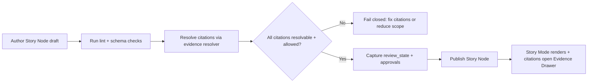

<!-- [KFM_META_BLOCK_V2]
doc_id: kfm://doc/5d73b8bf-0f4f-4c19-8b2a-c1b8a7d3e6d1
title: Story Context
type: standard
version: v1
status: draft
owners: TBD
created: 2026-03-01
updated: 2026-03-01
policy_label: public
related:
  - TODO: ../README.md
  - TODO: ../../../../contracts/schemas/story_node_v3.schema.json
  - TODO: ../../../../apps/ui (Story Mode renderer)
tags: [kfm, domains, contexts, story]
notes:
  - This directory documents the Story context: Story Nodes, publishing gates, and UI trust surfaces.
  - It does not publish “live stories” itself; it defines the contract and authoring rules.
[/KFM_META_BLOCK_V2] -->

# Story Context
**Purpose:** Define the *governed* Story system in KFM: Story Nodes, their evidence/citation rules, map-state replay, and publishing gates.


**Quick links:**  
[Purpose](#purpose) • [What belongs here](#what-belongs-here) • [Core invariants](#core-invariants) • [Story Node v3 contract](#story-node-v3-contract) • [Publishing gate](#publishing-gate) • [Directory layout](#directory-layout) • [Verification checklist](#verification-checklist)

---

## Purpose

KFM Stories are not “blog posts with links.” They are *governed narrative artifacts* that:

- bind narrative text to **map state** (so the story replays the same view), and
- bind factual claims to **resolvable citations** (EvidenceRefs that resolve to EvidenceBundles),
- enforce **policy + redaction obligations** at publish-time and at read-time.

> NOTE  
> In KFM language, “Story publishing” is a governed event: if citations don’t resolve (or rights/policy is unclear), publishing must fail closed.

---

## What belongs here

This folder is documentation for the Story *context* (contracts + governance + templates).

### Acceptable inputs

- Story Node authoring guidance (how to write claims, how to cite, how to avoid policy leakage)
- Story Node v3 templates (markdown skeleton + sidecar JSON structure)
- Publishing gate checklists (what must pass before a story can be published)
- UI “trust surface” requirements for Story Mode (Evidence Drawer hooks, policy notices, version labels)
- ADR links related to Story Node versioning / migrations / publishing workflow (if used in this repo)

### Exclusions

- ❌ Production dataset artifacts (belong in the data lifecycle zones)
- ❌ Private/sensitive story drafts containing restricted coordinates or unreleased evidence
- ❌ UI implementation code (belongs in `apps/ui` or equivalent)
- ❌ API implementation code (belongs in `apps/api` or equivalent)

If you are unsure where something belongs, default to: **docs here, governed artifacts elsewhere.**

---

## Core invariants

Use these tags in this directory to avoid accidental overreach:

- **CONFIRMED:** A requirement/invariant enforced (or intended to be enforced) by the KFM trust membrane + publishing gates.
- **PROPOSED:** An implementation default that can change (components, filenames, UI structure).
- **UNKNOWN:** Repo-specific details not verified in the current checkout.

### CONFIRMED invariants for Story

1. **Citations are resolvable EvidenceRefs, not raw URLs.**
2. **Story Nodes carry replayable map state** (bbox/zoom/layers/time window/filters).
3. **Publishing is blocked if any citation fails to resolve** for the publishing principal.
4. **Citations must open the Evidence Drawer** (or equivalent trust surface) in Story Mode.
5. **Policy labels + obligations are first-class UI surfaces** (users must see when geometry is generalized, etc.).

---

## Story Node v3 contract

A Story Node is a paired artifact:

| Artifact | Role | Notes |
|---|---|---|
| `story.md` | Human-readable narrative | Includes KFM MetaBlock + claims + narrative + citations |
| `story.sidecar.json` | Machine-readable envelope | Captures `map_state`, `citations`, `policy_label`, `review_state`, etc. |

### PROPOSED: minimal Story Node files

#### 1) Markdown skeleton (`*.md`)

```md
<!-- [KFM_META_BLOCK_V2]
doc_id: kfm://story/<uuid>@v1
title: <Story title>
type: story
version: v3
status: draft
owners: <names/teams>
created: YYYY-MM-DD
updated: YYYY-MM-DD
policy_label: public
related:
  - kfm://dataset/<dataset_slug>@<dataset_version_id>
tags: [kfm, story]
[/KFM_META_BLOCK_V2] -->

# <Story title>

## Summary
<Scope + time window + what the reader will learn.>

## Claims
1. <Factual claim.> [CITATION: dcat://...]
2. <Factual claim.> [CITATION: stac://...]
3. <Factual claim.> [CITATION: prov://...]

## Narrative
<Full narrative with inline citations.>

## Evidence index
- [CITATION: dcat://...]
- [CITATION: prov://...]
```

#### 2) Sidecar skeleton (`*.sidecar.json`)

```json
{
  "kfm_story_node_version": "v3",
  "story_id": "kfm://story/<uuid>",
  "version_id": "v1",
  "status": "draft",
  "policy_label": "public",
  "review_state": "needs_review",
  "map_state": {
    "bbox": [-102.0, 36.9, -94.6, 40.0],
    "zoom": 6,
    "layers": [
      { "layer_id": "<layer>", "dataset_version_id": "<dataset_version_id>" }
    ],
    "time_window": { "start": "YYYY-MM-DD", "end": "YYYY-MM-DD" },
    "filters": {}
  },
  "citations": [
    { "ref": "dcat://<dataset>@<dataset_version_id>", "kind": "dcat" },
    { "ref": "prov://run/<run_id>", "kind": "prov" }
  ]
}
```

> TIP  
> Keep `map_state` minimal and stable. It should replay a view, not encode entire UI state.

---

## Publishing gate

Publishing is a governance boundary. Treat it like a promotion contract for narrative.

### MUST pass before publish

- [ ] `review_state` is present and indicates approval status
- [ ] **Every** citation resolves via the evidence resolver endpoint
- [ ] Policy label is set (`public`, `restricted`, etc.) and any obligations are satisfied
- [ ] Map state is present and valid (bbox, layers, time window at minimum)
- [ ] Links / citation tags pass link-check + schema validation
- [ ] Story Mode rendering is safe (sanitized markdown; no script injection)
- [ ] Evidence Drawer is reachable from every citation

### Minimal publish flow



---

## UI trust surfaces for Story Mode

Story Mode is a governed client surface. It must make trust visible.

Minimum UX hooks:

- **StoryNodeReader** renders markdown safely and wires citation clicks to open Evidence Drawer
- **Evidence Drawer** shows:
  - Evidence bundle digest/ID
  - DatasetVersion ID
  - License + attribution
  - Freshness/validation status
  - Provenance chain (run receipt link)
  - Redactions applied (obligations)

---

## Directory layout

> UNKNOWN: the actual checked-in contents of this directory may differ.  
> This is the **expected** layout for a Story context docs folder.

```text
docs/domains/contexts/story/
  README.md                       # this document
  templates/
    story-node-v3.md              # author copy/paste starter
    story-node-v3.sidecar.json    # author copy/paste starter
  checklists/
    publish-gate.md               # “Definition of Done” for Story publishing
    accessibility.md              # keyboard nav, ARIA, safe markdown, etc.
  adr/
    ADR-XXXX-story-node-versioning.md
    ADR-XXXX-story-publish-gate.md
```

---

## Verification checklist

If you need to convert UNKNOWN → CONFIRMED for this repo:

- [ ] Capture repo commit + directory tree (root + `docs/domains/contexts/story/`)
- [ ] Locate the actual Story Node schema file (v3) and link it above
- [ ] Locate the story publish gate implementation (API route + CI check) and link it above
- [ ] Confirm the evidence resolver endpoint path and error model
- [ ] Confirm where “published stories” live (data zone vs docs) and add a “See also” link

---

## See also

- TODO: `docs/domains/contexts/focus/` (Focus Mode cite-or-abstain)
- TODO: `docs/domains/contexts/evidence/` (EvidenceRef/EvidenceBundle)
- TODO: `docs/domains/contexts/map/` (Map state + time controls)

---

<a id="top"></a>
**Back to top:** [Story Context](#story-context)
