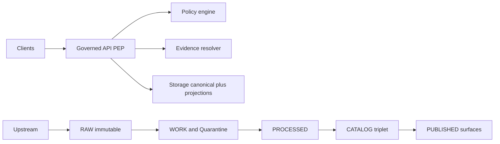

<!-- [KFM_META_BLOCK_V2]
doc_id: kfm://doc/4e7d5f3f-0d8e-4a5d-90c5-2f41aa79aa5e
title: Core Domain (docs/domains/core)
type: standard
version: v1
status: draft
owners: KFM Core Maintainers (TODO)
created: 2026-03-01
updated: 2026-03-01
policy_label: public
related:
  - kfm://doc/kfm-gdg-2026-02-20
  - kfm://doc/kfm-pipeline-tooling-2026-02-27
tags: [kfm, domain, core]
notes:
  - This is a governed domain note: requirements are evidence-backed; implementation details are marked PROPOSED/UNKNOWN.
[/KFM_META_BLOCK_V2] -->

# Core Domain (docs/domains/core)
**Purpose:** define the *shared* concepts and invariants that everything else in KFM depends on: identity, time, evidence, policy labels, provenance, and the promotion/trust boundaries.

[](#)
[](#)
[](#)
[](#)

> [!IMPORTANT]
> This directory is **about semantics and contracts**, not implementation. If you need to document a specific service, pipeline, or UI component, place that in the relevant domain/service docs.

## Quick nav
- [What lives here](#what-lives-here)
- [Non-negotiable invariants](#non-negotiable-invariants)
- [Core concepts](#core-concepts)
- [Directory layout](#directory-layout)
- [How to change the core domain](#how-to-change-the-core-domain)
- [Exclusions](#exclusions)

---

## What lives here
This folder is the home for:
- **Definitions** (Dataset, DatasetVersion, Artifact, EvidenceRef/EvidenceBundle, Story Nodes, policy labels, run receipts).
- **Invariants** that must remain true regardless of implementation (truth path, trust membrane, cite-or-abstain).
- **Contracts** (schemas, naming, hashing rules) that other modules import rather than re-define.

Where it fits in the repo (conceptual):
- **docs/** is the canonical place for governed design notes, templates, ADRs, and runbooks. *(Repo paths are illustrative unless confirmed in the live tree.)*

---

## Non-negotiable invariants
These are **requirements**; treat them as “tests must enforce this”.

| Invariant | Status | What it means | Enforced by |
|---|---|---|---|
| Truth path zones | CONFIRMED | Data moves through zones: Upstream → RAW → WORK/QUARANTINE → PROCESSED → CATALOG/TRIPLET → PUBLISHED | CI promotion gates + runtime guards |
| Promotion Contract | CONFIRMED | Promotion is **blocked** unless required artifacts + validations exist (identity, rights, sensitivity, catalogs, QA, receipts, etc.) | CI gates + steward sign-off |
| Trust membrane | CONFIRMED | Clients never access storage directly; all access is policy-evaluated at the governed API (PEP) | Architecture tests + policy tests |
| Cite-or-abstain Focus Mode | CONFIRMED | Answers must cite resolvable evidence bundles or abstain; citation verification is a hard gate; every query emits a receipt | API contract + evidence verifier |

### Concept map (Mermaid)


---

## Core concepts
> The concrete field lists and DTO shapes are **PROPOSED** until confirmed by schemas in the repo.

### Identity and versioning (Dataset, DatasetVersion)
- **Dataset**: stable identity for a logical source (a “thing we publish”).
- **DatasetVersion**: an immutable version snapshot tied to specific artifacts + catalogs + receipts.

**Rule of thumb:** if the bytes or the policy label changes, it’s a **new DatasetVersion**.

### Artifacts
An **Artifact** is a stored blob (file/object) plus its digest and minimal metadata. Artifacts are:
- immutable in RAW and PROCESSED zones
- referenced by catalogs (STAC/DCAT) and provenance (PROV)

### EvidenceRef and EvidenceBundle
- **EvidenceRef**: a stable pointer to evidence (dataset version + specific artifact or excerpt).
- **EvidenceBundle**: a resolved set of EvidenceRefs plus redactions/obligations, suitable for citation.

### Policy labels and obligations
Policy is not a “toggle”—it is a label plus concrete obligations (e.g., redact fields, generalize geometry, deny access).

### Time
Core time semantics should explicitly separate:
- **event time** (when it happened),
- **valid time** (when it is true about the world),
- **transaction time** (when we recorded/ingested it).
*(Time model details are PROPOSED until the repo has a canonical schema.)*

### Run receipts (audit)
Every acquisition, transform, promotion, and Focus Mode answer produces a **run receipt** sufficient to reproduce the result and justify policy decisions.

---

## Directory layout
This README documents **docs/domains/core/**.

Expected contents (PROPOSED starter layout):
```text
docs/domains/core/
  README.md                # you are here
  concepts.md              # optional: longer narrative definitions
  schemas/                 # optional: JSON Schema / examples for core DTOs
  adr/                     # optional: small, scoped design decisions
  examples/                # optional: minimal fixtures for tests and docs
```

---

## How to change the core domain
Make changes *small* and *reversible*:

1. **Add/adjust a concept** (definition, rule, or invariant).
2. **Update/introduce schema** (if the repo has schema validation).
3. **Add tests** that fail closed (golden hashes, promotion gate checks, evidence resolution tests).
4. **Write an ADR** for anything that changes a contract or breaks compatibility.

Minimum verification steps (commands are PROPOSED; adapt to repo tooling):
- Run unit tests and policy tests.
- Run schema validation for core DTOs and catalogs.
- Run a “promotion dry-run” to confirm gates still block bad inputs.

---

## Exclusions
Do **not** put the following here:
- implementation details for a specific connector/pipeline (belongs in that domain)
- UI component specs (belongs in UI docs)
- dataset-specific QA rules (belongs with the dataset spec)

---

<details>
<summary>Appendix: “core domain” checklist (copy/paste)</summary>

- [ ] Definitions updated (and terminology consistent)
- [ ] Backward compatibility assessed (or migration documented)
- [ ] Schemas updated (if applicable)
- [ ] Tests added/updated (fail closed)
- [ ] Links validated (no broken relative links)
- [ ] ADR added for contract changes

</details>

## References
- KFM — Definitive Design & Governance Guide (vNext, 2026-02-20)
- Tooling the KFM pipeline (2026-02-27)
- MARKDOWN_GUIDE_v13 (repo documentation map)

<p align="right"><a href="#core-domain-docsdomainscore">Back to top</a></p>
