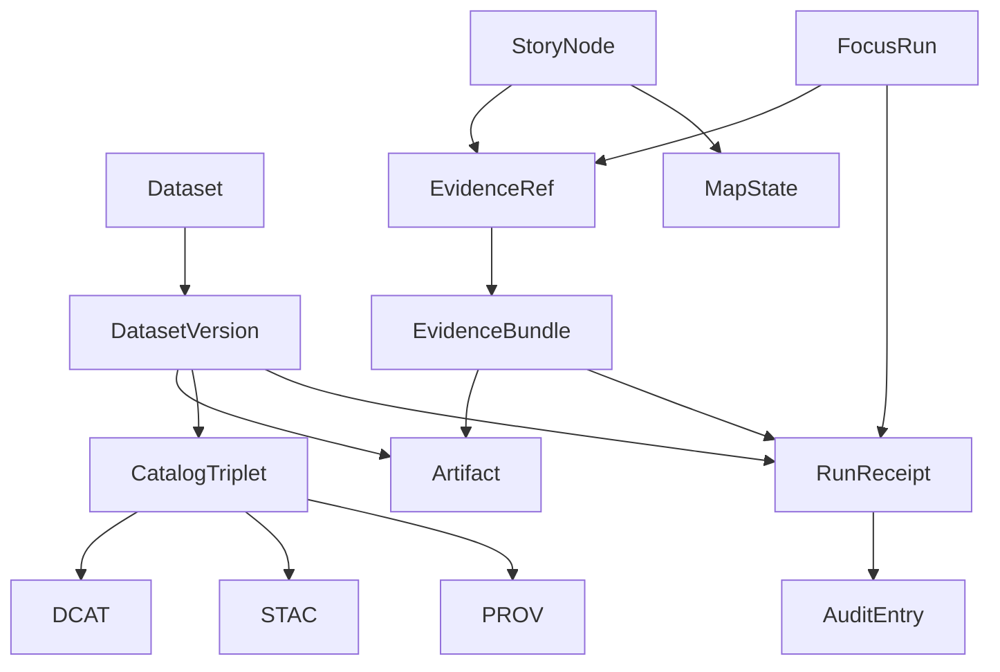

<!-- [KFM_META_BLOCK_V2]
doc_id: kfm://doc/2aaf6a0d-5a3e-4a3a-bb9d-8b55b707c0f6
title: Core Domain Entities
type: standard
version: v1
status: draft
owners: TBD
created: 2026-03-01
updated: 2026-03-01
policy_label: public
related:
  - docs/domains/core/README.md
  - docs/governance/policy-labels.md
  - docs/governance/promotion-contract.md
  - contracts/openapi/
tags: [kfm, domain, entities, governance, evidence]
notes:
  - This is the canonical glossary + invariants for domain entities used across pipelines, catalogs, APIs, UI, Story Nodes, and Focus Mode.
  - Keep this doc implementation-agnostic; link to schemas/contracts where available.
[/KFM_META_BLOCK_V2] -->

# Core domain entities
Domain glossary + invariants for KFM’s governed truth path, catalogs, evidence, stories, and Focus Mode.


**Owners:** TBD (Core maintainers + Governance stewards)  
**Last updated:** 2026-03-01  
**Scope:** Entity semantics & invariants (not storage or API wiring)

---

## Quick navigation
- [Purpose and fit](#purpose-and-fit)
- [Entity map](#entity-map)
- [Entity registry](#entity-registry)
- [Identifiers and determinism](#identifiers-and-determinism)
- [Truth path zones](#truth-path-zones)
- [Promotion gates](#promotion-gates)
- [Entity definitions](#entity-definitions)
- [Controlled vocabularies](#controlled-vocabularies)
- [CI invariants checklist](#ci-invariants-checklist)
- [Appendix](#appendix)

---

## Purpose and fit

### Purpose
This doc defines the **core domain entities** that make KFM *governable and auditable*: datasets + versions, artifacts, catalogs/provenance, evidence resolution, policy labels/obligations, run receipts/audit entries, Story Nodes, and Focus Mode runs.

### Where it fits in the repo
This file belongs in the **Domain layer documentation**:
- it describes “what exists” and “what must always be true”
- it avoids “how we implemented it” (adapters, DB schema, storage paths)

### Acceptable inputs
✅ Add/modify entities when you introduce new contract surfaces (catalogs, receipts, evidence payloads)  
✅ Tighten invariants when you add CI gates  
✅ Add links to schemas (JSON Schema / OpenAPI / type definitions) once verified

### Exclusions
🚫 Do **not** document storage buckets, DB tables, or k8s manifests here  
🚫 Do **not** list specific package paths unless verified in-repo  
🚫 Do **not** weaken fail-closed semantics “for convenience”

---

## Entity map



> NOTE: The model emphasizes **contract surfaces** (DCAT/STAC/PROV + EvidenceBundle + receipts) because they are how trust is made inspectable.

---

## Entity registry

| Entity | Kind | Primary identity | Source-of-truth surface | Why it exists |
|---|---|---|---|---|
| `Dataset` | Aggregate root | `dataset_id` | DCAT dataset record | Human concept of “a dataset family” |
| `DatasetVersion` | Aggregate root | `dataset_version_id` (+ `dataset_id`) | DCAT/STAC + receipts | Unit of promotion, audit, rollback |
| `Artifact` | Value object | `digest` (content hash) | STAC assets + receipts | Immutable, verifiable outputs |
| `CatalogTriplet` | Composite | `dataset_version_id` | DCAT + STAC + PROV | Contract between pipelines and runtime |
| `PolicyLabel` | Enum | `policy_label` | Catalogs + policy engine | Classification used to enforce access |
| `Obligation` | Value object | `(type, parameters)` | Policy decisions + EvidenceBundle | Required transforms/notices/redactions |
| `EvidenceRef` | Value object | `ref` string | Story/Focus citations | Non-URL citation pointer (resolvable) |
| `EvidenceBundle` | DTO | `bundle_id` | Evidence resolver output | Inspect/reproduce claims with policy applied |
| `RunReceipt` | Record | `run_id` | PROV + receipt store | What ran, on what inputs, with what hashes |
| `AuditEntry` | Record | `audit_ref` | Audit ledger | Append-only accountability trail |
| `StoryNode` | Aggregate root | `story_id` (TBD) | Story store + citations | Narrative + map state + citations (governed publish) |
| `MapState` | Value object | `state_hash` (TBD) | Story sidecar | Rebuildable map configuration capture |
| `FocusRun` | Record | `focus_run_id` (TBD) | RunReceipt + output record | Governed Q&A run with citations + receipt |

> TODO: Replace “TBD” identifiers with confirmed formats once the schema/contract is located.

---

## Identifiers and determinism

KFM relies on deterministic IDs and digests so that:
- promotions are reviewable and reversible
- citations resolve without guessing
- audit trails can be verified independently

**Non-negotiable patterns**
- Prefer **content digests** (`sha256:...`) for artifacts over mutable paths.
- Treat `dataset_version_id` as the **unit of publishing** and the join key across DCAT/STAC/PROV, receipts, and evidence bundles.
- Keep “what changed” expressible as diffs between dataset versions (not raw storage diffs).

---

## Truth path zones

KFM’s lifecycle is implemented as **zones + gates** (not a metaphor):

| Zone | Definition | Typical contents |
|---|---|---|
| `RAW` | Immutable acquisition snapshot; append-only | upstream payloads, terms snapshot, checksums |
| `WORK` / `QUARANTINE` | Intermediate transforms + QA; failures isolated | normalization outputs, QA reports, candidate redactions |
| `PROCESSED` | Publishable, standardized artifacts | GeoParquet/COG/PMTiles, derived metadata, checksums |
| `CATALOG` (Triplet) | Cross-linked metadata + lineage | DCAT dataset, STAC collections/items/assets, PROV bundle |
| `PUBLISHED` | Governed runtime surfaces only | API/UI responses, policy-safe tiles, story pages |

---

## Promotion gates

A `DatasetVersion` MUST NOT be promoted unless minimum gates pass (fail closed).

| Gate | What must be present | Typical automated check |
|---|---|---|
| A — Identity and versioning | `dataset_id`, `dataset_version_id`, deterministic spec hash, content digests | schema validation + digest verification |
| B — Licensing and rights | license/rights fields + terms snapshot | fail if missing/unknown |
| C — Sensitivity and redaction plan | `policy_label` + obligations when needed | policy tests + obligation checks |
| D — Catalog triplet validation | DCAT/STAC/PROV validate and cross-link | validators + link checker |
| E — QA thresholds | dataset-specific QA rules + results | block if thresholds not met |
| F — Run receipt and audit record | receipt captures inputs/tools/hashes/policy decisions + audit entry | receipt schema validation |
| G — Release manifest | promotion recorded referencing digests | manifest exists + refs match |

---

## Entity definitions

### Dataset
**Definition:** Stable “dataset family” concept; owns human description, publisher context, and thematic classification.

**Key fields (minimum intent):**
- `dataset_id`
- title/description/publisher (DCAT)
- policy defaults (may be overridden per-version)

**Invariants**
- A `Dataset` has 0..N `DatasetVersion`s.
- A dataset **must not** be discoverable for users who are not authorized to even see metadata (policy-dependent).

---

### DatasetVersion
**Definition:** A specific publishable version of a dataset (the **unit of promotion**). It is what users actually query, map, cite, and audit.

**Key fields (minimum intent):**
- `dataset_version_id`
- `dataset_id`
- `policy_label`
- links to `CatalogTriplet` + `RunReceipt`
- references to `Artifact`s (digests)

**Invariants**
- Every `DatasetVersion` promoted to runtime MUST have:
  - processed artifacts with digests
  - validated catalog triplet
  - run receipt + audit reference
  - an explicit `policy_label`

---

### Artifact
**Definition:** An immutable asset (file/object) referenced by digest, with a media type and location (href) appropriate to the policy context.

**Key fields (minimum intent):**
- `digest` (sha256)
- `media_type`
- `href` (may be suppressed/redacted if policy denies)
- `zone` (raw/work/processed/catalog/published)

**Invariants**
- Artifacts MUST be referencable by digest in at least one contract surface (STAC/receipt).
- Transforms MUST NOT mutate inputs; they produce new artifacts with new digests.

---

### CatalogTriplet
**Definition:** The canonical interoperability + evidence surface comprising DCAT, STAC, and PROV.

#### DCAT
Answers: what dataset is this, who published it, what is the license, what distributions exist.

#### STAC
Answers: what spatiotemporal assets exist, their extents, and where the assets live (href + checksum).

#### PROV
Answers: how outputs were generated (activities, inputs, tools, parameters), and includes policy decision references.

**Cross-linking (must be testable)**
- DCAT dataset → distributions → artifact digests
- DCAT dataset → `prov:wasGeneratedBy` → PROV activity bundle
- STAC collection → link to DCAT dataset record
- STAC item → link to PROV activity and/or run receipt

---

### PolicyLabel
**Definition:** Controlled classification used to enforce access and shaping (redaction/generalization) obligations.

**Invariants**
- Default-deny posture MUST exist for restricted/sensitive classifications.
- If public representation is allowed for sensitive sources, it SHOULD be a separate generalized dataset version.

---

### Obligation
**Definition:** A required action triggered by policy, e.g. generalize geometry, remove fields, show notice.

**Examples**
- `generalize_geometry` (parameters: tolerance, method)
- `remove_fields` (parameters: field list)
- `show_notice` (parameters: message)

**Invariants**
- If obligations are returned, they MUST be recorded and visible in EvidenceBundle and/or UI notices (policy-safe).

---

### EvidenceRef
**Definition:** The only allowed “citation primitive” for governed narrative and Focus Mode. A citation is **not** a pasted URL.

**Key ideas**
- EvidenceRefs MUST resolve into policy-allowed EvidenceBundles.
- If an EvidenceRef cannot be resolved, systems MUST abstain or reduce scope (fail closed).

> TIP: treat `EvidenceRef` as a *pointer into the catalog + provenance graph*, not as an external hyperlink.

---

### EvidenceBundle
**Definition:** Evidence resolver output that packages:
- human renderable “card”
- machine metadata (JSON)
- artifacts (policy-allowed only)
- digests + dataset_version IDs
- provenance links + audit reference

**Example (shape only; fields may evolve):**
```json
{
  "bundle_id": "sha256:bundle...",
  "dataset_version_id": "2026-02.abcd1234",
  "title": "Storm event record: 2026-02-19",
  "policy": {
    "decision": "allow",
    "policy_label": "public",
    "obligations_applied": []
  },
  "license": {"spdx": "CC-BY-4.0", "attribution": "Source org"},
  "provenance": {"run_id": "kfm://run/2026-02-20T12:00:00Z.abcd"},
  "artifacts": [
    {"href": "processed/events.parquet", "digest": "sha256:2222", "media_type": "application/x-parquet"}
  ],
  "checks": {"catalog_valid": true, "links_ok": true},
  "audit_ref": "kfm://audit/entry/123"
}
```

**Invariants**
- EvidenceBundle MUST include `dataset_version_id`, policy decision, and audit reference (even for deny).
- EvidenceBundle MUST NOT leak restricted metadata in failure modes (403/404 semantics must be policy-safe).

---

### RunReceipt
**Definition:** A per-run provenance + integrity record capturing:
- inputs (upstream IDs, raw digests)
- tools/environment (container digest, git commit, parameters)
- outputs (artifact digests)
- policy decisions applied (labels + obligations)
- QA outcomes and threshold checks
- audit entry linkage

**Invariants**
- Receipts are append-only records and must be verifiable.
- Receipts MUST exist for any published dataset version (promotion gate).

---

### AuditEntry
**Definition:** Append-only ledger record of a governed action (promotion, story publish, focus run), referenced by `audit_ref`.

**Invariants**
- Every governed output MUST have an audit reference.
- Retention/access rules are governance-controlled (not ad-hoc).

---

### StoryNode
**Definition:** A governed narrative object that bundles:
- narrative markdown
- sidecar `MapState`
- citations (`EvidenceRef[]`)
- review state (publish is a governed event)

**Invariants**
- Story publishing MUST block if citations do not resolve or rights are unclear.
- Story content MUST respect sensitivity rules (e.g., do not embed precise coordinates unless explicitly allowed).

---

### MapState
**Definition:** Sidecar capture of map configuration so a story can be reproduced:
- layers (dataset_version references)
- time window + filters
- view params (bbox/zoom)
- UI state needed to restore narrative context

**Invariants**
- MapState MUST be rebuildable from governed APIs (never direct storage reads).
- If MapState references restricted layers, StoryNode visibility must be policy-limited.

---

### FocusRun
**Definition:** A Focus Mode request is a governed run:
- policy pre-check
- retrieval
- evidence bundling
- synthesis
- hard citation verification gate
- run receipt + audit entry

**Invariants**
- If citations cannot be verified, the system MUST abstain or reduce scope.
- Focus outputs MUST remain policy-safe (no restricted leakage through text).

---

## Controlled vocabularies

### `policy_label` (starter list)
- `public`
- `public_generalized`
- `restricted`
- `restricted_sensitive_location`
- `internal`
- `embargoed`
- `quarantine`

### `artifact.zone` (starter list)
- `raw`
- `work`
- `processed`
- `catalog`
- `published`

### `citation.kind` (starter list)
- `dcat`
- `stac`
- `prov`
- `doc`
- `graph`
- `url` (discouraged)

> TODO: Link each vocabulary to a versioned YAML/JSON source once confirmed in-repo.

---

## CI invariants checklist

Use this checklist as a “definition of done” for changes touching these entities.

### Identity and hashing
- [ ] Every artifact referenced in catalogs/receipts has a digest.
- [ ] `dataset_version_id` exists everywhere it should (DCAT, STAC, EvidenceBundle, receipts).
- [ ] Link checker ensures all cross-links resolve.

### Policy and safety
- [ ] Default-deny policy fixtures exist and block merges on regression.
- [ ] Evidence resolver fails closed on unresolvable/unauthorized refs.
- [ ] Restricted metadata is not leaked via errors, receipts, or story/focus outputs.

### Evidence and provenance
- [ ] EvidenceBundle includes policy decision + audit reference.
- [ ] RunReceipt exists and validates for promoted versions.
- [ ] PROV contains activities, entities, agents, and environment capture.

---

## Appendix

### Repo tree (this doc’s neighborhood)
> NOTE: This tree is intentionally minimal to avoid inventing repo state.

```text
docs/
  domains/
    core/
      entities.md        # this file
      README.md          # TODO: add a “domain docs index”
```

### Back to top
[Back to top](#core-domain-entities)
