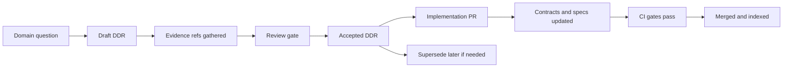

<!-- [KFM_META_BLOCK_V2]
doc_id: kfm://doc/7071c5b6-1976-4973-9582-907097268e00
title: Domain Decisions Registry
type: standard
version: v1
status: draft
owners: TBD
created: 2026-03-01
updated: 2026-03-01
policy_label: public
related:
  - docs/architecture/adr/            # if present
  - docs/adr/                         # if present
  - docs/governance/                  # if present
  - docs/MASTER_GUIDE_v13.md          # if present
tags: [kfm, decisions, domain, governance]
notes:
  - Directory README for Domain Decision Records (DDRs): evidence-backed, reviewable decisions that affect domain semantics and governed outputs.
[/KFM_META_BLOCK_V2] -->

# Domain Decisions

> **Purpose:** Keep a durable, searchable record of *domain-level* decisions (data semantics, dataset onboarding rules, schema/ontology choices, redaction/generalization conventions, and domain-specific interpretation boundaries) **with evidence + rollback plans**.


**Owners:** `TBD` • **Last updated:** `2026-03-01`

---

## Quick navigation

- [What lives here](#what-lives-here)
- [Where this fits in KFM](#where-this-fits-in-kfm)
- [When you must write a DDR](#when-you-must-write-a-ddr)
- [How to write a DDR](#how-to-write-a-ddr)
- [Decision index](#decision-index)
- [Template](#template)
- [Review + governance gates](#review--governance-gates)
- [FAQ](#faq)

---

## What lives here

This directory holds **Domain Decision Records (DDRs)**.

A DDR is a *governed narrative of a decision* about a domain’s data/meaning—not a code comment, not a Slack thread, and not an implementation plan.

✅ **Acceptable inputs / artifacts**
- Decisions about **domain semantics** (definitions, classifications, controlled vocabularies).
- Decisions about **dataset onboarding rules** (source selection criteria, “what counts as authoritative”).
- Decisions that constrain **schemas/contracts** (e.g., required fields, units, CRS handling, time axes choices).
- Decisions about **policy_label / obligations** at the domain layer (what must be generalized/redacted, what must never be exposed).
- Decisions about **evidence standards** for domain claims (what evidence refs are mandatory).
- Decisions about **cross-domain linkage semantics** (entity resolution rules, identifiers, temporal modeling expectations).

🚫 **Exclusions (do NOT put here)**
- Architecture-wide platform decisions → use `docs/architecture/adr/` (or `docs/adr/` if that’s the repo’s canonical ADR home).
- Step-by-step runbooks → use the appropriate `docs/.../runbook` location.
- Raw data, processed data, or catalogs → never store data artifacts here; store them in `data/...` zones and catalogs.
- Uncited interpretation / “storytelling” → that belongs in Story Nodes, not DDRs.
- Secrets / credentials / PII.

---

## Where this fits in KFM

DDRs sit in the “docs” layer and should **link outward** to:
- the **contracts/schemas** they affect,
- the **datasets** they govern (via catalog references or dataset specs),
- and the **PRs/releases** that implemented them.



**Rule of thumb:** if the decision changes what users are allowed to see or what the system claims, it needs a DDR (and possibly an ADR).

---

## Directory layout

> Directory contents are intentionally lightweight: DDRs should be easy to find and hard to lose.

```text
docs/domains/decisions/
  README.md                      # (this file) index + rules
  records/                       # DDR markdown files (recommended)
    DDR-YYYY-MM-DD--slug.md      # one decision per file
```

> **TODO:** If this repo uses a different convention (e.g., `docs/adr/` only), align this folder to the canonical standard and update links.

---

## When you must write a DDR

Create a DDR when you:
- introduce or modify a **domain definition** (e.g., what “fort” means; what counts as a “storm event” in this context),
- change **schema/contract meaning** (units, required fields, ID rules, time modeling),
- adopt a new **dataset source** or deprecate an old one (and it affects published outputs),
- define or change **redaction/generalization rules** for a domain,
- change **evidence requirements** (what must be cited and how),
- change cross-domain linkage rules (IDs, joins, entity resolution, temporal joins).

Create an **Architecture Decision Record (ADR)** *as well* when the change:
- touches **core invariants** (policy enforcement boundary, IDs, catalogs/provenance rules, trust membrane),
- changes system-wide contracts or pipeline ordering.

---

## How to write a DDR

1. **Pick a stable ID + filename**
   - `DDR-YYYY-MM-DD--short-slug.md` (recommended)
   - Keep the `doc_id` stable forever.

2. **State the decision (one sentence)**
   - Be concrete and testable.

3. **Add context**
   - What problem are we solving? What constraint exists (governance, rights, sovereignty, quality)?

4. **List options considered**
   - At least **2** alternatives unless truly impossible.

5. **Record rationale**
   - Why this option? What evidence supports it? What tradeoffs were chosen?

6. **Define consequences**
   - What breaks? What migrations are needed? What is out of scope?

7. **Add a rollback plan**
   - How do we revert safely if the decision is wrong?

8. **Attach verification steps**
   - The *minimum* checks needed to confirm the decision is correctly implemented.

9. **Update the index**
   - Add the DDR to the [Decision index](#decision-index).

---

## Decision index

> Keep this table current. A DDR that isn’t indexed here effectively does not exist.

| DDR ID | Title | Status | Date | Owners | Links |
|---|---|---|---|---|---|
| DDR-YYYY-MM-DD--example | Example decision title | draft | YYYY-MM-DD | @owner | `records/DDR-YYYY-MM-DD--example.md` |

**Status values**
- `draft` → being written / under review
- `accepted` → approved and in force
- `rejected` → explicitly not chosen (kept for history)
- `superseded` → replaced by a newer DDR (must link to replacement)

---

## Template

<details>
<summary><strong>Click to expand: DDR template</strong></summary>

```md
<!-- [KFM_META_BLOCK_V2]
doc_id: kfm://doc/<uuid>
title: DDR-YYYY-MM-DD — <short title>
type: adr
version: v1
status: draft|review|published
owners: <team or names>
created: YYYY-MM-DD
updated: YYYY-MM-DD
policy_label: public|restricted|...
related:
  - <PR link or path>
  - <contracts/schemas/...>
  - <dataset spec / catalog refs>
tags: [kfm, ddr, domain:<name>]
notes:
  - One decision per file. Link from the decisions index.
[/KFM_META_BLOCK_V2] -->

# DDR-YYYY-MM-DD — <short title>

## Decision
<One sentence. Testable.>

## Context
- Problem:
- Constraints (rights, sovereignty, QA, policy):
- Stakeholders:

## Options considered
1. **Option A** — <summary>
2. **Option B** — <summary>
3. (Optional) **Option C** — <summary>

## Rationale
- Evidence refs:
- Why chosen:
- Tradeoffs:

## Consequences
- What changes:
- Migration/compatibility:
- What stays the same:

## Rollback plan
- Trigger for rollback:
- Steps:
- Data implications (rebuild, quarantine, republish):

## Verification
- Minimum checks (CI/tests/manual):
- Links that must resolve:
- Policy checks (default-deny, obligations):
```

</details>

---

## Review + governance gates

### Required in every DDR
- [ ] Decision is **clear + testable**
- [ ] Alternatives considered
- [ ] Evidence refs listed (datasets/catalogs/docs)
- [ ] Policy label implications documented
- [ ] Rollback plan included
- [ ] Verification steps included
- [ ] Linked from this README index

### Required when core invariants are affected
- [ ] Linked ADR exists (architecture scope)
- [ ] Policy implications reviewed (default-deny posture preserved)
- [ ] Contract/schema validation updated (and CI enforces it)
- [ ] Provenance/citation path remains intact (no new “shadow sources”)

---

## FAQ

### Why keep DDRs separate from ADRs?
DDRs are **domain semantics** decisions. ADRs are **system architecture** decisions. Sometimes a change needs both.

### Can I delete a DDR?
No. If it’s wrong, mark it `superseded` or `rejected` and link to the replacement.

### Can a DDR be restricted?
Yes. If it contains sensitive details (e.g., restricted site handling), set `policy_label: restricted` and avoid exposing exact locations or exploit-relevant specifics.

---

## References

- `docs/architecture/adr/` (or `docs/adr/`) — Architecture Decision Records  
- `docs/governance/` — governance + sovereignty policies  
- `docs/templates/` — governed doc templates  
- `docs/MASTER_GUIDE_v13.md` — canonical pipeline + invariants (if present)

<a href="#domain-decisions">Back to top</a>
