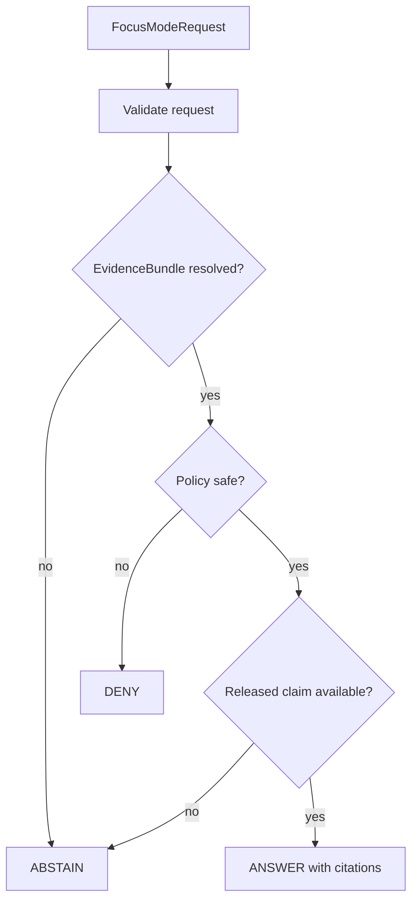

<!-- [KFM_META_BLOCK_V2]
doc_id: kfm://doc/TODO-ecology-focus-mode
title: Ecology Focus Mode
type: standard
version: v1
status: draft
owners: TODO
created: TODO
updated: TODO
policy_label: public
related: [
  docs/domains/ecology/README.md,
  policy/ecology/publication.rego,
  tools/validators/ecology/validate_ecology_bundle.py
]
tags: [kfm, ecology, focus-mode]
notes: [
  NEEDS_VERIFICATION: owners, dates, doc_id
]
[/KFM_META_BLOCK_V2] -->

# Ecology Focus Mode

> Governed question-answer surface for ecology claims using released EvidenceBundles, DecisionEnvelopes, and public-safe ReleaseManifests.

## Impact Block

**Status:** draft  
**Owners:** TODO  
**Policy:** cite-or-abstain / fail-closed  
**Runtime outcomes:** ANSWER | ABSTAIN | DENY | ERROR

## Scope

Ecology Focus Mode answers public-safe ecology questions only when it can resolve:

1. a released or reviewed ecology claim,
2. a valid EvidenceBundle,
3. a compatible DecisionEnvelope,
4. a policy-safe public surface.

## Inputs

- query text
- optional geometry reference
- optional taxon reference
- released claim references
- EvidenceBundle references

## Exclusions

Focus Mode must not:

- read RAW, WORK, or QUARANTINE data
- expose exact sensitive geometry
- treat derived layers as confirmed truth
- answer without evidence
- use AI as a truth source

## Runtime Outcomes

| Outcome | Meaning |
|---|---|
| ANSWER | Evidence resolved and policy allows public-safe response |
| ABSTAIN | Evidence is missing, incomplete, or conflicting |
| DENY | Policy blocks answer |
| ERROR | Runtime or contract failure |

## Flow

## Public Safety Rules

- Public outputs must only reference public-safe or generalized geometry.
- Sensitive exact coordinates must never appear.
- Derived context must be labeled as derived.
- Evidence references must resolve before answering.
