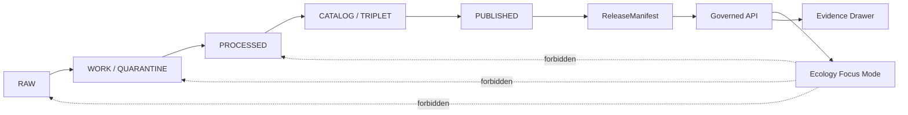
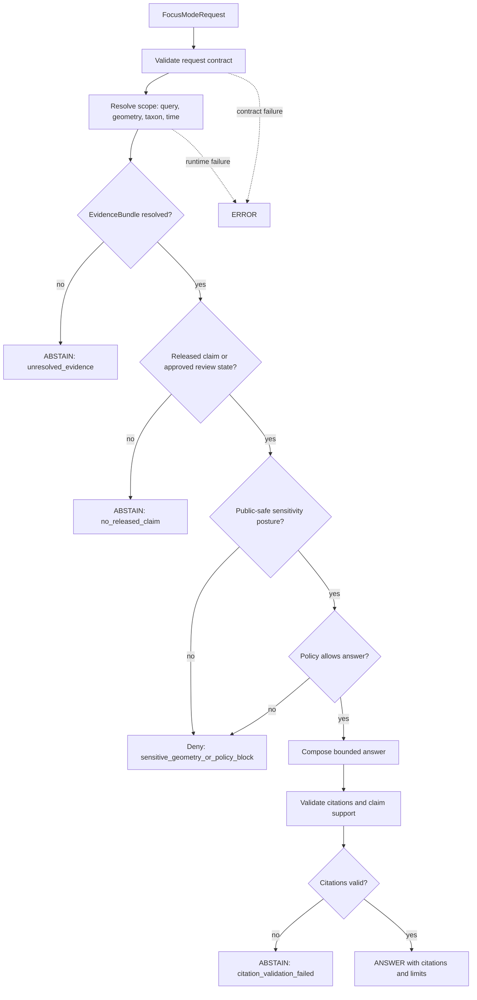

<!-- [KFM_META_BLOCK_V2]
doc_id: kfm://doc/TODO-ecology-focus-mode
title: Ecology Focus Mode
type: standard
version: v1
status: draft
owners: TODO: verify owner
created: TODO: YYYY-MM-DD
updated: TODO: YYYY-MM-DD
policy_label: public
related: [
  docs/domains/ecology/README.md,
  policy/ecology/publication.rego,
  tools/validators/ecology/validate_ecology_bundle.py
]
tags: [kfm, ecology, focus-mode, governed-ai, evidence-bundle, public-safety]
notes: [
  NEEDS_VERIFICATION: owners,
  NEEDS_VERIFICATION: created and updated dates,
  NEEDS_VERIFICATION: doc_id,
  NEEDS_VERIFICATION: final repository path,
  NEEDS_VERIFICATION: related paths exist in current repo
]
[/KFM_META_BLOCK_V2] -->

# Ecology Focus Mode

<p align="center">
  <strong>Governed ecology answers from released evidence — not from raw data, map layers, or model language.</strong>
</p>

<p align="center">
  
  
  
  
  
</p>

<p align="center">
  <a href="#impact-block">Impact</a> ·
  <a href="#scope">Scope</a> ·
  <a href="#repo-fit">Repo fit</a> ·
  <a href="#inputs">Inputs</a> ·
  <a href="#runtime-outcomes">Outcomes</a> ·
  <a href="#validation">Validation</a> ·
  <a href="#definition-of-done">Definition of Done</a>
</p>

> [!IMPORTANT]
> Ecology Focus Mode is a governed public-answer surface. It must resolve released claims, EvidenceBundles, policy decisions, sensitivity posture, and citations before answering. It must not read `RAW`, `WORK`, `QUARANTINE`, unpublished candidate data, direct model output, or derived layers as sovereign truth.

## Impact Block

| Field | Value |
|---|---|
| Status | `draft` |
| Owners | `TODO: verify owner` |
| Evidence mode | `CORPUS_ONLY until current repo evidence verifies implementation` |
| Policy posture | Cite-or-abstain; fail closed on unresolved rights, sensitivity, release state, or exact sensitive geometry |
| Runtime outcomes | `ANSWER` · `ABSTAIN` · `DENY` · `ERROR` |
| Proposed home | `docs/domains/ecology/focus-mode.md` — `NEEDS_VERIFICATION` |
| Related contracts | `EvidenceRef`, `EvidenceBundle`, `DecisionEnvelope`, `PolicyDecision`, `RuntimeResponseEnvelope`, `ReleaseManifest`, `EvidenceDrawerPayload` |
| Related policy | `policy/ecology/publication.rego` — `NEEDS_VERIFICATION` |
| Related validator | `tools/validators/ecology/validate_ecology_bundle.py` — `NEEDS_VERIFICATION` |

## What This Is / Is Not

| Ecology Focus Mode does | Ecology Focus Mode does not |
|---|---|
| Answers public-safe ecology questions from released evidence. | Does not publish new ecology claims. |
| Resolves `EvidenceRef` to `EvidenceBundle` before answering. | Does not read `RAW`, `WORK`, or `QUARANTINE` data. |
| Uses policy and sensitivity gates before public response. | Does not expose exact sensitive geometry. |
| Emits finite runtime outcomes with reason codes. | Does not treat AI output, tiles, summaries, or derived layers as truth. |
| Makes missing evidence visible through `ABSTAIN`. | Does not hide unsupported confidence behind fluent prose. |

## Scope

Ecology Focus Mode answers public-safe ecology questions only when it can resolve all of the following:

1. A released or reviewed ecology claim.
2. A valid `EvidenceBundle`.
3. A compatible `DecisionEnvelope` or `PolicyDecision`.
4. A public-safe geometry posture.
5. A release state that permits the requested answer.
6. Citations that are valid for the answer being made.

Typical ecology question families include:

| Question family | Required posture |
|---|---|
| Habitat presence or classification | Must identify source role, temporal basis, and whether the habitat layer is observed, modeled, interpreted, or derived. |
| Species or taxon context | Must avoid exact sensitive occurrence exposure and use public-safe taxon and geometry references only. |
| Species-habitat relationship | Must distinguish confirmed evidence from modeled suitability, inferred association, or derived context. |
| Conservation or management context | Must cite the source role and avoid treating advisory, model, or summary layers as legal authority. |
| Change over time | Must state temporal scope, evidence date, release date, and uncertainty or freshness limits where available. |

## Repo Fit

This document is intended to sit beside the ecology domain README and support the public-answer layer for ecology claims.

```text
docs/domains/ecology/
  README.md
  focus-mode.md                  # PROPOSED / NEEDS_VERIFICATION

policy/ecology/
  publication.rego               # PROPOSED / NEEDS_VERIFICATION

tools/validators/ecology/
  validate_ecology_bundle.py     # PROPOSED / NEEDS_VERIFICATION
```

> [!WARNING]
> These paths are proposed until verified against the current repository. Do not duplicate schema, policy, or validator authority if the repo already has an accepted home.

## Inputs

Focus Mode may accept:

| Input | Status | Notes |
|---|---:|---|
| `query_text` | required | Natural-language ecology question. |
| `geometry_ref` | optional | Must be public-safe or resolved through a public-safe transform. |
| `taxon_ref` | optional | Must not force disclosure of sensitive occurrence location. |
| `time_scope` | optional | Used to bound evidence, claims, or release date. |
| `claim_refs` | optional | Must point to released or review-approved claims. |
| `evidence_refs` | optional | Must resolve to valid EvidenceBundles before answering. |
| `release_manifest_ref` | optional | Used to verify public-safe release state and correction lineage. |

## Exclusions

Focus Mode must not:

- read `RAW`, `WORK`, or `QUARANTINE` data;
- read unpublished candidate claims;
- query canonical/internal stores directly from the public surface;
- expose exact sensitive geometry;
- expose rare species occurrence locations without public-safe generalization;
- treat derived layers, tiles, indexes, model outputs, summaries, or rendered map views as confirmed truth;
- answer without resolved evidence;
- use AI as a truth source;
- allow direct public client traffic to a model runtime;
- silently answer from stale, superseded, conflicted, or rights-unclear evidence.

## Canonical Lifecycle Boundary

Focus Mode begins after governed release. It does not pull from earlier lifecycle stages.



## Runtime Flow



## Runtime Outcomes

| Outcome | Meaning | Typical reason codes |
|---|---|---|
| `ANSWER` | Evidence resolved, policy allows, release state permits, citations validate, and output is public-safe. | `evidence_resolved`, `policy_allowed`, `citations_valid`, `public_safe_geometry` |
| `ABSTAIN` | Evidence is missing, incomplete, stale, conflicting, unreleased, unsupported, or citation validation fails. | `unresolved_evidence`, `no_released_claim`, `conflicting_sources`, `citation_validation_failed`, `stale_or_superseded_release` |
| `DENY` | Policy blocks the answer or requested output would expose unsafe or unauthorized information. | `sensitive_geometry`, `rights_unclear`, `policy_block`, `exact_occurrence_denied`, `access_not_allowed` |
| `ERROR` | Runtime, contract, resolver, policy-engine, or envelope failure prevents a reliable result. | `invalid_request_contract`, `resolver_failure`, `policy_engine_failure`, `runtime_exception` |

> [!IMPORTANT]
> `ABSTAIN`, `DENY`, and `ERROR` are not secondary UI states. They are first-class trust outcomes and must be visible to users and reviewers.

## Public Safety Rules

Public outputs must:

- reference only public-safe or generalized geometry;
- never include exact sensitive coordinates;
- label derived context as derived;
- label modeled habitat, suitability, or risk surfaces as modeled;
- state temporal scope and evidence freshness when relevant;
- expose source role and review state where available;
- resolve evidence references before answering;
- prefer `ABSTAIN` when evidence is insufficient;
- prefer `DENY` when publication or access is unsafe.

Public outputs must not:

- imply a precise occurrence location from generalized geometry;
- infer sensitive habitat or species presence from an unreleased layer;
- turn “model suggests” into “confirmed”;
- collapse observation, model, interpretation, regulatory status, and public-safe representation into one trust class.

## Contract Expectations

Minimum contract families for Ecology Focus Mode:

| Contract family | Required role |
|---|---|
| `FocusModeRequest` | Carries query text and optional scoped references. |
| `FocusModeResponse` | Wraps finite outcome, answer body, citations, and reason codes. |
| `EvidenceRef` | Points to evidence without embedding raw source material. |
| `EvidenceBundle` | Supplies admissible evidence, source role, temporal scope, spatial scope, citations, and provenance. |
| `DecisionEnvelope` | Carries review, release, and decision posture for the claim. |
| `PolicyDecision` | Records allow, deny, obligations, and policy reason codes. |
| `RuntimeResponseEnvelope` | Standardizes `ANSWER`, `ABSTAIN`, `DENY`, and `ERROR`. |
| `ReleaseManifest` | Confirms released artifacts and public-safe distribution posture. |
| `EvidenceDrawerPayload` | Allows the UI to show evidence, source role, review state, and correction lineage. |
| `RedactionReceipt` or `GeneralizationReceipt` | Records sensitive-geometry transforms when exact geometry is withheld. |

## Response Shape

A Focus response should be inspectable even when it does not answer.

```json
{
  "outcome": "ANSWER | ABSTAIN | DENY | ERROR",
  "query_id": "TODO",
  "answer": {
    "summary": "Public-safe bounded answer or null",
    "limits": ["Known limitations, uncertainty, or temporal bounds"]
  },
  "citations": [
    {
      "evidence_ref": "kfm://evidence/TODO",
      "claim_ref": "kfm://claim/TODO",
      "source_role": "TODO",
      "supports": "TODO"
    }
  ],
  "policy": {
    "decision": "allow | deny | abstain | error",
    "reason_codes": ["TODO"]
  },
  "sensitivity": {
    "public_geometry": "exact_public | generalized | suppressed | none",
    "transform_receipt_ref": "kfm://receipt/TODO"
  },
  "release": {
    "release_manifest_ref": "kfm://release/TODO",
    "review_state": "TODO",
    "correction_state": "current | corrected | superseded | withdrawn | TODO"
  }
}
```

## Evidence Drawer Pairing

Every `ANSWER` should be able to open an Evidence Drawer payload that shows:

- claim or answer title;
- evidence summary;
- source role;
- what the answer is;
- what the answer is not;
- spatial basis;
- temporal basis;
- sensitivity or geometry transform;
- rights and attribution;
- citations;
- review state;
- release state;
- correction or supersession state;
- rollback or withdrawal reference when applicable.

`ABSTAIN`, `DENY`, and `ERROR` should also produce a safe negative-state payload where possible.

## Validation

Minimum validation coverage:

| Validation target | Expected result |
|---|---|
| Missing `EvidenceBundle` | `ABSTAIN` with `unresolved_evidence`. |
| Missing released claim | `ABSTAIN` with `no_released_claim`. |
| Exact sensitive geometry request | `DENY` with `sensitive_geometry` or `exact_occurrence_denied`. |
| Unclear rights or source terms | `DENY` or `ABSTAIN`, depending on policy. |
| Derived layer presented as confirmed truth | Validation failure. |
| Answer without citations | Validation failure or `ABSTAIN`. |
| Invalid request contract | `ERROR`. |
| Direct RAW / WORK / QUARANTINE access attempt | Policy failure. |
| Direct model-client path | Policy failure. |
| Superseded release without correction visibility | Validation failure. |

## Definition of Done

- [ ] Owners, dates, and `doc_id` are verified.
- [ ] Repository path is verified.
- [ ] Related docs, policy file, and validator file paths are verified or corrected.
- [ ] `FocusModeRequest` and `FocusModeResponse` contracts exist or are explicitly planned.
- [ ] Evidence resolution is tested with valid and invalid EvidenceRefs.
- [ ] Policy blocks exact sensitive geometry by default.
- [ ] Negative outcomes are tested: `ABSTAIN`, `DENY`, and `ERROR`.
- [ ] Citation validation is required before `ANSWER`.
- [ ] Evidence Drawer payload is available for `ANSWER` and safe negative states.
- [ ] Public responses use released artifacts only.
- [ ] Correction and rollback behavior is documented.

## Rollback and Correction

If Ecology Focus Mode emits an unsafe, unsupported, stale, or incorrect public answer:

1. Withdraw or disable the affected Focus response surface.
2. Preserve the failed `RuntimeResponseEnvelope` and validation context for review if safe.
3. Identify affected `EvidenceBundle`, `ReleaseManifest`, policy decision, and citations.
4. Issue or link a `CorrectionNotice` where public output was affected.
5. Invalidate cached envelopes tied to the affected release or claim.
6. Re-run evidence, policy, sensitivity, and citation validation.
7. Restore only after the corrected release path passes validation.

Focus Mode should cache only response envelopes tied to release and evidence identifiers. It must not become a parallel truth store.

## Open Verification Items

| Item | Status |
|---|---|
| Owner identity | `NEEDS_VERIFICATION` |
| Created / updated dates | `NEEDS_VERIFICATION` |
| Final doc path | `NEEDS_VERIFICATION` |
| Existence of related ecology README | `NEEDS_VERIFICATION` |
| Existence of ecology publication policy | `NEEDS_VERIFICATION` |
| Existence of ecology bundle validator | `NEEDS_VERIFICATION` |
| Exact schema home for Focus contracts | `NEEDS_VERIFICATION` |
| Current implementation of Focus Mode | `UNKNOWN` |
| Current implementation of Evidence Drawer | `UNKNOWN` |
| Current public release workflow | `UNKNOWN` |
