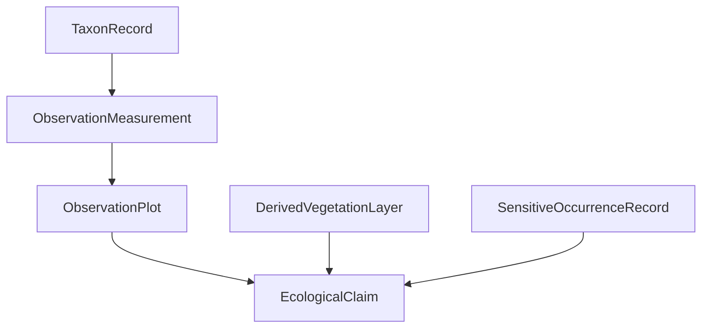

<!-- [KFM_META_BLOCK_V2]
doc_id: kfm://doc/TODO-ecology-readme
title: Ecology Domain — Control Plane (Flora / Fauna)
type: standard
version: v1
status: draft
owners: TODO
created: TODO
updated: TODO
policy_label: public
related: [
  docs/architecture/CONTROL_PLANE_INDEX.md,
  docs/registers/SCHEMA_REGISTRY.md,
  docs/registers/SOURCE_REGISTRY.md,
  docs/registers/VALIDATOR_REGISTRY.md
]
tags: [kfm, ecology, flora, fauna]
notes: [
  NEEDS_VERIFICATION: owners, dates, doc_id
  Derived from KFM doctrine + ecology ingestion plan
]
[/KFM_META_BLOCK_V2] -->

# 🌱 Ecology Domain — Control Plane
> Evidence-first, governed ecological knowledge system for flora, fauna, and vegetation layers.

---

## 🚦 Impact Block

**Status:** 🧪 draft  
**Owners:** TODO  
**Scope:** Flora / Fauna / Vegetation  
**Policy Posture:** Fail-Closed  


### 🔗 Quick Links

- [Scope](#-scope)
- [Repo Fit](#-repo-fit)
- [Source Roles](#-source-roles)
- [Domain Model](#-domain-model)
- [Lifecycle](#-lifecycle)
- [Schemas](#-schemas)
- [Policy](#-policy)
- [Validation](#-validation)
- [Thin Slice](#-thin-slice-definition)
- [File Structure](#-file-structure)
- [Promotion](#-promotion--publication)
- [Rollback](#-rollback--correction)

---

## 🌍 Scope

This domain governs:

- Plant species (flora)
- Future fauna integration
- Vegetation classification and structure
- Ecological observation systems
- Modeled landscape vegetation layers

### ❌ Exclusions

| Domain | Handled By |
|-------|-----------|
| Soil composition | Soil Domain |
| Hydrology | Hydrology Domain |
| Climate | Atmosphere Domain |
| Human land ownership | People / Land Domain |

---

## 🧭 Repo Fit

**Path:**  
`docs/domains/ecology/README.md`

**Upstream Dependencies:**
- contracts / schemas (ecology + core governance)
- source registries
- policy definitions

**Downstream Consumers:**
- governed API (`apps/governed_api`)
- MapLibre layers (public-safe only)
- Focus Mode runtime

---

## 📥 Inputs

This domain accepts:

- federal ecological datasets (USDA, USFS, LANDFIRE)
- observational data (plots, measurements)
- raster vegetation layers
- curated occurrence records (restricted)

---

## 🚫 Exclusions

This domain does **not** accept:

- raw unverified geometry without provenance
- unknown-rights datasets
- AI-generated ecological claims without evidence
- direct user-contributed sightings (until governance defined)

---

## 🧭 Source Roles

| Role | Description | Policy |
|------|------------|--------|
| TAXONOMIC_AUTHORITY | Canonical species naming | Public |
| OBSERVATION_SYSTEM | Field measurements | Restricted until reviewed |
| DERIVED_MODEL_LAYER | Modeled vegetation | Public after labeling |
| SENSITIVE_OCCURRENCE | Rare species locations | Restricted |

---

## 🧱 Domain Model



### Core Objects

| Object | Role |
|------|------|
| TaxonRecord | Canonical species |
| ObservationPlot | Spatial unit |
| ObservationMeasurement | Field data |
| DerivedVegetationLayer | Modeled raster |
| SensitiveOccurrenceRecord | Restricted data |

---

## 🔄 Lifecycle

```text
RAW → WORK → QUARANTINE → PROCESSED → CATALOG → TRIPLET → PUBLISHED
```

### 🚨 Enforcement Rules

- QUARANTINE on:
  - unknown rights
  - sensitive coordinates
  - schema failure
- Promotion = governed decision
- Derived layers remain derived

---

## 📐 Schemas

**Location (NEEDS_VERIFICATION):**
```
schemas/contracts/v1/ecology/
```

### Active Schema Set

| Schema | Status |
|-------|--------|
| taxon_record.schema.json | PROPOSED |
| observation_plot.schema.json | PROPOSED |
| derived_vegetation_layer.schema.json | PROPOSED |
| sensitive_occurrence_record.schema.json | PROPOSED |

---

## 🔐 Policy

### Default: FAIL CLOSED

### ❌ DENY

- exact rare species coordinates (public)
- unknown rights
- derived layer presented as confirmed fact
- missing EvidenceBundle

### ⚠️ ABSTAIN

- unresolved evidence
- conflicting datasets

### ✅ REQUIRE

- EvidenceBundle resolution
- spec_hash stability
- STAC + DCAT + PROV catalog closure
- geoprivacy receipt (if applicable)

---

## 🧪 Validation

**Location (PROPOSED):**
```
tools/validators/ecology/
```

### Validator Responsibilities

- schema validation
- evidence resolution
- policy enforcement
- geometry safety
- spec_hash integrity

---

## 🧬 Thin Slice Definition

### 📍 Geography
- Ellsworth County (initial slice)

### 📊 Data Subset

| Source | Data |
|------|------|
| USDA PLANTS | 5 taxa |
| FIA | 10 plots |
| LANDFIRE | 1 raster tile |

---

### 🎯 Outputs

- EvidenceBundle
- DecisionEnvelope
- EcologicalClaim
- STAC / DCAT / PROV entries
- ReleaseManifest

---

## 📂 File Structure

```text
docs/domains/ecology/
  README.md
  SOURCE_ROLES.md
  SENSITIVITY_AND_GEOPRIVACY.md

data/
  raw/ecology/
  work/ecology/
  quarantine/ecology/
  processed/ecology/
  catalog/
    stac/ecology/
    dcat/ecology/
    prov/ecology/
  triplets/ecology/
  receipts/
  proofs/
  published/ecology/

data/registry/ecology/
  sources.yaml
  datasets.yaml
  sensitivity_policies.yaml
```

---

## 🚀 Promotion & Publication

### Promotion Requirements

- reviewer approval
- policy pass
- EvidenceBundle complete
- catalog closure complete

### Publication Rules

- no restricted geometry leakage
- provenance visible
- derived layers labeled
- receipts included when transformed

---

## 🔁 Rollback & Correction

### Required Artifacts

- CorrectionNotice
- supersession linkage
- rollback reference
- updated ReleaseManifest

### Rule

> Published artifacts are never deleted — only superseded.

---

## 🧩 Task List (Definition of Done)

- [ ] schemas created
- [ ] fixtures added (valid / invalid / policy)
- [ ] validator implemented
- [ ] policy rules enforced
- [ ] thin slice executed (no-network)
- [ ] first ReleaseManifest generated

---

## ⚠️ Open Gaps

| Area | Status |
|------|-------|
| Schema authority path | NEEDS_VERIFICATION |
| Source registry completeness | PROPOSED |
| FIA ingestion pipeline | PROPOSED |
| Geoprivacy transform spec | PROPOSED |
| Focus Mode integration | PROPOSED |

---

## 📌 Summary

The Ecology Domain establishes:

- governed ecological data pipelines  
- strict evidence-first claims  
- policy-controlled publication  
- separation of observation vs model vs sensitive data  

---

🔝 [Back to top](#-ecology-domain--control-plane)
