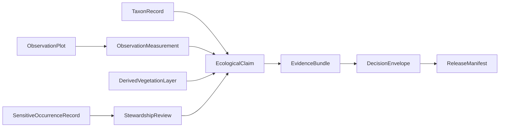
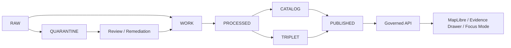
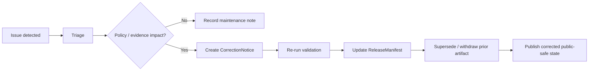

<!-- [KFM_META_BLOCK_V2]
doc_id: TODO: assign kfm://doc/<uuid>
title: Ecology Domain — Control Plane
type: standard
version: v1
status: draft
owners: TODO: verify owner
created: TODO: YYYY-MM-DD
updated: 2026-04-28
policy_label: public
related: [
  TODO: verify docs/architecture/CONTROL_PLANE_INDEX.md,
  TODO: verify docs/registers/SCHEMA_REGISTRY.md,
  TODO: verify docs/registers/SOURCE_REGISTRY.md,
  TODO: verify docs/registers/VALIDATOR_REGISTRY.md
]
tags: [kfm, ecology, flora, fauna, vegetation, evidence, governance]
notes: [
  NEEDS_VERIFICATION: doc_id, owners, created date, related paths, schema home, validator home, source registry home,
  policy_label inherited from the draft and should be checked against the policy registry,
  Current revision is repo-ready guidance; it does not prove current repository implementation.
]
[/KFM_META_BLOCK_V2] -->

# Ecology Domain — Control Plane

<p align="center">
  <strong>Evidence-first ecological knowledge for flora, fauna, vegetation, and public-safe landscape interpretation.</strong><br>
  Kansas Frontier Matrix · map-first · time-aware · governed · cite-or-abstain
</p>

<p align="center">
  
  
  
  
  
  
</p>

<p align="center">
  <a href="#impact-block">Impact</a> ·
  <a href="#scope">Scope</a> ·
  <a href="#repo-fit">Repo fit</a> ·
  <a href="#inputs-and-exclusions">Inputs</a> ·
  <a href="#source-roles">Source roles</a> ·
  <a href="#domain-model">Domain model</a> ·
  <a href="#lifecycle">Lifecycle</a> ·
  <a href="#policy">Policy</a> ·
  <a href="#validation">Validation</a> ·
  <a href="#promotion-and-publication">Promotion</a> ·
  <a href="#rollback-and-correction">Rollback</a>
</p>

> [!IMPORTANT]
> This document is repo-ready domain guidance, not proof of current implementation. Claims about actual files, tests, workflows, routes, source registries, schemas, policies, validators, MapLibre layers, or runtime behavior remain `UNKNOWN` until verified from current repository evidence.

## Impact Block

| Field | Value |
|---|---|
| Status | `draft` |
| Owners | `TODO: verify owner` |
| Evidence mode | `CORPUS_ONLY` + `NO_LOCAL_REPO_EVIDENCE` for implementation claims |
| Policy label | `public` — `NEEDS_VERIFICATION` against the policy registry |
| Domain posture | Cite-or-abstain; fail closed on unresolved rights, sensitivity, review state, or missing EvidenceBundle |
| Proposed repo fit | `docs/domains/ecology/README.md` — `NEEDS_VERIFICATION` |
| Public release posture | No public release unless evidence, policy, catalog closure, review state, and release manifest pass |
| Primary risk | Sensitive occurrence leakage, weak source-role labeling, or derived model layers being presented as confirmed ecological fact |

| What this document does | What it does not do |
|---|---|
| Defines the proposed Ecology domain control plane. | Does not prove current repo files or runtime behavior. |
| Separates flora, fauna, observations, models, and sensitive occurrence records. | Does not authorize live source connectors or public publication. |
| Lists expected source roles, schemas, validators, policy gates, and rollback duties. | Does not replace EvidenceBundle resolution, source-rights review, or steward review. |

## Scope

The Ecology domain governs ecological records and ecological claims that may later support maps, Evidence Drawer payloads, Focus Mode responses, catalog entries, public-safe layers, and review workflows.

### Included

| Area | Governed meaning |
|---|---|
| Flora | Plant taxa, plant observations, plant evidence, and plant-related public-safe claims. |
| Fauna | Future integration point for animal taxa, animal observations, and habitat relationships. |
| Vegetation | Classification, structure, modeled vegetation layers, and landscape context. |
| Observation systems | Plots, field measurements, inventory systems, and measurement provenance. |
| Sensitive occurrence records | Rare, protected, steward-controlled, or otherwise exposure-sensitive ecological records. |
| Derived ecological layers | Modeled or classified products that must remain labeled as derived. |

### Out of scope

| Area | Primary home | Boundary rule |
|---|---|---|
| Soil composition and soil survey interpretation | Soil Domain | Ecology may reference soil context but does not own soil truth. |
| Hydrology, water observations, and flood context | Hydrology Domain | Ecology may link habitat relationships but does not own hydrologic measurements. |
| Climate, air, smoke, and weather context | Atmosphere / Air Domain | Ecology may consume reviewed context but does not publish air or climate claims. |
| Land ownership, genealogy, DNA, and people assertions | People / Land Domain | Ecology must not infer ownership, title, or living-person facts. |
| Archaeological, cultural, or sacred-site location sensitivity | Archaeology / stewardship controls | Ecology must not bypass cultural or steward review controls. |

<p align="right"><a href="#ecology-domain--control-plane">Back to top ↑</a></p>

## Repo Fit

> [!NOTE]
> File paths below are proposed homes. Verify actual repository conventions before committing or wiring implementation.

| Surface | Proposed home | Status |
|---|---|---|
| Domain README | `docs/domains/ecology/README.md` | `PROPOSED` |
| Source roles | `docs/domains/ecology/SOURCE_ROLES.md` | `PROPOSED` |
| Sensitivity and geoprivacy | `docs/domains/ecology/SENSITIVITY_AND_GEOPRIVACY.md` | `PROPOSED` |
| Schema set | `schemas/contracts/v1/ecology/` | `NEEDS_VERIFICATION` |
| Validators | `tools/validators/ecology/` | `PROPOSED` |
| Source registry | `data/registry/ecology/` | `PROPOSED` |
| Public-safe release artifacts | `data/published/ecology/` | `PROPOSED` |

### Upstream dependencies

- Core governance object families: `EvidenceRef`, `EvidenceBundle`, `DecisionEnvelope`, `PolicyDecision`, `ValidationReport`, `ReleaseManifest`, `CorrectionNotice`, and `RollbackPlan`.
- Source registry and source-role decisions.
- Policy registry and sensitivity rules.
- Schema registry and validator registry.
- Catalog closure expectations for STAC, DCAT, and PROV where applicable.

### Downstream consumers

- Governed API surfaces, after policy and release gates.
- MapLibre layers, public-safe only.
- Evidence Drawer payloads.
- Focus Mode runtime envelopes, evidence-bounded only.
- Release manifests, proof packs, and correction/rollback workflows.

<p align="right"><a href="#ecology-domain--control-plane">Back to top ↑</a></p>

## Inputs and Exclusions

### Candidate input families

All live source activation is `NEEDS_VERIFICATION` for rights, endpoint behavior, source-role fit, update cadence, record-level restrictions, and public-release constraints.

| Input family | Example source family | Allowed use before verification | Publication posture |
|---|---|---|---|
| Taxonomic reference | USDA PLANTS, accepted taxonomic lists | Draft source descriptor and fixture design | No public claim until source role and citation rules are verified |
| Field inventory | FIA-style plot or inventory measurements | Synthetic/no-network fixtures only | Restricted until review and sensitivity checks pass |
| Vegetation model layer | LANDFIRE-style classification or raster layer | Derived-layer fixture design | Public only after derived label, uncertainty, and provenance are visible |
| Curated occurrence records | Steward, rare species, or conservation records | Quarantine or restricted review | Public exact geometry denied by default |
| User-contributed sightings | Future community or field submissions | Not accepted yet | Blocked until governance is defined |

### Hard exclusions

- Raw geometry without provenance.
- Unknown-rights datasets.
- AI-generated ecological claims without admissible evidence.
- Direct public access to `RAW`, `WORK`, or `QUARANTINE` material.
- Direct user-contributed sightings until source intake, review, identity, abuse controls, and sensitivity handling are defined.
- Derived model layers presented as confirmed field observation.

> [!CAUTION]
> Exact locations for rare, threatened, protected, nesting, denning, roosting, or steward-controlled records must fail closed. Public products should use suppression, generalization, aggregation, delayed release, or access controls with a recorded redaction/geoprivacy receipt.

<p align="right"><a href="#ecology-domain--control-plane">Back to top ↑</a></p>

## Source Roles

Source roles determine what a source is allowed to prove. A source may be useful without being authoritative for every claim.

| Source role | What it can support | What it cannot support by itself | Default policy posture |
|---|---|---|---|
| `TAXONOMIC_AUTHORITY` | Accepted names, synonyms, taxon identifiers, naming provenance | Occurrence, abundance, habitat condition, or legal status unless explicitly included | Public after citation and source terms pass |
| `OBSERVATION_SYSTEM` | Field measurements, plot observations, survey context | Taxonomic authority, legal status, or public-safe exact release | Restricted until reviewed |
| `DERIVED_MODEL_LAYER` | Modeled vegetation class, modeled landscape context, uncertainty-labeled layer | Confirmed field condition or exact occurrence | Public only when labeled derived |
| `SENSITIVE_OCCURRENCE` | Restricted occurrence evidence under steward rules | Public exact geometry | Restricted / deny public exact coordinates |
| `STEWARDSHIP_REVIEW` | Review decision, access class, release constraint, redaction reason | Primary ecological observation unless tied to evidence | Required when sensitivity is present |

## Domain Model



### Core objects

| Object | Role | Status |
|---|---|---|
| `TaxonRecord` | Canonical or accepted taxon identity, naming basis, and source role linkage. | `PROPOSED` |
| `ObservationPlot` | Spatial and temporal unit for reviewed field observations. | `PROPOSED` |
| `ObservationMeasurement` | Measured attribute with method, time, source, and uncertainty/caveat fields. | `PROPOSED` |
| `DerivedVegetationLayer` | Rebuildable model/classification artifact with derived status and provenance. | `PROPOSED` |
| `SensitiveOccurrenceRecord` | Restricted record requiring geoprivacy, steward review, and access controls. | `PROPOSED` |
| `EcologicalClaim` | Inspectable public or semi-public statement resolving to evidence, policy, review, and release state. | `PROPOSED` |

<p align="right"><a href="#ecology-domain--control-plane">Back to top ↑</a></p>

## Lifecycle

Ecology uses the KFM governed lifecycle. Promotion is a governed state transition, not a file move.



### Enforcement rules

Move to `QUARANTINE` or block promotion when any of the following occurs:

- Rights, source terms, or source role are unknown.
- Sensitive coordinates are present without a public-safe transform or access rule.
- Schema validation fails.
- EvidenceRef cannot resolve to EvidenceBundle.
- Derived products are not labeled as derived.
- Review state is missing for restricted or sensitivity-bearing records.
- Catalog closure is incomplete where publication requires STAC, DCAT, or PROV entries.

## Schemas and Contracts

> [!WARNING]
> Schema authority is `NEEDS_VERIFICATION`. Do not create parallel `contracts/` and `schemas/` homes without an ADR or current repository convention proving the correct location.

| Schema | Purpose | Status |
|---|---|---|
| `taxon_record.schema.json` | Taxon identity, naming source, synonyms, authority, and citation basis. | `PROPOSED` |
| `observation_plot.schema.json` | Plot geometry, method, time span, source, and review fields. | `PROPOSED` |
| `observation_measurement.schema.json` | Measurement values, units, method, uncertainty, and evidence link. | `PROPOSED` |
| `derived_vegetation_layer.schema.json` | Derived layer metadata, model/classification basis, uncertainty, source, and rebuildability. | `PROPOSED` |
| `sensitive_occurrence_record.schema.json` | Restricted occurrence, access class, geoprivacy posture, and steward review requirements. | `PROPOSED` |
| `ecological_claim.schema.json` | Inspectable claim envelope with spatial scope, temporal scope, evidence, policy, review, and release state. | `PROPOSED` |
| `ecology_release_manifest.schema.json` | Release manifest for public-safe ecology artifacts and rollback references. | `PROPOSED` |

<p align="right"><a href="#ecology-domain--control-plane">Back to top ↑</a></p>

## Policy

Default posture: `FAIL_CLOSED`.

### Decision matrix

| Outcome | Trigger | Required handling |
|---|---|---|
| `DENY` | Public exact rare/species-sensitive coordinates; unknown rights; missing EvidenceBundle; unreviewed restricted record. | Block publication and emit a policy decision with reason. |
| `ABSTAIN` | Conflicting evidence, unresolved source authority, unresolved taxonomy, stale or incomplete context. | Return bounded non-answer or require review; do not fabricate certainty. |
| `ALLOW_WITH_TRANSFORM` | Sensitive geometry can be safely generalized, suppressed, aggregated, or delayed. | Record transform, reason, reviewer, and `RedactionReceipt`. |
| `ALLOW` | Evidence resolves, policy passes, review passes, catalog closure passes, and release manifest is complete. | Publish only through governed release surfaces. |

### Required controls

- EvidenceBundle resolution before consequential claims.
- Source role validation before source use.
- `spec_hash` or equivalent stable identity for schemas, derived layers, and release artifacts.
- Redaction/geoprivacy receipts when geometry is transformed.
- Review state for restricted records.
- Catalog closure for release artifacts.
- Finite outcomes for AI/Focus use: `ANSWER`, `ABSTAIN`, `DENY`, `ERROR`.

## Validation

Validation should be offline-first and fixture-driven until source terms and repo conventions are verified.

| Gate | Checks | Negative-path fixture examples |
|---|---|---|
| Schema validation | Required fields, allowed enums, geometry shape, temporal scope, source role. | Missing source role, invalid geometry, invalid temporal range. |
| Evidence resolution | EvidenceRef resolves to EvidenceBundle; citations point to admissible evidence. | Unresolved EvidenceRef, missing EvidenceBundle, stale evidence. |
| Policy enforcement | Rights, sensitivity, review, release, and access posture. | Unknown rights, exact sensitive geometry, missing review state. |
| Derived-layer integrity | Derived label, source lineage, model/classification metadata, rebuildability. | Derived layer presented as confirmed fact. |
| Release readiness | Catalog closure, proof/receipt separation, ReleaseManifest, rollback reference. | Missing manifest, missing rollback path, catalog gap. |

```bash
# Illustrative only — NEEDS VERIFICATION against mounted repo conventions.
python tools/validators/ecology/validate_ecology_fixture.py tests/fixtures/ecology/valid/taxon_record.valid.json
```

<p align="right"><a href="#ecology-domain--control-plane">Back to top ↑</a></p>

## Thin Slice Definition

The first Ecology thin slice should prove the trust path before live source activation or UI polish.

| Element | Proposed slice | Status |
|---|---|---|
| Geography | Ellsworth County, Kansas | `PROPOSED` |
| Taxa | 5 plant taxa from a verified taxonomic source fixture | `PROPOSED` |
| Plots | 10 synthetic or no-network field-observation fixtures | `PROPOSED` |
| Vegetation | 1 derived vegetation raster/tile fixture | `PROPOSED` |
| Sensitive record | 1 restricted occurrence fixture that must deny public exact geometry | `PROPOSED` |

### Expected outputs

- `EvidenceBundle`
- `DecisionEnvelope`
- `PolicyDecision`
- `ValidationReport`
- `EcologicalClaim`
- STAC / DCAT / PROV entries where release requires catalog closure
- `RedactionReceipt` when a geoprivacy transform occurs
- `ReleaseManifest`
- `RollbackPlan`

### Acceptance gates

- [ ] No live network dependency is required for the first proof slice.
- [ ] Valid fixtures pass schema validation.
- [ ] Invalid fixtures fail for clear reasons.
- [ ] Sensitive exact geometry is denied or transformed with receipt.
- [ ] Derived vegetation output is visibly labeled as derived.
- [ ] Every public-facing claim resolves to EvidenceBundle.
- [ ] ReleaseManifest includes rollback reference and correction lineage fields.

## Proposed File Families

<details>
<summary>Expand proposed file and folder layout</summary>

```text
docs/domains/ecology/
  README.md
  SOURCE_ROLES.md
  SENSITIVITY_AND_GEOPRIVACY.md
  VALIDATION.md
  RELEASE_AND_ROLLBACK.md

schemas/contracts/v1/ecology/
  taxon_record.schema.json
  observation_plot.schema.json
  observation_measurement.schema.json
  derived_vegetation_layer.schema.json
  sensitive_occurrence_record.schema.json
  ecological_claim.schema.json
  ecology_release_manifest.schema.json

data/registry/ecology/
  sources.yaml
  datasets.yaml
  sensitivity_policies.yaml

tests/fixtures/ecology/
  valid/
  invalid/
  policy/

tools/validators/ecology/
  validate_ecology_fixture.py
  validate_ecology_policy.py
  validate_ecology_release.py

data/
  raw/ecology/
  work/ecology/
  quarantine/ecology/
  processed/ecology/
  catalog/stac/ecology/
  catalog/dcat/ecology/
  catalog/prov/ecology/
  triplets/ecology/
  receipts/ecology/
  proofs/ecology/
  published/ecology/
```

</details>

> [!NOTE]
> Keep generated artifacts out of canonical source paths unless repository convention explicitly allows them. `raw`, `work`, `quarantine`, `processed`, `published`, `receipts`, and `proofs` should follow the real repo’s data/artifact policy once verified.

<p align="right"><a href="#ecology-domain--control-plane">Back to top ↑</a></p>

## Promotion and Publication

Promotion requires a complete trust path.

### Promotion requirements

- Reviewer approval recorded where required.
- Policy decision is `ALLOW` or `ALLOW_WITH_TRANSFORM`.
- EvidenceBundle is complete and resolvable.
- Schema and validator reports pass.
- Source roles and source rights are verified.
- Catalog closure is complete where required.
- Sensitive geometry is denied, transformed, or access-controlled with receipt.
- ReleaseManifest and rollback reference are present.

### Publication rules

- Public clients use governed APIs and released artifacts only.
- Public map layers must not leak restricted geometry.
- Provenance must be visible at the claim or layer level.
- Derived layers must be labeled as derived.
- AI/Focus Mode may interpret released evidence but must not become proof.
- Receipts, proof packs, catalog records, release manifests, correction notices, and rollback plans remain distinct objects.

## Rollback and Correction

Published artifacts are not silently deleted. They are superseded, withdrawn, corrected, or replaced through governed release state.

### Required correction artifacts

| Artifact | Purpose |
|---|---|
| `CorrectionNotice` | Explains what changed, why, and which claims or artifacts are affected. |
| `RollbackPlan` | Identifies previous safe release state and restoration path. |
| `ReleaseManifest` | Records new release state and supersession linkage. |
| `ValidationReport` | Shows that the corrected release passes required gates. |
| `RedactionReceipt` | Records geometry transform if sensitivity handling changed. |

### Correction flow



<p align="right"><a href="#ecology-domain--control-plane">Back to top ↑</a></p>

## Definition of Done

- [ ] Metadata block placeholders are verified or intentionally left as visible TODOs.
- [ ] Schema home is resolved or ADR is opened.
- [ ] Source roles are documented and registered.
- [ ] Valid, invalid, and policy fixtures exist.
- [ ] Validators cover schema, evidence, policy, geometry safety, and release readiness.
- [ ] Sensitive occurrence exact public geometry is denied by test.
- [ ] Derived model layers are labeled and cannot masquerade as observed fact.
- [ ] Thin slice runs without live network dependency.
- [ ] EvidenceBundle, DecisionEnvelope, PolicyDecision, ValidationReport, ReleaseManifest, and rollback reference are generated or fixture-proven.
- [ ] Documentation links from the control-plane index, schema registry, source registry, and validator registry are updated after paths are verified.

## Open Gaps

| Area | Status | Next action |
|---|---|---|
| Document owner | `TODO` | Verify maintainers or stewardship group. |
| `doc_id` | `TODO` | Assign stable `kfm://doc/<uuid>` or repo-approved identifier. |
| Schema authority path | `NEEDS_VERIFICATION` | Confirm `schemas/contracts/v1/ecology/` versus any repo-specific contract home. |
| Source registry completeness | `PROPOSED` | Add source descriptors only after rights and source roles are reviewed. |
| FIA-style observation pipeline | `PROPOSED` | Keep as no-network fixture until source terms and record restrictions are verified. |
| LANDFIRE-style layer handling | `PROPOSED` | Verify source terms, classification metadata, uncertainty, and attribution. |
| Geoprivacy transform spec | `PROPOSED` | Define suppression/generalization rules and receipts before public release. |
| Focus Mode integration | `PROPOSED` | Require governed API, evidence resolution, citation validation, and finite outcomes. |
| CI / workflow badge | `NEEDS_VERIFICATION` | Do not add real workflow badges until current workflow names are verified. |

## Summary

The Ecology Domain control plane defines how ecological data becomes KFM-ready: sourced, role-labeled, evidence-bound, policy-checked, reviewable, releasable, correctable, and safe to interpret on maps or in governed AI surfaces.

The key rule is simple: ecological outputs may be useful, beautiful, and map-ready, but they are not authoritative unless the claim can be reconstructed to evidence, source role, spatial scope, temporal scope, policy posture, review state, release state, and correction lineage.

<p align="right"><a href="#ecology-domain--control-plane">Back to top ↑</a></p>
