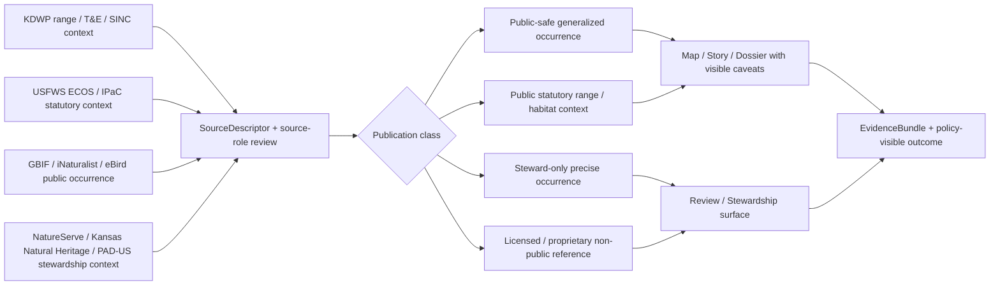

<!-- [KFM_META_BLOCK_V2]
doc_id: kfm://doc/NEEDS-VERIFICATION
title: Ecology Domain
type: standard
version: v1
status: draft
owners: NEEDS VERIFICATION
created: YYYY-MM-DD
updated: YYYY-MM-DD
policy_label: NEEDS VERIFICATION
related: [NEEDS-VERIFICATION]
tags: [kfm, ecology, biodiversity, flora, pollinators, wildlife, protected-areas]
notes: [Current-session workspace evidence was PDF-only; replace placeholders after mounted repo verification.]
[/KFM_META_BLOCK_V2] -->

# Ecology Domain

Kansas ecology and biodiversity lane for governed intake, publication, and routing across species, habitats, pollinators, wildlife, and protected-area context.

> [!NOTE]
> **Status:** experimental  
> **Owners:** NEEDS VERIFICATION  
>     
> **Quick jumps:** [Scope](#scope) · [Repo fit](#repo-fit) · [Accepted inputs](#accepted-inputs) · [Exclusions](#exclusions) · [Current verified snapshot](#current-verified-snapshot) · [Quickstart](#quickstart) · [Usage](#usage) · [Diagram](#diagram) · [Source matrix](#source-matrix) · [Publication classes](#publication-classes) · [Definition of done](#task-list--definition-of-done) · [FAQ](#faq)  
> **Repo fit:** `docs/domains/ecology/` → upstream: `docs/domains/README.md` (**INFERRED / NEEDS VERIFICATION**) · downstream: ecology leaf pages in this directory (**UNKNOWN in current session**)

> [!IMPORTANT]
> This directory should function as the **ecology lane**, not as a generic nature scrapbook and not as a flat merge of statutory listings, range maps, open occurrence feeds, protected-area polygons, and precise stewardship records. Those are related, but they are not the same evidence type.

> [!WARNING]
> Current-session workspace verification exposed a PDF-rich evidence corpus only. Actual repo inventory, adjacent ecology leaves, schemas, workflows, validators, and live connector coverage for this lane remain **NEEDS VERIFICATION** until the mounted repository is directly inspected.

## Scope

KFM treats ecology as a Kansas operating lane, not as decorative map content. In this lane, the working burden is to keep species observations, flora, pollinator and entomology sublanes, habitat and migration context, protected areas, and stewardship-sensitive records **evidence-aware, role-aware, and publication-aware**.

This README is therefore centered on four things:

1. what belongs in the lane,
2. what must stay separated,
3. what publication classes the lane should use,
4. what must remain explicit until direct repo verification exists.

## Repo fit

| Path | Role | Relationship |
| --- | --- | --- |
| `docs/domains/ecology/README.md` | this file | ecology lane index and routing surface |
| `docs/domains/README.md` | likely parent domains hub | **INFERRED / NEEDS VERIFICATION** until mounted repo inspection |
| `docs/domains/ecology/*` | ecology leaf pages, source notes, or sublane docs | **UNKNOWN** in current session |
| `docs/analyses/ecology/` | possible analysis owner for implementation-heavy writeups | **PROPOSED / NEEDS VERIFICATION** |
| `docs/standards/` | governance, FAIR+CARE, and sensitivity doctrine | doctrinally relevant, but exact mounted paths remain **NEEDS VERIFICATION** |

## Accepted inputs

Place material here when it is primarily part of the **ecology lane** and still benefits from lane-level routing, policy framing, and publication-boundary clarity.

- statutory and range-context sources for Kansas ecology work
- public occurrence and observational sources for species, flora, wildlife, or pollinator context
- protected-area and stewardship-context layers
- review-sensitive sensitivity or licensing notes that affect ecology publication posture
- source-role notes, source descriptors, publication-class rules, and ecology lane guidance
- short routing docs that move deeper work into narrower leaves once a source, species group, or workflow grows beyond directory-index scope

## Exclusions

Do **not** place the following here:

- default-public exact locations for rare species, rare plants, or other sensitive ecology records
- protected-area polygons presented as proof of species presence
- statutory listing pages flattened into occurrence datasets without source-role separation
- generic agriculture, soils, hazards, climate, or hydrology material that belongs to another lane
- archival or oral-history interpretation that should live under heritage / archives routing
- pipeline maturity claims, live connector inventories, or workflow assertions that current evidence does not verify
- copied dumps of third-party source text where a lane summary or routing note would do the job better

## Status vocabulary used in this directory

| Label | Use here |
| --- | --- |
| **CONFIRMED** | Directly supported by the visible project corpus in the current session |
| **INFERRED** | Small structural completion strongly implied by KFM doctrine and the target path |
| **PROPOSED** | Recommended lane behavior, artifact shape, or next step not yet verified in mounted implementation |
| **UNKNOWN** | Not verified strongly enough in the current session |
| **NEEDS VERIFICATION** | A reviewer flag for ownership, inventory, workflow, or path claims that should be checked before commit |

## Current verified snapshot

| Item | Verified state | Notes |
| --- | --- | --- |
| Ecology is a named Kansas operating lane | **CONFIRMED** | The doctrine explicitly names ecology, biodiversity, flora, pollinators, wildlife, and protected areas as one structural lane |
| Lane coverage | **CONFIRMED** | Species observations, flora, pollinator and entomology sublanes, habitat, migration corridors, and stewardship context belong here |
| Publication burden | **CONFIRMED** | Rare-species and culturally sensitive location exposure may require geoprivacy, generalization, or withholding |
| Ingest backbone emphasis | **CONFIRMED** | Darwin Core / DwC-A remain practical ingest backbones for ecology planning |
| First-wave publication classes | **PROPOSED** | Public-safe generalized occurrence, public statutory range/habitat context, steward-only precise occurrence, and licensed / proprietary non-public reference layers |
| Directory inventory beyond this README path | **UNKNOWN** | Current session did not expose a mounted repo tree for this lane |

That means this README should prioritize **lane structure, source-role separation, publication posture, and cautious routing** over claims about mature implementation.

## Directory tree

```text
docs/
└── domains/
    └── ecology/
        └── README.md
```

> [!TIP]
> Treat any additional ecology leaves, registries, schemas, or workflow files as **NEEDS VERIFICATION** until the mounted repository is directly inspected.

## Quickstart

Start new ecology work by making the source role and publication class explicit **before** you add prose, layers, or downstream summaries.

1. Identify the source family.
2. Declare the source role.
3. Choose the public-surface rule.
4. Record rights, sensitivity, and precision posture.
5. Only then add or revise the ecology leaf or lane note.

Illustrative example only:

```yaml
source_id: ecology.gbif.occurrence
source_role: public_occurrence
public_surface: generalized
precise_surface: steward-only
rights_posture: NEEDS VERIFICATION
sensitivity_rule: review-required-for-precise-geometry
lineage_profiles:
  - STAC
  - DCAT
  - PROV
notes:
  - Do not present this as statutory listing truth.
  - Preserve dataset identity and download provenance.
```

## Usage

### Add an ecology leaf

1. Start with one source family, one species group, or one narrow stewardship question.
2. Keep the page explicit about **source role** and **publication class**.
3. Separate what is **CONFIRMED** from what is **PROPOSED** or **UNKNOWN**.
4. Route implementation-heavy workflow detail into a narrower leaf once the page stops behaving like a directory-level guide.
5. Mark precise-location handling and licensing constraints directly, not in footnotes.

### Update this README

Update this file when any of the following changes:

- the verified ecology file inventory changes
- owners or metadata placeholders are resolved
- source-role guidance becomes sharper through mounted repo evidence
- a stable leaf naming pattern is established for ecology pages
- publication classes, geoprivacy rules, or rights handling become more concrete
- the lane gains enough depth that a registry table or appendix should be expanded

### Working lane rules

| Distinguish | Why it matters |
| --- | --- |
| range map vs. precise occurrence record | A published range context surface is not the same as a precise observation record |
| protected area vs. species presence | Stewardship polygons do not prove that a species occurs there |
| statutory status vs. observational evidence | Listing status and occurrence coverage answer different questions |
| public-safe generalized vs. steward-only precise | Precision is a publication decision, not a cosmetic styling choice |
| open occurrence feed vs. review-sensitive context | Licensing, geoprivacy, and sensitivity obligations do not disappear because a source is useful |

## Diagram



## Source matrix

| Source family | Best use in this lane | Must not be confused with |
| --- | --- | --- |
| **KDWP range maps and T&E / SINC services** | Kansas statutory and published range-context layer | precise occurrence release |
| **USFWS ECOS / IPaC** | federal statutory and critical-habitat anchor | complete biodiversity evidence set |
| **GBIF API / async downloads** | large-scale occurrence harvest with preserved dataset identity | state or federal regulatory truth |
| **iNaturalist / eBird** | public observational context where source identity remains visible | formally reviewed stewardship record by default |
| **NatureServe Explorer / Kansas Natural Heritage context** | review-sensitive taxon, sensitivity, and provider context | default-public precision layer |
| **PAD-US** | protected-area stewardship context | direct occurrence evidence |

## Publication classes

| Class | Intended use | Minimum rule |
| --- | --- | --- |
| **Public-safe generalized occurrence** | Public map, story, or dossier context | Generalize or mask precision where needed; keep source role visible |
| **Public statutory range / habitat context** | Public status, range, or critical-habitat framing | Preserve service identity and do not imply precise occurrence |
| **Steward-only precise occurrence** | Review and stewardship surfaces | Restrict by role; keep exact geometry, obligations, and audit trail explicit |
| **Licensed / proprietary non-public reference** | Internal comparison or steward review only | Do not publish by default; preserve license terms and derivative-use limits |

## Task list / definition of done

- [ ] Meta block placeholders are replaced or consciously retained with review notes
- [ ] Directory inventory matches the mounted repo
- [ ] Source-role separation is explicit for every ecology source family named here
- [ ] Public-safe vs. precise publication classes are stated directly
- [ ] Rare-species / sensitive-location handling is not hidden or implied
- [ ] Protected-area context is not presented as occurrence proof
- [ ] Statutory listings are not flattened into observational coverage
- [ ] Any implementation claims are grounded in mounted repo evidence, not doctrine alone
- [ ] Long reference material stays collapsible and does not drown the scanning path

## FAQ

### Why keep ecology separate from hazards, hydrology, soils, or climate?

Because the lane’s publication burden is different. Ecology work often carries geoprivacy, stewardship, licensing, and sensitive-location concerns that need their own routing and public-surface rules.

### Can this lane publish precise rare-species points by default?

No. The doctrine and atlas both push the lane toward explicit generalization, withholding, or steward-only handling when precision would overexpose sensitive records.

### Are KDWP range maps or ECOS habitat layers enough to prove a species occurs at one exact place?

No. They are crucial context layers, but they are not the same thing as a precise observation record.

### Are protected-area polygons a substitute for occurrence evidence?

No. They support stewardship and context, but they should not be treated as direct evidence that a species is present.

### Can this README claim live pipelines, validators, or source connectors already exist?

Not from the current session. Those remain **UNKNOWN** until the mounted repo, workflows, schemas, and runtime evidence are directly inspected.

## Appendix

<details>
<summary><strong>Proposed first-wave additions once the mounted repo is visible</strong></summary>

### Candidate additions

| Addition | Why it would help | Status |
| --- | --- | --- |
| Ecology source descriptor registry | Makes source roles, cadence, rights, and precision rules explicit | **PROPOSED** |
| Generalized-vs-precise example pair | Proves that the lane can explain why it withholds precision, not just withhold it | **PROPOSED** |
| One KDWP / ECOS range-context leaf | Separates statutory context from occurrence evidence in a reusable way | **PROPOSED** |
| One public occurrence packaging example | Gives maintainers a concrete model for GBIF / iNaturalist / eBird treatment | **PROPOSED** |
| One correction / narrowing example | Preserves lineage if a public ecology surface later needs to be generalized further or withdrawn | **PROPOSED** |

### Illustrative leaf template

```md
# <Ecology source or sublane title>

One-line purpose for this ecology leaf.

## What this page covers
- source family or sublane
- why it matters to KFM
- what publication burden applies

## Source role
- statutory / range context
- public occurrence
- review-sensitive context
- protected-area stewardship context

## Public-surface rule
- public-safe generalized:
- steward-only precise:
- licensed / non-public:

## Local notes
- CONFIRMED:
- INFERRED:
- PROPOSED:
- NEEDS VERIFICATION:
```

</details>

[Back to top](#ecology-domain)
