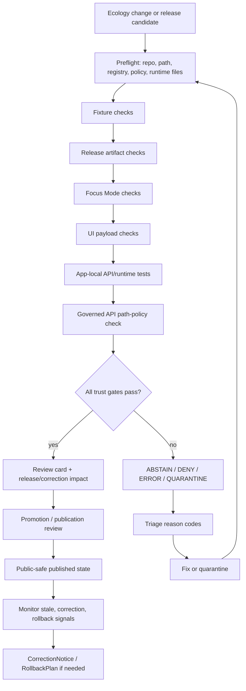
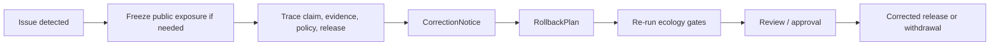

<!-- [KFM_META_BLOCK_V2]
doc_id: kfm://doc/TODO-ecology-runbook
title: Ecology Domain Runbook
type: standard
version: v1
status: draft
owners: TODO: verify ecology steward; current repo fallback references @bartytime4life
created: TODO: YYYY-MM-DD
updated: 2026-05-07
policy_label: public
related: [docs/domains/ecology/README.md, docs/domains/ecology/FOCUS_MODE.md, apps/api/ecology/README.md, tools/validators/ecology/README.md, policy/ecology/publication.rego, docs/adr/ADR-0202-governed-api-path-canonicalization.md]
tags: [kfm, ecology, runbook, evidence, governance, validators, focus-mode, release]
notes: [TODO: replace doc_id and created date after document registry assignment, NEEDS_VERIFICATION: ecology steward owner, NEEDS_VERIFICATION: path reconciliation between apps/api/ecology and apps/governed_api/ecology before claiming runtime checks are green]
[/KFM_META_BLOCK_V2] -->

<a id="top"></a>

# Ecology Domain Runbook

Operator checklist for validating, releasing, explaining, correcting, and rolling back public-safe ecology artifacts.

<p align="center">
  
  
  
  
  
  
</p>

<p align="center">
  <a href="#impact-block">Impact</a> ·
  <a href="#scope">Scope</a> ·
  <a href="#repo-fit">Repo fit</a> ·
  <a href="#accepted-inputs">Inputs</a> ·
  <a href="#exclusions">Exclusions</a> ·
  <a href="#operating-flow">Flow</a> ·
  <a href="#quickstart">Quickstart</a> ·
  <a href="#runbook">Runbook</a> ·
  <a href="#failure-handling">Failures</a> ·
  <a href="#definition-of-done">Definition of done</a>
</p>

> [!IMPORTANT]
> Ecology outputs are not publication-ready because a file exists, a validator returns `PASS`, a map renders, or Focus Mode can generate a sentence. Public ecology claims must resolve to evidence, pass policy, expose source role and limits, carry release state, and retain correction and rollback paths.

---

## Impact Block

| Field | Value |
|---|---|
| Status | `active` operational guidance; document metadata remains `draft` |
| Owners | `TODO: verify ecology steward`; current fallback owner signal appears elsewhere as `@bartytime4life` |
| Target path | `docs/domains/ecology/RUNBOOK.md` |
| Primary audience | maintainers, reviewers, ecology-lane operators, API/runtime reviewers, release reviewers |
| Runtime outcomes | `ANSWER`, `ABSTAIN`, `DENY`, `ERROR` |
| Default policy posture | fail closed on unresolved evidence, unknown rights, sensitive exact geometry, unreleased claims, malformed envelopes, or path ambiguity |
| Public exposure posture | public clients may consume only governed APIs and released public-safe artifacts |
| Highest-risk failure | exact sensitive ecological geometry, derived habitat/model output, or AI/Focus answer presented as confirmed truth |
| Required operator habit | run fixture, release, Focus Mode, UI payload, app-local runtime, and path-policy checks before treating an ecology change as release-shaped |

| This runbook does | This runbook does not |
|---|---|
| Gives the operator sequence for ecology validation and release-readiness review. | Does not authorize live source activation. |
| Makes expected pass/fail/hold/generalize/allow outcomes visible. | Does not claim branch protections, dashboards, or CI runs are green. |
| Documents current repo evidence plus unresolved path-canonicalization risk. | Does not settle `apps/api/ecology` versus `apps/governed_api/ecology`. |
| Preserves KFM lifecycle, evidence, policy, release, correction, and rollback rules. | Does not replace source steward, policy reviewer, or release manager approval. |

---

## Scope

This runbook applies when a change touches ecology evidence, ecology fixtures, ecology validators, ecology release artifacts, Ecology Focus Mode, ecology Evidence Drawer payloads, ecology publication policy, or app-local ecology API behavior.

### Covered operations

| Operation | Runbook posture |
|---|---|
| Fixture validation | Required before trusting valid, invalid, hold, generalize, or allow fixtures. |
| Release artifact validation | Required before any public-safe ecology output is treated as published or release-shaped. |
| Focus Mode validation | Required before public ecology questions can return bounded `ANSWER`, `ABSTAIN`, `DENY`, or `ERROR`. |
| UI payload validation | Required before Evidence Drawer payloads are considered safe for display. |
| App-local API tests | Required when `apps/api/ecology/` runtime behavior changes. |
| Policy review | Required when rights, sensitivity, publication state, exact geometry, derived layers, or public visibility changes. |
| Correction / rollback | Required when a public ecology answer, layer, release, or evidence link is wrong, stale, unsafe, or superseded. |

### Not covered

| Out of scope | Primary home |
|---|---|
| Live connector activation | `connectors/`, `pipelines/`, source registry, source activation decision |
| Source rights approval | source registry, policy review, stewardship review |
| Canonical schema placement decisions | schema-home ADR / schema registry |
| UI component implementation | app or UI package roots |
| Model provider integration | governed AI/runtime adapter docs and contracts |
| Public emergency or operational advice | not an Ecology Runbook responsibility |

[Back to top](#top)

---

## Repo Fit

This runbook sits in the human-facing domain control plane and coordinates downstream runtime and validation surfaces.

```text
docs/domains/ecology/
├── README.md
├── FOCUS_MODE.md
└── RUNBOOK.md

apps/api/ecology/
├── README.md
├── app.py
├── evidencebundle_resolver.py
├── fastapi_routes.py
├── focus_mode.py
├── routes.py
└── tests/

tools/validators/ecology/
├── README.md
├── validate_ecology_bundle.py
├── run_all.py
├── run_ecology_fixture_checks.sh
├── run_ecology_release_checks.sh
├── run_ecology_focus_mode_checks.sh
└── run_ecology_ui_checks.sh

policy/ecology/
└── publication.rego
```

> [!WARNING]
> Current repo evidence shows ecology runtime files under `apps/api/ecology/`. KFM path doctrine also records `apps/governed_api/...` as the canonical governed API implementation home, while `apps/governed-api/...` is legacy shim-only. Treat any `apps/api/ecology` ↔ `apps/governed_api/ecology` relationship as `NEEDS VERIFICATION` until the active branch and path-policy checks prove the intended wiring.

### Upstream surfaces

| Surface | Role |
|---|---|
| `docs/domains/ecology/README.md` | domain control plane, scope, source roles, lifecycle, policy, validation, release, rollback |
| `docs/domains/ecology/FOCUS_MODE.md` | public-answer rules, finite outcomes, Focus runtime posture |
| `data/registry/ecology/` | source, dataset, and sensitivity-policy registry inputs |
| `schemas/contracts/v1/ecology/` | machine-readable ecology object shapes |
| `policy/ecology/publication.rego` | fail-closed publication policy |
| `tools/validators/ecology/` | executable validation and fixture gates |

### Downstream consumers

| Consumer | What this runbook protects |
|---|---|
| `apps/api/ecology/` | evidence-bound API and Focus behavior |
| Evidence Drawer | source role, evidence, policy, release, sensitivity, correction visibility |
| Focus Mode | bounded public answers over released evidence only |
| `data/processed/ecology/` | reviewed normalized candidates, not public release by itself |
| `data/triplets/ecology/` | derived public graph/claim projection, never sovereign truth |
| `data/published/ecology/` | public-safe published outputs that must be policy-allowed |
| release / correction / rollback surfaces | public lineage, supersession, withdrawal, and recovery paths |

[Back to top](#top)

---

## Accepted Inputs

Use this runbook only with declared, reviewable, public-safe or steward-approved inputs.

| Input family | Examples | Required condition |
|---|---|---|
| Registry files | `data/registry/ecology/sources.yaml`, `datasets.yaml`, `sensitivity_policies.yaml` | source role, rights, policy, and sensitivity values are explicit |
| Valid fixtures | `tests/fixtures/ecology/valid/*.json` | expected to pass schema and governance validation |
| Invalid fixtures | `tests/fixtures/ecology/invalid/*.json` | expected to fail for known negative-path reasons |
| Hold fixtures | `tests/fixtures/ecology/hold/*.json` | expected to pass shape validation and produce `policy_decision=hold` |
| Generalize fixtures | `tests/fixtures/ecology/generalize/*.json` | expected to pass shape validation and produce `policy_decision=generalize` |
| Allow fixtures | `tests/fixtures/ecology/allow/*.json` | expected to pass shape validation and produce `policy_decision=allow` |
| Focus fixtures | `tests/fixtures/ecology/focus_mode/*.json` | expected to produce finite runtime outcomes |
| UI fixtures | `tests/fixtures/ecology/ui/*.json` | expected to schema-validate as UI-facing payloads |
| Release-shaped artifacts | `data/processed/ecology/*.json`, `data/triplets/ecology/*.json`, `data/published/ecology/*.json` | processed/triplet optional; published ecology releases required and public `allow` only |
| Runtime code | `apps/api/ecology/*.py` | no public RAW / WORK / QUARANTINE read path; finite outcomes preserved |

---

## Exclusions

| Do not use this runbook to approve | Required handling |
|---|---|
| Live source ingestion | Create or verify source descriptor, source activation decision, rights review, cadence, and connector tests first. |
| Unknown-rights records | `DENY` or hold; do not publish. |
| Exact sensitive occurrence geometry | `DENY` public exposure or transform through a reviewed redaction/generalization receipt. |
| Derived habitat/model layer as confirmed truth | Block release; label as derived/model/interpreted and require catalog closure. |
| Unreviewed restricted ecology record | Hold or deny until steward review exists. |
| Direct model-runtime calls from browser/public client | Deny; Focus Mode uses governed runtime envelopes only. |
| Direct public access to `RAW`, `WORK`, or `QUARANTINE` | Deny; public path begins at governed API or released artifact. |
| Schema-home duplication | Open or update ADR; do not create competing schema/contract authorities. |
| Silent correction or overwrite | Use `CorrectionNotice`, supersession, withdrawal, and rollback path. |

[Back to top](#top)

---

## Operating Flow



### Operator rule

A passing single command is not enough. A release-shaped ecology change should pass the relevant chain:

1. **fixture checks**
2. **release checks**
3. **Focus Mode checks**
4. **UI payload checks**
5. **app-local runtime tests**
6. **path-policy checks**
7. **review and release readiness**

[Back to top](#top)

---

## Quickstart

Run from repository root.

> [!CAUTION]
> The commands below are operator targets, not proof that CI has already run. When the active branch differs from these paths, update the runbook only after verifying the repo convention.

### 1. Inspect working state

```bash
git status --short
git branch --show-current || true

test -f docs/domains/ecology/README.md
test -f docs/domains/ecology/FOCUS_MODE.md
test -f tools/validators/ecology/validate_ecology_bundle.py
test -f policy/ecology/publication.rego
test -f apps/api/ecology/focus_mode.py
```

### 2. Run ecology fixture gates

```bash
tools/validators/ecology/run_ecology_fixture_checks.sh
```

### 3. Run release-shaped artifact gates

```bash
tools/validators/ecology/run_ecology_release_checks.sh
```

### 4. Run Focus Mode gates

```bash
tools/validators/ecology/run_ecology_focus_mode_checks.sh
```

> [!WARNING]
> If the Focus Mode runner expects `apps/governed_api/ecology/focus_mode.py` but the active runtime file is `apps/api/ecology/focus_mode.py`, stop and reconcile path policy before treating this check as authoritative.

### 5. Run UI payload gates

```bash
tools/validators/ecology/run_ecology_ui_checks.sh
```

### 6. Run app-local ecology API tests

```bash
python -m pytest -q apps/api/ecology/tests
```

### 7. Run governed API path policy

```bash
python3 tools/ci/check_governed_api_path_policy.py --root .
```

[Back to top](#top)

---

## Runbook

### Phase 0 — Preflight

| Check | Command | Stop condition |
|---|---|---|
| Confirm branch and dirty state | `git status --short && git branch --show-current || true` | unexpected dirty state or unknown branch for release work |
| Confirm ecology docs | `test -f docs/domains/ecology/README.md && test -f docs/domains/ecology/FOCUS_MODE.md` | domain docs missing |
| Confirm validator entrypoint | `test -f tools/validators/ecology/validate_ecology_bundle.py` | validator missing |
| Confirm publication policy | `test -f policy/ecology/publication.rego` | policy missing |
| Confirm app-local runtime | `test -f apps/api/ecology/focus_mode.py` | runtime missing or moved |
| Confirm path-policy checker | `test -f tools/ci/check_governed_api_path_policy.py` | checker missing |

Record any mismatch in the PR review card under `NEEDS VERIFICATION`.

---

### Phase 1 — Fixture validation

Run:

```bash
tools/validators/ecology/run_ecology_fixture_checks.sh
```

Expected fixture behavior:

| Fixture set | Expected validation result | Expected policy result |
|---|---:|---:|
| `tests/fixtures/ecology/valid/*.json` | pass | no fixed policy expectation |
| `tests/fixtures/ecology/invalid/*.json` | fail | deny or validation failure |
| `tests/fixtures/ecology/hold/*.json` | pass | `hold` |
| `tests/fixtures/ecology/generalize/*.json` | pass | `generalize` |
| `tests/fixtures/ecology/allow/*.json` | pass | `allow` |

Stop if:

- a valid fixture fails without a documented reason;
- an invalid fixture passes;
- hold/generalize/allow fixtures produce the wrong policy decision;
- the fixture directories are missing or empty;
- the validator cannot resolve registries.

---

### Phase 2 — Release-shaped artifact validation

Run:

```bash
tools/validators/ecology/run_ecology_release_checks.sh
```

Expected behavior:

| Directory | Requirement | Expected result |
|---|---|---|
| `data/processed/ecology/` | optional | pass when JSON artifacts exist |
| `data/triplets/ecology/` | optional | pass when JSON artifacts exist |
| `data/published/ecology/` | required | pass and `policy_decision=allow` only |

Stop if:

- `data/published/ecology/` is missing for a release-shaped change;
- published ecology JSON is absent;
- any published ecology object is not policy `allow`;
- a release artifact lacks evidence, policy, release, or rollback linkage;
- sensitive exact geometry reaches a published object.

---

### Phase 3 — Focus Mode validation

Run:

```bash
tools/validators/ecology/run_ecology_focus_mode_checks.sh
```

Expected runtime outcomes:

| Fixture | Expected outcome | What it proves |
|---|---:|---|
| `valid_request.json` | `ANSWER` | released public evidence can support a bounded answer |
| `deny_sensitive_request.json` | `DENY` | exact/restricted/sensitive geometry is not public-answerable |
| `abstain_missing_evidence.json` | `ABSTAIN` | missing evidence does not produce fluent unsupported text |

Stop if:

- `ANSWER` is returned without evidence references;
- `DENY` or `ABSTAIN` contains answer text;
- `ABSTAIN`, `DENY`, or `ERROR` lacks reasons;
- response `spec_hash` is missing or malformed;
- the runner points to a stale runtime path.

---

### Phase 4 — UI payload validation

Run:

```bash
tools/validators/ecology/run_ecology_ui_checks.sh
```

Expected behavior:

| Input | Expected result |
|---|---|
| `tests/fixtures/ecology/ui/*.json` | schema-valid UI-facing payloads |
| `EcologyEvidenceDrawerPayload` objects | schema validation pass; governance policy gating intentionally exempted |

Stop if:

- UI fixture directory is missing;
- UI payloads are absent;
- payloads do not validate;
- payloads expose RAW / WORK / QUARANTINE paths;
- payloads hide evidence, policy, release, sensitivity, or correction state required by the UI.

---

### Phase 5 — App-local ecology runtime tests

Run:

```bash
python -m pytest -q apps/api/ecology/tests
```

Review especially:

| Test family | Required behavior |
|---|---|
| EvidenceBundle resolver | missing, invalid, unresolved, or spec-hash-mismatched proof support abstains |
| FastAPI route tests | route surfaces return finite governed payloads |
| Focus app tests | runtime errors are wrapped safely; public answer paths remain evidence-bound |
| Runtime envelope compatibility | payloads remain compatible with active runtime schemas |
| Route response contract tests | route output shape does not drift silently |

Stop if:

- test import paths fail because app path aliases are unresolved;
- a test only proves transport success but not trust state;
- app runtime reads internal lifecycle paths directly for public responses;
- error handling hides negative trust outcomes.

---

### Phase 6 — Path-policy review

Run:

```bash
python3 tools/ci/check_governed_api_path_policy.py --root .
```

Review:

| Path family | Expected posture |
|---|---|
| `apps/governed_api/...` | canonical governed API implementation home, if present and wired |
| `apps/governed-api/...` | legacy shim-only |
| `apps/api/ecology/...` | current app-local ecology runtime surface; relationship to canonical governed API path remains `NEEDS VERIFICATION` |

Stop if:

- legacy path contains implementation logic;
- canonical implementation path is missing when required by checker;
- app-local ecology runtime is not reconciled with the ADR;
- docs present the legacy shim path as canonical;
- new runtime code bypasses governed API trust boundaries.

[Back to top](#top)

---

## Failure Handling

Use finite outcomes and visible reason codes. Do not hide trust failures behind green badges, vague warnings, or generic runtime errors.

| Failure | Required outcome | Operator action |
|---|---|---|
| Missing source registry | `ERROR` or `DENY` | restore registry or block release |
| Unknown rights | `DENY` | require source-rights review |
| Unresolved EvidenceBundle | `ABSTAIN` | block answer or release; fix evidence closure |
| Sensitive exact public geometry | `DENY` | suppress/generalize with receipt or keep restricted |
| Derived layer marked confirmed | `DENY` | relabel knowledge character and update evidence/caveats |
| Missing redaction receipt | `DENY` | create reviewed transform receipt or block public artifact |
| Missing published ecology release | `ABSTAIN` for Focus; release check fails | run release pipeline or block public answer |
| Path mismatch between Focus runner and runtime file | `ERROR` / `NEEDS VERIFICATION` | reconcile `apps/api` / `apps/governed_api` before release |
| Runtime response without reasons | `ERROR` | fix envelope construction |
| Public payload exposes RAW / WORK / QUARANTINE | `DENY` and security review | remove exposure and add regression fixture |
| Policy engine/tooling unavailable | `ERROR` or documented `NEEDS VERIFICATION` | do not claim policy enforcement is active |

---

## Release and Promotion Gate

An ecology output may be considered release-shaped only after this table is satisfied.

| Gate | Required proof |
|---|---|
| Source role | source descriptor exists and source is used only within authority scope |
| Rights | public/open/allowed rights are known; unknown rights blocks publication |
| Sensitivity | exact sensitive geometry denied or transformed with receipt |
| Schema | active schema validation passes |
| Evidence | EvidenceRef resolves to EvidenceBundle |
| Policy | publication policy returns `allow` for public release |
| Catalog | STAC / DCAT / PROV / catalog refs close where required |
| Runtime | Focus/API payload returns finite outcome with reasons and evidence |
| UI | Evidence Drawer payload displays trust state safely |
| Review | steward/policy/release review is recorded where required |
| Release | ReleaseManifest links assets, hashes, evidence, policy, and correction path |
| Rollback | RollbackPlan or rollback reference exists before publication |

> [!CAUTION]
> A release artifact without a correction and rollback path is not release-ready.

[Back to top](#top)

---

## Correction and Rollback

Trigger correction or rollback when:

- a published ecology claim is unsupported, stale, or superseded;
- a public answer exposed sensitive or exact restricted geometry;
- a derived model layer was represented as confirmed;
- rights or source terms change;
- release artifacts mismatch manifests;
- EvidenceBundle or citation support breaks;
- Focus Mode returns an unsafe `ANSWER`;
- UI payload hides material policy or correction state.

### Operator sequence

1. Disable or withdraw the affected public surface if exposure risk exists.
2. Preserve safe runtime envelopes, validation reports, and release manifests for review.
3. Identify affected evidence bundles, claims, decisions, redaction receipts, and release artifacts.
4. Create or update a `CorrectionNotice`.
5. Create or update a `RollbackPlan`.
6. Re-run fixture, release, Focus Mode, UI, API, and path-policy checks.
7. Publish corrected public-safe state only after review and release approval.
8. Keep supersession and withdrawal visible.



[Back to top](#top)

---

## Review Card

Use this compact review card in ecology PRs.

```text
Goal:
Owning root(s):
Directory Rules basis:
Ecology object families affected:
Source roles affected:
Rights/sensitivity impact:
EvidenceRef / EvidenceBundle impact:
Policy decisions affected:
Release/correction/rollback impact:
Runtime outcomes expected:
Validation commands run:
Known UNKNOWN / NEEDS VERIFICATION:
Rollback plan:
```

Required reviewer focus:

| Reviewer concern | Check |
|---|---|
| Evidence | Does every public claim resolve to evidence? |
| Policy | Are rights, sensitivity, review, and release states explicit? |
| Geometry | Is exact sensitive geometry denied, suppressed, or generalized with receipt? |
| Runtime | Are `ANSWER`, `ABSTAIN`, `DENY`, and `ERROR` preserved? |
| UI | Does Evidence Drawer reveal trust state rather than hide it? |
| Release | Can the change be corrected, superseded, withdrawn, or rolled back? |
| Path | Does the change respect governed API path canonicalization? |

---

## Definition of Done

- [ ] `docs/domains/ecology/RUNBOOK.md` metadata placeholders are resolved or intentionally left as visible TODOs.
- [ ] Branch and dirty state are known for release work.
- [ ] Registry files required by validators are present.
- [ ] `tools/validators/ecology/run_ecology_fixture_checks.sh` passes.
- [ ] `tools/validators/ecology/run_ecology_release_checks.sh` passes for release-shaped changes.
- [ ] `tools/validators/ecology/run_ecology_focus_mode_checks.sh` passes or path mismatch is resolved and documented.
- [ ] `tools/validators/ecology/run_ecology_ui_checks.sh` passes when UI payloads change.
- [ ] `python -m pytest -q apps/api/ecology/tests` passes when runtime code changes.
- [ ] `python3 tools/ci/check_governed_api_path_policy.py --root .` passes when runtime/API paths change.
- [ ] Published ecology artifacts have `policy_decision=allow`.
- [ ] Sensitive exact public geometry is denied by fixture or transformed with receipt.
- [ ] Derived/model/interpreted products cannot masquerade as confirmed observation.
- [ ] EvidenceBundle, DecisionEnvelope, PolicyDecision, ReleaseManifest, and rollback references are present where release requires them.
- [ ] Focus Mode negative states are visible and reason-coded.
- [ ] Evidence Drawer payloads include evidence, policy, sensitivity, release, and correction state.
- [ ] Correction and rollback impacts are described in the PR.

---

## FAQ

### Can a passing validator publish an ecology artifact?

No. Validation is one gate. Publication also requires evidence closure, policy, review, release manifest, correction path, and rollback target.

### Can Focus Mode answer from a map layer?

Only when the layer points through governed release and evidence surfaces. The map layer is a carrier, not proof.

### What should happen when evidence is missing?

Return or record `ABSTAIN`. Do not infer from nearby layers, model fluency, or visual appearance.

### What should happen when sensitive exact geometry is requested?

Return or record `DENY` unless a reviewed public-safe transform exists and is supported by receipt.

### Is `apps/api/ecology` canonical?

Current repo evidence shows ecology runtime code under `apps/api/ecology`, but governed API path doctrine names `apps/governed_api` as canonical and leaves the relationship to `apps/api` as `NEEDS VERIFICATION`. Treat this as an active reconciliation item.

### Should invalid fixtures be deleted?

No. Invalid fixtures prove governance. Keep them public-safe, reason-coded, and tied to expected fail-closed behavior.

[Back to top](#top)

---

## Appendix A — Command Matrix

| Command | Use when | Expected signal |
|---|---|---|
| `git status --short` | before release or PR review | operator knows dirty state |
| `git branch --show-current || true` | before release or PR review | operator knows branch |
| `tools/validators/ecology/run_ecology_fixture_checks.sh` | fixtures, schemas, policy expectations changed | valid pass; invalid fail; hold/generalize/allow policy expectations match |
| `tools/validators/ecology/run_ecology_release_checks.sh` | release-shaped ecology artifacts changed | published artifacts exist and are policy `allow` |
| `tools/validators/ecology/run_ecology_focus_mode_checks.sh` | Focus fixtures/runtime changed | `ANSWER`, `DENY`, `ABSTAIN` fixtures behave as expected |
| `tools/validators/ecology/run_ecology_ui_checks.sh` | Evidence Drawer/UI payload fixtures changed | UI payloads schema-validate safely |
| `python -m pytest -q apps/api/ecology/tests` | app-local ecology API changed | runtime tests pass |
| `python3 tools/ci/check_governed_api_path_policy.py --root .` | governed API paths changed | canonical/shim policy passes |

---

## Appendix B — Required Negative Fixtures

| Fixture | Required failure mode |
|---|---|
| unknown rights | `DENY` |
| unresolved EvidenceBundle | `ABSTAIN` or validation failure |
| exact sensitive public geometry | `DENY` |
| missing redaction receipt | `DENY` |
| derived layer marked confirmed | `DENY` |
| raw/work/quarantine public path | `DENY` |
| missing release manifest | `ABSTAIN` or release-check failure |
| malformed runtime response | `ERROR` |
| missing reasons on negative response | `ERROR` |
| stale path-canonicalization reference | `NEEDS VERIFICATION` / block release claim |

---

## Appendix C — Glossary

| Term | Runbook meaning |
|---|---|
| `EvidenceRef` | Pointer to evidence that must resolve before public consequential use. |
| `EvidenceBundle` | Reviewable support package with source role, evidence, spatial/temporal support, rights, sensitivity, limitations, and release posture. |
| `DecisionEnvelope` | Finite governed decision wrapper for API/runtime outputs. |
| `PolicyDecision` | Allow/deny/hold/generalize decision and reason codes. |
| `ReleaseManifest` | Release record tying assets to evidence, policy, review, correction, and rollback. |
| `RedactionReceipt` | Record of a suppression, generalization, or other public-safe geometry transform. |
| `EcologyEvidenceDrawerPayload` | UI-facing payload that shows trust state and evidence context. |
| `FocusModeResponse` | Runtime response with `ANSWER`, `ABSTAIN`, `DENY`, or `ERROR`. |
| `spec_hash` | Deterministic hash of a specification or payload, not substantive proof of truth. |
| `public-safe` | Safe for the intended public surface after rights, sensitivity, review, and release gates pass. |

[Back to top](#top)
