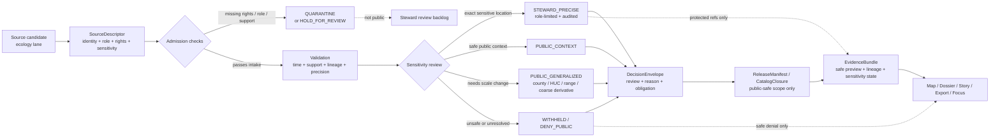

<!-- [KFM_META_BLOCK_V2]
doc_id: kfm://doc/NEEDS_VERIFICATION__assign_uuid
title: Sensitivity and Geoprivacy
type: standard
version: v1
status: draft
owners: TODO-VERIFY(ecology-steward, policy-owner)
created: TODO-VERIFY(YYYY-MM-DD)
updated: 2026-05-07
policy_label: TODO-VERIFY(public|restricted)
related: [TODO-VERIFY:docs/domains/ecology/README.md, TODO-VERIFY:docs/domains/README.md, TODO-VERIFY:policy/README.md, TODO-VERIFY:schemas/contracts/v1/source/README.md, TODO-VERIFY:schemas/contracts/v1/evidence/README.md, TODO-VERIFY:schemas/contracts/v1/policy/README.md, TODO-VERIFY:tests/policy/README.md, TODO-VERIFY:tests/contracts/README.md]
tags: [kfm, ecology, biodiversity, sensitivity, geoprivacy, publication-policy]
notes: [Target path requested as docs/domains/ecology/SENSITIVITY_AND_GEOPRIVACY.md, Active-branch path ownership and related links need repository verification, Updated date is draft-generation date not git history, This file governs public/steward split for sensitive ecology precision]
[/KFM_META_BLOCK_V2] -->

<a id="top"></a>

# Sensitivity and Geoprivacy

Governed handling rules for sensitive ecology, rare-species, habitat, wetland, biodiversity, and exact-location evidence in KFM.

<p>
  
  
  
  
  
</p>

> [!IMPORTANT]
> **Impact block**
>
> | Field | Value |
> |---|---|
> | Status | `draft` |
> | Owners | `TODO-VERIFY(ecology-steward, policy-owner)` |
> | Target path | `docs/domains/ecology/SENSITIVITY_AND_GEOPRIVACY.md` |
> | Evidence posture | Doctrine-grounded; implementation and active-branch enforcement remain **NEEDS VERIFICATION** |
> | Public posture | Exact sensitive ecology locations are **not public by default** |
> | Steward posture | Precise occurrences require explicit rights, source-role, sensitivity, review, and release decisions |
>
> **Quick jumps:** [Scope](#scope) · [Repo fit](#repo-fit) · [Decision posture](#decision-posture) · [Sensitivity model](#sensitivity-model) · [Publication classes](#publication-classes) · [Source roles](#source-roles-and-admissibility) · [Workflow](#workflow) · [Accepted inputs](#accepted-inputs) · [Exclusions](#exclusions) · [Release gates](#review-and-release-gates) · [Task list](#task-list) · [Appendix](#appendix)

---

## Scope

This document defines the ecology-domain rules for deciding whether biodiversity, habitat, rare-species, wetland, protected-area, pollinator, wildlife, flora, and occurrence-related evidence may be shown publicly, shown only to stewards, generalized, quarantined, withheld, or corrected.

KFM’s ecology lane is valuable because location matters. It is risky for the same reason. The system must therefore treat precision, rights, sensitivity, reuse limits, source role, lineage, and release state as first-class evidence properties rather than after-the-fact metadata.

### This file governs

| Concern | Rule |
|---|---|
| Exact sensitive locations | Deny public precision by default unless a policy-approved public-safe representation exists. |
| Public ecology layers | Prefer generalized county, watershed, range, habitat-context, or other policy-safe derivatives. |
| Steward access | Require role-limited review, explicit reason codes, and auditable decision records. |
| Source admission | Do not admit source families until rights, sensitivity, source role, update basis, and public representation are declared. |
| Corrections | Preserve visible lineage when a public layer is narrowed, withdrawn, generalized, superseded, or corrected. |
| Runtime answers | Focus Mode, map popups, dossiers, stories, and exports must resolve evidence and policy before returning ecology claims. |

### This file does not prove

| Claim type | Current label | Required proof before upgrade |
|---|---:|---|
| This file already exists on the active branch | **NEEDS VERIFICATION** | mounted repository tree or GitHub file fetch |
| `docs/domains/ecology/` is the active ecology-doc home | **NEEDS VERIFICATION** | active branch directory inspection |
| ecology policy bundles are already mounted and merge-blocking | **UNKNOWN** | policy files, invalid fixtures, and CI logs |
| exact schema paths for ecology sensitivity objects | **NEEDS VERIFICATION** | current schema tree and contract docs |
| source connectors for KDWP, ECOS, NatureServe, GBIF, eBird, iNaturalist, NWI, or PAD-US are implemented | **UNKNOWN** | connector code, source descriptors, tests, receipts |
| public ecology layers are currently published | **UNKNOWN** | release manifests, catalog closure, layer manifests, and public route evidence |

<p align="right"><a href="#top">Back to top ↑</a></p>

---

## Repo fit

**Path:** `docs/domains/ecology/SENSITIVITY_AND_GEOPRIVACY.md`  
**Role:** standard ecology-domain policy and reviewer guidance for sensitivity, geoprivacy, precision handling, and public/steward release decisions.

> [!NOTE]
> The path above is the user-requested target path. Related paths below are intentionally marked for verification. Convert path text to relative links only after the active branch proves the files exist from this document’s location.

| Relationship | Path text | Status | Why it matters |
|---|---|---:|---|
| Parent domain index | `docs/domains/README.md` | **NEEDS VERIFICATION** | Should route domain-wide burden logic and Kansas lane placement. |
| Ecology domain overview | `docs/domains/ecology/README.md` | **NEEDS VERIFICATION** | Should link here when ecology readers need precision, rights, or public/steward rules. |
| Policy authority | `policy/README.md` | **NEEDS VERIFICATION** | Deny/generalize/withhold decisions belong to policy, not prose alone. |
| Source descriptor contract | `schemas/contracts/v1/source/` | **NEEDS VERIFICATION** | Source admission needs explicit rights, sensitivity, support, cadence, and lineage fields. |
| Evidence bundle contract | `schemas/contracts/v1/evidence/` | **NEEDS VERIFICATION** | Public claims must resolve to inspectable evidence and safe preview posture. |
| Decision envelope contract | `schemas/contracts/v1/policy/` | **NEEDS VERIFICATION** | Release decisions need machine-readable outcomes, reasons, obligations, and audit refs. |
| Release contract | `schemas/contracts/v1/release/` | **NEEDS VERIFICATION** | Public-safe ecology derivatives need release scope, rollback, and correction linkage. |
| Contract tests | `tests/contracts/` | **NEEDS VERIFICATION** | Exact-location leakage and missing rights should fail before release. |
| Policy tests | `tests/policy/` | **NEEDS VERIFICATION** | Deny-by-default ecology decisions need positive and negative fixtures. |
| Public shell / Focus surfaces | `apps/` or repo-native equivalent | **UNKNOWN** | UI and runtime surfaces should consume public-safe derivatives, not raw sensitive records. |

### Boundary summary

| Question | Answer |
|---|---|
| What is this document for? | Turning sensitive ecology doctrine into reviewable release rules. |
| What is it not? | Not a source connector spec, not a schema authority, not a policy engine, and not proof that enforcement already exists. |
| Who should use it? | Ecology stewards, data pipeline maintainers, policy authors, reviewer teams, UI builders, Focus/runtime implementers, and release reviewers. |
| What does it protect? | Sensitive species, habitat, wetland, collection, stewardship, and exact-location evidence from unsafe public precision. |

<p align="right"><a href="#top">Back to top ↑</a></p>

---

## Decision posture

KFM’s ecology posture is **default-deny precision, public-safe by derivation, steward-mediated by exception**.

### Non-negotiable rules

| Rule | Label | Meaning |
|---|---:|---|
| Public exact-location exposure is denied by default. | **CONFIRMED doctrine / local rule** | Sensitive ecology value often rises with precision, but public risk rises faster. |
| Generalized public derivatives are preferred. | **CONFIRMED doctrine / local rule** | Public surfaces should usually show county, watershed, range, public polygon, or other safe context. |
| Precise occurrences are steward-only unless explicitly released. | **CONFIRMED doctrine / local rule** | Steward access needs role, purpose, review, and audit linkage. |
| Rights and sensitivity are admission gates. | **CONFIRMED doctrine / local rule** | Discoverable data is not automatically admissible or publishable. |
| Source roles must stay visible. | **CONFIRMED doctrine / local rule** | Regulatory lists, occurrence repositories, mirrors, models, and public context layers are not interchangeable. |
| Absence from a public derivative is not absence from ecology reality. | **PROPOSED local rule / strongly supported by geoprivacy posture** | Withheld, generalized, or steward-only records must not be interpreted as ecological absence. |
| Corrections must travel forward. | **CONFIRMED doctrine / local rule** | If exposure is narrowed or withdrawn, map, dossier, story, export, and Focus surfaces must show the correction state. |

> [!CAUTION]
> A public map that hides exact sensitive locations but lets users reconstruct them through centroids, tooltips, feature IDs, URLs, screenshots, tiles, exports, search, or Focus answers is still a precision leak.

### Finite release outcomes

| Outcome | Use when | Public response |
|---|---|---|
| `ALLOW_PUBLIC_GENERALIZED` | Public representation is safe after scale change, masking, aggregation, or context-only transformation. | Show generalized layer and disclose the public-safe representation class. |
| `ALLOW_PUBLIC_CONTEXT` | Source is already public and policy-safe at the represented scale. | Show with source role, time basis, and limitations. |
| `ALLOW_STEWARD_PRECISE` | Exact precision is needed for authorized stewardship and permitted by rights/sensitivity review. | Restrict to steward surface; emit audit and review refs. |
| `HOLD_FOR_REVIEW` | Rights, sensitivity, role, precision, lineage, or obligations are incomplete. | Do not publish; route to reviewer. |
| `QUARANTINE` | Source or record is invalid, conflicted, rights-unclear, or unsafe to process further. | Keep out of public and normal steward flows until resolved. |
| `DENY_PUBLIC` | Public exposure is blocked by sensitivity, rights, terms, review, or harm risk. | Return safe denial; do not reveal restricted detail. |
| `WITHDRAW_OR_GENERALIZE` | A previously released object is found too precise, stale, or unsafe. | Publish correction notice and rebuild public derivatives. |

<p align="right"><a href="#top">Back to top ↑</a></p>

---

## Sensitivity model

The precision model below is a **PROPOSED local vocabulary** for this file. It should be reconciled with any existing schema or policy vocabulary before merge.

### Precision classes

| Class | Public meaning | Default public posture | Steward posture |
|---|---|---|---|
| `P0_NO_LOCATION` | No geometry or only broad textual place context. | Usually safe if rights and context allow. | Not usually sensitive by precision alone. |
| `P1_REGIONAL_CONTEXT` | Statewide, eco-region, basin, broad range, or non-actionable context. | Usually acceptable after source-role and rights review. | May support planning and education. |
| `P2_COUNTY_OR_HUC_SUMMARY` | County, HUC, watershed, coarse grid, or equivalent aggregate. | Preferred public derivative for sensitive ecology. | May link to precise steward records by protected refs. |
| `P3_GENERALIZED_GEOMETRY` | Masked, displaced, buffered, binned, or simplified location. | Review required; publish only if reidentification risk is low. | Keep reduction method and risk notes visible to reviewers. |
| `P4_PRECISE_OCCURRENCE` | Coordinate, parcel, site, nest, den, cave, colony, collection locality, or similarly actionable location. | Deny public by default. | Steward-only with explicit decision, purpose, and audit. |
| `P5_CRITICAL_SENSITIVE_SITE` | Highly vulnerable, culturally sensitive, legally restricted, or harm-amplifying precise location. | Withhold from public. | Steward-only or quarantine; minimize visibility even in review surfaces. |

### Sensitivity classes

| Class | Meaning | Minimum handling |
|---|---|---|
| `public` | Not sensitive at represented scale and rights permit reuse. | Public-safe release still needs source, time, and lineage. |
| `generalize` | Useful publicly only after scale reduction or representation change. | Publish derivative; protect precise source. |
| `review_required` | Sensitivity, rights, source role, or precision risk is not settled. | Hold for steward/policy review. |
| `restricted` | Public exposure is blocked or requires specialized role. | Deny public; steward-only or withheld. |
| `quarantine` | Validation, rights, lineage, or harm-risk failure. | Keep out of release and normal runtime surfaces. |

### Reidentification checks

Before publishing an ecology derivative, reviewers should ask:

- Can a user reconstruct exact locations by combining public layer geometry with labels, IDs, filenames, tiles, screenshots, attributes, timestamps, URLs, or external public datasets?
- Does the derivative reveal a small enough population, habitat patch, or species range that the location is effectively exposed?
- Does a generalized point or polygon still reveal a nest, den, cave, colony, collection locality, or vulnerable habitat?
- Does the source provider permit redistribution at this precision?
- Does the public layer preserve the fact of generalization so users do not misread it as exact absence, exact presence, or survey completeness?
- Does the release include a correction path if exposure later proves too precise?

<p align="right"><a href="#top">Back to top ↑</a></p>

---

## Publication classes

### Public/steward split

| Release class | Geometry allowed | Attribute posture | Evidence posture | Typical surface |
|---|---|---|---|---|
| `PUBLIC_CONTEXT` | Public-safe regulatory/context geometry where source terms allow. | Keep caveats, source role, date, and limitations. | EvidenceBundle may preview safe source context. | Map, dossier, story, export, Focus. |
| `PUBLIC_GENERALIZED` | County, HUC, range, coarse grid, buffered/masked polygon, or safe aggregate. | Remove direct coordinates, exact locality text, and sensitive identifiers. | EvidenceBundle explains precision reduction and why exact source is withheld. | Map, story, public data card. |
| `PUBLIC_DERIVED_INDEX` | Derived habitat suitability, range summary, or non-exact indicator. | Label as modeled, derived, or contextual; never source-of-record by itself. | Requires derived-from refs and uncertainty notes. | Map overlay, analysis card, Focus context. |
| `STEWARD_PRECISE` | Exact occurrence or sensitive site geometry. | Role-limited attributes only. | Requires DecisionEnvelope, review record, audit ref, and allowed purpose. | Steward review, protected internal task. |
| `QUARANTINED` | Any geometry, including exact, if rights or safety are unresolved. | Not available to normal users. | Requires quarantine reason and resolution path. | Quarantine/review lane only. |
| `WITHHELD` | Not exposed. | No public detail that reveals protected location. | Safe denial may disclose category-level reason only. | Public denial, reviewer record. |

### Minimum public derivative disclosure

Every public ecology derivative should carry the following disclosure fields or equivalent contract fields.

| Field | Purpose |
|---|---|
| `public_representation_class` | States whether the object is public context, generalized, modeled, derived, or summary-only. |
| `precision_class_before` | Indicates the source precision class before public transformation, when safe to disclose. |
| `precision_class_after` | Indicates the public precision class after transformation. |
| `precision_reduction_method` | Describes aggregation, masking, binning, simplification, range conversion, or other safe transform. |
| `sensitive_fields_removed` | Names classes of removed fields without leaking restricted content. |
| `source_role` | Prevents mirrors, models, community observations, or context feeds from being mistaken for authority. |
| `rights_basis` | Records license, terms, redistribution posture, or review outcome. |
| `decision_ref` | Links to the relevant policy/review decision. |
| `evidence_bundle_ref` | Links public claim support to safe evidence. |
| `correction_ref` | Points to any narrowing, withdrawal, supersession, or republication notice. |

<p align="right"><a href="#top">Back to top ↑</a></p>

---

## Source roles and admissibility

The source families below are **representative ecology source families named by the KFM corpus**. Their active connector status, current terms, and repo implementation state remain **NEEDS VERIFICATION**.

| Source family | Likely role | KFM-safe use | Caution |
|---|---|---|---|
| KDWP regulatory lists and range/context materials | State regulatory / stewardship source family | Support public context, species status, range summaries, and review decisions where rights permit. | Do not publish precise sensitive locations unless explicit policy and rights allow. |
| Kansas Natural Heritage Inventory or equivalent heritage records | Stewardship / sensitive occurrence source family | Steward-only review, protected provenance, and generalized public derivatives. | Treat exact occurrence precision as restricted by default. |
| ECOS / federal species context | Regulatory / federal context source family | Public status and range context where safe and permitted. | Do not confuse broad public species context with permission to expose local precision. |
| NatureServe-linked records | Conservation status / occurrence context source family | Corroboration, status context, and sensitivity-informed review. | Reuse and precision posture may vary; verify terms and data sensitivity. |
| GBIF | Occurrence aggregation / corroborative source family | Public or steward context only after rights, coordinate uncertainty, source role, and sensitivity review. | Aggregation does not erase sensitivity or provider terms. |
| iNaturalist / eBird | Community-contributed observation source family | Corroborative or discovery-oriented signals when license, obscuration, and sensitivity rules permit. | Do not treat community observations as unreviewed authoritative truth. |
| NWI wetlands | Public wetland context source family | Public wetland/context layer where source role and update basis are clear. | Wetland context is not automatically species occurrence evidence. |
| PAD-US / protected areas | Public protected-area context source family | Protected-area context, stewardship geography, and public-safe overlays. | Protected-area boundaries do not license exact sensitive occurrences inside them. |
| Museum, herbarium, entomology, or biodiversity collections | Documentary / specimen / occurrence source family | Steward review, historical context, and generalized derivatives. | Collection locality text, OCR/geoparsing, and temporal context can leak precision. |

### Admission checklist

A source family is not ecology-admissible until the following are known or explicitly held for review.

| Requirement | Gate behavior |
|---|---|
| Source identity and steward | Missing identity blocks authoritative use. |
| Source role | Missing role blocks downstream authority claims. |
| Rights and redistribution posture | Unknown rights trigger `HOLD_FOR_REVIEW` or `QUARANTINE`. |
| Sensitivity and precision posture | Unclassified sensitivity blocks public release. |
| Declared spatial support | Unknown support blocks exact or aggregate claims. |
| Declared temporal basis | Unknown time basis blocks current-state claims. |
| Update and version basis | Unknown update rhythm blocks freshness-sensitive output. |
| Public-safe representation | Missing safe representation blocks public exposure. |
| Review authority | Missing reviewer route blocks steward-only precision release. |
| Correction path | Missing rollback/correction path blocks promotion-sensitive release. |

<p align="right"><a href="#top">Back to top ↑</a></p>

---

## Workflow



### Workflow rules

1. **Describe before ingest.** A source without a usable SourceDescriptor is not ready for ecology admission.
2. **Validate before classify.** Shape, identity, support, time, and lineage problems should not be hidden as sensitivity decisions.
3. **Classify before publish.** Precision and sensitivity must be explicit before public release.
4. **Generalize before expose.** If public value exists but precision is unsafe, build a public derivative rather than leaking the source.
5. **Review before steward precision.** Exact sensitive locations require role-limited purpose, review, decision, and audit.
6. **Correct forward.** If a public layer is too precise, publish a correction, narrow the public representation, and rebuild downstream surfaces.

<p align="right"><a href="#top">Back to top ↑</a></p>

---

## Accepted inputs

| Accepted input | Conditions |
|---|---|
| Ecology SourceDescriptor drafts | Must declare source role, rights, precision, sensitivity, support, time basis, cadence, and publication intent. |
| Public regulatory or range/context records | Must preserve source role, version/date basis, and public-use limitations. |
| Occurrence datasets | Must pass rights, coordinate uncertainty, sensitivity, provider-term, and public-safe representation review. |
| Steward-submitted precise records | Must remain steward-only unless explicitly generalized or approved for safe release. |
| Generalized public derivatives | Must document precision reduction and avoid reverse reconstruction. |
| Redaction or generalization receipts | Must identify what was transformed without leaking restricted coordinates or localities. |
| DecisionEnvelope records | Must include finite outcome, reason codes, obligations, policy basis, and audit linkage. |
| EvidenceBundle records | Must expose safe support, lineage, rights/sensitivity state, and negative-path traces. |
| CorrectionNotice records | Must remain linked to affected releases, layers, stories, exports, and Focus answers. |
| Valid/invalid fixtures | Must avoid real sensitive coordinates unless fixture storage is explicitly protected. |

<p align="right"><a href="#top">Back to top ↑</a></p>

---

## Exclusions

| Excluded from public ecology docs, fixtures, exports, and normal runtime surfaces | Where it belongs instead | Why |
|---|---|---|
| Exact coordinates for sensitive species or vulnerable habitat | steward-only store or quarantine | Public precision is denied by default. |
| Raw provider payloads with sensitive locality fields | RAW / restricted lifecycle lane | Public docs must not leak source-native sensitive detail. |
| Coordinates hidden only in properties, URLs, feature IDs, filenames, alt text, screenshots, or tiles | nowhere public | Hidden precision is still public exposure. |
| Unreviewed scraped observations | source review / quarantine | Discovery convenience does not create admissibility. |
| Mirror data treated as authority | source descriptor review | Mirrors may help discovery but do not replace source role. |
| Model-generated habitat claims without evidence and uncertainty | derived/model lane with EvidenceBundle | Modeled outputs are context, not sovereign truth. |
| Public absence claims from generalized data | policy-safe explanation only | Withholding can make public absence false. |
| Emergency or life-safety guidance | official source systems | KFM is not an emergency alert system. |
| Secrets, tokens, provider credentials, or restricted access notes | secret manager / private ops docs | Operational secrets must not enter docs or fixtures. |
| Free-form AI reasoning traces | receipts and audit refs only | Persist auditable objects, not private reasoning. |

> [!WARNING]
> Do not include real sensitive coordinates in examples, screenshots, fixture names, commit messages, PR summaries, issue titles, or rendered docs.

<p align="right"><a href="#top">Back to top ↑</a></p>

---

## Review and release gates

### Required gates before public ecology release

| Gate | Blocks release when… | Evidence expected |
|---|---|---|
| Source identity gate | source ID, provider, steward, or canonical reference is missing | SourceDescriptor |
| Source-role gate | role is unknown or mirror/corroborative source is treated as authority | SourceDescriptor + review note |
| Rights gate | license, terms, redistribution, or attribution posture is unknown | rights review + DecisionEnvelope |
| Sensitivity gate | precision class or sensitivity class is missing | sensitivity review record |
| Precision gate | public geometry is too exact or reconstructable | generalization receipt or deny decision |
| Lineage gate | derivative cannot be reconstructed from source and transform refs | run receipt + EvidenceBundle |
| Catalog gate | public derivative lacks catalog/release closure | CatalogClosure / ReleaseManifest |
| Runtime gate | Focus/map/dossier/export can answer from restricted precision | negative runtime fixture |
| Correction gate | release lacks withdrawal, supersession, rollback, or narrowing path | CorrectionNotice plan |

### Negative fixtures that should exist

The following fixtures are **PROPOSED** until confirmed in the active repository.

| Fixture | Expected result |
|---|---|
| public layer contains `P4_PRECISE_OCCURRENCE` geometry | `DENY_PUBLIC` |
| source rights are `unknown` | `HOLD_FOR_REVIEW` or `QUARANTINE` |
| source role is `mirror` but claim is treated as authoritative | `ABSTAIN` or validation failure |
| public derivative lacks precision-reduction method | release gate failure |
| EvidenceBundle includes restricted locality text in public preview | citation/evidence gate failure |
| Focus answer reveals withheld locality through explanation | runtime gate failure |
| correction narrows public layer but old export remains valid | correction gate failure |
| public absence claim is made from generalized/suppressed layer | policy gate failure |

<p align="right"><a href="#top">Back to top ↑</a></p>

---

## Task list

### Definition of done for this document

- [ ] Confirm the active-branch file path and whether this is a new file or revision.
- [ ] Confirm owners from CODEOWNERS or project governance docs.
- [ ] Assign a real `doc_id`.
- [ ] Confirm `policy_label`.
- [ ] Verify related path links before converting path text into Markdown links.
- [ ] Reconcile the proposed precision classes with existing schema or policy vocabulary.
- [ ] Confirm source connector inventory and active source descriptors for ecology.
- [ ] Confirm where ecology sensitivity policy lives under `policy/`.
- [ ] Confirm whether `SourceDescriptor`, `EvidenceBundle`, `DecisionEnvelope`, `ReleaseManifest`, and `CorrectionNotice` schemas exist and where.
- [ ] Add valid and invalid fixtures for exact-location leakage, missing rights, missing sensitivity, and public absence overclaim.
- [ ] Add a no-sensitive-coordinates documentation check for public docs, fixtures, screenshots, and examples.
- [ ] Add a runtime negative-path test proving Focus cannot reveal withheld locations.
- [ ] Add a correction drill for narrowing a too-precise public ecology derivative.

### First high-value implementation slice

- [ ] Pick one low-risk ecology source family.
- [ ] Write one SourceDescriptor with rights, source role, sensitivity, and public representation fields.
- [ ] Build one county- or HUC-level public derivative.
- [ ] Preserve precise records as steward-only or quarantined.
- [ ] Emit a generalization/redaction receipt.
- [ ] Emit a DecisionEnvelope for public release.
- [ ] Publish a safe EvidenceBundle.
- [ ] Add one public map/dossier/Focus example that shows the generalized layer without exposing exact locations.
- [ ] Add one negative fixture proving exact public precision fails closed.

<p align="right"><a href="#top">Back to top ↑</a></p>

---

## Appendix

<details>
<summary><strong>Illustrative SourceDescriptor fields for sensitive ecology</strong></summary>

> [!NOTE]
> This is an illustrative example, not a verified repo schema. Reconcile field names with the active contract before commit.

```yaml
object_type: SourceDescriptor
schema_version: TODO-VERIFY
source_id: TODO-VERIFY
lane: ecology
title: TODO-VERIFY
provider: TODO-VERIFY
steward_contact: TODO-VERIFY

source_role: TODO-VERIFY(authoritative|regulatory|stewardship|corroborative|mirror|modeled|documentary|community)
access:
  access_mode: TODO-VERIFY(public|restricted|licensed|steward_only)
  cadence: TODO-VERIFY
  rate_or_terms_notes: TODO-VERIFY

semantics:
  support: TODO-VERIFY(county|huc|range|occurrence|collection_record|habitat_polygon|protected_area)
  crs_or_spatial_frame: TODO-VERIFY
  time_basis: TODO-VERIFY(observed_at|reported_at|list_date|effective_date|updated_at)
  observed_vs_modeled: TODO-VERIFY(observed|modeled|derived|regulatory_context|documentary)

rights:
  license_or_terms: TODO-VERIFY
  redistribution_allowed: TODO-VERIFY(true|false|unknown)
  attribution_required: TODO-VERIFY
  provider_precision_limits: TODO-VERIFY

sensitivity:
  sensitivity_class: TODO-VERIFY(public|generalize|review_required|restricted|quarantine)
  precision_class: TODO-VERIFY(P0_NO_LOCATION|P1_REGIONAL_CONTEXT|P2_COUNTY_OR_HUC_SUMMARY|P3_GENERALIZED_GEOMETRY|P4_PRECISE_OCCURRENCE|P5_CRITICAL_SENSITIVE_SITE)
  steward_review_required: true
  public_safe_representation: TODO-VERIFY(county_summary|huc_summary|range_context|masked_grid|withheld)

lineage:
  raw_artifact_ref: steward_only_or_quarantined
  public_derivative_ref: TODO-VERIFY
  redaction_or_generalization_receipt_ref: TODO-VERIFY
  decision_ref: TODO-VERIFY
  correction_ref: TODO-VERIFY
```

</details>

<details>
<summary><strong>Illustrative decision reason and obligation vocabulary</strong></summary>

> [!NOTE]
> Names below are **PROPOSED** local vocabulary. Policy-owned vocabularies should win if they already exist.

| Code | Type | Meaning |
|---|---|---|
| `sensitivity.exact_location` | reason | Requested/public object exposes exact sensitive location. |
| `sensitivity.reidentification_risk` | reason | Public derivative can likely be reversed into sensitive precision. |
| `rights.unknown` | reason | Rights or redistribution posture is unresolved. |
| `rights.redistribution_blocked` | reason | Source terms block requested public release. |
| `source_role.not_authoritative` | reason | Source cannot support the authority level claimed. |
| `lineage.missing` | reason | Public value cannot be reconstructed to admissible evidence. |
| `precision.generalize_required` | obligation | Reduce precision before public exposure. |
| `preview.safe_only` | obligation | Evidence preview must omit restricted locality detail. |
| `review.steward_required` | obligation | Steward review required before precise use. |
| `correction.narrow_public_release` | obligation | Public object must be narrowed, superseded, or withdrawn. |

</details>

<details>
<summary><strong>Pre-publish checklist</strong></summary>

- [ ] Meta block values are filled or intentionally marked `TODO-VERIFY`.
- [ ] Status, owners, target path, badges, and quick jumps are present.
- [ ] No exact sensitive coordinates appear in examples, screenshots, fixtures, or prose.
- [ ] Public/steward split is explicit.
- [ ] Precision classes are reconciled with active policy/schema vocabulary.
- [ ] Source families are described as representative unless connector implementation is verified.
- [ ] Public derivative requirements include precision-reduction disclosure.
- [ ] Deny, hold, quarantine, and correction outcomes are treated as valid system behavior.
- [ ] Mermaid diagram reflects KFM responsibility boundaries without inventing runtime implementation.
- [ ] Code fences are language-tagged.
- [ ] Long reference material is wrapped in `<details>`.
- [ ] Active-branch related links are verified before conversion to Markdown links.
- [ ] Claims about tests, schemas, policy, CI, connectors, or releases remain **NEEDS VERIFICATION** until proven.

</details>

<p align="right"><a href="#top">Back to top ↑</a></p>