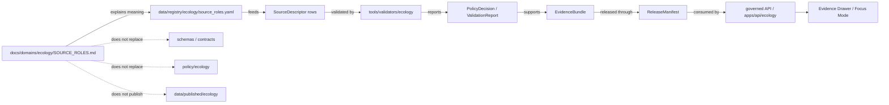

<!-- [KFM_META_BLOCK_V2]
doc_id: kfm://doc/TODO-ecology-source-roles
title: Ecology Source Roles
type: standard
version: v1
status: draft
owners: TODO: verify ecology steward
created: TODO: YYYY-MM-DD
updated: 2026-05-07
policy_label: public
related: [
  docs/domains/ecology/README.md,
  docs/domains/ecology/RUNBOOK.md,
  docs/domains/ecology/FOCUS_MODE.md,
  data/registry/ecology/README.md,
  tools/validators/ecology/README.md,
  apps/api/ecology/README.md,
  policy/ecology/publication.rego
]
tags: [kfm, ecology, source-roles, source-descriptor, evidence, geoprivacy, publication]
notes: [
  NEEDS_VERIFICATION: replace doc_id after document registry assignment,
  NEEDS_VERIFICATION: verify ecology steward owner and created date,
  NEEDS_VERIFICATION: confirm active schema enum and policy registry before treating this vocabulary as executable authority,
  Preserves existing lower-snake source-role tokens and adds compatibility guidance for adjacent ecology registry terminology
]
[/KFM_META_BLOCK_V2] -->

<a id="top"></a>

# Ecology Source Roles

Source-role vocabulary for ecology SourceDescriptors, validators, policy gates, EvidenceBundles, Evidence Drawer payloads, and public-safe Focus Mode behavior.

<p align="center">
  
  
  
  
  
  
</p>

<p align="center">
  <a href="#impact-block">Impact</a> ·
  <a href="#scope">Scope</a> ·
  <a href="#repo-fit">Repo fit</a> ·
  <a href="#role-taxonomy">Role taxonomy</a> ·
  <a href="#role-rules">Rules</a> ·
  <a href="#compatibility-crosswalk">Crosswalk</a> ·
  <a href="#examples">Examples</a> ·
  <a href="#validation-and-policy-hooks">Validation</a> ·
  <a href="#definition-of-done">Definition of done</a>
</p>

> [!IMPORTANT]
> A source role says **what a source is allowed to support**. It does not, by itself, prove a claim, authorize public release, settle rights, remove sensitivity, or turn a rendered map layer into evidence.

---

## Impact Block

| Field | Value |
|---|---|
| Status | `draft` vocabulary guidance |
| Target path | `docs/domains/ecology/SOURCE_ROLES.md` |
| Owners | `TODO: verify ecology steward` |
| Primary users | ecology maintainers, registry editors, validator authors, policy reviewers, API/runtime maintainers, Evidence Drawer / Focus Mode reviewers |
| Canonical role style | lower-snake tokens such as `observation`, `aggregator`, `model`, and `render_descriptor` |
| Default posture | fail closed when role, authority scope, rights, sensitivity, evidence, release, or citation support is missing |
| Highest-risk confusion | occurrence aggregators, habitat models, regulatory context, rendered layers, and AI summaries treated as interchangeable evidence |
| Public geometry posture | exact sensitive ecology geometry is denied unless a reviewed public-safe transform and receipt exist |
| Runtime posture | public answers use governed envelopes and finite outcomes: `ANSWER`, `ABSTAIN`, `DENY`, `ERROR` |

| This document does | This document does not |
|---|---|
| Defines ecology source-role meanings and no-collapse rules. | Does not activate live sources. |
| Preserves the existing lowercase role vocabulary while adding compatibility guidance. | Does not replace schemas, policy, validators, registries, or steward review. |
| Explains what each role may and may not support. | Does not make any source public-release eligible by itself. |
| Gives validation, policy, and review hooks for role changes. | Does not authorize exact sensitive occurrence publication. |

---

## Scope

Ecology source roles apply to any source descriptor, registry row, candidate artifact, validator report, release manifest, EvidenceBundle, Evidence Drawer payload, or Focus Mode context that supports ecology-domain claims.

Covered ecology contexts include:

- taxonomic and nomenclatural references;
- field observations, specimens, surveys, plots, monitoring records, and public-safe occurrence candidates;
- aggregated occurrence feeds and discovery mirrors;
- habitat surfaces, suitability layers, vegetation classifications, land-cover context, and modeled derivatives;
- regulatory, conservation, management, and stewardship context;
- redaction, geoprivacy, generalization, and steward-review decisions;
- rendered layer descriptors and UI payloads that point to evidence;
- synthetic fixtures used to prove negative and positive behavior.

This file is intentionally focused on **source role**. Related but separate burdens are handled by other object fields:

| Burden | Why it is separate |
|---|---|
| `rights_status` | A source can be authoritative but not redistributable. |
| `sensitivity_class` | A source can be valid but unsafe at exact public precision. |
| `authority_scope` | A source can be authoritative for names, but not for occurrences or legal status. |
| `temporal_scope` | A record can be valid for one date, season, survey window, release, or review period. |
| `spatial_support` | Point, polygon, raster cell, county, watershed, ecoregion, and generalized geometry carry different meanings. |
| `knowledge_character` | Observation, model, derivative, regulatory context, baseline, and fixture must remain visibly distinct. |
| `release_state` | A valid record is not automatically a published public claim. |

[Back to top](#top)

---

## Repo Fit

`docs/domains/ecology/SOURCE_ROLES.md` belongs in the human-facing ecology domain control plane. It should be updated with registry, schema, validator, policy, and runtime changes that alter what source roles mean.

| Relationship | Relative path | Role | Status |
|---|---|---|---|
| Ecology domain control plane | [`README.md`](./README.md) | Domain scope, lifecycle, risk posture, source role summary. | Confirm in repo before release claim |
| Ecology runbook | [`RUNBOOK.md`](./RUNBOOK.md) | Operator gates for fixtures, release artifacts, Focus Mode, UI payloads, app runtime, and path policy. | Confirmed adjacent doc |
| Ecology Focus Mode | [`FOCUS_MODE.md`](./FOCUS_MODE.md) | Runtime-answer boundary for released evidence and finite outcomes. | Confirmed adjacent doc |
| Ecology registry | [`../../../data/registry/ecology/README.md`](../../../data/registry/ecology/README.md) | SourceDescriptor and source-role registry orientation. | Confirmed adjacent doc |
| Ecology validators | [`../../../tools/validators/ecology/README.md`](../../../tools/validators/ecology/README.md) | Fail-closed validation lane for source descriptors, occurrence, habitat, sensitivity, catalog, release, and runtime payloads. | Confirmed adjacent doc |
| API ecology runtime | [`../../../apps/api/ecology/README.md`](../../../apps/api/ecology/README.md) | App-local EvidenceBundle and Focus Mode runtime surface. | Confirmed adjacent doc |
| Publication policy | `../../../policy/ecology/publication.rego` | Policy decision surface for public release and sensitivity controls. | NEEDS VERIFICATION for current policy implementation |

> [!WARNING]
> This document is not the executable enum authority until the active schema and validator references are verified. If `source_roles.yaml`, JSON Schema enums, Rego rules, or validator token lists disagree with this file, open a reconciliation PR rather than silently choosing one source.

### Responsibility boundary



[Back to top](#top)

---

## Accepted Inputs

Use this document when reviewing or drafting:

| Input | Belongs here when… |
|---|---|
| `source_role` enum values | A role is added, renamed, deprecated, merged, or clarified. |
| SourceDescriptor rows | A source needs its allowed evidentiary use explained. |
| Ecology registry rows | The registry needs shared role vocabulary or compatibility mapping. |
| Validator fixtures | Positive or negative fixtures depend on role meaning. |
| Policy decisions | A deny, hold, generalize, or allow decision depends on source role. |
| EvidenceBundle payloads | Public claims need visible source-role support. |
| Evidence Drawer payloads | UI must show what a source can and cannot prove. |
| Focus Mode responses | Runtime answers need bounded source-role reasoning. |
| Release reviews | A release candidate depends on occurrence, model, regulatory, baseline, or render metadata. |
| Correction reviews | A public claim was supported by the wrong role or overstated source authority. |

## Exclusions

Do not use this file as the home for:

| Excluded material | Required home or handling |
|---|---|
| Raw source exports, occurrence files, rasters, tiles, or API dumps | `data/raw/`, `data/work/`, or `data/quarantine/` under lifecycle controls |
| Machine schema definitions | `schemas/` or repo-confirmed schema home |
| Semantic object contracts | `contracts/` or repo-confirmed contract home |
| Rego/policy source | `policy/ecology/` or repo-confirmed policy home |
| Validator implementation | `tools/validators/ecology/` |
| Live connector code | `connectors/`, `pipelines/`, or repo-confirmed source-ingestion home |
| Proof packs, EvidenceBundles, receipts, release manifests | `data/proofs/`, `data/receipts/`, `release/`, or repo-confirmed proof/release home |
| Exact sensitive occurrence geometry | restricted lifecycle stores only; public exposure denied by default |
| AI answers or generated summaries | governed runtime envelopes only; never source-role authority |

[Back to top](#top)

---

## Role Taxonomy

Use the lowercase role tokens below for ecology v1 unless the schema registry has already adopted a stronger canonical vocabulary.

> [!NOTE]
> The first seven tokens preserve the existing ecology source-role vocabulary. The added tokens make adjacent registry, validator, and stewardship language explicit without replacing the earlier terms.

| Role token | What it means | May support | Must not support by itself | Default public posture |
|---|---|---|---|---|
| `authority` | A source with accepted authority for a named scope such as taxonomy, nomenclature, classification, controlled vocabulary, or steward-approved reference. | Names, identifiers, controlled terms, authoritative lookup values, accepted classification within declared scope. | Field occurrence, abundance, absence, legal status, habitat condition, or public exact geometry unless the source explicitly has that authority. | Public for vocabulary/summary use when rights allow; no sensitive geometry implied. |
| `observation` | A direct record from field work, specimen collection, survey, plot, monitoring event, sensor, photo, or other evidence-bearing observation. | Observed occurrence or condition within stated spatial, temporal, precision, method, and review limits. | Legal status, range-wide inference, modeled absence, or public exact release of sensitive records. | Public only after rights, sensitivity, review, and geometry checks. |
| `aggregator` | A source that aggregates, mirrors, indexes, or republishes records from upstream sources. | Corroborative evidence, discovery, source routing, and occurrence context when upstream attribution and record IDs are preserved. | Primary source authority, legal status authority, guaranteed presence, absence, or safe exact public geometry. | Public only with upstream attribution, license review, sensitivity handling, and source-role caveats. |
| `model` | A generated or derived surface, classification, suitability model, index, prediction, interpolation, anomaly, or remote-sensing product. | Habitat context, suitability, modeled expectation, vegetation class, anomaly, risk/screening context, or covariate support. | Confirmed occurrence, legal status, observed abundance, source-native truth, or exact presence/absence. | Public as derived context when method, support, time, uncertainty, and release state are visible. |
| `baseline` | A reference layer, ecoregion, climatology, historical baseline, land-cover summary, or non-claim-bearing contextual layer. | Comparison context, normalization baseline, map orientation, broad regional framing, and reference support. | Direct observation, current condition, regulatory/legal assertion, or occurrence proof. | Usually public when rights allow; must disclose support, date, and intended use. |
| `regulatory_context` | A source or layer that records regulatory, management, legal, conservation, protected-area, listing, or administrative context. | Regulatory context, protected status, jurisdictional context, official management category within declared scope. | Observed occurrence, population condition, habitat quality, or legal advice outside scope. | Public where source terms allow; exact sensitive linkages may still require generalization. |
| `render_descriptor` | A style, layer, popup, tile, symbology, or UI descriptor used to present released artifacts. | Presentation, layer routing, user interaction, and evidence-link discovery. | Evidence support, source authority, publication approval, or claim truth. | Public only as presentation metadata; cannot satisfy evidence requirements. |
| `stewardship_review` | A steward, domain reviewer, or controlled review source that evaluates public eligibility, sensitivity, redaction, restriction, or release posture. | Review state, access decision, generalization/redaction approval, public-safe transform support, release obligations. | Underlying ecological observation or taxonomic truth unless paired with source evidence. | Often restricted or summary-only; public output should expose decision state without leaking protected detail. |
| `disturbance_context` | A fire, flood, drought, land-cover change, invasive pressure, disease, mortality, weather, or disturbance context source. | Environmental context, temporal disturbance evidence, stressor relationship, or explanatory covariate. | Species presence, legal status, habitat quality, or causal claim without additional evidence. | Public when rights allow; must avoid overclaiming causality. |
| `local_fixture` | Synthetic, minimized, or controlled local data used for tests, examples, CI, or no-network validation. | Fixture behavior, validation proof, expected failure modes, documentation examples. | Real-world ecological claim, public publication, source authority, or map truth. | Public-safe only; should contain no sensitive or real restricted details. |

### Role selection guide

| Question | Use this role |
|---|---|
| Is the source accepted for taxonomy, vocabulary, or classification within a declared scope? | `authority` |
| Is the source a direct field/specimen/survey/plot/monitoring record? | `observation` |
| Is the source a mirror, index, aggregation, or discovery feed? | `aggregator` |
| Is the source generated from analysis, classification, prediction, interpolation, remote sensing, or modeling? | `model` |
| Is the source mainly a reference background or comparison frame? | `baseline` |
| Is the source about legal, management, listing, or administrative context? | `regulatory_context` |
| Is the record about whether, how, or at what precision data may be released? | `stewardship_review` |
| Is the source a disturbance or stressor context, not the target ecological fact itself? | `disturbance_context` |
| Is the artifact just layer/style/UI routing? | `render_descriptor` |
| Is the material synthetic test data? | `local_fixture` |

[Back to top](#top)

---

## Role Rules

1. **Unknown roles are invalid.**  
   Do not auto-coerce an unknown `source_role` into `observation`, `aggregator`, or `model`.

2. **Source role is scoped authority, not global trust.**  
   A source can be authoritative for one question and merely contextual for another.

3. **Models and habitat surfaces do not prove occurrence.**  
   A `model` may support habitat suitability, vegetation class, or environmental context. It cannot emit an observed occurrence claim unless paired with source-role-valid observation evidence.

4. **Aggregators preserve upstream authority.**  
   An `aggregator` must retain upstream record identifiers, publisher/custodian, license/terms, and attribution. If upstream provenance is missing or weak, the claim should `ABSTAIN`, `HOLD`, or remain corroborative.

5. **Render descriptors are never evidence.**  
   A `render_descriptor` can help a user find evidence. It cannot satisfy evidence, citation, review, policy, or publication requirements.

6. **Legal and conservation status are not occurrence.**  
   Use `regulatory_context` or a scoped `authority` for listing, jurisdiction, management, or protected-area context. Do not infer legal status from observed or aggregated occurrence data.

7. **Sensitivity is a gate, not decoration.**  
   Sensitive exact occurrence, nest, den, roost, hibernacula, rare plant, steward-controlled, or protected-location data must fail closed unless a reviewed public-safe transform exists.

8. **Rights are publication gates.**  
   Unknown, unclear, restricted, or incompatible rights block public release even when the source role is otherwise valid.

9. **Public claims require evidence closure.**  
   A public ecology claim should resolve from `EvidenceRef` to `EvidenceBundle` and carry source role, rights, sensitivity, temporal support, review state, release state, and correction path.

10. **Focus Mode cannot upgrade role strength.**  
    AI or Focus Mode may summarize released evidence. It may not turn a `model` into an `observation`, an `aggregator` into an `authority`, or a `render_descriptor` into proof.

11. **Role additions require coordinated updates.**  
    Adding, deleting, renaming, or changing a role requires registry, schema, validator, policy, fixture, documentation, and runtime review.

12. **Fixtures are not facts.**  
    `local_fixture` records can prove behavior. They must never be cited as real-world ecological evidence.

[Back to top](#top)

---

## Compatibility Crosswalk

Adjacent ecology documents and registry drafts use several uppercase or more specific role names. Use this table to preserve compatibility without silently expanding the executable enum.

| Adjacent or legacy term | Preferred v1 role | Required qualifier or note |
|---|---|---|
| `TAXONOMIC_AUTHORITY` | `authority` | Set `authority_scope` to taxonomy, nomenclature, classification, or controlled vocabulary. |
| `OBSERVATION_SYSTEM` | `observation` | Include method, observer/custodian, precision, temporal scope, review state, rights, and sensitivity. |
| `SENSITIVE_OCCURRENCE` | `observation` | Do not encode sensitivity only in role. Add `sensitivity_class: restricted_precise`, `steward_review_required`, or repo-approved equivalent. |
| `DERIVED_MODEL_LAYER` | `model` | Add `knowledge_character: derived_model_layer`, method, inputs, support, uncertainty, and `spec_hash`. |
| `STEWARDSHIP_REVIEW` | `stewardship_review` | Use for release/restriction/redaction decision support, not source-native observation. |
| `legal_status_authority` | `regulatory_context` or `authority` | Use `regulatory_context` for listing/legal/management context; use `authority` only when the claim is vocabulary/classification authority. |
| `occurrence_signal` | `observation` or `aggregator` | Use `observation` for direct records; `aggregator` for mirrored/aggregated discovery feeds. |
| `habitat_model` | `model` | Add `knowledge_character: habitat_model`; cannot prove occurrence. |
| `habitat_surface` | `model` or `baseline` | Use `model` when derived/classified; use `baseline` when reference context. |
| `steward_review_source` | `stewardship_review` | Preserve review decision and public-safe transform receipt. |
| `disturbance_context` | `disturbance_context` | Keep disturbance/stressor context separate from target ecology claim. |
| `local_fixture` | `local_fixture` | Synthetic/no-network only; no real-world claim. |

> [!CAUTION]
> If the active schema already contains one of the adjacent terms as an enum member, do not replace it in place. Add an alias/supersession note and migrate with fixtures.

[Back to top](#top)

---

## SourceDescriptor Expectations

A source descriptor using these roles should carry enough information for validators, policy, runtime envelopes, and reviewers to decide whether the source can support a claim.

| Field | Required purpose |
|---|---|
| `source_id` | Stable source identity. |
| `title` | Human-readable source name. |
| `publisher` | Publisher, steward, custodian, or source owner. |
| `source_role` | One role from the approved vocabulary. |
| `authority_scope` | What the source may support and where the source stops being authoritative. |
| `rights_status` | License, terms, attribution, redistribution, and public-release posture. |
| `sensitivity_class` | Default sensitivity and geoprivacy behavior. |
| `spatial_support` | Point, polygon, raster, grid, county, watershed, generalized geometry, or other support. |
| `temporal_scope` | Observation time, valid time, source time, release time, or temporal coverage. |
| `cadence` | Update rhythm, snapshot, one-time, unknown, or externally triggered. |
| `access_method` | API, download, manual, fixture, restricted steward transfer, or generated derivative. |
| `expected_formats` | Expected file/API formats. |
| `citation` | Required attribution or citation text when known. |
| `verification_status` | `verified`, `proposed`, `needs_verification`, `blocked`, or repo-approved equivalent. |
| `live_connector_allowed` | Explicit boolean; default should be `false` until source activation review passes. |

### Minimum role-sensitive obligations

| Role | Must include |
|---|---|
| `authority` | `authority_scope`, vocabulary/classification version, citation, rights, update cadence or release date. |
| `observation` | observed time, geometry/precision, method, provenance, rights, sensitivity, review state. |
| `aggregator` | upstream source refs, upstream record IDs, attribution, license/terms propagation, de-duplication caveat. |
| `model` | model or derivation method, inputs, support/resolution, temporal basis, uncertainty, `spec_hash` or method version. |
| `baseline` | baseline period, support, source date, intended use, update cadence. |
| `regulatory_context` | jurisdiction, legal/management scope, effective date, source authority, caveats. |
| `render_descriptor` | layer ID, artifact refs, release refs, evidence hook, style version; no claim support. |
| `stewardship_review` | reviewer/steward role, decision state, reason codes, public-safe transform refs, review date. |
| `disturbance_context` | event/time window, source role, spatial support, uncertainty, relationship caveat. |
| `local_fixture` | fixture purpose, expected validator outcome, no-network status, synthetic/public-safe assertion. |

[Back to top](#top)

---

## Validation and Policy Hooks

Role validation is a first-class release gate. A candidate that passes JSON shape validation can still fail source-role validation.

| Check | Blocks when | Expected outcome |
|---|---|---|
| Role enum check | `source_role` is missing, unknown, deprecated without alias, or contradictory. | `ERROR` or `DENY` |
| Authority scope check | Source is used outside declared `authority_scope`. | `DENY` or `ABSTAIN` |
| Rights check | Rights are unknown, incompatible, unverified, expired, or redistribution is unclear. | `DENY` |
| Sensitivity check | Exact sensitive geometry would enter public API, map, graph, export, Focus, screenshot, or Evidence Drawer. | `DENY` |
| Aggregator provenance check | Upstream attribution, record ID, source role, or license chain is missing. | `ABSTAIN` or `DENY` |
| Model overclaim check | A model is used as observed occurrence, confirmed presence, or legal status. | `DENY` |
| Render descriptor overclaim check | A layer/style/UI descriptor is used as evidence support. | `DENY` |
| Fixture leakage check | `local_fixture` enters public evidence, release, or source registry as a real-world source. | `ERROR` |
| Evidence closure check | Public claim lacks resolved `EvidenceBundle`. | `ABSTAIN` |
| Catalog/proof closure check | STAC/DCAT/PROV/catalog/release refs are missing where release requires them. | `DENY` |
| Runtime outcome check | Focus/API answer does not use `ANSWER`, `ABSTAIN`, `DENY`, or `ERROR`. | `ERROR` |
| Correction path check | Release-shaped claim lacks correction, rollback, or supersession path. | `DENY` |

### Suggested reason codes

Use existing repo reason-code conventions if present. If not, the following are safe starting tokens:

| Reason code | Meaning |
|---|---|
| `unknown_source_role` | Source role is absent or not recognized. |
| `authority_scope_mismatch` | Source is being used outside allowed evidentiary scope. |
| `unknown_rights` | Rights or redistribution posture is unresolved. |
| `sensitive_exact_public_geometry` | Public output would expose restricted precision. |
| `aggregator_without_upstream_provenance` | Aggregated record lacks upstream support. |
| `model_overclaim` | Derived/model source is used as observation or confirmed presence. |
| `render_descriptor_as_evidence` | Styling/layer metadata is used as proof. |
| `fixture_used_as_real_source` | Synthetic fixture is treated as real evidence. |
| `evidence_bundle_unresolved` | EvidenceRef does not resolve. |
| `catalog_open` | Catalog/proof/release closure is incomplete. |
| `missing_correction_path` | Release candidate cannot be corrected, withdrawn, or rolled back. |

[Back to top](#top)

---

## Examples

### Example matrix

| Source or artifact | Role | Safe claim shape | Unsafe overclaim |
|---|---|---|---|
| Herbarium specimen record from a source custodian | `observation` | “A reviewed specimen record supports this plant observation at the stated time and precision.” | “The species is definitely present at exact public coordinates today.” |
| GBIF occurrence feed | `aggregator` | “Aggregated occurrence context exists, subject to upstream attribution, licensing, QA, and sensitivity review.” | “GBIF is the legal or taxonomic authority for this claim.” |
| USDA PLANTS-style taxonomy reference | `authority` | “This source supports accepted/common names or taxon identifiers within its declared scope.” | “This source proves an occurrence in Kansas.” |
| NLCD/LANDFIRE/vegetation classification surface | `model` or `baseline` | “This layer provides derived habitat or land-cover context at stated support and date.” | “The target species occurs here.” |
| KDWP/USFWS listing or protected-context material | `regulatory_context` | “This source supports conservation/legal context within jurisdiction and effective date.” | “The listed species was observed at this exact site.” |
| Fire/flood/drought disturbance source | `disturbance_context` | “This disturbance affected the area within the stated time/support.” | “This caused the observed species pattern without additional evidence.” |
| Steward redaction decision | `stewardship_review` | “Precise geometry was withheld and public geometry was generalized under review.” | “The steward decision is the field observation itself.” |
| MapLibre style/layer descriptor | `render_descriptor` | “This layer points users to released evidence and public-safe metadata.” | “The layer is the evidence.” |
| Synthetic ecology fixture | `local_fixture` | “This proves validator behavior in CI.” | “This fixture supports a real ecological claim.” |

### Illustrative SourceDescriptor fragment

```yaml
# ILLUSTRATIVE ONLY — adapt to the active schema before commit.
source_id: ecology_example_occurrence_source
title: Example public-safe occurrence source
publisher: TODO
source_role: observation
authority_scope:
  domain: ecology
  claim_types:
    - observed_occurrence
  jurisdiction: TODO
rights_status: needs_verification
sensitivity_class: steward_review_required
spatial_support: point_with_precision
temporal_scope:
  observed_time: TODO
  source_release_time: TODO
cadence: unknown
access_method: fixture
expected_formats:
  - application/geo+json
citation: TODO
verification_status: needs_verification
live_connector_allowed: false
notes:
  - "Example descriptor is not source activation."
  - "Public release remains blocked until rights, sensitivity, and review are resolved."
```

### Illustrative public-safe role decision

```json
{
  "source_role": "model",
  "knowledge_character": "habitat_suitability",
  "claim_allowed": false,
  "context_allowed": true,
  "decision": "ABSTAIN",
  "reason_codes": [
    "model_overclaim",
    "observed_occurrence_evidence_required"
  ]
}
```

[Back to top](#top)

---

## Change Management

Source-role vocabulary changes are governance-significant. Treat them as small, reviewable, reversible changes.

| Change | Required updates |
|---|---|
| Add a role | Update this file, `source_roles.yaml`, schema enum, validator token list, policy tests, valid/invalid fixtures, registry README if needed. |
| Rename a role | Add alias/supersession mapping, migration note, compatibility fixture, and deprecation timeline. |
| Deprecate a role | Preserve lineage, block new use, keep old records readable, add validator warning or deny behavior. |
| Split a role | Define migration rules, authority-scope differences, fixtures for old and new roles, Evidence Drawer display behavior. |
| Merge roles | Explain lossless mapping, preserve aliases, update source descriptors and release manifests only through reviewed migration. |
| Change role semantics | Treat as breaking unless all validators, policy rules, public payloads, docs, fixtures, and release assumptions are reviewed. |

### Review card

```text
Source-role change:
Affected role token(s):
Reason:
Authority-scope impact:
Rights/sensitivity impact:
Registry files updated:
Schema / contract files updated:
Policy files updated:
Validator files updated:
Fixtures updated:
Runtime / Evidence Drawer / Focus impact:
Migration or alias rule:
Rollback plan:
Open NEEDS VERIFICATION:
```

[Back to top](#top)

---

## Definition of Done

- [ ] `doc_id`, owner, created date, and policy label are verified in the document registry.
- [ ] Existing lowercase role tokens remain supported or have explicit alias/supersession entries.
- [ ] `data/registry/ecology/source_roles.yaml` or repo-equivalent role registry is updated if it exists.
- [ ] SourceDescriptor schema enum matches the approved vocabulary or has a documented compatibility bridge.
- [ ] Validators reject unknown roles.
- [ ] Validators reject model-as-observation overclaims.
- [ ] Validators reject render-descriptor-as-evidence overclaims.
- [ ] Aggregator fixtures preserve upstream source/provenance/rights requirements.
- [ ] Sensitive exact public geometry fixtures produce `DENY`.
- [ ] Unresolved evidence fixtures produce `ABSTAIN`.
- [ ] Unknown-rights fixtures produce `DENY`.
- [ ] `local_fixture` records cannot support real-world claims.
- [ ] Evidence Drawer payloads expose source role and limitations.
- [ ] Focus Mode responses preserve finite outcomes.
- [ ] Release candidates include correction and rollback paths.
- [ ] Any new role includes positive and negative fixtures.
- [ ] Any role rename includes alias, migration, and rollback notes.

---

## FAQ

### Can an aggregator be direct evidence?

Only conditionally. An aggregator can support discovery, corroboration, or occurrence context when upstream provenance, license, and attribution are preserved. It should not silently become the primary authority for a claim.

### Can a habitat model prove species presence?

No. A habitat model can support suitability or context. Species presence requires observation, specimen, survey, steward-reviewed evidence, or another role-valid evidence path.

### Can a regulatory source prove an occurrence?

No. It can support legal, listing, jurisdiction, or management context. It does not prove that an organism was observed at a location.

### Can a rendered layer satisfy citation requirements?

No. A rendered layer can point to evidence, but it is not evidence.

### Should sensitivity be encoded as a source role?

Usually no. Use `sensitivity_class`, public-boundary policy, and redaction/generalization receipts. `SENSITIVE_OCCURRENCE` should map to `observation` plus sensitivity and steward-review qualifiers unless the active schema explicitly requires a separate role.

### What happens when role evidence is incomplete?

Use `ABSTAIN`, `DENY`, `HOLD`, or `ERROR` according to the active policy/validator contract. Do not fill the gap with model language, map appearance, or inferred authority.

[Back to top](#top)

---

## Appendix A — Compact Role Reference

| Token | Short label | Default failure if misused |
|---|---|---|
| `authority` | Controlled authority | `authority_scope_mismatch` |
| `observation` | Direct observation | `sensitive_exact_public_geometry` |
| `aggregator` | Discovery / mirror / aggregation | `aggregator_without_upstream_provenance` |
| `model` | Derived / modeled support | `model_overclaim` |
| `baseline` | Reference context | `baseline_overclaim` |
| `regulatory_context` | Legal / management context | `regulatory_context_overclaim` |
| `render_descriptor` | Presentation only | `render_descriptor_as_evidence` |
| `stewardship_review` | Review / release posture | `stewardship_review_as_observation` |
| `disturbance_context` | Stressor / event context | `disturbance_causality_overclaim` |
| `local_fixture` | Synthetic test support | `fixture_used_as_real_source` |

## Appendix B — Public-Safe Geometry Reminder

| Geometry condition | Public behavior |
|---|---|
| exact public geometry with low sensitivity and compatible rights | allowed only after evidence, policy, review, release, and rollback gates |
| exact rare/protected/steward-controlled occurrence | denied by default |
| generalized public geometry | allowed only with transform receipt and public-safe explanation |
| suppressed geometry | answer may summarize if evidence and policy allow; coordinates stay hidden |
| unknown precision or unknown sensitivity | hold, quarantine, abstain, or deny |
| fixture geometry | public-safe for tests only; no real-world claim |

[Back to top](#top)