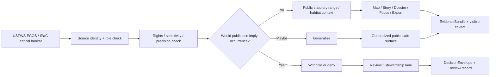

<!-- [KFM_META_BLOCK_V2]
doc_id: kfm://doc/NEEDS-VERIFICATION
title: USFWS Critical Habitat Gate
type: standard
version: v1
status: draft
owners: <NEEDS VERIFICATION>
created: 2026-04-14
updated: 2026-04-14
policy_label: public
related: [./README.md, ../../connectors/README.md, ../../standards/README.md, ../../standards/faircare/README.md, ../../standards/faircare/FAIRCARE-GUIDE.md, ../../standards/governance/ROOT_GOVERNANCE.md, ../../../contracts/README.md, ../../../schemas/README.md, ../../../policy/README.md, ../../../tests/README.md]
tags: [kfm, ecology, usfws, critical-habitat, gate, publication, faircare]
notes: [Target path is inferred as docs/domains/ecology/usfws_critical_habitat_gate.md because the current ecology lane explicitly invites narrow source-family leaves; exact mounted path, owner assignment, schema refs, and workflow enforcement remain NEEDS VERIFICATION.]
[/KFM_META_BLOCK_V2] -->

# USFWS Critical Habitat Gate

Fail-closed routing rules for using USFWS critical habitat data as **public statutory range / habitat context** in KFM without implying precise species occurrence.

> **Status:** draft  
> **Owners:** `NEEDS VERIFICATION`  
> **Target path (inferred):** `docs/domains/ecology/usfws_critical_habitat_gate.md`  
>       
> **Quick jumps:** [Scope](#scope) · [Repo fit](#repo-fit) · [Accepted inputs](#accepted-inputs) · [Exclusions](#exclusions) · [Source-role matrix](#source-role-matrix) · [Gate rule](#gate-rule) · [Routing outcomes](#routing-outcomes-proposed-starter-matrix) · [Diagram](#diagram) · [Illustrative output](#illustrative-output-proposed) · [Definition of done](#definition-of-done) · [FAQ](#faq)

> [!IMPORTANT]
> In KFM, **USFWS critical habitat is a federal statutory / habitat-context source**. It is **not** a stand-in for precise occurrence evidence, survey confirmation, or a complete biodiversity proof set.

> [!WARNING]
> This file is intentionally narrow. It documents **publication and interpretation rules** for one source family. It does **not** by itself prove mounted connectors, live policy bundles, exact schema filenames, workflow wiring, or merge-blocking enforcement on the active branch.

---

## Scope

This leaf defines the gate between **USFWS critical habitat source material** and **public-safe KFM trust surfaces**.

Use this document when the question is:

- how USFWS critical habitat should be classified inside KFM
- whether a critical-habitat layer may appear on a public map, story, dossier, or export
- what caveats must remain visible when critical habitat is shown
- when a request must be generalized, withheld, or pushed into steward review

This file does **not** attempt to:

- document all ecology connectors
- define a full species-occurrence ingestion workflow
- replace FAIR+CARE or governance standards
- authorize exact-location publication for sensitive taxa
- turn statutory habitat context into proof of on-the-ground species presence

### Truth labels used here

| Label | Meaning in this file |
| --- | --- |
| **CONFIRMED** | Directly grounded in current KFM doctrine or currently visible repo-adjacent documentation |
| **INFERRED** | Conservative interpretation of current KFM documentation patterns |
| **PROPOSED** | Recommended starter rule, shape, or machine surface not yet proven as mounted implementation |
| **UNKNOWN** | Not verified strongly enough to present as current repo fact |
| **NEEDS VERIFICATION** | Explicit placeholder requiring working-branch or runtime confirmation before merge |

[Back to top](#usfws-critical-habitat-gate)

---

## Repo fit

| Direction | Surface | Why it matters |
| --- | --- | --- |
| Parent lane | [`./README.md`](./README.md) | The ecology lane already distinguishes statutory habitat context from precise occurrence and sets publication-class expectations. |
| Source-onboarding discipline | [`../../connectors/README.md`](../../connectors/README.md) | Source identity, rights posture, cadence, validation, and proof-object expectations should stay explicit. |
| Standards boundary | [`../../standards/README.md`](../../standards/README.md) | This gate consumes standards; it does not become the standards lane. |
| FAIR+CARE law | [`../../standards/faircare/README.md`](../../standards/faircare/README.md) · [`../../standards/faircare/FAIRCARE-GUIDE.md`](../../standards/faircare/FAIRCARE-GUIDE.md) | Exact-location risk, rights, sensitivity, and review-bearing biodiversity rules stay upstream here. |
| Governance baseline | [`../../standards/governance/ROOT_GOVERNANCE.md`](../../standards/governance/ROOT_GOVERNANCE.md) | Fail-closed publication and trust-visible review posture should remain consistent. |
| Contract / schema / policy authority | [`../../../contracts/README.md`](../../../contracts/README.md) · [`../../../schemas/README.md`](../../../schemas/README.md) · [`../../../policy/README.md`](../../../policy/README.md) | Canonical machine law belongs upstream; this leaf should reference it, not quietly replace it. |
| Verification boundary | [`../../../tests/README.md`](../../../tests/README.md) | Any executable gate should eventually prove its outcomes, obligations, and negative paths here. |

### Working interpretation

This document is best treated as a **lane-local policy explainer and routing note** for one ecology source family. If implementation later becomes substantial, a narrower executable surface may deserve its own validator, tests, and machine-readable schema links.

[Back to top](#usfws-critical-habitat-gate)

---

## Accepted inputs

| Input class | Examples | Why it belongs here |
| --- | --- | --- |
| USFWS statutory habitat context | ECOS or IPaC critical-habitat polygons, service metadata, listing context | This is the primary source family governed by this gate. |
| Source identity and rights metadata | source descriptor fields, service URL, retrieval context, license / redistribution notes | KFM must preserve what the source is, not just the geometry it emitted. |
| Companion statutory context | KDWP status context, federal listing context, public-facing range notes | Helps prevent federal/statutory habitat context from being misread in isolation. |
| Sensitivity and review context | NatureServe-style sensitivity flags, stewardship notes, precise-location restrictions | Critical when a derived layer risks becoming an implicit occurrence surface. |
| Publication request context | requested surface (`map`, `story`, `dossier`, `focus`, `export`), intended audience, policy label | Determines whether the output may remain public-safe. |
| Evidence linkage | `SourceDescriptor`, `IngestReceipt`, `EvidenceBundle`, `DecisionEnvelope`, `ReviewRecord` references | Keeps the gate tied to KFM’s trust-object family rather than ad hoc prose. |

### Input rules

1. Preserve the **service identity** of the USFWS source.
2. Keep **critical habitat** and **occurrence evidence** as separate knowledge classes.
3. Record rights, sensitivity, and publication posture before public rendering.
4. Prefer explicit gate inputs over hidden assumptions in UI or workflow code.
5. Refuse silent promotion from “habitat context” to “species present here.”

[Back to top](#usfws-critical-habitat-gate)

---

## Exclusions

| Does **not** belong here | Put it here instead | Why |
| --- | --- | --- |
| Precise rare-species occurrence points | steward-only ecology review flows | This gate is for public statutory habitat context, not default-public precise locations. |
| Protected-area polygons used as species proof | ecology evidence / review materials with stronger corroboration | Protected land or habitat boundaries do not prove presence by themselves. |
| Survey methods, field sampling, or occurrence QA | narrower ecology ingestion / methods docs | Different burden, different evidence family. |
| Generic FAIR+CARE law | [`../../standards/faircare/`](../../standards/faircare/) | This leaf applies those rules locally; it does not restate the whole standard. |
| Canonical machine enums or policy registries | `contracts/`, `schemas/`, `policy/` | Stable machine authority should remain upstream. |
| Implementation claims about live automation | verified workflow, schema, and test surfaces | Do not imply mounted enforcement without proof. |
| Direct permit or legal advice | official agency materials and human review | KFM may preserve statutory context, but it is not itself the regulator. |

> [!CAUTION]
> Do **not** flatten USFWS critical habitat into a generic “species occurrence” layer.  
> Do **not** convert statutory habitat context into “confirmed presence” language in maps, stories, dossiers, or Focus responses.

[Back to top](#usfws-critical-habitat-gate)

---

## Source-role matrix

| Source family | Role in this gate | Safe public use | Must not be confused with |
| --- | --- | --- | --- |
| **USFWS ECOS / IPaC critical habitat** | Federal statutory and critical-habitat anchor | **Public statutory range / habitat context** | Precise occurrence evidence or a complete biodiversity proof set |
| **KDWP statutory lists / range context** | State status and Kansas-specific legal context | Public status context where rights permit | Federal critical habitat itself |
| **NatureServe / heritage sensitivity context** | Precision, restriction, and review pressure | Usually steward-facing or obligation-bearing support | Default-public geometry release |
| **Public occurrence aggregators** | Public redistributable occurrence context | Carefully scoped public context, still not auto-proving presence | Statutory habitat designation |
| **Protected-area / land-management layers** | Ownership or conservation-area context | Public land / management context | Species presence proof |

### Stable working rule

**USFWS critical habitat may support public-safe context, but it must remain visibly labeled as statutory habitat context.**  
It should not silently inherit the semantic burden of survey-confirmed occurrence, steward-reviewed precise location, or cross-source corroborated species presence.

[Back to top](#usfws-critical-habitat-gate)

---

## Gate rule

Before a USFWS critical-habitat asset or derivative reaches a public-safe KFM surface, the gate should be able to answer **yes** to all of the following:

1. **Identity is explicit.**  
   The output still names the USFWS service family and does not obscure its statutory-habitat role.

2. **Knowledge character is explicit.**  
   The surface makes clear that this is habitat / regulatory context, not occurrence confirmation.

3. **Precision risk is controlled.**  
   No companion join, clipping, ranking, or narrative phrasing turns the layer into an exact-location disclosure or an implicit “species is here” claim.

4. **Rights and sensitivity posture are visible.**  
   The request carries policy label, rights posture, and any needed review or withholding rule.

5. **Evidence linkage is intact.**  
   The public-facing output can still route back to an `EvidenceBundle` or equivalent trust object.

6. **Negative outcomes remain first-class.**  
   If the request is under-specified, over-precise, or semantically misleading, the system can generalize, withhold, escalate, abstain, deny, or error visibly rather than smoothing the problem away.

---

## Routing outcomes (PROPOSED starter matrix)

| Condition | Recommended publication class / result | Required visible cue | Typical obligations |
| --- | --- | --- | --- |
| USFWS critical habitat shown alone as statutory context, with preserved service identity | **Public statutory range / habitat context** | “Habitat / statutory context; not precise occurrence evidence” | `cite`, `preserve_source_identity` |
| Critical habitat is joined to other ecology layers in a way that increases exact-location or inference risk | **generalized** | Generalization note plus uncertainty / precision caveat | `generalize`, `review_required`, `cite` |
| Rights, redistribution posture, or source lineage is incomplete | **withheld** | Missing-rights or missing-lineage state | `review_required`, `complete_lineage` |
| Requested output would imply species presence from habitat polygons alone | **denied** | Explicit reason code / trust-visible refusal | `separate_occurrence_from_habitat` |
| Machine inputs or evidence linkage are malformed or unresolved | **error** | Error state with no silent fallback | `fix_input_contract` |

> [!NOTE]
> The table above is a **starter routing matrix**, not an asserted mounted enum set.  
> Where the working branch already defines authoritative reason codes, obligation codes, or result grammar, those upstream assets should win.

[Back to top](#usfws-critical-habitat-gate)

---

## Surface-specific rules

| Requested surface | Allowed use | Must stay visible | Must never imply |
| --- | --- | --- | --- |
| **Map** | Display critical habitat as statutory habitat context | source identity, policy label, public-context caveat | precise occurrence |
| **Story** | Use as narrative context for habitat / regulatory framing | date / source / caveat text | “therefore the species occurs exactly here” |
| **Dossier** | Include as one dependency or context layer | evidence links, gap notes, source role | complete ecology proof by itself |
| **Focus Mode** | Cite as bounded habitat context within an `EvidenceBundle` | citation, audit reference, scoped answer state | uncited occurrence claims |
| **Export** | Only public-safe, properly labeled context outputs | source lineage, caveat, release scope | raw precision or hidden joins |
| **Review / Stewardship** | Escalate ambiguous or higher-risk requests | review notes, obligations, decision refs | hidden approvals |

---

## Diagram



[Back to top](#usfws-critical-habitat-gate)

---

## Illustrative output (PROPOSED)

The sketch below is illustrative only. It is here to keep the gate concrete without pretending the exact mounted schema, enum set, or file location has already been verified.

```yaml
gate_id: ecology.usfws_critical_habitat_gate
subject_ref: dataset://usfws/ecos/critical-habitat/<version>
source_role: federal_statutory_habitat_context

requested_surface: map
publication_class: public_statutory_range_habitat_context

decision:
  result: generalized
  reason_codes:
    - sensitivity.exact_location
  obligation_codes:
    - generalize
    - review_required
    - cite

evidence:
  source_descriptor_ref: contracts-or-catalog-ref
  ingest_receipt_ref: receipts-ref
  evidence_bundle_ref: evidence-bundle-ref

audit_ref: audit://NEEDS-VERIFICATION
```

### Output intent

| Field | Why it matters |
| --- | --- |
| `source_role` | Prevents habitat context from silently becoming occurrence evidence. |
| `publication_class` | Keeps outward use tied to KFM’s public-safe context vocabulary. |
| `decision.result` | Makes negative outcomes first-class instead of implicit. |
| `reason_codes` / `obligation_codes` | Keeps review and remediation machine-readable once upstream registries are mounted. |
| `evidence_bundle_ref` | Preserves one-hop return to evidence. |
| `audit_ref` | Keeps runtime and review consequences traceable. |

[Back to top](#usfws-critical-habitat-gate)

---

## Definition of done

Use this checklist before merging or publishing this leaf.

- [ ] Source role is explicit: **USFWS critical habitat = statutory / habitat context**
- [ ] Public-safe language never equates habitat with confirmed occurrence
- [ ] Rights, sensitivity, and review posture are named
- [ ] Public outputs preserve source identity and visible caveats
- [ ] Exact-location or inference risk triggers generalization, withholding, denial, or review
- [ ] Related links resolve on the working branch
- [ ] Owner value is verified and placeholder removed
- [ ] Any machine-readable result shape is aligned to mounted contracts / schemas rather than local invention
- [ ] Tests, validator wiring, or review procedure are added separately if this gate becomes executable
- [ ] Remaining uncertainties are kept visible instead of smoothed into implementation claims

---

## FAQ

### Does critical habitat prove the species occurs at one exact point?

No. This file treats critical habitat as **statutory habitat context**, not precise occurrence evidence.

### Can a public map show USFWS critical habitat?

Yes, when it remains **public statutory range / habitat context** and preserves source identity plus an explicit caveat.

### Can this gate approve precise rare-species locations for public release?

No. That belongs in stricter review-bearing ecology flows and may still require generalization or withholding.

### Is a protected-area or refuge polygon enough to prove species presence?

No. Management or habitat context is not the same thing as occurrence evidence.

### Does this file document a live mounted validator?

Not yet. It is written to be implementation-friendly, but mounted validator paths, schemas, and workflow enforcement remain **NEEDS VERIFICATION** unless directly surfaced.

[Back to top](#usfws-critical-habitat-gate)

---

## Appendix

<details>
<summary><strong>Open verification items</strong></summary>

### Working-branch checks still needed

- exact committed target path
- owner assignment for this leaf
- whether a narrower executable validator already exists
- canonical reason / obligation code registries, if mounted
- exact schema refs for `DecisionEnvelope`, `EvidenceBundle`, and any ecology-specific result contract
- whether any current workflow, policy bundle, or tests already call this gate
- whether companion USFWS service references should point to ECOS only, IPaC only, or both in the mounted branch

### Deliberate non-claims

This draft does **not** claim:

- live connector completeness
- active merge-blocking policy enforcement
- mounted CI workflow names
- exact DTO or API route names
- current public release history for this gate
- precise downstream artifact paths beyond the inferred docs location

</details>
