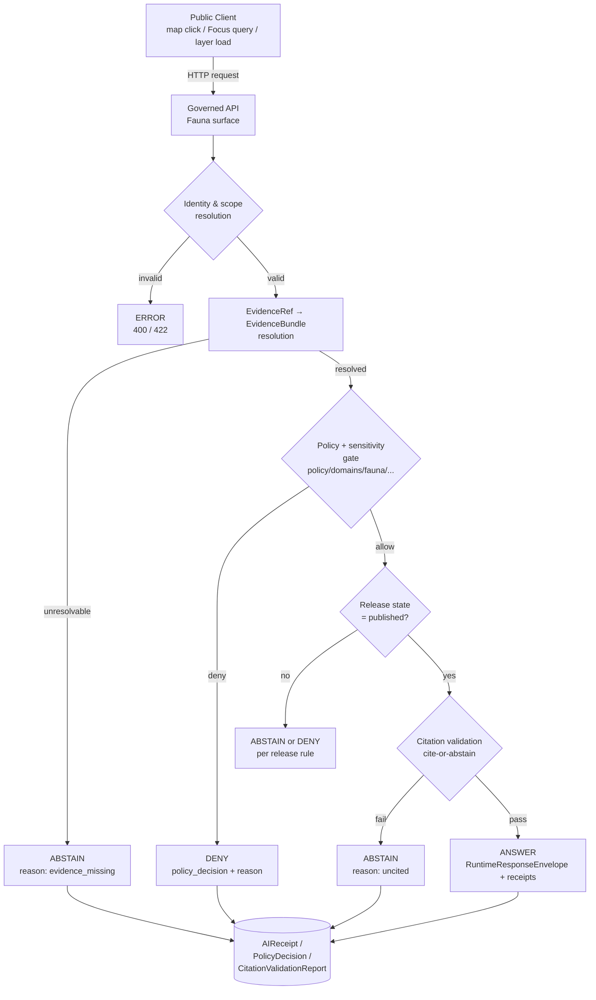

<!-- [KFM_META_BLOCK_V2]
doc_id: kfm://doc/domains/fauna/api-contracts
title: Fauna — API Contracts
type: standard
version: v1
status: draft
owners: <fauna-domain-steward> + <contract-schema-steward>  # TODO confirm in OWNERS
created: 2026-05-16
updated: 2026-05-16
policy_label: public
related:
  - docs/domains/fauna/README.md
  - docs/domains/fauna/SCHEMAS.md
  - docs/domains/fauna/POLICY.md
  - docs/runbooks/fauna/SOURCE_REFRESH_RUNBOOK.md
  - docs/architecture/governed-api.md
  - docs/architecture/governed-ai/ROUTE_MAP.md
  - contracts/OBJECT_MAP.md
  - schemas/contracts/v1/runtime/decision_envelope.schema.json
  - schemas/contracts/v1/runtime/runtime_response_envelope.schema.json
  - schemas/contracts/v1/ui/evidence_drawer_payload.schema.json
  - schemas/contracts/v1/map/layer_manifest.schema.json
  - schemas/contracts/v1/ai/ai_receipt.schema.json
tags: [kfm, fauna, api, contracts, governed-api]
notes:
  - All route paths, DTO field lists, and status codes are PROPOSED until verified against a mounted repo and an accepted ADR.
  - Exact Fauna feature/detail resolver route remains UNKNOWN per Domains Atlas §7.J.
[/KFM_META_BLOCK_V2] -->

# Fauna — API Contracts

> Governed API surfaces, DTOs, finite outcomes, sensitivity posture, and validation
> contracts for the **Fauna** domain lane.


| Field          | Value                                                                                  |
| -------------- | -------------------------------------------------------------------------------------- |
| **Status**     | `draft`                                                                                |
| **Owners**     | `<fauna-domain-steward>` + `<contract-schema-steward>` (placeholders — confirm in OWNERS) |
| **Last updated** | 2026-05-16                                                                           |
| **Schema home** | `schemas/contracts/v1/` (per `ADR-0001-schema-home`) — Fauna-specific schemas: `schemas/contracts/v1/domains/fauna/` |
| **Truth posture** | CONFIRMED doctrine; **PROPOSED** implementation. Exact routes, DTO field lists, and HTTP code mappings are **UNKNOWN** until repo verification. |

---

## Mini Table of Contents

1. [Scope and Boundary](#1-scope-and-boundary)
2. [Finite Outcome Grammar](#2-finite-outcome-grammar)
3. [Surface Map (Fauna API Contracts at a Glance)](#3-surface-map-fauna-api-contracts-at-a-glance)
4. [Request → Decision → Response Flow](#4-request--decision--response-flow)
5. [Surface 1 — Fauna Feature / Detail Resolver](#5-surface-1--fauna-feature--detail-resolver)
6. [Surface 2 — Fauna Layer Manifest Resolver](#6-surface-2--fauna-layer-manifest-resolver)
7. [Surface 3 — Fauna Evidence Drawer Payload](#7-surface-3--fauna-evidence-drawer-payload)
8. [Surface 4 — Fauna Focus Mode Answer](#8-surface-4--fauna-focus-mode-answer)
9. [Surface 5 — Correction Submit & Review Decision](#9-surface-5--correction-submit--review-decision)
10. [Sensitivity Posture and Required Denials](#10-sensitivity-posture-and-required-denials)
11. [Receipts and Audit Trail](#11-receipts-and-audit-trail)
12. [Validators, Tests, and Negative Fixtures](#12-validators-tests-and-negative-fixtures)
13. [PROPOSED File Homes](#13-proposed-file-homes)
14. [Open Questions and Verification Backlog](#14-open-questions-and-verification-backlog)
15. [Related Docs](#15-related-docs)

---

## 1. Scope and Boundary

**CONFIRMED doctrine / PROPOSED implementation.** This document specifies the
**governed API contracts** exposed by the Fauna domain lane: the externally observable
shape of requests, the DTOs returned, the finite outcome grammar, the sensitivity
gates that may convert an apparent answer into `ABSTAIN` or `DENY`, and the receipts
emitted as audit trail. It does **not** define internal storage, internal pipeline
shapes, or internal source-of-truth structures — those live behind the Fauna trust
membrane and reach public clients only through the surfaces below.

**This document is contract-bearing for:**

- Surfaces, DTOs, and outcomes that public or semi-public Fauna clients may rely on.
- Sensitivity-driven denial behavior on Fauna surfaces.
- Receipt and proof-object shape required at every Fauna runtime response.

**This document is not:**

- The schema authority. Each DTO has a separate schema file under
  `schemas/contracts/v1/...` (PROPOSED). The schema file wins on field shape; this doc
  cites it.
- The policy authority. Policy rules and obligations live under
  `policy/domains/fauna/...` (PROPOSED). This doc references their behavioral surface.
- The source registry. Fauna source descriptors live under
  `data/registry/sources/fauna/...` and per-source SOPs in
  `docs/runbooks/fauna/SOURCE_REFRESH_RUNBOOK.md`.

> [!IMPORTANT]
> Every surface below is **PROPOSED**. Exact Fauna feature/detail resolver routes are
> recorded as **UNKNOWN** in the Domains Atlas. Treat HTTP verbs, paths, and status
> codes in this document as design candidates pending an ADR and a mounted-repo verification pass.

[Back to top](#fauna--api-contracts)

---

## 2. Finite Outcome Grammar

**CONFIRMED doctrine.** Every Fauna runtime response is a finite envelope. A public
client receives exactly one of four outcomes; protocol-level success (an HTTP 200) is
**not** the same as `ANSWER`. The envelope reason carries the KFM truth label.

| Outcome   | Meaning                                                                                   | Required body                              |
| --------- | ----------------------------------------------------------------------------------------- | ------------------------------------------ |
| `ANSWER`  | Evidence resolved, policy allows, release state is `published`, citation validation passed | `evidence_refs`, `policy_decision`, payload |
| `ABSTAIN` | Evidence is missing, ambiguous, or fails citation validation                              | `reason_code`, `evidence_refs[]` (may be empty) |
| `DENY`    | Policy, rights, sensitivity, or release state blocks the request                          | `policy_decision`, `reason_code`           |
| `ERROR`   | Validation, schema, or system failure                                                     | `error_code`, `details`                    |

> [!NOTE]
> `200 + ABSTAIN` is a successful interaction with a deliberate "no evidence" answer.
> A public client must render `ABSTAIN`/`DENY`/`ERROR` legibly — never as a generic
> "missing data" or "500 try again." This is a standing UX requirement on every Fauna
> client. PROPOSED — see Verification Backlog item **V-FAUNA-API-002**.

### 2.1 PROPOSED HTTP code mapping

> [!CAUTION]
> The mapping below is a **design candidate**. It is not enforced anywhere yet and
> has not been ratified by an ADR. **NEEDS VERIFICATION** before any client treats
> these codes as contract.

| Outcome   | PROPOSED HTTP code | Notes                                                                  |
| --------- | ------------------ | ---------------------------------------------------------------------- |
| `ANSWER`  | `200`              | Body carries `outcome: "ANSWER"`; not all `200`s are answers.          |
| `ABSTAIN` | `200`              | Body carries `outcome: "ABSTAIN"` and a reason; *not* `404`.           |
| `DENY`    | `403`              | Body carries `outcome: "DENY"` with `policy_decision` and reason code. |
| `ERROR`   | `400` / `422` / `500` | Distinguish bad request (`400`/`422`) from server failure (`500`). |

[Back to top](#fauna--api-contracts)

---

## 3. Surface Map (Fauna API Contracts at a Glance)

PROPOSED surfaces, drawn from the Domains Atlas §7.J for Fauna and the generic governed
API matrix in the Encyclopedia §J and Whole-UI report §17.1. Routes shown are
**proposed**; exact paths remain UNKNOWN until verified.

| # | Surface                              | PROPOSED route (illustrative)                          | DTO / schema (PROPOSED)                                  | Finite outcomes                  | Status                                       |
| - | ------------------------------------ | ------------------------------------------------------ | -------------------------------------------------------- | -------------------------------- | -------------------------------------------- |
| 1 | Fauna feature / detail resolver      | `GET /api/v1/domains/fauna/features/{id}`              | `FeatureDTO` (Fauna projection) + `EvidenceRef[]`        | ANSWER / ABSTAIN / DENY / ERROR  | PROPOSED; **exact route UNKNOWN**            |
| 2 | Fauna layer manifest resolver        | `GET /api/v1/layers/{layer_id}/manifest`               | `LayerManifest` (Fauna-tagged)                           | ANSWER / DENY / ERROR            | PROPOSED; public-safe release only           |
| 3 | Fauna Evidence Drawer payload        | `POST /api/v1/claims/resolve` *(map-feature path)*     | `EvidenceDrawerPayload` + `EvidenceBundle` projection    | ANSWER / ABSTAIN / DENY / ERROR  | PROPOSED; evidence- and policy-filtered      |
| 4 | Fauna Focus Mode answer              | `POST /api/v1/focus/query`                             | `RuntimeResponseEnvelope` + `AIReceipt`                  | ANSWER / ABSTAIN / DENY / ERROR  | PROPOSED; AI never root truth                |
| 5 | Correction submit                    | `POST /api/v1/corrections`                             | `CorrectionNoticeCandidate`                              | ACCEPTED / DENY / ERROR          | PROPOSED                                     |
| 6 | Review decision (steward-only)       | `POST /api/v1/review/{queue}/{id}/decision`            | `ReviewRecord`                                           | ALLOW / RESTRICT / DENY / ERROR  | PROPOSED                                     |
| 7 | Evidence bundle resolution           | `GET /api/v1/evidence/{bundle_id}`                     | `EvidenceBundle`                                         | ANSWER / DENY / ERROR            | PROPOSED                                     |

**Schema responsibility root:** `schemas/contracts/v1/` — per
[ADR-0001 (schema home)](../../adr/ADR-0001-schema-home.md). Fauna-specific schemas
are placed under `schemas/contracts/v1/domains/fauna/`. **PROPOSED**; verify against
mounted repo evidence and Directory Rules §6 / §12 before treating as canonical.

[Back to top](#fauna--api-contracts)

---

## 4. Request → Decision → Response Flow

The diagram below shows how a single Fauna request — say, a map click on an occurrence
marker — is processed by the trust membrane. The grammar is the same for every Fauna
surface: **resolve evidence → apply policy and sensitivity gates → emit a finite envelope with receipts**.



> [!NOTE]
> **PROPOSED.** The flow reflects KFM doctrine on cite-or-abstain, evidence resolution,
> and policy gating, but the precise call graph (which adapter resolves evidence, which
> rule engine evaluates policy, which signer emits receipts) is **NEEDS VERIFICATION**
> against the mounted repo.

[Back to top](#fauna--api-contracts)

---

## 5. Surface 1 — Fauna Feature / Detail Resolver

**Purpose.** Resolve a single Fauna feature (e.g., an occurrence, a range polygon, a
seasonal range, a sensitive site reference) to a `FeatureDTO` plus the `EvidenceRef`
list that supports its claims.

### 5.1 Request (PROPOSED)

| Field           | Type      | Required | Notes                                                     |
| --------------- | --------- | -------- | --------------------------------------------------------- |
| `id`            | string    | yes      | Deterministic Fauna feature id. **PROPOSED** identity basis: source id + object role + temporal scope + normalized digest. |
| `time_context`  | string    | no       | ISO-8601 / interval. Defaults to release-current.         |
| `bbox`          | array     | no       | Used by some clients; **never** used to bypass geoprivacy.|
| `user_role`     | string    | no       | Used only for policy evaluation; never reflected in body. |

> [!CAUTION]
> The resolver does **not** accept "raw geometry" or "internal coordinates" arguments.
> Requests that imply RAW / WORK / QUARANTINE access are denied (see §10).

### 5.2 Response — `ANSWER` body (PROPOSED)

The DTO is the Fauna projection of the generic `FeatureDTO` (PROPOSED schema home:
`schemas/contracts/v1/domains/fauna/feature_dto.schema.json`). The shape illustrated
below is **PROPOSED / illustrative**; field names and types may change.

```json
{
  "outcome": "ANSWER",
  "feature": {
    "feature_id": "kfm:fauna:occurrence:<sha256-prefix>",
    "object_family": "Occurrence Public",
    "taxon_ref": "kfm:fauna:taxon:<digest>",
    "geometry": {
      "type": "Point",
      "coordinates": [-98.45, 38.74],
      "geoprivacy_transform": {
        "method": "tile_precision",
        "params": {"z": 9},
        "redaction_receipt_ref": "kfm:receipt:redaction:<id>"
      }
    },
    "observed_time": "2025-08-12",
    "release_time": "2026-04-01",
    "source_role": "observation",
    "policy_label": "public",
    "sensitivity": "generalize"
  },
  "evidence_refs": [
    {"role": "primary", "ref": "kfm:evidence:bundle:<digest>"}
  ],
  "policy_decision": {
    "decision_id": "kfm:policy:decision:<id>",
    "outcome": "allow",
    "reasons": ["rights_status=public", "review_state=approved"]
  },
  "citation_validation": {
    "verdict": "ok",
    "resolved": 1,
    "missing": 0
  }
}
```

### 5.3 Outcome behavior

| Outcome   | Trigger (PROPOSED)                                                                            |
| --------- | --------------------------------------------------------------------------------------------- |
| `ANSWER`  | Feature is resolved, released, policy-allowed, and cited.                                     |
| `ABSTAIN` | Feature exists in lineage but lacks resolvable `EvidenceBundle` or fails citation validation. |
| `DENY`    | Feature is sensitive (nest / den / roost / hibernacula / spawning / steward-controlled) and no geoprivacy transform + Redaction Receipt has been recorded; OR rights status is unresolved; OR review state blocks release. |
| `ERROR`   | Invalid id, schema mismatch, or system failure.                                               |

[Back to top](#fauna--api-contracts)

---

## 6. Surface 2 — Fauna Layer Manifest Resolver

**Purpose.** Return the release-bound manifest for a published Fauna map layer
(`LayerManifest`): release state, asset digests, allowed fields per tile, valid/release
time, evidence binding, and rollback target.

### 6.1 Request (PROPOSED)

`GET /api/v1/layers/{layer_id}/manifest`

`layer_id` must reference a Fauna-tagged released layer. Unreleased / candidate layers
are not addressable on this surface.

### 6.2 Response — `ANSWER` body shape (PROPOSED)

| Field                  | Notes                                                                                          |
| ---------------------- | ---------------------------------------------------------------------------------------------- |
| `layer_id`             | Fauna-domain-tagged layer identifier.                                                          |
| `release_state`        | `published` only on this surface; candidate / quarantine states are not exposed.               |
| `tile_field_allowlist` | The set of fields that may appear in the served PMTiles / vector tile. Sensitive fields excluded. |
| `evidence_ref_field`   | Per-feature `EvidenceRef` used by the Evidence Drawer.                                         |
| `temporal_fields`      | Valid / release / observed time fields surfaced for time slider use.                           |
| `release_manifest_ref` | `ReleaseManifest` digest pinning this layer's release.                                         |
| `rollback_target`      | The prior released layer manifest, for emergency rollback.                                     |

> [!WARNING]
> The `tile_field_allowlist` is a **trust contract**, not a UI convenience.
> Validator tests must enforce that no field outside the allowlist appears in published
> Fauna tiles — see Validators §12 and `tile-field-allowlist` tests. PROPOSED.

### 6.3 Outcome behavior

| Outcome  | Trigger (PROPOSED)                                                                |
| -------- | --------------------------------------------------------------------------------- |
| `ANSWER` | Layer is published and manifest closure passes.                                   |
| `DENY`   | Layer is not released, or layer is restricted to steward review surfaces only.    |
| `ERROR`  | Layer id invalid or manifest fails schema validation.                             |

Note: there is no `ABSTAIN` on this surface — the manifest either exists and is
released, or it is denied / errored.

[Back to top](#fauna--api-contracts)

---

## 7. Surface 3 — Fauna Evidence Drawer Payload

**Purpose.** When a public client selects a Fauna feature on the map, the Drawer
payload exposes only what is policy-safe: the claim, its `EvidenceRef`s, source roles,
review state, rights, sensitivity, any transforms applied, and correction links.

### 7.1 Request (PROPOSED)

`POST /api/v1/claims/resolve` with a feature reference produced by the map adapter.

The Drawer payload is delivered through the same governed API client as other Fauna
surfaces; no direct database query, no direct evidence-store call, and no model call
ever reaches the browser.

### 7.2 Response (PROPOSED — illustrative)

```json
{
  "outcome": "ANSWER",
  "drawer": {
    "feature_id": "kfm:fauna:occurrence:<digest>",
    "layer_id": "fauna.occurrence.public.v1",
    "claim_summary": "Observation of <taxon>, generalized to z=9 tile.",
    "evidence_bundle_refs": ["kfm:evidence:bundle:<digest>"],
    "source_summary": [
      {"source_id": "kfm:source:<id>", "role": "observation", "rights_status": "public"}
    ],
    "citations": [{"resolved": true, "ref": "kfm:evidence:<id>"}],
    "policy_state": {"sensitivity": "generalize", "policy_label": "public"},
    "release_state": "published",
    "limitations": ["geoprivacy_transform: tile_precision z=9"],
    "transforms": [{"redaction_receipt_ref": "kfm:receipt:redaction:<id>"}],
    "correction_link": "/corrections/new?subject=kfm:fauna:occurrence:<digest>"
  },
  "evidence_refs": [{"role": "primary", "ref": "kfm:evidence:bundle:<digest>"}],
  "policy_decision": {"outcome": "allow"},
  "citation_validation": {"verdict": "ok"}
}
```

### 7.3 Outcome behavior

The Drawer is the most user-facing trust surface; **negative outcomes must render**,
not hide.

| Outcome   | Drawer rendering (PROPOSED)                                                                    |
| --------- | ---------------------------------------------------------------------------------------------- |
| `ANSWER`  | Claim + citations + source roles + sensitivity badge + correction link.                        |
| `ABSTAIN` | "Evidence not available for this feature" + reason code + correction link.                     |
| `DENY`    | "Restricted — sensitive site / unresolved rights" + reason code; no geometry, no coordinates.  |
| `ERROR`   | "Cannot load evidence for this feature." Surface the request id; never the stack trace.        |

[Back to top](#fauna--api-contracts)

---

## 8. Surface 4 — Fauna Focus Mode Answer

**Purpose.** Bounded synthesis through the governed AI adapter. A Focus query about
Fauna (e.g., "summarize what released evidence says about this taxon's range in this
HUC") is answered only over **released** `EvidenceBundle`s; an `AIReceipt` is emitted
for every call.

### 8.1 Request (PROPOSED)

`POST /api/v1/focus/query`

| Field                  | Notes                                                                            |
| ---------------------- | -------------------------------------------------------------------------------- |
| `question`             | Free text scoped to released evidence.                                           |
| `map_context_envelope` | Bounded map context: visible layers, bounds, zoom, time window, selected features. |
| `evidence_refs`        | Optional pre-resolved `EvidenceRef`s to constrain scope.                         |
| `policy_context`       | Caller-asserted scope; the server reasserts via policy decision.                 |
| `user_role`            | Used only for policy evaluation.                                                 |

### 8.2 Response — `RuntimeResponseEnvelope` + `AIReceipt` (PROPOSED)

The shape is the generic `FocusModeResponse` / `RuntimeResponseEnvelope`. For Fauna
the additional discipline is:

- `ABSTAIN` whenever evidence is insufficient — including unanswerable questions about
  sensitive sites.
- `DENY` whenever the question would require exposing sensitive geometry, restricted
  personal/DNA inference, or emergency-alert behavior. KFM is **not** an alert
  authority.
- Every Focus call emits an `AIReceipt` recording prompt scope, evidence used, model
  identity, policy decision, and outcome.

> [!IMPORTANT]
> The Fauna Focus Mode answer must never contain a claim not backed by a resolved,
> released `EvidenceBundle`. Citation validation runs *before* the answer is rendered.
> If citation validation fails, the outcome is `ABSTAIN`, even if the model produced
> fluent text. **CONFIRMED doctrine; PROPOSED implementation.**

[Back to top](#fauna--api-contracts)

---

## 9. Surface 5 — Correction Submit & Review Decision

**Purpose.** Provide a public correction path for Fauna claims and a steward-only
review decision surface for promotion / restriction / denial of candidate transitions.

### 9.1 Correction submit

`POST /api/v1/corrections`

Public surface. Accepts a `CorrectionNoticeCandidate` referencing a published Fauna
claim. The server records the candidate and emits a receipt; it does **not** mutate
the published artifact. Promotion of the correction is a separate governed transition.

| Outcome    | Trigger (PROPOSED)                                            |
| ---------- | ------------------------------------------------------------- |
| `ACCEPTED` | Candidate is well-formed and references a published claim.    |
| `DENY`     | Reference is to RAW/WORK/QUARANTINE or a restricted lane.     |
| `ERROR`    | Malformed candidate or schema validation failure.             |

### 9.2 Review decision (steward-only)

`POST /api/v1/review/{queue}/{id}/decision`

Steward-authenticated surface. Emits a `ReviewRecord` with decision
`ALLOW` / `RESTRICT` / `DENY` and policy-linked obligations.

> [!CAUTION]
> The review decision surface is **never** exposed to public clients. Treat any
> apparent public path to this surface as a defect. **PROPOSED**; verify via
> `policy/domains/fauna/...` and an authorization smoke test.

[Back to top](#fauna--api-contracts)

---

## 10. Sensitivity Posture and Required Denials

**CONFIRMED / PROPOSED.** Exact sensitive occurrences, nests, dens, roosts,
hibernacula, spawning sites, and steward-controlled records **fail closed**. Public
exact occurrence tiles for sensitive taxa are denied. Unclear rights, unresolved source
role, missing evidence, unresolved sensitivity, or absent release state blocks public
promotion.

### 10.1 Required denials on every Fauna surface

| Trigger                                                                       | Required outcome |
| ----------------------------------------------------------------------------- | ---------------- |
| Request implies RAW / WORK / QUARANTINE access                                | `DENY`           |
| Exact sensitive-location exposure (nest, den, roost, hibernacula, spawning)   | `DENY`           |
| Restricted personal / DNA inference about living persons                      | `DENY`           |
| Request would substitute for emergency alerting                               | `DENY`           |
| Answer would assert an uncited authoritative claim                            | `ABSTAIN`        |
| Source rights unresolved or `rights_status != public`                         | `DENY`           |
| Review state required and not approved                                        | `DENY` or `ABSTAIN` per policy |
| Geoprivacy transform required but no Redaction Receipt exists                 | `DENY`           |

### 10.2 Geoprivacy transform record

When geometry is generalized or buffered before release, every transform must be
recorded in a Redaction Receipt and referenced from the served feature. PROPOSED
shape:

```json
{
  "transform_method": "tile_precision",
  "params": {"z": 9},
  "policy_ref": "policy/domains/fauna/sensitivity.rego#generalize_tiles",
  "redaction_receipt_ref": "kfm:receipt:redaction:<id>",
  "kept_fields": ["taxon_ref", "observed_time", "source_role"],
  "removed_fields": ["precise_point", "site_descriptor"]
}
```

> [!WARNING]
> A transform without a resolvable Redaction Receipt is **not** a transform. The
> served feature must be denied until the receipt is recorded. PROPOSED enforcement
> path: `tile-field-allowlist` validator + `redaction-receipt-resolution` validator.

[Back to top](#fauna--api-contracts)

---

## 11. Receipts and Audit Trail

**CONFIRMED doctrine.** Every Fauna runtime response emits the receipts required to
reconstruct the decision after the fact.

| Receipt                       | When emitted                                  | PROPOSED schema home                                                  |
| ----------------------------- | --------------------------------------------- | --------------------------------------------------------------------- |
| `RuntimeResponseEnvelope`     | Every response on every surface               | `schemas/contracts/v1/runtime/runtime_response_envelope.schema.json`  |
| `PolicyDecision`              | Every gated request                           | `schemas/contracts/v1/policy/policy_decision.schema.json`             |
| `CitationValidationReport`    | Every `ANSWER` and every Focus call           | `schemas/contracts/v1/evidence/citation_validation_report.schema.json`|
| `AIReceipt`                   | Every Focus Mode answer                       | `schemas/contracts/v1/ai/ai_receipt.schema.json`                      |
| `Redaction Receipt`           | Every geoprivacy transform applied to a Fauna geometry | `schemas/contracts/v1/receipts/redaction_receipt.schema.json` (PROPOSED) |
| `ReleaseManifest` reference   | Every published layer manifest                | `schemas/contracts/v1/map/map_release_manifest.schema.json`           |
| `PromotionDecision` reference | Every release-state transition                | `schemas/contracts/v1/governance/promotion_decision.schema.json` (PROPOSED) |

> [!NOTE]
> Receipts are **process memory and audit trail**. They are not the release authority.
> The release authority is `ReleaseManifest`. Do not place receipts in `release/`.

[Back to top](#fauna--api-contracts)

---

## 12. Validators, Tests, and Negative Fixtures

PROPOSED validator set required before any Fauna surface advances past
`docs/runbooks/fauna/SOURCE_REFRESH_RUNBOOK.md` synthetic-fixture stage.

| Validator / test                                  | Surface(s) covered                | Status   |
| ------------------------------------------------- | --------------------------------- | -------- |
| Source-role authority tests                       | 1, 2, 7                           | PROPOSED |
| Taxonomy resolution and ambiguity tests           | 1, 3, 4                           | PROPOSED |
| Occurrence restricted/public split tests          | 1, 2, 3                           | PROPOSED |
| Redaction Receipt validation                      | 1, 2, 3                           | PROPOSED |
| Tile field allowlist tests                        | 2                                 | PROPOSED |
| Runtime Response Envelope negative cases          | All                               | PROPOSED |
| Citation validation (`cite-or-abstain`)           | 1, 3, 4                           | PROPOSED |
| Policy deny tests (sensitive sites, RAW access)   | All                               | PROPOSED |
| Release manifest closure                          | 2                                 | PROPOSED |
| Rollback drill                                    | 2                                 | PROPOSED |
| No-network fixtures (synthetic Fauna data only)   | All                               | PROPOSED |
| Non-regression for prior released lineage         | 2                                 | PROPOSED |

<details>
<summary><strong>Required negative fixtures (PROPOSED list)</strong></summary>

- Fauna feature request for a sensitive taxon's exact coordinates → must produce `DENY`.
- Layer manifest request for an unreleased candidate → must produce `DENY`.
- Drawer payload request for a feature whose `EvidenceBundle` is unresolvable → must produce `ABSTAIN`.
- Focus query that would only be answerable by citing unreleased evidence → must produce `ABSTAIN`.
- Focus query that solicits emergency alerting → must produce `DENY`.
- Correction submit referencing a RAW path → must produce `DENY`.
- Geoprivacy transform applied without a resolvable Redaction Receipt → must produce `DENY` on read.
- Tile produced with a field outside the allowlist → must fail the `tile-field-allowlist` validator at release gate.
- Citation validation report with `verdict: fail` reaching the renderer → must be intercepted and converted to `ABSTAIN`.
- Source descriptor with `rights_status` unresolved → must block public release path.

</details>

[Back to top](#fauna--api-contracts)

---

## 13. PROPOSED File Homes

Per Directory Rules §6, §12, and `ADR-0001-schema-home`. **PROPOSED** — verify against
mounted repo state before treating as canonical. Do not create parallel schema /
contract / policy homes without an ADR.

```text
docs/domains/fauna/
├── README.md
├── API_CONTRACTS.md          # this document
├── SCHEMAS.md                # PROPOSED — DTO field reference
├── POLICY.md                 # PROPOSED — sensitivity & rights policy doc
└── SOURCES.md                # PROPOSED — source family overview

contracts/domains/fauna/
├── README.md
├── OBJECT_MAP.md             # crosswalk: object family → DTO → schema → policy
└── ...

schemas/contracts/v1/domains/fauna/
├── feature_dto.schema.json
├── occurrence_public.schema.json
├── occurrence_restricted.schema.json
├── range_polygon.schema.json
├── seasonal_range.schema.json
├── migration_route.schema.json
├── sensitive_site.schema.json
├── conservation_status.schema.json
├── taxon.schema.json
└── taxon_crosswalk.schema.json

schemas/contracts/v1/runtime/
├── decision_envelope.schema.json
└── runtime_response_envelope.schema.json

schemas/contracts/v1/ui/
└── evidence_drawer_payload.schema.json

schemas/contracts/v1/map/
├── layer_manifest.schema.json
└── map_release_manifest.schema.json

policy/domains/fauna/
├── sensitivity.rego
├── publication.rego
└── README.md

tests/domains/fauna/
├── contracts/
├── policy/
├── tile_field_allowlist/
└── negative_fixtures/

fixtures/domains/fauna/
├── synthetic/
└── golden/

docs/runbooks/fauna/
└── SOURCE_REFRESH_RUNBOOK.md   # existing — referenced by this contract
```

> [!NOTE]
> The lane pattern above is the **shape**, not a claim that every path already exists.
> A mounted-repo verification pass (see Verification Backlog **V-FAUNA-API-001**) is
> required before any client treats these paths as present.

[Back to top](#fauna--api-contracts)

---

## 14. Open Questions and Verification Backlog

| ID                  | Item                                                                                          | Evidence that would settle it                                                                 | Status              |
| ------------------- | --------------------------------------------------------------------------------------------- | --------------------------------------------------------------------------------------------- | ------------------- |
| `V-FAUNA-API-001`   | Confirm exact Fauna feature/detail resolver route                                             | Mounted-repo API app, OpenAPI/route registry, or accepted ADR                                 | UNKNOWN             |
| `V-FAUNA-API-002`   | Confirm HTTP code mapping for ANSWER/ABSTAIN/DENY/ERROR                                       | Mounted-repo response middleware + accepted ADR                                               | NEEDS VERIFICATION  |
| `V-FAUNA-API-003`   | Confirm schema home placement under `schemas/contracts/v1/domains/fauna/`                     | `schemas/` tree inspection + ADR-0001 conformance check                                       | NEEDS VERIFICATION  |
| `V-FAUNA-API-004`   | Verify Redaction Receipt schema and resolution path                                           | `schemas/contracts/v1/receipts/redaction_receipt.schema.json` + resolver implementation       | NEEDS VERIFICATION  |
| `V-FAUNA-API-005`   | Verify tile-field-allowlist validator presence and CI wiring                                  | `tools/validators/...` + CI workflow inspection                                               | NEEDS VERIFICATION  |
| `V-FAUNA-API-006`   | Confirm Focus Mode adapter contract for Fauna (no direct browser-to-model path)               | `docs/adr/ADR-focus-model-adapter-boundary.md` + runtime path inspection                      | NEEDS VERIFICATION  |
| `V-FAUNA-API-007`   | Confirm review queue surface is steward-authenticated and not publicly addressable            | API app + auth middleware + authorization smoke test                                          | NEEDS VERIFICATION  |
| `V-FAUNA-API-008`   | Confirm rollback target binding on every Fauna `LayerManifest`                                | Released `LayerManifest` inspection + rollback drill receipts                                 | NEEDS VERIFICATION  |
| `V-FAUNA-API-009`   | Confirm citation-validation interception order (before render, not after)                     | Focus pipeline inspection + negative fixture pass                                             | NEEDS VERIFICATION  |
| `V-FAUNA-API-010`   | Confirm naming of `CorrectionNoticeCandidate` vs `CorrectionNotice` in current schemas        | `schemas/contracts/v1/review/...`                                                             | UNKNOWN             |

[Back to top](#fauna--api-contracts)

---

## 15. Related Docs

- [`docs/domains/fauna/README.md`](./README.md) — Fauna lane overview *(TODO confirm)*
- [`docs/domains/fauna/SCHEMAS.md`](./SCHEMAS.md) — DTO field reference *(TODO)*
- [`docs/domains/fauna/POLICY.md`](./POLICY.md) — sensitivity & rights policy *(TODO)*
- [`docs/runbooks/fauna/SOURCE_REFRESH_RUNBOOK.md`](../../runbooks/fauna/SOURCE_REFRESH_RUNBOOK.md) — source refresh runbook
- [`docs/architecture/governed-api.md`](../../architecture/governed-api.md) — generic governed API architecture *(TODO confirm path)*
- [`docs/architecture/governed-ai/ROUTE_MAP.md`](../../architecture/governed-ai/ROUTE_MAP.md) — Focus and AI-adjacent API surfaces *(TODO)*
- [`docs/doctrine/directory-rules.md`](../../doctrine/directory-rules.md) — Directory Rules
- [`docs/adr/ADR-0001-schema-home.md`](../../adr/ADR-0001-schema-home.md) — schema home decision
- [`contracts/OBJECT_MAP.md`](../../../contracts/OBJECT_MAP.md) — object family ↔ schema ↔ policy crosswalk
- [`KFM_Domains_Culmination_Atlas_v1_1.pdf`](../../../) §7 — Fauna domain atlas chapter

---

### Footer

**Truth posture:** CONFIRMED doctrine; **PROPOSED** implementation. Every route, DTO
field list, and HTTP code mapping in this document remains a design candidate until
verified against mounted-repo evidence and ratified by an ADR.
**Last updated:** 2026-05-16 ·
**Version:** v1 (draft) ·
[Back to top](#fauna--api-contracts)
