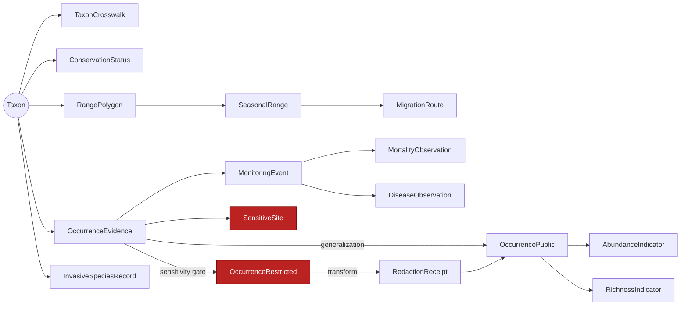
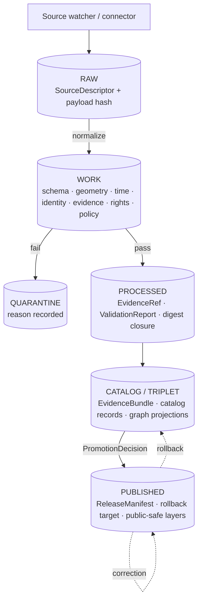

<!-- [KFM_META_BLOCK_V2]
doc_id: kfm://doc/domains/fauna/architecture
title: Fauna Domain Architecture
type: standard
version: v1
status: draft
owners: <fauna-lane-owner@kfm> <governance-steward@kfm> <sensitivity-reviewer@kfm>
created: 2026-05-16
updated: 2026-05-29
policy_label: public
related: [docs/domains/README.md, docs/domains/fauna/README.md, docs/domains/fauna/API_CONTRACTS.md, docs/domains/fauna/adr/README.md, docs/domains/habitat/ARCHITECTURE.md, docs/domains/flora/ARCHITECTURE.md, docs/runbooks/fauna/SOURCE_REFRESH_RUNBOOK.md, docs/doctrine/directory-rules.md, docs/standards/PROV.md, docs/adr/README.md, ai-build-operating-contract.md]
tags: [kfm, domain, fauna, biodiversity, geoprivacy, governance]
notes: [CONTRACT_VERSION pinned 3.0.0 # implementation-layer claims PROPOSED; no mounted repo verification this session # schema-home discrepancy schemas/contracts/v1/fauna/ (Atlas §24.13) vs schemas/contracts/v1/domains/fauna/ (Directory Rules §12) flagged for ADR — see §2.1 # fauna is a sensitive lane: T4 default for sensitive occurrences/sites]
[/KFM_META_BLOCK_V2] -->

<a id="top"></a>

# 🦫 Fauna Domain Architecture

> Govern animal taxonomic identity, conservation/legal status, occurrence evidence, monitoring, range, seasonal support, sensitive sites, mortality, disease, invasive species, geoprivacy, public-safe products, and bounded APIs — under the KFM trust membrane and fail-closed sensitivity posture.


-critical)


> [!NOTE]
> CI badge for fauna validators is a `TODO` until `.github/workflows/fauna-*.yml` is wired.

| Status | Owners | Last updated | Contract |
|---|---|---|---|
| `draft` | `<fauna-lane-owner@kfm>` · `<governance-steward@kfm>` · `<sensitivity-reviewer@kfm>` | 2026-05-29 | `CONTRACT_VERSION = "3.0.0"` |

---

## Contents

1. [Purpose and scope](#1-purpose-and-scope)
2. [Repo fit and lane placement](#2-repo-fit-and-lane-placement)
3. [Ubiquitous language](#3-ubiquitous-language)
4. [Object families](#4-object-families)
5. [Source families and source roles](#5-source-families-and-source-roles)
6. [Pipeline shape (RAW → PUBLISHED)](#6-pipeline-shape-raw--published)
7. [Sensitivity, rights, and publication posture](#7-sensitivity-rights-and-publication-posture)
8. [Cross-lane relations](#8-cross-lane-relations)
9. [API, contract, and schema surfaces](#9-api-contract-and-schema-surfaces)
10. [Governed AI behavior](#10-governed-ai-behavior)
11. [Validators, tests, and fixtures](#11-validators-tests-and-fixtures)
12. [Publication, correction, and rollback](#12-publication-correction-and-rollback)
13. [Open questions register](#13-open-questions-register)
14. [Open verification backlog](#14-open-verification-backlog)
15. [Changelog](#15-changelog-v0--v1)
16. [Definition of done](#16-definition-of-done)
17. [Related docs](#17-related-docs)

---

## 1. Purpose and scope

**CONFIRMED doctrine / PROPOSED implementation.** The Fauna lane governs animal taxonomic identity, conservation and legal status, occurrence evidence, monitoring events, range and seasonal range, migration, sensitive sites (nests · dens · roosts · hibernacula · spawning sites), mortality, disease and pathogen observations, invasive species records, geoprivacy-bearing transforms, and the public-safe derivatives that flow from them. It exposes those products through bounded, governed APIs only — never as direct reads against canonical or restricted stores. [DOM-FAUNA] [DOM-HF] [ENCY]

### What this lane owns

> [!IMPORTANT]
> Ownership is **doctrinal** — the meaning, source-role rules, sensitivity posture, and release contract for these objects. Where they materialize as schema, code, policy, or tile artifacts is governed by [Directory Rules §12 — Domain Placement Law](../../doctrine/directory-rules.md#12-domain-placement-law) and the per-root authority split (`contracts/` · `schemas/` · `policy/` · `tests/`).

| Owned object family | Note |
|---|---|
| `Taxon`, `TaxonCrosswalk` | Scientific name, rank, hierarchy, vendor-id mapping. |
| `ConservationStatus` | Legal/regulatory and conservation-assessor status; source-role-typed. |
| `OccurrenceEvidence` | Atomic occurrence with citation, time, geometry, uncertainty, sensitivity classification. |
| `OccurrenceRestricted` / `OccurrencePublic` | The restricted/public split for the same evidentiary record. |
| `RangePolygon`, `SeasonalRange`, `MigrationRoute` | Coarser spatial/temporal envelopes. |
| `SensitiveSite` (incl. `NestDenRoostSpawningSite`) | Default-deny site geometry. |
| `MonitoringEvent` | Survey, eDNA, acoustic, telemetry, mortality, disease event. |
| `MortalityObservation`, `DiseaseObservation` | Individual or aggregate health/death observations. |
| `InvasiveSpeciesRecord` | Invasive-species occurrence with EDDMapS-style provenance. |
| `AbundanceIndicator`, `RichnessIndicator` | Derived public-safe indicators. |
| `RedactionReceipt`, geoprivacy transform receipts | Auditable transformations applied for public release. |

> [!NOTE]
> The Atlas Ch. 7 owned-object list is: `Taxon`, `Taxon Crosswalk`, `Conservation Status`, `Occurrence Evidence`, `Occurrence Restricted`, `Occurrence Public`, `RangePolygon`, `SeasonalRange`, `MigrationRoute`, `SensitiveSite`, `MortalityObservation`, `DiseaseObservation`, `Invasive Species Record`, `Redaction Receipt`. The additional families above (`AbundanceIndicator`, `RichnessIndicator`, `NestDenRoostSpawningSite` as a `SensitiveSite` subtype) are **INFERRED** derived/public-safe products consistent with doctrine; confirm against `contracts/domains/fauna/` (see backlog). [DOM-FAUNA]

### What this lane explicitly does **not** own

> [!WARNING]
> Crossing these boundaries silently is a governance break. Cross-lane joins must flow through governed relations that preserve ownership, source role, sensitivity, and EvidenceBundle support.

- **Habitat** owns habitat patches, classes, suitability, connectivity, restoration zones — see [`docs/domains/habitat/ARCHITECTURE.md`](../habitat/ARCHITECTURE.md).
- **Flora** owns plant taxa, specimens, vegetation communities — see [`docs/domains/flora/ARCHITECTURE.md`](../flora/ARCHITECTURE.md).
- **Hydrology, Soil, Agriculture, Hazards, Roads, People** provide context only through governed joins; their truth remains in their lanes. [DOM-FAUNA] [DOM-HF]

[↑ Back to top](#top)

---

## 2. Repo fit and lane placement

### Lane-pattern footprint (PROPOSED)

The Fauna lane follows the uniform [Domain Placement Law](../../doctrine/directory-rules.md#12-domain-placement-law): a domain MUST NOT be a root folder; it appears as a *segment* inside each responsibility root.

```text
docs/domains/fauna/                         # this doc and lane README
contracts/domains/fauna/                    # semantic meaning (Markdown)
schemas/contracts/v1/domains/fauna/         # machine shape (JSON Schema) — see §2.1
policy/domains/fauna/                       # admissibility, redaction rules
policy/sensitivity/fauna/                   # sensitivity classes, deny-by-default
policy/geoprivacy/                          # cross-cutting geoprivacy (per repo structure doc)
tests/domains/fauna/                        # negative + positive proofs
fixtures/domains/fauna/                     # public-safe synthetic fixtures
packages/domains/fauna/                     # shared lane library (if needed)
pipelines/domains/fauna/                    # executable lane pipelines
pipeline_specs/fauna/                       # declarative pipeline specs
data/raw/fauna/<source_id>/<run_id>/        # immutable source capture
data/work/fauna/<run_id>/                   # in-progress normalization
data/quarantine/fauna/<reason>/<run_id>/    # held failures
data/processed/fauna/<dataset_id>/<version>/
data/catalog/domain/fauna/                  # catalog records + EvidenceBundles
data/published/layers/fauna/                # public-safe layers only
data/registry/sources/fauna/                # source descriptors
release/candidates/fauna/                   # release candidates awaiting promotion
```

> [!NOTE]
> Every path above is **PROPOSED** until the mounted repo is inspected. Treat them as the doctrinally-required shape per Directory Rules §12, not as a confirmed scaffold.

### 2.1 Schema-home discrepancy (CONFLICTED → ADR)

Two project sources name the Fauna schema home differently:

| Source | Stated path | Status |
|---|---|---|
| Directory Rules §12 (Domain Placement Law) | `schemas/contracts/v1/domains/fauna/` | CONFIRMED doctrine |
| Atlas v1.1 §24.13 (chapter ↔ dossier ↔ root crosswalk) | `schemas/contracts/v1/fauna/` | LINEAGE / PROPOSED |

Per the source hierarchy, **Directory Rules wins** for placement — and this is the same slug-drift class flagged for Roads (`transport`), Settlements (`settlement`), and Atmosphere (`air`). The Atlas wording is treated as lineage. An ADR (working title: `ADR-fauna-schema-home`, or a single repo-wide `ADR-domain-slug` covering all affected lanes) should resolve the discrepancy and pin the canonical path before any Fauna schema lands; until then, all `schemas/contracts/v1/fauna/*` references in lineage docs MUST be read as `schemas/contracts/v1/domains/fauna/*`. Tracked at [§13 OQ-FAUNA-ARCH-01](#13-open-questions-register). [DIRRULES §12] [ENCY §24.13]

### 2.2 Compatibility surfaces this lane touches

- `apps/governed-api/` — public trust path; all public Fauna reads route here.
- `packages/maplibre-runtime/` (v1.3; formerly `packages/maplibre/`) and `apps/explorer-web/` — render only released layers and EvidenceDrawer payloads; never direct lane reads.
- `connectors/<vendor>/` (e.g., `gbif/`, `inaturalist/`) — write to `data/raw/fauna/...` only; never publish.

[↑ Back to top](#top)

---

## 3. Ubiquitous language

> [!TIP]
> Preserve KFM-specific capitalization and compound forms exactly. `EvidenceBundle`, `EvidenceRef`, `OccurrenceRestricted`, `RedactionReceipt`, `SensitiveSite`, `MonitoringEvent` are not generic terms.

| Term | Lane meaning (CONFIRMED term / PROPOSED field realization) |
|---|---|
| **Taxon** | A scientific identity for an animal at a specific rank, source-role-typed; never inferred from prose alone. |
| **TaxonCrosswalk** | A mapping between vendor identifiers (e.g., GBIF taxonKey, ITIS TSN, NatureServe element ID). |
| **ConservationStatus** | A status assertion (federal listing, state status, NatureServe rank, IUCN) bound to source role, jurisdiction, and effective time. |
| **OccurrenceEvidence** | An evidentiary occurrence with citation, observation time, geometry, uncertainty, and sensitivity classification before any public projection. |
| **OccurrenceRestricted / OccurrencePublic** | The same record under two release classes: exact-geometry restricted; generalized public derivative. |
| **SensitiveSite** | Site geometry for nests, dens, roosts, hibernacula, spawning, lekking, hibernaculum entrance, or steward-flagged location — **deny by default**. |
| **MonitoringEvent** | A survey, eDNA, acoustic, telemetry, mortality, or disease event tied to a protocol, observer, and time window. |
| **RedactionReceipt** | An auditable record describing a public-safe transformation (generalization, withholding, geoprivacy transform) applied for release. |
| **Geoprivacy transform** | A documented, deterministic spatial transformation (tile generalization, jitter, range coarsening) producing a public-safe derivative. |
| **Public-safe derivative** | An object emitted for public surfaces after redaction and policy gate pass; carries a RedactionReceipt or generalization receipt. |

Source: [DOM-FAUNA] · [DOM-HF] · [ENCY]. Full lane glossary: see the per-domain ubiquitous-language doc once authored.

[↑ Back to top](#top)

---

## 4. Object families

PROPOSED deterministic identity rule across the lane: **source id + object role + temporal scope + normalized digest** (JCS + SHA-256 canonicalization is the project-wide default; see [`docs/standards/PROV.md`](../../standards/PROV.md) for the canonicalization and digest stack). Times are tracked as distinct fields where material: `source_time`, `observed_time`, `valid_time`, `retrieval_time`, `release_time`, `correction_time`. [DOM-FAUNA]



<details>
<summary>Per-object purpose table (expand)</summary>

| Object | Purpose | Identity rule (PROPOSED) | Temporal handling |
|---|---|---|---|
| `Taxon` | Animal scientific identity for the lane. | source_id + role + temporal_scope + digest | source/observed/valid/retrieval/release/correction distinct |
| `TaxonCrosswalk` | Vendor-id mapping between taxonomy systems. | source_id + role + temporal_scope + digest | as above |
| `ConservationStatus` | Status assertion under a jurisdiction. | source_id + role + temporal_scope + digest | effective_from / effective_to required |
| `OccurrenceEvidence` | Atomic occurrence record. | source_id + role + temporal_scope + digest | observed_time required; release_time on publication |
| `OccurrenceRestricted` | Exact-geometry restricted projection. | parent occurrence digest + restriction class | inherits + restriction window |
| `OccurrencePublic` | Generalized public projection. | parent digest + transform_id | inherits + release_time |
| `RangePolygon` | Coarser distribution polygon. | source_id + role + temporal_scope + digest | valid_time window |
| `SeasonalRange` | Season-bounded distribution. | source_id + role + season + digest | season window |
| `MigrationRoute` | Route line/corridor evidence. | source_id + role + temporal_scope + digest | season window |
| `SensitiveSite` (incl. NestDenRoostSpawningSite) | Default-deny site geometry. | source_id + role + temporal_scope + digest | active_window |
| `MonitoringEvent` | Survey/eDNA/acoustic/telemetry/mortality/disease event. | source_id + protocol + temporal_scope + digest | event window |
| `MortalityObservation` | Individual/aggregate mortality. | event_id + role + digest | observed_time |
| `DiseaseObservation` | Pathogen/disease observation. | event_id + role + digest | observed_time |
| `InvasiveSpeciesRecord` | Invasive occurrence with vendor provenance. | source_id + role + temporal_scope + digest | observed_time |
| `AbundanceIndicator` / `RichnessIndicator` | Public-safe derived indicators. | input_bundle + transform_id + digest | release_time |
| `RedactionReceipt` | Auditable redaction transform. | input_digest + transform_id | applied_time |

</details>

[↑ Back to top](#top)

---

## 5. Source families and source roles

> [!IMPORTANT]
> **Source role is not inferable from convenience.** A community-science aggregator is not a legal-status authority. An assessor row is not occurrence truth. A heritage registry is not a release authority. Source role determines what each source can support — and what it cannot.

| Source family | Typical role(s) | Rights / sensitivity | Freshness |
|---|---|---|---|
| KDWP-like steward sources | authority · observation · context | rights & current terms NEEDS VERIFICATION; sensitive joins fail closed | source-vintage / cadence specific |
| USFWS ECOS-like federal sources | authority · context | as above | as above |
| NatureServe / heritage-style sources | authority (assessor) · context | as above; **rare-species data requires access controls + redaction + license check** | as above |
| GBIF / eBird / iNaturalist / iDigBio / BISON-like aggregators | observation · aggregator | as above | as above |
| EDDMapS and invasive feeds | observation · aggregator | as above | as above |
| Agency monitoring (surveys · eDNA · acoustic · telemetry) | observation | as above; **highest sensitivity for telemetry locations** | event-driven |
| NLCD / NWI / PADUS / SSURGO context layers | context · model | as above | release-driven |

PROPOSED constraint: **legal status MUST resolve to an authority-role source**; an aggregator-role source cannot supply `ConservationStatus` by itself.

Cited: [DOM-FAUNA] · [DOM-HF] · [ENCY]. (NatureServe rare-data access-gate rule per fauna idea-card backlog.)

[↑ Back to top](#top)

---

## 6. Pipeline shape (RAW → PUBLISHED)

**CONFIRMED doctrine / PROPOSED lane application.** Fauna follows the lifecycle invariant
`RAW → WORK / QUARANTINE → PROCESSED → CATALOG / TRIPLET → PUBLISHED`, with **promotion as a governed state transition — not a file move**. [DIRRULES] [DOM-FAUNA] [ENCY]



### 6.1 Lane gate summary

| Stage | Handling | Required gate artifact(s) (PROPOSED minimum) | Failure-closed outcome |
|---|---|---|---|
| **RAW** | Capture immutable payload or reference with source role, rights, sensitivity, citation, time, hash. | `SourceDescriptor` | Not admitted; logged as candidate. |
| **WORK / QUARANTINE** | Normalize schema, geometry, time, identity, evidence, rights, policy. Hold failures. | `TransformReceipt`, `ValidationReport` (working set), `PolicyDecision` | Quarantine with reason; never silently promotes. |
| **PROCESSED** | Emit validated normalized objects, receipts, and public-safe candidates. | `EvidenceRef`, `ValidationReport` pass, digest closure, `RedactionReceipt` where applicable | Stay in WORK; structured FAIL. |
| **CATALOG / TRIPLET** | Emit catalog records, EvidenceBundles, graph/triplet projections, release candidates. | `CatalogMatrix` entry, `EvidenceBundle`, optional graph projection | HOLD at PROCESSED; no public edge. |
| **PUBLISHED** | Serve released public-safe artifacts through governed APIs and manifests. | `ReleaseManifest`, rollback target, correction path, `ReviewRecord` where required | HOLD at CATALOG; no public surface change. |

### 6.2 Watcher-as-non-publisher

> [!CAUTION]
> **Watchers observe and emit candidates. Watchers MUST NOT publish.** A Fauna watcher (e.g., for GBIF deltas, EDDMapS feeds, or KDWP exports) emits `SourceIntakeRecord`s and PROPOSED candidates into `data/raw/fauna/` or a review queue. Promotion to CATALOG or PUBLISHED is a governed state transition gated by `PolicyDecision`, `EvidenceBundle` resolution, and (where materiality applies) a `ReviewRecord` from a distinct release authority.

See [`docs/runbooks/fauna/SOURCE_REFRESH_RUNBOOK.md`](../../runbooks/fauna/SOURCE_REFRESH_RUNBOOK.md) for the operational procedure.

[↑ Back to top](#top)

---

## 7. Sensitivity, rights, and publication posture

> [!WARNING]
> **Fauna deny-by-default register.** Per Atlas §7.I (verbatim): *exact sensitive occurrence, nest, den, roost, hibernacula, spawning, and steward-controlled records fail closed; public exact occurrence tiles for sensitive taxa are denied.* The §20.5 register allows release **only** when geoprivacy transform + `RedactionReceipt` + public-safe derivative are all present. [DOM-FAUNA §7.I] [ENCY §20.5]

### 7.1 What blocks public promotion

A Fauna release candidate **MUST NOT** advance to PUBLISHED while any of the following hold:

- Unclear or unverified **rights** on the source.
- Unresolved **source role** (e.g., aggregator presented as authority).
- Missing or unresolvable **EvidenceBundle**.
- Unresolved **sensitivity** classification.
- Absent or unsigned **release state** / `ReleaseManifest`.
- Missing **rollback target** or **correction path**.
- Absent `RedactionReceipt` where the candidate derives from sensitive input.

Cited: [DOM-FAUNA §7.I] · [ENCY] · [DIRRULES].

### 7.2 Allowed release pathways for sensitive material

| Sensitivity class | Default | Allowed only when… |
|---|---|---|
| Sensitive exact occurrence | DENY public | Geoprivacy transform applied + `RedactionReceipt` + public-safe derivative produced. |
| `SensitiveSite` (nest/den/roost/hibernaculum/spawning/lek) | DENY public | Steward review + transform receipt + `EvidenceBundle` support (rare). |
| Telemetry exact coordinates | DENY public | Steward review + generalized layer + receipt; raw telemetry never public. |
| Conservation status (non-sensitive) | ALLOW | Authority-role source + EvidenceBundle + release manifest. |

### 7.3 AI no-leak rule (lane-specific)

The Focus Mode and any other governed AI surface MUST NOT emit text that re-introduces redacted geometry or names a sensitive site by location. This is enforced by `CitationValidationReport` against EvidenceBundles whose `obligations.redactions` are themselves part of the policy postcheck.

[↑ Back to top](#top)

---

## 8. Cross-lane relations

Cross-lane joins preserve ownership, source role, sensitivity, and EvidenceBundle support. [DOM-FAUNA] [DOM-HF]

| This domain | Related lane | Relation type | Constraint |
|---|---|---|---|
| Fauna | **Habitat** | Derived habitat assignment, seasonal support | Habitat–fauna assignment is the **Habitat × Fauna thin-slice** proof pattern (see [DOM-HF] and §8 note); habitat outputs are adjacent derivatives, not fauna truth. |
| Fauna | **Flora** | Ecological community, pollinator, invasive, food-web context | Joins via governed relations; flora truth stays in Flora. |
| Fauna | **Hydrology** | Aquatic, riparian, wetland, spawning context | Joins via governed relations; hydrology truth stays in Hydrology. |
| Fauna | **Hazards** | Disease, mortality, wildfire, flood, drought exposure | Joins are context; hazards is **never an alert authority** inside KFM. |
| Fauna | **Agriculture / Soil** | Pollinator service, livestock interaction, habitat suitability inputs | Governed joins only. |
| Fauna | **People / DNA / Land** | Steward, observer attribution; living-person data fails closed | Person-level joins follow People lane deny-defaults. |

> [!NOTE]
> The **Habitat × Fauna thin-slice** (DOM-HF) is the project's proposed first proof-bearing slice for the species-related domains (Roadmap phase 6: "Soil plus habitat/fauna controls — support-type separation and sensitive occurrence denial"). Its proof pattern is a controlled habitat + fauna assignment using public-safe fixtures, **not** live sensitive source connectors. [DOM-HF] [ENCY §21]

[↑ Back to top](#top)

---

## 9. API, contract, and schema surfaces

PROPOSED governed API surface; exact routes are UNKNOWN until the mounted repo is inspected. All public Fauna reads flow through `apps/governed-api/` and emit a finite-outcome envelope. Full surface detail: [`API_CONTRACTS.md`](./API_CONTRACTS.md). [DOM-FAUNA §7.J]

| Surface | DTO / schema | Outcomes | Status |
|---|---|---|---|
| Fauna feature/detail resolver | `FaunaDecisionEnvelope` (per Atlas §7.J) | ANSWER · ABSTAIN · DENY · ERROR | PROPOSED; route TBD / UNKNOWN |
| Fauna layer manifest resolver | `LayerManifest` / domain layer descriptor | ANSWER · DENY · ERROR | PROPOSED; public-safe release only |
| Fauna Evidence Drawer payload | `EvidenceDrawerPayload` + `EvidenceBundle` projection | ANSWER · ABSTAIN · DENY · ERROR | PROPOSED; evidence- and policy-filtered |
| Fauna Focus Mode answer | `RuntimeResponseEnvelope` + `AIReceipt` | ANSWER · ABSTAIN · DENY · ERROR | PROPOSED; AI never root truth |
| Correction submit | `CorrectionNoticeCandidate` | ACCEPTED · DENY · ERROR | PROPOSED ([§20.3]) |
| Review decision | `ReviewRecord` + `PolicyDecision` | ALLOW · RESTRICT · DENY · ERROR | PROPOSED ([§20.3]) |

### 9.1 Schema responsibility root

PROPOSED home: `schemas/contracts/v1/domains/fauna/` (per Directory Rules §12).
Atlas crosswalk shows `schemas/contracts/v1/fauna/` — treated as **lineage** pending ADR (see [§2.1](#21-schema-home-discrepancy-conflicted--adr)).

### 9.2 Contracts (semantic Markdown)

PROPOSED home: `contracts/domains/fauna/<object>.md` for each object family in [§4](#4-object-families).

### 9.3 Policy

PROPOSED homes:

- `policy/domains/fauna/` — admissibility, redaction, generalization rules.
- `policy/sensitivity/fauna/` — sensitivity classes, deny-by-default register; pairs with the Atlas v1.1 fauna sensitivity row.
- `policy/geoprivacy/` — cross-cutting geoprivacy transform policy (per repo structure guiding document).

[↑ Back to top](#top)

---

## 10. Governed AI behavior

**CONFIRMED doctrine / PROPOSED implementation.** Governed AI in the Fauna lane may:

- Summarize **released** Fauna EvidenceBundles.
- Compare evidence across sources, noting source role and limitations.
- Explain conservation status, spatial uncertainty, or seasonal context as supported by EvidenceBundles.
- Draft steward-review notes — **not** decisions.

It **MUST ABSTAIN** when:

- An `EvidenceBundle` is missing or unresolvable.
- A citation cannot be validated against admissible released evidence.
- Source roles conflict (e.g., aggregator presented as authority).
- Temporal scope is insufficient for the user's question.

It **MUST DENY** when:

- The request implies direct RAW / WORK / QUARANTINE access.
- The request would expose sensitive geometry (nest/den/roost/hibernaculum/spawning) or restricted occurrences.
- Rights or release state blocks public answer.
- The request is for emergency action or life-safety instruction — KFM is **never** an alert authority.

Every Focus Mode response emits an `AIReceipt` and a `RuntimeResponseEnvelope` (`ANSWER` / `ABSTAIN` / `DENY` / `ERROR`) with `evidence_refs`, `policy_decisions`, and `citation_validation` references.

Cited: [GAI] · [DOM-FAUNA] · [DOM-HF] · [ENCY].

[↑ Back to top](#top)

---

## 11. Validators, tests, and fixtures

PROPOSED minimum test set for the lane. Rows mapping to Atlas §7.K are marked. Fixtures are **public-safe synthetic** until live source rights are verified — no live wildlife connectors are activated in the first proof PR.

| Test class | Purpose | Status |
|---|---|---|
| Source-role authority tests | Reject aggregator rows used as authority (e.g., legal-status from GBIF). | PROPOSED [§7.K] |
| Taxonomy resolution / ambiguity tests | Reject ambiguous taxon resolution; require crosswalk closure. | PROPOSED [§7.K] |
| Occurrence restricted/public split tests | Prove the two-class split with matched parent digests. | PROPOSED [§7.K] |
| `RedactionReceipt` validation | Every `OccurrencePublic` derived from sensitive input carries a valid receipt. | PROPOSED [§7.K] |
| Tile field allowlist tests | Public tiles never expose restricted fields. | PROPOSED [§7.K] |
| `RuntimeResponseEnvelope` negative cases | ABSTAIN / DENY / ERROR each produce a typed envelope and receipt. | PROPOSED [§7.K] |
| Watcher non-publisher tests | A watcher write to `data/published/` or `data/catalog/` MUST fail. | PROPOSED |
| Citation validation negative tests | Focus Mode answer with unresolved EvidenceRef must ABSTAIN. | PROPOSED |
| Negative geoprivacy tests | An attempted public exact-geometry tile for a sensitive taxon must DENY. | PROPOSED |
| Rollback drill | Published Fauna layer can be reverted with `RollbackCard` and downstream invalidation. | PROPOSED |

PROPOSED fixture home: `fixtures/domains/fauna/{valid,invalid}/...` with the **first PR being synthetic and non-live-source**, including a source registry skeleton, public-safety validators, and synthetic fixtures only.

[↑ Back to top](#top)

---

## 12. Publication, correction, and rollback

Publication requires:

1. `ReleaseManifest` for the candidate.
2. `EvidenceBundle` resolution (every claim's `EvidenceRef` resolves).
3. `ValidationReport` and `PolicyDecision` pass.
4. `ReviewRecord` where materiality (sensitive taxa, conservation status, sensitive sites) applies.
5. Documented **rollback target** (`RollbackCard`).
6. Documented **correction path** (`CorrectionNotice` route).
7. For redacted derivatives, an upstream `RedactionReceipt` chain.
8. Stale-state rule recorded: when source freshness lapses, public answers downgrade to `ABSTAIN` or a stale badge.

> [!IMPORTANT]
> **Separation of duties** applies when materiality justifies it: the release authority should be distinct from the original author for sensitive-taxon publications (cf. ADR-S-12, two-person rule for T3/T4 promotion). [ENCY §24.12]

[↑ Back to top](#top)

---

## 13. Open questions register

| ID | Question | Owner role | Resolution path |
|---|---|---|---|
| OQ-FAUNA-ARCH-01 | Schema-home naming: `schemas/contracts/v1/domains/fauna/` (Directory Rules §12) vs `…/v1/fauna/` (Atlas §24.13). | Schema owner + Directory Rules owner | ADR (`ADR-fauna-schema-home` or repo-wide `ADR-domain-slug`) — CONFLICTED |
| OQ-FAUNA-ARCH-02 | Taxonomy resolution implementation: lane library (`packages/domains/fauna/`) vs shared (`packages/taxonomy/`). | Fauna steward | ADR + repo inspection |
| OQ-FAUNA-ARCH-03 | Are `AbundanceIndicator` / `RichnessIndicator` / `NestDenRoostSpawningSite` confirmed object families or INFERRED derivatives? | Fauna steward + contract author | `contracts/domains/fauna/` inspection |
| OQ-FAUNA-ARCH-04 | Exact geoprivacy policy (tile precision, jitter, withholding thresholds). | Sensitivity reviewer | `policy/sensitivity/fauna/` + `policy/geoprivacy/` |
| OQ-FAUNA-ARCH-05 | Runbook subfolder convention (`docs/runbooks/fauna/` vs flat) — repo-wide OPEN-DR-02. | Docs steward | ADR |
| OQ-FAUNA-ARCH-06 | `FaunaDecisionEnvelope` (§7.J) vs generic `DecisionEnvelope` — one schema with projection or two? | Schema owner | ADR (cf. fauna `API_CONTRACTS.md` V-FAUNA-API-011) |

## 14. Open verification backlog

These items remain `NEEDS VERIFICATION` (or `UNKNOWN`) before promotion from `draft` to `published`:

1. Fauna source rights and steward roles — `data/registry/sources/fauna/`, signed agreements. *(NEEDS VERIFICATION)*
2. Taxonomy resolution implementation location (OQ-FAUNA-ARCH-02). *(NEEDS VERIFICATION)*
3. Restricted/public occurrence split implementation — schemas, fixtures, policy, tests. *(NEEDS VERIFICATION)*
4. Public layer safety and AI no-leak behavior — `policy/sensitivity/fauna/` + Focus citation tests. *(NEEDS VERIFICATION)*
5. Live connector rights for GBIF / iNaturalist / eBird / EDDMapS / KDWP. *(NEEDS VERIFICATION)*
6. Exact geoprivacy policy (OQ-FAUNA-ARCH-04). *(NEEDS VERIFICATION)*
7. Schema-home naming (OQ-FAUNA-ARCH-01). *(UNKNOWN until ADR)*
8. Runbook subfolder convention (OQ-FAUNA-ARCH-05). *(NEEDS VERIFICATION)*
9. Habitat × Fauna thin-slice proof artifact — released slice, EvidenceBundle, ReleaseManifest. *(NOT YET CONFIRMED)*
10. MapLibre layer registry and Focus behavior for Fauna — `packages/maplibre-runtime/` configs + integration tests. *(NEEDS VERIFICATION)*
11. Object-family confirmation for derived indicators (OQ-FAUNA-ARCH-03). *(NEEDS VERIFICATION)*
12. Owner / steward / sensitivity-reviewer assignment for the meta block. *(UNKNOWN)*

## 15. Changelog v0 → v1

| Change | Type (per contract §37) | Reason |
|---|---|---|
| Initial Fauna domain architecture authored | new | First-pass lane architecture. |
| Meta block normalized to inline form; `CONTRACT_VERSION` pinned | housekeeping | Conform to Meta Block v2 rule; doctrine-adjacent pin. |
| Schema-home discrepancy upgraded to CONFLICTED with slug-drift-class note | reconciliation | Align with the Atmosphere/Roads/Settlements slug-drift pattern. |
| §7 sensitivity grounded to Atlas §7.I verbatim + §20.5 three-part rule | gap closure | Tighten the deny-by-default doctrine basis. |
| Broken `example.invalid` link removed; companion sections added | housekeeping / gap closure | Remove fake link; meet doctrine-doc companion requirement. |
| Cross-links to fauna `API_CONTRACTS.md` and `adr/README.md` added | clarification | Connect the lane document set. |

> **Backward compatibility.** Back-to-top target changed from `#contents` to `#top` (explicit anchor). Section numbering grew (companion sections 13–16 added; former §13/§14 became §13/§14/§17). Update internal/external backlinks accordingly.

## 16. Definition of done

This document is done enough to enter the repository when:

- it is placed according to Directory Rules (`docs/domains/fauna/`);
- a docs steward, the Fauna domain steward, and the sensitivity reviewer review it;
- it is linked from `docs/domains/fauna/README.md` and the domain index;
- the schema-home discrepancy (OQ-FAUNA-ARCH-01) is at minimum logged in `docs/registers/DRIFT_REGISTER.md`;
- it does not weaken the fauna deny-by-default register or any accepted ADR;
- the `GENERATED_RECEIPT.json` planned in the PR is wired into CI;
- future changes follow the operating contract's §37 lifecycle.

[↑ Back to top](#top)

---

## 17. Related docs

- [`docs/domains/README.md`](../README.md) — domain lane index. *(TODO link target)*
- [`docs/domains/fauna/README.md`](./README.md) — Fauna lane README. *(TODO link target)*
- [`docs/domains/fauna/API_CONTRACTS.md`](./API_CONTRACTS.md) — Fauna governed-API surfaces.
- [`docs/domains/fauna/adr/README.md`](./adr/README.md) — Fauna ADR index.
- [`docs/domains/habitat/ARCHITECTURE.md`](../habitat/ARCHITECTURE.md) — habitat lane and DOM-HF thin-slice partner. *(TODO link target)*
- [`docs/domains/flora/ARCHITECTURE.md`](../flora/ARCHITECTURE.md) — sibling species-related lane. *(TODO link target)*
- [`docs/runbooks/fauna/SOURCE_REFRESH_RUNBOOK.md`](../../runbooks/fauna/SOURCE_REFRESH_RUNBOOK.md) — operational source refresh procedure.
- [`docs/doctrine/directory-rules.md`](../../doctrine/directory-rules.md) — Domain Placement Law and root authority split.
- [`ai-build-operating-contract.md`](../../../ai-build-operating-contract.md) — operating law (`CONTRACT_VERSION = "3.0.0"`).
- [`docs/standards/PROV.md`](../../standards/PROV.md) — W3C PROV-O / PAV profile and canonicalization stack.
- [`docs/standards/PMTILES.md`](../../standards/PMTILES.md) — PMTiles governance for any published Fauna tile artifacts.
- [`docs/adr/`](../../adr/) — repo-wide ADR index (look for `ADR-fauna-schema-home` / `ADR-domain-slug` once raised).

---

**Last updated:** 2026-05-29 · **Doc version:** v1 · **Status:** `draft` · `CONTRACT_VERSION = "3.0.0"`

[↑ Back to top](#top)
