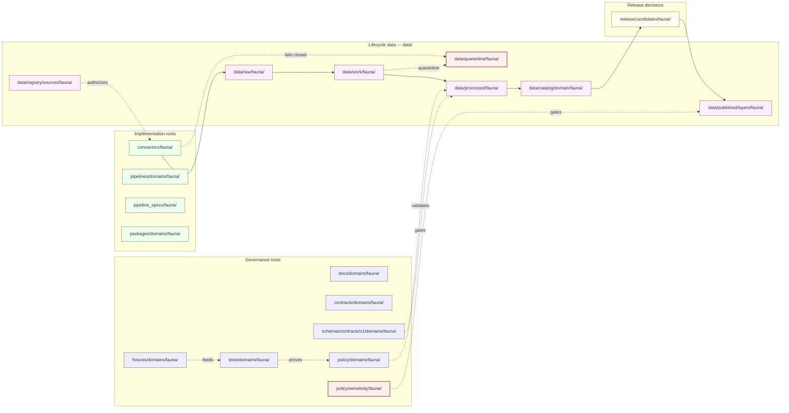

<!-- [KFM_META_BLOCK_V2]
doc_id: kfm://doc/fauna/canonical-paths
title: Fauna — Canonical Paths Register
type: standard
version: v1
status: draft
owners: TODO-fauna-domain-steward, TODO-docs-steward
created: 2026-05-16
updated: 2026-05-16
policy_label: public
related:
  - docs/doctrine/directory-rules.md
  - docs/domains/fauna/README.md
  - docs/domains/README.md
  - docs/adr/ADR-0001-schema-home.md
  - docs/runbooks/fauna/SOURCE_REFRESH_RUNBOOK.md
  - docs/runbooks/fauna/ROLLBACK_RUNBOOK.md
  - docs/registers/VERIFICATION_BACKLOG.md
  - docs/registers/DRIFT_REGISTER.md
tags: [kfm, fauna, directory-rules, canonical-paths, placement, lane-pattern, sensitivity]
notes:
  - Lane pattern is CONFIRMED doctrine from Directory Rules §12.
  - Every specific path in this document is PROPOSED until inspected against mounted-repo evidence.
  - Sensitive-lane discipline (nests, dens, roosts, hibernacula, spawning) governs path placement, not just policy.
  - Related-doc targets are PROPOSED; presence under their stated paths is NEEDS VERIFICATION.
[/KFM_META_BLOCK_V2] -->

# Fauna — Canonical Paths Register

> Enumeration of the **canonical repository paths** the Fauna domain is entitled to occupy across KFM's responsibility roots, derived from Directory Rules §12 (Domain Placement Law) and the Atlas ↔ Dossier ↔ Responsibility-Root crosswalk. Use this register as the authoritative placement map when proposing, creating, moving, or renaming any Fauna file — *before* opening a PR.


**Status:** draft · **Owners:** TODO-fauna-domain-steward, TODO-docs-steward · **Last updated:** 2026-05-16

---

## Table of Contents

1. [Purpose](#1-purpose)
2. [Authority and Doctrinal Basis](#2-authority-and-doctrinal-basis)
3. [Repo Fit — Where Fauna Lives](#3-repo-fit--where-fauna-lives)
4. [Canonical Path Inventory](#4-canonical-path-inventory)
5. [Lane Map (Diagram)](#5-lane-map-diagram)
6. [Lifecycle Paths Under `data/`](#6-lifecycle-paths-under-data)
7. [Sensitivity-Driven Placement Rules](#7-sensitivity-driven-placement-rules)
8. [Cross-Cutting and Multi-Domain Files](#8-cross-cutting-and-multi-domain-files)
9. [Placement Protocol for Fauna Files](#9-placement-protocol-for-fauna-files)
10. [Anti-Patterns Specific to Fauna](#10-anti-patterns-specific-to-fauna)
11. [Compatibility Roots and Mirrors](#11-compatibility-roots-and-mirrors)
12. [Exclusions — What Does Not Belong Under the Fauna Lane](#12-exclusions--what-does-not-belong-under-the-fauna-lane)
13. [Open Questions and Verification Backlog](#13-open-questions-and-verification-backlog)
14. [Related Docs](#14-related-docs)
15. [Appendix A — Full Canonical Path Listing](#appendix-a--full-canonical-path-listing)
16. [Appendix B — Glossary](#appendix-b--glossary)

---

## 1. Purpose

This register answers one question for the Fauna domain: **"where does this file go?"**

It does not invent paths. It maps the **lane pattern** of Directory Rules §12 — and the per-domain crosswalk in Atlas v1.1 §24.13 — onto the Fauna lane (`fauna/` segment), and surfaces fauna-specific concerns that affect placement: sensitive-occurrence discipline, geoprivacy receipts, restricted-vs-public occurrence splits, and the watcher-as-non-publisher invariant. The intent is that any contributor or reviewer can read this single page and answer placement questions without re-deriving the rules.

> [!NOTE]
> The **lane pattern itself** is CONFIRMED doctrine from Directory Rules §12.
> The **specific presence** of any given path in the current repository is **PROPOSED / NEEDS VERIFICATION** until inspected against mounted-repo evidence in this session. No live repo was inspected when this register was drafted.

---

## 2. Authority and Doctrinal Basis

This register is **derived doctrine**: it operationalizes higher-authority documents but does not amend them.

| Source | Role | Status |
|---|---|---|
| `docs/doctrine/directory-rules.md` §12 — Domain Placement Law | **Governing rule** for lane pattern, root vs. domain segment, multi-domain placement | CONFIRMED |
| `docs/doctrine/directory-rules.md` §5 — Canonical Root Tree | Defines the per-root authority class | CONFIRMED |
| `docs/doctrine/directory-rules.md` §9.1 — `data/` lifecycle invariant | Defines the lifecycle phases Fauna data must pass through | CONFIRMED |
| `docs/adr/ADR-0001-schema-home.md` (referenced) | Establishes `schemas/contracts/v1/...` as the default schema home | CONFIRMED doctrine; ADR file presence is NEEDS VERIFICATION |
| Atlas v1.1 §24.13 — Atlas ↔ Dossier ↔ Responsibility-Root Crosswalk | Names Fauna's primary responsibility roots and the sensitive-occurrence lane | CONFIRMED |
| `[DOM-FAUNA]`, `[DOM-HF]` domain dossiers | Define Fauna scope, object families, sensitivity posture, source authority | CONFIRMED doctrine / PROPOSED implementation |
| Atlas v1.0 Ch. 7 (retained verbatim in v1.1) — Fauna domain chapter | Object families, source families, sensitivity, publication, AI behavior | CONFIRMED |

If this register and a higher-authority source disagree, the higher-authority source wins; log the conflict to `docs/registers/DRIFT_REGISTER.md` per Directory Rules §2.5 and resolve via correction notice or ADR. **This document does not create authority; it indexes it.**

[Back to top](#table-of-contents)

---

## 3. Repo Fit — Where Fauna Lives

CONFIRMED: A domain MUST NOT be a root folder. There is no `fauna/` at repo root. Fauna lives **as a segment** inside each responsibility root that has a fauna-shaped responsibility.

```text
Kansas-Frontier-Matrix/
├── docs/domains/fauna/           ← human-facing doctrine, dossier, runbooks index, this file
├── contracts/domains/fauna/      ← object-family meaning (Markdown)
├── schemas/contracts/v1/domains/fauna/   ← machine shape (JSON Schema)
├── policy/domains/fauna/         ← allow/deny/restrict/abstain
├── policy/sensitivity/fauna/     ← sensitivity classes, redaction rules  ← FAUNA-SPECIFIC
├── tests/domains/fauna/          ← enforceability proof
├── fixtures/domains/fauna/       ← golden / valid / invalid sample inputs
├── packages/domains/fauna/       ← shared libs for fauna (if any)
├── pipelines/domains/fauna/      ← executable pipeline logic
├── pipeline_specs/fauna/         ← declarative pipeline configuration
├── data/raw/fauna/               ← immutable source captures
├── data/work/fauna/              ← normalized intermediates
├── data/quarantine/fauna/        ← failed / unresolved holds
├── data/processed/fauna/         ← validated canonical records
├── data/catalog/domain/fauna/    ← STAC/DCAT/PROV + domain catalog
├── data/published/layers/fauna/  ← released public-safe artifacts
├── data/registry/sources/fauna/  ← append-only source descriptors
├── release/candidates/fauna/     ← release-candidate dossiers
└── connectors/fauna/             ← source-specific fetchers (PROPOSED; verify against §7.3)
```

> [!IMPORTANT]
> The `fauna/` segment is **always** under a responsibility root. It is **never** a sibling of `docs/`, `data/`, `schemas/`, `policy/`, or any other canonical root. Any PR proposing a root-level `fauna/` folder is a Directory Rules §13.4 anti-pattern (domain-folders-as-root-folders) and MUST be rejected or rebased.

[Back to top](#table-of-contents)

---

## 4. Canonical Path Inventory

The Fauna lane is entitled to occupy the following paths. Each entry maps the **owning responsibility** to the **path** and to **what belongs there**. Specific repo presence is PROPOSED unless verified.

### 4.1 Governance and authority lanes

| Responsibility | Canonical path | What belongs here | Status |
|---|---|---|---|
| Human-facing doctrine | `docs/domains/fauna/` | Domain README, this register, runbooks index, ADRs that are fauna-scoped | CONFIRMED lane / PROPOSED presence |
| Object-family **meaning** | `contracts/domains/fauna/` | Markdown describing `Taxon`, `OccurrenceEvidence`, `OccurrenceRestricted`, `OccurrencePublic`, `RangePolygon`, `SeasonalRange`, `MigrationRoute`, `SensitiveSite`, `MortalityObservation`, `DiseaseObservation`, `InvasiveSpeciesRecord`, `ConservationStatus`, `RedactionReceipt` | CONFIRMED lane / PROPOSED presence |
| Machine-checkable **shape** | `schemas/contracts/v1/domains/fauna/` | JSON Schema files for each fauna object family, per ADR-0001 schema-home rule | CONFIRMED lane / PROPOSED presence |
| Admissibility — allow/deny/restrict/abstain | `policy/domains/fauna/` | Fauna-domain policy bundles, runtime gates, promotion gates scoped to fauna | CONFIRMED lane / PROPOSED presence |
| Sensitivity classes, redaction rules | `policy/sensitivity/fauna/` | Sensitive-taxon tier definitions, geoprivacy transform rules, deny-by-default for nests/dens/roosts/hibernacula/spawning sites | CONFIRMED lane / PROPOSED presence |
| Enforceability proof | `tests/domains/fauna/` | Schema validation, policy deny tests, taxonomic resolution tests, occurrence restricted/public split tests, tile field allowlist tests, Runtime Response Envelope negative cases | CONFIRMED lane / PROPOSED presence |
| Golden / valid / invalid samples | `fixtures/domains/fauna/` | Public-safe synthetic occurrence fixtures, redaction receipt fixtures, source descriptor fixtures, no-network fixtures | CONFIRMED lane / PROPOSED presence |

### 4.2 Implementation lanes

| Responsibility | Canonical path | What belongs here | Status |
|---|---|---|---|
| Shared library code | `packages/domains/fauna/` | Reusable fauna-specific utilities consumed by ≥2 deployables or pipelines | CONFIRMED lane / PROPOSED presence |
| Executable pipeline logic | `pipelines/domains/fauna/` | Pipeline steps that operate on fauna data | CONFIRMED lane / PROPOSED presence |
| Declarative pipeline config | `pipeline_specs/fauna/` | YAML/JSON pipeline specs declaring **what** should run | CONFIRMED lane / PROPOSED presence |
| Source-specific fetchers | `connectors/fauna/` *(PROPOSED — see §11)* | Connectors for KDWP-like, USFWS ECOS, NatureServe, GBIF, eBird, iNaturalist, EDDMapS, agency monitoring, telemetry feeds. Connectors emit to `data/raw/fauna/` or `data/quarantine/fauna/` only — **they do not publish**. | NEEDS VERIFICATION — Directory Rules §7.3 lists `connectors/` as canonical but does not show a per-domain segment in the §5 root tree |

> [!CAUTION]
> **Watcher-as-non-publisher invariant.** Any worker, watcher, or connector under `connectors/fauna/` or `pipelines/domains/fauna/` MUST NOT write to `data/catalog/`, `data/published/`, or `release/`. Watchers observe and record; they emit receipts and candidate decisions. Promotion is a governed state transition, not a file move.

[Back to top](#table-of-contents)

---

## 5. Lane Map (Diagram)

The diagram below shows how the Fauna lane spans every governing responsibility root. Each box is a responsibility root; arrows trace the path a fauna source takes from admission to publication. **Direction of arrows is governance flow, not file copy.**



> [!NOTE]
> The diagram is a **placement and governance flow**, not an execution sequence. Promotion between lifecycle phases is a governed decision recorded in receipts and a release manifest — not a copy operation.

[Back to top](#table-of-contents)

---

## 6. Lifecycle Paths Under `data/`

CONFIRMED: Fauna data must traverse `RAW → WORK / QUARANTINE → PROCESSED → CATALOG / TRIPLET → PUBLISHED`, and promotion is a governed state transition. The table maps each phase to its canonical Fauna path and the rule that gates entry.

| Phase | Canonical path | Gate (what MUST hold to be in this phase) | MUST NOT |
|---|---|---|---|
| RAW | `data/raw/fauna/<source_id>/<run_id>/` | SourceDescriptor exists in `data/registry/sources/fauna/`; payload is immutable; retrieval metadata and checksum recorded | Be read by public clients, AI context, or UI layers |
| WORK | `data/work/fauna/<run_id>/` | Normalized intermediates, candidate assertions, in-progress validation | Be served via public API or release alias |
| QUARANTINE | `data/quarantine/fauna/<reason>/<run_id>/` | Failed validation, unresolved rights or sensitivity, schema drift, over-precise geometry for a sensitive taxon — **fail-closed default for sensitive Fauna** | Be promoted to PROCESSED without remediation and a recorded reason |
| PROCESSED | `data/processed/fauna/<dataset_id>/<version>/` | Validated canonical records, EvidenceRef present, ValidationReport present, digest closure | Be assumed public/released |
| CATALOG | `data/catalog/domain/fauna/` (plus `data/catalog/stac/`, `data/catalog/dcat/`, `data/catalog/prov/` for cross-domain catalog entries) | EvidenceBundle resolves; catalog/proof closure passes; release candidate emitted | Hold uncited claims or unclosed identifiers |
| TRIPLETS | `data/triplets/...` (non-domain segment per §12 — relationship projections live cross-domain) | Triples derived from released or review-authorized evidence only | Be treated as canonical replacement of relational truth |
| PUBLISHED | `data/published/layers/fauna/` (plus `data/published/api_payloads/`, `data/published/pmtiles/`, `data/published/geoparquet/`) | ReleaseManifest exists in `release/manifests/`; correction path, rollback target, and review/policy state exist | Contain RAW, WORK, QUARANTINE, or exact restricted geometry for sensitive Fauna |
| RECEIPTS | `data/receipts/<class>/` (cross-domain; class ∈ `ingest`, `validation`, `pipeline`, `ai`, `release`) | Process memory only | Stand in as proof of release on their own |
| PROOFS | `data/proofs/<class>/` (cross-domain; class ∈ `evidence_bundle`, `proof_pack`, `validation_report`, `citation_validation`) | EvidenceBundle, ProofPack, integrity bundle | Lack release context |
| ROLLBACK | `data/rollback/fauna/<release_id>/` | Rollback cards, alias revert receipts | Delete prior meanings of released claims |
| REGISTRY | `data/registry/sources/fauna/`, `data/registry/sensitivity/fauna/` *(PROPOSED — see §11)* | Append-only source/rights/sensitivity records | Be treated as canonical domain truth |

> [!WARNING]
> **Receipts and proofs are cross-domain by convention** (Directory Rules §9.1). They live under `data/receipts/<class>/` and `data/proofs/<class>/`, *not* `data/receipts/fauna/`. A fauna-specific filename inside the cross-domain folder is fine; a `data/receipts/fauna/` *folder* is a Directory Rules §2.4 ADR-required move and should not be created without one. **NEEDS VERIFICATION:** whether the receipts/proofs layout in the live repo follows §9.1 exactly.

[Back to top](#table-of-contents)

---

## 7. Sensitivity-Driven Placement Rules

CONFIRMED doctrine: exact sensitive occurrence, nest, den, roost, hibernacula, spawning, and steward-controlled records fail closed. This is not only a policy rule — it shapes where Fauna files are allowed to live.

### 7.1 Fauna-specific path that other domains do not all need

`policy/sensitivity/fauna/` is the canonical home for fauna sensitivity classes, geoprivacy transform rules, and deny-by-default declarations for sensitive sites. Atlas v1.1 §24.13 explicitly cites this path for the Fauna lane (alongside `schemas/contracts/v1/fauna/` and `contracts/fauna/`). The `policy/sensitivity/` segment is shared across deny-default domains (archaeology, people-dna-land, infrastructure, flora rare-plant lane); Fauna is one of the named lanes.

### 7.2 The restricted/public occurrence split

CONFIRMED object families: Fauna owns both `OccurrenceRestricted` and `OccurrencePublic`. These split affects path placement:

| Object family | Allowed paths | Forbidden paths |
|---|---|---|
| `OccurrenceRestricted` | `data/processed/fauna/.../restricted/`, `data/catalog/domain/fauna/.../restricted/`, schema under `schemas/contracts/v1/domains/fauna/occurrence_restricted.schema.json` *(PROPOSED filename)* | `data/published/layers/fauna/` (any public layer); `data/published/pmtiles/` for sensitive taxa; any public API payload |
| `OccurrencePublic` | All PROCESSED/CATALOG/PUBLISHED lanes after geoprivacy transform receipt is recorded | Any path that would expose exact sensitive geometry; any path that bypasses the public-safe derivative check |
| `RedactionReceipt` | `data/receipts/release/` or `data/receipts/pipeline/` (cross-domain receipts), referenced by fauna-specific filenames | Be omitted whenever a `OccurrenceRestricted → OccurrencePublic` transform occurred |

> [!CAUTION]
> A file that *contains* exact sensitive Fauna geometry (nest, den, roost, hibernacula, spawning) MUST NOT be placed under `data/published/layers/fauna/` at any precision, regardless of the layer's stated purpose, source role, or apparent generality. Placing such a file under `published/` is a **trust-membrane violation** (Directory Rules §13.5) and triggers a default-deny on the entire release.

### 7.3 What lives behind a steward gate, not in the public tree

| Purpose | Path | Access posture |
|---|---|---|
| Exact sensitive site coordinates | `data/processed/fauna/.../restricted/` only; never `data/published/` | Steward-only, staged access |
| Geoprivacy transform receipts proving redaction occurred | `data/receipts/release/` (cross-domain class) | Public; the receipt is public, the underlying exact location is not |
| Restricted-view exports (steward export of exact-location maps) | `data/processed/fauna/.../restricted/exports/` *(PROPOSED)* | Steward-only, audit-logged |

[Back to top](#table-of-contents)

---

## 8. Cross-Cutting and Multi-Domain Files

CONFIRMED rule (Directory Rules §12, "Multi-domain and cross-cutting files"): when a file legitimately spans Fauna and another domain, place it under the **lowest common responsibility root** that owns the file's responsibility, **without** a `fauna/` segment.

Common Fauna ↔ adjacent-lane cases:

| Cross-cutting file | NOT here | But here |
|---|---|---|
| Habitat × Fauna assignment validator (DOM-HF thin slice) | `tools/validators/domains/fauna/...` | `tools/validators/habitat-fauna/...` |
| Shared geometry validator (Fauna + Hydrology for spawning context) | `tools/validators/domains/fauna/...` | `tools/validators/geometry/...` |
| Cross-domain doctrine on sensitive-occurrence handling | `docs/domains/fauna/SENSITIVITY.md` | `docs/architecture/sensitivity.md` or `docs/doctrine/sensitivity.md` |
| Shared `EvidenceBundle` schema (kernel object) | `schemas/contracts/v1/domains/fauna/evidence_bundle.schema.json` | `schemas/contracts/v1/evidence/evidence_bundle.schema.json` |
| Cross-domain join validator (Fauna ↔ Habitat ↔ Flora) | `tools/validators/domains/fauna/...` | `tools/validators/cross-domain-joins/...` |

> [!TIP]
> The test "is this file domain-specific?" is: **can this file be moved to another domain without changing what it does?** If yes, it belongs in the cross-cutting segment. If no, it belongs in the `fauna/` segment.

[Back to top](#table-of-contents)

---

## 9. Placement Protocol for Fauna Files

Use this protocol (derived from Directory Rules §4) every time you propose, create, move, or rename a Fauna file. State the result in the PR description.

1. **Identify the responsibility.** Use the §4 table in Directory Rules. Pick *exactly one* primary responsibility.
2. **Identify the lifecycle phase, if `data/`.** Name the phase: `raw`, `work`, `quarantine`, `processed`, `catalog`, `triplets`, `published`, `receipts`, `proofs`, `rollback`, `registry`.
3. **Identify the domain segment.** For Fauna files, the segment is always `fauna/` inside the responsibility root — never at root.
4. **Apply the sensitivity overlay** (this register, §7). If the file involves nests, dens, roosts, hibernacula, spawning, or exact sensitive occurrence, the deny-by-default posture restricts which lifecycle phases are reachable.
5. **Apply the cross-cutting rule** (§8). If the file is not strictly fauna-specific, remove the `fauna/` segment and place under the cross-cutting topic.
6. **Confirm authority.** The owning root must already exist or be created in the same change with a per-root README per Directory Rules §15.
7. **Cite the rule.** The PR description names the Directory Rules section and this register's section that justifies the placement.

### 9.1 Worked examples

| Want to add… | Reasoning | Canonical placement |
|---|---|---|
| A JSON Schema for `Taxon` | Machine shape → `schemas/`; default home is `schemas/contracts/v1/...` per ADR-0001; fauna-specific → `domains/fauna/` segment | `schemas/contracts/v1/domains/fauna/taxon.schema.json` |
| A Markdown explainer for what `OccurrenceRestricted` means | Object meaning → `contracts/`; fauna-specific | `contracts/domains/fauna/occurrence_restricted.md` |
| A policy bundle denying public exact location for sensitive taxa | Admissibility decision **and** sensitivity-class rule | `policy/sensitivity/fauna/sensitive_taxa_deny.rego` *(extension PROPOSED)*; cross-referenced from `policy/domains/fauna/` |
| A test that the redaction receipt is emitted on every restricted→public transform | Enforceability proof → `tests/`; fauna-specific | `tests/domains/fauna/test_redaction_receipt_emitted.py` *(filename PROPOSED)* |
| A connector for an iNaturalist export | Source-specific fetcher → `connectors/`; per Directory Rules §7.3, connectors emit to `data/raw/` or `data/quarantine/` only | `connectors/fauna/inaturalist/` *(per-domain segment is NEEDS VERIFICATION; see §11)* |
| A pipeline spec for the fauna refresh cadence | Declarative pipeline configuration → `pipeline_specs/<domain>/` | `pipeline_specs/fauna/refresh.yaml` *(filename PROPOSED)* |
| A runbook for refreshing fauna sources | Human-facing operational doc → `docs/runbooks/`; subfolder per domain | `docs/runbooks/fauna/SOURCE_REFRESH_RUNBOOK.md` |
| A rollback drill record for a Fauna release | Process memory, release class | `data/receipts/release/<release_id>.json` *(filename PROPOSED)*; rollback card under `release/rollback_cards/` |
| A new ADR resolving the connector-segment question | ADR-class change → `docs/adr/` | `docs/adr/ADR-NNNN-connectors-domain-segment.md` |

[Back to top](#table-of-contents)

---

## 10. Anti-Patterns Specific to Fauna

CONFIRMED (Directory Rules §13.5 + this register): anti-patterns that recur in fauna-shaped lanes.

| Anti-pattern | Symptom | Fix |
|---|---|---|
| **Sensitive geometry in `published/`** | A `data/published/layers/fauna/` artifact contains exact nest, den, roost, hibernacula, or spawning coordinates | Reject release; quarantine the artifact; require geoprivacy transform receipt; re-promote |
| **Aggregator promoted as legal-status authority** | A GBIF/iNaturalist occurrence record used as the source for `ConservationStatus` | Reject; only authority sources (USFWS ECOS, NatureServe, state agency) carry legal status |
| **Fauna folder at repo root** | A root-level `fauna/` directory accumulates sub-`data/`, `schemas/`, `docs/`, `policy/` | Migrate piece by piece into responsibility-root lanes per §12 |
| **`OccurrenceRestricted` and `OccurrencePublic` in same artifact file** | A single GeoJSON or PMTiles file carries both classes | Split into two artifact files; restricted artifact never reaches `published/` |
| **Watcher publishes** | A worker in `connectors/fauna/` or `pipelines/domains/fauna/` writes to `data/catalog/` or `data/published/` | Watchers emit receipts and candidate decisions only; promotion runs through gates |
| **Receipts in `release/`** | Run receipts, validation receipts, AI receipts stored under `release/` instead of `data/receipts/` | Move per §13.2; `release/` is for release **decisions** not process memory |
| **Connector publishes** | A connector writes directly to `data/processed/fauna/` or `data/published/` | Connectors emit to `data/raw/fauna/` or `data/quarantine/fauna/` only |
| **Schema mirror divergence** | A fauna schema authored under both `contracts/domains/fauna/` and `schemas/contracts/v1/domains/fauna/` with different fields | `schemas/contracts/v1/...` is canonical (ADR-0001); freeze the other; file drift entry |
| **Lifecycle skip** | A pipeline writes directly to `data/published/layers/fauna/` from `data/raw/fauna/` | All phases must run; promotion is governed |

[Back to top](#table-of-contents)

---

## 11. Compatibility Roots and Mirrors

CONFIRMED: certain roots are compatibility, not canonical (Directory Rules §5, §8). If the live repo contains Fauna files under any of these, treat the path as **mirror / transitional**, not authoritative.

| Compatibility root (if present) | Canonical home | Action |
|---|---|---|
| `jsonschema/fauna/` | `schemas/contracts/v1/domains/fauna/` | Mirror only; new schemas land in canonical first |
| `policies/fauna/` | `policy/domains/fauna/` | Mirror only |
| `contracts/fauna/<x>.schema.json` (machine schema) | `schemas/contracts/v1/domains/fauna/<x>.schema.json` | CONFLICTED per Directory Rules §13.1; migrate under ADR-0001 |
| `ui/fauna/`, `web/fauna/` | `apps/explorer-web/` + `packages/ui/` (with fauna components, if any, as cross-cutting UI rather than domain folders) | Compatibility; migration target is apps/packages, not a domain folder |
| `artifacts/fauna/` (release manifests, receipts, proofs) | `data/receipts/`, `data/proofs/`, `release/` | Move per §13.2 / §8.2 |

> [!NOTE]
> **NEEDS VERIFICATION:** whether the current repo uses any of these compatibility roots for Fauna. Until inspected, paths above are PROPOSED. The doctrine of `schemas/contracts/v1/...` as canonical is CONFIRMED by ADR-0001 (referenced); ADR file presence is NEEDS VERIFICATION.

[Back to top](#table-of-contents)

---

## 12. Exclusions — What Does Not Belong Under the Fauna Lane

CONFIRMED scope (Atlas v1.0 Ch. 7 §B; DOM-FAUNA): Fauna does **not** own these — files about them MUST NOT use the `fauna/` segment.

| Topic | Owning domain | Where Fauna may *cite* it |
|---|---|---|
| Habitat patches and habitat suitability | Habitat (`docs/domains/habitat/`) | Fauna-side: `HabitatAssignment` joins under `data/catalog/domain/fauna/...` referencing Habitat catalog records |
| Plant taxa, vegetation communities, rare plants | Flora (`docs/domains/flora/`) | Fauna ↔ Flora cross-lane relations (pollinator, food-web, invasive) live in cross-cutting `tests/cross-domain/` and `tools/validators/cross-domain-joins/` |
| Aquatic / riparian / wetland geometry | Hydrology (`docs/domains/hydrology/`) | Fauna spawning-context joins reference Hydrology features, not own them |
| Wildfire / flood / drought / disease as hazard events | Hazards (`docs/domains/hazards/`) | Fauna mortality and disease *observations* belong here; hazard *events* do not |
| Land ownership, parcels, person-parcel ties | People / Genealogy / DNA / Land (`docs/domains/people-dna-land/`) | Fauna may not encode landowner identity in any path |
| Critical infrastructure adjacency | Settlements / Infrastructure | Cross-cutting validators only |

[Back to top](#table-of-contents)

---

## 13. Open Questions and Verification Backlog

The following items are **explicitly not resolved** by this register and should be tracked in `docs/registers/VERIFICATION_BACKLOG.md`.

| # | Item | What would settle it | Status |
|---:|---|---|---|
| 1 | Whether the current mounted repo actually contains each lane path listed in §4 | A `git ls-tree`-equivalent inspection of the canonical paths | **NEEDS VERIFICATION** |
| 2 | Whether `connectors/fauna/` (per-domain segment) is the canonical layout, or whether connectors are organized by source rather than by domain | Inspection of `connectors/` in the live repo + a per-root README; otherwise an ADR | **NEEDS VERIFICATION** |
| 3 | Whether the `triplets/` folder is plural (`data/triplets/`) or singular (`data/triplet/`) — Directory Rules §18 flags this as OPEN | An ADR-1-liner to freeze the form | **OPEN** |
| 4 | Whether `data/registry/sources/fauna/` or `data/registry/fauna/` is the chosen depth for the source registry | Inspection or ADR | **NEEDS VERIFICATION** |
| 5 | Whether the receipts/proofs class taxonomy under `data/receipts/<class>/` and `data/proofs/<class>/` matches the live repo | Inspection | **NEEDS VERIFICATION** |
| 6 | Whether `policy/sensitivity/fauna/` is co-equal with `policy/domains/fauna/`, or one references the other | Inspection + per-root README in `policy/sensitivity/` and `policy/domains/` | **NEEDS VERIFICATION** |
| 7 | Whether fauna-scoped ADRs live under `docs/adr/` (flat) or `docs/domains/fauna/adr/` | Inspection + the ADR template | **OPEN** |
| 8 | Whether `OccurrenceRestricted` artifacts use a `restricted/` subfolder under each lifecycle phase, or are tagged via filename convention | Schema and policy review | **PROPOSED** |
| 9 | Whether the `docs/runbooks/fauna/` subfolder convention generalizes to other domains (current usage is fauna-only by observation) | Inspection of other domain runbooks + ADR if generalized | **OPEN** |
| 10 | The exact filename for the Fauna domain README (`README.md` vs. a dossier-style name) | Inspection | **NEEDS VERIFICATION** |

[Back to top](#table-of-contents)

---

## 14. Related Docs

> [!NOTE]
> Targets below are PROPOSED. Presence under stated paths is **NEEDS VERIFICATION** unless explicitly noted otherwise.

- `docs/doctrine/directory-rules.md` — **CONFIRMED governing rule**. The Lane Pattern (§12), Canonical Root Tree (§5), and data lifecycle invariant (§9.1) are derived from this file.
- `docs/domains/fauna/README.md` — Fauna domain landing page and dossier (TODO target).
- `docs/domains/README.md` — `docs/domains/` index (TODO target).
- `docs/adr/ADR-0001-schema-home.md` — Schema-home rule fixing `schemas/contracts/v1/...` as canonical (NEEDS VERIFICATION — referenced throughout Directory Rules).
- `docs/runbooks/fauna/SOURCE_REFRESH_RUNBOOK.md` — Fauna source refresh runbook (companion).
- `docs/runbooks/fauna/ROLLBACK_RUNBOOK.md` — Fauna rollback runbook (companion).
- `docs/registers/VERIFICATION_BACKLOG.md` — Cross-repo verification register (TODO target).
- `docs/registers/DRIFT_REGISTER.md` — Cross-repo drift register (TODO target).
- `docs/registers/CANONICAL_LINEAGE_EXPLORATORY.md` — Path migration / lineage notes (TODO target).
- `contracts/domains/fauna/` — Fauna object-family meaning (TODO target).
- `schemas/contracts/v1/domains/fauna/` — Fauna machine shape (TODO target).
- `policy/sensitivity/fauna/` — Fauna sensitivity classes and redaction rules (TODO target).

[Back to top](#table-of-contents)

---

## Appendix A — Full Canonical Path Listing

The full canonical path inventory for the Fauna lane, expanded. Use this as a copy-paste reference when scaffolding the lane. All paths are PROPOSED until verified against the live repo.

<details>
<summary><strong>Click to expand the full Fauna lane path listing</strong></summary>

```text
# Governance and authority lanes
docs/domains/fauna/
docs/domains/fauna/README.md
docs/domains/fauna/CANONICAL_PATHS.md          ← this file
docs/domains/fauna/SENSITIVITY.md              ← optional fauna-scoped sensitivity doc
docs/runbooks/fauna/                           ← runbook subfolder (current convention)
docs/runbooks/fauna/SOURCE_REFRESH_RUNBOOK.md
docs/runbooks/fauna/ROLLBACK_RUNBOOK.md

contracts/domains/fauna/
contracts/domains/fauna/taxon.md
contracts/domains/fauna/taxon_crosswalk.md
contracts/domains/fauna/conservation_status.md
contracts/domains/fauna/occurrence_evidence.md
contracts/domains/fauna/occurrence_restricted.md
contracts/domains/fauna/occurrence_public.md
contracts/domains/fauna/range_polygon.md
contracts/domains/fauna/seasonal_range.md
contracts/domains/fauna/migration_route.md
contracts/domains/fauna/sensitive_site.md
contracts/domains/fauna/mortality_observation.md
contracts/domains/fauna/disease_observation.md
contracts/domains/fauna/invasive_species_record.md
contracts/domains/fauna/redaction_receipt.md

schemas/contracts/v1/domains/fauna/
schemas/contracts/v1/domains/fauna/taxon.schema.json
schemas/contracts/v1/domains/fauna/taxon_crosswalk.schema.json
schemas/contracts/v1/domains/fauna/conservation_status.schema.json
schemas/contracts/v1/domains/fauna/occurrence_evidence.schema.json
schemas/contracts/v1/domains/fauna/occurrence_restricted.schema.json
schemas/contracts/v1/domains/fauna/occurrence_public.schema.json
schemas/contracts/v1/domains/fauna/range_polygon.schema.json
schemas/contracts/v1/domains/fauna/seasonal_range.schema.json
schemas/contracts/v1/domains/fauna/migration_route.schema.json
schemas/contracts/v1/domains/fauna/sensitive_site.schema.json
schemas/contracts/v1/domains/fauna/mortality_observation.schema.json
schemas/contracts/v1/domains/fauna/disease_observation.schema.json
schemas/contracts/v1/domains/fauna/invasive_species_record.schema.json
schemas/contracts/v1/domains/fauna/redaction_receipt.schema.json

policy/domains/fauna/
policy/domains/fauna/README.md
policy/sensitivity/fauna/                      ← fauna-specific sensitivity lane (Atlas v1.1 §24.13)
policy/sensitivity/fauna/sensitive_taxa.yaml
policy/sensitivity/fauna/geoprivacy_transforms.yaml
policy/sensitivity/fauna/nest_den_roost_hibernacula_spawning.yaml

tests/domains/fauna/
tests/domains/fauna/test_taxonomy_resolution.py
tests/domains/fauna/test_occurrence_split.py
tests/domains/fauna/test_redaction_receipt.py
tests/domains/fauna/test_tile_field_allowlist.py
tests/domains/fauna/test_runtime_envelope_negative.py

fixtures/domains/fauna/
fixtures/domains/fauna/valid/
fixtures/domains/fauna/invalid/
fixtures/domains/fauna/golden/

# Implementation lanes
packages/domains/fauna/
pipelines/domains/fauna/
pipeline_specs/fauna/
pipeline_specs/fauna/refresh.yaml
connectors/fauna/                              ← per-domain segment is NEEDS VERIFICATION

# Lifecycle data
data/raw/fauna/<source_id>/<run_id>/
data/work/fauna/<run_id>/
data/quarantine/fauna/<reason>/<run_id>/
data/processed/fauna/<dataset_id>/<version>/
data/processed/fauna/<dataset_id>/<version>/restricted/
data/catalog/domain/fauna/
data/published/layers/fauna/
data/published/api_payloads/fauna/             ← shape NEEDS VERIFICATION
data/published/pmtiles/fauna/                  ← shape NEEDS VERIFICATION
data/registry/sources/fauna/
data/registry/sensitivity/fauna/               ← depth NEEDS VERIFICATION
data/rollback/fauna/<release_id>/

# Release decisions
release/candidates/fauna/

# Cross-domain (NO fauna/ segment)
tests/cross-domain/habitat-fauna/              ← DOM-HF thin slice
tools/validators/habitat-fauna/
docs/architecture/sensitivity.md               ← cross-domain sensitivity doctrine
```

</details>

[Back to top](#table-of-contents)

---

## Appendix B — Glossary

<details>
<summary><strong>Click to expand glossary</strong></summary>

- **Canonical root** — a top-level repo folder that carries a repo-wide responsibility (Directory Rules §5). Cannot be a domain name.
- **Compatibility root** — a top-level folder retained for backward compatibility; mirrors a canonical home (Directory Rules §8).
- **Domain segment** — the `fauna/` (or other domain) name as a path segment inside a responsibility root, never as the root itself (Directory Rules §12).
- **EvidenceBundle** — the resolved, source-grounded evidence object that outranks generated language and search indexes.
- **EvidenceRef** — pointer that resolves to an EvidenceBundle.
- **Fail closed** — default-deny posture for sensitive Fauna records (exact occurrence, nest, den, roost, hibernacula, spawning).
- **Geoprivacy transform** — the redaction or generalization step that converts an `OccurrenceRestricted` into an `OccurrencePublic`; produces a `RedactionReceipt`.
- **Lane pattern** — Directory Rules §12 pattern that puts a domain segment under each responsibility root.
- **OccurrencePublic / OccurrenceRestricted** — the two-class split for Fauna occurrences; only `OccurrencePublic` may reach `data/published/layers/fauna/`.
- **PromotionDecision** — the governed record that authorizes a lifecycle transition (e.g., PROCESSED → CATALOG).
- **ReleaseManifest** — the release decision object that gates entry into `data/published/`.
- **RollbackCard** — the rollback artifact that pairs with every release.
- **SourceDescriptor** — the registry entry that records a source's role, rights, sensitivity, cadence, and access posture, gating its admission into `data/raw/`.
- **Trust membrane** — the doctrine boundary that public clients use governed APIs and released artifacts only, not canonical internal stores.
- **Watcher-as-non-publisher** — invariant that workers, watchers, and connectors emit receipts and candidate decisions only; they do not publish.

</details>

[Back to top](#table-of-contents)

---

### Footer

**Related docs:** [`directory-rules.md`](../../doctrine/directory-rules.md) · [`docs/domains/fauna/README.md`](./README.md) · [`docs/runbooks/fauna/SOURCE_REFRESH_RUNBOOK.md`](../../runbooks/fauna/SOURCE_REFRESH_RUNBOOK.md) · [`docs/runbooks/fauna/ROLLBACK_RUNBOOK.md`](../../runbooks/fauna/ROLLBACK_RUNBOOK.md) · [`ADR-0001-schema-home.md`](../../adr/ADR-0001-schema-home.md)

**Last updated:** 2026-05-16 · **Version:** v1 · **Status:** draft

[Back to top](#table-of-contents)
