<!-- [KFM_META_BLOCK_V2]
doc_id: kfm://doc/fauna-continuity-inventory
title: Fauna Domain Continuity Inventory
type: standard
version: v1
status: draft
owners: <fauna-domain-steward> (PLACEHOLDER — assign before review)
created: 2026-05-16
updated: 2026-05-29
policy_label: public
related:
  - ai-build-operating-contract.md                         # CONTRACT_VERSION = "3.0.0"
  - docs/doctrine/directory-rules.md                       # CONFIRMED — viewed this session
  - docs/domains/fauna/README.md                           # PROPOSED — verify
  - docs/domains/fauna/CANONICAL_PATHS.md                  # PROPOSED — companion placement register
  - docs/domains/README.md                                 # PROPOSED — verify
  - docs/runbooks/fauna/SOURCE_REFRESH_RUNBOOK.md          # PROPOSED — NEEDS VERIFICATION
  - docs/registers/VERIFICATION_BACKLOG.md                 # PROPOSED — verify
  - docs/registers/CANONICAL_LINEAGE_EXPLORATORY.md        # PROPOSED — verify
  - docs/registers/DRIFT_REGISTER.md                       # PROPOSED — verify
  - docs/archive/lineage/                                  # PROPOSED — verify
tags: [kfm, fauna, continuity, lineage, inventory, governance]
notes:
  - CONTRACT_VERSION = "3.0.0" — doctrine-adjacent inventory under ai-build-operating-contract.md.
  - Companion to (not replacement for) the fauna README and the fauna Canonical Paths register.
  - Naming follows user task; the Whole-UI report uses CONTINUITY_NOTES.md — see §17 and §19.
  - Meta Block v2 carries no nested HTML comments; inline annotations use # only.
[/KFM_META_BLOCK_V2] -->

# Fauna Domain Continuity Inventory

> **What did the fauna corpus already establish, and how is each prior gain carried forward — as doctrine, lineage, design pressure, or deferred work — without being silently promoted to current implementation?**

| Field | Value |
|---|---|
| **Status** | `draft` |
| **Owners** | `<fauna-domain-steward>` (PLACEHOLDER — assign before review) |
| **Last updated** | 2026-05-29 |
| **`CONTRACT_VERSION`** | `"3.0.0"` |
| **Authority of this document** | PROPOSED inventory of doctrine, lineage, and design pressure. The *doctrine* it cites is CONFIRMED in the cited corpus; the *fauna repo implementation* status is UNKNOWN unless verified. |
| **Companion docs (PROPOSED)** | `docs/domains/fauna/README.md`, `docs/domains/fauna/CANONICAL_PATHS.md`, `docs/runbooks/fauna/SOURCE_REFRESH_RUNBOOK.md` |

---

## Contents

- [1. Purpose](#1-purpose)
- [2. How to read this inventory](#2-how-to-read-this-inventory)
- [3. Source ledger](#3-source-ledger)
- [4. Truth posture and label key](#4-truth-posture-and-label-key)
- [5. Continuity-classification key](#5-continuity-classification-key)
- [6. Inventory flow](#6-inventory-flow)
- [7. Prior gain — domain identity and boundary](#7-prior-gain--domain-identity-and-boundary)
- [8. Prior gain — ubiquitous language and object families](#8-prior-gain--ubiquitous-language-and-object-families)
- [9. Prior gain — source families and source-role discipline](#9-prior-gain--source-families-and-source-role-discipline)
- [10. Prior gain — sensitivity, geoprivacy, and public-safe posture](#10-prior-gain--sensitivity-geoprivacy-and-public-safe-posture)
- [11. Prior gain — lifecycle and pipeline shape](#11-prior-gain--lifecycle-and-pipeline-shape)
- [12. Prior gain — map and viewing products](#12-prior-gain--map-and-viewing-products)
- [13. Prior gain — cross-lane relations](#13-prior-gain--cross-lane-relations)
- [14. Prior gain — validators, tests, and fixtures](#14-prior-gain--validators-tests-and-fixtures)
- [15. Prior gain — governed AI behavior and Evidence Drawer](#15-prior-gain--governed-ai-behavior-and-evidence-drawer)
- [16. Prior gain — habitat-fauna thin-slice proof pattern](#16-prior-gain--habitat-fauna-thin-slice-proof-pattern)
- [17. Naming and placement decisions](#17-naming-and-placement-decisions)
- [18. Files intentionally deferred](#18-files-intentionally-deferred)
- [19. CONFLICTED items and open file-home questions](#19-conflicted-items-and-open-file-home-questions)
- [20. Verification backlog](#20-verification-backlog)
- [21. Update-propagation matrix](#21-update-propagation-matrix)
- [22. Open questions register](#22-open-questions-register)
- [23. Changelog](#23-changelog)
- [24. Definition of done](#24-definition-of-done)
- [25. Related docs](#25-related-docs)

---

## 1. Purpose

This document is the **fauna-lane continuity inventory**. It enumerates every fauna-relevant prior gain — doctrine, dossier, idea-index entry, encyclopedia chapter, atlas section, thin-slice blueprint, and cross-cutting UI/governed-AI carry-forward — and assigns each a continuity classification that states *how* it is preserved going forward.

The inventory exists because the fauna corpus is substantial (one of the deepest in KFM) and the fauna lane is unusually sensitive (deny-by-default for exact sensitive-occurrence geometry, nests, dens, roosts, hibernacula, and spawning sites). Before any fauna PR introduces schemas, validators, fixtures, layers, or release artifacts, reviewers need a single place that says:

- what doctrine is already settled,
- what is lineage-only and must **not** be treated as implementation,
- what was deferred and under what trigger it returns, and
- what is genuinely open and needs an ADR, drift entry, or steward decision.

> [!IMPORTANT]
> This inventory cites doctrine. It does **not** assert any fauna implementation state. Every claim of the form "the repo contains X" or "the validator does Y" requires repo verification — see §20 *Verification backlog*. The default for any path or file shown here is **PROPOSED**.

[Back to top ↑](#contents)

---

## 2. How to read this inventory

Each prior-gain section follows the canonical four-column shape from the KFM Whole-UI + Governed AI Expansion Report §6:

| Column | Meaning |
|---|---|
| **Surface or prior gain** | The concrete doctrine, term, object family, posture, or pattern carried forward. |
| **Classification** | One of the labels in §5; states *how* it is preserved. |
| **Evidence basis** | The corpus pointer (dossier, encyclopedia, atlas, idea-index ID, doctrine doc). |
| **Preserved next behavior** | What the fauna lane is committed to doing with it going forward. |

The doctrine cited is CONFIRMED in the named source. The *fauna-repo embodiment* of that doctrine (paths, schemas, validators, tests, runtime, release artifacts) is **PROPOSED / UNKNOWN** until verified against a mounted repo. This inventory never collapses the two.

[Back to top ↑](#contents)

---

## 3. Source ledger

The sources below were consulted to assemble this inventory. They are doctrine, dossier, or lineage. None of them, individually or collectively, prove a fauna implementation state.

| Short tag | Source | Role |
|---|---|---|
| **[CONTRACT]** | `ai-build-operating-contract.md` v3.0 (`CONTRACT_VERSION = "3.0.0"`) | CONFIRMED operating contract — truth labels, invariants, sensitive-domain matrix §23.2, change discipline. |
| **[DIRRULES]** | `docs/doctrine/directory-rules.md` (viewed this session) | CONFIRMED governance doctrine for placement, lifecycle invariant, schema-home rule, drift discipline. |
| **[DOM-FAUNA]** | Fauna domain dossier (PDF-only report) | Fauna sensitivity posture, source-role patterns, proof-slice candidates. PDF-only lineage. |
| **[DOM-HF]** | Habitat-fauna thin-slice extended blueprint | First public-safe occurrence-to-habitat assignment proof. PDF-only lineage. |
| **[DOM-HAB]** | Habitat lane dossier | Cross-lane relations and sensitivity inheritance. PDF-only lineage. |
| **[DOM-FLORA]** | Flora lane dossier | Cross-lane relation (food-web, pollinator, invasive). PDF-only lineage. |
| **[ENCY]** | KFM Encyclopedia §7.5 Fauna (and §13 Sensitive Register) | Domain/capability encyclopedia chapter. CONFIRMED doctrine. |
| **[ATLAS]** | Domains v1.1 (Pass 23/32 Consolidated) Atlas — Fauna chapter (§7.A–N) and §20.5 Deny-by-Default Register | Cumulative domain atlas. CONFIRMED doctrine. |
| **[UNIFIED]** | KFM Unified Implementation Architecture Build Manual §6.4 Fauna | Build-manual reading of fauna scope, sensitivity, pipelines, open items. CONFIRMED doctrine. |
| **[GAI]** | Governed AI architecture report | Adapter-first, evidence-bound runtime behavior across all domains. PDF-only lineage. |
| **[MAP-MASTER]** | Master MapLibre Components-Functions-Features (v2.1 FULL) | Cross-cutting map/timeline/Evidence Drawer/Focus Mode doctrine the fauna lane inherits. PDF-only lineage. |
| **[P20-IDX]** | Pass-20 Part-2 Idea Index | Normalized idea index (`KFM-IDX-*`): fauna-relevant POL-005, APP-002, VAL-001, VAL-002, PLN-003. |
| **[UI-EXP]** | Whole-UI + Governed AI Expansion Report | Source of the *prior-gains-and-continuity-inventory* pattern itself; cross-cutting UI/Focus/Drawer/Story carry-forward template. |
| **[RSGD]** | Repository Structure Guiding Document | Per-root README contracts and the live-repo root inventory used for placement cross-checks. PDF-only lineage. |

Each PDF-only source is **lineage**, not implementation. A lineage source proves doctrine and continuity; it does not prove any current repo file, validator, route, fixture, manifest, or release.

[Back to top ↑](#contents)

---

## 4. Truth posture and label key

| Label | Meaning in this document |
|---|---|
| **CONFIRMED** | Verified this session — either by direct view of an attached repo file (e.g., `directory-rules.md`) or by direct citation to the corpus listed in §3. CONFIRMED applies to *doctrine and corpus content*; it does **not** upgrade implementation. |
| **INFERRED** | Reasonably synthesized from multiple corpus sources but not directly stated as such. |
| **PROPOSED** | Design, path, placement, classification, or behavior recommended but not verified in implementation. The default state for every path and embodiment claim in this doc. |
| **UNKNOWN** | Not resolvable without more evidence (mounted repo, source endpoint, steward decision). |
| **NEEDS VERIFICATION** | Concrete, checkable claim not yet checked strongly enough to act as fact. |
| **CONFLICTED** | Two or more sources disagree, or doctrine and implied implementation are unresolved. |
| **DEFERRED** | Intentionally excluded from the current slice until a later trigger. |
| **EXTERNAL** | Sourced from authoritative external research. *Not used in this document.* No external web research was performed; the corpus alone supplies the inventory. |

> [!WARNING]
> Memory is not evidence. Recollection, plausible best practice, "what the fauna repo probably looks like," and inference from sibling domains are not facts. If a row below names a path, schema, validator, runbook, or runtime, the named artifact is **PROPOSED** unless its row says otherwise.

[Back to top ↑](#contents)

---

## 5. Continuity-classification key

The classification labels below match the pattern established in the Whole-UI report §6 and extended for domain use.

| Classification | Meaning |
|---|---|
| **KEEP AS DOCTRINE** | The prior gain is doctrine and will continue to govern fauna behavior at the doctrinal layer; the inventory carries it forward unchanged. |
| **KEEP AND EXTEND** | The prior gain is sound and the fauna lane will extend it (typically with schemas, validators, fixtures, tests, or runbooks). No structural rewrite implied. |
| **WRAP WITH ADAPTER** | The prior gain references a runtime or rendering surface (e.g., MapLibre, AI runtime) that must stay behind a KFM adapter — never as the truth source. |
| **KEEP AS LINEAGE** | The prior gain is a PDF dossier, scaffold report, or pre-canonical packet. It is preserved for continuity but is not treated as repo implementation. |
| **DEFER** | Intentionally excluded from the current slice. The row names the trigger that would un-defer it. |
| **CONFLICTED / OPEN** | Sources disagree, or the fauna repo's current alignment is unverified. Resolved by ADR, drift entry, or steward decision. |

> [!NOTE]
> **Continuity determination, unchanged from doctrine:** prior gains are not discarded. They are carried forward as doctrine, lineage, or proposed design pressure. None are represented as mounted fauna-lane implementation without repo evidence. This mirrors the cross-cutting continuation rule that prior master artifacts remain lineage and continuity evidence, never stronger than original sources [MAP-MASTER §15].

[Back to top ↑](#contents)

---

## 6. Inventory flow

```mermaid
flowchart LR
    subgraph CORPUS["Fauna corpus (lineage / doctrine)"]
        A1["DOM-FAUNA dossier"]
        A2["DOM-HF thin-slice blueprint"]
        A3["ENCY §7.5 Fauna"]
        A4["ATLAS §7 Fauna + §20.5"]
        A5["UNIFIED §6.4 Fauna"]
        A6["P20-IDX (POL-005, APP-002,<br/>VAL-001, VAL-002, PLN-003)"]
        A7["MAP-MASTER / GAI / UI-EXP<br/>(cross-cutting carry-forward)"]
    end

    subgraph CLASSIFY["Continuity classification"]
        C1["KEEP AS DOCTRINE"]
        C2["KEEP AND EXTEND"]
        C3["WRAP WITH ADAPTER"]
        C4["KEEP AS LINEAGE"]
        C5["DEFER"]
        C6["CONFLICTED / OPEN"]
    end

    subgraph NEXT["Preserved next behavior (PROPOSED until verified)"]
        N1["Fauna README + standards"]
        N2["Schemas, validators, fixtures<br/>(schemas/contracts/v1/domains/fauna/)"]
        N3["Policy bundles<br/>(policy/domains/fauna/, policy/sensitivity/, policy/geoprivacy/)"]
        N4["Runbooks<br/>(docs/runbooks/fauna/)"]
        N5["Layer manifests<br/>(data/published/layers/fauna/)"]
        N6["Release decisions<br/>(release/candidates/fauna/)"]
        N7["ADRs and drift entries<br/>(docs/adr/, docs/registers/)"]
    end

    CORPUS --> CLASSIFY --> NEXT

    classDef corpus fill:#fdf6e3,stroke:#8a6d3b,color:#403520;
    classDef classify fill:#e8f4fd,stroke:#2a6f97,color:#143b5a;
    classDef next fill:#eaf6ea,stroke:#2d6a4f,color:#1b3a2b;
    class A1,A2,A3,A4,A5,A6,A7 corpus;
    class C1,C2,C3,C4,C5,C6 classify;
    class N1,N2,N3,N4,N5,N6,N7 next;
```

> [!NOTE]
> The diagram shows the conceptual flow. Every "preserved next behavior" path in the right column is **PROPOSED** until verified against a mounted repo per [DIRRULES] §2.5 and §4 Step 5.

[Back to top ↑](#contents)

---

## 7. Prior gain — domain identity and boundary

| Surface or prior gain | Classification | Evidence basis | Preserved next behavior |
|---|---|---|---|
| Fauna mission: govern animal taxonomic identity, conservation/legal status, occurrence evidence, monitoring, range, seasonal support, sensitive sites, mortality, disease, invasive species, geoprivacy, and public-safe products. | **KEEP AS DOCTRINE** | [DOM-FAUNA], [ENCY §7.5], [ATLAS §7.A], [UNIFIED §6.4] | The fauna lane README (PROPOSED) opens with this mission verbatim; nothing in the lane is admitted that contradicts it. |
| Explicit non-ownership: habitat owns habitat patches and suitability; flora owns plant records; hydrology/soil/agriculture/roads/people provide *context only* through governed joins. | **KEEP AS DOCTRINE** | [DOM-FAUNA], [ATLAS §7.B], [DOM-HF], [ENCY §7.5] | Cross-lane joins are subordinated to the owning lane's truth; fauna does not re-publish habitat suitability, plant occurrence, or person data. |
| Source-basis ledger: SRC-FAUNA, SRC-HF, SRC-HAB, EXT-GBIF, EXT-INAT, EXT-FWS, EXT-NATSERVE. | **KEEP AS LINEAGE** | [ENCY §7.5] | Source-role entries materialize in `data/registry/sources/fauna/` (PROPOSED) and `control_plane/source_authority_register.yaml` (PROPOSED). |
| The fauna dossiers and blueprint are **PDF-only outputs**, not implementation. | **KEEP AS LINEAGE** | [UI-EXP §3, §6], [UNIFIED Phase 5 Appendix C] | The lane treats DOM-FAUNA, DOM-HF, ENCY, and ATLAS as authority for doctrine and as lineage for design pressure — never as proof of repo files. |

[Back to top ↑](#contents)

---

## 8. Prior gain — ubiquitous language and object families

The fauna corpus names a stable vocabulary. Casing, compounding, and spelling are preserved exactly when these terms cross into schemas, validators, contracts, or tests [CONTRACT non-negotiable terminology rule].

<b>Canonical fauna object families (click to expand)</b>

| Object family | Classification | Evidence basis | Atlas §7.B/E spine? |
|---|---|---|---|
| **Taxon** | KEEP AS DOCTRINE | [ENCY §7.5.C], [ATLAS §7.E] | Yes |
| **Taxon Crosswalk** | KEEP AS DOCTRINE | [ATLAS §7.E] | Yes |
| **Conservation Status** | KEEP AS DOCTRINE | [ATLAS §7.E], [ENCY §7.5.C] | Yes |
| **Occurrence Evidence** | KEEP AS DOCTRINE | [ATLAS §7.E], [ENCY §7.5.C] | Yes |
| **Occurrence Restricted** | KEEP AS DOCTRINE | [ATLAS §7.E] | Yes |
| **Occurrence Public** | KEEP AS DOCTRINE | [ATLAS §7.E] | Yes |
| **RangePolygon** | KEEP AS DOCTRINE | [ATLAS §7.E], [ENCY §7.5.C] | Yes |
| **SeasonalRange** | KEEP AS DOCTRINE | [ATLAS §7.E] | Yes |
| **MigrationRoute** | KEEP AS DOCTRINE | [ATLAS §7.E] | Yes |
| **SensitiveSite** | KEEP AS DOCTRINE | [ATLAS §7.E] | Yes |
| **MortalityObservation** | KEEP AS DOCTRINE | [ENCY §7.5.C], [ATLAS §7.E / §7.B] | Yes |
| **DiseaseObservation** | KEEP AS DOCTRINE | [ENCY §7.5.C], [ATLAS §7.B] | Yes |
| **Invasive Species Record** | KEEP AS DOCTRINE | [ENCY §7.5.C], [ATLAS §7.B] | Yes |
| **Redaction Receipt** | KEEP AS DOCTRINE | [ATLAS §7.E / §7.B], [ENCY §7.5.C] | Yes |
| **NestDenRoostSpawningSite** | KEEP AS DOCTRINE | [ENCY §7.5.C] | Subtype of SensitiveSite — see §19 |
| **MonitoringEvent** | KEEP AS DOCTRINE | [ATLAS §7.C ubiquitous-language table] | Named in language table; family disposition OPEN — see §19 |
| **AbundanceIndicator** | KEEP AS DOCTRINE (lineage-named) | [ENCY §7.5.C] | NEEDS VERIFICATION vs. Atlas spine — see §19 |
| **RichnessIndicator** | KEEP AS DOCTRINE (lineage-named) | [ENCY §7.5.C] | NEEDS VERIFICATION vs. Atlas spine — see §19 |
| **Geoprivacy transform** (term) | KEEP AS DOCTRINE | [ATLAS §7.C], [DOM-FAUNA], [DOM-HF] | Term, not object |
| **Public-safe derivative** (term) | KEEP AS DOCTRINE | [ATLAS §7.C], [DOM-FAUNA] | Term, not object |

| Surface or prior gain | Classification | Evidence basis | Preserved next behavior |
|---|---|---|---|
| Each object's identity rule is "source id + object role + temporal scope + normalized digest" (PROPOSED deterministic basis). | KEEP AS DOCTRINE | [ATLAS §7.E] | Schema rows in `schemas/contracts/v1/domains/fauna/` (PROPOSED) carry the identity rule; deviation requires an ADR. |
| Each object distinguishes source, observed, valid, retrieval, release, and correction times where material. | KEEP AS DOCTRINE | [ATLAS §7.E] | Temporal fields are not collapsed in the schema layer; the encyclopedia's temporal model is the floor, not the ceiling. |
| The Atlas §7.B scope list and §7.E object-family list are the **CONFIRMED object-family spine**; the unified manual reads a narrower subset. | **CONFLICTED / OPEN** | [ATLAS §7.B / §7.E], [UNIFIED §6.4] | Reconcile via an object-family map entry under `contracts/domains/fauna/` (PROPOSED); track in `control_plane/object_family_register.yaml` (PROPOSED). See §19. |

> [!IMPORTANT]
> KFM terminology, casing, and compound terms (e.g., **NestDenRoostSpawningSite**, **SensitiveSite**, **Occurrence Restricted**) are preserved exactly. Generic industry renames (e.g., "biodiversity record", "wildlife sighting", "PII") are not introduced silently — see [CONTRACT] terminology rule and [DIRRULES] §1.

[Back to top ↑](#contents)

---

## 9. Prior gain — source families and source-role discipline

| Surface or prior gain | Classification | Evidence basis | Preserved next behavior |
|---|---|---|---|
| Source families: KDWP/steward sources; USFWS ECOS-like federal sources; NatureServe / heritage-style sources; GBIF / eBird / iNaturalist / iDigBio / BISON aggregators; EDDMapS and invasive feeds; agency monitoring/surveys/eDNA/acoustic/telemetry; NLCD / NWI / PADUS / SSURGO context layers. | KEEP AS DOCTRINE | [ATLAS §7.D], [ENCY §7.5.B], [DOM-FAUNA] | Each enters the fauna lane only via a `SourceDescriptor` carrying source role, rights, sensitivity, citation, time, and hash. Source-role registry path (PROPOSED): `data/registry/sources/fauna/`. |
| **Source roles** (authority / observation / context / model) are not interchangeable; rights and current terms are NEEDS VERIFICATION on first use; sensitive joins fail closed. | KEEP AS DOCTRINE | [ATLAS §7.D], [DOM-FAUNA], [ENCY §7.5.B] | Source-role authority tests are required ([ATLAS §7.K]). Validator placement: `tools/validators/domains/fauna/` (PROPOSED — domain segment per [DIRRULES] §12; see §19 validator-home note). |
| GBIF / eBird / iNaturalist remain **observation aggregators**, not authorities for legal status. NatureServe / USFWS ECOS / KDWP carry legal/conservation-status role. | KEEP AS DOCTRINE | [ENCY §7.5.B], [DOM-FAUNA] | Conservation-status records and occurrence records resolve through separate source-role descriptors; the lane does not let an aggregator stamp legal status. |
| Live wildlife connectors are **not** activated in the first PR. The first slice is synthetic, fixture-first, with a source-registry skeleton and public-safety validators. | KEEP AS DOCTRINE / KEEP AND EXTEND | [UNIFIED §6.4], [P20-IDX KFM-IDX-VAL-001], [DOM-FAUNA] | First-PR scope: `pipelines/domains/fauna/` and `fixtures/domains/fauna/` (both PROPOSED); no real-source endpoints. Connectors are organized **by source** (`connectors/<source_id>/`), not by domain, per [DIRRULES] §4 Step 3. The runbook home is `docs/runbooks/fauna/` (PROPOSED) — see §22. |

[Back to top ↑](#contents)

---

## 10. Prior gain — sensitivity, geoprivacy, and public-safe posture

> [!CAUTION]
> This is the fauna lane's **strongest invariant**. Exact sensitive occurrence, nest, den, roost, hibernacula, spawning, and steward-controlled records **fail closed**. Public exact-occurrence tiles for sensitive taxa are **denied by default**. The Deny-by-Default Register states the Fauna row precisely: *denied* = exact sensitive occurrences and nests/dens/roosts/hibernacula/spawning; *allowed only when* a geoprivacy transform + **Redaction Receipt** + public-safe derivative are present [ATLAS §20.5]. Any release that bends this invariant requires an explicit, reviewed geoprivacy transform, a recorded Redaction Receipt, and steward sign-off — and even then it does not become the default. Disposition routes through [CONTRACT] §23.2 (most-restrictive applicable row).

| Surface or prior gain | Classification | Evidence basis | Preserved next behavior |
|---|---|---|---|
| **Deny-by-default register entry for rare species:** exact taxa occurrence / nest / den / roost / spawning sites → DENY public exact location; generalized public products only; geoprivacy transform receipt + steward review required. | KEEP AS DOCTRINE | [ATLAS §20.5], [ENCY §13 Sensitive Register], [DOM-FAUNA] | Codified in `policy/sensitivity/`, `policy/geoprivacy/`, and `policy/domains/fauna/` (all PROPOSED presence; lanes CONFIRMED in [RSGD] `policy/` tree). Each release-candidate carries an explicit Redaction Receipt. |
| Sensitive taxa, nests, dens, roosts, hibernacula, spawning sites, steward-controlled records, and exact occurrence geometry **fail closed** unless a documented geoprivacy transform and review state allow release. | KEEP AS DOCTRINE | [UNIFIED §6.4], [DOM-FAUNA §§12-13], [ATLAS §7.I] | Validators reject occurrences that do not declare a sensitivity class and source role. Tile field allowlist tests are required ([ATLAS §7.K]). |
| **Rare-species geoprivacy transform types** (PROPOSED catalogue): suppress, generalize to grid, generalize to watershed or county, buffer, jitter only with constraints, delayed publication, steward-only exact access. Each emits a Redaction Receipt stating input class, output class, reason, policy, reviewer, and residual risk. | KEEP AND EXTEND | [P20-IDX KFM-IDX-POL-005], [ATLAS §24.2 RedactionReceipt] | The geoprivacy-transform catalogue and receipt schema live as fauna-specific extensions of the cross-cutting `Redaction Receipt` contract (PROPOSED home: `contracts/domains/fauna/redaction_receipt.md`; cross-cutting policy under `policy/geoprivacy/`). |
| **Combinatorial sensitivity risk:** a benign county species list becomes sensitive when joined with GBIF, iNaturalist, or heritage datasets — a benign list in isolation can become a poaching map in combination. | KEEP AS DOCTRINE | [P20-IDX KFM-IDX-POL-005], Pass-20 PLANTS/CDL drift card | Cross-source joins involving sensitive taxa pass through a join-sensitivity gate; the gate is fail-closed and emits a PolicyDecision. |
| Unclear rights, unresolved source role, missing evidence, unresolved sensitivity, or absent release state blocks public promotion. | KEEP AS DOCTRINE | [ATLAS §7.I], [ENCY], [DIRRULES] | Promotion-gate policy enforces five-of-five closure before a fauna release advances to PUBLISHED (Gates A–G, [UNIFIED §6.2]). |
| **Watcher-as-non-publisher invariant:** watchers (e.g., source-refresh, drift) observe and emit candidates and receipts; they do not publish, mutate canonical records, or bypass review. | KEEP AS DOCTRINE | [DIRRULES §13.5 Glossary], cross-cutting doctrine | The fauna source-refresh runbook (PROPOSED at `docs/runbooks/fauna/SOURCE_REFRESH_RUNBOOK.md`) cannot promote; it can only produce intake/candidate receipts. |

[Back to top ↑](#contents)

---

## 11. Prior gain — lifecycle and pipeline shape

| Stage | Handling | Gate | Continuity status |
|---|---|---|---|
| **RAW** | Capture immutable source payload or reference with source role, rights, sensitivity, citation, time, and hash. | SourceDescriptor exists. | KEEP AS DOCTRINE / PROPOSED implementation. [ATLAS §7.H] |
| **WORK / QUARANTINE** | Normalize schema, geometry, time, identity, evidence, rights, and policy; hold failures. | Validation and policy gate pass, or quarantine reason recorded. | KEEP AS DOCTRINE / PROPOSED. [ATLAS §7.H] |
| **PROCESSED** | Emit validated normalized objects, receipts, and public-safe candidates. | EvidenceRef, ValidationReport, and digest closure exist. | KEEP AS DOCTRINE / PROPOSED. [ATLAS §7.H] |
| **CATALOG / TRIPLET** | Emit catalog records, EvidenceBundles, graph/triplet projections, and release candidates. | Catalog/proof closure passes. | KEEP AS DOCTRINE / PROPOSED. [ATLAS §7.H] |
| **PUBLISHED** | Serve released public-safe artifacts through governed APIs and manifests. | ReleaseManifest, correction path, rollback target, and review/policy state exist. | KEEP AS DOCTRINE / PROPOSED. [ATLAS §7.H], [ENCY], [DIRRULES §9.1 Lifecycle invariant] |

> [!NOTE]
> The lifecycle invariant `RAW → WORK / QUARANTINE → PROCESSED → CATALOG / TRIPLET → PUBLISHED` is repo-wide doctrine, not fauna-specific. The fauna lane inherits it from [DIRRULES §9.1] and [ENCY]; it does not redefine the invariant. Promotion is a **governed state transition, not a file move**. The minimum gate sequence A–G ([UNIFIED §6.2]) — source identity, rights, sensitivity, schema/contract, evidence closure, catalog/provenance, review/release/rollback — is the closure the fauna lane inherits.

[Back to top ↑](#contents)

---

## 12. Prior gain — map and viewing products

| Surface or prior gain | Classification | Evidence basis | Preserved next behavior |
|---|---|---|---|
| Public species status view; public range polygons; occurrence density grid; species richness grid; invasive monitoring public layer; seasonal support layer; public-safe popup; taxon search. | KEEP AND EXTEND | [ATLAS §7.G], [ENCY §7.5.E] | Layer manifests live at `data/published/layers/fauna/` (PROPOSED). Each layer carries field allowlist tests and a trust badge. |
| Steward exact-location view kept distinct from public redacted view. | KEEP AS DOCTRINE | [ENCY §7.5.E], [DOM-FAUNA] | The steward surface is governed access only; it cannot leak through the public layer registry or the Evidence Drawer payload. |
| Cross-cutting viewing products: Evidence Drawer, time-aware state, trust badges, sensitivity-redacted view, correction/stale-state view, and governed Focus Mode. | KEEP AND EXTEND (cross-cutting) | [ATLAS §7.G], [MAP-MASTER], [UI-EXP §6] | Fauna-specific Evidence Drawer payload extensions land alongside the cross-cutting schema; the fauna lane does not fork the drawer. |
| MapLibre remains a **disciplined 2D renderer** behind an adapter; it is not a truth source. Cesium/3D is retired from the canonical renderer set; `packages/maplibre-runtime/` is the sole governed renderer adapter. | WRAP WITH ADAPTER | [UI-EXP §6], [MAP-MASTER], [DIRRULES §13.3 / §7.2.a] | Fauna layers are sourced from governed APIs only; the renderer never reads canonical stores directly. |
| Cesium / 3D fauna surfaces. | DEFER | [UI-EXP §12], [DIRRULES §11 / §18.e OPEN-DR-10 (Cesium retired)] | Trigger to un-defer: StoryManifest, Evidence Drawer, and policy gates pass in 2D for fauna first; any 3D return requires an ADR reversing Cesium retirement. |

[Back to top ↑](#contents)

---

## 13. Prior gain — cross-lane relations

| This domain | Related lane | Relation type | Constraint | Classification |
|---|---|---|---|---|
| Fauna | **Habitat** | Derived habitat assignment and seasonal support. | Relation must preserve ownership, source role, sensitivity, and EvidenceBundle support. Habitat owns habitat patches and suitability. | KEEP AS DOCTRINE — [ATLAS §7.F], [DOM-HAB] |
| Fauna | **Flora** | Ecological community, pollinator, invasive, food-web context. | Same constraint; flora owns plant records. | KEEP AS DOCTRINE — [ATLAS §7.F], [DOM-FLORA] |
| Fauna | **Hydrology** | Aquatic / riparian / wetland / spawning context. | Same constraint. | KEEP AS DOCTRINE — [ATLAS §7.F] |
| Fauna | **Hazards** | Disease, mortality, wildfire, flood, drought exposure. | Same constraint; fauna does not republish hazard authority. | KEEP AS DOCTRINE — [ATLAS §7.F] |
| Fauna | **Agriculture (PLANTS, CDL drift)** | PLANTS drift joined with occurrence sources triggers sensitivity. | Cross-source joins involving sensitive taxa are fail-closed and routed through steward review. | KEEP AS DOCTRINE — [P20-IDX (PLANTS/CDL drift card)] |
| Fauna | **People / DNA / Land** | No direct relation. Living-person, DNA, and private parcel data carry independent deny-by-default class. | The fauna lane does not consume People/DNA/Land objects to enrich occurrence records without separate consent + policy. | KEEP AS DOCTRINE — [ENCY §13 Sensitive Register] |

> [!TIP]
> Cross-lane relation files are not fauna-specific in placement. A Fauna ↔ Habitat join validator lives at `tools/validators/habitat-fauna/` and join tests at `tests/cross_domain/` (underscore form — see §19), not under a `fauna/` segment, per [DIRRULES §12 multi-domain rule].

[Back to top ↑](#contents)

---

## 14. Prior gain — validators, tests, and fixtures

| Surface or prior gain | Classification | Evidence basis | Preserved next behavior |
|---|---|---|---|
| Source-role authority tests | KEEP AND EXTEND | [ATLAS §7.K] | Validator entry under `tools/validators/domains/fauna/` (PROPOSED — domain segment per §12); negative-fixture coverage required. |
| Taxonomy resolution and ambiguity tests | KEEP AND EXTEND | [ATLAS §7.K] | Includes synonym / homonym / authority-disagreement cases. Resolver implementation is **PROPOSED / NEEDS VERIFICATION**. |
| Occurrence Restricted / Occurrence Public split tests | KEEP AND EXTEND | [ATLAS §7.K] | Split correctness gated by sensitivity class + source role; failure fails closed. |
| Redaction Receipt validation | KEEP AND EXTEND | [ATLAS §7.K], [P20-IDX KFM-IDX-POL-005] | Receipt must contain input class, output class, reason, policy, reviewer, residual risk. |
| Tile field allowlist tests | KEEP AND EXTEND | [ATLAS §7.K] | Public tiles cannot leak fields outside an explicit allowlist; tested with positive and negative fixtures. |
| Runtime Response Envelope negative cases (ABSTAIN / DENY / ERROR) for fauna requests | KEEP AND EXTEND | [ATLAS §7.K], [RSGD `tests/runtime_proof/`] | Negative tests live under `tests/runtime_proof/` (CONFIRMED canonical lane) and `tests/domains/fauna/` (PROPOSED). |
| **Validator orchestrator returns PASS / FAIL / ABSTAIN / ERROR with reason codes**, wrapping a pure rules layer. | KEEP AS DOCTRINE | [ATLAS KFM-P23-PROG-0045], [DIRRULES §7.5.a] | Fauna validators conform to the orchestrator exit-code contract (0/1/2); the live orchestrator entrypoint is `tools/validate_all.py` (CONFIRMED in [RSGD]; path vs. §7.5.a doctrine is OPEN-DR-07). |
| **Fixture-first, no-network discipline:** first slice uses synthetic/public-safe fixtures only. | KEEP AS DOCTRINE | [P20-IDX KFM-IDX-VAL-001], [UNIFIED §6.4] | No live wildlife connectors in the first PR. |
| **Fail-closed validators** when required schema fields, policy decisions, rights evidence, sensitivity posture, proof objects, or release state are missing or invalid. | KEEP AS DOCTRINE | [P20-IDX KFM-IDX-VAL-002] | The fauna lane inherits the cross-cutting fail-closed default; fauna-specific failures route to quarantine with a reason code. |
| **Domain lanes ship as proof-bearing thin slices**, not broad horizontal coverage. | KEEP AS DOCTRINE | [P20-IDX KFM-IDX-PLN-003] | The first fauna PR is one closure (descriptor, evidence, policy, validation, release), not breadth. |

[Back to top ↑](#contents)

---

## 15. Prior gain — governed AI behavior and Evidence Drawer

| Surface or prior gain | Classification | Evidence basis | Preserved next behavior |
|---|---|---|---|
| AI may summarize released Fauna EvidenceBundles, compare evidence, explain limitations, and draft steward-review notes. | KEEP AS DOCTRINE | [ATLAS §7.L], [GAI] | Fauna Focus Mode answers wrap a Runtime Response Envelope + AIReceipt; the AI never becomes root truth. |
| AI must **ABSTAIN** when evidence is insufficient and **DENY** where policy, rights, sensitivity, or release state blocks the request. | KEEP AS DOCTRINE | [ATLAS §7.L], [GAI], [DIRRULES §13.5 trust membrane] | Finite outcomes (ANSWER / ABSTAIN / DENY / ERROR) are typed and rendered visibly. |
| Fauna Evidence Drawer payload includes EvidenceBundle projection, filtered by evidence and policy. | KEEP AND EXTEND | [ATLAS §7.J], [UI-EXP §19] | Drawer payload schema is a cross-cutting contract under `schemas/contracts/v1/ui/evidence_drawer_payload.schema.json` (PROPOSED); fauna does not fork it. |
| Adapter-first AI runtime; no direct model call from the browser; no RAW/WORK/QUARANTINE access from the AI runtime. | KEEP AS DOCTRINE | [GAI], [UI-EXP §25] | Fauna AI runs through the governed-API focus surface only. |
| AI citation validation; uncited synthesis is rejected at the gate. | KEEP AS DOCTRINE | [GAI], [P20-IDX KFM-IDX-VAL-002] | Citation-validation report attached to the AIReceipt. |

[Back to top ↑](#contents)

---

## 16. Prior gain — habitat-fauna thin-slice proof pattern

| Surface or prior gain | Classification | Evidence basis | Preserved next behavior |
|---|---|---|---|
| **Proof question:** can KFM prove **one public-safe fauna occurrence-to-habitat assignment** with full evidence, sensitivity, release, map, drawer, interpretation, and rollback closure? | KEEP AS DOCTRINE / KEEP AND EXTEND | [DOM-HF], [P20-IDX KFM-IDX-APP-002] | The first fauna-touching slice is **the habitat-fauna thin slice**, not breadth across taxa. |
| First proof uses **controlled public-safe occurrence data**, not live sensitive sources. | KEEP AS DOCTRINE | [DOM-HF], [UNIFIED §6.4] | Synthetic fixture lives under `fixtures/domains/fauna/` (PROPOSED); exact-location data, if used at all, is steward-only. |
| One occurrence × habitat patch fixture, with exact point kept steward-only if needed and the public generalized layer proven by Redaction Receipt. | KEEP AS DOCTRINE | [ENCY §5 first-slice], [DOM-HF] | The first-slice template lands as an example under `examples/` (PROPOSED) and as fauna fixtures under `fixtures/domains/fauna/`. |
| Closure set: SourceDescriptor → EvidenceBundle → policy decision → ValidationReport → ReleaseManifest → LayerManifest → Evidence Drawer payload → Focus Mode outcome → RollbackCard. | KEEP AND EXTEND | [DOM-HF], [P20-IDX KFM-IDX-APP-002] | Every fauna release candidate carries this closure set; missing any element fails the gate. |
| Habitat owns suitability; fauna owns occurrence; the **assignment** is a relation, not a duplication. | KEEP AS DOCTRINE | [DOM-HF], [DOM-HAB] | Cross-lane relation modelled in `contracts/domains/fauna/` (PROPOSED) with explicit ownership preservation. |

[Back to top ↑](#contents)

---

## 17. Naming and placement decisions

This document's filename and path were chosen against the canonical placement rules in [DIRRULES] §4 and §12.

| Decision | Choice | Basis |
|---|---|---|
| Responsibility root | `docs/` | Explains something to humans (a governance/lineage inventory). [DIRRULES §4 Step 1] |
| Domain segment | `docs/domains/fauna/` | Domain appears as a segment inside a responsibility root, never as a root itself. [DIRRULES §3, §4 Step 3] |
| Filename | `CONTINUITY_INVENTORY.md` | The user task specified this filename. The Whole-UI report uses the related form `CONTINUITY_NOTES.md` for architecture subsystems; the **`_INVENTORY`** suffix reflects this document's tabular, ledger-style content (vs. prose continuity notes). See §19 *CONFLICTED / open*. |
| Adjacent files (PROPOSED) | `docs/domains/fauna/README.md`, `docs/domains/fauna/CANONICAL_PATHS.md`, `docs/domains/fauna/SENSITIVITY_POSTURE.md`, `docs/domains/fauna/SOURCE_ROLES.md` | All PROPOSED; verify against repo before authoring. |
| ADR required? | **No**, for adding this single doc under an established lane. ADR would be required to *create* a new canonical root or *rename* the lane. [DIRRULES §2.4] | |

> [!NOTE]
> Per [DIRRULES] §2.5, if mounted repo evidence later contradicts this placement (e.g., fauna continuity material already lives under a different filename), the discrepancy is logged as a drift entry in `docs/registers/DRIFT_REGISTER.md`, **not silently conformed to**.

[Back to top ↑](#contents)

---

## 18. Files intentionally deferred

| Surface | Action | Reason | Future trigger |
|---|---|---|---|
| Live wildlife connectors (KDWP, USFWS ECOS, GBIF, eBird, iNaturalist, NatureServe, EDDMapS, disease surveillance) | DEFER | Source rights, endpoint stability, cadence, and steward permissions are **NEEDS VERIFICATION**. [UNIFIED §6.4] | After per-source rights review, endpoint verification, and SourceDescriptor closure. |
| Exact-location steward surface (UI) | DEFER | Steward identity, AuthN/AuthZ, and audit posture are **UNKNOWN**. | After threat-model review and `docs/security/` posture is in place. |
| Fauna Cesium / 3D surfaces | DEFER | 3D handoff is conditional in cross-cutting doctrine and Cesium is currently retired from the canonical renderer set. [UI-EXP §12], [DIRRULES §11 / OPEN-DR-10] | After 2D fauna Evidence Drawer + Focus Mode + policy gates pass **and** an ADR reverses Cesium retirement. |
| Disease cluster context as life-safety output | DEFER (permanent unless override doctrine) | KFM is not a life-safety authority; emergency-alert boundary is DENY [ATLAS §20.4 / §20.5], [ENCY §13]. | Not enabled as a life-safety output by KFM under any normal trigger; only context labelling. |
| Real-time telemetry / acoustic / eDNA live feeds | DEFER | Rights, sensitivity, and steward review pipelines are **PROPOSED**; no synthetic-fixture coverage yet. | After fixture catalogue and policy gates exist. |
| Cross-state biodiversity ingestion beyond Kansas | DEFER | Kansas-first thin-slice posture. [P20-IDX KFM-IDX-PLN-003] | After Kansas thin slice closes and the lane has rollback drills. |

[Back to top ↑](#contents)

---

## 19. CONFLICTED items and open file-home questions

| Item | Why CONFLICTED / open | Resolution path |
|---|---|---|
| **Object-family count** — ATLAS §7.B / §7.E is the CONFIRMED object-family spine; UNIFIED §6.4 reads a narrower subset. | Neither source declares the other non-canonical; the Atlas spine is the longer, explicit surface. | Reconcile in `contracts/domains/fauna/` and `control_plane/object_family_register.yaml` (both PROPOSED); resolve by ADR if either source must be amended. |
| **NestDenRoostSpawningSite vs. SensitiveSite** — ENCY uses `NestDenRoostSpawningSite` as a distinct family; ATLAS uses `SensitiveSite` as the broader §7.E family that subsumes them. | Hierarchy is doctrinally implied but not formalized. The §20.5 register treats nests/dens/roosts/hibernacula/spawning as the deny-by-default detail of the sensitive class. | Object-family map establishes `NestDenRoostSpawningSite` as a **subtype** of `SensitiveSite` (PROPOSED resolution); confirm by ADR. |
| **AbundanceIndicator / RichnessIndicator** — named in ENCY §7.5.C but not visible on the Atlas §7.B/§7.E spine in this session. | Lineage-named families not yet matched to the Atlas spine. | NEEDS VERIFICATION against the full Atlas §7 chapter; if genuinely additional, record as lineage families pending an object-family-map ADR. |
| **MonitoringEvent** — named in the Atlas §7.C ubiquitous-language table but not enumerated in the §7.B scope list. | Term vs. object-family ambiguity. | Object-family map decides whether `MonitoringEvent` is a distinct family or a relation over occurrence/observation objects. |
| **Filename `_INVENTORY` vs. `_NOTES`** — Whole-UI report uses `CONTINUITY_NOTES.md` under `docs/architecture/<subsystem>/`; this fauna doc uses `CONTINUITY_INVENTORY.md` under `docs/domains/<domain>/`. | Different roots (architecture vs. domain) and content shape (prose notes vs. tabular inventory). | KEEP AS-IS for now. If repo evidence shows other domain lanes use `CONTINUITY_NOTES.md`, raise a drift entry and propose a single convention by ADR. |
| **Validator home** — this doc places fauna validators at `tools/validators/domains/fauna/`; [RSGD] shows the live orchestrator at `tools/validate_all.py` (root of `tools/`), and §7.5.a doctrine implies `tools/validators/`. | The orchestrator path vs. validator-module path is an open repo-wide drift (OPEN-DR-07). | Inherit the cross-cutting resolution; CI MUST invoke the live-repo orchestrator path until OPEN-DR-07 resolves. |
| **`tests/cross-domain/` vs. `tests/cross_domain/`** — [RSGD] confirms **both** naming forms exist in the live `tests/` root; doctrine prefers one chosen name (`cross_domain/`, underscore). | Real, observed naming drift in the repo. | Use `tests/cross_domain/` (underscore) for new fauna cross-lane tests; alias the hyphen form; file a drift entry. |
| **Fauna runbook home** — memory indicates `docs/runbooks/fauna/SOURCE_REFRESH_RUNBOOK.md`; project-wide convention elsewhere uses flat `docs/runbooks/<subsystem>_<topic>.md`. | Memory-derived reference, not repo-verified. [DIRRULES §6.1] lists `docs/runbooks/` with two live patterns (subfolder vs. flat) and no fixed rule. | NEEDS VERIFICATION against the mounted repo; if a subfolder convention is emerging, document it in `docs/runbooks/README.md` (PROPOSED) and link from §25. |
| **Schema home for fauna** — [DIRRULES] (ADR-0001) sets `schemas/contracts/v1/domains/fauna/` as default; some dossier text implies `contracts/<domain>/<x>.schema.json`. | [DIRRULES §13.1] flags this as a known parallel-authority drift. | Default to ADR-0001 (`schemas/contracts/v1/domains/fauna/`); `contracts/` keeps semantic Markdown only; raise a drift entry if the live repo diverges. |
| **`triplets/` vs. `triplet/`** — [DIRRULES §9.1] uses plural `triplets/`; the doctrinal pipeline label reads CATALOG / **TRIPLET** (singular). | Label vs. directory-name variance, repo-wide. | Inherit the cross-cutting ADR resolution; the directory is plural `data/triplets/`. Not fauna-specific. |
| **Owner names and team handles** | Owners are placeholders pending steward assignment. | Replace `<fauna-domain-steward>` with the real handle in the Meta Block v2 before this doc leaves `draft`. |

[Back to top ↑](#contents)

---

## 20. Verification backlog

The items below are checkable; this session did not check them. Each row names the **evidence that would settle it**. Mirror these into `docs/registers/VERIFICATION_BACKLOG.md` (PROPOSED) when the register exists.

<b>Backlog (click to expand)</b>

| Item to verify | Evidence that would settle it | Status |
|---|---|---|
| Fauna source rights and steward roles | Mounted repo files, schemas, registry entries, tests, logs, emitted artifacts, review records, or release manifests. [ATLAS §7.N] | NEEDS VERIFICATION |
| Taxonomy resolution implementation | Resolver code, tests, fixtures, and source-role registry entry. [ATLAS §7.N] | NEEDS VERIFICATION |
| Restricted / public occurrence split | Schema fields, validator, fixtures, and tile field allowlist. [ATLAS §7.N] | NEEDS VERIFICATION |
| Public layer safety and AI no-leak behavior | Tile field allowlist tests; AI runtime adapter tests; Evidence Drawer payload tests. [ATLAS §7.N], [GAI] | NEEDS VERIFICATION |
| Geoprivacy transform catalogue and Redaction Receipt schema | Contract page under `contracts/domains/fauna/`; schema at `schemas/contracts/v1/domains/fauna/`; policy under `policy/geoprivacy/`; fixture; tests. [P20-IDX KFM-IDX-POL-005] | NEEDS VERIFICATION |
| Fauna routes through the governed API | Route definition, typed client, validator, mock fixture adapter. [UI-EXP §17] | UNKNOWN |
| Existence of `docs/domains/fauna/README.md`, `CANONICAL_PATHS.md`, `SENSITIVITY_POSTURE.md`, `SOURCE_ROLES.md` | Repo `ls`; per-root README contract per [DIRRULES §15] | UNKNOWN |
| Existence and shape of `docs/runbooks/fauna/SOURCE_REFRESH_RUNBOOK.md` | Repo `ls`; runbook contract; cross-link from this inventory | NEEDS VERIFICATION |
| Promotion-gate policy bundle for fauna | `policy/promotion/`, `policy/domains/fauna/` bundle; tests; negative fixtures. [DIRRULES §6.5], [RSGD `policy/promotion/`] | UNKNOWN |
| Object-family register entry for fauna | `control_plane/object_family_register.yaml` row | UNKNOWN |
| Object-family spine reconciliation (Atlas vs. ENCY: AbundanceIndicator, RichnessIndicator, MonitoringEvent) | Full Atlas §7 chapter cross-read + object-family-map ADR | NEEDS VERIFICATION |
| Validator orchestrator path (`tools/validate_all.py` vs. `tools/validators/`) | Repo `ls` + CI workflow; OPEN-DR-07 resolution | NEEDS VERIFICATION |
| `tests/cross_domain/` vs. `tests/cross-domain/` chosen name | Repo `ls`; drift entry; alias note | NEEDS VERIFICATION |
| Drift entries that affect fauna (e.g., schema home, naming) | `docs/registers/DRIFT_REGISTER.md` rows | UNKNOWN |

[Back to top ↑](#contents)

---

## 21. Update-propagation matrix

When a fauna-relevant claim in this inventory changes, the following docs / artifacts SHOULD update in the same PR or a referenced follow-up.

| Material change | Owning README / doc | Object map / contract | Fixtures / tests | Runbooks | Continuity notes | Rollback notes | Verification backlog |
|---|---|---|---|---|---|---|---|
| Fauna mission or boundary | `docs/domains/fauna/README.md` (PROPOSED) | `contracts/domains/fauna/` (PROPOSED) | — | — | **this file** | — | Add row if scope shifts |
| New object family or rename | `docs/domains/fauna/README.md` (PROPOSED) | `contracts/domains/fauna/`; `control_plane/object_family_register.yaml` | `fixtures/domains/fauna/` | — | **this file (§8, §19)** | `release/rollback_cards/` | Track resolver impact |
| New / changed source family or role | `docs/sources/SOURCE_DESCRIPTOR_STANDARD.md` (PROPOSED) | `data/registry/sources/fauna/` | source-role fixtures | `docs/runbooks/fauna/SOURCE_REFRESH_RUNBOOK.md` (PROPOSED) | **this file (§9)** | `release/rollback_cards/` | Verify rights, endpoint, cadence |
| Sensitivity / geoprivacy posture change | `policy/sensitivity/`, `policy/geoprivacy/` (PROPOSED) | `contracts/domains/fauna/redaction_receipt.md` (PROPOSED) | negative + denial fixtures | — | **this file (§10)** | rollback drill | Track receipt schema impact |
| New geoprivacy transform type | `policy/geoprivacy/` (PROPOSED) | `contracts/domains/fauna/` | transform fixtures | refresh runbook | **this file (§10)** | rollback path per transform | Verify residual-risk policy |
| New fauna layer | `docs/domains/fauna/README.md` | `data/published/layers/fauna/` layer manifest | tile field allowlist tests | layer validation runbook | **this file (§12)** | layer rollback | Verify field allowlist |
| Cross-lane relation change (habitat/flora/hydrology/hazards) | both lane READMEs | shared `OBJECT_MAP.md`; `tools/validators/habitat-fauna/` | `tests/cross_domain/` join fixtures | — | **this file (§13)** | release rollback if published | Verify ownership preserved |
| AI behavior / Focus Mode for fauna | `docs/architecture/governed-ai/README.md` | `contracts/runtime/` | `tests/runtime_proof/` focus fixtures | governed-AI runbooks | **this file (§15)** | governed-AI rollback | Verify citation validation |
| File-home / placement change | `docs/adr/ADR-*.md` | `control_plane/document_registry.yaml` | — | — | **this file (§17, §19)** | migration note | Verify repo convention |

[Back to top ↑](#contents)

---

## 22. Open questions register

| ID | Question | Owner role | Resolution path |
|---|---|---|---|
| OQ-FAUNA-CI-01 | Is the canonical fauna object-family spine the Atlas §7.B/§7.E list, and where do `AbundanceIndicator`, `RichnessIndicator`, and `MonitoringEvent` sit relative to it? | fauna domain steward | Object-family-map ADR (§8, §19) |
| OQ-FAUNA-CI-02 | Is `NestDenRoostSpawningSite` a subtype or sibling of `SensitiveSite`? | fauna domain steward | ADR; PROPOSED resolution: subtype |
| OQ-FAUNA-CI-03 | Do fauna domain validators live under `tools/validators/domains/fauna/`, and how does that reconcile with `tools/validate_all.py`? | tools/validators owner | Inherit OPEN-DR-07 resolution |
| OQ-FAUNA-CI-04 | Which `tests/cross_domain/` spelling is canonical for fauna cross-lane tests? | test steward | Drift entry + ADR; PROPOSED: underscore |
| OQ-FAUNA-CI-05 | Is the fauna runbook home a `docs/runbooks/fauna/` subfolder or flat? | docs steward | `docs/runbooks/README.md` + ADR if generalized |
| OQ-FAUNA-CI-06 | Should this file be `CONTINUITY_INVENTORY.md` or align to `CONTINUITY_NOTES.md` repo-wide? | docs steward | Drift entry + convention ADR |
| OQ-FAUNA-CI-07 | Are `policy/sensitivity/`, `policy/geoprivacy/`, and `policy/domains/fauna/` co-equal, and which holds the fauna deny-by-default bundle? | policy owner | Per-root READMEs + repo inspection |

[Back to top ↑](#contents)

---

## 23. Changelog

| Change | Type (per [CONTRACT] §37) | Reason |
|---|---|---|
| Added `CONTRACT_VERSION = "3.0.0"` pin, `ai-build-operating-contract.md` to ledger and `related` | housekeeping | Doctrine-adjacent inventory requirement |
| Confirmed §10 deny-by-default wording against Atlas §20.5 register; named `policy/geoprivacy/` alongside `policy/sensitivity/` | gap closure | [ATLAS §20.5], [RSGD `policy/` tree] |
| Corrected fauna validator placement to `tools/validators/domains/fauna/` (domain segment); noted `tools/validate_all.py` orchestrator and OPEN-DR-07 | reconciliation | [DIRRULES §12, §7.5.a], [RSGD] |
| Routed cross-lane tests to `tests/cross_domain/` (underscore) and flagged observed hyphen/underscore drift | reconciliation | [RSGD] live `tests/` inventory |
| Strengthened MapLibre/Cesium rows: 2D-only renderer, `packages/maplibre-runtime/` sole adapter, Cesium retired | clarification | [DIRRULES §13.3, §11, OPEN-DR-10] |
| Reframed object-family CONFLICTED row toward "Atlas spine is canonical"; added Abundance/Richness/MonitoringEvent verification rows | clarification | [ATLAS §7.B/E], [UNIFIED §6.4] |
| Noted connectors are organized by source, not domain (`connectors/<source_id>/`) | clarification | [DIRRULES §4 Step 3] |
| Added doctrine companion sections: Open Questions register (§22), Changelog (§23), Definition of Done (§24); renumbered Related docs to §25 | new | Doctrine-doc companion-section requirement |

> **Backward compatibility.** Section anchors §1–§21 are preserved. The former "22. Related docs" is renumbered to §25; inbound links to `#22-related-docs` should re-point to `#25-related-docs`. New sections §22–§24 were inserted ahead of Related docs to satisfy the doctrine companion-section pattern.

[Back to top ↑](#contents)

---

## 24. Definition of done

This document is done enough to enter the repository when:

- it is placed at `docs/domains/fauna/CONTINUITY_INVENTORY.md` per [DIRRULES] §4;
- the `<fauna-domain-steward>` placeholder is replaced with a real handle and a docs steward reviews it;
- it is linked from `docs/domains/fauna/README.md` and the `docs/domains/` index;
- it does not conflict with accepted ADRs (notably ADR-0001, the object-family-map ADR, and OPEN-DR-07);
- any conflict with current repo conventions (filename, validator home, cross-domain spelling) is logged in `docs/registers/DRIFT_REGISTER.md`;
- the `GENERATED_RECEIPT.json` planned in the PR is wired into CI;
- future changes follow [CONTRACT] §37 lifecycle.

[Back to top ↑](#contents)

---

## 25. Related docs

> [!NOTE]
> All `docs/` paths below other than `directory-rules.md` and `ai-build-operating-contract.md` are **PROPOSED / NEEDS VERIFICATION**. They reflect the placement rules in [DIRRULES] §6.1; their **presence** in the live repo has not been checked in this session.

- `ai-build-operating-contract.md` — **CONFIRMED** operating contract (`CONTRACT_VERSION = "3.0.0"`)
- `docs/doctrine/directory-rules.md` — **CONFIRMED** (viewed this session)
- `docs/domains/README.md` — domain lane index — PROPOSED
- `docs/domains/fauna/README.md` — fauna lane README — PROPOSED
- `docs/domains/fauna/CANONICAL_PATHS.md` — fauna placement register (companion) — PROPOSED
- `docs/domains/fauna/SENSITIVITY_POSTURE.md` — companion to §10 — PROPOSED
- `docs/domains/fauna/SOURCE_ROLES.md` — companion to §9 — PROPOSED
- `docs/runbooks/fauna/SOURCE_REFRESH_RUNBOOK.md` — fauna source-refresh runbook — PROPOSED / NEEDS VERIFICATION
- `docs/sources/SOURCE_DESCRIPTOR_STANDARD.md` — source-descriptor standard — PROPOSED
- `docs/standards/PROV.md` — provenance standards profile — PROPOSED / NEEDS VERIFICATION
- `docs/registers/VERIFICATION_BACKLOG.md`, `docs/registers/DRIFT_REGISTER.md`, `docs/registers/CANONICAL_LINEAGE_EXPLORATORY.md` — PROPOSED
- `docs/archive/lineage/` — archive of dossiers, scaffold reports, and PDF-only outputs — PROPOSED
- `docs/adr/ADR-0001-schema-home.md` — schema home — PROPOSED (referenced from [DIRRULES])

---

<b>Last reviewed:</b> 2026-05-29 · 
<b>Version:</b> v1 (draft) · 
<b>CONTRACT_VERSION:</b> "3.0.0" · 
<b>Owner:</b> &lt;fauna-domain-steward&gt; (PLACEHOLDER) · 
<a href="#fauna-domain-continuity-inventory">Back to top ↑</a>

