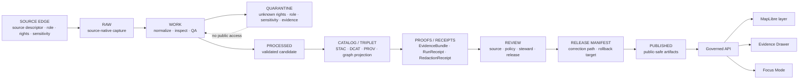

<!-- [KFM_META_BLOCK_V2]
doc_id: kfm://doc/TODO-register-fauna-control-plane
title: Fauna Control Plane
type: standard
version: v1
status: draft
owners: TODO(fauna-domain-stewards)
created: 2026-04-27
updated: 2026-05-07
policy_label: TODO(verify-public-or-restricted)
related: [README.md, SOURCE_ROLES.md, GEOPRIVACY.md, VALIDATION.md, MIGRATION_AND_CONTINUITY.md, runbooks/README.md, ../../../data/registry/fauna/README.md, ../../adr/ADR-0009-sensitive-location-policy.md]
tags: [kfm, fauna, control-plane, governance, stewardship, geoprivacy, source-role, validation]
notes: [Revises existing fauna control-plane stub; doc_id, owners, and policy_label remain TODO until steward and document-registry verification.]
[/KFM_META_BLOCK_V2] -->

<a id="top"></a>

# Fauna Control Plane

Single control surface for fauna-lane ownership, active risk, review cadence, source activation, release readiness, and fail-closed governance in Kansas Frontier Matrix.

<p>
  
  
  
  
  
  
</p>

> [!IMPORTANT]
> **Impact block**
>
> | Field | Value |
> |---|---|
> | Target path | `docs/domains/fauna/CONTROL_PLANE.md` |
> | Status | `draft` |
> | Owners | `TODO(fauna-domain-stewards)` |
> | Operating posture | Evidence-first; source-role-aware; rights-aware; geoprivacy-aware; validation-backed; rollback-ready |
> | Publication posture | Public-safe derivatives only; exact sensitive locations denied by default |
> | Activation posture | Fixture-first; live-source enablement only after source descriptor, rights review, sensitivity review, steward approval, and validation evidence |
> | Normal public path | Released artifacts and governed APIs only |
> | Forbidden public path | RAW, WORK, QUARANTINE, restricted geometry, direct source APIs, direct model runtime, unpublished candidates, and unreviewed derivatives |
> | Quick jumps | [Scope](#scope) · [Repo fit](#repo-fit) · [Accepted inputs](#accepted-inputs) · [Exclusions](#exclusions) · [Operating law](#operating-law) · [Stewardship](#stewardship-model) · [Decision registers](#decision-registers) · [Change gates](#change-control-gates) · [Review rhythm](#review-rhythm) · [Risk register](#active-risk-register) · [Release readiness](#release-readiness) · [Rollback triggers](#incident-and-rollback-triggers) · [Open verification](#open-verification) |

---

## Scope

This document keeps the fauna lane governable as it grows. It is the place maintainers check when a fauna change affects ownership, source activation, source roles, geoprivacy, validation, release posture, public exposure, Evidence Drawer behavior, Focus Mode behavior, migration, or rollback.

It preserves the existing control-plane intent:

- **Truth posture:** evidence-first; fail closed on unresolved rights, sensitivity, source role, or evidence.
- **Publication posture:** public-safe derivatives only.
- **Activation posture:** fixture-first; live-source enablement only after descriptor, rights, and steward approval.

### This document governs

| Area | Control-plane responsibility |
|---|---|
| Ownership | Names responsible steward roles, review backups, and cadence placeholders. |
| Source activation | Tracks when a source may move from idea to descriptor, fixture, internal use, release candidate, or public-safe release. |
| Source-role discipline | Ensures legal/status, conservation, taxonomy, occurrence, monitoring, habitat context, derived model, documentary, and steward-restricted sources are not collapsed. |
| Geoprivacy posture | Ensures sensitive exact geometry cannot reach public APIs, map layers, search, graph, screenshots, exports, Evidence Drawer, or Focus Mode. |
| Validation expectations | Requires proof for source role, rights, sensitivity, geometry, taxonomy, EvidenceBundle closure, catalog closure, public payloads, release, and rollback. |
| Release readiness | Keeps release gating, correction lineage, rollback targets, and public-safe artifact status visible. |
| Risk tracking | Maintains the active fauna-lane risk register and required mitigations. |
| Review ritual | Defines weekly, per-PR, per-release, and incident review patterns. |

### This document does not replace

| Companion | Primary responsibility |
|---|---|
| [README.md](README.md) | Domain overview, scope, repo fit, lifecycle, object families, quickstart, and review gates. |
| [SOURCE_ROLES.md](SOURCE_ROLES.md) | Canonical source-role taxonomy and claim compatibility. |
| [GEOPRIVACY.md](GEOPRIVACY.md) | Sensitive-location classes, public geometry behavior, redaction receipts, and leak prevention. |
| [VALIDATION.md](VALIDATION.md) | Gate matrix, fixture matrix, validator expectations, PR evidence, and release dry-run checks. |
| [MIGRATION_AND_CONTINUITY.md](MIGRATION_AND_CONTINUITY.md) | Prior-gain preservation, supersession mapping, migration protocol, non-regression, and rollback. |
| [runbooks/README.md](runbooks/README.md) | Operator runbook index for source verification, ingest, geoprivacy, promotion, rollback, API/UI smoke checks, and Focus Mode checks. |
| [../../../data/registry/fauna/README.md](../../../data/registry/fauna/README.md) | Registry posture for source descriptors, taxon authorities, sensitivity policies, domain partitions, and verification backlog. |
| [../../adr/ADR-0009-sensitive-location-policy.md](../../adr/ADR-0009-sensitive-location-policy.md) | Cross-domain sensitive-location decision posture. |

<p align="right"><a href="#top">Back to top ↑</a></p>

---

## Repo fit

`CONTROL_PLANE.md` belongs under `docs/domains/fauna/` because it is a human-facing domain governance document. It should explain how maintainers control the fauna lane; it should not contain raw data, executable policy, generated reports, live credentials, or release proof objects.

```text
docs/domains/fauna/
├── README.md
├── CONTROL_PLANE.md                  # this file
├── SOURCE_ROLES.md
├── GEOPRIVACY.md
├── VALIDATION.md
├── MIGRATION_AND_CONTINUITY.md
├── INGEST_EBIRD.md
├── runbooks/
└── sources/
```

### Responsibility-root placement

| Concern | Expected responsibility root | Control-plane rule |
|---|---|---|
| Human-facing domain governance | `docs/domains/fauna/` | Explain decisions, status, risk, and review obligations. |
| Machine-readable source admission | `data/registry/fauna/` | Store source descriptors and registry records after verification. |
| Semantic object meaning | `contracts/` or accepted contract home | Define object meaning; do not duplicate schema authority. |
| Machine validation shape | `schemas/` or accepted schema home | Version schemas and validate fixtures after ADR confirmation. |
| Policy-as-code | `policy/` or accepted policy home | Enforce allow, deny, restrict, abstain, and obligations. |
| Validator code | `tools/validators/` or accepted tool home | Emit machine-readable reports and fail closed. |
| Fixtures and tests | `tests/`, `fixtures/`, or accepted repo pattern | Prove positive and negative behavior. |
| Lifecycle data | `data/raw`, `data/work`, `data/quarantine`, `data/processed`, `data/catalog`, `data/published` | Keep lifecycle boundaries visible. |
| Receipts and proofs | `data/receipts`, `data/proofs`, `release/` | Keep process memory, proof support, and release decisions separate. |
| Runtime applications | `apps/`, `packages/`, or accepted repo pattern | Consume governed public-safe payloads only. |

> [!CAUTION]
> Do not create a root-level `fauna/` folder to solve a documentation, schema, data, source, policy, or release problem. Put fauna material under the correct responsibility root.

<p align="right"><a href="#top">Back to top ↑</a></p>

---

## Accepted inputs

This document accepts control-plane information that helps maintainers govern the fauna lane.

| Accepted input | Conditions |
|---|---|
| Stewardship assignments | Owner or reviewer placeholders are acceptable only when clearly marked `TODO` or `NEEDS VERIFICATION`. |
| Review cadence | Must specify weekly, per-PR, per-release, monthly, or incident-triggered cadence. |
| Active risk entries | Must include severity, trigger, mitigation, owner, status, and review cadence. |
| Source activation state | Must distinguish fixture-only, descriptor draft, rights review, steward review, internal-use, release-candidate, published-public-safe, suspended, and withdrawn. |
| Gate checklist changes | Must align with [SOURCE_ROLES.md](SOURCE_ROLES.md), [GEOPRIVACY.md](GEOPRIVACY.md), and [VALIDATION.md](VALIDATION.md). |
| Release readiness notes | Must name EvidenceBundle, policy decision, validation report, release manifest, correction path, and rollback target expectations. |
| Migration and continuity notes | Must preserve prior gains, old-to-new mappings, aliases, fixtures, and rollback. |
| Incident triggers | Must identify how to freeze, withdraw, correct, or roll back unsafe public outputs. |
| Open verification items | Must be concrete enough for a maintainer to resolve. |

<p align="right"><a href="#top">Back to top ↑</a></p>

---

## Exclusions

The control plane must not become a source store, proof store, policy engine, validator implementation, or public bypass.

| Excluded item | Correct handling | Why |
|---|---|---|
| RAW source records | `data/raw/fauna/` or accepted lifecycle home | Raw source data is not documentation. |
| WORK or QA intermediates | `data/work/fauna/` or accepted lifecycle home | Work artifacts are not public control-plane prose. |
| Quarantined records | `data/quarantine/fauna/` or restricted store | Quarantine may contain unresolved rights, source-role, or sensitivity concerns. |
| Exact sensitive coordinates | Restricted internal store only | Public documentation must never leak sensitive wildlife locations. |
| Source credentials or tokens | Secret manager or deployment-specific configuration | Secrets must not be committed to Markdown. |
| Machine schemas | Accepted schema home after ADR verification | Shape authority belongs in schemas, not prose. |
| Policy-as-code | Accepted `policy/` home | Policy must be executable and tested. |
| Validator implementation | Accepted validator home | Validators must emit reports and run in CI/tooling. |
| Generated validation reports | Build/report/proof output locations | Reports are artifacts, not source prose. |
| Release manifests or proof packs | `release/`, `data/proofs/`, or accepted release/proof roots | Release decisions and proof support remain separate. |
| Raw model output | Nowhere as evidence | AI output is interpretive and must be evidence-bounded. |

<p align="right"><a href="#top">Back to top ↑</a></p>

---

## Operating law

The fauna control plane applies KFM’s broader trust spine to wildlife, species, occurrence, range, habitat-support, source, public-layer, and Focus Mode work.

| Law | Fauna control-plane interpretation |
|---|---|
| Evidence first | No consequential fauna claim should publish unless EvidenceRef resolves to EvidenceBundle. |
| Cite or abstain | If evidence is missing, incompatible, stale, ambiguous, or policy-blocked, the correct outcome is `ABSTAIN`, `DENY`, `HOLD`, `QUARANTINE`, or `ERROR`, not a guessed answer. |
| Source roles are meaning | A source that supports occurrence evidence does not automatically support legal status, conservation rank, habitat proof, or public exact geometry. |
| Rights fail closed | Unknown rights, record-level licensing gaps, unclear redistribution, or missing attribution blocks public promotion. |
| Geoprivacy is a gate | Exact sensitive fauna locations deny public exposure by default. Public derivatives require approved transform and receipt. |
| Derived stays derived | Range maps, density grids, richness grids, habitat suitability, search indexes, graph projections, PMTiles, and AI summaries are carriers, not canonical truth. |
| Public clients use governed interfaces | Public UI, API, map layers, Evidence Drawer, and Focus Mode consume released artifacts and governed API envelopes only. |
| Promotion is governed | Publication requires validation, policy, review, catalog/proof closure, release manifest, correction path, and rollback target. |
| Corrections are first-class | Released fauna claims and artifacts must be correctable, withdrawable, supersedable, and auditable. |

### Lifecycle boundary



<p align="right"><a href="#top">Back to top ↑</a></p>

---

## Stewardship model

The current owners remain placeholders until repository governance confirms people or teams.

| Area | Default owner | Backup owner | Cadence | Current status | Required evidence |
|---|---|---|---|---:|---|
| Domain documentation | `TODO(fauna-doc-steward)` | `TODO` | Weekly | ACTIVE / DRAFT | Docs updated with behavior changes. |
| Source descriptors and registry | `TODO(fauna-source-steward)` | `TODO` | Weekly and per source activation | NEEDS VERIFICATION | Source role, rights, cadence, access class, sensitivity, and citation policy. |
| Geoprivacy policy | `TODO(fauna-policy-steward)` | `TODO` | Per PR and per release | NEEDS VERIFICATION | Public geometry class, redaction receipt, and deny fixtures. |
| Taxonomy and status mapping | `TODO(fauna-taxonomy-steward)` | `TODO` | Per source or schema change | NEEDS VERIFICATION | Taxon authority, synonym/crosswalk, ambiguity, and migration receipt. |
| Validation fixtures | `TODO(fauna-validation-steward)` | `TODO` | Per PR | ACTIVE / DRAFT | Positive and negative fixtures; validator reports. |
| API, layer, and Evidence Drawer payloads | `TODO(fauna-ui-api-steward)` | `TODO` | Per interface change | NEEDS VERIFICATION | Runtime envelopes, field allowlists, no restricted public fields. |
| Focus Mode / governed AI | `TODO(fauna-ai-steward)` | `TODO` | Per runtime behavior change | NEEDS VERIFICATION | Evidence-bounded context, citation validation, finite outcomes. |
| Release and rollback | `TODO(fauna-ops-steward)` | `TODO` | Per release | ACTIVE / DRAFT | Release manifest, rollback target, correction path, cache invalidation scope. |
| Migration and continuity | `TODO(fauna-continuity-steward)` | `TODO` | Per migration / refactor | ACTIVE / DRAFT | Old-to-new mapping, non-regression tests, rollback plan. |

### Stewardship packet

A fauna steward decision should record:

| Field | Required |
|---|---:|
| Decision ID or review record | YES |
| Domain scope | YES |
| Source or artifact scope | YES |
| Source role | YES when source-backed |
| Rights status | YES when public or semi-public |
| Sensitivity class | YES when location-bearing |
| EvidenceBundle or EvidenceRef | YES when claim-bearing |
| Policy decision | YES when release or runtime-facing |
| Release impact | YES / NO |
| Rollback impact | YES / NO |
| Follow-up owner | YES |
| Review expiration or next check | YES when source freshness or policy review matters |

<p align="right"><a href="#top">Back to top ↑</a></p>

---

## Decision registers

The control plane should keep a compact index of active decisions. Detailed decisions belong in their owning docs, registry files, ADRs, policies, release objects, or runbooks.

| Decision class | Owning surface | Update trigger | Required outcome |
|---|---|---|---|
| Source role assignment | [SOURCE_ROLES.md](SOURCE_ROLES.md) + `data/registry/fauna/` | New source, changed source, changed claim scope | Role is declared, scoped, and validator-compatible. |
| Source activation | [../../../data/registry/fauna/README.md](../../../data/registry/fauna/README.md) | Source moves beyond idea or fixture | Descriptor, rights, sensitivity, cadence, and review state recorded. |
| Geoprivacy exception | [GEOPRIVACY.md](GEOPRIVACY.md) + [ADR-0009](../../adr/ADR-0009-sensitive-location-policy.md) | Exact or near-exact public geometry requested | Deny by default unless explicit public-safe approval exists. |
| Taxonomy resolution | Registry + validation reports | Synonym, rank, accepted-name, or authority changes | Deterministic key and migration receipt or HOLD / ABSTAIN. |
| Schema-home change | `docs/adr/ADR-fauna-schema-home.md` or repo-accepted ADR | Machine schemas added or moved | One canonical home; no parallel schema authority. |
| Public layer release | LayerManifest + ReleaseManifest | New or changed public fauna layer | Field allowlist, public geometry class, evidence, policy, review, rollback. |
| Evidence Drawer contract | API/UI docs and validation | Drawer fields or payload shape changes | Source role, rights, sensitivity, evidence, release, and correction visible. |
| Focus Mode behavior | Runtime contract + validation | New prompt, response, or context behavior | Evidence-bounded ANSWER / ABSTAIN / DENY / ERROR. |
| Correction or rollback | Release objects + runbooks | Release defect, source issue, sensitive leak, broken evidence | CorrectionNotice, rollback receipt, cache invalidation, non-regression fixture. |
| Migration / supersession | [MIGRATION_AND_CONTINUITY.md](MIGRATION_AND_CONTINUITY.md) | Paths, IDs, schemas, layer IDs, API shapes, fixtures, or releases change | Old-to-new map, validation evidence, rollback plan. |

<p align="right"><a href="#top">Back to top ↑</a></p>

---

## Source activation states

Use this table to keep source maturity visible.

| State | Meaning | Public release allowed? | Required next proof |
|---|---|---:|---|
| `IDEA_ONLY` | Source is mentioned but not described. | No | Create descriptor draft or backlog entry. |
| `DESCRIPTOR_DRAFT` | Source identity and intended role are drafted. | No | Verify source role, rights, cadence, attribution, sensitivity, and access class. |
| `RIGHTS_REVIEW` | Source terms or record-level rights need review. | No | Resolve rights or quarantine source. |
| `SENSITIVITY_REVIEW` | Source may include protected or exact sensitive locations. | No | Assign sensitivity policy and public geometry behavior. |
| `FIXTURE_ONLY` | Synthetic/no-network fixture exists for validation. | No production publication | Validate schema, source role, geoprivacy, EvidenceBundle, runtime envelope. |
| `INTERNAL_RESTRICTED` | Internal analysis or steward review only. | No public release | Produce public-safe derivative or deny. |
| `RELEASE_CANDIDATE` | Public-safe candidate assembled. | Not yet | Run full promotion dry-run and review. |
| `PUBLISHED_PUBLIC_SAFE` | Governed release approved. | Yes, within release scope | Monitor freshness, correction, and rollback readiness. |
| `SUSPENDED` | Source or derived release is paused due to issue. | No new promotion | Resolve incident or supersede. |
| `WITHDRAWN` | Public release withdrawn or superseded. | No | CorrectionNotice and rollback receipt remain auditable. |

> [!WARNING]
> Live connectors must not skip `DESCRIPTOR_DRAFT`, `RIGHTS_REVIEW`, `SENSITIVITY_REVIEW`, and fixture validation just because an API is technically reachable.

<p align="right"><a href="#top">Back to top ↑</a></p>

---

## Change-control gates

A fauna change is merge-ready only when all applicable gates are satisfied or explicitly marked `HOLD` / `NEEDS VERIFICATION`.

### Required gates

- [ ] **Repo evidence gate:** target paths, neighboring docs, and affected roots are inspected in the active branch.
- [ ] **Metadata gate:** KFM Meta Block V2 is present and placeholders are intentional.
- [ ] **Owner gate:** steward owner and reviewer placeholders are visible, or verified owner references are present.
- [ ] **Source-role gate:** source role is explicit and compatible with claim type.
- [ ] **Rights gate:** rights and redistribution posture are documented.
- [ ] **Sensitivity gate:** sensitivity class and public geometry class are assigned.
- [ ] **Geoprivacy gate:** restricted exact geometry cannot reach public outputs.
- [ ] **Evidence gate:** EvidenceRefs resolve to EvidenceBundles before public claims, drawers, exports, or Focus answers.
- [ ] **Validation gate:** validation reports or fixture outcomes are attached or referenced.
- [ ] **Catalog/proof gate:** catalog/proof/release objects remain separate and cross-linked.
- [ ] **Runtime gate:** API and Focus outputs use finite outcomes and cannot bypass policy.
- [ ] **Continuity gate:** prior docs, schemas, fixtures, policies, IDs, layers, and releases are preserved, migrated, or superseded with mapping.
- [ ] **Rollback gate:** publish-affecting changes include rollback target and correction path.
- [ ] **Docs synchronization gate:** affected companion docs are updated together or a reviewable reason is recorded.

### Gate evidence table

| Gate | Evidence to attach in PR | Blocks when |
|---|---|---|
| Source role | SourceDescriptor, role mapping, compatibility check | Unknown role or source used outside authority scope. |
| Rights | License/terms review, attribution, redistribution class | Unknown or incompatible rights. |
| Geoprivacy | Sensitivity class, public geometry class, redaction receipt | Exact sensitive geometry, missing transform receipt, reverse-engineering risk. |
| Evidence | EvidenceBundle validation report | Missing, stale, or unresolved EvidenceRef. |
| Runtime | API/Focus fixture and response envelope | Unsupported `ANSWER`, uncited claim, hidden `DENY`, restricted field leak. |
| Release | ReleaseManifest, PromotionDecision, RollbackCard | Missing rollback target, proof gap, catalog break. |
| Continuity | Supersession map and non-regression tests | Silent deletion, ID repurpose, untested migration. |

<p align="right"><a href="#top">Back to top ↑</a></p>

---

## Review rhythm

### Weekly fauna governance triage

Use a 30-minute cadence while the lane is experimental.

| Agenda item | Output |
|---|---|
| Review new source descriptor drafts | Update activation state and backlog. |
| Review unresolved rights and source-role questions | Assign owner and due date. |
| Review geoprivacy exceptions or sensitive-location questions | Confirm deny, hold, or approved public-safe transform. |
| Review validation failures and negative fixtures | Add regression item or update validator expectation. |
| Review release candidates | Confirm evidence, catalog, proof, review, and rollback readiness. |
| Review open corrections or rollback risks | Assign incident or correction owner. |

### Per-PR review

A fauna PR must include:

- goal and affected roots;
- Directory Rules basis for new or moved files;
- source-role impact;
- rights and sensitivity impact;
- evidence impact;
- validation report links or fixture outcomes;
- public exposure assessment;
- rollback plan;
- open `UNKNOWN` / `NEEDS VERIFICATION` items.

### Per-release review

A fauna release candidate must include:

- release scope;
- public geometry class;
- source descriptor references;
- EvidenceBundle references;
- catalog/proof closure;
- validation summary;
- policy decision;
- review record;
- release manifest;
- rollback card;
- correction path;
- cache/index invalidation plan.

### Incident review

Trigger incident review for sensitive leak risk, source-role misuse, rights conflict, broken evidence closure, incorrect release alias, public payload leak, or Focus Mode overreach.

<p align="right"><a href="#top">Back to top ↑</a></p>

---

## Active risk register

| Risk | Severity | Trigger | Mitigation | Owner | Status |
|---|---:|---|---|---|---:|
| Sensitive location exposure | High | Exact protected coordinates, nest/den/roost/hibernacula/spawning, telemetry, steward site, or source locality reaches public surface | Fail-closed geoprivacy validation, public field allowlists, redaction receipts, release review | `TODO` | ACTIVE |
| Source-role collapse | High | Aggregator, habitat context, model output, or documentary source used as legal/status or occurrence authority beyond scope | Enforce source-role compatibility and negative fixtures | `TODO` | ACTIVE |
| Rights ambiguity | High | Unknown source terms, record-level license, redistribution, attribution, or media rights at promotion time | HOLD / QUARANTINE until rights resolved | `TODO` | ACTIVE |
| Taxonomy drift | Medium | Synonym, rank, accepted name, authority version, or taxon concept changes | Deterministic taxon key, taxon resolution receipt, migration map | `TODO` | ACTIVE |
| Untracked public release | High | Manual artifact publish, layer alias change, API snapshot, export, or map tile without release manifest | Release dry-run, manifest, rollback card, correction path | `TODO` | ACTIVE |
| Validation toolchain mismatch | Medium | Docs name validators or commands that the repo has not implemented | Mark commands PROPOSED, verify toolchain, align CI and docs | `TODO` | NEEDS VERIFICATION |
| Documentation drift | Medium | Companion docs disagree on source roles, geoprivacy, validation, schema home, or release gates | Weekly doc drift review and companion-doc update rule | `TODO` | ACTIVE |
| Focus Mode overreach | High | AI answer infers occurrence, legal status, exact location, or sensitive detail without compatible released evidence | Evidence-bounded runtime, citation validation, finite negative outcomes | `TODO` | ACTIVE |
| Registry under-specification | High | Source descriptor lacks role, rights, cadence, sensitivity, or authority scope | Registry validator and source activation states | `TODO` | ACTIVE |
| Rollback unreadiness | High | Public release lacks rollback target, cache invalidation scope, or correction path | Release checklist and rollback drill | `TODO` | ACTIVE |

<p align="right"><a href="#top">Back to top ↑</a></p>

---

## Release readiness

A fauna release candidate is ready for review only when the following support exists.

| Readiness area | Required support | Failure outcome |
|---|---|---|
| Source admission | Source descriptors include role, rights, cadence, access class, attribution, geoprivacy, and authority scope. | HOLD / DENY |
| Source-role compatibility | Each claim is compatible with its source roles. | DENY or ABSTAIN |
| Taxonomy | Taxon identity, synonym/crosswalk, authority version, and ambiguity state are resolved. | HOLD / ABSTAIN |
| Occurrence and monitoring | Geometry, CRS, precision, event time, method/effort, and provenance are valid. | DENY / QUARANTINE |
| Public geometry | Public geometry class assigned; restricted exact geometry removed or withheld. | DENY |
| Redaction receipt | Public generalization, aggregation, delay, suppression, or field removal is receipted. | DENY |
| Evidence closure | EvidenceRefs resolve to EvidenceBundles with rights, sensitivity, limitations, review, and release state. | ABSTAIN / DENY |
| Catalog closure | STAC/DCAT/PROV/catalog matrix links are present where applicable. | HOLD / DENY |
| Public payloads | API, layer, search, graph, export, drawer, and Focus payloads contain only allowed fields. | DENY |
| Policy decision | Allow/deny/restrict/abstain obligations are machine-readable or reviewable. | HOLD / DENY |
| Release manifest | Artifact set, digests, release scope, review, correction, and rollback target are present. | DENY |
| Rollback path | Previous known-good target or safe withdrawal path exists. | DENY |

<p align="right"><a href="#top">Back to top ↑</a></p>

---

## Incident and rollback triggers

Rollback is a governed state transition. It is not deletion, concealment, or manual replacement.

| Trigger | Immediate action | Required follow-up |
|---|---|---|
| Sensitive exact geometry exposed | Freeze public artifact; withdraw or repoint release alias; invalidate caches | CorrectionNotice, rollback receipt, geoprivacy fixture, release review |
| Source-role misuse released | Mark affected claims invalid or abstained; freeze dependent outputs | Source-role fix, non-regression fixture, correction notice |
| Unknown or incompatible rights discovered | Suspend source and dependent public outputs | Rights review, revised descriptor, release supersession or withdrawal |
| Taxonomy migration error | Stop dependent claims and layers | Taxon migration receipt, old-to-new map, rebuilt EvidenceBundles |
| Broken EvidenceBundle link | Runtime returns `ABSTAIN` or release is held | Rebuild or supersede bundle; update catalog/proof closure |
| Public payload leak | Disable affected API/layer/search/graph/export/Focus surface | Public-safety validator fixture and corrected release |
| Release manifest mismatch | Hold or withdraw release candidate | Recompute digests, regenerate manifest, rerun promotion dry-run |
| Focus Mode restricted output | Disable affected Focus action | Citation/policy fixture, AI receipt review, prompt/context boundary fix |

### Rollback checklist

- [ ] Identify release ID, layer ID, API surface, EvidenceBundle, source descriptor, and affected artifact set.
- [ ] Identify previous known-good release or safe withdrawn state.
- [ ] Repoint public aliases or disable affected surface.
- [ ] Invalidate API, tile, search, graph, EvidenceBundle, Evidence Drawer, and Focus caches where applicable.
- [ ] Emit rollback receipt.
- [ ] Emit CorrectionNotice when public users may have relied on bad output.
- [ ] Preserve failed release evidence for audit.
- [ ] Add negative fixture for the failure.
- [ ] Update [VALIDATION.md](VALIDATION.md), [GEOPRIVACY.md](GEOPRIVACY.md), and [MIGRATION_AND_CONTINUITY.md](MIGRATION_AND_CONTINUITY.md) if the incident revealed a missing gate.

<p align="right"><a href="#top">Back to top ↑</a></p>

---

## Control-plane dashboard

Use this table as a compact status surface until a machine-readable control-plane register exists.

| Control area | Current status | Owner | Next action |
|---|---:|---|---|
| Document metadata | TODO placeholders remain | `TODO` | Register `doc_id`, owners, and policy label. |
| Source registry | PARTIAL / NEEDS VERIFICATION | `TODO` | Confirm registry files and source descriptor schema. |
| Source roles | DRAFT / ACTIVE | `TODO` | Keep role compatibility aligned with validators and source docs. |
| Geoprivacy policy | DRAFT / NEEDS VERIFICATION enforcement | `TODO` | Verify sensitive-location policy and public geometry thresholds. |
| Validation gates | DRAFT / NEEDS VERIFICATION execution | `TODO` | Confirm validator commands, report paths, policy runner, CI wiring. |
| Runbooks | INDEX CONFIRMED / child runbooks PROPOSED | `TODO` | Verify runbook inventory and decide domain-local vs root runbook aliases. |
| Schema home | CONFLICTED / NEEDS VERIFICATION | `TODO` | Resolve or link schema-home ADR. |
| Live source connectors | BLOCKED | `TODO` | Keep fixture-first until rights, sensitivity, source role, and steward review pass. |
| Release dry-run | PROPOSED / NEEDS VERIFICATION | `TODO` | Prove synthetic release bundle and rollback target. |
| Evidence Drawer / Focus Mode | PROPOSED / NEEDS VERIFICATION | `TODO` | Validate finite outcomes and no restricted field leakage. |
| Public fauna layers | PROPOSED / NEEDS VERIFICATION | `TODO` | Require layer manifest, public field allowlist, and release manifest before exposure. |

<p align="right"><a href="#top">Back to top ↑</a></p>

---

## Maintainer checklists

### Weekly triage checklist

- [ ] Review new or changed source descriptors.
- [ ] Review source-role conflicts or missing roles.
- [ ] Review rights unknowns and license changes.
- [ ] Review sensitive geometry or public geometry exceptions.
- [ ] Review taxonomy ambiguity and migration items.
- [ ] Review validation failures and fixture gaps.
- [ ] Review release candidates and rollback readiness.
- [ ] Review documentation drift across companion files.
- [ ] Assign owners for every unresolved high-risk item.

### PR checklist

- [ ] Paths are under correct responsibility roots.
- [ ] Related companion docs are updated or intentionally not affected.
- [ ] Source role and rights are explicit.
- [ ] Public geometry class is explicit.
- [ ] No restricted exact geometry reaches public surfaces.
- [ ] EvidenceRefs resolve or runtime abstains.
- [ ] Validation evidence is attached.
- [ ] Release impact is identified.
- [ ] Rollback target is documented for publish-facing changes.
- [ ] Open verification items are listed.

### Release checklist

- [ ] Source descriptors pass.
- [ ] Taxonomy and status mapping pass.
- [ ] Occurrence and monitoring validation pass.
- [ ] Geoprivacy validation pass.
- [ ] Public payload validation passes across API, layer, search, graph, export, drawer, and Focus surfaces.
- [ ] EvidenceBundle closure passes.
- [ ] Catalog/proof closure passes.
- [ ] Policy decision is recorded.
- [ ] Review state is recorded.
- [ ] Release manifest exists.
- [ ] Rollback card exists.
- [ ] Correction path exists.

<p align="right"><a href="#top">Back to top ↑</a></p>

---

## Open verification

| Item | Status | Needed proof |
|---|---:|---|
| Registered `doc_id` | TODO | Document registry entry for `kfm://doc/<uuid>`. |
| Owners | TODO | CODEOWNERS, governance registry, or steward assignment. |
| Policy label | TODO | Repo policy classification decision. |
| Companion link inventory | NEEDS VERIFICATION | Confirm all related links remain valid after merge. |
| Schema home | CONFLICTED / NEEDS VERIFICATION | Accepted ADR resolving machine schema home and compatibility aliases. |
| Validator entrypoint | NEEDS VERIFICATION | Repo-native validator files, commands, reports, and CI integration. |
| Policy runner | NEEDS VERIFICATION | OPA/Conftest/Rego or repo-native policy runner version and fixture layout. |
| Release/proof implementation | NEEDS VERIFICATION | ReleaseManifest, ProofPack, PromotionDecision, RollbackCard, CorrectionNotice paths and schemas. |
| Source descriptor inventory | NEEDS VERIFICATION | Existing `data/registry/fauna/*` files and machine schema status. |
| Sensitive public geometry thresholds | NEEDS VERIFICATION | Approved grid/county/HUC/bbox/withheld-count/embargo rules. |
| Live source activation | BLOCKED / NEEDS VERIFICATION | Verified source terms, rights, source role, access class, steward review, and no-network fixture success. |
| Public exact exception process | NEEDS VERIFICATION | Defined approver, policy decision, review record, and release proof. |
| API/UI/Focus implementation | UNKNOWN | Route tree, layer registry, Evidence Drawer payloads, Focus Mode envelopes, and negative state tests. |
| Runbook final homes | NEEDS VERIFICATION | Decide whether runbooks remain domain-local, root-level, or linked by compatibility aliases. |

<p align="right"><a href="#top">Back to top ↑</a></p>

---

## Appendix

<details>
<summary>Minimum fauna PR review card</summary>

```text
Goal:
Owning root(s):
Directory Rules basis:
Files changed:
Companion docs updated:
Object families affected:
Source roles affected:
Rights/sensitivity impact:
Public geometry impact:
EvidenceRef/EvidenceBundle impact:
API/UI/Focus impact:
Release/correction/rollback impact:
Validation commands run:
Validation report refs:
Open UNKNOWN / NEEDS VERIFICATION:
Rollback plan:
```

</details>

<details>
<summary>Control-plane reason-code starter set</summary>

| Code | Meaning |
|---|---|
| `source_role.missing` | Source role is absent. |
| `source_role.incompatible` | Source role does not support requested claim. |
| `rights.unknown` | Rights or redistribution posture is unresolved. |
| `sensitivity.unclassified` | Sensitivity class is missing. |
| `geoprivacy.exact_sensitive_geometry` | Public output would expose restricted precision. |
| `redaction.receipt_missing` | Public-safe transform lacks receipt. |
| `evidence.bundle_missing` | EvidenceRef cannot resolve to EvidenceBundle. |
| `taxonomy.ambiguous` | Taxon resolution has multiple plausible mappings. |
| `release.rollback_missing` | Publish-facing change lacks rollback target. |
| `runtime.uncited_answer` | Runtime answer lacks required citation/evidence support. |
| `continuity.mapping_missing` | Migration or supersession lacks old-to-new map. |
| `catalog.closure_missing` | Catalog/proof/release references do not close. |

</details>

<details>
<summary>Minimum source activation packet</summary>

```yaml
source_id: TODO
source_title: TODO
publisher: TODO
source_role: TODO
authority_scope:
  can_support:
    - TODO
  cannot_support:
    - TODO
rights:
  status: TODO
  redistribution: TODO
  attribution_required: TODO
access:
  class: TODO
  method: TODO
  secrets_required: false
cadence:
  expected_update: TODO
  freshness_policy: TODO
sensitivity:
  default_class: TODO
  source_geoprivacy_applies: TODO
  steward_review_required: TODO
evidence_policy:
  evidence_ref_required: true
  evidence_bundle_required_for_public_claims: true
validation:
  current_state: DESCRIPTOR_DRAFT
  last_verified: TODO
  next_review: TODO
  blockers:
    - TODO
release:
  public_release_allowed: false
  release_conditions:
    - TODO
```

</details>

<details>
<summary>Control-plane update triggers</summary>

Update this file when any of the following change:

- steward ownership or CODEOWNERS coverage;
- source activation state vocabulary;
- source-role policy;
- geoprivacy class or public geometry behavior;
- validation gate names, commands, or report paths;
- schema-home ADR or compatibility alias;
- registry file layout;
- API, layer, Evidence Drawer, or Focus runtime envelope;
- release manifest, proof, receipt, correction, or rollback object family;
- public layer publication posture;
- incident response or rollback procedure;
- open verification item is resolved or newly discovered.

</details>

<p align="right"><a href="#top">Back to top ↑</a></p>